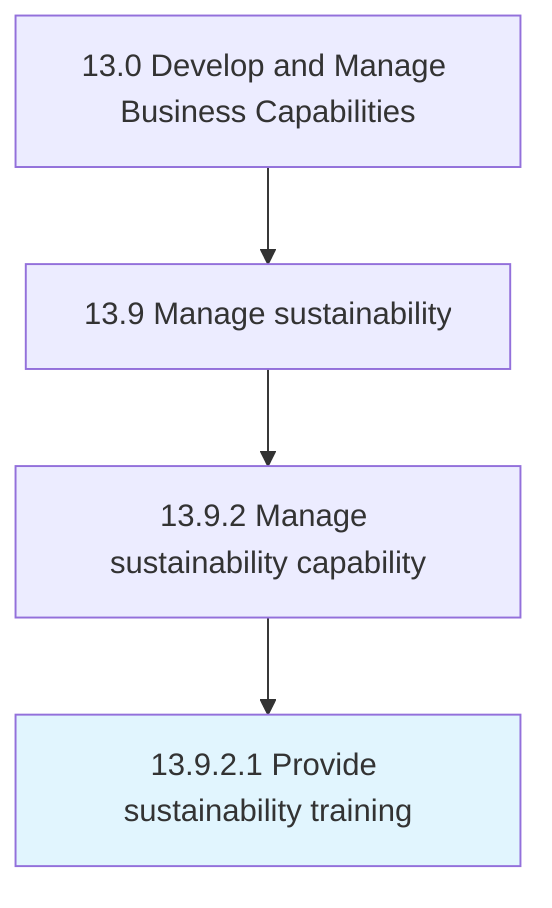

# Provide sustainability training

> Providing sustainability training and awareness.

## Overview

Activity 13.9.2.1 is an activity within the Develop and Manage Business Capabilities framework. 

Providing sustainability training and awareness. Plan, prepare, and oversee delivery of sustainability education and enablement activities.

## Process Hierarchy



## Key Statistics

| Metric | Value |
|--------|-------|
| APQC Code | 21599 |
| Hierarchy ID | 13.9.2.1 |
| Level | Activity |
| Parent | [13.9.2](../) |
| Sub-Processes | 0 |


## GraphDL Semantic Structure

```
provide.SustainabilityTraining
```

| Component | Value | Description |
|-----------|-------|-------------|
| Verb | `provide` | Primary action |
| Object | `sustainability training` | Direct object |


## Related Concepts

- SustainabilityTraining


---

*Source: APQC PCF 21599 (13.9.2.1) - APQC*
