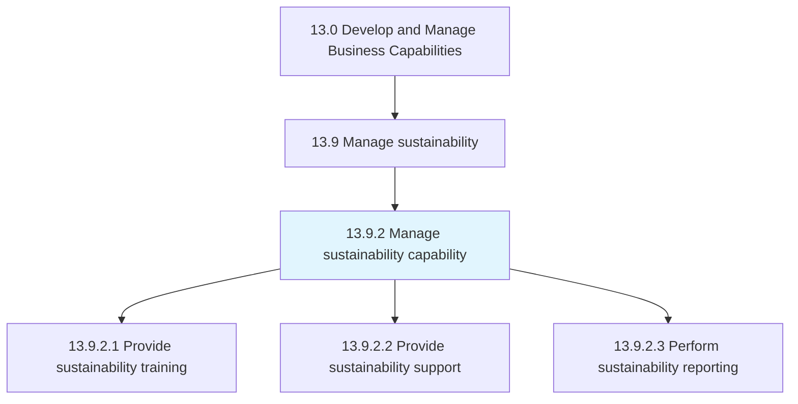
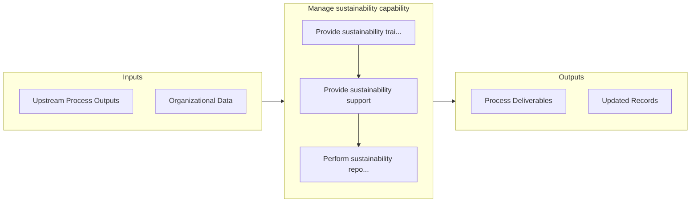

# Manage sustainability capability

> Managing sustainability across the organization.

## Overview

Process 13.9.2 is a core process that defines the specific procedures for manage sustainability capability. 

Managing sustainability across the organization. Provide training, support, reporting, and oversight to the distributed sustainability efforts across functional units and support services.

## Process Hierarchy



## Key Statistics

| Metric | Value |
|--------|-------|
| APQC Code | 21598 |
| Hierarchy ID | 13.9.2 |
| Level | Process |
| Parent | [13.9](../) |
| Sub-Processes | 3 |


## GraphDL Semantic Structure

```graphdl
manage.SustainabilityCapability
```

| Component | Value | Description |
|-----------|-------|-------------|
| Verb | `manage` | Primary action |
| Object | `sustainability capability` | Direct object |


## Process Flow



## Sub-Processes

| Process | Hierarchy ID | Description |
|---------|-------------|-------------|
| [Provide sustainability training](./ProvideSustainabilityTraining) | 13.9.2.1 | Providing sustainability training and awareness |
| [Provide sustainability support](./ProvideSustainabilitySupport) | 13.9.2.2 | Providing support for sustainability activities |
| [Perform sustainability reporting](./13.9.2.3-PerformSustainabilityReporting/) | 13.9.2.3 | Conducting and supporting sustainability reporting |


## Related Concepts

- SustainabilityCapability


---

*Source: APQC PCF 21598 (13.9.2) - APQC*
