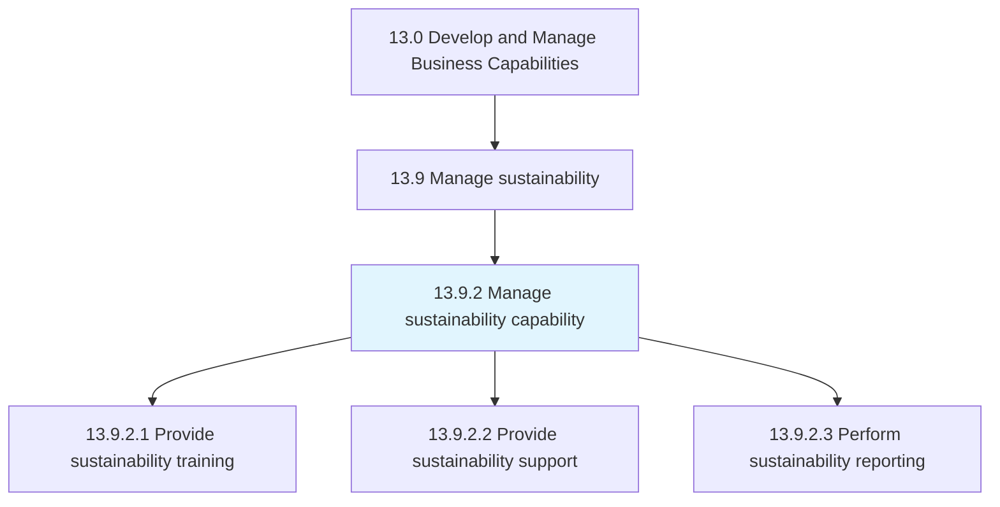
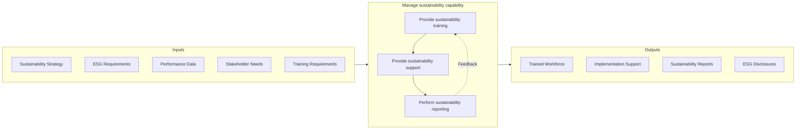

# Manage sustainability capability

> Managing sustainability across the organization.

## Overview

Process 13.9.2 is a core process that defines the specific procedures for managing sustainability capabilities across the organization. Building on the capabilities developed in 13.9.1, this process provides the ongoing training, support, reporting, and oversight needed to execute sustainability initiatives effectively.

Sustainability capability management ensures that ESG responsibilities are embedded throughout the organization, not just in a centralized sustainability function. It provides the training, tools, and support that enable employees at all levels to contribute to sustainability goals. Regular reporting maintains visibility and accountability for sustainability performance.

This process creates the operational infrastructure for sustainability execution, connecting strategy to action through distributed implementation supported by centralized expertise and coordination. Effective sustainability capability management requires cross-functional collaboration and integration with core business processes.

## Process Hierarchy



## Key Statistics

| Metric | Value |
|--------|-------|
| APQC Code | 21598 |
| Hierarchy ID | 13.9.2 |
| Level | Process |
| Parent | [13.9](../) |
| Sub-Processes | 3 |


## GraphDL Semantic Structure

```graphdl
manage.SustainabilityCapability
```

| Component | Value | Description |
|-----------|-------|-------------|
| Verb | `manage` | Primary action |
| Object | `sustainability capability` | Direct object |


## Process Flow



## Child Processes

### 13.9.2.1 Provide Sustainability Training

Providing sustainability training and awareness across the organization. This activity ensures that employees understand their role in sustainability and have the knowledge to contribute effectively.

**Key Activities:**
- Develop sustainability awareness programs
- Create role-specific sustainability training
- Deliver sustainability onboarding for new employees
- Provide specialized training for sustainability roles
- Track and report training completion

[View Process Details](./ProvideSustainabilityTraining)

### 13.9.2.2 Provide Sustainability Support

Providing support for sustainability activities across functional units. This activity enables distributed implementation by providing expertise, tools, and guidance to business units.

**Key Activities:**
- Provide sustainability consulting to business units
- Support sustainability initiative implementation
- Offer technical assistance on ESG topics
- Facilitate best practice sharing
- Resolve sustainability-related issues

[View Process Details](./ProvideSustainabilitySupport)

### 13.9.2.3 Perform Sustainability Reporting

Conducting and supporting sustainability reporting for internal and external stakeholders. This activity creates the disclosures and reports that communicate sustainability performance.

**Key Activities:**
- Collect and validate sustainability data
- Prepare sustainability/ESG reports
- Complete regulatory sustainability disclosures
- Respond to ESG rating questionnaires
- Report progress against sustainability goals

[View Process Details](./13.9.2.3-PerformSustainabilityReporting/)


## RACI Matrix

| Activity | Responsible | Accountable | Consulted | Informed |
|----------|-------------|-------------|-----------|----------|
| Develop training programs | Training Team | Sustainability Director | HR | All employees |
| Deliver sustainability training | Trainers | Sustainability Manager | Department Heads | Participants |
| Provide sustainability support | Sustainability Team | Sustainability Director | Business Units | Executive team |
| Collect sustainability data | Data Analysts | Sustainability Manager | Operations, IT | Reporting team |
| Prepare sustainability reports | Sustainability Analyst | Sustainability Director | Finance, Legal | Stakeholders |
| Complete ESG disclosures | Sustainability Team | Sustainability Director | External auditors | Investors |
| Respond to ESG ratings | Sustainability Analyst | Sustainability Manager | Various departments | Executive team |


## Metrics and KPIs

| Metric | Description | Target |
|--------|-------------|--------|
| Training Completion Rate | Employees completing sustainability training | 100% |
| Training Effectiveness | Post-training knowledge assessment scores | >85% |
| Support Request Resolution | Time to resolve sustainability support requests | <48 hours |
| Data Quality Score | Accuracy of sustainability data | >98% |
| Report Timeliness | Sustainability reports delivered on schedule | 100% |
| ESG Rating Score | Third-party ESG rating performance | Top quartile |
| Stakeholder Satisfaction | Satisfaction with sustainability reporting | >4.0/5.0 |
| Goal Progress | Progress against sustainability targets | On track |


## Related Departments

- [Sustainability](/departments/Sustainability) - Sustainability program ownership
- [Human Resources](/departments/HR) - Training integration
- [Finance](/departments/Finance) - ESG reporting and disclosure
- [Communications](/departments/Communications) - Sustainability communication
- [Operations](/departments/Operations) - Sustainability implementation


## Related Occupations

- [Sustainability Specialists](/occupations/Business/SustainabilitySpecialists) - Program management
- [Training and Development Specialists](/occupations/HR/TrainingSpecialists) - Sustainability training
- [Financial Analysts](/occupations/Finance/FinancialAnalysts) - ESG reporting
- [Technical Writers](/occupations/Communications/TechnicalWriters) - Report preparation
- [Data Analysts](/occupations/Business/DataAnalysts) - Sustainability data management


## Industry Variations

### Financial Services

Financial services sustainability management focuses on ESG integration in investment decisions, sustainable finance products, and financed emissions reporting. Training addresses responsible banking and investing principles.

### Manufacturing

Manufacturing sustainability management emphasizes operational efficiency, waste reduction, and supply chain sustainability. Training focuses on shop floor environmental practices and resource conservation.

### Retail

Retail sustainability management addresses product sustainability, packaging, and ethical sourcing. Training includes sustainable product attributes and customer engagement on sustainability.

### Energy

Energy sector sustainability management centers on energy transition, decarbonization, and community engagement. Training addresses renewable energy, emissions reduction, and just transition principles.


## Sustainability Reporting Frameworks

Reports may align with established standards:

- **GRI Standards** - Comprehensive sustainability reporting
- **SASB Standards** - Industry-specific disclosure
- **TCFD** - Climate-related financial disclosures
- **CDP** - Environmental disclosure questionnaires
- **UN Global Compact** - Communication on Progress
- **Integrated Reporting (IR)** - Financial and non-financial integration


## Training Topics

Sustainability training typically covers:

- **Awareness** - Why sustainability matters
- **Strategy** - Organization's sustainability commitments
- **Role-Specific** - How each role contributes
- **Technical** - Specific sustainability practices
- **Reporting** - Data collection and disclosure
- **Compliance** - Regulatory requirements


---

*Source: APQC PCF 21598 (13.9.2) - APQC*
