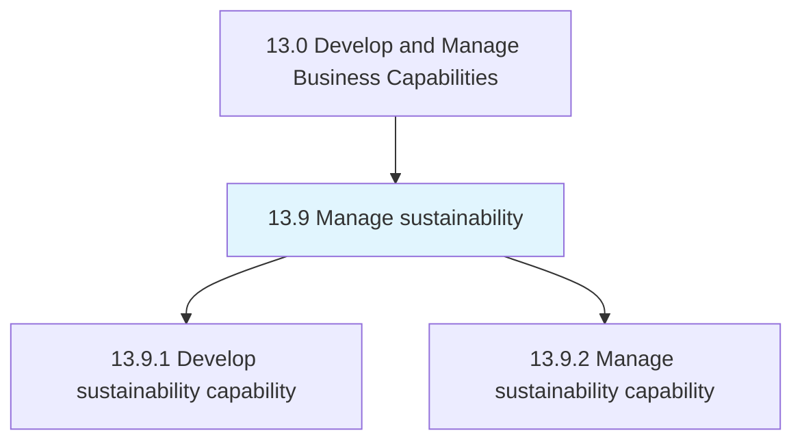
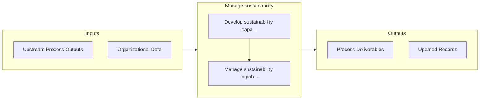

# Manage sustainability

> Developing and managing sustainability practices for the organization.

## Overview

Group 13.9 is a process group within APQC Category 13.0 (Develop and Manage Business Capabilities). 

Developing and managing sustainability practices for the organization. Ensure proper understanding and communication of ESG standards, requirements, capabilities, and future trends. Promote awareness, alignment, and continuity.

## Process Hierarchy



## Key Statistics

| Metric | Value |
|--------|-------|
| APQC Code | 21588 |
| Hierarchy ID | 13.9 |
| Level | Group |
| Parent | [13](../) |
| Sub-Processes | 2 |


## GraphDL Semantic Structure

```graphdl
manage.Sustainability
```

| Component | Value | Description |
|-----------|-------|-------------|
| Verb | `manage` | Primary action |
| Object | `sustainability` | Direct object |


## Process Flow



## Sub-Processes

| Process | Hierarchy ID | Description |
|---------|-------------|-------------|
| [Develop sustainability capability](./13.9.1-DevelopSustainabilityCapability/) | 13.9.1 | Developing sustainability (ESG) capabilities for the organization |
| [Manage sustainability capability](./13.9.2-ManageSustainabilityCapability/) | 13.9.2 | Managing sustainability across the organization |


## Related Concepts

- Sustainability


---

*Source: APQC PCF 21588 (13.9) - APQC*
