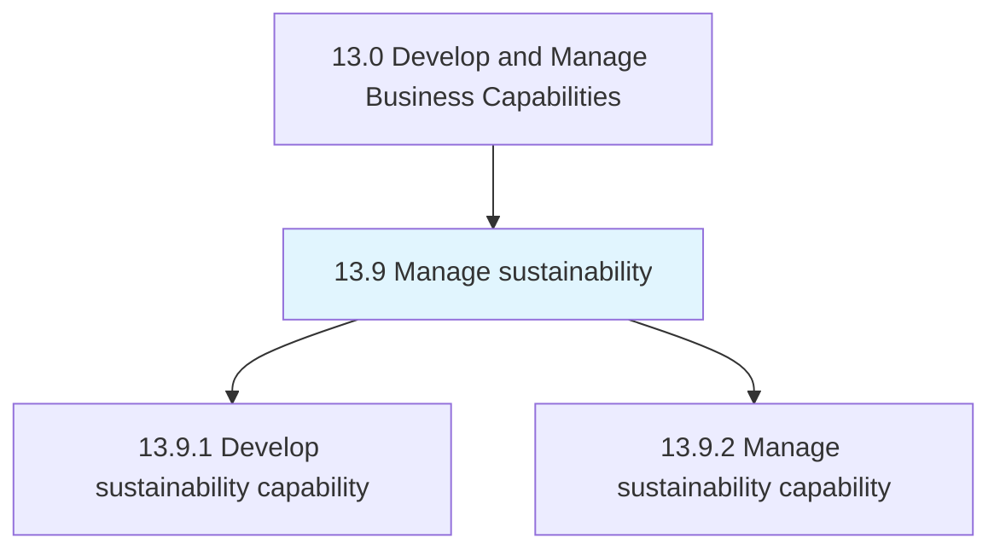
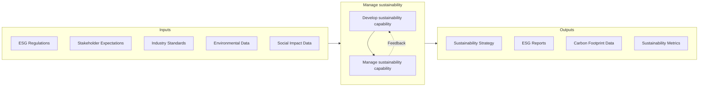
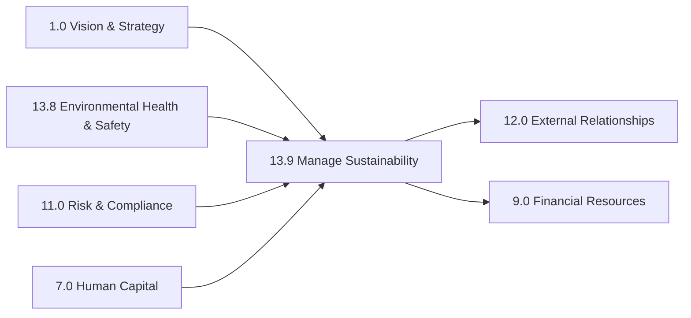

# Manage sustainability

> Developing and managing sustainability practices for the organization.

## Overview

Group 13.9 is a process group within APQC Category 13.0 (Develop and Manage Business Capabilities) that establishes the organizational capability to systematically address Environmental, Social, and Governance (ESG) responsibilities. As stakeholders increasingly demand accountability for sustainability performance, this process group provides the framework for developing, implementing, and reporting on sustainability initiatives across the enterprise.

Sustainability management encompasses the full spectrum of ESG considerations: environmental stewardship (carbon footprint, resource efficiency, waste reduction), social responsibility (workforce practices, community impact, human rights), and governance (ethics, transparency, risk management). Organizations with mature sustainability capabilities can better manage regulatory compliance, reduce operational costs, attract investors, and build brand value.

This process group ensures proper understanding and communication of ESG standards, requirements, capabilities, and future trends. It promotes awareness, alignment, and continuity across all business functions, embedding sustainability into strategic planning, operations, and reporting. Effective sustainability management requires cross-functional collaboration and integration with procurement, operations, HR, finance, and corporate communications.

## Process Hierarchy



## Key Statistics

| Metric | Value |
|--------|-------|
| APQC Code | 21588 |
| Hierarchy ID | 13.9 |
| Level | Group |
| Parent | [13](../) |
| Sub-Processes | 2 |


## GraphDL Semantic Structure

```graphdl
manage.Sustainability
```

| Component | Value | Description |
|-----------|-------|-------------|
| Verb | `manage` | Primary action |
| Object | `sustainability` | Direct object |


## Process Flow



## Child Processes

### 13.9.1 Develop Sustainability Capability

Developing sustainability (ESG) capabilities for the organization. This process establishes the foundation for sustainability management by identifying requirements, defining strategies, and building the infrastructure needed to execute sustainability initiatives.

**Key Activities:**
- Identify sustainability disclosure requirements
- Define sustainability governance requirements
- Develop sustainability strategy and roadmap
- Establish sustainability performance metrics
- Build sustainability management infrastructure

[View Process Details](./13.9.1-DevelopSustainabilityCapability/)

### 13.9.2 Manage Sustainability Capability

Managing sustainability across the organization. This process provides ongoing training, support, reporting, and oversight to the distributed sustainability efforts across functional units and support services.

**Key Activities:**
- Provide sustainability training and awareness programs
- Support sustainability implementation activities
- Perform sustainability reporting and disclosure
- Monitor and audit sustainability performance
- Drive continuous improvement in sustainability

[View Process Details](./13.9.2-ManageSustainabilityCapability/)


## RACI Matrix

| Activity | Responsible | Accountable | Consulted | Informed |
|----------|-------------|-------------|-----------|----------|
| Define sustainability strategy | Sustainability Director | CEO | Board ESG Committee | All stakeholders |
| Identify ESG requirements | Sustainability Team | Chief Sustainability Officer | Legal, Compliance | Executive team |
| Set sustainability targets | Sustainability Director | CEO | Operations, Finance | Investors, Employees |
| Develop sustainability programs | Sustainability Team | Sustainability Director | Department Heads | All employees |
| Collect ESG data | Data Analysts | Sustainability Team | IT, Operations | Management |
| Prepare sustainability reports | Sustainability Analyst | Sustainability Director | Finance, Legal | Investors, Public |
| Conduct sustainability audits | Internal Audit | Chief Sustainability Officer | External auditors | Board, Executive team |
| Drive sustainability improvement | Process Owners | Department Heads | Sustainability Team | All employees |


## Metrics and KPIs

| Metric | Description | Target |
|--------|-------------|--------|
| Carbon Footprint | Total greenhouse gas emissions (Scope 1, 2, 3) | Net Zero by 2050 |
| Renewable Energy Ratio | Percentage of energy from renewable sources | >50% |
| Waste Diversion Rate | Percentage of waste diverted from landfill | >90% |
| Water Intensity | Water usage per unit of production/revenue | Decreasing trend |
| Diversity Index | Workforce diversity metrics | Industry-leading |
| Safety Incident Rate | Lost-time injury frequency rate | Zero incidents |
| Supplier ESG Score | ESG performance of supply chain partners | >80% compliant |
| ESG Rating Score | Third-party ESG rating (e.g., MSCI, Sustainalytics) | Top quartile |


## Related Departments

- [Executive Office](/departments/Executive) - Sustainability strategy and governance
- [Operations](/departments/Operations) - Environmental impact management
- [Procurement](/departments/Procurement) - Sustainable supply chain
- [Human Resources](/departments/HR) - Social responsibility and workforce practices
- [Finance](/departments/Finance) - ESG reporting and sustainable finance
- [Legal & Compliance](/departments/Legal) - Regulatory compliance and risk
- [Communications](/departments/Communications) - Sustainability reporting and stakeholder engagement


## Related Occupations

- [Sustainability Specialists](/occupations/Business/SustainabilitySpecialists) - ESG program management
- [Environmental Engineers](/occupations/Engineering/EnvironmentalEngineers) - Environmental impact assessment
- [Management Analysts](/occupations/Business/ManagementAnalysts) - Sustainability strategy consulting
- [Compliance Officers](/occupations/Business/ComplianceOfficers) - ESG regulatory compliance
- [Environmental Scientists](/occupations/Science/EnvironmentalScientists) - Environmental data analysis


## Industry Variations

### Energy and Utilities

Energy companies face intensive scrutiny on carbon emissions and renewable transition plans. Sustainability programs focus on decarbonization roadmaps, methane reduction, and community impact. Regulatory frameworks like TCFD and SEC climate rules drive extensive disclosure requirements.

### Manufacturing

Manufacturing sustainability emphasizes operational efficiency, waste reduction, and supply chain responsibility. Circular economy initiatives focus on product lifecycle, recycling, and sustainable materials. Scope 3 emissions from supply chain are significant.

### Financial Services

Financial institutions focus on sustainable finance, ESG integration in investment decisions, and climate risk assessment. Sustainability reporting includes financed emissions and responsible lending practices. Growing regulatory focus on climate-related financial risks.

### Retail and Consumer Products

Retail sustainability addresses product sustainability, packaging reduction, and ethical sourcing. Consumer expectations drive transparency requirements. Supply chain labor practices and deforestation-free commitments are key focus areas.


## Sustainability Frameworks and Standards

Organizations may align with established frameworks:

- **GRI (Global Reporting Initiative)** - Comprehensive sustainability reporting standards
- **SASB (Sustainability Accounting Standards Board)** - Industry-specific disclosure standards
- **TCFD (Task Force on Climate-related Financial Disclosures)** - Climate risk reporting
- **CDP (Carbon Disclosure Project)** - Environmental disclosure platform
- **UN Sustainable Development Goals (SDGs)** - Global sustainability framework
- **Science-Based Targets initiative (SBTi)** - Climate target setting


## ESG Pillars

### Environmental

- Climate change and carbon emissions
- Energy efficiency and renewable energy
- Water stewardship and conservation
- Waste management and circular economy
- Biodiversity and ecosystem protection

### Social

- Workforce health, safety, and wellbeing
- Diversity, equity, and inclusion
- Human rights and labor practices
- Community engagement and development
- Product safety and customer welfare

### Governance

- Board composition and independence
- Executive compensation alignment
- Ethics and anti-corruption
- Risk management and internal controls
- Transparency and disclosure


## Related Processes



---

*Source: APQC PCF 21588 (13.9) - APQC*
