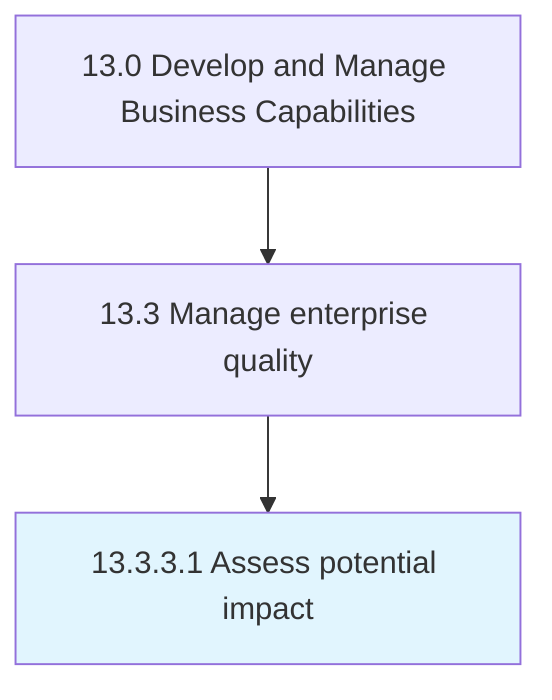

# Assess potential impact

> Analyzing any nonconformance events.

## Overview

Activity 13.3.3.1 is an activity within the Develop and Manage Business Capabilities framework. 

Analyzing any nonconformance events. Determine the need for corrective and/or preventative action(s). Leverage root-cause analysis, risk exposure, and other evaluations to properly review and approve/reject subsequent actions.

## Process Hierarchy



## Key Statistics

| Metric | Value |
|--------|-------|
| APQC Code | 17493 |
| Hierarchy ID | 13.3.3.1 |
| Level | Activity |
| Parent | [13.3.3](../) |
| Sub-Processes | 0 |


## GraphDL Semantic Structure

```
assess.PotentialImpact
```

| Component | Value | Description |
|-----------|-------|-------------|
| Verb | `assess` | Primary action |
| Object | `potential impact` | Direct object |


## Related Concepts

- [PotentialImpact](/concepts/PotentialImpact)


---

*Source: APQC PCF 17493 (13.3.3.1) - APQC*
