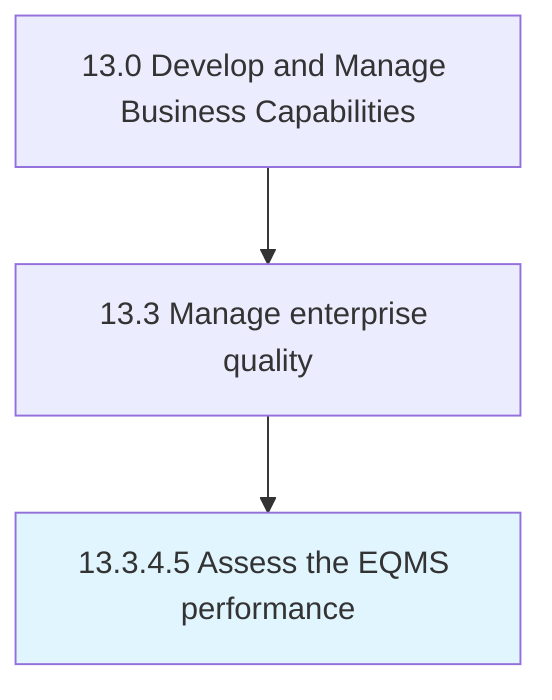

# Assess the EQMS performance

> Benchmarking current performance in quality metrics that span across the value chain.

## Overview

Activity 13.3.4.5 is an activity within the Develop and Manage Business Capabilities framework. 

Benchmarking current performance in quality metrics that span across the value chain. Identify gaps in performance as compared to industry peers. Identify and implement complementary EQMS capabilities. Enable a continuous improvement environment.

## Process Hierarchy



## Key Statistics

| Metric | Value |
|--------|-------|
| APQC Code | 17503 |
| Hierarchy ID | 13.3.4.5 |
| Level | Activity |
| Parent | [13.3.4](../) |
| Sub-Processes | 0 |


## GraphDL Semantic Structure

```
assess.TheEQMSPerformance
```

| Component | Value | Description |
|-----------|-------|-------------|
| Verb | `assess` | Primary action |
| Object | `the EQMS performance` | Direct object |


## Related Concepts

- EQMSPerformance


---

*Source: APQC PCF 17503 (13.3.4.5) - APQC*
