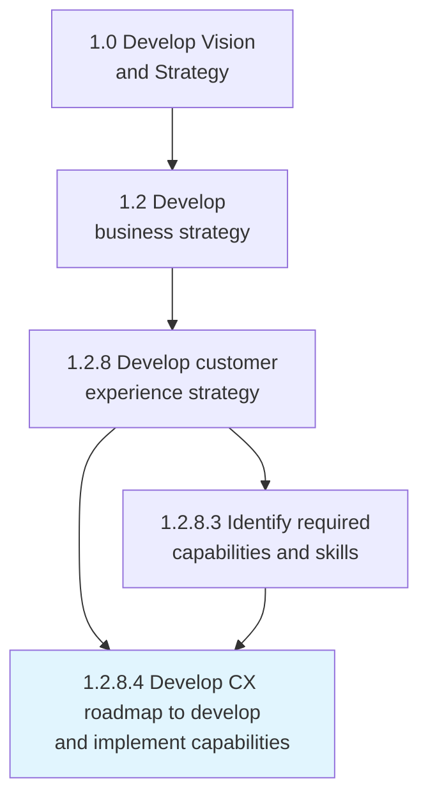
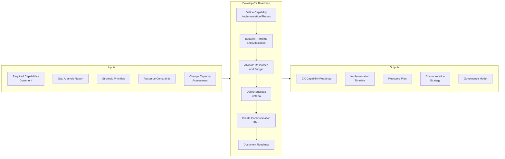
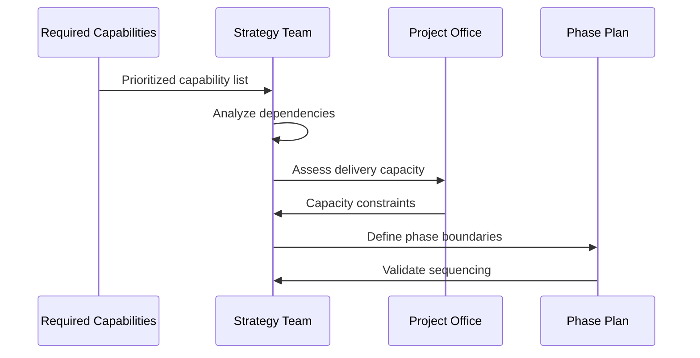
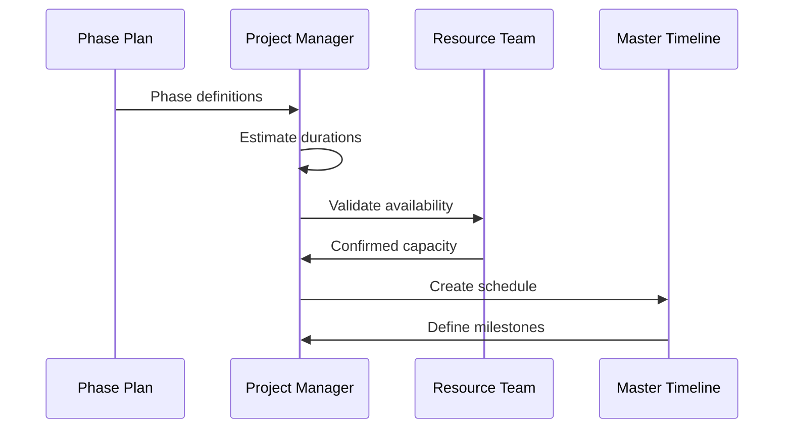
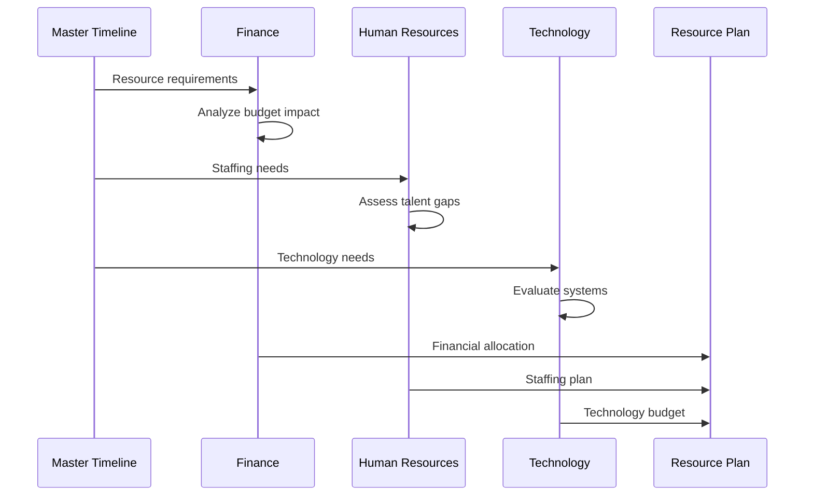
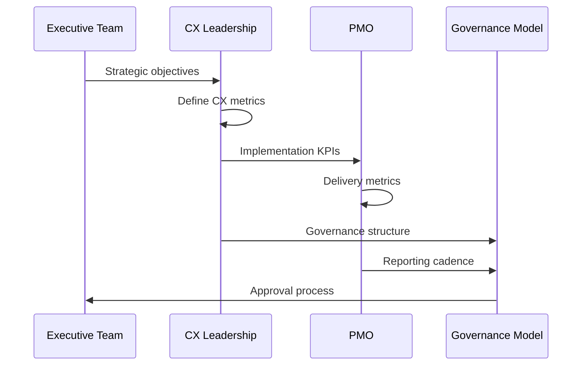
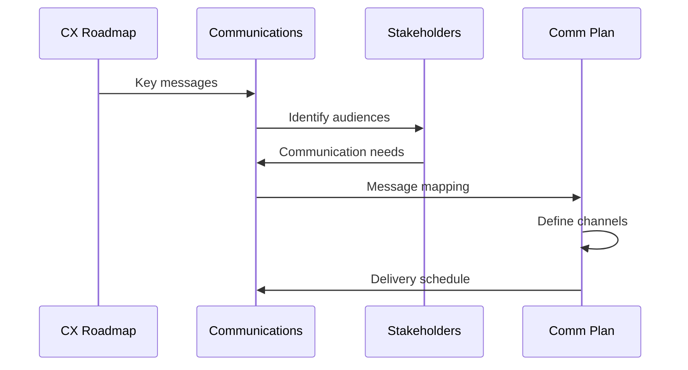
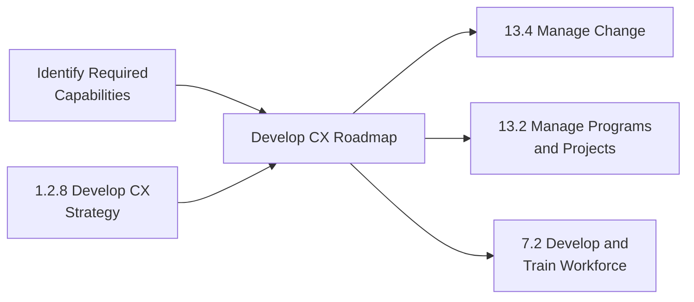

# Develop Customer Experience Roadmap to Develop and Implement Defined Capabilities

> Defining a standard guideline to create and execute the capacities of registering customer experiences in a timely manner. Create a common understanding of what behaviors are required to implement the strategy. Define what talent/skills your organization needs to reach customer experience goals.

## Overview

Develop Customer Experience Roadmap is a strategic planning process within customer experience strategy development (APQC 1.2.8) that translates capability requirements into actionable implementation plans. This process creates the bridge between capability identification and capability realization, providing a structured approach to building organizational competencies that deliver superior customer experiences.

The roadmap addresses three critical dimensions: people (talent and skills development), process (operational changes and improvements), and technology (systems and tools enablement). It establishes timelines, milestones, resource requirements, and success criteria for capability development initiatives.

This process ensures strategic alignment between customer experience objectives, capability investments, and organizational change management efforts. It provides a communication framework for stakeholders to understand the journey from current state to desired future state.

## Process Hierarchy



## Key Statistics

| Metric | Value |
|--------|-------|
| APQC Code | 19974 |
| Hierarchy ID | 1.2.8.4 |
| Level | Process |
| Category | [Develop Vision and Strategy](/processes/01-Strategy) |
| Parent Process | Develop customer experience strategy |

## Process Flow



## GraphDL Semantic Structure

```
develop.CustomerExperienceRoadmap.to.ImplementDefinedCapabilities
```

| Component | Value | Description |
|-----------|-------|-------------|
| Verb | `develop` | Primary action of creating and planning |
| Object | `CustomerExperienceRoadmap` | Strategic implementation plan |
| Preposition | `to` | Purpose relationship |
| PrepObject | `ImplementDefinedCapabilities` | Target outcome of capability realization |

## Activities

### 1.2.8.4.1 - Define Capability Implementation Phases

Structuring the capability development journey into logical phases that balance urgency, dependencies, and organizational change capacity.



**Tasks:**
- `analyze.CapabilityDependencies` - Identify prerequisite relationships
- `assess.OrganizationalChangeCapacity` - Evaluate ability to absorb change
- `define.ImplementationPhases` - Structure logical phase boundaries
- `sequence.CapabilityDelivery` - Order capability development optimally

### 1.2.8.4.2 - Establish Timeline and Milestones

Creating a realistic schedule with clear milestones that enable progress tracking and stakeholder communication.



**Tasks:**
- `estimate.PhaseduDrations` - Calculate time required for each phase
- `identify.CriticalPath` - Determine sequence-dependent activities
- `define.Milestones` - Establish progress checkpoints
- `create.MasterTimeline` - Integrate all phases into unified schedule

### 1.2.8.4.3 - Allocate Resources and Budget

Determining the people, technology, and financial resources required to execute the capability development roadmap.



**Tasks:**
- `identify.ResourceRequirements` - Determine people, process, technology needs
- `allocate.Budget` - Assign financial resources to initiatives
- `plan.Staffing` - Define workforce requirements
- `procure.Technology` - Plan technology acquisitions

### 1.2.8.4.4 - Define Success Criteria and Governance

Establishing how success will be measured and how the roadmap will be governed throughout execution.



**Tasks:**
- `define.SuccessMetrics` - Establish measurable outcomes
- `create.GovernanceModel` - Design decision-making structure
- `establish.ReportingCadence` - Set progress review schedule
- `assign.Accountability` - Define ownership and responsibility

### 1.2.8.4.5 - Create Communication Plan

Developing a stakeholder communication strategy that ensures alignment and engagement throughout the capability development journey.



**Tasks:**
- `identify.Stakeholders` - Map all affected parties
- `develop.KeyMessages` - Create compelling narratives
- `design.CommunicationChannels` - Select appropriate media
- `schedule.Communications` - Plan delivery timing

## RACI Matrix

| Activity | Responsible | Accountable | Consulted | Informed |
|----------|-------------|-------------|-----------|----------|
| Define implementation phases | CX Team | Chief Customer Officer | Strategy, PMO | Executive team |
| Establish timeline | PMO | CX Director | Operations, IT | All BU Heads |
| Allocate resources | Finance, HR | CFO | CX Team | Board |
| Define success criteria | CX Team | CCO | Strategy | All departments |
| Create communication plan | Communications | CMO | CX Team | All employees |
| Document roadmap | CX Team | CCO | All stakeholders | All employees |

## Related Departments

- [Customer Experience](/departments/CustomerExperience) - Primary process owner
- [Project Management Office](/departments/PMO) - Implementation oversight
- [Human Resources](/departments/HR) - Talent and skills development
- [Information Technology](/departments/IT) - Technology enablement
- [Communications](/departments/Communications) - Stakeholder communication
- [Finance](/departments/Finance) - Budget allocation and tracking

## Related Occupations

- [Customer Service Managers](/occupations/CustomerServiceManagers) - CX roadmap development
- [Project Management Specialists](/occupations/ProjectManagers) - Implementation planning
- [Training and Development Managers](/occupations/TrainingManagers) - Capability building
- [Management Analysts](/occupations/ManagementAnalysts) - Process improvement
- [Public Relations Managers](/occupations/PRManagers) - Communication strategy

## Industry Variations

### Banking

Banking CX roadmaps emphasize digital transformation capabilities, regulatory compliance, and omnichannel integration. Phasing considers regulatory approval timelines and technology integration complexity.

**Industry-Specific Focus:**
- Digital banking capability phases
- Regulatory compliance milestones
- Core banking integration timeline
- Branch transformation sequencing

### Healthcare Provider

Healthcare CX roadmaps prioritize patient safety, clinical workflow integration, and regulatory compliance. Implementation phases align with clinical change management best practices.

**Industry-Specific Focus:**
- Clinical workflow integration phases
- EHR enhancement milestones
- Patient portal deployment
- Telehealth capability rollout

### Retail

Retail CX roadmaps focus on omnichannel experience consistency, supply chain visibility, and personalization capabilities. Phasing aligns with seasonal business cycles.

**Industry-Specific Focus:**
- Omnichannel capability phases
- Peak season readiness milestones
- Personalization technology rollout
- Store associate enablement

### Telecommunications

Telecom CX roadmaps emphasize self-service capabilities, network operations integration, and technical support enhancement. Implementation considers network upgrade schedules.

**Industry-Specific Focus:**
- Self-service capability phases
- Network modernization alignment
- Contact center transformation
- Field service enhancement

## Sub-Processes

| Process | Code | Description |
|---------|------|-------------|
| Define implementation phases | 1.2.8.4.1 | Structure capability delivery into logical phases |
| Establish timeline | 1.2.8.4.2 | Create schedule with milestones |
| Allocate resources | 1.2.8.4.3 | Assign people, budget, and technology |
| Define success criteria | 1.2.8.4.4 | Establish governance and metrics |
| Create communication plan | 1.2.8.4.5 | Design stakeholder communication strategy |

## Related Processes



## Metrics & KPIs

| Metric | Description | Target |
|--------|-------------|--------|
| Roadmap Completion | Percentage of roadmap phases delivered on time | >90% |
| Budget Adherence | Variance from planned budget | <10% |
| Milestone Achievement | Percentage of milestones met on schedule | >85% |
| Stakeholder Alignment | Agreement on roadmap direction | >90% |
| Capability Realization | Capabilities delivered vs. planned | >95% |
| Change Adoption | Employee adoption of new capabilities | >80% |

---

*Source: APQC PCF 19974 (1.2.8.4) - Cross-Industry*
