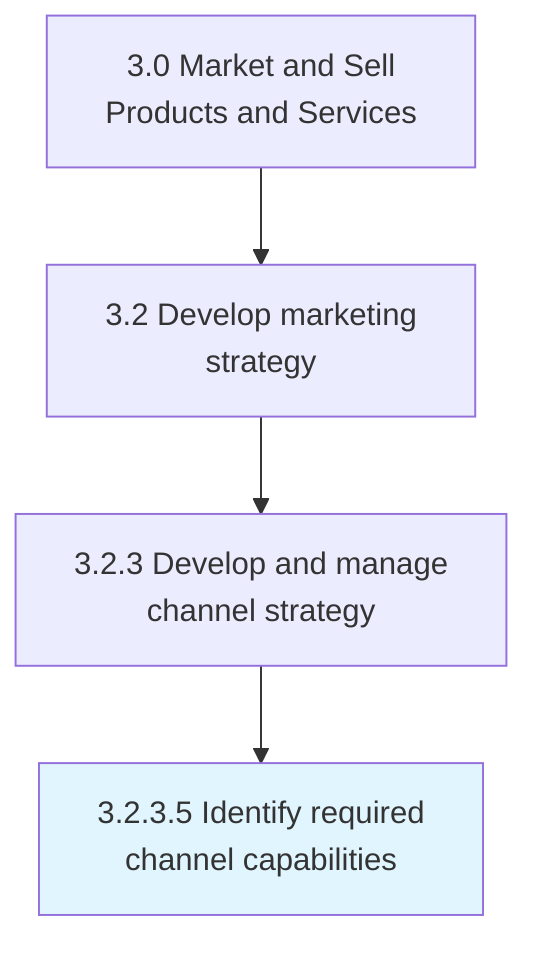
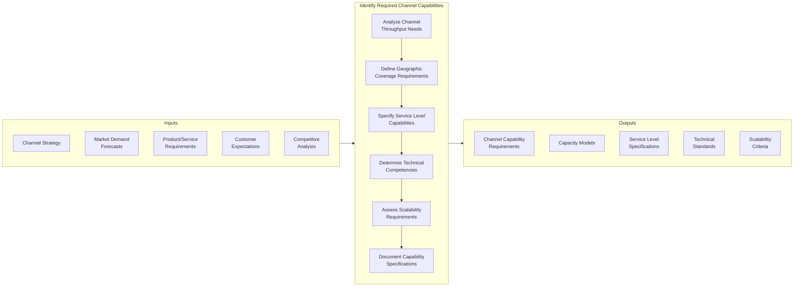
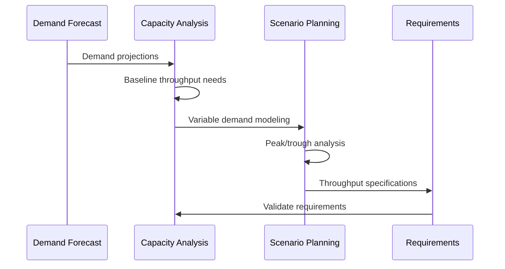
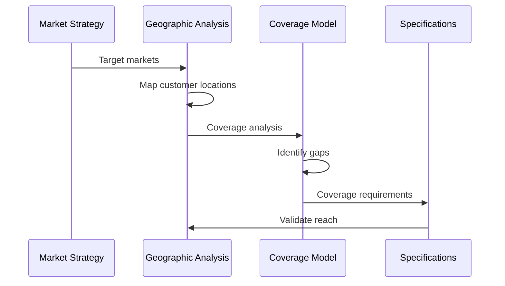
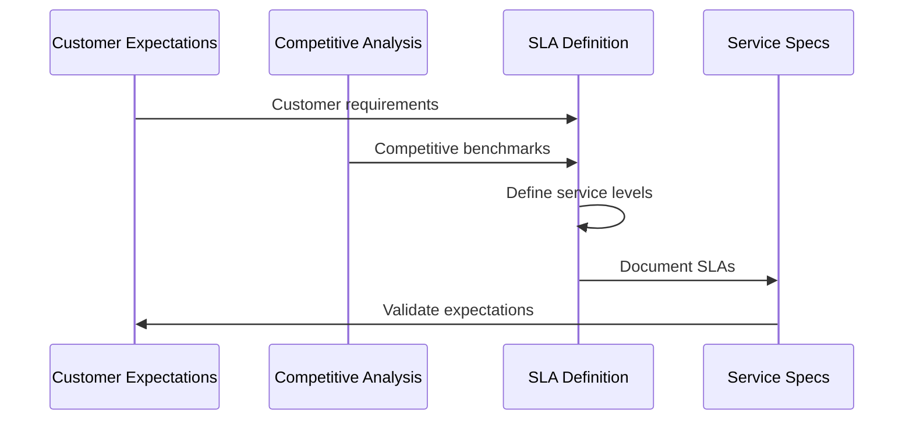
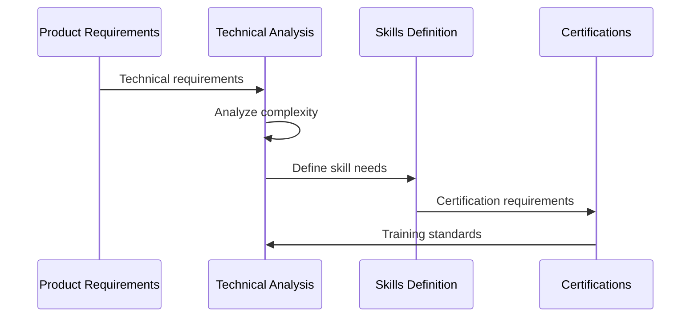
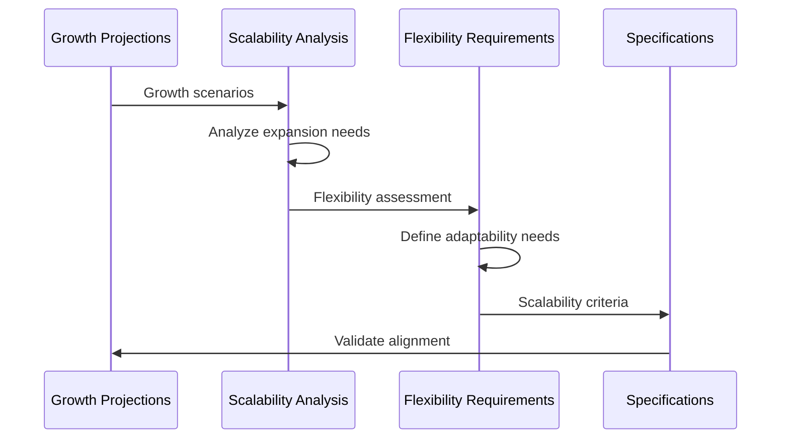
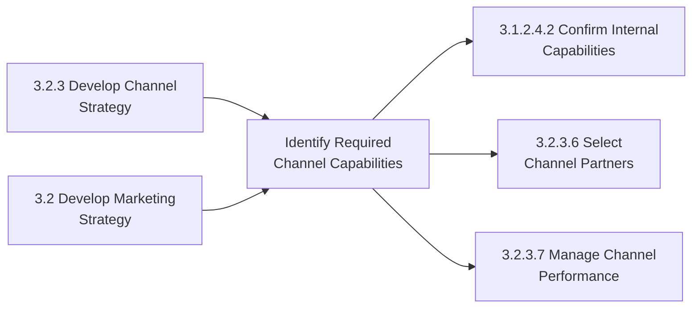

# Identify Required Channel Capabilities

> Determining the maximum output rate required from a distribution channel to optimally market and deliver the products and services the company offers or would like to offer. Ideally, a channel should be able to adapt to a certain degree of variability in the demand for the offerings, and able scale up if needed.

## Overview

Identify Required Channel Capabilities is a strategic process within channel management (APQC 3.2.3) that defines the operational requirements for distribution channels to effectively reach customers with products and services. This process determines the capacity, flexibility, and competencies that channels must possess to meet market demands and support business growth objectives.

The process analyzes channel requirements across multiple dimensions including throughput capacity, geographic coverage, service level capabilities, technical competencies, and scalability. It considers both current demand patterns and projected growth scenarios to ensure channels can adapt to market dynamics.

Effective channel capability identification enables organizations to make informed decisions about channel investments, partner selection, and capability development priorities. It serves as a foundation for channel strategy execution and performance management.

## Process Hierarchy



## Key Statistics

| Metric | Value |
|--------|-------|
| APQC Code | 20003 |
| Hierarchy ID | 3.2.3.5 |
| Level | Activity |
| Category | [Market and Sell Products and Services](/processes/03-Sales) |
| Parent Process | Develop and manage channel strategy |

## Process Flow



## GraphDL Semantic Structure

```
identify.RequiredChannelCapabilities
```

| Component | Value | Description |
|-----------|-------|-------------|
| Verb | `identify` | Primary action of determining and specifying |
| Object | `RequiredChannelCapabilities` | Distribution channel competencies and capacity |
| Preposition | - | Not applicable at this level |
| PrepObject | - | Not applicable at this level |

## Activities

### 3.2.3.5.1 - Analyze Channel Throughput Requirements

Determining the volume capacity that distribution channels must be able to handle to meet market demand under various scenarios.



**Tasks:**
- `analyze.DemandForecasts` - Review market demand projections
- `calculate.BaselineThroughput` - Determine steady-state volume requirements
- `model.PeakDemandScenarios` - Project maximum volume scenarios
- `specify.CapacityBuffers` - Define flex capacity requirements

### 3.2.3.5.2 - Define Geographic Coverage Requirements

Specifying the geographic reach and market coverage that channels must provide to serve target customer segments.



**Tasks:**
- `map.TargetMarkets` - Identify geographic market segments
- `analyze.CustomerDistribution` - Understand customer location patterns
- `define.CoverageRequirements` - Specify geographic reach needed
- `identify.CoverageGaps` - Determine underserved areas

### 3.2.3.5.3 - Specify Service Level Capabilities

Defining the service level requirements that channels must meet to deliver customer satisfaction and competitive differentiation.



**Tasks:**
- `capture.CustomerExpectations` - Document customer service requirements
- `benchmark.CompetitiveServiceLevels` - Analyze competitor performance
- `define.ServiceLevelTargets` - Establish SLA requirements
- `specify.PerformanceMetrics` - Define measurement criteria

### 3.2.3.5.4 - Determine Technical Competencies

Identifying the technical skills, systems, and certifications that channels must possess to effectively represent and deliver products/services.



**Tasks:**
- `analyze.ProductComplexity` - Assess technical requirements of offerings
- `define.TechnicalSkills` - Specify required competencies
- `identify.Certifications` - Determine required credentials
- `specify.TrainingRequirements` - Define knowledge standards

### 3.2.3.5.5 - Assess Scalability Requirements

Evaluating the flexibility and growth capacity that channels must demonstrate to support business expansion.



**Tasks:**
- `project.GrowthScenarios` - Model business expansion scenarios
- `assess.ScaleUpRequirements` - Determine capacity expansion needs
- `define.FlexibilityParameters` - Specify adaptability requirements
- `establish.ScalabilityCriteria` - Document growth readiness standards

## RACI Matrix

| Activity | Responsible | Accountable | Consulted | Informed |
|----------|-------------|-------------|-----------|----------|
| Analyze throughput requirements | Channel Management | VP Sales | Operations | Marketing |
| Define geographic coverage | Market Strategy | CMO | Sales, Distribution | Finance |
| Specify service levels | Customer Service | CCO | Sales, Operations | Quality |
| Determine technical competencies | Product Management | VP Product | Training | Channel partners |
| Assess scalability | Business Development | CSO | Finance, Operations | Channel partners |
| Document specifications | Channel Management | VP Channels | All stakeholders | Partner management |

## Related Departments

- [Channel Management](/departments/Channels) - Primary process owner
- [Sales](/departments/Sales) - Market coverage requirements
- [Marketing](/departments/Marketing) - Brand and customer experience standards
- [Operations](/departments/Operations) - Fulfillment capability specifications
- [Customer Service](/departments/CustomerService) - Service level requirements
- [Product Management](/departments/Product) - Technical competency standards

## Related Occupations

- [Sales Managers](/occupations/SalesManagers) - Channel capability definition
- [Marketing Managers](/occupations/MarketingManagers) - Market coverage strategy
- [Logisticians](/occupations/Logisticians) - Distribution capability assessment
- [Customer Service Managers](/occupations/CustomerServiceManagers) - Service level requirements
- [Business Development Managers](/occupations/BusinessDevelopmentManagers) - Scalability planning
- [Training and Development Managers](/occupations/TrainingManagers) - Technical competency standards

## Industry Variations

### Banking

Banking channel capability requirements emphasize regulatory compliance, security certifications, and digital service capabilities. Requirements include branch network coverage, ATM accessibility, and digital banking channel performance.

**Industry-Specific Focus:**
- Regulatory compliance certifications
- Security and fraud prevention capabilities
- Digital banking platform performance
- Branch network coverage standards

### Healthcare Provider

Healthcare channel capability requirements focus on clinical credentials, HIPAA compliance, and patient access capabilities. Requirements include geographic coverage for care delivery and telehealth readiness.

**Industry-Specific Focus:**
- Clinical credentialing requirements
- HIPAA compliance certification
- Care access coverage standards
- Telehealth platform capabilities

### Retail

Retail channel capability requirements emphasize omnichannel fulfillment, inventory visibility, and customer experience consistency. Requirements include store coverage, e-commerce capabilities, and last-mile delivery.

**Industry-Specific Focus:**
- Omnichannel fulfillment standards
- Inventory visibility requirements
- Store coverage and format mix
- Last-mile delivery capabilities

### Consumer Products

Consumer products channel capability requirements focus on retail execution, promotional support, and supply chain collaboration. Requirements include shelf space management, merchandising, and trade marketing support.

**Industry-Specific Focus:**
- Retail execution capabilities
- Merchandising and display standards
- Trade marketing support
- Category management expertise

### Telecommunications

Telecom channel capability requirements emphasize technical sales competency, service activation, and customer support. Requirements include retail presence, dealer network coverage, and digital self-service capabilities.

**Industry-Specific Focus:**
- Technical sales certification
- Service activation capabilities
- Network knowledge requirements
- Digital self-service support

## Sub-Processes

| Process | Code | Description |
|---------|------|-------------|
| Analyze throughput requirements | 3.2.3.5.1 | Determine volume capacity needs |
| Define geographic coverage | 3.2.3.5.2 | Specify market reach requirements |
| Specify service levels | 3.2.3.5.3 | Establish SLA requirements |
| Determine technical competencies | 3.2.3.5.4 | Define skills and certification needs |
| Assess scalability requirements | 3.2.3.5.5 | Evaluate growth capacity needs |

## Related Processes



## Metrics & KPIs

| Metric | Description | Target |
|--------|-------------|--------|
| Throughput Capacity | Channel volume capability vs. demand | >120% of forecast |
| Geographic Coverage | Target market areas served | >95% |
| Service Level Compliance | Channels meeting SLA requirements | >98% |
| Technical Certification | Channel staff certified | 100% |
| Scalability Index | Ability to increase capacity | >50% headroom |
| Capability Specification Completeness | Requirements documented | 100% |

---

*Source: APQC PCF 20003 (3.2.3.5) - Cross-Industry*
