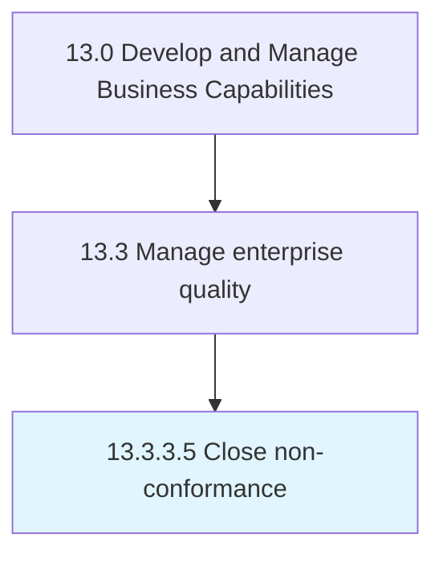

# Close non-conformance

> Closing nonconformance.

## Overview

Activity 13.3.3.5 is an activity within the Develop and Manage Business Capabilities framework. 

Closing nonconformance. Perform all the final processes related to the nonconformance, including documenting root causes. Document corrective and preventive actions.

## Process Hierarchy



## Key Statistics

| Metric | Value |
|--------|-------|
| APQC Code | 17497 |
| Hierarchy ID | 13.3.3.5 |
| Level | Activity |
| Parent | [13.3.3](../) |
| Sub-Processes | 0 |


## GraphDL Semantic Structure

```
close.Nonconformance
```

| Component | Value | Description |
|-----------|-------|-------------|
| Verb | `close` | Primary action |
| Object | `non-conformance` | Direct object |


---

*Source: APQC PCF 17497 (13.3.3.5) - APQC*
