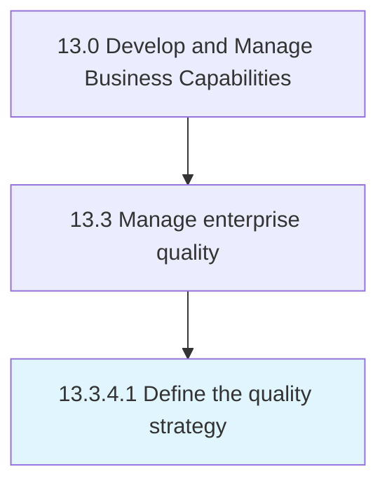

# Define the quality strategy

> Outlining the strategy for managing enterprise quality.

## Overview

Activity 13.3.4.1 is an activity within the Develop and Manage Business Capabilities framework. 

Outlining the strategy for managing enterprise quality. Define and formalize quality techniques and standards. Assign responsibilities for achieving the required quality levels. Standardize the quality maintenance procedure, tools and techniques, recording and reporting, the timing of quality maintenance activities, and the roles and responsibilities for the quality management team.

## Process Hierarchy



## Key Statistics

| Metric | Value |
|--------|-------|
| APQC Code | 17499 |
| Hierarchy ID | 13.3.4.1 |
| Level | Activity |
| Parent | [13.3.4](../) |
| Sub-Processes | 0 |


## GraphDL Semantic Structure

```
define.TheQualityStrategy
```

| Component | Value | Description |
|-----------|-------|-------------|
| Verb | `define` | Primary action |
| Object | `the quality strategy` | Direct object |


## Related Concepts

- QualityStrategy


---

*Source: APQC PCF 17499 (13.3.4.1) - APQC*
