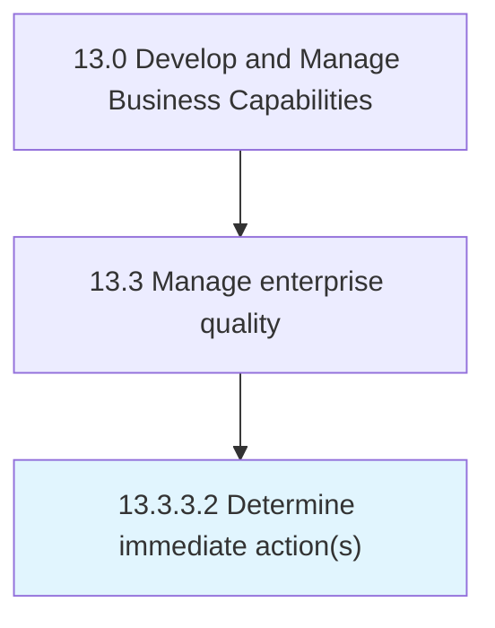

# Determine immediate action(s)

> Initiating immediate corrective, preventative, or no action based upon the impact and likelihood of reoccurrence.

## Overview

Activity 13.3.3.2 is an activity within the Develop and Manage Business Capabilities framework. 

Initiating immediate corrective, preventative, or no action based upon the impact and likelihood of reoccurrence. Consider cost/benefit, risk exposure, timing, the assignment of responsibility, and other pertinent factors .

## Process Hierarchy



## Key Statistics

| Metric | Value |
|--------|-------|
| APQC Code | 17494 |
| Hierarchy ID | 13.3.3.2 |
| Level | Activity |
| Parent | [13.3.3](../) |
| Sub-Processes | 0 |


## GraphDL Semantic Structure

```
determine.ImmediateActions
```

| Component | Value | Description |
|-----------|-------|-------------|
| Verb | `determine` | Primary action |
| Object | `immediate action(s)` | Direct object |


## Related Concepts

- ImmediateAction(S


---

*Source: APQC PCF 17494 (13.3.3.2) - APQC*
