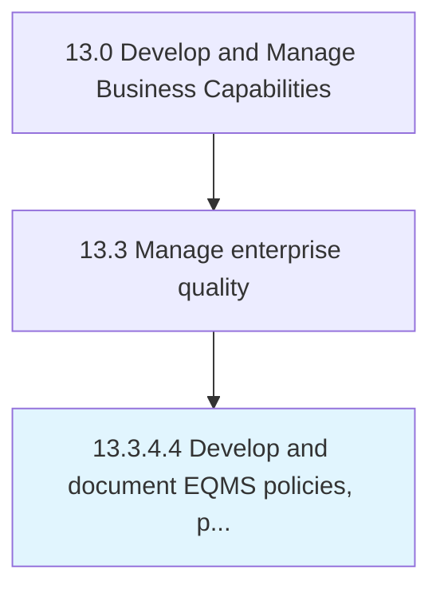

# Develop and document EQMS policies, procedures, standards, and measures

> Setting the process limits.

## Overview

Activity 13.3.4.4 is an activity within the Develop and Manage Business Capabilities framework. 

Setting the process limits. Gather required information. Align with other documents and processes. Define the document structure.

## Process Hierarchy



## Key Statistics

| Metric | Value |
|--------|-------|
| APQC Code | 17502 |
| Hierarchy ID | 13.3.4.4 |
| Level | Activity |
| Parent | [13.3.4](../) |
| Sub-Processes | 0 |


## GraphDL Semantic Structure

```
develop.AndDocumentEQMSPoliciesProceduresStandardsAndMeasures
```

| Component | Value | Description |
|-----------|-------|-------------|
| Verb | `develop` | Primary action |
| Object | `and document EQMS policies, procedures, standards, and measures` | Direct object |


## Related Concepts

- EQMSPolicies
- Procedures
- Standards
- Measures
- EQMSPolicies
- Procedures
- Standards
- Measures


---

*Source: APQC PCF 17502 (13.3.4.4) - APQC*
