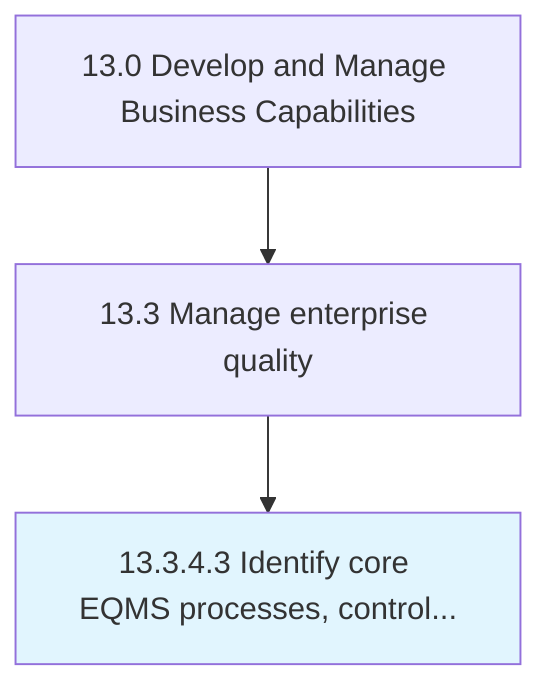

# Identify core EQMS processes, controls, and metrics

> Recognizing and implementing the processes, controls, and metrics for maintenance of EQMS.

## Overview

Activity 13.3.4.3 is an activity within the Develop and Manage Business Capabilities framework. 

Recognizing and implementing the processes, controls, and metrics for maintenance of EQMS. Define the role of EQMS in failure mode and effects analysis, complaint handling, and advanced product quality planning. Establish the role of EQMS in evaluating metrics such as cost of quality, overall equipment effectiveness, on-time and complete shipments, percentage of products in compliance, and new product introductions.

## Process Hierarchy



## Key Statistics

| Metric | Value |
|--------|-------|
| APQC Code | 17501 |
| Hierarchy ID | 13.3.4.3 |
| Level | Activity |
| Parent | [13.3.4](../) |
| Sub-Processes | 0 |


## GraphDL Semantic Structure

```
identify.CoreEQMSProcessesControlsAndMetrics
```

| Component | Value | Description |
|-----------|-------|-------------|
| Verb | `identify` | Primary action |
| Object | `core EQMS processes, controls, and metrics` | Direct object |


## Related Concepts

- CoreEQMSProcesses
- Controls
- Metrics


---

*Source: APQC PCF 17501 (13.3.4.3) - APQC*
