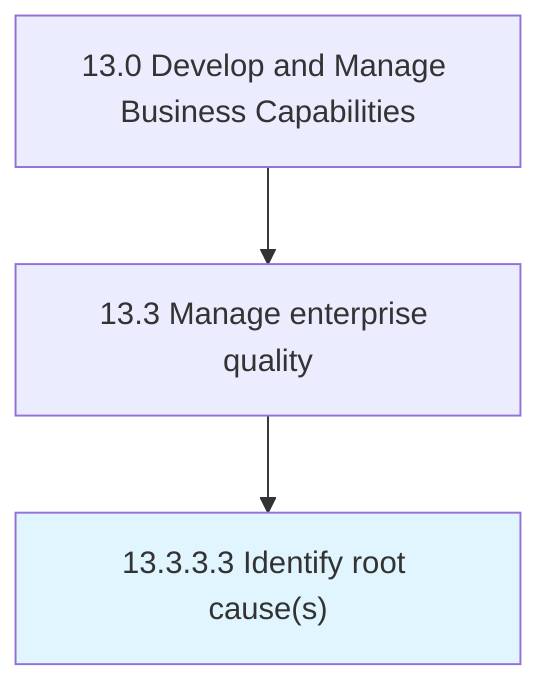

# Identify root cause(s)

> Recognizing the reasons that have triggered the nonconformance events or activities.

## Overview

Activity 13.3.3.3 is an activity within the Develop and Manage Business Capabilities framework. 

Recognizing the reasons that have triggered the nonconformance events or activities. Perform a root-cause analysis through documentary evidence and interviews. Involve the appropriate individuals. Leverage cause analysis and risk assessment.

## Process Hierarchy



## Key Statistics

| Metric | Value |
|--------|-------|
| APQC Code | 17495 |
| Hierarchy ID | 13.3.3.3 |
| Level | Activity |
| Parent | [13.3.3](../) |
| Sub-Processes | 0 |


## GraphDL Semantic Structure

```
identify.RootCauses
```

| Component | Value | Description |
|-----------|-------|-------------|
| Verb | `identify` | Primary action |
| Object | `root cause(s)` | Direct object |


## Related Concepts

- RootCause(S


---

*Source: APQC PCF 17495 (13.3.3.3) - APQC*
