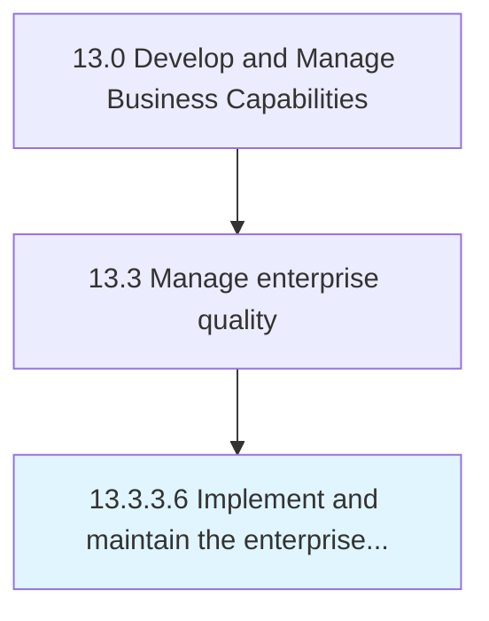

# Implement and maintain the enterprise quality management system (EQMS)

> Establishing and administering the software that manages content and business processes for quality and compliance across the value chain.

## Overview

Activity 13.3.3.6 is an activity within the Develop and Manage Business Capabilities framework. 

Establishing and administering the software that manages content and business processes for quality and compliance across the value chain. Define the quality strategy. Plan and deploy the EQMS scope, targets, and goals. Identify core process controls and metric. Develop EQMS governance. Assess the performance of EQMS. Encourage improvements in EQMS.

## Process Hierarchy



## Key Statistics

| Metric | Value |
|--------|-------|
| APQC Code | 17498 |
| Hierarchy ID | 13.3.3.6 |
| Level | Activity |
| Parent | [13.3.3](../) |
| Sub-Processes | 0 |


## GraphDL Semantic Structure

```
implement.AndMaintainTheEnterpriseQualityManagementSystemEQMS
```

| Component | Value | Description |
|-----------|-------|-------------|
| Verb | `implement` | Primary action |
| Object | `and maintain the enterprise quality management system (EQMS)` | Direct object |


---

*Source: APQC PCF 17498 (13.3.3.6) - APQC*
