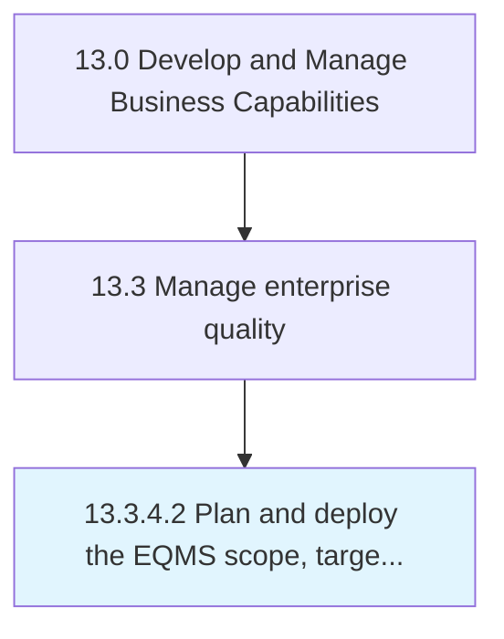

# Plan and deploy the EQMS scope, targets, and goals

> Establishing and effectively deploying the scope, targets, and goals of EQMS.

## Overview

Activity 13.3.4.2 is an activity within the Develop and Manage Business Capabilities framework. 

Establishing and effectively deploying the scope, targets, and goals of EQMS. Define the role of EQMS through nonconformance/corrective and preventive action, compliance/audit management, risk management, failure mode and effects analysis, and statistical process control. Implement EQMS into operational activities. Define the goals and objectives that are to be achieved by the EQMS.

## Process Hierarchy



## Key Statistics

| Metric | Value |
|--------|-------|
| APQC Code | 17500 |
| Hierarchy ID | 13.3.4.2 |
| Level | Activity |
| Parent | [13.3.4](../) |
| Sub-Processes | 0 |


## GraphDL Semantic Structure

```
plan.AndDeployTheEQMSScopeTargetsAndGoals
```

| Component | Value | Description |
|-----------|-------|-------------|
| Verb | `plan` | Primary action |
| Object | `and deploy the EQMS scope, targets, and goals` | Direct object |


## Related Concepts

- EQMSScope
- Targets
- Goals
- EQMSScope
- Targets
- Goals


---

*Source: APQC PCF 17500 (13.3.4.2) - APQC*
