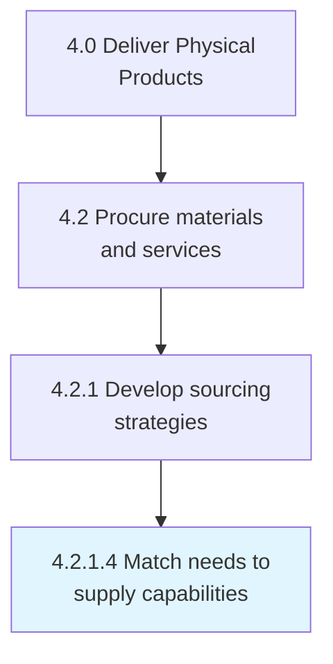
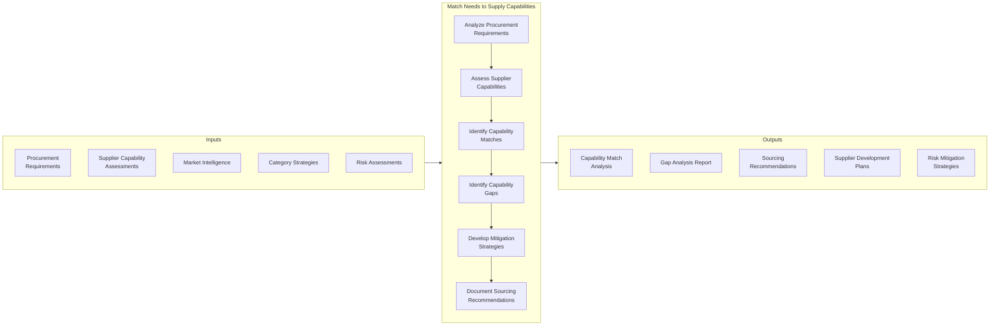
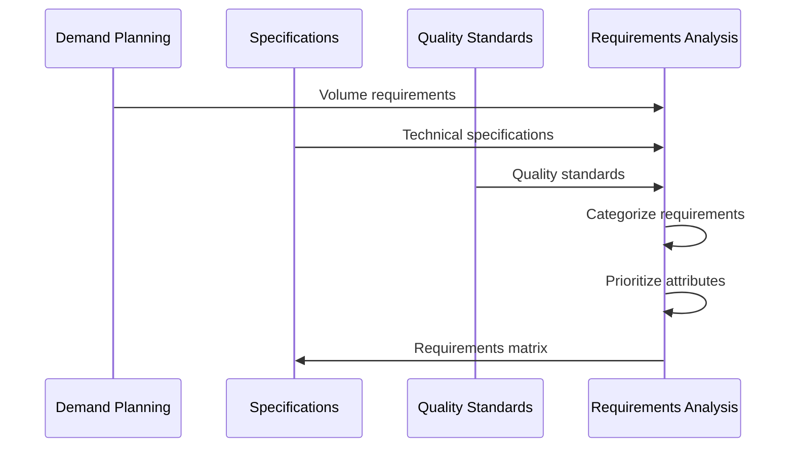
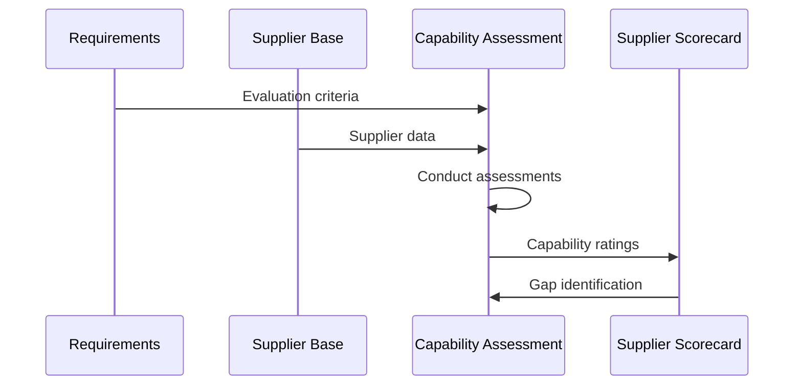
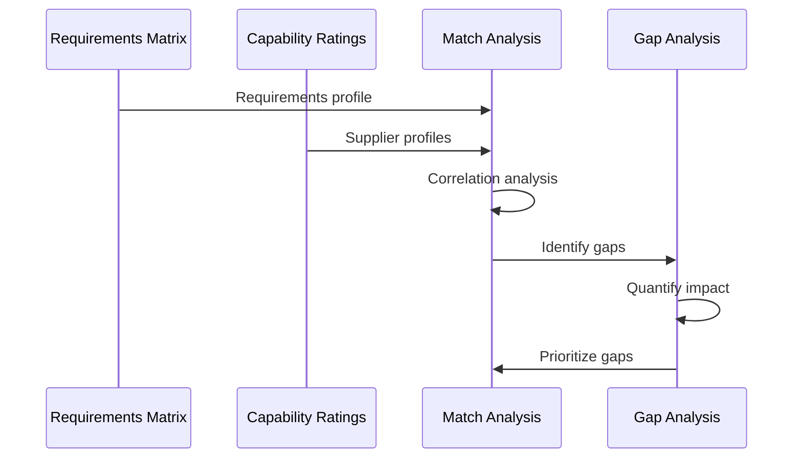
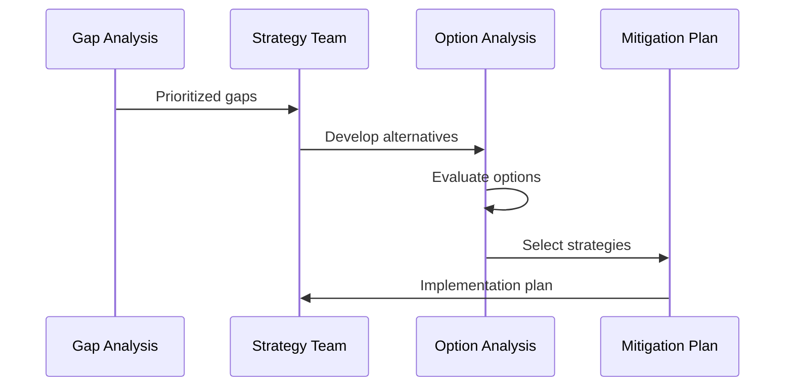
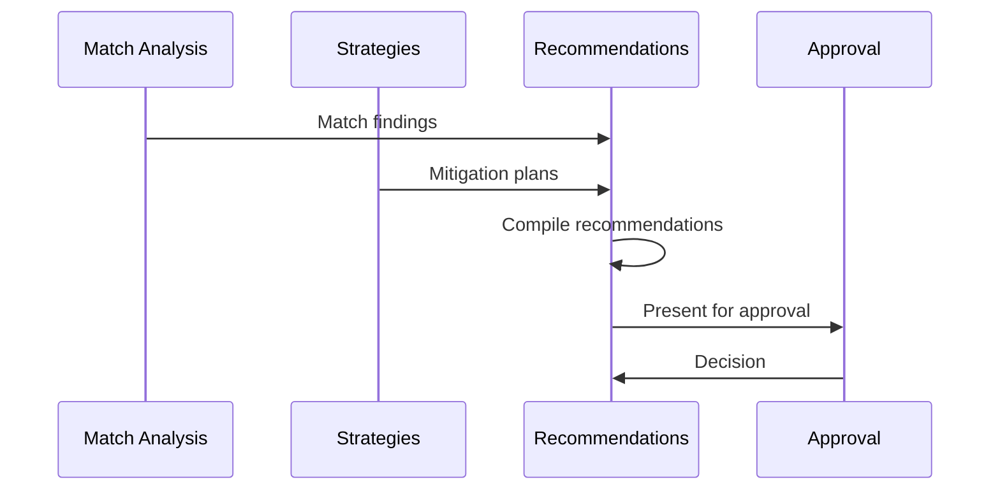
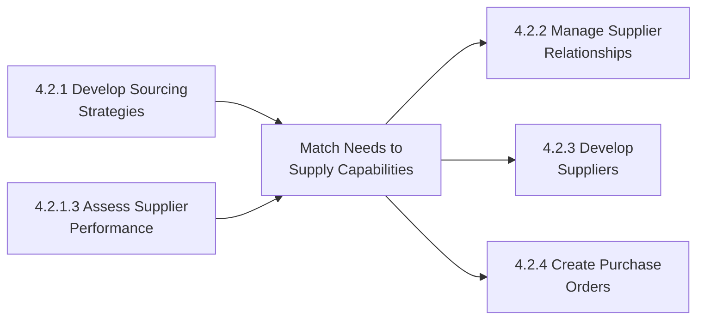

# Match Needs to Supply Capabilities

> Synchronizing the requirements of materials and services and the capacity of suppliers for providing these materials and services. Revamp the procurement needs of the company in consideration of the capabilities of the suppliers.

## Overview

Match Needs to Supply Capabilities is a strategic procurement process within supply chain management (APQC 4.2.1) that aligns organizational requirements with supplier capabilities to optimize sourcing decisions. This process ensures that procurement strategies leverage the strengths of the supply base while addressing gaps through supplier development, alternative sourcing, or capability building.

The process involves systematic analysis of procurement requirements across dimensions of quality, cost, capacity, technology, and flexibility, then matching these needs against the demonstrated capabilities of current and potential suppliers. It enables informed decisions about supplier selection, development investments, and make-vs-buy strategies.

Effective capability matching reduces supply risk, improves cost efficiency, and ensures that the organization can reliably obtain the materials and services needed to execute its business strategy. It serves as a foundation for strategic supplier relationship management and supply base optimization.

## Process Hierarchy



## Key Statistics

| Metric | Value |
|--------|-------|
| APQC Code | 10284 |
| Hierarchy ID | 4.2.1.4 |
| Level | Activity |
| Category | [Deliver Physical Products](/processes/04-Delivery) |
| Parent Process | Develop sourcing strategies |

## Process Flow



## GraphDL Semantic Structure

```
match.Needs.to.SupplyCapabilities
```

| Component | Value | Description |
|-----------|-------|-------------|
| Verb | `match` | Primary action of aligning and synchronizing |
| Object | `Needs` | Procurement requirements and specifications |
| Preposition | `to` | Alignment relationship |
| PrepObject | `SupplyCapabilities` | Supplier competencies and capacities |

## Activities

### 4.2.1.4.1 - Analyze Procurement Requirements

Systematically documenting and categorizing procurement needs across all dimensions relevant to supplier capability matching.



**Tasks:**
- `document.VolumeRequirements` - Capture quantity and timing needs
- `specify.TechnicalStandards` - Define product/service specifications
- `establish.QualityCriteria` - Set quality performance standards
- `identify.CriticalAttributes` - Determine must-have capabilities

### 4.2.1.4.2 - Assess Supplier Capabilities

Evaluating current and potential suppliers against the defined procurement requirements to understand their strengths and limitations.



**Tasks:**
- `evaluate.SupplierCapacity` - Assess production/service delivery capability
- `assess.QualityPerformance` - Evaluate quality management systems
- `analyze.TechnicalCompetency` - Review technical capabilities
- `measure.FinancialStability` - Evaluate supplier financial health

### 4.2.1.4.3 - Identify Capability Matches and Gaps

Mapping procurement requirements to supplier capabilities to identify strong matches and areas where gaps exist.



**Tasks:**
- `correlate.RequirementsToCapabilities` - Map needs to supplier strengths
- `identify.StrongMatches` - Recognize well-aligned suppliers
- `quantify.CapabilityGaps` - Measure shortfalls
- `prioritize.GapsByImpact` - Rank gaps by business criticality

### 4.2.1.4.4 - Develop Mitigation and Optimization Strategies

Creating strategies to address capability gaps and optimize the alignment between needs and supply capabilities.



**Tasks:**
- `develop.SupplierDevelopmentPlans` - Create capability improvement initiatives
- `identify.AlternativeSources` - Find additional suppliers
- `evaluate.MakeVsBuy` - Assess internal production options
- `design.RiskMitigation` - Create contingency strategies

### 4.2.1.4.5 - Document Sourcing Recommendations

Formalizing the analysis and recommendations into actionable sourcing decisions and plans.



**Tasks:**
- `compile.SourcingRecommendations` - Document supplier assignments
- `present.BusinessCase` - Justify sourcing decisions
- `obtain.StakeholderApproval` - Secure decision authorization
- `communicate.Decisions` - Inform affected parties

## RACI Matrix

| Activity | Responsible | Accountable | Consulted | Informed |
|----------|-------------|-------------|-----------|----------|
| Analyze procurement requirements | Category Management | CPO | Operations, Engineering | Suppliers |
| Assess supplier capabilities | Supplier Quality | VP Procurement | Category managers | Finance |
| Identify capability matches/gaps | Strategic Sourcing | CPO | Category managers | Operations |
| Develop mitigation strategies | Category Management | VP Procurement | Engineering, Operations | Finance |
| Document recommendations | Strategic Sourcing | CPO | All stakeholders | Executive team |

## Related Departments

- [Procurement](/departments/Procurement) - Primary process owner
- [Supply Chain](/departments/SupplyChain) - Requirements and logistics input
- [Engineering](/departments/Engineering) - Technical requirements definition
- [Quality Assurance](/departments/Quality) - Quality standards and assessment
- [Operations](/departments/Operations) - Capacity and timing requirements
- [Finance](/departments/Finance) - Cost and financial analysis

## Related Occupations

- [Purchasing Managers](/occupations/PurchasingManagers) - Capability matching oversight
- [Logisticians](/occupations/Logisticians) - Supply chain requirements
- [Industrial Engineers](/occupations/IndustrialEngineers) - Technical capability assessment
- [Quality Control Analysts](/occupations/QualityAnalysts) - Supplier quality evaluation
- [Cost Estimators](/occupations/CostEstimators) - Cost capability analysis
- [Management Analysts](/occupations/ManagementAnalysts) - Strategic sourcing consulting

## Industry Variations

### Aerospace and Defense

Aerospace capability matching emphasizes special process certifications, long-lead material availability, and security clearance requirements. Assessment includes technology readiness levels and defense contract compliance.

**Industry-Specific Focus:**
- NADCAP and AS9100 certification requirements
- Long-lead material capability
- Security clearance requirements
- Technology readiness assessment

### Automotive

Automotive capability matching focuses on IATF 16949 compliance, just-in-time delivery capability, and launch support capacity. Assessment includes APQP readiness and quality performance metrics.

**Industry-Specific Focus:**
- IATF 16949 compliance
- JIT delivery capability
- Launch support capacity
- APQP readiness assessment

### Consumer Products

Consumer products capability matching emphasizes seasonal capacity flexibility, packaging capabilities, and sustainability certifications. Assessment includes promotional surge capacity and private label expertise.

**Industry-Specific Focus:**
- Seasonal production flexibility
- Packaging and labeling capability
- Sustainability certification
- Private label expertise

### Life Sciences

Life sciences capability matching focuses on GMP compliance, validated processes, and regulatory documentation capability. Assessment includes FDA inspection history and controlled substance handling.

**Industry-Specific Focus:**
- GMP compliance validation
- Regulatory documentation capability
- FDA inspection track record
- Controlled substance handling

### Technology

Technology capability matching emphasizes innovation partnership capability, intellectual property protection, and rapid prototyping capacity. Assessment includes design collaboration and component miniaturization.

**Industry-Specific Focus:**
- Innovation and R&D capability
- IP protection practices
- Rapid prototyping capacity
- Design collaboration readiness

## Sub-Processes

| Process | Code | Description |
|---------|------|-------------|
| Analyze procurement requirements | 4.2.1.4.1 | Document and categorize procurement needs |
| Assess supplier capabilities | 4.2.1.4.2 | Evaluate supplier competencies |
| Identify capability matches/gaps | 4.2.1.4.3 | Map requirements to capabilities |
| Develop mitigation strategies | 4.2.1.4.4 | Address gaps and optimize alignment |
| Document recommendations | 4.2.1.4.5 | Formalize sourcing decisions |

## Related Processes



## Metrics & KPIs

| Metric | Description | Target |
|--------|-------------|--------|
| Capability Match Rate | Requirements fully met by suppliers | >90% |
| Critical Gap Closure | High-priority gaps addressed | 100% |
| Supplier Development ROI | Return on capability building investments | >200% |
| Single Source Reduction | Critical items with multiple sources | <10% single-sourced |
| Supply Risk Index | Weighted capability gap risk score | <15% |
| Time to Capability | Duration to close identified gaps | <6 months avg |

---

*Source: APQC PCF 10284 (4.2.1.4) - Cross-Industry*
