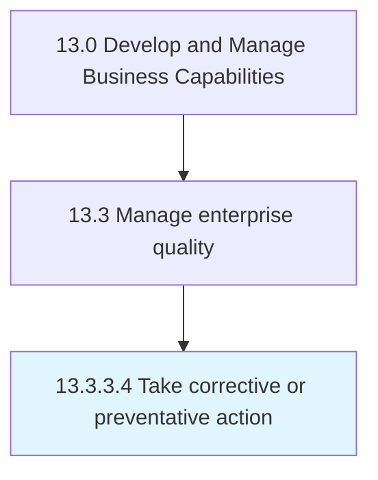

# Take corrective or preventative action

> Pursuing corrective and preventative activities to eliminate the cause of a detected nonconformity.

## Overview

Activity 13.3.3.4 is an activity within the Develop and Manage Business Capabilities framework. 

Pursuing corrective and preventative activities to eliminate the cause of a detected nonconformity. Define the nonconformity. Communicate and assign responsibility. Identify the appropriate corrective and preventive action. Implement and monitor for reoccurrence.

## Process Hierarchy



## Key Statistics

| Metric | Value |
|--------|-------|
| APQC Code | 17496 |
| Hierarchy ID | 13.3.3.4 |
| Level | Activity |
| Parent | [13.3.3](../) |
| Sub-Processes | 0 |


## GraphDL Semantic Structure

```
take.CorrectiveOrPreventativeAction
```

| Component | Value | Description |
|-----------|-------|-------------|
| Verb | `take` | Primary action |
| Object | `corrective or preventative action` | Direct object |


## Related Concepts

- CorrectiveAction
- PreventativeAction


---

*Source: APQC PCF 17496 (13.3.3.4) - APQC*
