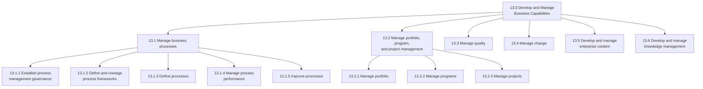
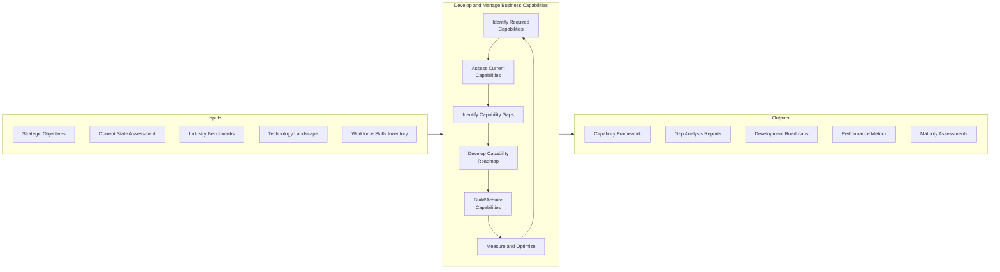
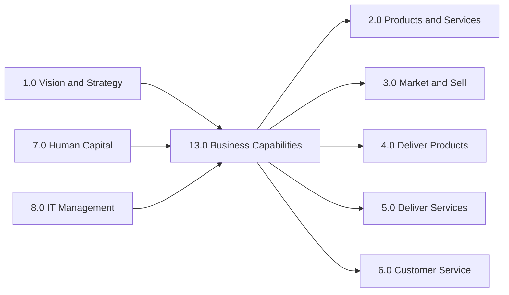

# Develop and Manage Business Capabilities

> Performing activities by an organization that are fundamental to the successful operation of the organization, even across functions in a business. Capabilities defined in the PCF include business process management; portfolio, program, and project management; quality management; change management; benchmarking; environmental health and safety management; and knowledge management.

## Overview

APQC Category 13.0 - Develop and Manage Business Capabilities encompasses the foundational organizational competencies that enable effective execution across all business functions. This category focuses on establishing, maintaining, and continuously improving the core capabilities that differentiate an organization and drive operational excellence.

Business capabilities represent what an organization must be able to do to execute its strategy and deliver value to customers. Unlike processes (which describe how work gets done), capabilities describe the organizational capacity to perform specific functions. This category addresses capability identification, assessment, development, and alignment with strategic objectives.

The processes within this category work in concert with strategy (Category 1.0), customer experience management (Category 6.0), and human capital development (Category 7.0) to ensure the organization has the right capabilities in place to achieve its objectives.

## Process Hierarchy



## Key Statistics

| Metric | Value |
|--------|-------|
| APQC Code | 10013 |
| Hierarchy ID | 13.0 |
| Level | Category |
| Process Groups | 6 |
| Total Sub-Processes | 150+ |

## Process Flow



## GraphDL Semantic Structure

```
develop.BusinessCapabilities.and.ManageBusinessCapabilities
```

| Component | Value | Description |
|-----------|-------|-------------|
| Verb | `develop` | Primary action of creating and building |
| Object | `BusinessCapabilities` | Core organizational competencies |
| Preposition | `and` | Conjunction linking dual actions |
| PrepObject | `ManageBusinessCapabilities` | Ongoing governance and optimization |

## Processes in this Category

### Capability Identification and Assessment

Processes focused on understanding what capabilities are needed and evaluating current state.

- [Identify required capabilities](./RequiredCapabilities.mdx) - Determining necessary skills and competencies for customer experience support
- [Confirm internal capabilities](./InternalCapabilities.mdx) - Verifying organizational infrastructure and resource sufficiency
- [Identify required channel capabilities](./ChannelCapabilities.mdx) - Determining distribution channel capacity requirements

### Capability Development and Implementation

Processes focused on building and deploying capabilities across the organization.

- [Develop customer experience roadmap](./CXRoadmap.mdx) - Creating guidelines to implement defined capabilities
- [Match needs to supply capabilities](./SupplyCapabilities.mdx) - Synchronizing procurement needs with supplier capabilities

### 13.1 Manage Business Processes

Establishing and administering governance for management of the processes. Outline and manage the frameworks for management of the processes. Define the business processes. Administer the performance of the processes. Enhance the business processes.

### 13.2 Manage Portfolio, Program, and Project Management

Managing the portfolio of initiatives, programs, and projects that enable capability development.

### 13.3 Manage Quality

Establishing quality management systems and continuous improvement frameworks.

### 13.4 Manage Change

Managing organizational change to ensure successful capability adoption.

### 13.5 Develop and Manage Enterprise Content

Creating and maintaining enterprise content that supports capability execution.

### 13.6 Develop and Manage Knowledge Management

Capturing, organizing, and sharing organizational knowledge.

## Related Categories



## RACI Matrix

| Activity | Responsible | Accountable | Consulted | Informed |
|----------|-------------|-------------|-----------|----------|
| Define capability framework | Strategy Team | Chief Strategy Officer | All BU Heads | All departments |
| Assess current capabilities | Operations | COO | HR, IT | Executive team |
| Identify capability gaps | Strategy Team | CEO | Finance, HR | Board |
| Develop capability roadmap | PMO | CSO | All departments | All employees |
| Build/acquire capabilities | BU Heads | COO | HR, Procurement | Finance |
| Measure capability performance | PMO | CFO | Operations | Executive team |

## Related Departments

- [Executive Office](/departments/Executive/index) - Strategic oversight and accountability
- [Strategy & Planning](/departments/Strategy/index) - Capability framework development
- [Operations](/departments/Operations/index) - Capability execution and optimization
- [Human Resources](/departments/HR/index) - Workforce capability development
- [Information Technology](/departments/IT) - Technology capability enablement
- [Project Management Office](/departments/PMO) - Capability initiative management

## Related Occupations

- [Chief Executive Officers](/occupations/Management/ChiefExecutives) - Ultimate accountability for organizational capabilities
- [General and Operations Managers](/occupations/GeneralManagers) - Capability implementation oversight
- [Management Analysts](/occupations/Business/Operations/ManagementAnalysts) - Capability assessment and consulting
- [Training and Development Managers](/occupations/TrainingManagers) - Workforce capability building
- [Computer and Information Systems Managers](/occupations/ITManagers) - Technology capability management

## Industry Variations

### Aerospace and Defense

In aerospace and defense, business capability management emphasizes long-cycle technology development, regulatory compliance capabilities, and security clearance management. Organizations maintain detailed capability roadmaps aligned with defense budget cycles (FYDP) and technology readiness levels (TRL).

**Industry-Specific Focus:**
- Technology readiness assessment
- Security clearance capability
- Long-cycle program management
- Defense contract compliance

### Banking

Banking institutions focus on regulatory compliance capabilities, digital transformation, and risk management. Capability frameworks must address evolving fintech competition and changing customer expectations for digital services.

**Industry-Specific Focus:**
- Regulatory compliance capabilities
- Digital banking transformation
- Cybersecurity capabilities
- Customer data management

### Healthcare Provider

Healthcare organizations emphasize clinical capabilities, quality of care metrics, and population health management. Capability development must align with value-based care models and regulatory requirements (HIPAA, meaningful use).

**Industry-Specific Focus:**
- Clinical excellence capabilities
- Population health management
- Interoperability capabilities
- Patient experience management

### Retail

Retail organizations focus on omnichannel capabilities, supply chain agility, and customer experience. Capability frameworks address rapid shifts in consumer behavior and competitive pressure from e-commerce.

**Industry-Specific Focus:**
- Omnichannel fulfillment
- Inventory visibility
- Customer personalization
- Last-mile delivery

## Metrics & KPIs

| Metric | Description | Target |
|--------|-------------|--------|
| Capability Maturity Index | Average maturity level across core capabilities | Level 4 (Managed) |
| Capability Gap Closure Rate | Percentage of identified gaps addressed per year | >75% |
| Strategic Alignment Score | Capabilities aligned with strategic objectives | >90% |
| Capability Investment ROI | Return on capability development investments | >20% |
| Time to Capability | Average time to develop new capabilities | <12 months |
| Capability Utilization | Percentage of capabilities actively utilized | >85% |

---

*Source: APQC PCF 10013 (13.0) - Cross-Industry*
