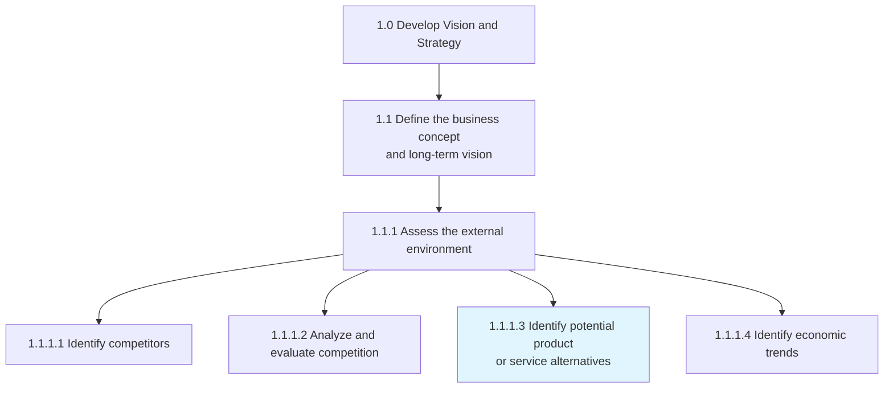
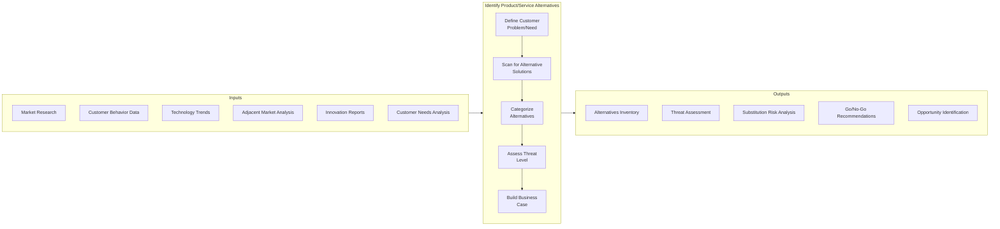
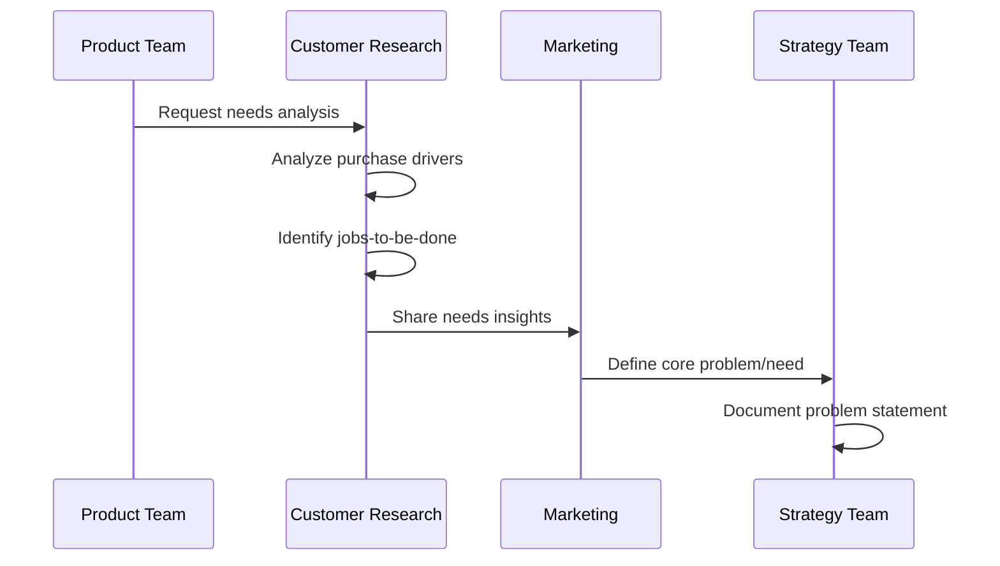
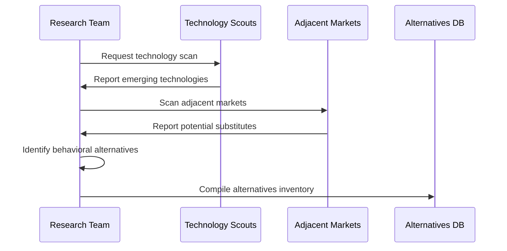
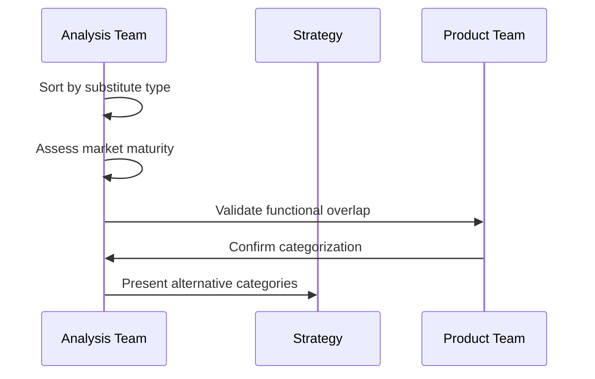
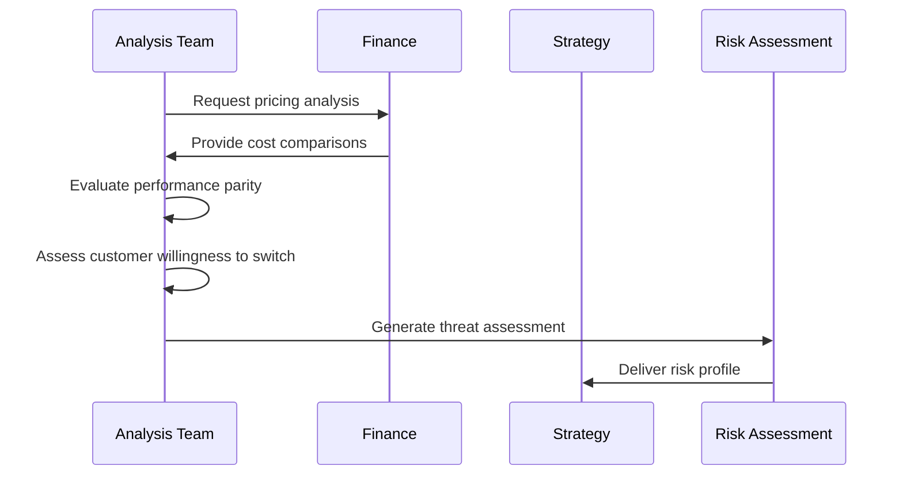
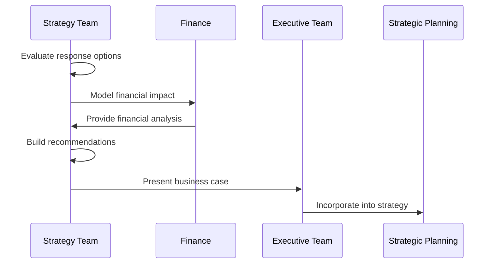
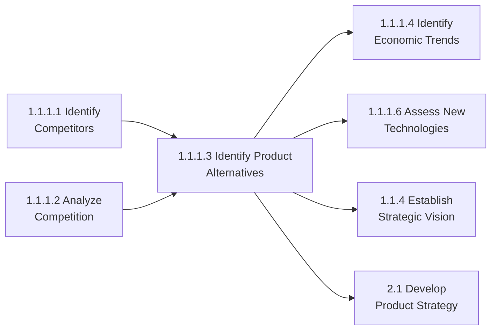

# Identify potential product or service alternatives

> Examining if there are other existing products or services in the marketplace, and building the business case to make a go/no go decision based upon substitutions.

## Overview

Identify potential product or service alternatives (APQC 1.1.1.3) is an activity within the "Assess the external environment" process that focuses on understanding substitute products and services that could threaten the organization's market position. This process goes beyond direct competitor analysis to examine alternative solutions that customers might choose to solve the same problem or fulfill the same need.

Understanding alternatives is critical for strategic planning as it helps organizations anticipate market shifts, identify potential disruption threats, and discover opportunities for diversification or innovation. The process involves systematic scanning of adjacent markets, emerging technologies, and changing customer behaviors that could introduce new alternatives.

## Process Hierarchy



## Key Statistics

| Metric | Value |
|--------|-------|
| APQC Code | 21421 |
| Hierarchy ID | 1.1.1.3 |
| Level | Activity |
| Category | [Develop Vision and Strategy](/processes/01-Strategy) |
| Parent Process | [Define business concept and long-term vision](./BusinessConcept.mdx) |
| Related | [Identify competitors](./Competitors.mdx), [Analyze competition](./CompetitiveAnalysis.mdx) |

## Process Flow



## GraphDL Semantic Structure

```
identify.PotentialProductOrServiceAlternatives
```

| Component | Value | Description |
|-----------|-------|-------------|
| Verb | `identify` | Primary action of discovering and cataloging |
| Object | `Alternatives` | Substitute products or services |
| Preposition | `for` | Relationship to current offerings |
| PrepObject | `ProductsOrServices` | Organization's current offerings |

## Activities

### Define Customer Problem/Need

Clearly articulating the underlying customer problem or need that the organization's products/services address, which forms the basis for identifying alternatives.



**Tasks:**
- `analyze.CustomerJobsToBeDone` - Identify underlying tasks customers are trying to accomplish
- `define.CoreProblem` - Articulate the fundamental problem being solved
- `map.CustomerJourney` - Understand decision points where alternatives appear
- `identify.SwitchingTriggers` - Determine what causes customers to seek alternatives

### Scan for Alternative Solutions

Systematically searching for products, services, technologies, or behaviors that could serve as substitutes.



**Tasks:**
- `scan.EmergingTechnologies` - Identify technologies that could enable substitutes
- `analyze.AdjacentMarkets` - Examine related markets for alternative solutions
- `identify.BehavioralSubstitutes` - Find alternative behaviors (e.g., DIY, do-nothing)
- `monitor.DisruptiveInnovation` - Track innovations that could disrupt the market

### Categorize Alternatives

Classifying identified alternatives by type, threat level, and time horizon.



**Tasks:**
- `classify.DirectSubstitutes` - Identify products serving same function
- `classify.IndirectSubstitutes` - Identify different approaches to same need
- `classify.EmergingAlternatives` - Categorize nascent but potential threats
- `assess.TimeHorizon` - Determine when alternatives may become viable threats

### Assess Threat Level

Evaluating the severity of threat each alternative poses to the organization's market position.



**Tasks:**
- `analyze.PricePerformance` - Compare alternatives on value proposition
- `assess.SwitchingCosts` - Evaluate barriers to customer switching
- `evaluate.MarketReadiness` - Determine customer awareness and acceptance
- `project.AdoptionCurve` - Forecast alternative adoption trajectory

### Build Business Case

Developing recommendations and business cases for strategic responses to identified alternatives.



**Tasks:**
- `develop.ResponseOptions` - Create strategic response alternatives
- `model.FinancialImpact` - Analyze revenue/margin implications
- `recommend.GoNoGo` - Provide decision recommendations
- `identify.Opportunities` - Find opportunities from alternative trends

## RACI Matrix

| Activity | Responsible | Accountable | Consulted | Informed |
|----------|-------------|-------------|-----------|----------|
| Define customer problem/need | Product Management | CPO | Marketing, Customer Research | Strategy Team |
| Scan for alternative solutions | Market Research | Strategy Director | R&D, Technology | Executive Team |
| Categorize alternatives | Strategy Team | CSO | Product, Marketing | Business Units |
| Assess threat level | Competitive Intelligence | CSO | Finance, Sales | Board |
| Build business case | Strategy Team | CEO | Finance, Legal | All Departments |

## Related Departments

- [Strategy & Planning](/departments/Strategy/index) - Overall alternatives assessment
- [Product Management](/departments/Product) - Product comparison and positioning
- [Marketing](/departments/Marketing/index) - Market research and customer insights
- [Research & Development](/departments/Research) - Technology assessment
- [Finance](/departments/Finance/index) - Financial impact analysis
- Innovation - Emerging technology scanning

## Related Occupations

- [Market Research Analysts](/occupations/MarketResearchAnalysts) - Alternative solution research
- [Product Managers](/occupations/ProductManagers) - Competitive product assessment
- [Innovation Managers](/occupations/InnovationManagers) - Emerging technology evaluation
- [Business Strategists](/occupations/BusinessStrategists) - Strategic response development
- [Technology Scouts](/occupations/TechnologyScouts) - Disruptive technology identification

## Industry Variations

### Aerospace and Defense

In aerospace and defense, alternatives often involve different platform types (e.g., unmanned vs. manned systems) or alternative mission capabilities.

**Industry-Specific Activities:**
- Identify alternative platform configurations
- Assess unmanned/autonomous system alternatives
- Evaluate commercial off-the-shelf (COTS) substitutes
- Monitor dual-use technology development

### Airline

Airlines face alternatives including other transport modes, virtual meeting technologies, and alternative travel experiences.

**Industry-Specific Activities:**
- Assess high-speed rail competition
- Evaluate video conferencing impact on business travel
- Monitor ride-sharing impact on short-haul routes
- Analyze regional jet vs. turboprop alternatives

### Automotive

Automotive alternatives include public transit, ride-sharing, car-sharing, and micro-mobility options.

**Industry-Specific Activities:**
- Assess mobility-as-a-service alternatives
- Evaluate micro-mobility (e-bikes, scooters) impact
- Monitor autonomous ride-hailing development
- Analyze car-sharing impact on ownership

### Banking

Banking faces alternatives from fintech, cryptocurrencies, peer-to-peer lending, and big tech financial services.

**Industry-Specific Activities:**
- Assess cryptocurrency and stablecoin alternatives
- Evaluate peer-to-peer lending platforms
- Monitor big tech payment solutions
- Analyze buy-now-pay-later alternatives to credit

### Broadcasting

Broadcasting alternatives include streaming services, user-generated content platforms, and gaming/interactive entertainment.

**Industry-Specific Activities:**
- Assess streaming service alternatives
- Evaluate social media content consumption
- Monitor gaming as entertainment substitute
- Analyze podcast and audio alternatives

### City Government

City governments face alternatives in service delivery through privatization, regional consolidation, or technology-enabled solutions.

**Industry-Specific Activities:**
- Assess privatization of municipal services
- Evaluate regional service sharing alternatives
- Monitor technology-enabled citizen self-service
- Analyze public-private partnership alternatives

### Education

Educational alternatives include online learning, homeschooling, vocational training, and micro-credentialing.

**Industry-Specific Activities:**
- Assess online learning platform alternatives
- Evaluate competency-based education models
- Monitor micro-credentialing and bootcamps
- Analyze apprenticeship and vocational alternatives

### Healthcare Provider

Healthcare alternatives include retail clinics, telehealth, home care, and alternative medicine approaches.

**Industry-Specific Activities:**
- Assess retail clinic service expansion
- Evaluate hospital-at-home alternatives
- Monitor wearable health monitoring impact
- Analyze direct primary care alternatives

### Retail

Retail faces alternatives from direct-to-consumer brands, subscription models, and experiential shopping.

**Industry-Specific Activities:**
- Assess direct-to-consumer brand expansion
- Evaluate subscription service alternatives
- Monitor rental and resale alternatives
- Analyze social commerce platforms

## Sub-Processes

| Process | Code | Description |
|---------|------|-------------|
| Define customer need | - | Articulate underlying problem/need |
| Scan alternatives | - | Search for substitute solutions |
| Categorize alternatives | - | Classify by type and threat level |
| Assess threats | - | Evaluate severity of substitution risk |
| Build business case | - | Develop strategic response recommendations |

## Related Processes



## Metrics & KPIs

| Metric | Description | Target |
|--------|-------------|--------|
| Alternative Coverage | Percentage of potential alternatives identified | >90% |
| Threat Assessment Accuracy | Accuracy of threat level predictions | >70% |
| Time to Detection | Speed of identifying new alternatives | <60 days |
| Response Time | Time from detection to strategic response | <90 days |
| Market Share Protection | Revenue protected from alternative threats | >95% |
| Opportunity Conversion | Alternatives converted to opportunities | >10% |

---

*Source: APQC PCF 21421 (1.1.1.3) - Cross-Industry*
