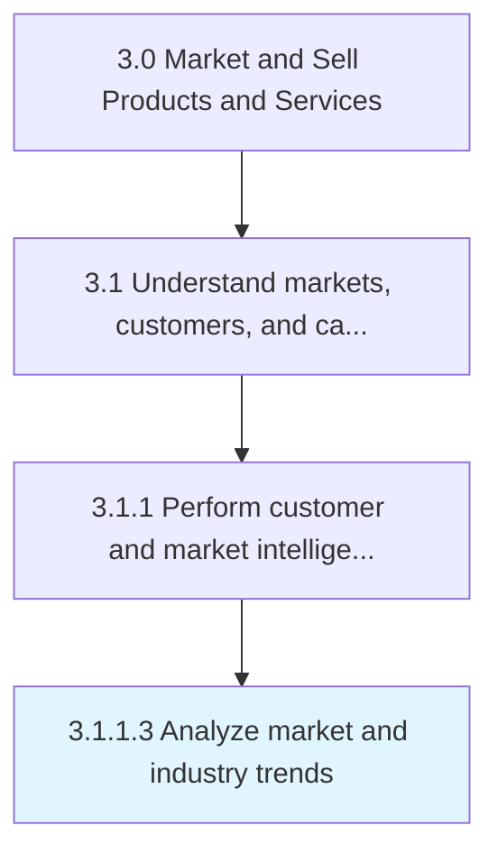

# Analyze market and industry trends

> Examining large-scale shifts and trends, with relevance to the organization's products/services.

## Overview

Activity 3.1.1.3 is an activity within the Market and Sell Products and Services framework. 

Examining large-scale shifts and trends, with relevance to the organization's products/services. Vet the industrial and larger market landscape to identify broad-based movements that could have a direct or tangential impact on the uptake of the organization's products/services. Examine, among other things, the market capitalization of similar products, the profitability of organizations offering competing products/services, the stock price of key vendors/suppliers in the organizational value-chain, the rate and scale of innovation activity in the organization's product/service category, the price and availability of raw materials, and the shelf-life of similar products/services. Conduct primary and secondary research, and consider enlisting professional services.

## Process Hierarchy



## Key Statistics

| Metric | Value |
|--------|-------|
| APQC Code | 10110 |
| Hierarchy ID | 3.1.1.3 |
| Level | Activity |
| Parent | [3.1.1](../) |
| Sub-Processes | 0 |


## GraphDL Semantic Structure

```
analyze.MarketAndIndustryTrends
```

| Component | Value | Description |
|-----------|-------|-------------|
| Verb | `analyze` | Primary action |
| Object | `market and industry trends` | Direct object |


## Related Concepts

- MarketTrends
- IndustryTrends


---

*Source: APQC PCF 10110 (3.1.1.3) - APQC*

## Related Occupations

- [Market Research Analysts and Marketing Specialists](/occupations/Business/MarketResearchAnalystsAndMarketingSpecialists)
- [Marketing Managers](/occupations/Management/MarketingManagers)
- [Management Analysts](/occupations/Business/ManagementAnalysts)
- [Financial and Investment Analysts](/occupations/Finance/FinancialAndInvestmentAnalysts)
- [Economists](/occupations/SocialScience/Economists)

## Related Departments

- [Marketing](/departments/Marketing)
- [Strategy](/departments/Strategy)
- [Business Development](/departments/BusinessDevelopment)
- [Product Management](/departments/Product)

## Industry Variations

This process applies universally across all industries, with the following common best practices:

### Universal Applicability

Market and industry trend analysis is fundamental to strategic planning in every sector. All organizations must understand external forces shaping their competitive landscape, regardless of industry.

### Cross-Industry Best Practices

| Practice | Description |
|----------|-------------|
| Regular Cadence | Conduct formal trend analysis quarterly with monthly monitoring |
| Multiple Sources | Combine industry reports, financial data, news, and primary research |
| Structured Framework | Use PESTLE or similar frameworks for comprehensive environmental scanning |
| Forward-Looking Focus | Balance current state analysis with predictive trend modeling |
| Stakeholder Integration | Involve cross-functional leaders in trend interpretation |

### Common Metrics

- Number of trends monitored and tracked
- Time from trend identification to strategic response
- Forecast accuracy for market sizing
- Coverage of relevant industry segments analyzed
