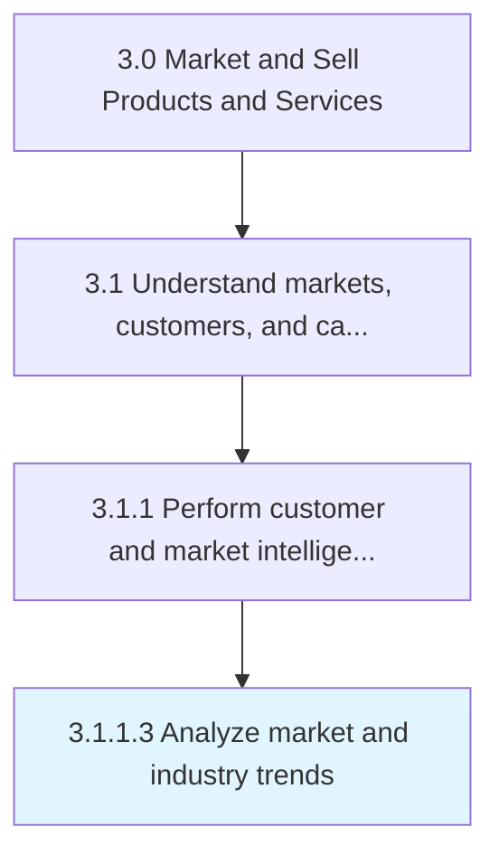

# Analyze market and industry trends

> Examining large-scale shifts and trends, with relevance to the organization's products/services.

## Overview

Activity 3.1.1.3 is an activity within the Market and Sell Products and Services framework. 

Examining large-scale shifts and trends, with relevance to the organization's products/services. Vet the industrial and larger market landscape to identify broad-based movements that could have a direct or tangential impact on the uptake of the organization's products/services. Examine, among other things, the market capitalization of similar products, the profitability of organizations offering competing products/services, the stock price of key vendors/suppliers in the organizational value-chain, the rate and scale of innovation activity in the organization's product/service category, the price and availability of raw materials, and the shelf-life of similar products/services. Conduct primary and secondary research, and consider enlisting professional services.

## Process Hierarchy



## Key Statistics

| Metric | Value |
|--------|-------|
| APQC Code | 10110 |
| Hierarchy ID | 3.1.1.3 |
| Level | Activity |
| Parent | [3.1.1](../) |
| Sub-Processes | 0 |


## GraphDL Semantic Structure

```
analyze.MarketAndIndustryTrends
```

| Component | Value | Description |
|-----------|-------|-------------|
| Verb | `analyze` | Primary action |
| Object | `market and industry trends` | Direct object |


## Related Concepts

- MarketTrends
- IndustryTrends


---

*Source: APQC PCF 10110 (3.1.1.3) - APQC*

## Related Occupations

- [General and Operations Managers](/occupations/Management/GeneralAndOperationsManagers)
- [Management Analysts](/occupations/Business/ManagementAnalysts)
- [Chief Executives](/occupations/Management/ChiefExecutives)

## Related Departments

- [Executive](/departments/Executive)
- [Operations](/departments/Operations)
- [Finance](/departments/Finance)
