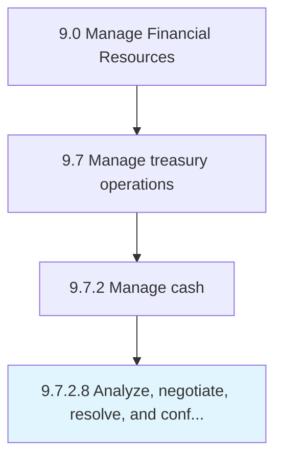

# Analyze, negotiate, resolve, and confirm bank fees

> Studying and finalizing bank fees for services provided by banks.

## Overview

Activity 9.7.2.8 is an activity within the Manage Financial Resources framework. 

Studying and finalizing bank fees for services provided by banks. Negotiate and finalize nominal fees that bank charges for various services, such as requesting a deposit slip or counter check or certifying papers.

## Process Hierarchy



## Key Statistics

| Metric | Value |
|--------|-------|
| APQC Code | 10900 |
| Hierarchy ID | 9.7.2.8 |
| Level | Activity |
| Parent | [9.7.2](../) |
| Sub-Processes | 0 |


## GraphDL Semantic Structure

```
analyze,.NegotiateResolveAndConfirmBankFees
```

| Component | Value | Description |
|-----------|-------|-------------|
| Verb | `analyze,` | Primary action |
| Object | `negotiate, resolve, and confirm bank fees` | Direct object |


## Related Concepts

- BankFees
- BankFees
- BankFees
- BankFees


---

*Source: APQC PCF 10900 (9.7.2.8) - APQC*

## Related Occupations

- [Treasurers and Controllers](/occupations/Management/TreasurersAndControllers)
- [Financial Managers](/occupations/Management/FinancialManagers)
- [Financial Analysts](/occupations/Finance/FinancialAndInvestmentAnalysts)
- [Accountants and Auditors](/occupations/Finance/AccountantsAndAuditors)
- [Purchasing Agents](/occupations/Business/PurchasingAgentsExceptWholesaleRetailAndFarmProducts)

## Related Departments

- [Treasury](/departments/Treasury)
- [Finance](/departments/Finance)
- [Procurement](/departments/Procurement)
- [Accounts Payable](/departments/AccountsPayable)

## Industry Variations

This process applies universally across all industries, with the following common best practices:

### Universal Applicability

Bank fee analysis and negotiation is essential for all organizations managing banking relationships. Proactive fee management reduces costs and ensures fair value from banking partners.

### Cross-Industry Best Practices

| Practice | Description |
|----------|-------------|
| Fee Analysis Tools | Use account analysis software to decode bank fee statements |
| Benchmark Comparison | Compare fees against industry standards and peer organizations |
| Volume Consolidation | Leverage transaction volumes for better pricing |
| Annual Review | Conduct formal fee reviews at least annually |
| Documentation | Maintain records of fee agreements and negotiation outcomes |

### Common Metrics

- Bank fees as percentage of revenue
- Fee reduction achieved through negotiation
- Error rate in bank fee statements
- Time to resolve fee disputes
- Variance from negotiated fee schedules
