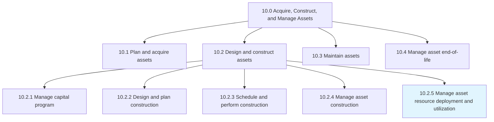
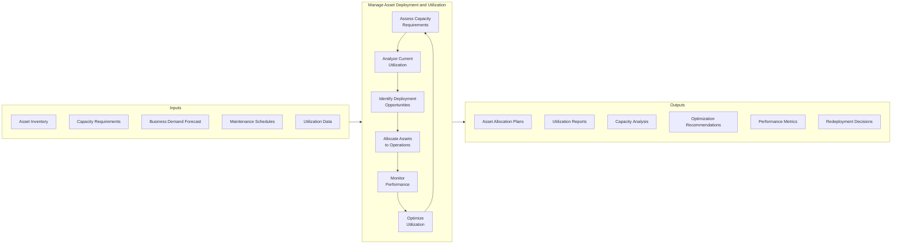
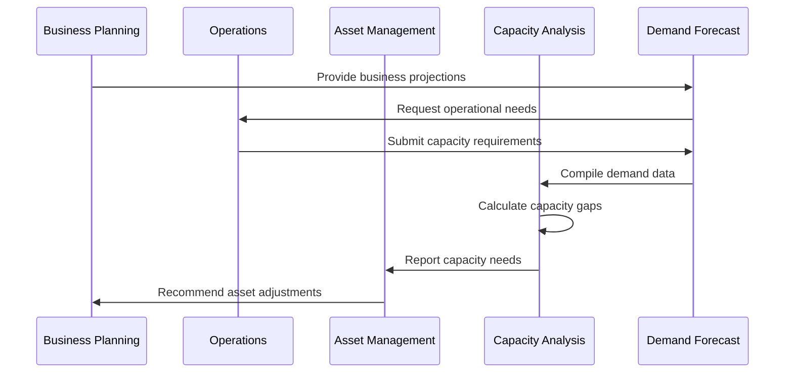
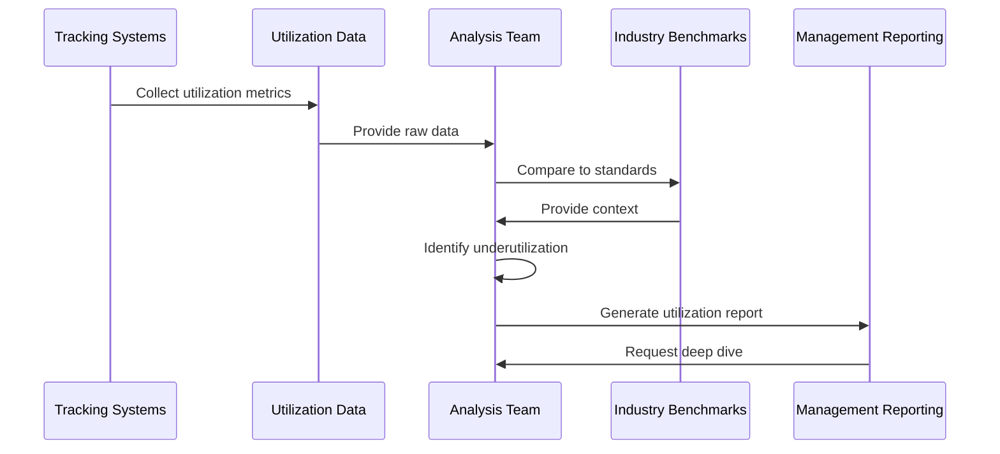
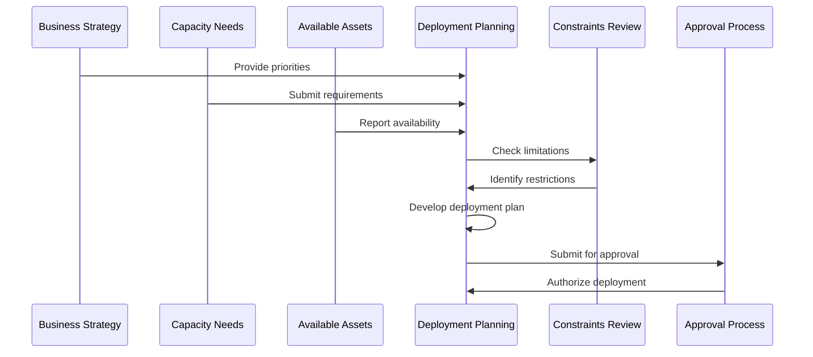
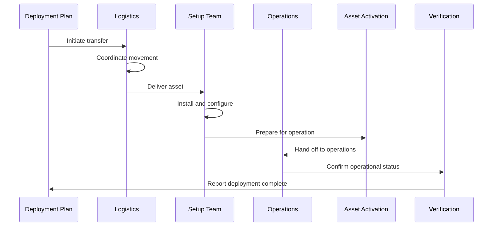
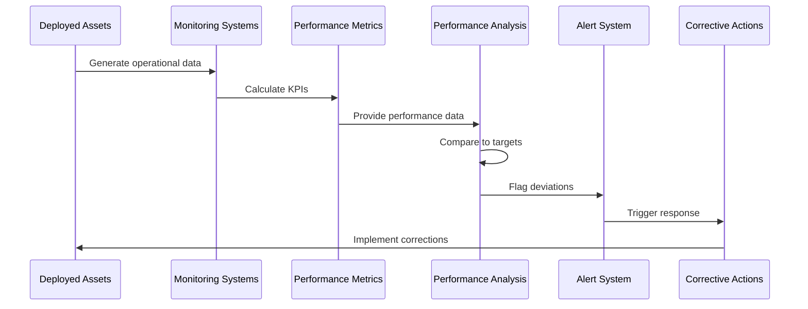
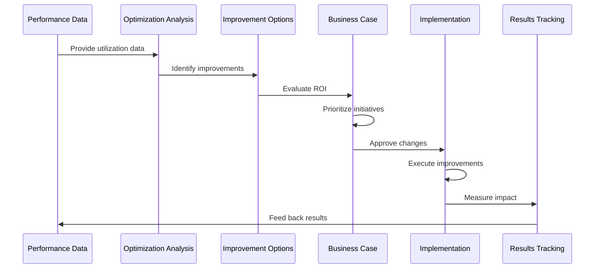
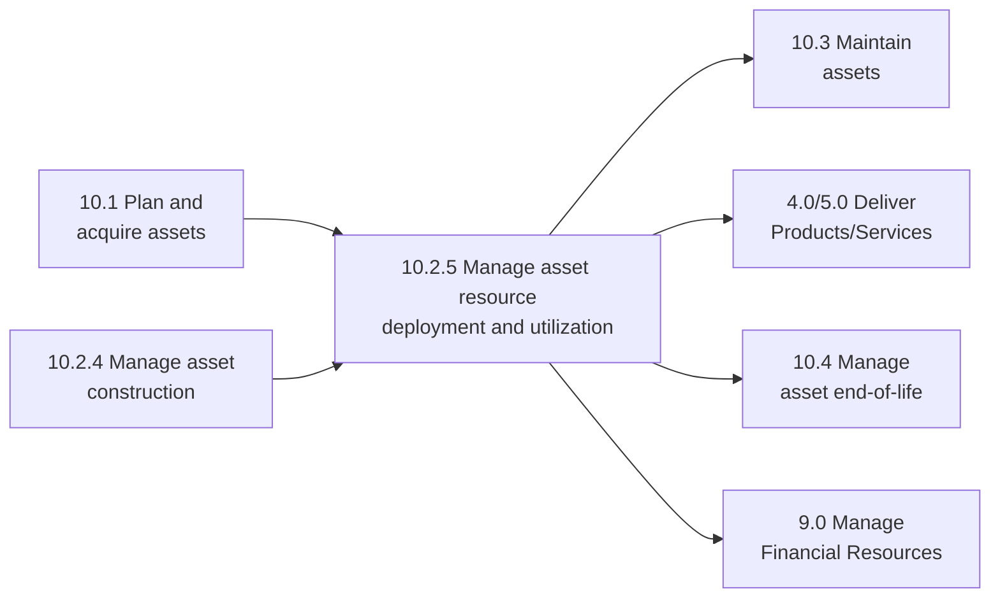

# Manage asset resource deployment and utilization

> Distributing or allocating asset resources in different processes for optimal utilization.

## Overview

Manage asset resource deployment and utilization is a strategic process within the Acquire, Construct, and Manage Assets category (10.0). This process focuses on maximizing the value derived from organizational assets by ensuring they are deployed effectively across business operations and utilized optimally throughout their useful life.

Effective asset deployment requires balancing capacity needs across business units, minimizing idle time, ensuring proper maintenance to sustain performance, and making informed decisions about asset allocation. This process bridges strategic asset planning with operational execution, ensuring that capital investments deliver expected returns.

## Process Hierarchy



## Key Statistics

| Metric | Value |
|--------|-------|
| APQC Code | 10781 |
| Hierarchy ID | 10.2.5 |
| Level | Process |
| Parent Process | [Design and construct assets](/processes/10-Assets) |
| Category | [Acquire, Construct, and Manage Assets](/processes/10-Assets) |
| Related Categories | 4.0 Deliver Products, 5.0 Deliver Services |

## Process Flow



## GraphDL Semantic Structure

```
manage.AssetResourceDeploymentAndUtilization
```

| Component | Value | Description |
|-----------|-------|-------------|
| Verb | `manage` | Primary action of overseeing and directing |
| Object | `AssetResourceDeploymentAndUtilization` | Asset placement and usage optimization |
| Preposition | `for` | Relationship to operational purpose |
| PrepObject | `OptimalUtilization` | Goal of maximizing asset value |

## Activities

### Assess Capacity Requirements

Analyzing business demand forecasts and operational requirements to determine asset capacity needs across the organization.



**Tasks:**
- `gather.DemandForecasts` - Collect business growth projections
- `assess.OperationalRequirements` - Determine production/service needs
- `calculate.CapacityGaps` - Identify surplus/shortage situations
- `prioritize.CapacityNeeds` - Rank requirements by business impact

### Analyze Current Asset Utilization

Measuring and evaluating how effectively assets are currently being used to identify improvement opportunities.



**Tasks:**
- `collect.UtilizationMetrics` - Gather runtime, throughput, idle time data
- `calculate.OEE` - Compute Overall Equipment Effectiveness
- `benchmark.Performance` - Compare to industry standards
- `identify.Underutilization` - Flag assets with low usage

### Plan Asset Deployment

Developing deployment strategies that align asset allocation with business priorities and operational requirements.



**Tasks:**
- `develop.AllocationStrategy` - Create asset distribution plan
- `balance.CapacityRequirements` - Match assets to needs
- `consider.Constraints` - Account for physical, technical, regulatory limits
- `obtain.DeploymentApproval` - Secure authorization

### Execute Asset Allocation

Implementing asset deployment decisions by physically moving, configuring, and activating assets in target operations.



**Tasks:**
- `coordinate.AssetTransfer` - Manage physical movement
- `execute.Installation` - Complete setup and configuration
- `perform.Commissioning` - Validate operational readiness
- `confirm.Deployment` - Verify successful placement

### Monitor Asset Performance

Tracking asset performance metrics to ensure deployed assets meet utilization and productivity expectations.



**Tasks:**
- `track.OperationalMetrics` - Monitor runtime, output, quality
- `compare.ToTargets` - Evaluate against expected performance
- `identify.Deviations` - Flag underperformance
- `trigger.CorrectiveActions` - Initiate response to issues

### Optimize Asset Utilization

Continuously improving asset utilization through rebalancing, sharing arrangements, and operational improvements.



**Tasks:**
- `identify.OptimizationOpportunities` - Find improvement areas
- `evaluate.ImprovementOptions` - Assess potential changes
- `implement.UtilizationImprovements` - Execute optimization actions
- `measure.OptimizationResults` - Track improvement outcomes

## RACI Matrix

| Activity | Responsible | Accountable | Consulted | Informed |
|----------|-------------|-------------|-----------|----------|
| Assess capacity requirements | Operations Manager | COO | Business units | Finance |
| Analyze current utilization | Asset Manager | Operations Director | Maintenance | Executive team |
| Plan asset deployment | Asset Manager | COO | Facilities, Finance | All departments |
| Execute asset allocation | Facilities Team | Asset Manager | Operations | Finance |
| Monitor asset performance | Operations | Asset Manager | Maintenance | Management |
| Optimize asset utilization | Asset Manager | COO | Operations, Finance | Board |

## Related Departments

- [Operations](/departments/Operations/index) - Primary utilization management
- [Facilities](/departments/Facilities) - Asset deployment execution
- [Manufacturing](/departments/Manufacturing) - Production asset utilization
- [Finance](/departments/Finance/index) - ROI and cost analysis
- [Planning](/departments/Planning) - Capacity planning
- [Maintenance](/departments/Maintenance) - Asset availability management

## Related Occupations

- [Operations Managers](/occupations/Management/OperationsManagers) - Utilization oversight
- [Industrial Engineers](/occupations/Architecture/IndustrialEngineers) - Optimization analysis
- [Facilities Managers](/occupations/Management/FacilitiesManagers) - Deployment coordination
- [Production Managers](/occupations/ProductionManagers) - Manufacturing asset management
- [Logistics Managers](/occupations/LogisticsManagers) - Asset movement coordination

## Industry Variations

### Aerospace and Defense

Aerospace asset deployment focuses on specialized production equipment with long production cycles and security requirements. Capacity must align with multi-year program schedules.

**Industry-Specific Activities:**
- Align asset deployment with program milestones
- Manage classified equipment access
- Coordinate shared assets across programs
- Track government-furnished equipment

### Automotive

Automotive manufacturing requires flexible asset deployment to support multiple vehicle platforms and model changeovers.

**Industry-Specific Activities:**
- Plan for model year changeovers
- Manage flexible manufacturing cells
- Optimize robotic asset utilization
- Coordinate tooling deployment across plants

### Banking

Banking asset deployment covers branch networks, ATM placement, and technology infrastructure to serve customer needs efficiently.

**Industry-Specific Activities:**
- Optimize branch and ATM locations
- Deploy technology assets to support channels
- Manage seasonal capacity variations
- Balance centralized vs. distributed processing

### Healthcare Provider

Healthcare organizations deploy medical equipment and facilities to maximize patient access while ensuring quality of care.

**Industry-Specific Activities:**
- Optimize operating room scheduling
- Deploy portable diagnostic equipment
- Manage clinical equipment sharing
- Balance capacity across care settings

### Petroleum (Upstream/Downstream)

Oil and gas companies deploy drilling, production, and refining assets based on commodity markets and regulatory requirements.

**Industry-Specific Activities:**
- Deploy drilling rigs based on development plans
- Optimize refinery capacity utilization
- Manage seasonal product demand variations
- Coordinate assets across joint ventures

### Retail

Retail organizations deploy store fixtures, point-of-sale equipment, and distribution center assets to support sales channels.

**Industry-Specific Activities:**
- Deploy assets for new store openings
- Manage seasonal capacity fluctuations
- Optimize distribution center throughput
- Balance omnichannel asset requirements

### Utilities

Utility companies deploy generation, transmission, and distribution assets to meet demand while maintaining reliability.

**Industry-Specific Activities:**
- Optimize generation dispatch
- Deploy mobile assets for storm response
- Balance baseload and peaking capacity
- Manage grid asset utilization

## Utilization Metrics Framework

### Overall Equipment Effectiveness (OEE)

| Component | Calculation | World-Class Target |
|-----------|-------------|-------------------|
| Availability | (Run Time / Planned Production Time) | >90% |
| Performance | (Actual Output / Theoretical Output) | >95% |
| Quality | (Good Units / Total Units) | >99% |
| **OEE** | Availability x Performance x Quality | >85% |

### Asset Utilization Metrics

| Metric | Description | Formula |
|--------|-------------|---------|
| Utilization Rate | Actual vs. available time | (Actual Hours / Available Hours) x 100 |
| Capacity Utilization | Actual vs. maximum output | (Actual Output / Max Capacity) x 100 |
| Idle Time | Non-productive time | Total Time - (Running + Planned Downtime) |
| Throughput | Output rate | Units Produced / Time Period |

### Deployment Effectiveness

| Metric | Description | Target |
|--------|-------------|--------|
| Deployment Cycle Time | Time from decision to operational | <30 days |
| First-Time Right Rate | Deployments without rework | >95% |
| Asset Readiness | Time to operational status | <5 days |
| Redeployment Frequency | Annual asset moves | Optimized per asset type |

## Related Processes



## Sub-Activities

| Activity | Description |
|----------|-------------|
| Forecast capacity requirements | Project future asset needs |
| Analyze utilization patterns | Understand current usage |
| Identify deployment opportunities | Find placement improvements |
| Develop allocation plans | Create distribution strategies |
| Coordinate asset transfers | Manage physical movements |
| Commission deployed assets | Validate operational readiness |
| Monitor utilization metrics | Track performance KPIs |
| Implement sharing arrangements | Enable cross-unit asset use |
| Optimize asset scheduling | Improve time allocation |
| Evaluate redeployment options | Assess relocation benefits |

## Metrics & KPIs

| Metric | Description | Target |
|--------|-------------|--------|
| Asset Utilization Rate | Percentage of available time in use | >75% |
| OEE (Overall Equipment Effectiveness) | Availability x Performance x Quality | >85% |
| Capacity Utilization | Output vs. maximum capacity | >80% |
| Idle Time Percentage | Non-productive time | <10% |
| Deployment Cycle Time | Decision to operational status | <30 days |
| Asset ROI | Return on asset investment | >15% |
| Redeployment Success Rate | Successful asset transfers | >95% |

---

*Source: APQC PCF 10781 (10.2.5) - Cross-Industry*
