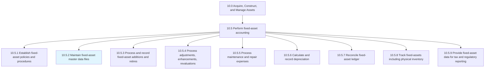
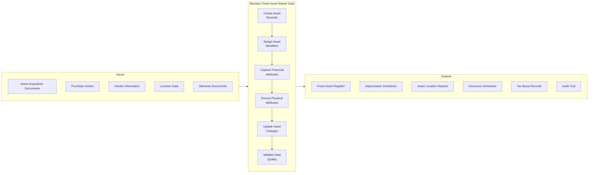
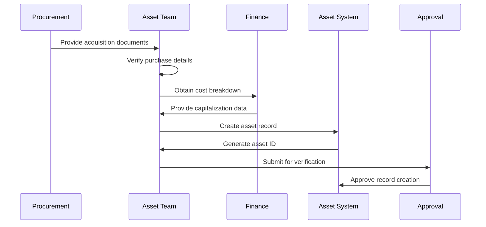
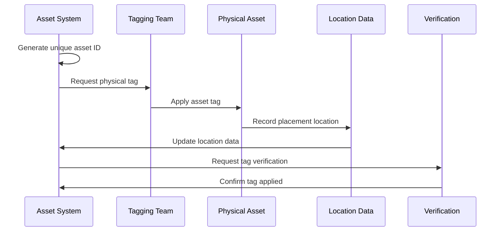
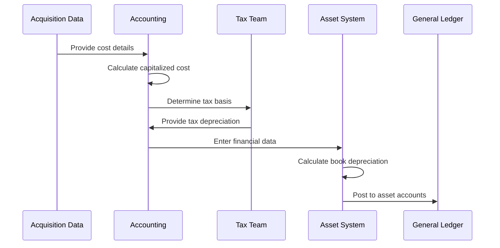
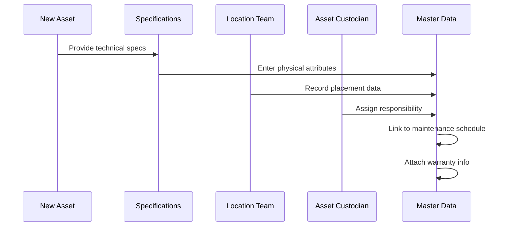
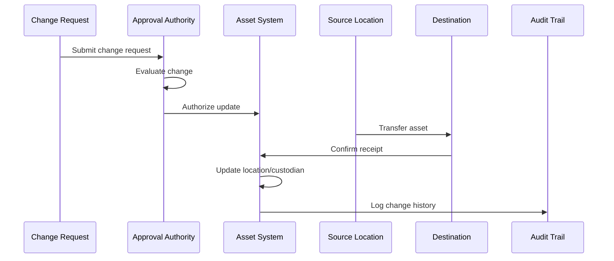
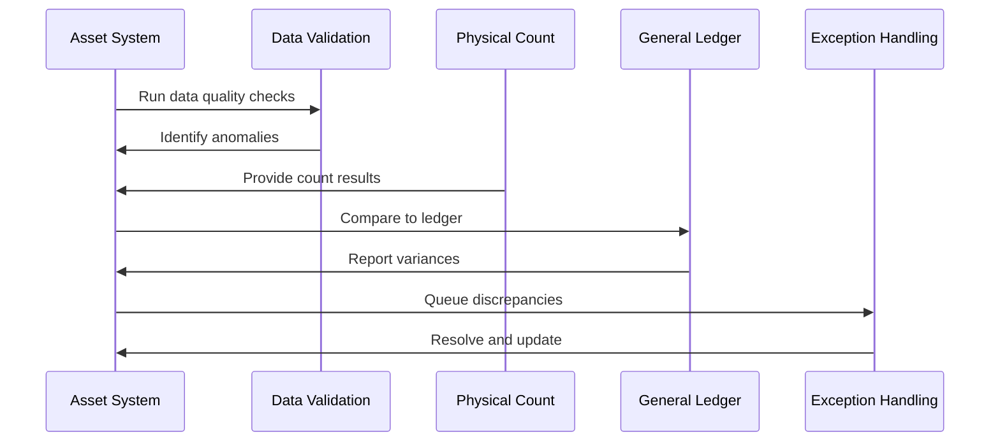
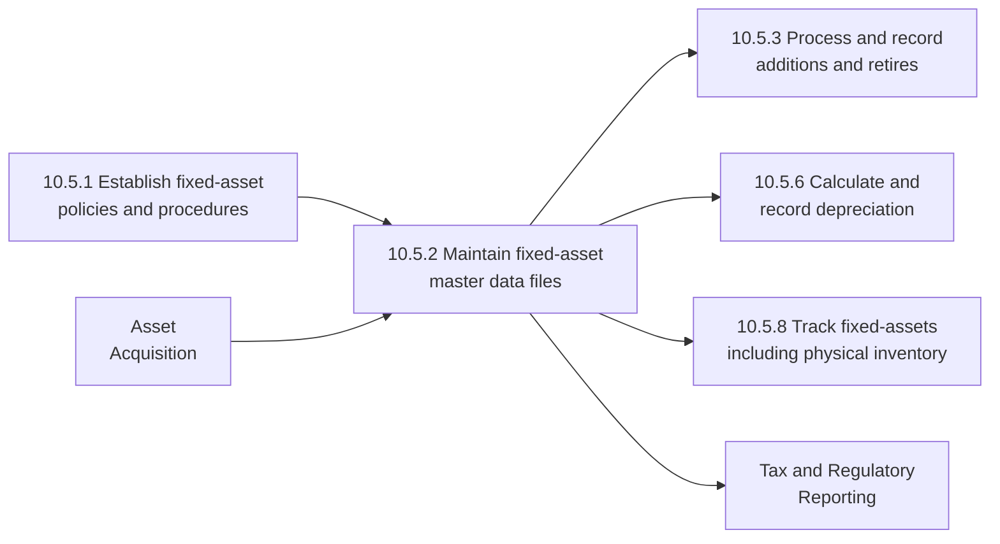

# Maintain fixed-asset master data files

> Keeping reports up-to-date regarding fixed assets. Create a fixed assets database detailing price, life cycle, depreciation rate, resale value, installation information, usage information, etc.

## Overview

Maintain fixed-asset master data files is a critical process within the Perform fixed-asset accounting process group (10.5). This process establishes and maintains the comprehensive database of all fixed assets owned by the organization. The asset register serves as the single source of truth for asset information, supporting financial reporting, operational planning, insurance coverage, and strategic decision-making.

Master data management for fixed assets ensures data accuracy, completeness, and timeliness across the asset lifecycle. This includes capturing initial acquisition details, tracking changes and transfers, monitoring utilization and condition, and recording disposal information. Effective master data management enables accurate depreciation calculations, regulatory compliance, and informed capital planning.

## Process Hierarchy



## Key Statistics

| Metric | Value |
|--------|-------|
| APQC Code | 10829 |
| Hierarchy ID | 10.5.2 |
| Level | Process |
| Parent Process | [Perform fixed-asset accounting](/processes/10-Assets/AssetAccounting) |
| Category | [Acquire, Construct, and Manage Assets](/processes/10-Assets) |
| Related Categories | 8.0 Manage IT, 9.0 Manage Financial Resources |

## Process Flow



## GraphDL Semantic Structure

```
maintain.FixedAssetMasterDataFiles
```

| Component | Value | Description |
|-----------|-------|-------------|
| Verb | `maintain` | Primary action of keeping current and accurate |
| Object | `FixedAssetMasterDataFiles` | Database of asset information |
| Preposition | `for` | Relationship to reporting purpose |
| PrepObject | `Reporting` | Purpose of maintaining accurate data |

## Activities

### Create and Initialize Asset Records

Establishing new asset records when assets are acquired, including all required data fields and proper categorization.



**Tasks:**
- `gather.AcquisitionDocumentation` - Collect purchase orders, invoices, contracts
- `verify.PurchaseDetails` - Validate acquisition cost and date
- `assign.AssetCategory` - Classify by asset type and class
- `create.AssetRecord` - Initialize record in system

### Assign Asset Identifiers and Tags

Generating unique identifiers for assets and coordinating physical tagging for tracking and inventory purposes.



**Tasks:**
- `generate.AssetIdentifier` - Create unique alphanumeric ID
- `create.PhysicalTag` - Produce barcode or RFID tag
- `apply.AssetTag` - Affix tag to physical asset
- `verify.TagPlacement` - Confirm tag visibility and readability

### Capture Financial Attributes

Recording all financial characteristics of assets including acquisition cost, salvage value, depreciation parameters, and tax basis.



**Tasks:**
- `calculate.CapitalizedCost` - Determine full acquisition cost
- `determine.SalvageValue` - Estimate end-of-life value
- `assign.DepreciationMethod` - Select depreciation approach
- `establish.TaxBasis` - Record tax treatment

### Record Physical and Operational Attributes

Capturing physical characteristics, location information, responsible parties, and operational specifications.



**Tasks:**
- `record.PhysicalSpecifications` - Document dimensions, capacity, model
- `capture.LocationData` - Record building, floor, room
- `assign.AssetCustodian` - Designate responsible party
- `attach.SupportingDocuments` - Link warranties, manuals, photos

### Update Asset Changes and Transfers

Processing and recording changes to asset information including transfers, modifications, and status updates.



**Tasks:**
- `process.TransferRequests` - Handle location changes
- `update.CustodianAssignments` - Change responsible parties
- `record.AssetModifications` - Document improvements/changes
- `maintain.AuditTrail` - Log all changes with timestamps

### Validate and Reconcile Data Quality

Ensuring accuracy and completeness of asset master data through regular validation and reconciliation procedures.



**Tasks:**
- `execute.DataValidationChecks` - Run automated quality rules
- `reconcile.PhysicalInventory` - Match records to physical counts
- `compare.SubledgerToGL` - Verify ledger agreement
- `resolve.DataExceptions` - Correct identified errors

## RACI Matrix

| Activity | Responsible | Accountable | Consulted | Informed |
|----------|-------------|-------------|-----------|----------|
| Create asset records | Asset Accountant | Controller | Procurement | Department managers |
| Assign asset identifiers | Asset Team | Asset Manager | IT | Finance |
| Capture financial attributes | Accounting | Controller | Tax | External auditors |
| Record physical attributes | Asset Team | Asset Manager | Facilities | Custodians |
| Update asset changes | Asset Team | Asset Manager | Custodians | Accounting |
| Validate data quality | Asset Team | Controller | Internal Audit | Management |

## Related Departments

- [Finance](/departments/Finance/index) - Financial attribute management
- [Accounting](/departments/Accounting) - Ledger maintenance
- [Facilities](/departments/Facilities) - Physical asset tracking
- [IT](/departments/IT) - System administration and IT assets
- [Procurement](/departments/Procurement) - Acquisition documentation
- [Operations](/departments/Operations/index) - Asset utilization data

## Related Occupations

- [Accountants and Auditors](/occupations/Accountants) - Data entry and validation
- [Financial Managers](/occupations/Management/FinancialManagers) - Oversight and governance
- [Database Administrators](/occupations/Technology/DatabaseAdministrators) - System management
- [Property Managers](/occupations/PropertyManagers) - Physical asset oversight
- [Facilities Managers](/occupations/Management/FacilitiesManagers) - Location management

## Industry Variations

### Aerospace and Defense

Aerospace asset master data must include government contract associations, security classifications, and export control markings. Serialization and configuration tracking are critical.

**Industry-Specific Data Fields:**
- Government contract number
- Security classification level
- ITAR/EAR export control status
- Configuration baseline version
- Maintenance requirement codes

### Automotive

Automotive manufacturing requires detailed tracking of production line equipment with integration to manufacturing execution systems.

**Industry-Specific Data Fields:**
- Production line assignment
- OEE (Overall Equipment Effectiveness) metrics
- Tooling specifications
- Quality certification status
- Supplier part number linkage

### Banking

Banking asset management focuses on branch and ATM network assets with regulatory reporting requirements.

**Industry-Specific Data Fields:**
- Branch/ATM identifier
- Regulatory asset category
- Core system integration ID
- Customer-facing designation
- Capital ratio classification

### Healthcare Provider

Healthcare organizations track medical devices with FDA registration requirements and patient safety implications.

**Industry-Specific Data Fields:**
- FDA device classification
- UDI (Unique Device Identifier)
- Patient contact designation
- Biomedical maintenance schedule
- Clinical department assignment

### Petroleum (Upstream/Downstream)

Oil and gas companies track exploration, production, and refining assets with environmental compliance requirements.

**Industry-Specific Data Fields:**
- Well/Platform/Facility ID
- Hydrocarbon production allocation
- Environmental permit linkage
- Asset retirement obligation estimate
- Joint venture partner allocation

### Utilities

Utility companies maintain detailed infrastructure asset records for regulatory rate-setting and reliability planning.

**Industry-Specific Data Fields:**
- Rate base classification
- Service territory mapping
- Reliability index contribution
- Regulatory vintage year
- Customer count served

## Master Data Structure

### Core Data Elements

| Data Category | Attributes | Description |
|---------------|------------|-------------|
| Identification | Asset ID, Tag Number, Serial Number | Unique identifiers |
| Classification | Category, Class, Subclass | Asset taxonomy |
| Financial | Cost, Salvage, Useful Life, Depreciation Method | Accounting parameters |
| Location | Site, Building, Floor, Room, Coordinates | Physical placement |
| Responsibility | Custodian, Department, Cost Center | Accountability |
| Status | Active, Idle, Under Repair, Disposed | Current state |

### Supporting Data Elements

| Data Category | Attributes | Description |
|---------------|------------|-------------|
| Acquisition | Purchase Date, Vendor, PO Number, Invoice | Origin information |
| Warranty | Start Date, End Date, Terms, Provider | Coverage details |
| Maintenance | Schedule, Last Service, Next Due | Service history |
| Insurance | Coverage Amount, Policy Number, Renewal | Risk protection |
| Technical | Make, Model, Capacity, Specifications | Physical characteristics |
| Documents | Manuals, Photos, Certificates | Attached files |

### Data Quality Rules

| Rule Type | Description | Example |
|-----------|-------------|---------|
| Completeness | Required fields populated | Asset ID, Cost, Location |
| Uniqueness | No duplicate identifiers | One record per asset ID |
| Validity | Values within allowed ranges | Useful life > 0 |
| Consistency | Related fields agree | Disposal date > Acquisition date |
| Timeliness | Records updated within SLA | Changes within 24 hours |

## Related Processes



## Sub-Activities

| Activity | Description |
|----------|-------------|
| Initialize asset records | Create new entries for acquired assets |
| Generate asset identifiers | Assign unique tracking numbers |
| Capture acquisition details | Record purchase information |
| Document technical specifications | Enter physical attributes |
| Assign responsibility | Designate custodians and cost centers |
| Record location data | Track physical placement |
| Attach supporting documents | Link warranties, manuals, photos |
| Process asset transfers | Update location and custodian changes |
| Update status information | Maintain current asset state |
| Archive disposed assets | Retain historical records |

## Metrics & KPIs

| Metric | Description | Target |
|--------|-------------|--------|
| Data Completeness | Percentage of required fields populated | >99% |
| Record Accuracy | Percentage matching physical verification | >98% |
| Update Timeliness | Average days to process changes | <2 days |
| Duplicate Rate | Percentage of duplicate records | <0.1% |
| Physical Match Rate | Records matching inventory count | >99% |
| Documentation Completeness | Assets with attached supporting docs | >95% |
| Audit Trail Coverage | Percentage of changes with proper logging | 100% |

---

*Source: APQC PCF 10829 (10.5.2) - Cross-Industry*
