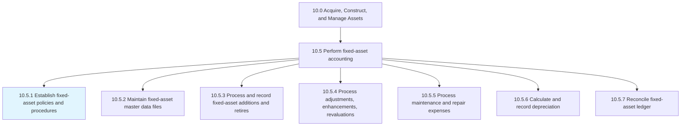
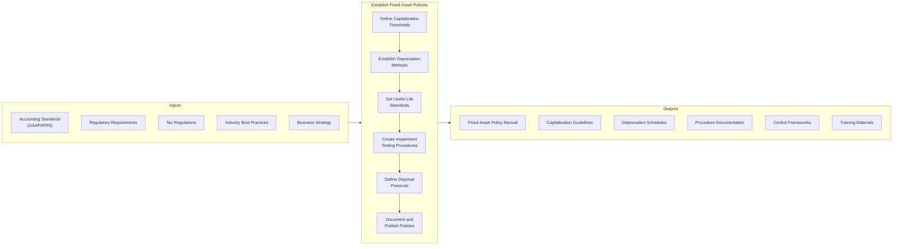
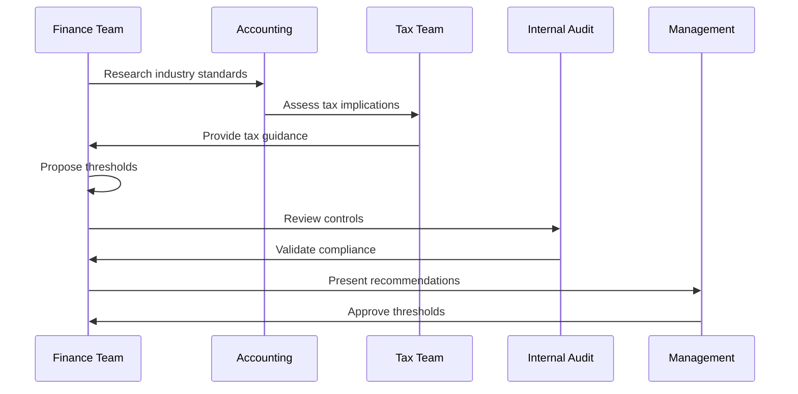
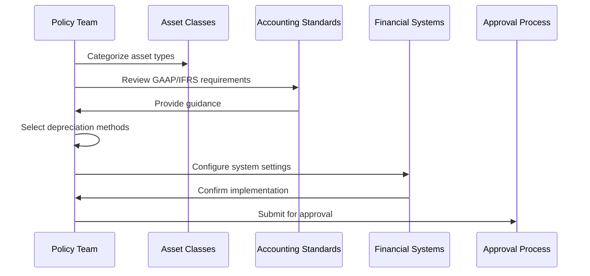
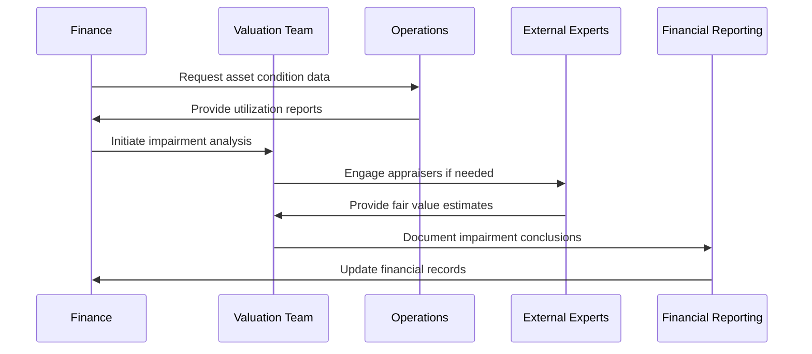
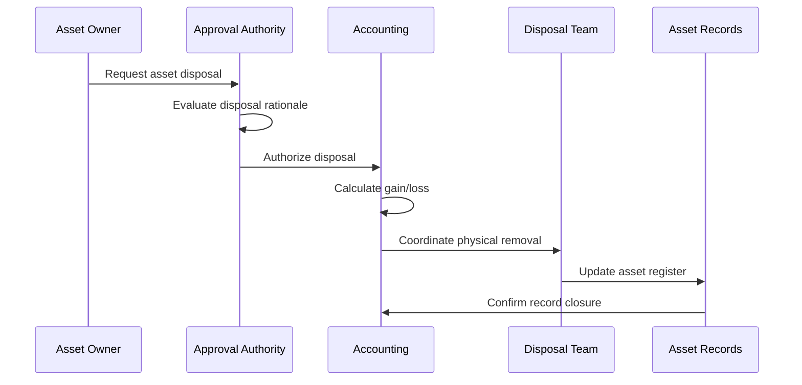
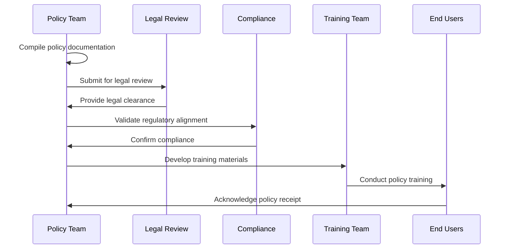
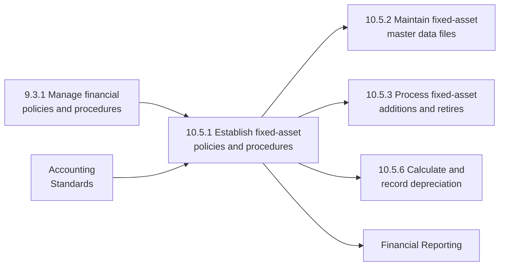

# Establish fixed-asset policies and procedures

> Creating rules for fixed assets market valuation. Make rules and regulations for fixed assets regarding depreciation, provisions, resale, usage, etc.

## Overview

Establish fixed-asset policies and procedures is a foundational process within the Perform fixed-asset accounting process group (10.5). This process defines the governance framework that guides how an organization acquires, values, depreciates, maintains, and disposes of its fixed assets. Well-defined policies ensure consistent treatment of assets across the organization, compliance with accounting standards (GAAP/IFRS), regulatory requirements, and internal controls.

Fixed-asset policies cover critical areas including capitalization thresholds, depreciation methods, useful life determinations, impairment testing, physical inventory procedures, and disposal protocols. These policies directly impact financial statements, tax obligations, and operational decision-making.

## Process Hierarchy



## Key Statistics

| Metric | Value |
|--------|-------|
| APQC Code | 10828 |
| Hierarchy ID | 10.5.1 |
| Level | Process |
| Parent Process | [Perform fixed-asset accounting](/processes/10-Assets/AssetAccounting) |
| Category | [Acquire, Construct, and Manage Assets](/processes/10-Assets) |
| Related Categories | 9.0 Manage Financial Resources |

## Process Flow



## GraphDL Semantic Structure

```
establish.FixedAssetPoliciesAndProcedures
```

| Component | Value | Description |
|-----------|-------|-------------|
| Verb | `establish` | Primary action of creating and implementing |
| Object | `FixedAssetPoliciesAndProcedures` | Governance rules for asset management |
| Preposition | `for` | Relationship to asset valuation |
| PrepObject | `MarketValuation` | Purpose of establishing standards |

## Activities

### Define Capitalization Thresholds

Establishing monetary thresholds that determine whether an expenditure should be capitalized as a fixed asset or expensed in the current period.



**Tasks:**
- `research.IndustryStandards` - Review peer company practices and benchmarks
- `assess.TaxImplications` - Evaluate tax treatment of capitalization decisions
- `define.ThresholdLevels` - Set monetary limits for capitalization
- `document.CapitalizationCriteria` - Specify qualifying conditions

### Establish Depreciation Methods

Determining the appropriate depreciation methods for different asset classes based on usage patterns, regulatory requirements, and financial objectives.



**Tasks:**
- `categorize.AssetClasses` - Group assets by type and usage
- `select.DepreciationMethods` - Choose straight-line, declining balance, units-of-production
- `determine.UsefulLives` - Establish expected service periods
- `configure.SystemSettings` - Implement in financial systems

### Create Impairment Testing Procedures

Developing procedures to identify and measure asset impairment when carrying values exceed recoverable amounts.



**Tasks:**
- `identify.ImpairmentIndicators` - Define triggers for impairment review
- `calculate.RecoverableAmount` - Determine fair value less costs to sell
- `measure.ImpairmentLoss` - Quantify write-down amounts
- `document.ImpairmentDecisions` - Record rationale and approvals

### Define Disposal and Retirement Protocols

Establishing procedures for the proper disposal, sale, or retirement of fixed assets including authorization requirements and gain/loss recognition.



**Tasks:**
- `define.ApprovalAuthorities` - Establish authorization levels
- `create.DisposalProcedures` - Document step-by-step disposal process
- `establish.GainLossRecognition` - Define accounting treatment
- `specify.EnvironmentalCompliance` - Address regulatory disposal requirements

### Document and Publish Policies

Formalizing all fixed-asset policies into comprehensive documentation and ensuring organization-wide communication.



**Tasks:**
- `compile.PolicyManual` - Create comprehensive policy document
- `obtain.LegalApproval` - Secure legal clearance
- `develop.TrainingMaterials` - Create user guidance
- `distribute.Policies` - Publish and communicate organization-wide

## RACI Matrix

| Activity | Responsible | Accountable | Consulted | Informed |
|----------|-------------|-------------|-----------|----------|
| Define capitalization thresholds | Controller | CFO | Tax, Audit | All departments |
| Establish depreciation methods | Accounting Manager | Controller | External auditors | Finance team |
| Create impairment procedures | Financial Reporting | CFO | Valuation experts | Audit committee |
| Define disposal protocols | Asset Manager | Controller | Legal, Compliance | Operations |
| Document and publish policies | Policy Team | CFO | Legal, Audit | All employees |
| Annual policy review | Controller | CFO | External auditors | Board |

## Related Departments

- [Finance](/departments/Finance/index) - Primary policy ownership
- Accounting - Policy implementation
- [Legal](/departments/Legal/index) - Compliance review
- Tax - Tax implications assessment
- [Internal Audit](/departments/Finance) - Control validation
- [Facilities](/departments/Operations) - Operational input

## Related Occupations

- [Chief Financial Officers](/occupations/CFO) - Policy accountability
- [Financial Managers](/occupations/Management/FinancialManagers) - Policy development
- [Accountants and Auditors](/occupations/Accountants) - Policy implementation
- [Compliance Officers](/occupations/Business/Operations/ComplianceOfficers) - Regulatory alignment
- [Tax Examiners](/occupations/TaxExaminers) - Tax policy input

## Industry Variations

### Aerospace and Defense

Aerospace companies manage highly specialized, long-lived assets with government contract implications. Policies must address government property management, FAR compliance, and security classifications.

**Industry-Specific Activities:**
- Establish government property accountability policies
- Define DCAA-compliant depreciation methods
- Create security clearance requirements for asset access
- Implement export control compliance procedures

### Banking

Banking fixed-asset policies focus on branch networks, ATM equipment, and technology infrastructure. Regulatory capital requirements influence asset treatment.

**Industry-Specific Activities:**
- Define policies for leasehold improvements
- Establish ATM and technology asset standards
- Create branch closure and consolidation procedures
- Implement regulatory reporting requirements

### Healthcare Provider

Healthcare organizations manage medical equipment with regulatory and patient safety implications. Policies must address FDA requirements and clinical asset management.

**Industry-Specific Activities:**
- Establish medical equipment capitalization criteria
- Define biomedical asset management procedures
- Create patient safety compliance requirements
- Implement HIPAA-compliant asset tracking

### Petroleum (Upstream/Downstream)

Oil and gas companies manage exploration, production, and refining assets with unique accounting requirements including successful efforts vs. full cost methods.

**Industry-Specific Activities:**
- Define exploration and development capitalization
- Establish asset retirement obligation policies
- Create environmental remediation procedures
- Implement joint venture asset accounting

### Retail

Retail organizations manage store fixtures, point-of-sale equipment, and inventory systems across distributed locations.

**Industry-Specific Activities:**
- Establish store fixture capitalization thresholds
- Define POS equipment standards
- Create store remodel capitalization criteria
- Implement multi-location asset tracking

### Utilities

Utility companies manage long-lived infrastructure assets with regulatory rate-setting implications. Policies directly impact allowed cost recovery.

**Industry-Specific Activities:**
- Define regulatory asset accounting policies
- Establish rate base asset procedures
- Create infrastructure replacement programs
- Implement regulatory reporting requirements

## Policy Components Framework

### Capitalization Policy Elements

| Element | Description | Typical Threshold |
|---------|-------------|-------------------|
| Monetary Threshold | Minimum cost for capitalization | $2,500 - $10,000 |
| Useful Life | Minimum service period | >1 year |
| Asset Categories | Types eligible for capitalization | Equipment, Furniture, Vehicles, Buildings |
| Betterments | Improvements extending useful life | Extends life >25% or increases capacity |

### Depreciation Method Selection

| Asset Type | Common Method | Rationale |
|------------|---------------|-----------|
| Buildings | Straight-Line | Even consumption over long lives |
| Equipment | Straight-Line or Accelerated | Based on usage pattern |
| Vehicles | Straight-Line | Predictable decline |
| Technology | Accelerated | Rapid obsolescence |
| Leasehold Improvements | Straight-Line | Over lease term |

### Control Requirements

| Control | Description | Frequency |
|---------|-------------|-----------|
| Physical Inventory | Count and verify assets | Annual |
| Reconciliation | Match subledger to GL | Monthly |
| Authorization Review | Validate approval compliance | Quarterly |
| Policy Compliance | Audit policy adherence | Annual |

## Related Processes



## Metrics & KPIs

| Metric | Description | Target |
|--------|-------------|--------|
| Policy Compliance Rate | Percentage of transactions following policy | >98% |
| Audit Findings | Number of fixed-asset policy exceptions | 0 material |
| Policy Review Cycle | Time since last policy update | <12 months |
| Training Completion | Percentage of staff trained on policies | 100% |
| Threshold Appropriateness | Percentage of items properly capitalized/expensed | >99% |
| Depreciation Accuracy | Variance between calculated and actual wear | <5% |

---

*Source: APQC PCF 10828 (10.5.1) - Cross-Industry*
