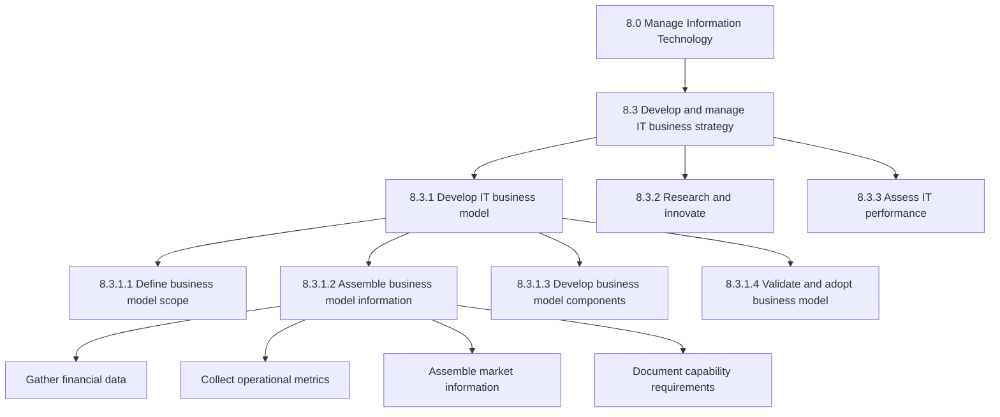
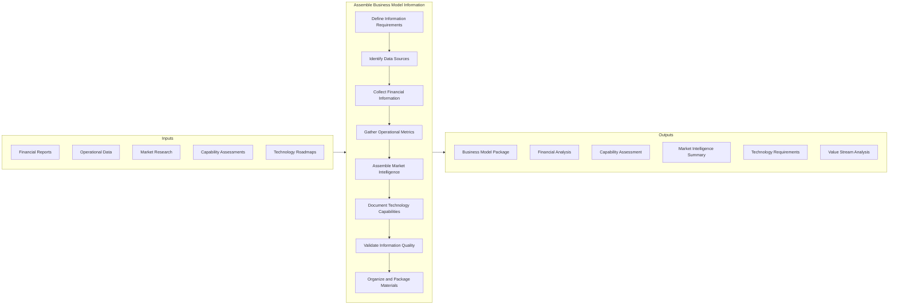
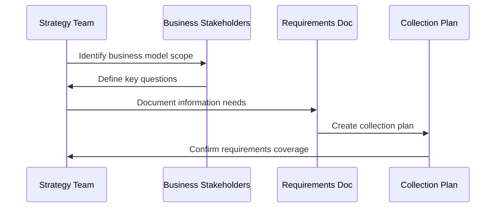
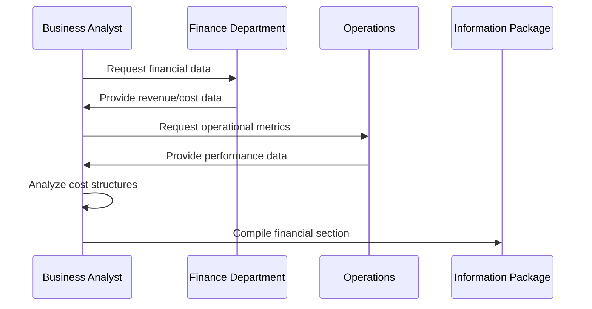
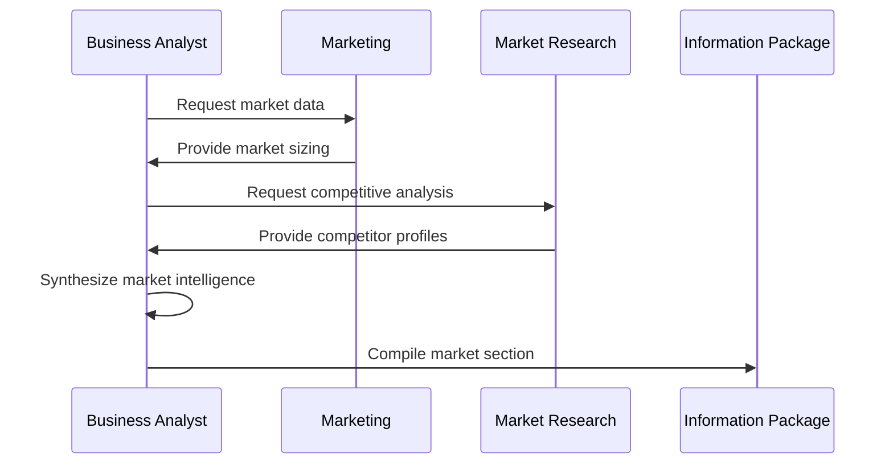
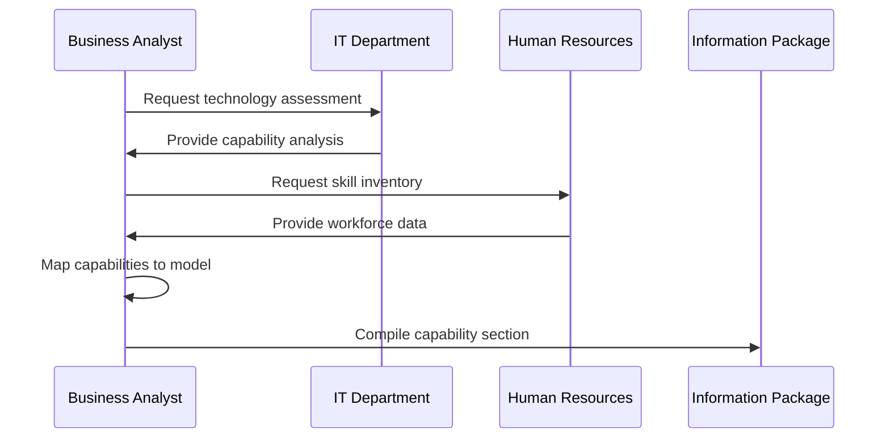
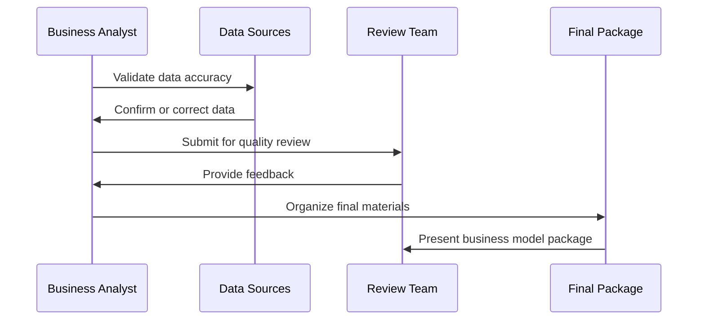
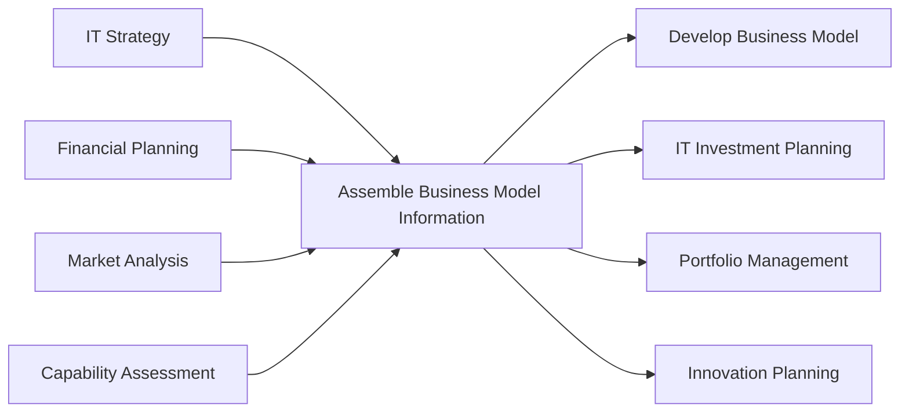

# Assemble business model information

> Collecting all relevant materials needed to develop the business model, so that it can adequately model its processes. This includes gathering financial data, operational metrics, market information, capability assessments, and technology requirements to construct a comprehensive view of how the organization creates and captures value.

## Overview

Assemble business model information is an IT business strategy process (APQC 20946) that supports the development and maintenance of business models by collecting and organizing the information needed to understand how IT enables value creation. This process involves systematically gathering data from across the organization to provide a comprehensive foundation for business model development and refinement.

Organizations use this process to ensure that business model decisions are based on accurate, complete, and current information. By assembling relevant materials from diverse sources, this process enables leadership to make informed decisions about how the organization creates, delivers, and captures value through technology-enabled processes.

## Process Hierarchy



## Key Statistics

| Metric | Value |
|--------|-------|
| APQC Code | 20946 |
| Hierarchy ID | 8.3.1.2 |
| Level | Activity |
| Category | [Manage Information Technology](/processes/08-IT) |
| Process Group | Develop and manage IT business strategy |
| Parent Process | Develop IT business model |

## Process Flow



## GraphDL Semantic Structure

```
assemble.BusinessModelInformation.for.StrategyDevelopment
```

| Component | Value | Description |
|-----------|-------|-------------|
| Verb | `assemble` | Primary action of collecting and organizing |
| Object | `BusinessModelInformation` | Data needed for business model development |
| Preposition | `for` | Purpose relationship |
| PrepObject | `StrategyDevelopment` | Supporting IT and business strategy |

## Activities

### 8.3.1.2.1 - Define information requirements

Determining what information is needed to develop or update the business model, including scope, depth, and format requirements.



**Tasks:**
- `define.InformationScope` - Determine breadth and depth of required data
- `identify.KeyQuestions` - Specify questions the business model must answer
- `document.DataRequirements` - Create detailed specification of needed information
- `develop.CollectionPlan` - Plan approach for gathering materials

### 8.3.1.2.2 - Collect financial and performance information

Gathering financial data, performance metrics, and cost information needed to understand economic aspects of the business model.



**Tasks:**
- `gather.FinancialData` - Collect revenue, cost, and margin information
- `collect.PerformanceMetrics` - Assemble KPIs and operational measures
- `analyze.CostStructures` - Understand cost drivers and allocation
- `document.ValueStreams` - Map how value flows through processes

### 8.3.1.2.3 - Assemble market and competitive intelligence

Collecting market research, competitive analysis, and customer insights to inform external aspects of the business model.



**Tasks:**
- `gather.MarketData` - Collect market size, growth, and segmentation data
- `collect.CompetitiveIntelligence` - Assemble competitor analysis
- `document.CustomerInsights` - Capture customer needs and preferences
- `analyze.IndustryTrends` - Identify relevant market trends

### 8.3.1.2.4 - Document capability and technology requirements

Collecting information about organizational capabilities, technology requirements, and resource needs to enable the business model.



**Tasks:**
- `assess.TechnologyCapabilities` - Document current and required technology
- `inventory.OrganizationalCapabilities` - Catalog skills and competencies
- `identify.ResourceRequirements` - Specify needed resources
- `map.CapabilityGaps` - Identify gaps between current and required state

### 8.3.1.2.5 - Validate and organize information

Ensuring collected information is accurate, complete, and well-organized for use in business model development.



**Tasks:**
- `validate.DataAccuracy` - Verify information against sources
- `ensure.Completeness` - Confirm all required information is collected
- `organize.Materials` - Structure information for easy consumption
- `create.ExecutiveSummary` - Prepare highlights for leadership

## RACI Matrix

| Activity | Responsible | Accountable | Consulted | Informed |
|----------|-------------|-------------|-----------|----------|
| Define requirements | Business Analyst | Strategy Director | Business Unit Leads | Executive Team |
| Collect financial data | Finance Analyst | CFO | Controllers | IT Leadership |
| Gather market intelligence | Market Research | CMO | Sales Leadership | Strategy Team |
| Document capabilities | IT Analyst | CIO | HR, Operations | Business Units |
| Validate information | Business Analyst | Strategy Director | All Contributors | Executive Team |
| Organize package | Business Analyst | Strategy Director | Communications | Leadership |

## Related Departments

- [Information Technology](/departments/IT) - Technology capability assessment
- [Finance](/departments/Finance/index) - Financial data and analysis
- [Marketing](/departments/Marketing/index) - Market intelligence and research
- [Strategy](/departments/Strategy/index) - Business model development
- [Human Resources](/departments/HR/index) - Organizational capability data

## Related Occupations

- [Management Analysts](/occupations/Business/Operations/ManagementAnalysts) - Business model analysis
- [Financial Analysts](/occupations/Business/Financial/FinancialAnalysts) - Financial data collection
- [Market Research Analysts](/occupations/MarketResearchAnalysts) - Market intelligence
- [Computer Systems Analysts](/occupations/Technology/ComputerSystemsAnalysts) - Technology assessment
- [Business Intelligence Analysts](/occupations/BIAnalysts) - Data analysis and reporting

## Industry Variations

### Banking

Banking business model information must include regulatory capital requirements, risk-weighted asset calculations, and compliance costs. Digital banking trends and fintech competitive dynamics are essential market intelligence components.

**Industry-Specific Activities:**
- Gather regulatory compliance cost information
- Collect digital banking capability assessments
- Assemble fintech competitive analysis
- Document risk management requirements

### Healthcare Provider

Healthcare business model information encompasses reimbursement models, value-based care metrics, and clinical quality measures. Population health data and payor mix analysis are critical components.

**Industry-Specific Activities:**
- Collect reimbursement and payor mix data
- Gather quality measure performance information
- Assemble population health analytics
- Document clinical workflow capabilities

### Retail

Retail business model information includes omnichannel performance data, customer lifetime value metrics, and supply chain efficiency measures. E-commerce growth trends and customer behavior analytics are essential.

**Industry-Specific Activities:**
- Gather omnichannel sales and fulfillment data
- Collect customer analytics and CLV metrics
- Assemble supply chain cost and performance data
- Document digital commerce capabilities

### Aerospace and Defense

Aerospace business model information must account for government contracting dynamics, technology readiness levels, and long-term program economics. ITAR compliance requirements and prime/subcontractor relationships are important considerations.

**Industry-Specific Activities:**
- Gather government contract portfolio information
- Collect technology readiness assessments
- Assemble prime contractor relationship data
- Document export compliance requirements

### Life Sciences

Life sciences business model information includes R&D pipeline data, regulatory approval timelines, and patent life considerations. Clinical trial economics and market exclusivity periods are critical factors.

**Industry-Specific Activities:**
- Gather R&D pipeline and trial data
- Collect regulatory submission timelines
- Assemble patent and exclusivity information
- Document manufacturing and supply chain capabilities

## Sub-Processes

| Process | Code | Description |
|---------|------|-------------|
| [Define business model scope](./BusinessModelScope) | 8.3.1.1 | Establish model boundaries |
| [Develop business model components](./BusinessModelComponents) | 8.3.1.3 | Create model elements |
| [Validate and adopt business model](./BusinessModelAdoption) | 8.3.1.4 | Approve and implement model |

## Related Processes



## Metrics & KPIs

| Metric | Description | Target |
|--------|-------------|--------|
| Information Completeness | Percentage of required data collected | >95% |
| Data Currency | Age of most recent data in package | <30 days |
| Collection Cycle Time | Time to assemble complete package | <45 days |
| Stakeholder Coverage | Percentage of required contributors engaged | 100% |
| Validation Pass Rate | Percentage of data passing quality checks | >98% |

---

*Source: APQC PCF 20946 (8.3.1.2) - Cross-Industry*
