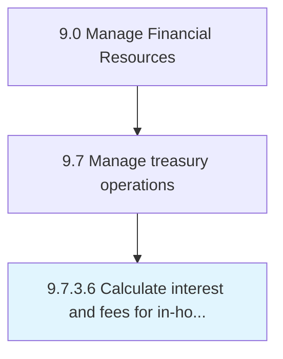

# Calculate interest and fees for in-house bank accounts

> Computing all expenses paid to and receivables collected over the organization's banking activity.

## Overview

Activity 9.7.3.6 is an activity within the Manage Financial Resources framework. 

Computing all expenses paid to and receivables collected over the organization's banking activity. Calculate all charges and receivables, towards interest, fees, and any other payments over its own bank accounts. Record transactions in the books of accounts.

## Process Hierarchy



## Key Statistics

| Metric | Value |
|--------|-------|
| APQC Code | 10906 |
| Hierarchy ID | 9.7.3.6 |
| Level | Activity |
| Parent | [9.7.3](../) |
| Sub-Processes | 0 |


## GraphDL Semantic Structure

```
calculate.InterestAndFees.for.InhouseBankAccounts
```

| Component | Value | Description |
|-----------|-------|-------------|
| Verb | `calculate` | Primary action |
| Object | `interest and fees` | Direct object |
| Preposition | `for` | Relationship |
| PrepObject | `in-house bank accounts` | Indirect object |


---

*Source: APQC PCF 10906 (9.7.3.6) - APQC*

## Related Occupations

- [Treasurers and Controllers](/occupations/Management/TreasurersAndControllers)
- [Financial Managers](/occupations/Management/FinancialManagers)
- [Accountants and Auditors](/occupations/Finance/AccountantsAndAuditors)
- [Financial Analysts](/occupations/Finance/FinancialAndInvestmentAnalysts)
- [Bookkeeping, Accounting, and Auditing Clerks](/occupations/Office/BookkeepingAccountingAuditingClerks)

## Related Departments

- [Treasury](/departments/Treasury)
- [Finance](/departments/Finance)
- [Intercompany Accounting](/departments/IntercompanyAccounting)
- [Corporate Accounting](/departments/CorporateAccounting)

## Industry Variations

This process applies universally across all industries, with the following common best practices:

### Universal Applicability

In-house banking interest and fee calculations are relevant for multi-entity organizations using centralized treasury functions. This process optimizes internal cash management and transfer pricing.

### Cross-Industry Best Practices

| Practice | Description |
|----------|-------------|
| Market-Based Rates | Set internal rates based on external market benchmarks |
| Transparent Policies | Document interest and fee calculation methodologies clearly |
| Automated Calculations | Use treasury systems for accurate, consistent calculations |
| Regulatory Compliance | Ensure transfer pricing meets tax authority requirements |
| Regular Reconciliation | Reconcile in-house bank positions with subsidiary ledgers |

### Common Metrics

- Interest income/expense accuracy
- Intercompany settlement timeliness
- Transfer pricing audit findings
- Cash pooling efficiency
- In-house bank operating cost per transaction
