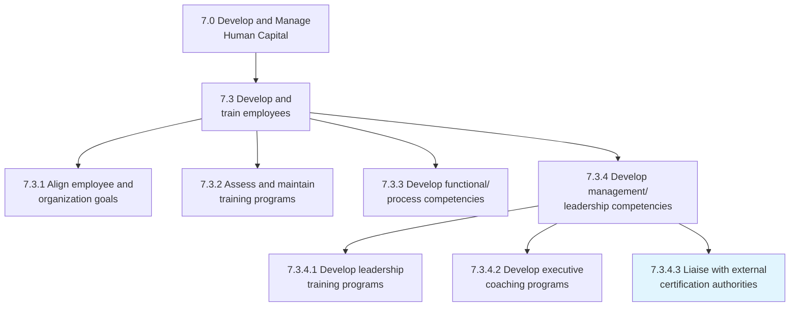
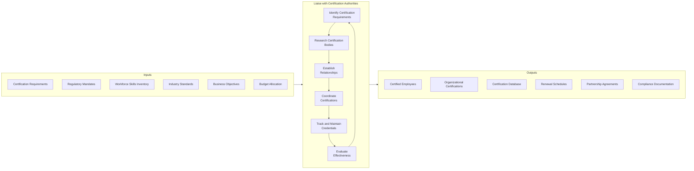
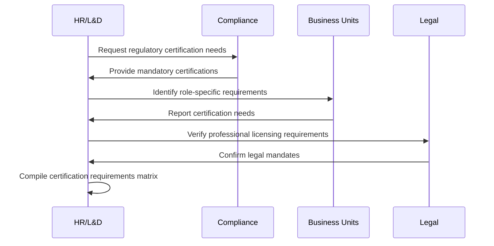
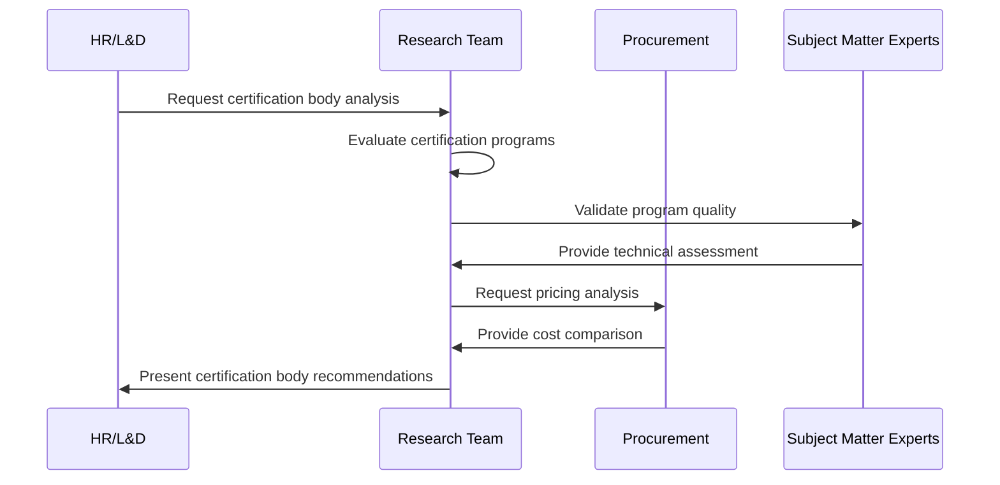
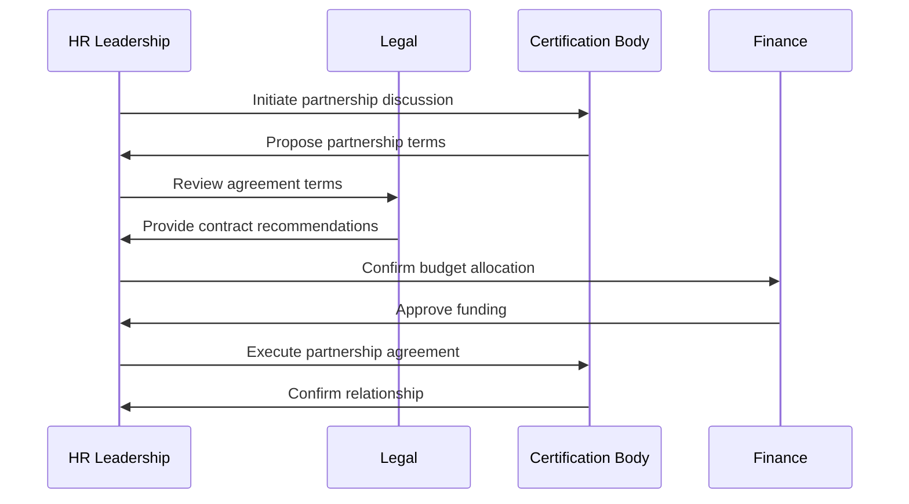
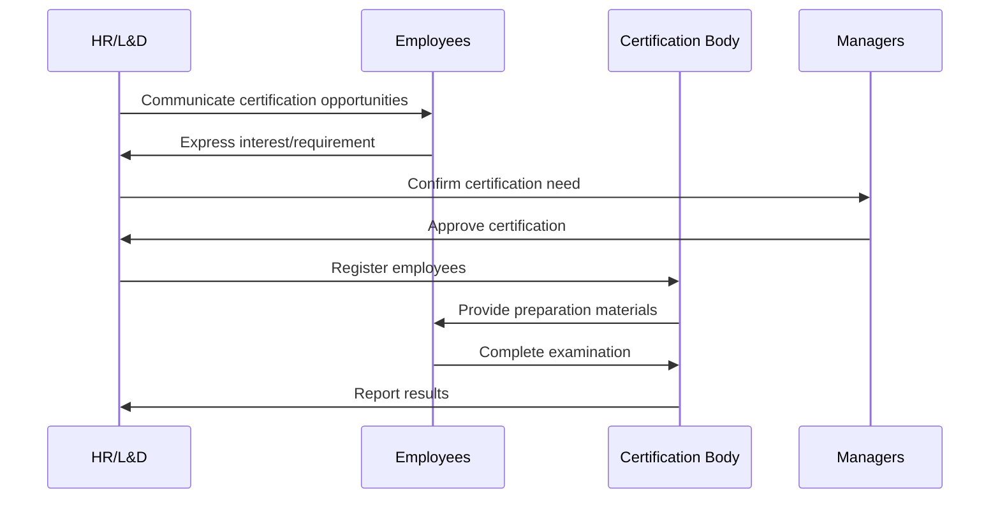
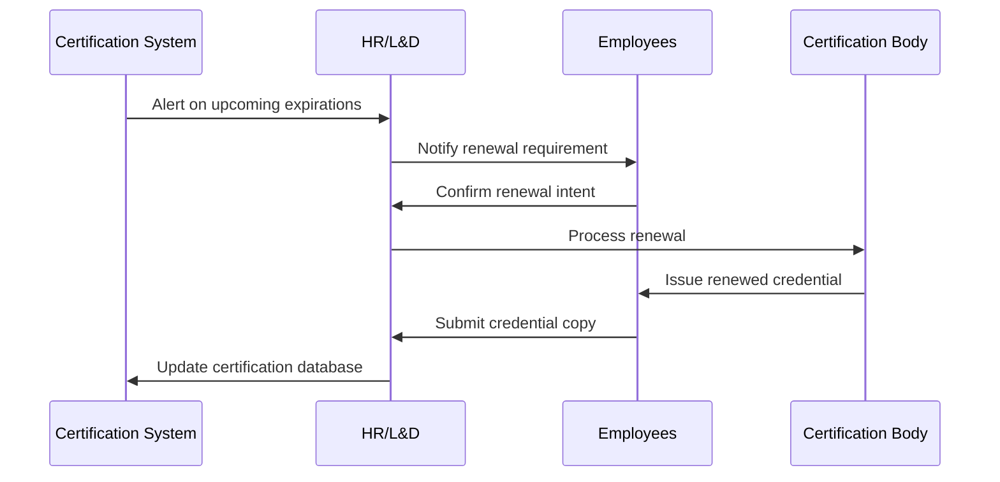
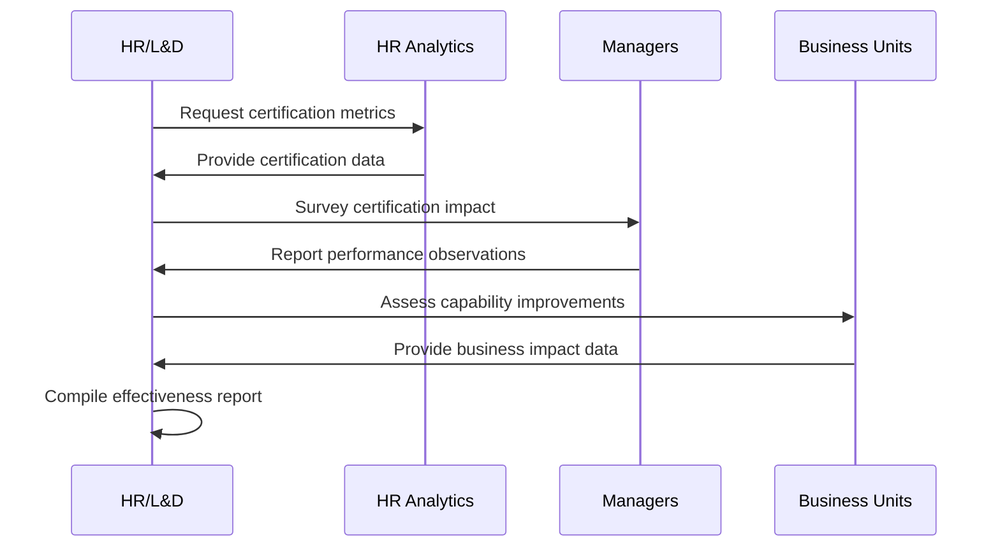
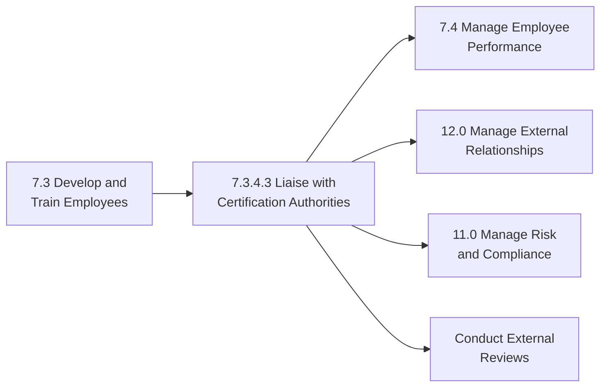

# Liaise with external certification authorities

> Coordinating with third party certification authorities to provide training and certifications for necessary skills.

## Overview

Liaise with external certification authorities (APQC 7.3.4.3) is an activity within the "Develop and train employees" process that extends into external relationship management. This process involves establishing and maintaining relationships with certification bodies, professional associations, and accreditation organizations to ensure employees obtain necessary professional credentials and the organization maintains required certifications.

The process encompasses identifying certification requirements, coordinating with certification bodies, facilitating employee certification processes, managing organizational certifications, and maintaining relationships with industry accreditation authorities. Effective liaison ensures the organization and its workforce maintain the credentials necessary for competitive advantage and regulatory compliance.

## Process Hierarchy



## Key Statistics

| Metric | Value |
|--------|-------|
| APQC Code | 20126 |
| Hierarchy ID | 7.3.4.3 |
| Level | Activity |
| Category | [Develop and Manage Human Capital](/processes/07-HR) |
| Parent Process | [Develop management/leadership competencies](./index.mdx) |

## Process Flow



## GraphDL Semantic Structure

```
liaise.with.CertificationAuthorities.for.SkillDevelopment
```

| Component | Value | Description |
|-----------|-------|-------------|
| Verb | `liaise` | Primary action of coordinating and communicating |
| Object | `CertificationAuthorities` | External credentialing organizations |
| Preposition | `for` | Purpose of the liaison |
| PrepObject | `SkillDevelopment` | Employee skill certification |

## Activities

### Identify certification requirements

Determining which certifications are required or beneficial for employees and the organization based on regulatory requirements, industry standards, and business objectives.



**Tasks:**
- `identify.MandatoryCertifications` - Catalog legally required certifications
- `identify.IndustryStandards` - Determine industry-recognized credentials
- `assess.RoleRequirements` - Map certifications to job roles
- `prioritize.Certifications` - Rank certifications by business value

### Research certification bodies

Evaluating and selecting appropriate certification authorities and programs that meet organizational needs.



**Tasks:**
- `research.CertificationBodies` - Identify available certification authorities
- `evaluate.ProgramQuality` - Assess certification program rigor
- `compare.Costs` - Analyze certification costs and value
- `assess.Recognition` - Evaluate industry recognition of credentials

### Establish relationships

Building formal partnerships and agreements with certification authorities to facilitate employee certifications.



**Tasks:**
- `negotiate.PartnershipTerms` - Discuss volume discounts and benefits
- `execute.Agreements` - Formalize certification partnerships
- `establish.Communications` - Set up ongoing liaison channels
- `document.Relationships` - Record partnership details

### Coordinate certifications

Managing the logistics of employee certification processes including registration, preparation, and examination.



**Tasks:**
- `register.Candidates` - Enroll employees in certification programs
- `coordinate.Preparation` - Arrange study materials and training
- `schedule.Examinations` - Book certification assessments
- `support.Candidates` - Provide ongoing assistance to candidates

### Track and maintain credentials

Managing the certification database to ensure all credentials remain current and renewals are completed on time.



**Tasks:**
- `maintain.CertificationDatabase` - Keep credential records current
- `monitor.Expirations` - Track certification renewal dates
- `process.Renewals` - Manage credential renewal processes
- `verify.Credentials` - Validate certification authenticity

### Evaluate effectiveness

Assessing the value and impact of certification programs on employee performance and organizational capabilities.



**Tasks:**
- `measure.CertificationRates` - Track certification completion rates
- `assess.PerformanceImpact` - Evaluate certified employee performance
- `analyze.ROI` - Calculate return on certification investment
- `recommend.Improvements` - Identify program optimization opportunities

## RACI Matrix

| Activity | Responsible | Accountable | Consulted | Informed |
|----------|-------------|-------------|-----------|----------|
| Identify certification requirements | L&D Team | Chief HR Officer | Compliance, Legal | Business Units |
| Research certification bodies | L&D Specialist | L&D Director | SMEs, Procurement | HR Leadership |
| Establish relationships | L&D Director | CHRO | Legal, Finance | Employees |
| Coordinate certifications | L&D Coordinator | L&D Director | Certification Bodies | Managers |
| Track and maintain credentials | HRIS Team | L&D Director | Employees | Compliance |
| Evaluate effectiveness | L&D Analyst | CHRO | Managers | Executive Team |

## Related Departments

- [Human Resources](/departments/HR/index) - Primary ownership of certification coordination
- Learning & Development - Training and preparation support
- Compliance - Regulatory certification requirements
- [Legal](/departments/Legal/index) - Professional licensing requirements
- [Finance](/departments/Finance/index) - Certification budget management

## Related Occupations

- [Training and Development Managers](/occupations/TrainingManagers) - Certification program oversight
- [Human Resources Specialists](/occupations/HRSpecialists) - Certification coordination
- [Compliance Officers](/occupations/Business/Operations/ComplianceOfficers) - Regulatory certification tracking
- [Training and Development Specialists](/occupations/TrainingSpecialists) - Certification support

## Industry Variations

### Aerospace and Defense

Aerospace requires extensive certifications including AS9100 auditor credentials, NDT certifications, security clearances, and specialized manufacturing certifications from industry bodies.

**Industry-Specific Activities:**
- Coordinate AS9100/9110/9120 auditor certifications
- Manage NDT (Non-Destructive Testing) certifications
- Liaise with NADCAP for special process certifications
- Coordinate FAA/EASA aircraft mechanic certifications

### Banking

Financial institutions require extensive regulatory certifications including securities licenses, compliance certifications, and anti-money laundering credentials.

**Industry-Specific Activities:**
- Coordinate FINRA securities licensing
- Manage AML/BSA compliance certifications
- Liaise with banking certification bodies
- Coordinate CPA and CFA certifications

### Healthcare Provider

Healthcare organizations manage extensive clinical certifications, licensure, and specialty credentials across medical, nursing, and allied health professions.

**Industry-Specific Activities:**
- Coordinate nursing license verifications
- Manage medical board certifications
- Liaise with specialty certification boards
- Coordinate CME credit tracking

### Life Sciences

Pharmaceutical and biotech companies require regulatory affairs certifications, GMP training credentials, and clinical research certifications.

**Industry-Specific Activities:**
- Coordinate RAC (Regulatory Affairs Certification)
- Manage GMP training certifications
- Liaise with clinical research certification bodies
- Coordinate pharmacovigilance certifications

### Education

Educational institutions manage teacher certifications, administrative credentials, and specialized endorsements through state education departments.

**Industry-Specific Activities:**
- Coordinate teacher certification renewals
- Manage administrative credentials
- Liaise with state education departments
- Coordinate subject-area endorsements

### Utilities

Utility companies require extensive operator certifications, safety credentials, and environmental certifications for field personnel.

**Industry-Specific Activities:**
- Coordinate NERC operator certifications
- Manage safety certifications (OSHA, confined space)
- Liaise with environmental certification bodies
- Coordinate lineman and technician certifications

### Automotive

Automotive organizations manage ASE certifications, manufacturer-specific credentials, and quality system certifications for technicians and engineers.

**Industry-Specific Activities:**
- Coordinate ASE technician certifications
- Manage OEM-specific training certifications
- Liaise with IATF 16949 certification bodies
- Coordinate EV/hybrid system certifications

## Sub-Processes

| Process | Code | Description |
|---------|------|-------------|
| Identify certification requirements | - | Determine needed credentials |
| Research certification bodies | - | Evaluate certification authorities |
| Establish relationships | - | Build partnerships with bodies |
| Coordinate certifications | - | Manage certification logistics |
| Track and maintain credentials | - | Maintain certification database |
| Evaluate effectiveness | - | Assess certification program value |

## Related Processes



## Metrics & KPIs

| Metric | Description | Target |
|--------|-------------|--------|
| Certification Rate | Percentage of required certifications obtained | >95% |
| Renewal Compliance | On-time certification renewals | 100% |
| First-Time Pass Rate | Employees passing certification on first attempt | >80% |
| Certification ROI | Return on certification investment | >150% |
| Time to Certification | Average days to obtain certification | <90 days |
| Cost per Certification | Average cost including prep and exam | Benchmark |

---

*Source: APQC PCF 20126 (7.3.4.3) - Cross-Industry*
