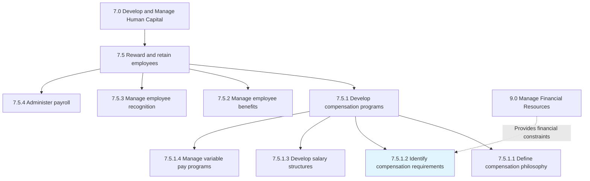
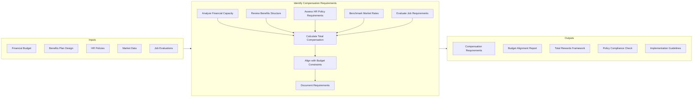
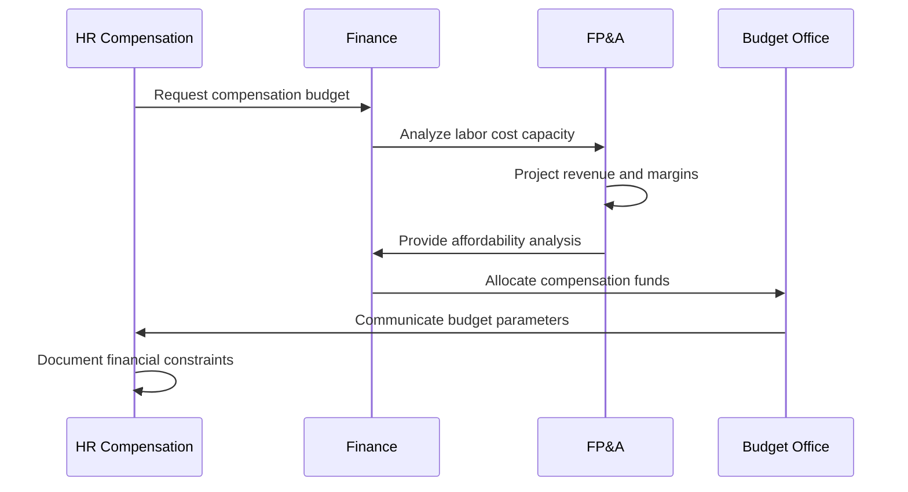
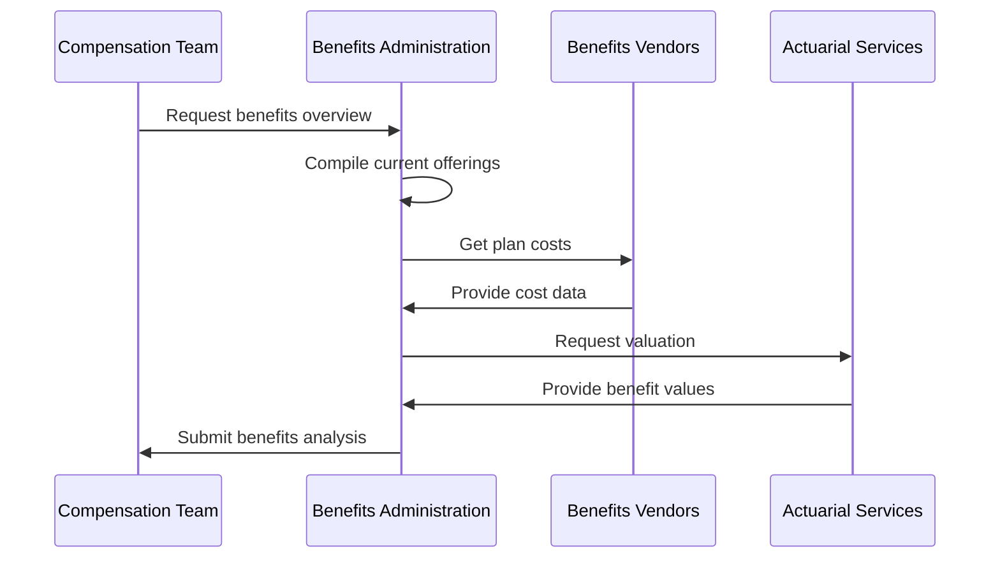
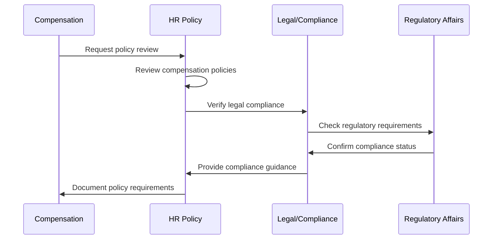
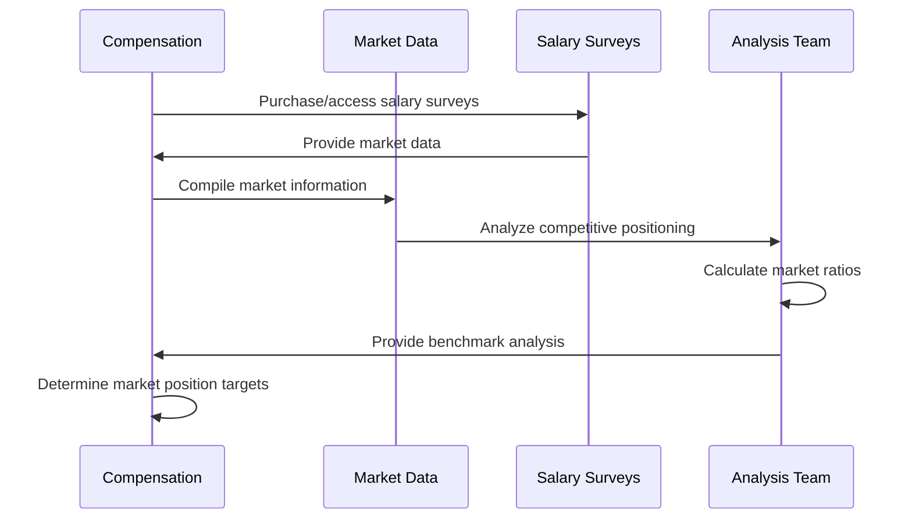
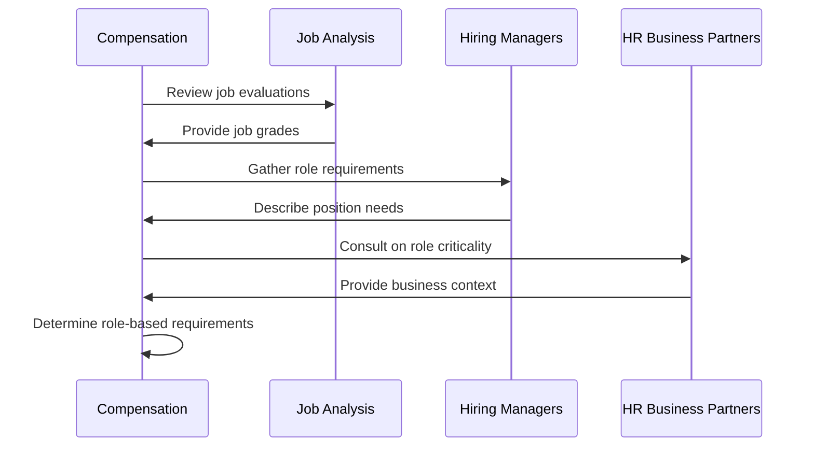
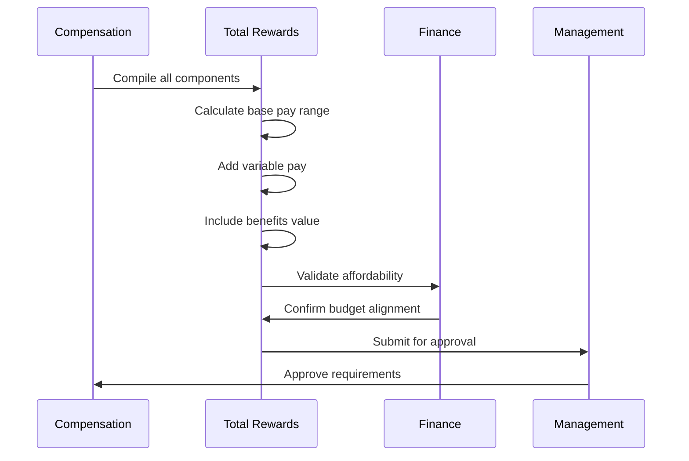
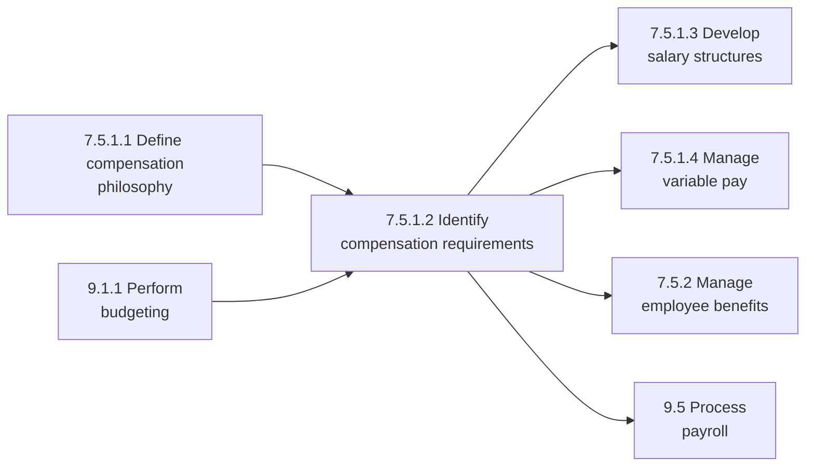

# Identify compensation requirements based on financial, benefits, and HR policies

> Recognizing the employee requirements for compensation on the basis of the financial, benefits, and HR policies of the organization. Recognize individual compensation requirements regarding the financial policies of the organization. Consider the benefits plan and overall HR policies while selecting compensation requirements.

## Overview

Identify compensation requirements based on financial, benefits, and HR policies is a cross-functional process that bridges human capital management (APQC Category 7.0) with financial resource management (APQC Category 9.0). This process ensures that employee compensation structures align with organizational financial constraints, benefit plan designs, and human resource policies.

The process involves analyzing financial capacity, reviewing existing benefits structures, and ensuring compliance with HR policies to develop appropriate compensation packages. This is essential for attracting and retaining talent while maintaining fiscal responsibility and regulatory compliance.

## Process Hierarchy



## Key Statistics

| Metric | Value |
|--------|-------|
| APQC Code | 10501 |
| Hierarchy ID | 7.5.1.2 |
| Level | Activity |
| Parent Process | [Develop compensation programs](/processes/07-HR/DevelopCompensationPrograms) |
| Category | [Develop and Manage Human Capital](/processes/07-HR) |
| Related Categories | 9.0 Manage Financial Resources |

## Process Flow



## GraphDL Semantic Structure

```
identify.CompensationRequirements.basedOn.FinancialBenefitsAndHRPolicies
```

| Component | Value | Description |
|-----------|-------|-------------|
| Verb | `identify` | Primary action of recognizing and determining |
| Object | `CompensationRequirements` | The compensation needs for employees |
| Preposition | `basedOn` | Relationship indicating foundation |
| PrepObject | `FinancialBenefitsAndHRPolicies` | The constraining policies and structures |

## Activities

### Analyze Organizational Financial Capacity

Assessing the organization's ability to fund compensation programs within budget constraints.



**Tasks:**
- `analyze.LaborBudget` - Review allocated compensation funds
- `assess.FinancialCapacity` - Determine affordability limits
- `project.LaborCosts` - Forecast total compensation expense
- `align.CompensationToRevenue` - Match pay to financial performance

### Review Benefits Plan Structure

Examining existing benefits offerings to understand their contribution to total compensation.



**Tasks:**
- `review.HealthcareBenefits` - Assess medical, dental, vision costs
- `evaluate.RetirementPlans` - Analyze 401(k), pension contributions
- `assess.PaidTimeOff` - Calculate PTO value
- `value.AncillaryBenefits` - Quantify additional benefits

### Assess HR Policy Requirements

Ensuring compensation requirements comply with organizational HR policies and external regulations.



**Tasks:**
- `review.PayEquityPolicies` - Ensure fair pay practices
- `verify.ComplianceRequirements` - Check FLSA, EEO, state laws
- `assess.InternalEquity` - Evaluate internal pay relationships
- `document.PolicyConstraints` - Record policy requirements

### Benchmark Market Compensation Rates

Comparing organizational pay levels to external market data.



**Tasks:**
- `gather.MarketData` - Collect salary survey information
- `analyze.CompetitivePosition` - Compare to market percentiles
- `identify.PayGaps` - Find areas below market
- `recommend.MarketAdjustments` - Propose competitive pay changes

### Evaluate Job-Specific Requirements

Analyzing individual job requirements to determine appropriate compensation levels.



**Tasks:**
- `evaluate.JobComplexity` - Assess skill and responsibility levels
- `determine.JobGrade` - Assign appropriate pay grade
- `identify.CriticalRoles` - Flag high-impact positions
- `assess.SkillPremiums` - Calculate specialized skill value

### Calculate Total Compensation Package

Combining all elements to develop comprehensive compensation requirements.



**Tasks:**
- `calculate.BasePay` - Determine salary ranges
- `define.VariablePay` - Set bonus and incentive targets
- `add.BenefitsValue` - Include benefits in total rewards
- `document.TotalCompensation` - Record full package value

## RACI Matrix

| Activity | Responsible | Accountable | Consulted | Informed |
|----------|-------------|-------------|-----------|----------|
| Analyze financial capacity | FP&A | CFO | HR | Executive team |
| Review benefits structure | Benefits Admin | CHRO | Finance | Employees |
| Assess HR policy requirements | HR Compliance | CHRO | Legal | Management |
| Benchmark market rates | Compensation Analyst | VP Compensation | HRBP | Hiring managers |
| Evaluate job requirements | Compensation Team | VP HR | Managers | Recruiters |
| Calculate total compensation | Total Rewards | CHRO | CFO | Board |

## Related Departments

- [Human Resources](/departments/HR/index) - Primary ownership of compensation design
- [Finance](/departments/Finance/index) - Budget and financial constraints
- [Legal](/departments/Legal/index) - Regulatory compliance
- [Benefits Administration](/departments/Benefits) - Benefits program management
- [FP&A](/departments/FPA) - Financial planning and analysis

## Related Occupations

- [Compensation and Benefits Managers](/occupations/CompensationBenefitsManagers) - Program design and oversight
- [Human Resources Specialists](/occupations/HRSpecialists) - Program administration
- [Financial Analysts](/occupations/Business/Financial/FinancialAnalysts) - Budget analysis
- [Human Resources Managers](/occupations/HRManagers) - Policy development
- [Accountants](/occupations/Accountants) - Cost accounting

## Industry Variations

### Aerospace and Defense

Compensation in aerospace must address security clearance premiums, specialized technical skills, and government contractor requirements. Benefits packages often include retention bonuses for cleared personnel.

**Industry-Specific Considerations:**
- Security clearance compensation premiums
- Engineering skill-based pay differentials
- Government contractor labor rate compliance
- Long-term retention incentives for critical skills

### Banking

Banking compensation requires careful attention to regulatory requirements, including clawback provisions and deferred compensation. Variable pay often comprises a significant portion of total compensation.

**Industry-Specific Considerations:**
- Regulatory compliance with banking compensation rules
- Deferred compensation and clawback provisions
- Performance-based bonus structures
- Risk-adjusted compensation metrics

### Healthcare Provider

Healthcare compensation addresses clinical staff shortages, shift differentials, and on-call pay. Benefits packages emphasize comprehensive health coverage and continuing education support.

**Industry-Specific Considerations:**
- Clinical staff market premiums
- Shift differential and on-call compensation
- Malpractice insurance provisions
- Continuing education and certification support

### Retail

Retail compensation addresses seasonal staffing, part-time employee benefits, and store manager incentives. Variable pay often links to store performance metrics.

**Industry-Specific Considerations:**
- Seasonal and part-time worker compensation
- Store performance bonuses
- Employee discount programs
- Flexible scheduling benefits

### Life Sciences

Life sciences compensation must attract specialized scientific talent, often including sign-on bonuses and equity compensation. Research staff may have unique intellectual property considerations.

**Industry-Specific Considerations:**
- Scientific talent market premiums
- Equity compensation for research roles
- Patent and intellectual property incentives
- Relocation assistance for specialized talent

## Compensation Components

| Component | Description | Typical % of Total |
|-----------|-------------|-------------------|
| Base Salary | Fixed annual compensation | 60-70% |
| Variable Pay | Bonuses and incentives | 10-20% |
| Health Benefits | Medical, dental, vision | 8-12% |
| Retirement | 401(k) match, pension | 5-8% |
| Paid Time Off | Vacation, sick, holidays | 3-5% |
| Other Benefits | Life insurance, disability, etc. | 2-4% |

## Related Processes



## Policy Alignment Framework

| Policy Area | Key Considerations | Impact on Compensation |
|-------------|-------------------|----------------------|
| Pay Equity | Equal pay for equal work | Structure and range design |
| Performance | Merit-based increases | Variable pay linkage |
| Internal Equity | Consistent job evaluation | Grade and band structure |
| External Competitiveness | Market positioning | Salary range midpoints |
| Cost Management | Budget constraints | Total compensation caps |
| Regulatory | FLSA, EEO, state laws | Compliance requirements |

## Metrics & KPIs

| Metric | Description | Target |
|--------|-------------|--------|
| Compa-Ratio | Salary / range midpoint | 95-105% |
| Market Ratio | Salary / market median | 100-110% |
| Labor Cost Ratio | Total comp / revenue | Industry benchmark |
| Benefits Cost per Employee | Annual benefits expense | Budget target |
| Pay Equity Ratio | Protected class pay gaps | 100% |
| Offer Acceptance Rate | Accepted offers / total offers | >85% |

## Compliance Considerations

| Regulation | Requirement | Impact |
|------------|-------------|--------|
| FLSA | Minimum wage, overtime | Pay floor and OT eligibility |
| Equal Pay Act | Gender pay equity | Pay structure review |
| ADA | Reasonable accommodation | Benefits flexibility |
| ERISA | Retirement plan compliance | 401(k) design |
| ACA | Healthcare coverage | Benefits minimum standards |
| State Laws | Local minimums and requirements | Geographic pay differences |

---

*Source: APQC PCF 10501 (7.5.1.2) - Cross-Industry*
