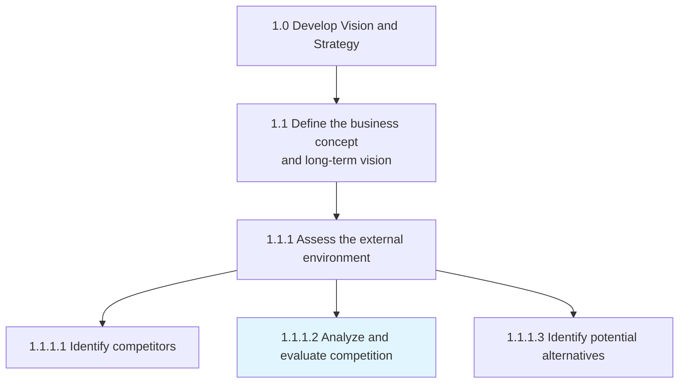
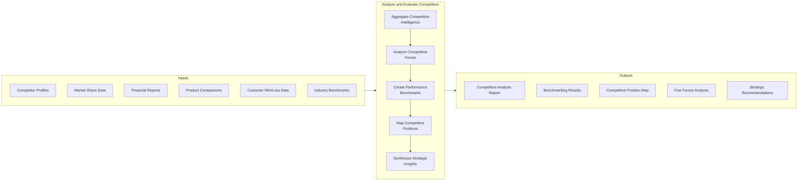
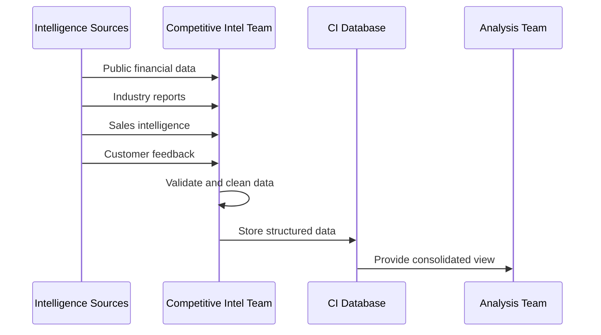
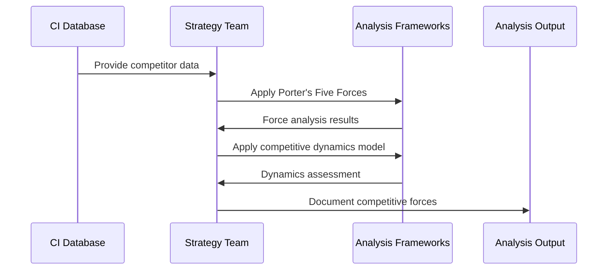
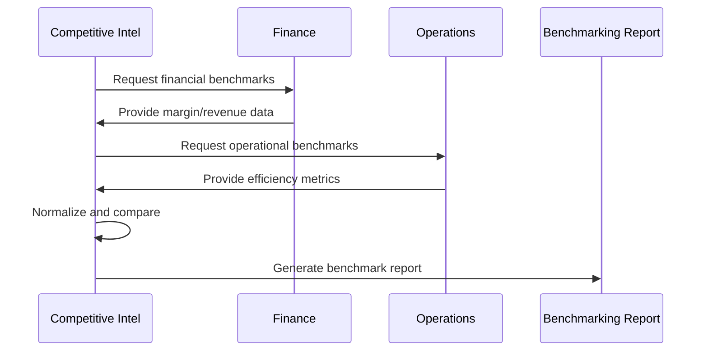
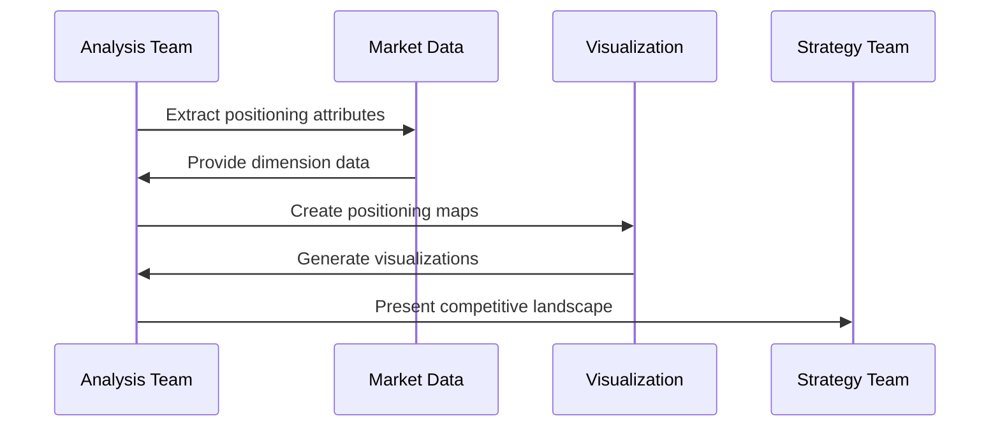
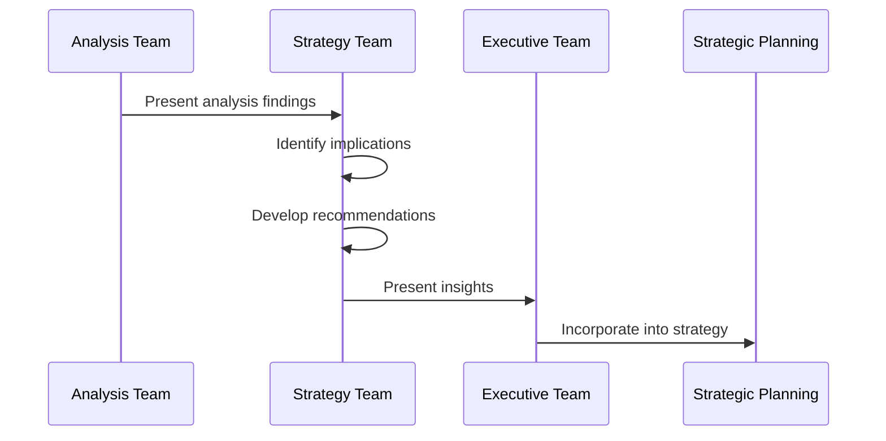
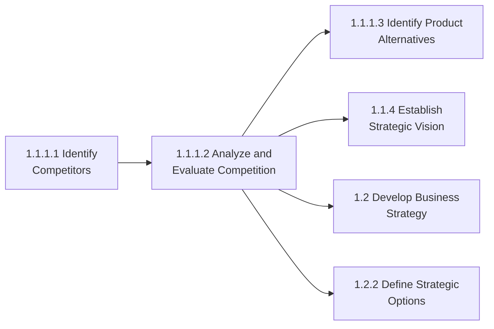

# Analyze and evaluate competition

> Assessing the competitive forces in the marketplace that could potentially affect the organization. Analyze various aspects of business competition including competing firms. Aggregate competitive intelligence, create benchmarks to juxtapose processes and performance metrics, and inject crucial information about the competition into management models to synthesize insights.

## Overview

Analyze and evaluate competition (APQC 1.1.1.2) is an activity within the "Assess the external environment" process that builds upon the competitor identification activity. While competitor identification focuses on discovering who the competitors are, this process involves deep analysis of competitive dynamics, forces, and implications for the organization.

This process encompasses the systematic collection and analysis of competitive intelligence, benchmarking against competitors, understanding competitive positioning, and synthesizing insights that inform strategic decision-making. It utilizes frameworks such as Porter's Five Forces, competitive positioning maps, and SWOT analysis to create actionable intelligence.

## Process Hierarchy



## Key Statistics

| Metric | Value |
|--------|-------|
| APQC Code | 10021 |
| Hierarchy ID | 1.1.1.2 |
| Level | Activity |
| Category | [Develop Vision and Strategy](/processes/01-Strategy) |
| Parent Process | [Define business concept and long-term vision](./BusinessConcept.mdx) |
| Prerequisite | [Identify competitors](./Competitors.mdx) |

## Process Flow



## GraphDL Semantic Structure

```
analyze.AndEvaluateCompetition
```

| Component | Value | Description |
|-----------|-------|-------------|
| Verb | `analyze` | Primary action of examining and assessing |
| Object | `Competition` | Competitive forces and dynamics |
| Preposition | `and` | Conjunction linking dual action |
| PrepObject | `evaluate` | Secondary action of appraising |

## Activities

### Aggregate Competitive Intelligence

Collecting and consolidating information about competitors from multiple sources into a unified intelligence repository.



**Tasks:**
- `collect.PublicData` - Gather publicly available competitor information
- `aggregate.SalesIntelligence` - Consolidate field-level competitive data
- `compile.IndustryReports` - Synthesize third-party analysis
- `integrate.CustomerFeedback` - Incorporate customer competitive perceptions

### Analyze Competitive Forces

Applying strategic frameworks to understand the competitive dynamics affecting the organization.



**Tasks:**
- `analyze.BuyerPower` - Assess customer bargaining power
- `analyze.SupplierPower` - Evaluate supplier bargaining position
- `analyze.ThreatOfSubstitutes` - Assess substitute products/services
- `analyze.ThreatOfNewEntrants` - Evaluate barriers to entry
- `analyze.CompetitiveRivalry` - Assess intensity of competition

### Create Performance Benchmarks

Developing comparative metrics to measure organizational performance against competitors.



**Tasks:**
- `benchmark.FinancialMetrics` - Compare financial performance indicators
- `benchmark.OperationalMetrics` - Compare operational efficiency measures
- `benchmark.MarketMetrics` - Compare market share and growth rates
- `identify.PerformanceGaps` - Determine areas of competitive advantage/disadvantage

### Map Competitive Positions

Creating visual representations of competitive positioning across key dimensions.



**Tasks:**
- `define.PositioningDimensions` - Identify key competitive dimensions
- `plot.CompetitorPositions` - Map competitors on strategic dimensions
- `identify.StrategicGroups` - Cluster competitors by strategic similarity
- `analyze.PositioningGaps` - Find unoccupied market positions

### Synthesize Strategic Insights

Converting competitive analysis into actionable strategic recommendations.



**Tasks:**
- `identify.StrategicImplications` - Determine impact on organizational strategy
- `develop.CompetitiveResponses` - Create response options to competitive threats
- `recommend.StrategicActions` - Propose specific strategic initiatives
- `integrate.IntoPlanning` - Incorporate insights into strategic planning

## RACI Matrix

| Activity | Responsible | Accountable | Consulted | Informed |
|----------|-------------|-------------|-----------|----------|
| Aggregate competitive intelligence | Competitive Intel | Strategy Director | Sales, Marketing | Executive Team |
| Analyze competitive forces | Strategy Team | Chief Strategy Officer | All Business Units | Board |
| Create performance benchmarks | Finance/Strategy | CFO/CSO | Operations | Executive Team |
| Map competitive positions | Market Research | Marketing Director | Product, Sales | Strategy Team |
| Synthesize strategic insights | Strategy Team | CEO | Executive Team | All Departments |

## Related Departments

- [Strategy & Planning](/departments/Strategy/index) - Lead competitive analysis
- [Marketing](/departments/Marketing/index) - Market positioning insights
- [Finance](/departments/Finance/index) - Financial benchmarking
- [Sales](/departments/Sales/index) - Competitive win/loss intelligence
- [Operations](/departments/Operations/index) - Operational benchmarking
- [Product Management](/departments/Product) - Product competitive assessment

## Related Occupations

- [Market Research Analysts](/occupations/MarketResearchAnalysts) - Competitive research execution
- [Competitive Intelligence Analysts](/occupations/CompetitiveIntelligence) - Intelligence aggregation and analysis
- [Management Analysts](/occupations/Business/Operations/ManagementAnalysts) - Strategic framework application
- [Financial Analysts](/occupations/Business/Financial/FinancialAnalysts) - Competitor financial analysis
- [Business Strategists](/occupations/BusinessStrategists) - Strategic insight synthesis

## Industry Variations

### Aerospace and Defense

Competitive analysis in aerospace and defense focuses on contract win rates, technology capabilities, and relationships with government procurement agencies.

**Industry-Specific Activities:**
- Analyze competitor contract capture rates
- Benchmark technology readiness levels
- Evaluate prime/subcontractor relationship strength
- Assess international market competitive positioning

### Airline

Airlines analyze competition through route economics, yield management effectiveness, and operational efficiency metrics.

**Industry-Specific Activities:**
- Benchmark revenue per available seat mile (RASM)
- Analyze route profitability vs. competitors
- Evaluate on-time performance comparisons
- Assess loyalty program competitive strength

### Automotive

Automotive competitive analysis spans product quality, manufacturing efficiency, and emerging technology leadership.

**Industry-Specific Activities:**
- Benchmark vehicle quality metrics (J.D. Power, etc.)
- Analyze manufacturing cost per unit
- Evaluate electric/autonomous technology positioning
- Assess dealer network competitive strength

### Banking

Banks analyze competition across product lines, digital capabilities, and regulatory positioning.

**Industry-Specific Activities:**
- Benchmark net interest margins
- Analyze digital banking feature comparisons
- Evaluate regulatory compliance efficiency
- Assess branch network optimization

### Broadcasting

Broadcasting competitive analysis focuses on audience share, content acquisition, and advertising rates.

**Industry-Specific Activities:**
- Benchmark audience ratings and share
- Analyze content acquisition costs and exclusivity
- Evaluate advertising CPM comparisons
- Assess streaming subscriber growth rates

### City Government

City governments analyze competition for residents, businesses, and economic development opportunities.

**Industry-Specific Activities:**
- Benchmark tax rates and service levels
- Analyze economic development incentive effectiveness
- Evaluate quality of life metrics comparisons
- Assess business attraction success rates

### Education

Educational institutions analyze competition based on academic outcomes, enrollment trends, and program offerings.

**Industry-Specific Activities:**
- Benchmark standardized test scores
- Analyze enrollment trends vs. competitors
- Evaluate program and extracurricular comparisons
- Assess teacher quality and retention metrics

### Healthcare Provider

Healthcare competitive analysis focuses on quality metrics, patient experience, and cost efficiency.

**Industry-Specific Activities:**
- Benchmark clinical quality outcomes
- Analyze patient satisfaction scores
- Evaluate cost per case comparisons
- Assess specialty service line competitiveness

## Sub-Processes

| Process | Code | Description |
|---------|------|-------------|
| Aggregate intelligence | - | Collect and consolidate competitive data |
| Analyze forces | - | Apply strategic frameworks to competition |
| Create benchmarks | - | Develop comparative performance metrics |
| Map positions | - | Visualize competitive landscape |
| Synthesize insights | - | Convert analysis to strategic actions |

## Related Processes



## Metrics & KPIs

| Metric | Description | Target |
|--------|-------------|--------|
| Intelligence Coverage | Completeness of competitive data | >90% |
| Analysis Accuracy | Accuracy of competitive predictions | >75% |
| Benchmark Currency | Freshness of benchmark data | <6 months |
| Insight Actionability | Percentage of insights leading to action | >60% |
| Win Rate Improvement | Change in competitive win rate | +5% annually |
| Time to Insight | Duration from data to actionable insight | <30 days |

---

*Source: APQC PCF 10021 (1.1.1.2) - Cross-Industry*
