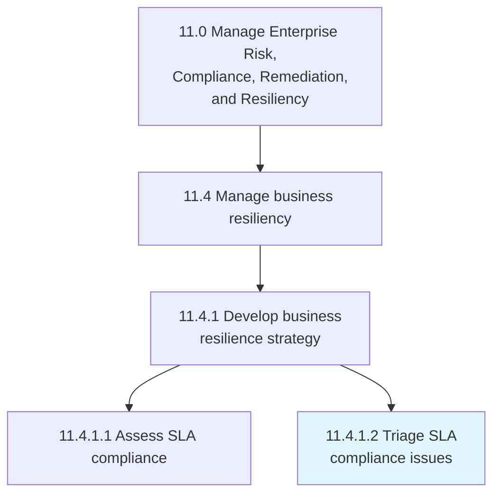
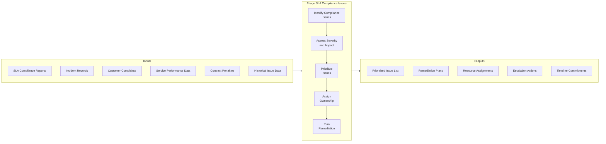
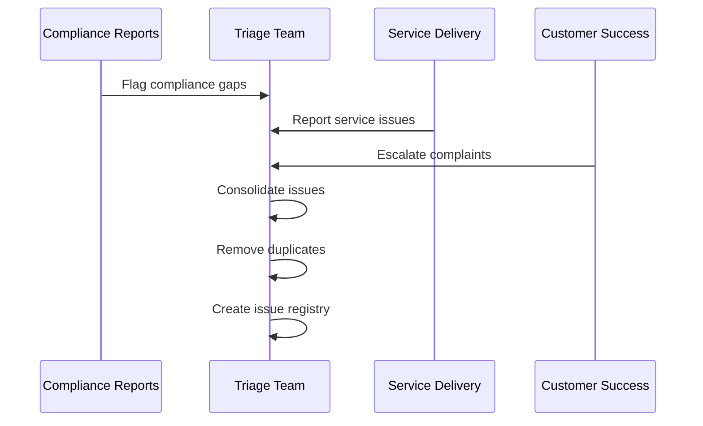
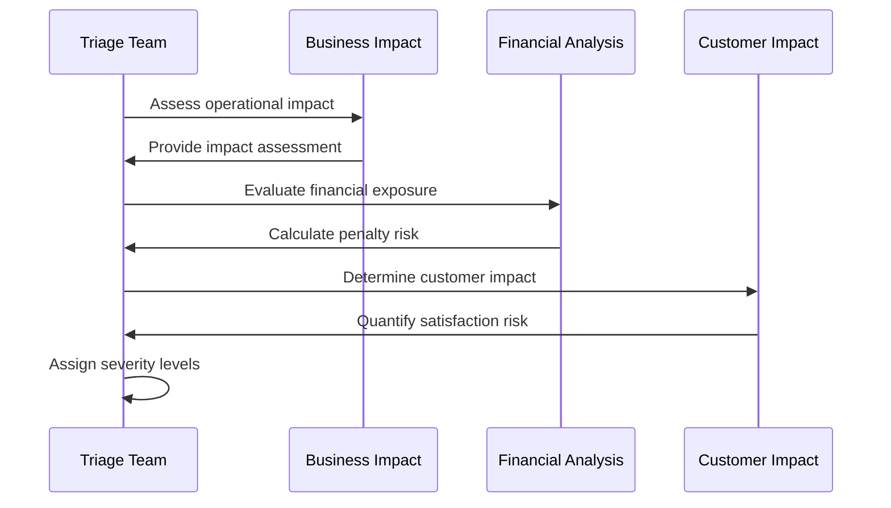
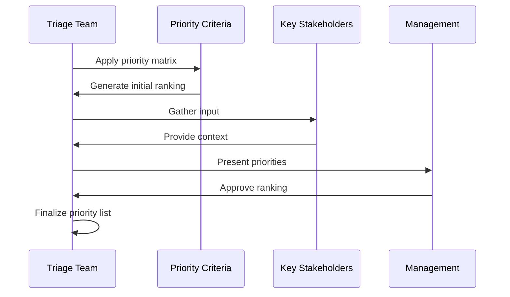
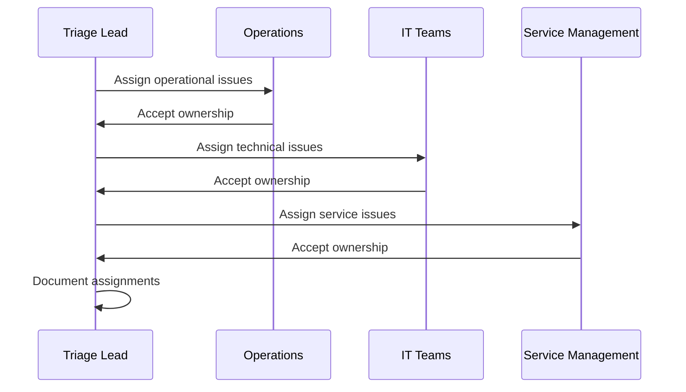
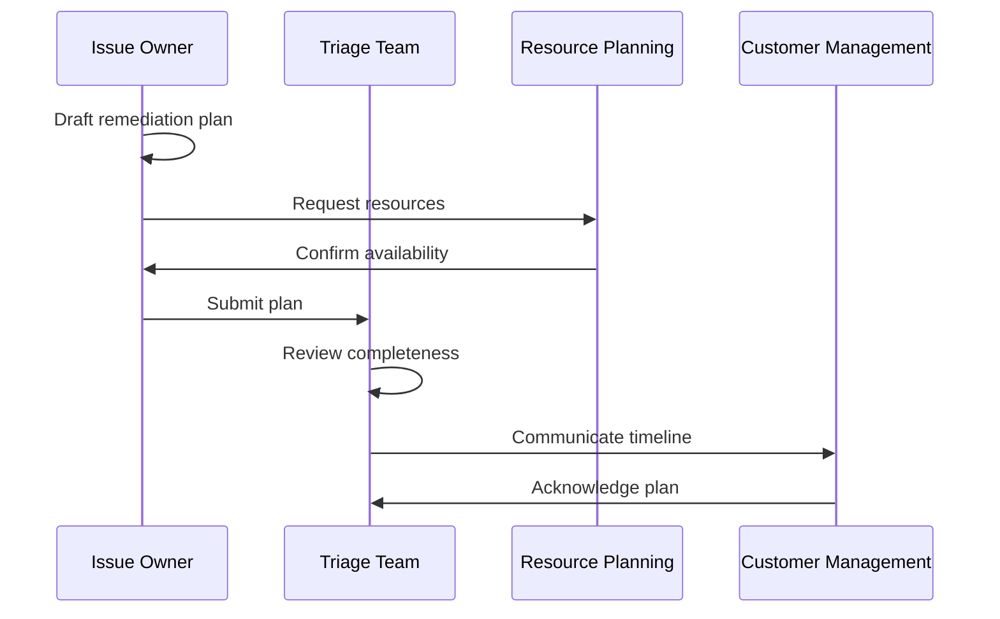
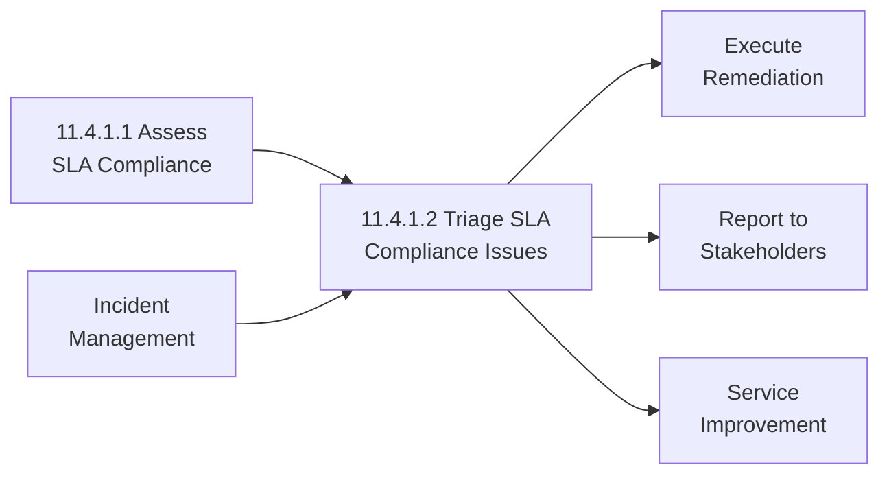

# Triage SLA compliance issues

> Prioritizing SLA compliance issues and plan for remediation.

## Overview

Triage SLA compliance issues (APQC 11.4.1.2) is a critical activity that ensures organizations effectively prioritize and address service level agreement violations and near-misses. This process involves systematically evaluating compliance issues based on severity, impact, and urgency to allocate remediation resources appropriately and prevent recurring failures.

Effective compliance triage enables organizations to focus attention on the most critical service delivery gaps, minimize customer impact, avoid escalation of minor issues, and optimize the use of remediation resources. The process requires clear prioritization criteria, established escalation protocols, and cross-functional coordination to drive timely resolution.

## Process Hierarchy



## Key Statistics

| Metric | Value |
|--------|-------|
| APQC Code | 20650 |
| Hierarchy ID | 11.4.1.2 |
| Level | Activity |
| Category | [Manage Enterprise Risk, Compliance, Remediation, and Resiliency](/processes/11-Risk) |
| Parent Process | [Manage business resiliency](./index.mdx) |

## Process Flow



## GraphDL Semantic Structure

```
triage.SlaComplianceIssues
```

| Component | Value | Description |
|-----------|-------|-------------|
| Verb | `triage` | Primary action of prioritizing and categorizing |
| Object | `SlaComplianceIssues` | Service level agreement violations and gaps |
| Preposition | - | Not applicable |
| PrepObject | - | Not applicable |

## Activities

### Identify Compliance Issues

Systematically collecting and cataloging all SLA compliance violations, near-misses, and areas of concern from various sources.



**Tasks:**
- `collect.ComplianceGaps` - Gather SLA violations from reports
- `capture.ServiceIncidents` - Document service delivery issues
- `record.CustomerComplaints` - Log customer-reported problems
- `consolidate.IssueRegistry` - Create unified issue list

### Assess Severity and Impact

Evaluating each compliance issue against defined criteria to determine its severity level and business impact.



**Tasks:**
- `evaluate.BusinessImpact` - Assess operational consequences
- `calculate.FinancialExposure` - Determine penalty and cost implications
- `assess.CustomerImpact` - Evaluate customer satisfaction effects
- `determine.ReputationalRisk` - Consider brand and relationship impact

### Prioritize Issues

Ranking compliance issues based on severity, urgency, and strategic importance to focus remediation efforts.



**Tasks:**
- `apply.PriorityMatrix` - Score issues against criteria
- `consider.StrategicContext` - Factor in relationship importance
- `balance.ResourceConstraints` - Account for capacity limitations
- `finalize.PriorityRanking` - Establish remediation order

### Assign Ownership

Designating responsible parties for each prioritized issue with clear accountability for resolution.



**Tasks:**
- `identify.AppropriateOwners` - Match issues to capable teams
- `confirm.OwnershipAcceptance` - Ensure accountability acceptance
- `establish.EscalationPaths` - Define escalation contacts
- `document.Assignments` - Record ownership decisions

### Plan Remediation

Developing specific remediation plans with timelines, resources, and success criteria for each prioritized issue.



**Tasks:**
- `develop.ActionPlans` - Create step-by-step remediation plans
- `estimate.ResourceNeeds` - Determine required resources
- `establish.Timelines` - Set realistic completion dates
- `define.SuccessCriteria` - Specify resolution standards

## RACI Matrix

| Activity | Responsible | Accountable | Consulted | Informed |
|----------|-------------|-------------|-----------|----------|
| Identify compliance issues | Service Delivery | Quality Manager | Customer Success | Management |
| Assess severity and impact | Triage Team | Service Director | Finance, Legal | Executive Team |
| Prioritize issues | Triage Lead | CRO/CCO | Business Units | All Stakeholders |
| Assign ownership | Triage Lead | Service Director | Operations, IT | Issue Owners |
| Plan remediation | Issue Owners | Service Director | Resources, Planning | Customer Management |

## Related Departments

- Service Delivery - Primary issue identification and ownership
- IT Operations - Technical issue remediation
- [Quality Management](/departments/Quality) - Compliance assessment coordination
- Customer Success - Customer impact management
- Resource Planning - Remediation resource allocation

## Related Occupations

- [Service Delivery Managers](/occupations/ServiceManagers) - Issue triage leadership
- [Quality Analysts](/occupations/QAAnalysts) - Compliance issue identification
- [Operations Managers](/occupations/Management/OperationsManagers) - Remediation oversight
- [Customer Success Managers](/occupations/CustomerSuccessManagers) - Customer communication
- [Project Managers](/occupations/ProjectManagers) - Remediation planning

## Industry Variations

### Aerospace and Defense

SLA triage in aerospace focuses on mission-critical systems, aircraft availability, and logistics support. Defense contract SLAs often have performance-based incentives/penalties requiring careful prioritization of availability and response time issues.

**Industry-Specific Activities:**
- Triage aircraft availability issues
- Prioritize logistics response gaps
- Address maintenance turnaround delays
- Manage mission-capable rate shortfalls

### Banking

Financial services triage emphasizes transaction processing, system availability during market hours, and regulatory reporting timeliness. Payment processing SLAs and trading system availability often receive highest priority.

**Industry-Specific Activities:**
- Prioritize payment processing delays
- Triage trading system availability gaps
- Address regulatory reporting issues
- Manage customer service response times

### Healthcare Provider

Healthcare SLA triage prioritizes patient-impacting issues including clinical system availability, diagnostic result turnaround, and emergency response times. HIPAA compliance issues receive elevated priority.

**Industry-Specific Activities:**
- Triage clinical system outages
- Prioritize diagnostic result delays
- Address emergency response gaps
- Manage patient portal issues

### Retail

Retail compliance triage focuses on e-commerce availability, order fulfillment times, and point-of-sale performance, especially during peak shopping periods when SLA breaches have amplified business impact.

**Industry-Specific Activities:**
- Prioritize e-commerce availability issues
- Triage order fulfillment delays
- Address inventory accuracy gaps
- Manage checkout performance issues

### Telecommunications

Telecom SLA triage addresses network availability, call quality, and service provisioning times. Network outages and service degradation issues affecting multiple customers receive highest priority.

**Industry-Specific Activities:**
- Triage network availability issues
- Prioritize voice quality problems
- Address provisioning delays
- Manage bandwidth allocation gaps

### Utilities

Utility companies triage grid reliability, outage restoration, and customer service response issues. Compliance issues affecting critical infrastructure or regulatory metrics receive elevated attention.

**Industry-Specific Activities:**
- Prioritize outage restoration delays
- Triage grid reliability issues
- Address customer service gaps
- Manage meter reading accuracy

## Sub-Processes

| Process | Code | Description |
|---------|------|-------------|
| Identify compliance issues | - | Collect and catalog SLA violations |
| Assess severity and impact | - | Evaluate business and customer impact |
| Prioritize issues | - | Rank issues for remediation focus |
| Assign ownership | - | Designate responsible parties |
| Plan remediation | - | Develop resolution plans |

## Related Processes



## Metrics & KPIs

| Metric | Description | Target |
|--------|-------------|--------|
| Triage Cycle Time | Time from issue identification to prioritization | <24 hours |
| Ownership Assignment Rate | Issues assigned within SLA | 100% |
| Remediation Plan Coverage | Prioritized issues with plans | 100% |
| Priority Accuracy | Issues correctly prioritized | >95% |
| Resolution Rate | Issues resolved within planned timeline | >90% |
| Escalation Rate | Issues requiring executive escalation | <10% |

---

*Source: APQC PCF 20650 (11.4.1.2) - Cross-Industry*
