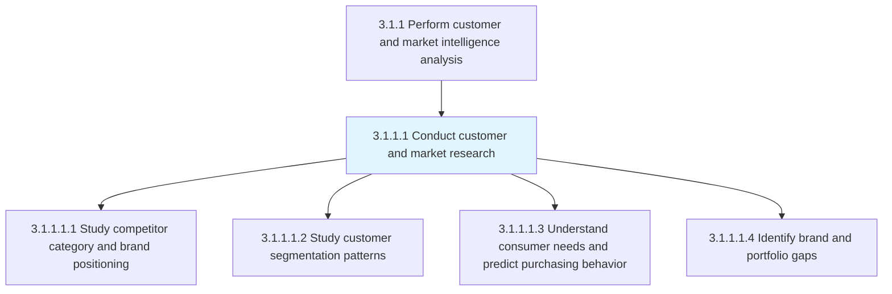
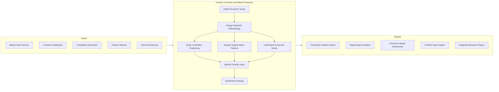
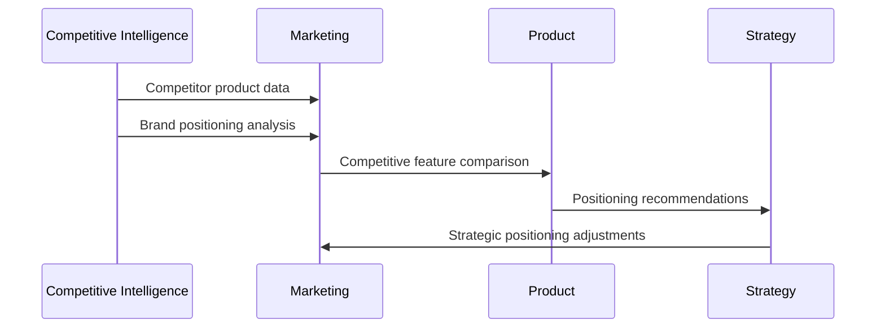
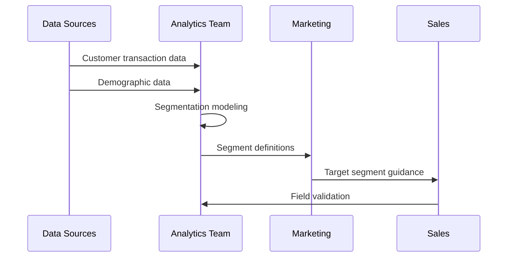
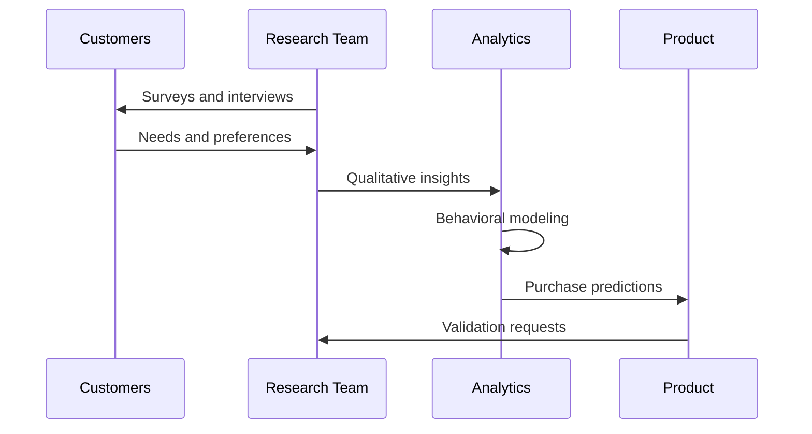
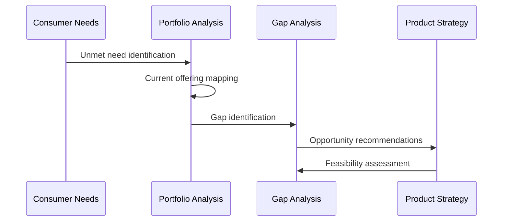

# Conduct Customer and Market Research

> Conducting primary and secondary research to understand customer needs, preferences, behaviors, and market dynamics. This activity provides the foundational data for all customer and market intelligence analysis.

## Overview

Conduct Customer and Market Research is the primary data gathering activity within market intelligence. This activity encompasses both qualitative and quantitative research methods to build comprehensive understanding of customers, competitors, and market conditions.

The activity includes competitive benchmarking, customer segmentation analysis, consumer behavior prediction, and portfolio gap identification. Effective execution provides the raw intelligence that informs strategic marketing and sales decisions.

## Process Hierarchy



## Key Statistics

| Metric | Value |
|--------|-------|
| APQC Code | 19636 |
| Hierarchy ID | 3.1.1.1 |
| Level | Activity |
| Parent Process | [3.1.1 Perform customer and market intelligence analysis](./index.mdx) |
| Child Tasks | 4 |

## GraphDL Semantic Structure

```
conduct.CustomerAndMarketResearch
```

| Component | Value | Description |
|-----------|-------|-------------|
| Verb | `conduct` | Primary action of performing research |
| Object | `CustomerAndMarketResearch` | Research targeting customers and markets |

### Decomposed Actions

| GraphDL Action | Description |
|----------------|-------------|
| `study.CompetitorPositioning` | Benchmark competitor products and brands |
| `study.SegmentationPatterns` | Analyze customer segmentation |
| `understand.ConsumerNeeds` | Identify and predict customer requirements |
| `identify.PortfolioGaps` | Find gaps in product/service offerings |

## Process Flow



## Tasks

### 3.1.1.1.1 - Study competitor category and brand positioning

> Study competitor category and brand positioning (e.g., by benchmarking competitor products)

Analyzing how competitors position their brands and products within market categories. This includes examining competitor messaging, value propositions, pricing strategies, and market positioning.



**Key Actions:**
- `benchmark.CompetitorProducts` - Compare product features and benefits
- `analyze.BrandPositioning` - Examine competitor brand strategies
- `map.CompetitiveLandscape` - Visualize market positioning
- `identify.PositioningGaps` - Find differentiation opportunities

### 3.1.1.1.2 - Study customer segmentation patterns

> Study customer segmentation patterns (e.g., by performing data-driven segmentation analysis)

Analyzing customer data to identify distinct segments based on demographics, behaviors, needs, and preferences. This enables targeted marketing and product development.



**Key Actions:**
- `analyze.CustomerData` - Examine customer datasets
- `identify.SegmentClusters` - Discover natural customer groupings
- `define.SegmentProfiles` - Create detailed segment descriptions
- `validate.Segments` - Confirm segment validity with field data

### 3.1.1.1.3 - Understand consumer needs and predict purchasing behavior

> Identifying the factors that drive the targeted market segment. Model customer purchasing patterns, and forecast their future purchasing behavior.

Understanding what motivates customers to purchase and predicting their future behavior. This includes analyzing purchase drivers, decision-making processes, and behavioral patterns.



**Key Actions:**
- `identify.PurchaseDrivers` - Determine buying motivations
- `model.PurchasingPatterns` - Create behavioral models
- `forecast.CustomerBehavior` - Predict future actions
- `analyze.DecisionProcesses` - Understand buying decisions

### 3.1.1.1.4 - Identify brand and portfolio gaps

Discovering gaps in the brand portfolio where customer needs are not being met by current offerings. This enables strategic product development and brand extension decisions.



**Key Actions:**
- `map.CurrentOfferings` - Inventory existing products/brands
- `analyze.NeedsCoverage` - Assess which needs are met
- `identify.GapOpportunities` - Find unmet need areas
- `recommend.PortfolioActions` - Suggest portfolio changes

## RACI Matrix

| Task | Responsible | Accountable | Consulted | Informed |
|------|-------------|-------------|-----------|----------|
| Study competitor positioning | Competitive Intelligence | VP Marketing | Product, Sales | Strategy |
| Study segmentation patterns | Analytics Team | Market Research Director | Marketing | Sales |
| Understand consumer needs | Market Research | CMO | Product, CS | All |
| Identify portfolio gaps | Product Marketing | VP Product | Marketing, R&D | Executive |

## Related Departments

- [Marketing](/departments/Marketing/index) - Primary research ownership
- [Product Management](/departments/Product) - Product insight integration
- [Sales](/departments/Sales/index) - Field intelligence contribution
- [Strategy](/departments/Strategy/index) - Strategic context

## Related Occupations

- [Market Research Analysts](/occupations/MarketResearchAnalysts) - Primary research execution
- [Competitive Intelligence Analysts](/occupations/CompetitiveIntelligenceAnalysts) - Competitor analysis
- [Data Scientists](/occupations/Technology/DataScientists) - Advanced analytics
- [Consumer Insight Managers](/occupations/ConsumerInsightManagers) - Needs analysis

## Industry Variations

### Consumer Products

Heavy emphasis on shopper research, panel data analysis, and in-store observation studies.

### Banking

Focus on financial behavior research, regulatory-compliant data gathering, and digital channel analytics.

### Retail

Emphasis on store-level research, e-commerce analytics, and omnichannel journey research.

### Healthcare Provider

Focus on patient experience research, clinical outcome studies, and healthcare access analysis.

## Metrics & KPIs

| Metric | Description | Target |
|--------|-------------|--------|
| Research Cycle Time | Days from brief to delivery | <14 days |
| Data Quality Score | Accuracy and completeness | >90% |
| Insight Utilization | Findings used in decisions | >80% |
| Competitive Coverage | Competitors analyzed | >95% |
| Segmentation Accuracy | Segment prediction accuracy | >85% |

---

*Source: APQC PCF 19636 (3.1.1.1) - Cross-Industry*
