# Design customer experience

> Creating a design of how customers interact with the business by analyzing data captured through various customer interaction and customer involvement. These will be captured through various channels such as customer satisfaction surveys, feedback forms, product reviews, targeted studies, observational studies, or voice of customer research.

## Overview

Design customer experience (APQC 19964) is a critical process within the Develop Customer Experience Strategy process group. This process focuses on creating intentional, coherent designs for how customers interact with the organization across all touchpoints. By analyzing customer data, feedback, and behavior, organizations can design experiences that meet customer needs, align with brand values, and drive business results.

Customer experience design goes beyond individual interactions to consider the entire customer journey. It encompasses the emotional, functional, and contextual elements that shape how customers perceive and engage with the organization. The goal is to create experiences that are consistent, differentiated, and valuable to both customers and the business.

## Process Hierarchy

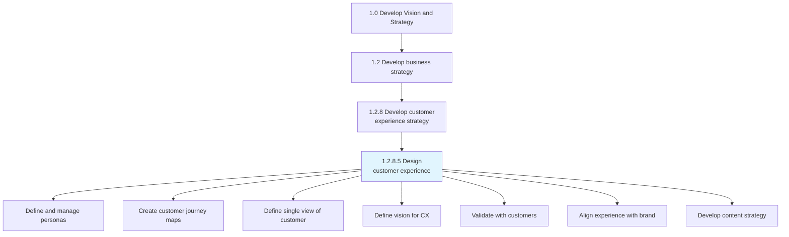

## Key Statistics

| Metric | Value |
|--------|-------|
| APQC Code | 19964 |
| Hierarchy ID | 1.2.8.5 |
| Level | Process |
| Category | [Develop Vision and Strategy](/processes/01-Strategy) |
| Sub-Activities | 7 |
| Related Touchpoints | All customer-facing |

## Process Flow

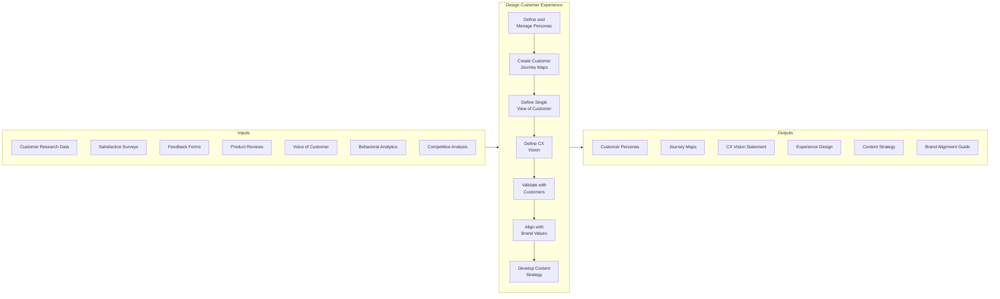

## GraphDL Semantic Structure

```
design.CustomerExperience
```

| Component | Value | Description |
|-----------|-------|-------------|
| Verb | `design` | Primary action of creating and planning |
| Object | `CustomerExperience` | The totality of customer interactions |
| Preposition | - | Not applicable |
| PrepObject | - | Not applicable |

## Activities

### Define and manage personas

Identifying a set of characteristics that define the demographic and behavioral patterns of the customer. Use persona scoring to design marketing strategies around personas, and measure and optimize interactions with contacts classified by a certain persona.

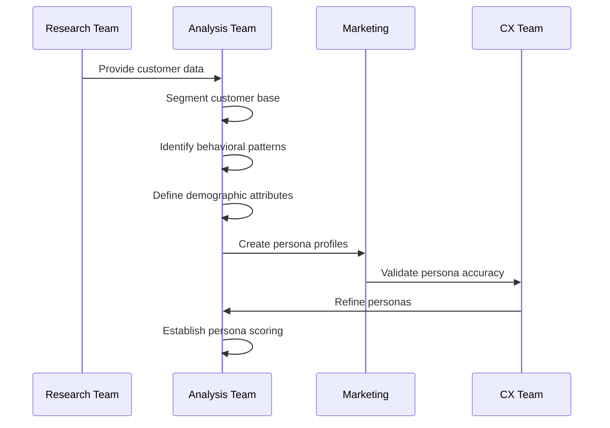

**Tasks:**
- `segment.CustomerBase` - Divide customers into meaningful groups
- `identify.BehavioralPatterns` - Recognize common customer behaviors
- `define.DemographicAttributes` - Document persona characteristics
- `create.PersonaProfiles` - Build detailed persona descriptions
- `establish.PersonaScoring` - Create scoring methodology for persona classification

### Create customer journey maps

Creating a story of the customer's experience from initial contact, through the process of engagement and into a long-term relationship. The goal is to teach the organization about the customer.

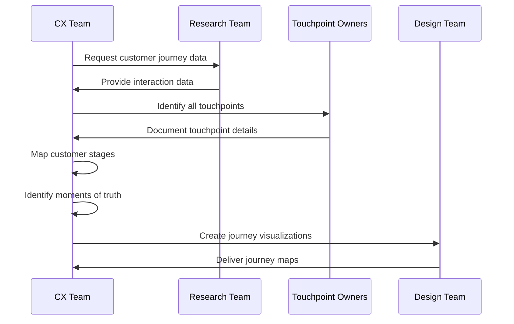

**Tasks:**
- `identify.CustomerStages` - Define phases of customer relationship
- `map.Touchpoints` - Document all customer interaction points
- `document.CustomerEmotions` - Capture emotional journey
- `identify.MomentsOfTruth` - Highlight critical interactions
- `visualize.JourneyMaps` - Create journey map artifacts

### Define single view of the customer

Defining parameters to show aggregated, consistent, and holistic representation of known data about customers. Define key parameters which enable the tracking of customers and communications across every channel.

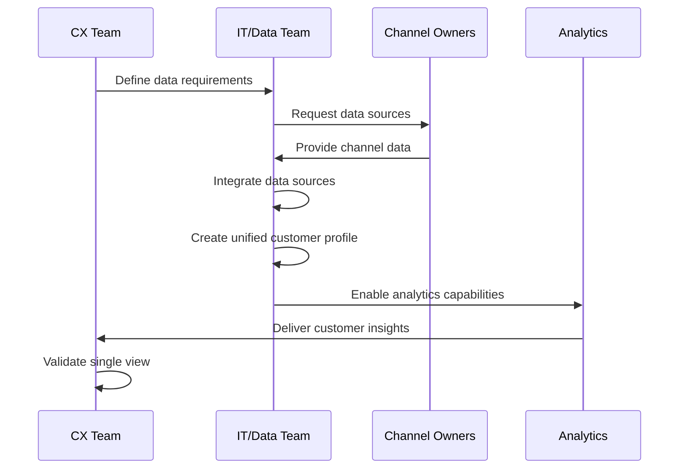

**Tasks:**
- `identify.DataSources` - Catalog all customer data sources
- `define.DataParameters` - Establish key customer attributes
- `integrate.CustomerData` - Create unified data model
- `enable.CrossChannelTracking` - Connect customer across channels
- `validate.DataQuality` - Ensure accuracy and completeness

### Define a vision for the customer experience

Establishing a direction and vision on how the organization behaves towards customers in a consistent, effective way. The key attributes for customer experience vision consists of emotional connection, commitments and expectations, compelling value proposition, and ease of understanding the organization's behavior.

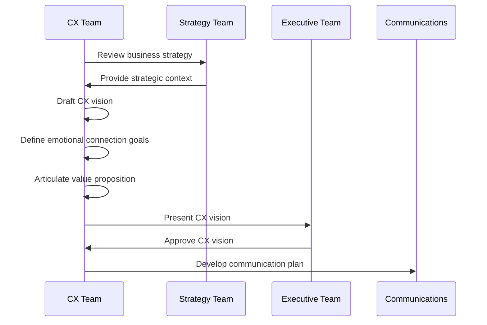

**Tasks:**
- `define.EmotionalConnection` - Establish desired emotional outcomes
- `articulate.ValueProposition` - Clarify customer value delivery
- `set.CXCommitments` - Define experience promises
- `document.CXVision` - Create CX vision statement
- `align.WithStrategy` - Ensure strategic alignment

### Validate with customers

Creating a process to validate the sales process and the assumptions that underpin the business model. Understand if the products/services have a repeatable, scalable business model around that product.

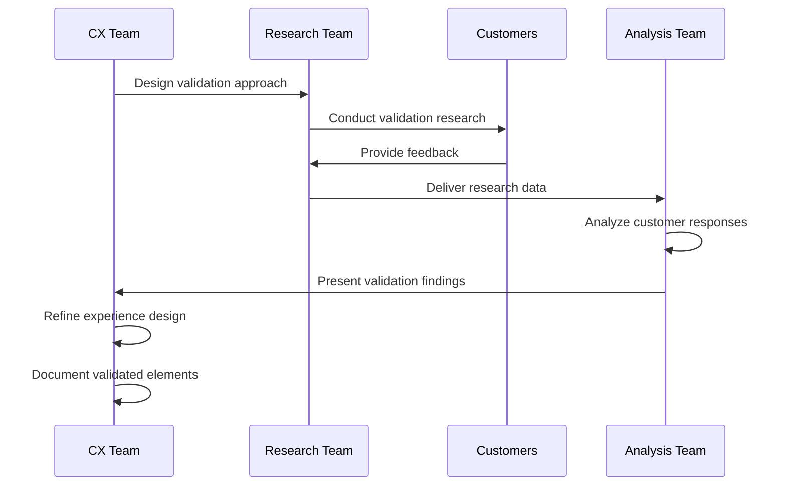

**Tasks:**
- `design.ValidationApproach` - Create validation methodology
- `conduct.CustomerResearch` - Execute validation activities
- `analyze.CustomerFeedback` - Interpret validation results
- `refine.ExperienceDesign` - Update based on validation
- `document.ValidatedElements` - Record confirmed design decisions

### Align experience with brand values and business strategies

Aligning and defining a relevant, differentiated, and credible value proposition for the brand. Align experience to ensure that the product and service quality is consistent with brand promise and business strategies.

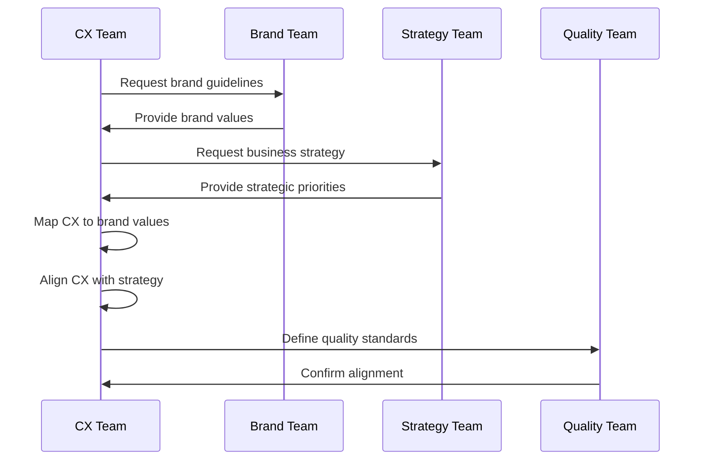

**Tasks:**
- `map.CXToBrandValues` - Connect experience to brand
- `align.CXWithStrategy` - Ensure strategic fit
- `define.QualityStandards` - Set experience quality levels
- `document.AlignmentGuidelines` - Create alignment documentation
- `validate.Consistency` - Ensure consistent delivery

### Develop content strategy

Planning, development, and management of content written or in other media. Getting the right content to the right user at the right time through strategic planning of content creation, delivery, and governance.

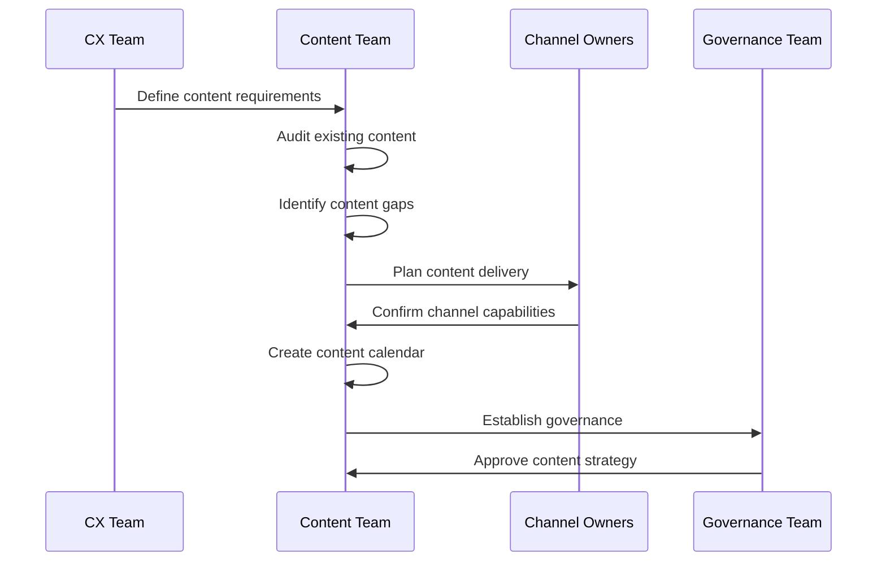

**Tasks:**
- `audit.ExistingContent` - Assess current content inventory
- `identify.ContentGaps` - Find missing content elements
- `plan.ContentDelivery` - Define content distribution
- `create.ContentCalendar` - Schedule content creation
- `establish.ContentGovernance` - Set content management rules

## Customer Journey Framework

### Journey Stages

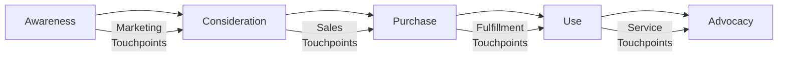

### Touchpoint Categories

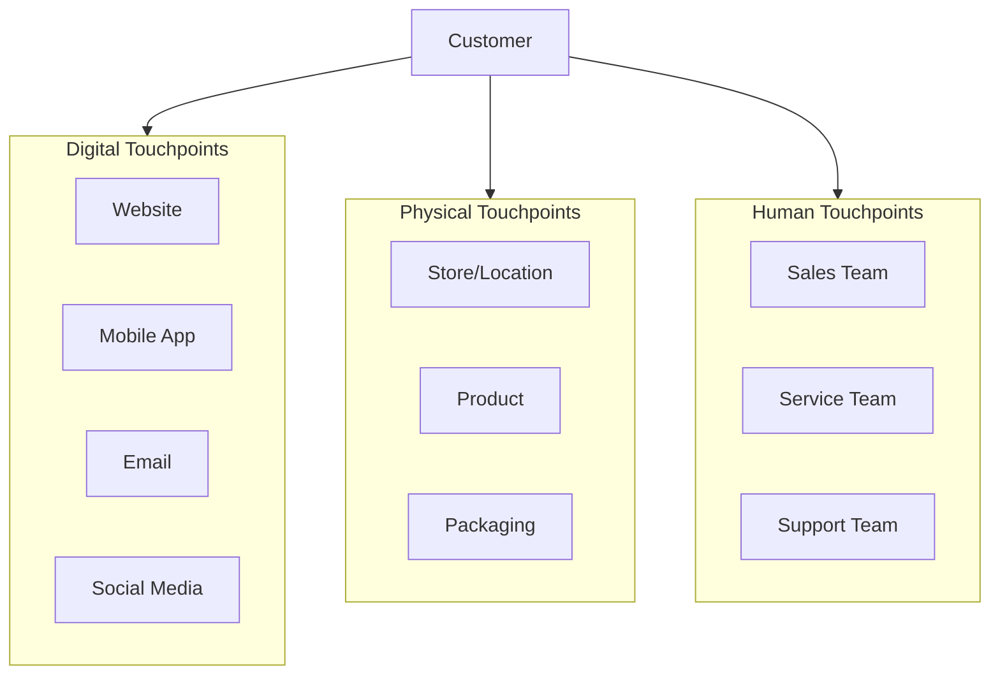

## RACI Matrix

| Activity | Responsible | Accountable | Consulted | Informed |
|----------|-------------|-------------|-----------|----------|
| Define and manage personas | CX Team | CMO | Marketing, Sales | All Customer-facing |
| Create customer journey maps | CX Team | CMO | All Touchpoint Owners | Executive Team |
| Define single view of customer | CX Team, IT | CDO | All Channels | Marketing |
| Define CX vision | CX Team | CEO | Executive Team | All Employees |
| Validate with customers | Research Team | CMO | CX Team | Product, Sales |
| Align with brand values | CX Team | CMO | Brand, Strategy | Marketing |
| Develop content strategy | Content Team | CMO | CX Team, Channels | All Departments |

## Related Departments

- [Customer Experience](/departments/CX) - Primary owner of experience design
- [Marketing](/departments/Marketing/index) - Brand alignment and content
- [Sales](/departments/Sales/index) - Customer journey touchpoints
- [Customer Service](/departments/CustomerService) - Service touchpoints
- [Information Technology](/departments/IT) - Data integration and analytics
- [Product Management](/departments/Product) - Product experience design

## Related Occupations

- [Customer Experience Managers](/occupations/CXManagers) - Experience design leadership
- [UX Designers](/occupations/UXDesigners) - Digital experience design
- [Market Research Analysts](/occupations/MarketResearchAnalysts) - Customer research
- [Marketing Managers](/occupations/Management/MarketingManagers) - Brand and content alignment
- [Data Analysts](/occupations/DataAnalysts) - Customer insights

## Industry Variations

### Banking

Banking CX design emphasizes digital banking experiences, omnichannel consistency, and trust-building through security and transparency. Journey maps address account opening, lending, and wealth management pathways.

**Industry-Specific Activities:**
- Design digital banking journeys
- Create omnichannel branch/digital integration
- Build trust through security transparency
- Design financial wellness experiences

### Healthcare Provider

Healthcare CX design focuses on patient experience, care coordination, and health outcomes. Journey maps address patient acquisition, care delivery, and ongoing wellness management.

**Industry-Specific Activities:**
- Design patient access experiences
- Create care coordination journeys
- Build patient portal experiences
- Design health outcome tracking

### Retail

Retail CX design emphasizes shopping experiences across channels, personalization, and loyalty. Journey maps address discovery, purchase, and post-purchase engagement.

**Industry-Specific Activities:**
- Design omnichannel shopping journeys
- Create personalized product discovery
- Build loyalty program experiences
- Design returns and exchange processes

### Aerospace and Defense

Aerospace CX design addresses B2B customer relationships, complex procurement processes, and long-term service relationships. Journey maps cover sales cycles, program delivery, and aftermarket services.

**Industry-Specific Activities:**
- Design enterprise sales journeys
- Create program delivery experiences
- Build aftermarket service journeys
- Design technical support experiences

## Sub-Processes

| Process | Code | Description |
|---------|------|-------------|
| [Define and manage personas](./Personas) | 16612 | Create and manage customer personas |
| [Create customer journey maps](./JourneyMaps) | 19965 | Map the customer experience journey |
| [Define single view of customer](./SingleView) | 19966 | Create unified customer data view |
| [Define CX vision](./CXVision) | 19967 | Establish customer experience vision |
| [Validate with customers](./Validation) | 19968 | Validate experience design with customers |
| [Align with brand](./BrandAlignment) | 19969 | Ensure brand consistency |
| [Develop content strategy](./ContentStrategy) | 19970 | Plan content creation and delivery |

## Related Processes

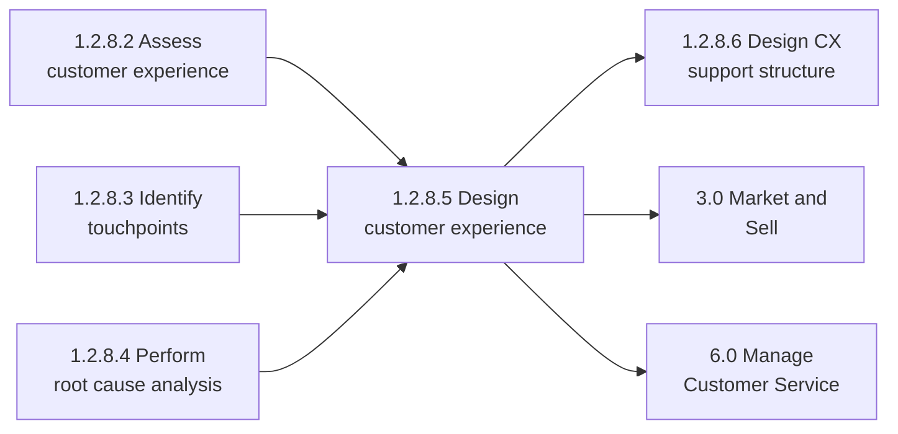

## Metrics & KPIs

| Metric | Description | Target |
|--------|-------------|--------|
| Customer Satisfaction Score (CSAT) | Overall satisfaction rating | >85% |
| Net Promoter Score (NPS) | Customer loyalty measure | >50 |
| Customer Effort Score (CES) | Ease of interaction | >4.0/5.0 |
| Journey Completion Rate | Percentage completing journeys | >80% |
| Touchpoint Satisfaction | Satisfaction by touchpoint | >80% per touchpoint |
| Experience Consistency | Cross-channel consistency | >90% |

---

*Source: APQC PCF 19964 (1.2.8.5) - Cross-Industry*
