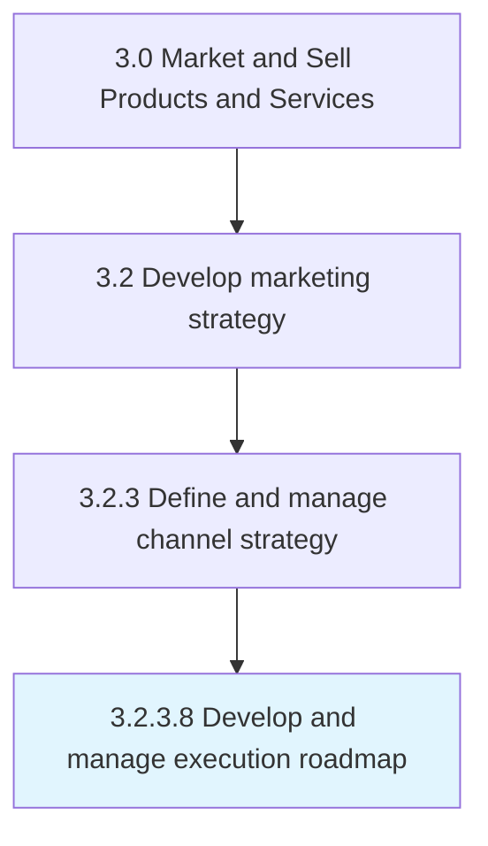

# Define omni-channel strategy

> Devising a strategy to market company's products or services seamlessly through all or most channels that are in widespread use among the target market.

## Overview

Activity 3.2.3.8 is an activity within the Market and Sell Products and Services framework. 

Devising a strategy to market company's products or services seamlessly through all or most channels that are in widespread use among the target market. This may mean cross-channel access to customer preferences and purchasing history to accept returned merchandise, provide refunds, resolve payment issues or to provide technical support.

## Process Hierarchy



## Key Statistics

| Metric | Value |
|--------|-------|
| APQC Code | 16590 |
| Hierarchy ID | 3.2.3.8 |
| Level | Activity |
| Parent | [3.2.3](../) |
| Sub-Processes | 0 |


## GraphDL Semantic Structure

```
define.OmnichannelStrategy
```

| Component | Value | Description |
|-----------|-------|-------------|
| Verb | `define` | Primary action |
| Object | `omni-channel strategy` | Direct object |


---

*Source: APQC PCF 16590 (3.2.3.8) - APQC*

## Related Occupations

- [Marketing Managers](/occupations/Management/MarketingManagers)
- [Sales Managers](/occupations/Management/SalesManagers)
- [Market Research Analysts and Marketing Specialists](/occupations/Business/MarketResearchAnalystsAndMarketingSpecialists)
- [Computer and Information Systems Managers](/occupations/Management/ComputerAndInformationSystemsManagers)
- [Advertising and Promotions Managers](/occupations/Management/AdvertisingAndPromotionsManagers)

## Related Departments

- [Marketing](/departments/Marketing)
- [Sales](/departments/Sales)
- [Digital](/departments/Digital)
- [Customer Experience](/departments/CustomerExperience)
- [Information Technology](/departments/IT)

## Industry Variations

This process applies universally across all industries, with the following common best practices:

### Universal Applicability

Omnichannel strategy is essential for any organization engaging customers through multiple touchpoints. Whether B2B or B2C, seamless channel integration improves customer experience and operational efficiency.

### Cross-Industry Best Practices

| Practice | Description |
|----------|-------------|
| Customer Journey Mapping | Document all touchpoints across physical and digital channels |
| Unified Data Platform | Centralize customer data for consistent cross-channel experiences |
| Channel Prioritization | Focus resources on channels most valued by target customers |
| Technology Integration | Ensure systems enable real-time data sharing across channels |
| Consistent Brand Experience | Maintain brand coherence while optimizing for channel-specific strengths |

### Common Metrics

- Channel conversion rates and attribution
- Customer satisfaction by channel
- Cross-channel purchase patterns
- Time to resolve issues across channels
- Channel cost-to-serve comparison
