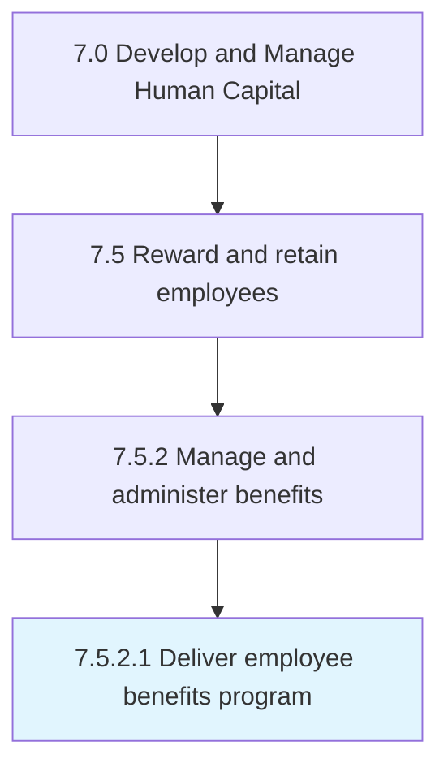

# Deliver employee benefits program

> Implementing the programs that specify employee benefits, other than salary provided, such as those concerning medical care, death, and disability.

## Overview

Activity 7.5.2.1 is an activity within the Develop and Manage Human Capital framework. 

Implementing the programs that specify employee benefits, other than salary provided, such as those concerning medical care, death, and disability.

## Process Hierarchy



## Key Statistics

| Metric | Value |
|--------|-------|
| APQC Code | 10504 |
| Hierarchy ID | 7.5.2.1 |
| Level | Activity |
| Parent | [7.5.2](../) |
| Sub-Processes | 0 |


## GraphDL Semantic Structure

```
deliver.EmployeeBenefitsProgram
```

| Component | Value | Description |
|-----------|-------|-------------|
| Verb | `deliver` | Primary action |
| Object | `employee benefits program` | Direct object |


## Related Concepts

- EmployeeBenefitsProgram


---

*Source: APQC PCF 10504 (7.5.2.1) - APQC*

## Related Occupations

- [Compensation and Benefits Managers](/occupations/Management/CompensationAndBenefitsManagers)
- [Compensation, Benefits, and Job Analysis Specialists](/occupations/Business/CompensationBenefitsAndJobAnalysisSpecialists)
- [Human Resources Managers](/occupations/Management/HumanResourcesManagers)
- [Human Resources Specialists](/occupations/Business/HumanResourcesSpecialists)
- [Insurance Underwriters](/occupations/Finance/InsuranceUnderwriters)

## Related Departments

- [Human Resources](/departments/HR)
- [Compensation and Benefits](/departments/CompensationBenefits)
- [Payroll](/departments/Payroll)
- [Employee Services](/departments/EmployeeServices)

## Industry Variations

This process applies universally across all industries, with the following common best practices:

### Universal Applicability

Employee benefits delivery is essential for workforce wellbeing and talent retention across all sectors. Effective benefits programs support employee health, financial security, and work-life balance.

### Cross-Industry Best Practices

| Practice | Description |
|----------|-------------|
| Enrollment Simplification | Streamline the enrollment experience with digital tools |
| Benefits Communication | Educate employees on total value of their benefits package |
| Vendor Management | Maintain strong relationships with benefits providers |
| Compliance Monitoring | Track regulatory requirements for ERISA, ACA, and other laws |
| Utilization Analysis | Monitor benefits usage to optimize program design |

### Common Metrics

- Benefits enrollment rate
- Employee satisfaction with benefits
- Benefits cost per employee
- Claims processing accuracy and timeliness
- Vendor service level achievement
