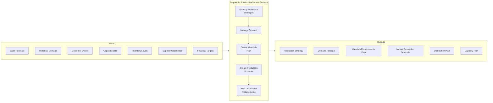
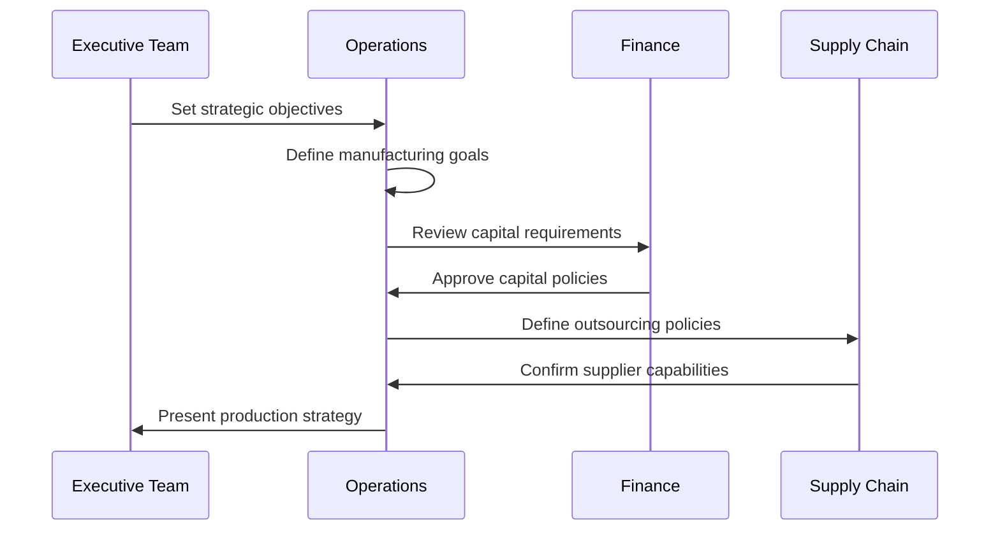
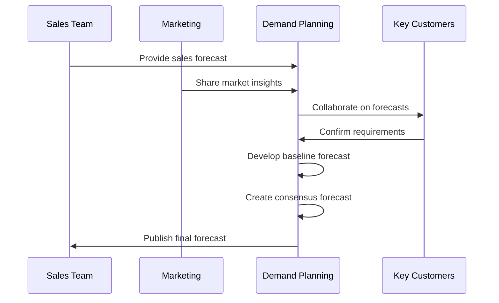
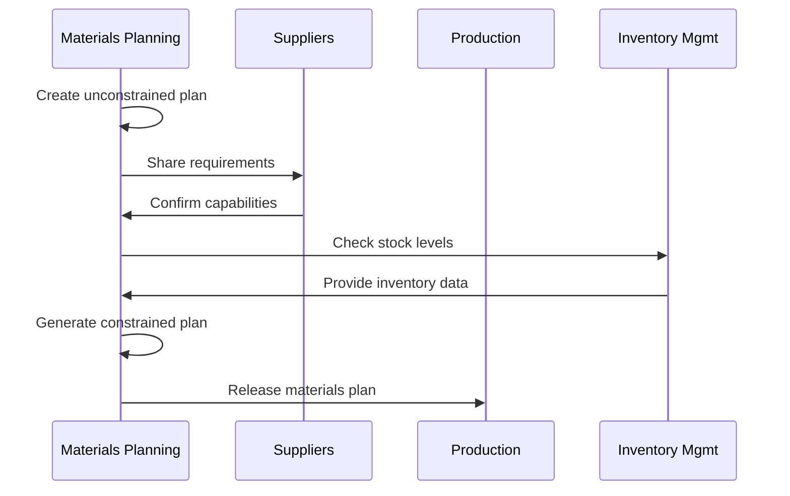
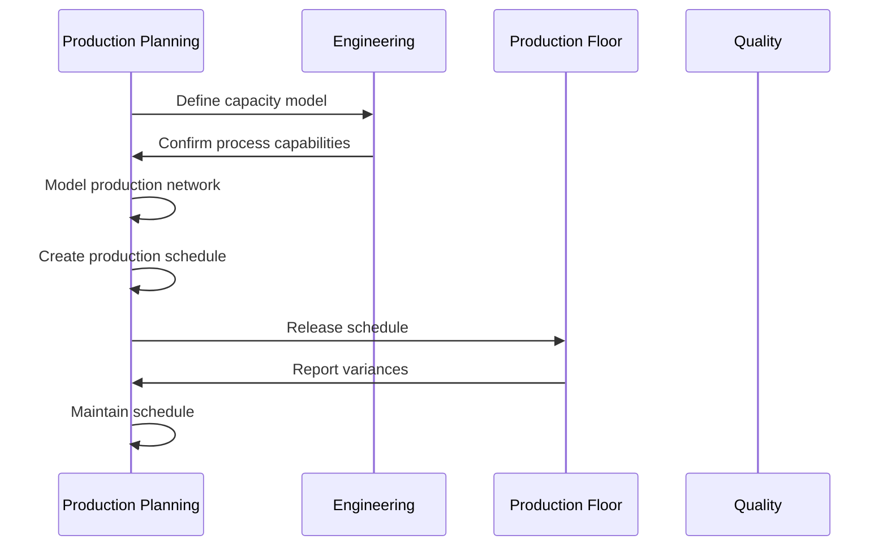
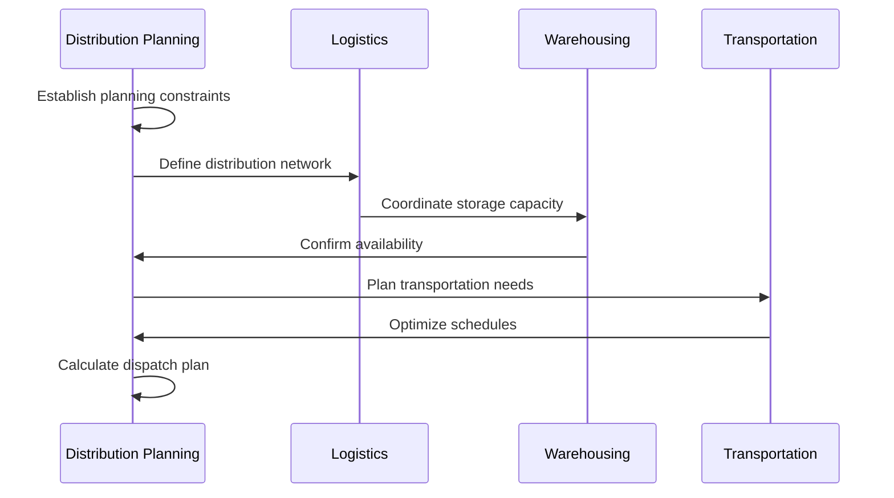
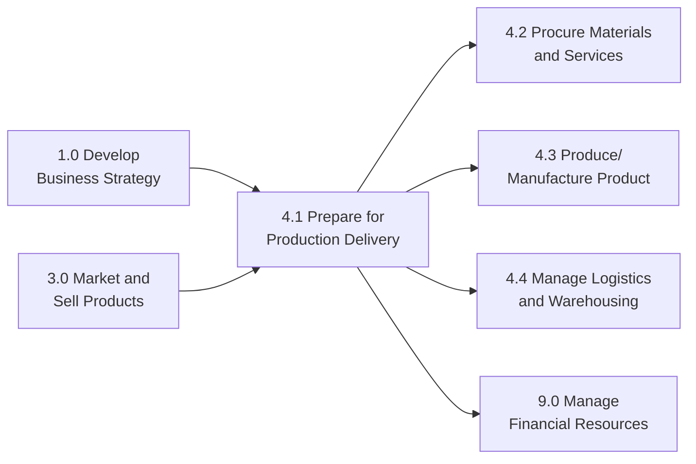

# Prepare for production/service delivery

> Devising business plans and procedures for manufacturing/operations/production and delivery of services offered by the organization. This process defines the total amount of output that the manufacturing department is responsible to produce for each period, establishes production capacity, and aligns resources with demand.

## Overview

Prepare for production/service delivery (APQC 4.1) is a foundational process group that ensures organizations have the capacity, resources, and plans in place to fulfill customer demand. This process encompasses strategic supply chain planning, demand management, materials planning, production scheduling, and distribution planning. Effective preparation is critical for balancing inventory costs, production efficiency, and customer service levels.

This process requires close collaboration between sales, operations, finance, and supply chain functions to create realistic production plans that align with market demand, available capacity, and financial constraints. It establishes the framework for all downstream operational activities including procurement, production, and logistics.

## Process Hierarchy

```mermaid
graph TD
    C4["4.0 Deliver Physical Products"] --> G41["4.1 Prepare for production/<br/>service delivery"]

    G41 --> P411["4.1.1 Develop production and<br/>materials strategies"]
    G41 --> P412["4.1.2 Manage demand<br/>for products"]
    G41 --> P413["4.1.3 Create materials plan"]
    G41 --> P414["4.1.4 Create and manage master<br/>production schedule"]
    G41 --> P415["4.1.5 Plan distribution<br/>requirements"]

    P411 --> A4111["4.1.1.1 Define manufacturing<br/>goals"]
    P411 --> A4112["4.1.1.2 Define labor and<br/>materials policies"]
    P411 --> A4113["4.1.1.3 Define outsourcing<br/>policies"]
    P411 --> A4114["4.1.1.4 Define capital<br/>expense policies"]

    P412 --> A4121["4.1.2.1 Develop baseline<br/>forecasts"]
    P412 --> A4122["4.1.2.2 Collaborate with<br/>customers"]
    P412 --> A4123["4.1.2.3 Develop consensus<br/>forecast"]
    P412 --> A4124["4.1.2.4 Monitor activity<br/>against forecast"]

    P413 --> A4131["4.1.3.1 Create unconstrained<br/>plan"]
    P413 --> A4132["4.1.3.2 Collaborate with<br/>suppliers"]
    P413 --> A4133["4.1.3.3 Generate constrained<br/>plan"]

    P414 --> A4141["4.1.4.1 Model production<br/>network"]
    P414 --> A4142["4.1.4.2 Create production<br/>schedule"]
    P414 --> A4143["4.1.4.3 Maintain production<br/>schedule"]

    style G41 fill:#e1f5fe
```



## Key Statistics

| Metric | Value |
|--------|-------|
| APQC Code | 19997 |
| Hierarchy ID | 4.1 |
| Level | Process Group |
| Category | [Deliver Physical Products](/processes/04-Delivery) |
| Sub-Processes | 5 |
| Activities | 20+ |

## Process Flow



## GraphDL Semantic Structure

```
prepare.Production.for.ServiceDelivery
```

| Component | Value | Description |
|-----------|-------|-------------|
| Verb | `prepare` | Action of planning and readying |
| Object | `Production` | Manufacturing and operations activities |
| Preposition | `for` | Purpose relationship |
| PrepObject | `ServiceDelivery` | Final delivery of goods/services |

## Activities

### 4.1.1 - Develop production and materials strategies

Establishing strategic policies for manufacturing operations, labor, materials, outsourcing, and capital investments that guide tactical planning decisions.



**Tasks:**
- `define.ManufacturingGoals` - Establish production objectives and targets
- `define.LaborAndMaterialsPolicies` - Set guidelines for workforce and materials
- `define.OutsourcingPolicies` - Determine make vs. buy decisions
- `define.CapitalExpensePolicies` - Establish equipment investment guidelines
- `define.ProductionNetworkConstraints` - Identify supply chain limitations

### 4.1.2 - Manage demand for products

Creating forecasts and managing demand signals to ensure production plans align with market requirements and customer needs.



**Tasks:**
- `develop.BaselineForecasts` - Create initial demand projections
- `collaborate.WithCustomers` - Partner on demand planning
- `develop.ConsensusForecast` - Align stakeholders on final forecast
- `monitor.ActivityAgainstForecast` - Track actual vs. planned demand
- `measure.DemandForecastAccuracy` - Evaluate forecast performance

### 4.1.3 - Create materials plan

Developing plans for raw materials, components, and supplies needed to support production schedules while optimizing inventory levels.



**Tasks:**
- `create.UnconstrainedPlan` - Develop ideal materials requirements
- `collaborate.WithSuppliers` - Coordinate with vendors on capacity
- `monitor.MaterialSpecifications` - Track material quality requirements
- `generate.ConstrainedPlan` - Create realistic supply plan
- `establish.MaterialsContingencyPlans` - Plan for supply disruptions

### 4.1.4 - Create and manage master production schedule

Establishing and maintaining the detailed production schedule that drives manufacturing operations and coordinates all production activities.



**Tasks:**
- `model.ProductionNetwork` - Create simulation for optimization
- `create.MasterProductionSchedule` - Develop detailed schedule
- `maintain.MasterProductionSchedule` - Update schedule as needed
- `determine.FinishedGoodsRequirements` - Calculate output needs
- `manage.CollaborativeReplenishment` - Coordinate inventory replenishment

### 4.1.5 - Plan distribution requirements

Creating plans for the distribution of finished goods through the logistics network to meet customer delivery requirements.



**Tasks:**
- `establish.DistributionPlanningConstraints` - Define logistics limitations
- `review.DistributionPolicies` - Assess distribution strategies
- `review.DistributionNetwork` - Evaluate channel performance
- `calculate.DestinationDispatchPlan` - Plan delivery routing
- `manage.CapacityUtilization` - Optimize logistics capacity

## RACI Matrix

| Activity | Responsible | Accountable | Consulted | Informed |
|----------|-------------|-------------|-----------|----------|
| Develop production strategies | Operations | VP Operations | Executive Team, Finance | All Departments |
| Manage demand | Demand Planning | VP Sales | Sales, Marketing, Customers | Operations |
| Create materials plan | Materials Planning | Supply Chain Director | Procurement, Suppliers | Production |
| Create production schedule | Production Planning | Plant Manager | Engineering, Quality | Logistics |
| Plan distribution | Distribution Planning | VP Supply Chain | Logistics, Warehousing | Sales |

## Related Departments

- [Operations](/departments/Operations/index) - Production strategy and execution oversight
- [Supply Chain Planning](/departments/SupplyChainPlanning) - Demand and supply coordination
- [Manufacturing](/departments/Manufacturing) - Production scheduling and execution
- [Procurement](/departments/Procurement) - Materials acquisition
- [Logistics](/departments/Logistics) - Distribution planning
- [Sales](/departments/Sales/index) - Demand forecasting input
- [Finance](/departments/Finance/index) - Capital and budget planning

## Related Occupations

- [Industrial Production Managers](/occupations/Management/IndustrialProductionManagers) - Production planning leadership
- [Logisticians](/occupations/Business/Logisticians) - Supply chain coordination
- [Operations Research Analysts](/occupations/Technology/OperationsResearchAnalysts) - Planning optimization
- [Production Planners](/occupations/ProductionPlanners) - Scheduling specialists
- [Demand Planners](/occupations/DemandPlanners) - Forecast development
- [Supply Chain Managers](/occupations/Management/SupplyChainManagers) - End-to-end coordination

## Industry Variations

### Manufacturing

Manufacturing organizations implement S&OP (Sales & Operations Planning) processes with detailed capacity planning, BOM (Bill of Materials) management, and MRP (Material Requirements Planning) systems. Focus on production efficiency, changeover optimization, and lean principles.

**Industry-Specific Activities:**
- Conduct Sales & Operations Planning (S&OP)
- Manage Bill of Materials (BOM) accuracy
- Optimize production changeovers
- Implement lean manufacturing principles

### Automotive

Automotive production planning emphasizes just-in-time delivery, supplier synchronization, and assembly line balancing. Planning horizons extend from years (platform planning) to hours (sequence scheduling).

**Industry-Specific Activities:**
- Coordinate just-in-sequence delivery
- Manage mixed-model assembly lines
- Synchronize tier-1 supplier production
- Plan vehicle configuration constraints

### Aerospace and Defense

Aerospace planning involves long lead times (often years), complex certification requirements, and limited production rates. Focus on program management, configuration control, and supplier qualification.

**Industry-Specific Activities:**
- Manage multi-year production programs
- Coordinate certification requirements
- Plan for limited-rate initial production
- Manage complex supplier networks

### Retail

Retail preparation focuses on distribution center capacity, seasonal planning, promotional inventory, and omnichannel fulfillment. Speed and flexibility are critical for responding to demand changes.

**Industry-Specific Activities:**
- Plan seasonal inventory buildups
- Coordinate promotional planning
- Optimize DC (Distribution Center) capacity
- Prepare for peak season operations

### Consumer Products

Consumer products planning balances forecast accuracy, promotional planning, and shelf-life constraints. Focus on trade promotions, new product launches, and category management.

**Industry-Specific Activities:**
- Coordinate promotional planning with retailers
- Manage new product launch timing
- Plan for shelf-life constraints
- Balance production runs with demand variability

### Life Sciences

Life sciences planning requires validation-compliant processes, batch tracking, regulatory documentation, and cold chain considerations. Planning must account for quality holds and regulatory releases.

**Industry-Specific Activities:**
- Plan for validation and qualification
- Manage batch production schedules
- Coordinate regulatory release timelines
- Plan cold chain logistics requirements

## Sub-Processes

| Process | Code | Description |
|---------|------|-------------|
| [Install and validate production process](./ValidationProcess) | 4.1.1 | Implementing and validating manufacturing processes |
| [Understand resource requirements](./ResourceRequirements) | 4.1.2 | Analyzing resource needs for products and channels |
| Develop production and materials strategies | 4.1.3 | Strategic planning for manufacturing operations |
| Create materials plan | 4.1.4 | Planning raw material and component requirements |
| Create master production schedule | 4.1.5 | Detailed production scheduling |

## Related Processes



## Metrics & KPIs

| Metric | Description | Target |
|--------|-------------|--------|
| Forecast Accuracy | Percentage accuracy of demand forecasts | >85% |
| Schedule Adherence | Compliance with production schedule | >95% |
| Capacity Utilization | Percentage of available capacity used | 80-90% |
| Materials Availability | On-time material availability rate | >98% |
| Planning Cycle Time | Time to complete planning cycle | <5 days |
| Inventory Days of Supply | Days of inventory on hand | Industry benchmark |
| Plan Stability | Frequency of major plan changes | <10% |
| S&OP Compliance | Adherence to S&OP decisions | >90% |

---

*Source: APQC PCF 19997 (4.1) - Cross-Industry*
