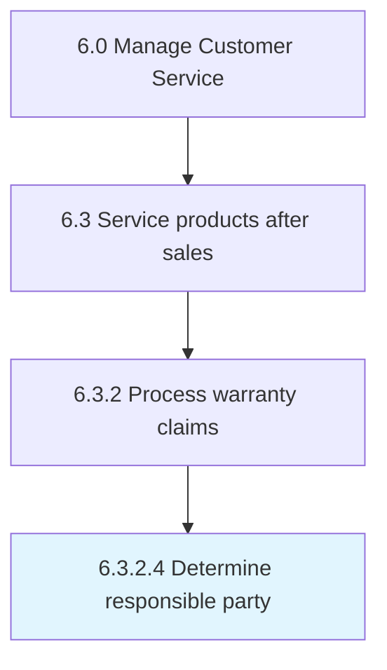

# Determine responsible party

> Identifying responsible party for a claim.

## Overview

Activity 6.3.2.4 is an activity within the Manage Customer Service framework. 

Identifying responsible party for a claim. There is no negotiation with the supplier at this point. There can be multiple warranties applicable to the same part: a new part warranty, a new product warranty (for the product the part is installed on), and a supplier warranty from the company that last repaired the part. The information required for this decision would be the output of Receive component/part and analyze fault [19728]." cross-industry 0 20102 6.3.2.5 Manage pre-authorizations Authorizing claims prior to submittal. cross-industry 0 12668 6.3.2.6 Approve or reject warranty claim Following Defining issue [20098], an approval or rejection with be made against the warranty claim. If it is deemed that the claim falls within the warranty parameters, the claim will be approved. If the claim is deemed to fall outside warranty parameters, the claim with be rejected. cross-industry 0 20103 6.3.2.7 Notify originator of approve/reject decision Contacting the originator of whether the warranty claim has been approved or rejected. cross-industry 0 20104 6.3.2.8 Authorize payment Allowing for a payment to be made to the claimant. cross-industry 0 20105 6.3.2.9 Close claim Archiving and closing the warranty claim after a final decision has been made to either approve or reject. cross-industry 0 12667 6.3.2.10 Reconcile warranty transaction disposition Assuring that the warranty transaction has been completed. cross-industry 0 20106 6.3.3 Manage supplier recovery Managing the recovery of costs from suppliers for individual claims. cross-industry 0 20107 6.3.3.1 Create supplier recovery claims Raising a supplier recovery claim. This is based off the decision made in Receive investigation result/recommendation for corrective action [20100]. cross-industry 0 20108 6.3.3.2 Negotiate recoveries with suppliers Arranging the returns of recalled products to suppliers. cross-industry 0 10218 6.3.4 Service products Validating specific service requirements for individual customers. Determine and schedule resource to fulfill these requirements. Provide service to specific individual customers. Ensure the quality of service delivery. cross-industry 0 10320 6.3.4.1 Confirm specific service requirements for individual customer Acquiring or soliciting information about specific service requirements for individual customers through the customer service function. Obtain information about customer specific requests, process these requests, and create customer profiles to generate a service order. cross-industry 0 10324 6.3.4.1.1 Process customer request Soliciting or acquiring information using various sources such as databases, customer interactions, and customer request forms. Hand them further up the hierarchy to deal with them. Categorize the user's request, determining if the request is supportable and prioritizing the request. cross-industry 0 10325 6.3.4.1.2 Create customer profile Documenting the individual customer service requirements solicited, along with personal information of the customers, in order to generate customized profiles that hasten the delivery process. cross-industry 0 10326 6.3.4.1.3 Generate service order Designing a short-term agreement between the service provider and customer. One-time services are ordered by the service recipient and resource-related billing is performed upon completion. Use the service order to document service and customer service work. cross-industry 0 10321 6.3.4.2 Identify and schedule resources to meet service requirements Determining and scheduling the resources required to fulfill customer service requirements. Create a detailed schedule about the service orders and development of these service orders. cross-industry 0 10327 6.3.4.2.1 Create resourcing plan and schedule Developing a plan for sourcing and deploying the resources required to fulfill customer service needs. Document a detailed summary of all types of resources (equipment, finance, personnel, time, etc.) required to complete customer service requests and procure these resources. Identify and assess various sources in order to effectively create a resourcing plan. cross-industry 0 10328 6.3.4.2.2 Create service order fulfillment schedule Designing a detailed summary of customer service order requirements, along with information concerning the timing and duration for these services. Categorize the customer needs. Monitor the services delivered. cross-industry 0 10322 6.3.4.3 Provide service to specific customers Dispatching resources for managing and fulfilling daily service requirements. Manage the progress of order fulfillment. Complete order blocks. cross-industry 0 10330 6.3.4.3.1 Organize daily service order fulfillment schedule Laying out a daily plan of specific service orders that need to be fulfilled. Document and systematically order these activities to ensure high effectiveness and efficiency. cross-industry 0 10331 6.3.4.3.2 Execute product repair Dispatching and delivering the resources needed for the specific service requirements from the source/warehouse. Manage the dispatch, transportation, and delivery of the services. cross-industry 0 10332 6.3.4.3.3 Manage service order fulfillment Handling and managing orders fulfilled, along with the orders are not or partially fulfilled to track the order fulfillment progress. Use electronic devices such as trackers and GPS in order track and ensure delivery of the orders. cross-industry 0 10323 6.3.4.4 Ensure quality of service Guaranteeing the quality of service provided to customers. Identify the successful and unsuccessful orders along with the service failures. Collect customer feedback. Process the feedback to ensure the quality of service in the future. cross-industry 0 10334 6.3.4.4.1 Identify completed service orders for feedback Determining the service orders that have been successfully delivered. Identify the service orders completed and delivered to the customer. Leverage communication systems to ensure coordination with the customers in order to avoid mishaps. cross-industry 0 10335 6.3.4.4.2 Identify incomplete service orders and service failures Determining orders which have not been completed or delivered. Identify the service orders that are partially or entirely incomplete, as well as the orders that have not been delivered to the customer. Use techniques such as project trackers to recognize the progress of the service orders. cross-industry 0 10336 6.3.4.4.3 Solicit customer feedback on services delivered Obtaining and procuring customer reviews or feedback on the services delivered. Design a customer feedback form, or communicate with the customer through the phone or online. cross-industry 0 10337 6.3.4.4.4 Process customer feedback on services delivered Assessing and incorporating customer reviews/feedback into the service plan to ensure high quality of service. cross-industry 0 20110 6.4 Manage product recalls and regulatory audits Removing defective products from the distribution chain. Participate in audits from watchdog agencies. cross-industry 0 20111 6.4.1 Initiate recall Commencing the removal process of defective products. cross-industry 0 20112 6.4.2 Assess the likelihood and consequences of occurrence of any hazards Performing risk analysis. Identify all dangers, evaluate how probable they are, and what kinds of negative results or or adverse side effect they carry. cross-industry 0 20113 6.4.3 Manage recall related communications Handling communications that are related to product recalls. cross-industry 0 20114 6.4.4 Submit regulatory reports Creating and delivering reports to regulatory agencies to provide details about handling product recalls. cross-industry 0 20115 6.4.5 Monitor and audit recall effectiveness Analyzing the effectiveness of product recalls. cross-industry 0 20116 6.4.6 Manage recall termination Ending product recalls, communicating to the public and filing reports. cross-industry 0 20595 6.5 Evaluate customer service operations and customer satisfaction Calculating and assessing the operational activities of the customer service function. Evaluation is achieved through the customer requests/inquiries handling process, the customer complaint handling process, and product and services quality. Examine activities to ensure high levels of customer service. cross-industry 0 10401 6.5.1 Measure customer satisfaction with customer problems, requests, and inquiries handling Calculating satisfaction levels of customers by effectively evaluating the process of handling requests/inquiries of customers. Effectively calculate the performance of customer-requests/inquiries handling and resolution. Obtain information regarding requests/inquiries handling and resolution through customer feedback. Use it to explore new ideas and opportunities for enhanced customer requests/inquiries handling and resolution process. cross-industry 0 11687 6.5.1.1 Solicit customer feedback on customer service experience Creating an avenue for which the customer can provide feedback on their experience with how their inquiry, problem, or request was handled. cross-industry 0 11688 6.5.1.2 Analyze customer service data and identify improvement opportunities Reviewing customer service feedback to identify areas in which improvements can be made. Engage with management to discuss issues. cross-industry 0 18126 6.5.1.3 Provide customer feedback to product management on customer service experience Handing over data to management to analyze common issues in regards to customer service. cross-industry 0 10402 6.5.2 Measure customer satisfaction with customer- complaint handling and resolution Measuring the satisfaction level of customers as pertains to how their complaints are handled and resolved. This process element requires the organization to estimate the customers level of fulfillment with the process reconciling their complaints and towards the objective of ensuring customer retention. The feedback received can be used to develop concepts for new opportunities to boost the level of customer satisfaction. cross-industry 0 11236 6.5.2.1 Solicit customer feedback on complaint handling and resolution Requesting customer feedback on the process of handling and resolving customer complaints. Obtain information about the effectiveness and performance of the customer complaint handling process from the customers through various means (e.g., online and by phone). cross-industry 0 11237 6.5.2.2 Analyze customer complaint data and identify improvement opportunities Examining the information obtained through handling and resolving complaints for development/improvement opportunities. Categorize the customer complaints data on the basis of speed, accuracy, courtesy, price, product choice, availability, hours, location, etc. Determine complaint patterns in order to diagnose areas needing enhancement. cross-industry 0 11689 6.5.2.3 Identify common customer complaints Determining complaint patterns in order to identify common issues. Document common problems for correction. cross-industry 0 10403 6.5.3 Measure customer satisfaction with products and services Calculating satisfaction levels of customers with products/services. Obtain customer feedback on products/services, as well as the effectiveness of the advertising campaigns. Examine this information to reach meaningful conclusions, which could then be used to enhance the customer service operations. cross-industry 0 11238 6.5.3.1 Gather and solicit post-sale customer feedback on products and services Obtaining customer feedback/review on the quality and utility derived from the products/services after the sale is complete. Use techniques such as surveys, feedback boxes, and user activity and usability tests. cross-industry 0 11239 6.5.3.2 Solicit post-sale customer feedback on ad effectiveness Assessing the influence of advertisements on purchasing behavior. Use techniques such as surveys and product recognition tests, questionnaires or feedback flyers, and toll-free numbers in order to encourage customer interaction after the sale. cross-industry 0 20117 6.5.3.3 Solicit customer feedback on cross-channel experience Engaging with the customer to understand their cross-channel experience. Find out what channels were effective and what areas need improvement. cross-industry 0 11240 6.5.3.4 Analyze product and service satisfaction data and identify improvement opportunities Assessing the information collected on customer satisfaction levels with products/services in order to determine areas for improvement. Examine the data and information extracted from the customer feedback and reviews to measure the satisfaction levels of the customers. Identify opportunities that could enhance the customer satisfaction levels and the overall customer service strategy. cross-industry 0 11241 6.5.3.5 Provide feedback and insights to appropriate teams (product design/development, marketing, manufacturing) Providing feedback from customers on products/services to the product management team. Analyze information collected through Gather and solicit post-sale customer feedback on products/services [11238]. Share with the product management team for consideration while improving existing offerings or developing new products/services. cross-industry 0 12672 6.5.4 Evaluate and manage warranty performance Assessing the cost and effectiveness of warranties. cross-industry 0 20118 6.5.4.1 Measure customer satisfaction with warranty handling and resolution Evaluating how satisfied customers are with how product warranties are managed and resolved. cross-industry 0 12676 6.5.4.2 Monitor and report on warranty management metrics Comparing warranties by using applicable metrics to see how they are handled and resolved. Develop and submit reports that summarize significant conclusions. cross-industry 0 20119 6.5.4.3 Identify improvement opportunities Determining how warranties and warranty management can be made better and more efficient. cross-industry 0 12674 6.5.4.4 Identify opportunities to eliminate warranty waste Finding ways to phase out unused or seldom used warranties. cross-industry 0 20120 6.5.4.5 Investigate fraudulent claims Reviewing and assessing claims that contain deliberately incorrect information or that have been submitted with the goal to deceive the system. cross-industry 0 20121 6.5.5 Evaluate recall performance Reviewing customer service feedback to identify areas in which improvements can be made. Engage with management to discuss issues. cross-industry 0 10007 7.0 Develop and Manage Human Capital Delivering processes traditionally defined as "human resources". Process groups include those related to developing and maintaining workforce strategy, recruiting employees, developing and counseling employees, managing employee relations, rewarding and retaining employees, redeploying and retiring employees, managing employee information, and managing employee communications. cross-industry 2 17043 7.1 Develop and manage human resources planning, policies, and strategies Creating strategies for the HR function. Create and implement strategies for managing the work force. Supervise and enhance the strategies, plans, and policies supporting the HR function. Developing models for managing competency levels of the HR of the organization. cross-industry 1 20958 7.1.1 Develop human resources strategy Creating a long-term plan to associate human resource requirements with the strategic goals of the company to ensure that there is enough qualified staffing to achieve those goals, to maintain competitive advantage and to reduce employee turnover. cross-industry 0 10418 7.1.1.1 Identify strategic HR needs Strategically defining the current and future needs for developing an efficient HR strategy. cross-industry 0 10419 7.1.1.2 Define HR and business function roles and accountability Outlining the charge and duty of the HR function by defining its responsibility areas, as well as ensuring its accountability. Establish the HR function by laying out the roles and responsibilities for this function and the rules and regulations guiding HR. Define the goals and objectives of the HR, as well as a mission and vision for this function. Create a mechanism involving a set of policies, code of conduct, and institutional procedure to ensure HR accountability. cross-industry 0 21430 7.1.1.3 Determine HR function roles and structure Establishing the roles that are required to execute the HR function. This process also examines the organizational structure required to support the organization. cross-industry 0 21431 7.1.1.4 Determine HR delivery model Determining how an organization's human resources department offers services to and interacts with employees. cross-industry 0 10420 7.1.1.5 Determine HR costs Ascertaining the costs and expenses of the HR function. Identify and report HR investments using, for example, a cost approach or a present value of future earnings approach. cross-industry 0 10421 7.1.1.6 Establish HR measures Evaluating the performance of HR function. Lay out the course of HR procedures that would formulate a plan of action needed to fulfill strategic HR needs. Deploy measures such as hiring policies, leave management, internal code of conducts, and compensation structure. cross-industry 0 10422 7.1.1.7 Communicate HR strategies Conveying the strategies of HR function to employees and management. Effectively explain the vision, plans, and anticipated benefits of the HR strategy employees, as well as the public. Develop statements and messages that are easy to read, informative, and relevant to the audience. cross-industry 0 10432 7.1.1.8 Develop strategy for HR systems/technologies/tools Creating a strategy for the use of systems/technologies/tools in operating the HR function. Create a strategy concerning the use and utility of HR support tools and technologies. Decide what specific tools to use and in what quantity. Determine the levels of technology required for the HR management. cross-industry 0 20606 7.1.1.9 Manage employer branding Creating, maintaining and communicating company's reputation and values to keep current employees and attract potential hires. cross-industry 0 21432 7.1.1.10 Manage job families and positions Overseeing a group of similar individual or teams with similar education, skills, training, or experience. cross-industry 0 17045 7.1.2 Develop and implement workforce strategy and policies Creating and executing strategies and policies for smooth administration of work force. Determine and gather skill requirements. Plan the requirements for employee resourcing per unit. Create compensation, succession, HR program, and employee diversity plans. Develop and administer policies for HR. Develop benefits for employees. Create models for work force strategies. cross-industry 0 10423 7.1.2.1 Perform workforce planning Evaluating the current and future skill requirements of the organization with regard to the overall corporate strategy of the organization and market conditions. Identify and establish the minimum skills needed for the requisite HR needs. cross-industry 0 10424 7.1.2.2 Perform operational workforce planning Determining the requirements for employees and the need for employee resourcing for each every unit/function. Lay out a plan detailing employee resourcing requirements of individual functions and the organization as a whole. cross-industry 0 10425 7.1.2.3 Develop compensation strategy Designing a plan that specifies the combination of wages, salaries, and benefits the employees receive in exchange for work. Define the total amount of compensation, in addition to the manner in which the compensation is paid and the purposes for which employees can receive bonuses, salary increases, and incentives. cross-industry 0 10210 7.1.2.3.1 Establish incentive strategy Creating a scheme of awards and recognition for sales employees to promote a results-based culture. Create specific incentives to reach desired outcomes, such as landing key clients, growing the customer base, providing exceptional servicing, and increasing profit margins. cross-industry 0 10426 7.1.2.4 Develop succession plan Creating and implementing the plan for continuation of key positions within the organization. Identify internal people with the potential to fill key business leadership positions. Provide critical development experiences to employees who can move into important roles. Engage leaders to support the development of high-potential leaders. cross-industry 0 16938 7.1.2.5 Develop high performers/leadership programs Creating a program that incorporates incentives and compensation put forth by the organization to recognize high performing workers and excellence in leadership. cross-industry 0 10427 7.1.2.6 Develop diversity, equity, and inclusion plan Creating and implementing the plan for ensuring a diverse work force. Develop and hire employees with varying characteristics including, but not limited to, religious and political beliefs, gender, ethnicity, education, socioeconomic background, sexual orientation, and geographic location. cross-industry 0 21433 7.1.2.7 Implement diversity, equity, and inclusion plan Execution of diversity, equity, and inclusion plans within an organization. Often called a DEI plan. cross-industry 0 11622 7.1.2.8 Design talent development program Identifying skills, knowledge, and attributes that need enhancement in order to perform a job. Develop the appropriate training programs. These programs can be computer-based, classroom, or on-the-job training, etc. cross-industry 0 11623 7.1.2.9 Design talent acquisition program Developing a program to entice prospective resources to engage with the organization for a position of employment. cross-industry 0 10428 7.1.2.10 Develop other HR programs Creating HR programs and services such as employee engagements programs to promote positive employee behavior. Create a variety of programs and services to support employees' professional and personal needs at work and at home. cross-industry 0 10429 7.1.2.11 Develop HR policies Creating rules and regulations that govern the HR function. Develop a policy plan that serves as a guideline for setting rules and regulations that help in achieving the HR goals and objectives. cross-industry 0 10430 7.1.2.12 Administer HR policies Ensuring rules and regulations are followed and are flexible enough to accommodate indispensable deviations. cross-industry 0 10431 7.1.2.13 Plan employee benefits Planning benefits in kind (also called fringe benefits, perquisites, or perks). Include various types of non-wage compensations provided to employees in addition to normal wages or salaries. cross-industry 0 10433 7.1.2.14 Develop workforce strategy models Creating and implementing models for effectively strategizing the work force of the organization. Develop a model that specifies the organization's overall approach for maximizing the performance of its work force by defining the goals, objectives, and expectations of the work force. Manage all aspects of performance required for the work force to function, including recruitment, selection, retention, and professional development. cross-industry 0 20122 7.1.2.15 Implement workforce strategy models Implementing models for effectively strategizing the work force of the organization. Carry out all aspects of performance required for the work force to function, including recruitment, selection, retention, and professional development. cross-industry 0 10417 7.1.3 Monitor and update strategy, plans, and policies Supervising the HR strategy, plans, and policies in order to refurbish them whenever needed. Determine the performance of HR plans and policies by measuring the objective achievement rate and its contribution to the overall business strategy. Ensure that information about these plans and strategies is effectively communicated to various stakeholders. Incorporate any suggestions by these stakeholders when revising HR plans and policies. cross-industry 0 10434 7.1.3.1 Measure realization of objectives Determining the accomplishment of HR goals and objectives. Evaluate the effectiveness of the HR function by estimating the present rate of achievement of the established objectives. Use metrics to determine if the objectives are being realized. Leverage measures such as turnover, training, return on human capital, costs of labor, and expenses per employee. cross-industry 0 10435 7.1.3.2 Measure contribution to business strategy Determining the role of HR function in implementing the organizational strategy. Measure the correlation between the HR performance and the overall business strategy. Calculate the amount of contribution of the HR function to the overall business growth. cross-industry 0 10436 7.1.3.3 Communicate plans and provide updates to stakeholders Conveying the plans for HR function to stakeholders. Ensure that the HR plans and strategy are effectively communicated to the people who can affect or be affected by the organization's actions, objectives, and policies such as the creditors, shareholders, employees, and suppliers. Provide regular updates to these stakeholders to ensure effective communication. cross-industry 0 10438 7.1.3.4 Review and revise HR plans Reassessing the strategies, plans, and policies of the HR function, with the objective of revising them. Revisit the schematic plans for the HR function. Taking stock of any suggestions or feedback from the stakeholders, revamp the blueprint of HR strategies and plans. cross-industry 0 17046 7.1.4 Develop competency management models Creating and implementing the tools for managing the competency levels of HR. Design a model for integrating HR planning with business planning. Assess current HR capacity based on the competencies against the capacity needed to achieve the vision, mission, and business goals of the organization. Consider factors such as employee development, career path, compensation policies, and performance management. cross-industry 0 10410 7.2 Recruit, source, and select employees Determining and handling employee requirements. Recruit or source the candidates as per the requirements. Screen and select the most appropriate candidates. Take care of the newly hired and re-hired employees. Maintain records of information for all applicants. cross-industry 0 10439 7.2.1 Manage employee requisitions Handling the requirements for new employees. Create and open job requisitions by clearly defining the job descriptions. Post these requirements internally and externally, and modify them as appropriate. Manage the dates of the whole requisition process. cross-industry 0 10445 7.2.1.1 Align staffing plan to work force plan and business unit strategies/resource needs Creating a correspondence between the plan for hiring new employees and the desired employee requirements. Staff an adequate amount of people with the appropriate skills to effectively accomplish its legislative, regulatory, service, and production requirements. cross-industry 0 10447 7.2.1.2 Develop and maintain job descriptions Creating descriptions for job requisitions. Define the normal components of a job description, such as the overall position description with general areas of responsibility listed, essential functions of the job described with a couple of examples of each, required knowledge, skills, abilities, required education and experience, a description of the physical demands, and a description of the work environment. cross-industry 0 10446 7.2.1.3 Open job requisitions Developing specific job requisitions, and ensuring their accessibility. Create and open a job requisition to fill the vacant positions within the organization. Clearly describe the job title, department, fill date, and the requisite skills and qualifications for the job. cross-industry 0 10448 7.2.1.4 Post job requisitions Posting and advertising job descriptions. Display open job descriptions internally and externally. Use public portals, online portals, and websites to upload these requisitions in order for applications to be received. cross-industry 0 10450 7.2.1.5 Modify job requisitions Making the necessary alterations to job requisitions. Revamp or revise the job requisitions in case a position is filled or is not vacant anymore, as well as in case of any new openings. (It involves Manage the internal/external job posting websites [10449] to make the necessary changes.) cross-industry 0 10451 7.2.1.6 Notify hiring manager Informing and communicating with the hiring manager. Notify the manager responsible for the hiring process in cases of any new position openings or changes. cross-industry 0 10452 7.2.1.7 Manage requisition dates Determining and managing the dates for the employee requisition process. cross-industry 0 10440 7.2.2 Recruit/Source candidates Recruiting new candidates for deployment across various functional areas inside the organization. Select methods for sourcing new employees. Manage relationships with third-party agencies. Stage recruitment fairs and drives. Manage employee referral programs. cross-industry 0 10453 7.2.2.1 Determine recruitment methods and channels Defining the methods and channels for recruitments in order to maximize the amount of candidate availability. Use channels such as headhunting, job postings, job portals, networking websites, and media advertising. Choose from the various methods of recruitment such as internal/external third-party sourcing. cross-industry 0 10454 7.2.2.2 Perform recruiting activities/events Organizing and executing recruiting activities and events. Activities and events include on-campus hiring, refresher courses, information sessions, career fairs, etc. to increase the coverage of the sourcing in order to ensure that the most deserving and appropriate candidates are hired. cross-industry 0 10455 7.2.2.3 Manage recruitment vendors Establishing and maintaining relationships with recruitment vendors (suppliers). Create and maintain relationships with third-party agencies such as staffing and firms to expand. Use these relationships to implement the sourcing process effectively. cross-industry 0 17047 7.2.2.4 Manage employee referral programs Creating and managing a recruiting strategy where current employees are rewarded for referring qualified candidates for employment. cross-industry 0 17048 7.2.2.5 Manage recruitment channels Establishing and maintaining channels for recruiting. Extract the best out of every recruitment channel. Manage all the processes related to all the sourcing channels. cross-industry 0 20123 7.2.3 Screen and select candidates Evaluating and selecting potential employees through interviews, tests, etc. cross-industry 0 10456 7.2.3.1 Identify and deploy candidate selection tools Identifying and implementing tools for the selection of candidates. Recognize candidate selection tools such as screening, telephone interviews, hiring manager interviews, drug testing, and skills assessment. Effectively deploy these tools to check if the candidates fit in the workplace or not, as well as to ensure workplace safety. cross-industry 0 10457 7.2.3.2 Interview candidates Assessing the candidates by their performance in the interviews. Conduct HR interview, technical interview, hiring manager interview, etc. Understand the mindset of the candidate, and comprehend his/her personal and professional lives. cross-industry 0 10458 7.2.3.3 Test candidates Examining the candidates through tests. Prepare tools such as aptitude, technical, and grammar tests. Test the skills of the candidate through a written, oral, or computerized test. cross-industry 0 10459 7.2.3.4 Select and reject candidates Approving the deserving candidates, and rejecting the others. Examining the performance of candidates. Ensure candidates would fit well with the organization. (Assess performance from Interview candidates [10457] and Test candidates [10458].) cross-industry 0 10443 7.2.4 Manage new hire/re-hire Creating and making job offers to the selected candidates. Fairly negotiate the job offers. Agree on terms with the candidate to complete the hiring process. cross-industry 0 10463 7.2.4.1 Draw up and make offer Compiling job-related information for the selected candidates in order to make up a job. Include information about the job description, reporting relationship, salary, bonus potential, benefits, and vacation allotment. cross-industry 0 10464 7.2.4.2 Negotiate offer Negotiating an offer with selected candidates. Discuss the job offer with the candidate to ensure a mutual understanding. cross-industry 0 10465 7.2.4.3 Hire candidate Wrapping up the process for hiring candidates. Agree to all hiring terms and conditions. Have the candidate accept and sign the job offer. cross-industry 0 10444 7.2.5 Manage applicant information Creating and maintaining a system for managing the information of applicants. Create records for all candidates who apply. Maintain and track information through the use applicant-tracking systems. cross-industry 0 10460 7.2.5.1 Obtain candidate background information Conducting a background investigation on the candidates with the objective of looking up and compiling criminal, commercial, and financial records. cross-industry 0 10466 7.2.5.2 Create applicant record Creating and documenting the records of all applicants. Manage all individual applicants, including hires and non-hires. Maintain records to avoid any duplication and promote efficiency. cross-industry 0 10467 7.2.5.3 Manage/track applicant data Keeping track of all the information about the candidates who apply for jobs. Use applicant-tracking systems that can be accessed online as a central location and database for recruitment efforts. cross-industry 0 20124 7.2.5.3.1 Complete position classification and level of experience Identifying the requirements for the position to be filled. Determine the experience and skills necessary to perform the tasks outlined. cross-industry 0 10468 7.2.5.4 Archive and retain records of non-hires Retaining and storing the records of the candidates who were rejected and not hired to ensure future availability in case the need arises. Create a centralized repository of profiles. Label these records in order to readily identify them. Add remarks for any future consideration. cross-industry 0 20599 7.3 Manage employee onboarding, training, and development Assisting employees in developing their capabilities, and providing them counseling services. Handle the orientation and deployment of the employees. Administer the performance of employees. Administer the development and enhancement of the employees. Provide training and development programs for employees. cross-industry 0 10469 7.3.1 Manage employee orientation and deployment Creating and maintaining various employee on-boarding programs typically known as induction programs in order to ensure that the new employees are effectively introduced to the organization and its existing employees. Examine and evaluate the performance of these induction programs. Execute these programs on the ground level. cross-industry 0 10474 7.3.1.1 Create/maintain employee onboarding program Creating and maintaining a mechanism through which new employees acquire the necessary knowledge, skills, and behaviors to become effective organizational members and insiders. Conduct formal meetings, lectures, videos, printed materials, and/or computer-based orientations to introduce newcomers to their new jobs and the organization. cross-industry 0 10477 7.3.1.1.1 Develop employee induction program Designing a program to systematically introduce newly hired employees to the organizational culture of the company. cross-industry 0 10478 7.3.1.1.2 Maintain/Update employee induction program Managing the orientation and training of new employees about the organizational culture of the company. cross-industry 0 11243 7.3.1.2 Evaluate the effectiveness of the employee onboarding program Assessing the performance and effectiveness of employee on-boarding program. Examine the performance of on-boarding program through feedback and reviews from the new employees. Create web and written forms. Obtain information through face-to-face discussions. cross-industry 0 17050 7.3.1.3 Execute onboarding program Bringing the employee on-boarding program into effect. Implement Create/Maintain employee on-boarding program [10474]. Conduct training sessions and employee engagement programs. cross-industry 0 10470 7.3.2 Manage employee performance Defining individual performance objectives. Review performance in order to provide appraisals. Evaluate the efficiency and effectiveness of the current performance program. Update it regularly. cross-industry 0 10479 7.3.2.1 Define employee performance objectives Outlining the objectives for employee performance. Establish key performance objectives and measures such as customer-focus objectives, financially focused objectives, and employee growth objectives. cross-industry 0 21434 7.3.2.2 Review employee performance Execution of employee reviews/performance on a frequent basis. cross-industry 0 21435 7.3.2.3 Manage employee performance Management of reviewing employee performance. This includes the tools that are used, the frequency of the reviews, and how the reviews are used within the organization. cross-industry 0 10481 7.3.2.4 Evaluate and review performance program Assessing and revamping performance programs, including the instruments used to measure employee performance standards. Review and upgrade these performance programs to avoid any deprivations and ensure effectiveness. cross-industry 0 10472 7.3.3 Manage employee career development Establishing employee development guidelines. Lay out career paths and plans for them. Manage the development of their skills to enhance their skills, ability, and knowledge. cross-industry 0 10487 7.3.3.1 Define employee development guidelines Outlining the guidelines for development of employees. Design development policies and procedures to identify areas of growth for employees, either in their current position or in preparation for future roles. Include topics related to knowledge and skill development. cross-industry 0 10488 7.3.3.2 Develop employee career plans and career paths Designing a future career path for the employees that encourages them to explore and gather information. cross-industry 0 17051 7.3.3.3 Manage employee skill and competency development Administering the development of employee skills. Conduct training, coaching and mentoring, job-rotation and cross training, lateral moves, etc. cross-industry 0 10473 7.3.4 Develop and train employees Creating a link between employee and organizational development needs. Conduct and manage employee training programs by considering the need and availability of these programs. cross-industry 0 10490 7.3.4.1 Align employee with organization development needs Aligning the needs of the employees to development needs. cross-industry 0 16940 7.3.4.2 Define employee competencies and skills Defining the skills, knowledge, abilities, and attributes needed to carry out a specific job. cross-industry 0 10491 7.3.4.3 Align learning programs with competencies and skills Aligning the learning programs with the core capabilities and competencies of the organization. Contextualize the training programs so that employees can expand their knowledge base and add new skills in line with the core competencies of the organization. cross-industry 0 10492 7.3.4.4 Establish training needs by analysis of required and available skills Determining the training necessitated by business processes, using an examination of skill sets that are needed by the organization and those already possessed. Examine the various skills required by individual employees. Design training in light of the availability of resources to provide specific segments of training. cross-industry 0 10493 7.3.4.5 Develop, conduct, and manage employee and/or management training programs Creating, implementing, and managing the programs for training employees. Create and design sessions on the basis of the needs and the availability of the skills. Conduct the sessions on the ground. Manage all aspects related to the training programs. Consider including literacy training, interpersonal skills training, technical training, problem-solving training, diversity or sensitivity training, etc. cross-industry 0 20125 7.3.4.6 Manage examinations and certifications Managing identified training programs for employees. Engage with industries to provide certifications, administer certification test, and maintain active certification. cross-industry 0 20126 7.3.4.6.1 Liaise with external certification authorities Coordinating with third party certification authorities to provide training and certifications for necessary skills. cross-industry 0 20127 7.3.4.6.2 Administer certification tests Providing tests to the workforce that will satisfy completion of certifications. cross-industry 0 20128 7.3.4.6.3 Appraise experience qualifications Ascertaining the experience level needed to qualify for a specific job or certification within the organization. Some certificates require practical experience as well as training programs. cross-industry 0 20129 7.3.4.6.4 Administer certificate issue and maintenance Administering certificates to all candidates that have successfully met experience qualifications, and passed all tests necessary to obtain the certificate. cross-industry 0 21436 7.3.4.7 Monitor and evaluate learning programs Oversight of the organization's learning programs. This process also includes the effectiveness of these programs. cross-industry 0 17052 7.4 Manage employee relations Assisting general management in developing, maintaining, and improving employee relationships. This is accomplished through communication, performance management, processing grievances, and/or dispute. Interpret and convey organizational policies. cross-industry 1 10483 7.4.1 Manage labor relations Managing labor relations, the collective bargaining process, and the relationships between the labor and management. Take care of employee grievances. cross-industry 0 10484 7.4.2 Manage collective bargaining process Managing any negotiations between an employer and a group of employees that determine the conditions of employment. Engage employees to reach agreements in regulating working conditions. cross-industry 0 10485 7.4.3 Manage labor management partnerships Handling partnerships between labor and management. Develop a lasting two-way relationship that is beneficial for the labor, management, and the organization. cross-industry 0 10531 7.4.4 Manage employee grievances Taking care or resolving any complaint raised by an employee by procedures provided for in a collective agreement, an employment contract, or by other mechanisms established by an employer. cross-industry 0 21437 7.4.5 Monitor legal and regulatory environment Awareness of the employee legislature that is in place for the organization. The regulatory environment could include areas, regions, or countries. cross-industry 1 10412 7.5 Reward and retain employees Creating frameworks for rewarding and recognizing employees with the objective of retaining them. Create and manage programs for provision of rewards, recognition, and motivation. Manage and administer the benefits for employees. Help assist and retain employees. Administer payroll to employees. cross-industry 0 21438 7.5.1 Develop and manage reward, recognition, and motivation programs Developing a salary/compensation structure and plan; developing a benefits and reward plan; develop commission plan; performing competitive analyses of benefits and rewards; identifying compensation requirements based on compensation, benefits, and HR policies; administering compensation, commission, and rewards to employees; and rewarding and motivating employees. cross-industry 0 10498 7.5.1.1 Develop salary/compensation structure and plan Creating the framework for the provision of salary/compensation to employees. Break down the salary structure into different components such as fixed pay, variable pay, bonus, and allowances such medical allowance, and rent allowance, etc. Develop, adjust, and maintain a pay structure. cross-industry 0 10499 7.5.1.2 Develop benefits and rewards plan Developing a plan for provision of rewards, commission, and benefits to employees. Plan health benefits, retirement benefits, non-monetary benefits, etc. cross-industry 0 10500 7.5.1.3 Perform competitive analysis of benefits and rewards Analyzing and evaluating the organization's benefits and rewards plan. Compare/Benchmark the benefits and employees plan with other organizations to adhere to industry standard practices. cross-industry 0 10501 7.5.1.4 Identify compensation requirements based on financial, benefits, and HR policies Recognizing the employee requirements for compensation on the basis of the financial, benefits, and HR policies of the organization. Recognize individual compensation requirements regarding the financial policies of the organization. Consider the benefits plan and overall HR policies while selecting compensation requirements. cross-industry 0 10502 7.5.1.5 Administer compensation and rewards to employees Managing the provision of compensations and rewards to the employees while maintaining consistency with the compensation and benefits plan. Follow the compensation and benefits plan rigorously in order to avoid any discrepancies. cross-industry 0 10503 7.5.1.6 Reward and motivate employees Rewarding and stimulating the performance efforts of employees. Create methods for motivating employees. Spur extrinsic and intrinsic motivation. cross-industry 0 10510 7.5.1.7 Review retention and motivation indicators Reassessing the indicators for retention and motivation of employees. Monitor the indicators that signal the levels of motivation and retention. Regularly update and upgrade indicators to avoid depreciation and ensure high efficiency. cross-industry 0 10511 7.5.1.8 Review compensation plan Analyzing existing compensation plans and making changes necessary to continue to retain employees. cross-industry 0 10495 7.5.2 Manage and administer benefits Managing and ensuring benefits enrollment by the employees. Process any benefit claims made by the employees. Balance the estimated amount and entitled amount of benefits. cross-industry 0 10504 7.5.2.1 Deliver employee benefits program Implementing the programs that specify employee benefits, other than salary provided, such as those concerning medical care, death, and disability. cross-industry 0 10505 7.5.2.2 Administer benefit enrollment Handling the employee enrollment for obtaining benefits. Manage employee enrollment and eligibility. Encourage employees to enroll for benefits. cross-industry 0 10506 7.5.2.3 Process claims Processing any formal requests or demands made by the employees claiming that they have earned some benefits. Send the request further up the managerial hierarchy to ensure approval. cross-industry 0 10507 7.5.2.4 Perform benefit reconciliation Carrying out reconciliation of benefits delivered to employees. Compare the estimated benefit requirement made by the employee and the actual amount of benefits the employee is entitled to receive. cross-industry 0 21439 7.5.3 Manage employee assistance and retention Managing activities centered around delivering programs to support work/life balance for employees; developing family support systems; reviewing retention and motivation indicators; and reviewing compensation plans. cross-industry 0 10508 7.5.3.1 Deliver programs to support work/life balance for employees Designing programs that prompt proper balance between work (i.e., career and ambition) and lifestyle (i.e., health, pleasure, leisure, family, and spiritual development/meditation). Account for dependent care, flexible working arrangements, leaves of absence, on-the-job training, etc. cross-industry 0 21440 7.5.3.1.1 Manage flexible working Creation and execution of a plan that might allow for work from home days, or alternate hours. cross-industry 0 10509 7.5.3.2 Develop family support systems Creating a support structure that aligns with local and federal laws that allow for support for families. This could include things like maternity leave, care for a family member, or in some cases, extended sick leave. cross-industry 0 10497 7.5.4 Administer payroll Managing the sum of all financial records of salaries for an employee, including wages, bonuses, and deductions. Use a payroll management system to deal with the financial aspects of employees' salaries, allowances, deductions, gross pay, net pay, etc. Generate pay slips for a specific period. cross-industry 0 10413 7.6 Redeploy and retire employees Managing the reassignment and retirement of employees. Manage the process of employee promotion and demotion. Administer separation, retirement, and leaves of absence. Outplace employees. Deploy personnel. Relocate employees in order to manage assignments. cross-industry 0 10512 7.6.1 Manage promotion and demotion process Administering the process of promoting and demoting employees. Design a system for advancing or demoting an employee's rank or position. Leverage techniques such as horizontal promotion, vertical promotion, dry promotion, and involuntary/voluntary demotion. cross-industry 0 10513 7.6.2 Manage separation Managing the process of employee separation, including resignations, discharges, and layoffs. Inform the employee of the termination. Complete paperwork for continuation of benefits. cross-industry 0 10514 7.6.3 Manage retirement Managing and administering instances where a person stops employment completely. cross-industry 0 10515 7.6.4 Manage leave of absence Managing the period of time that an employee must be away from their primary job, while maintaining the status of employee (i.e., paid and unpaid leave of absence but not vacations, holidays, hiatuses, sabbaticals, and work-from-home programs). cross-industry 0 10516 7.6.5 Develop and implement employee outplacement Helping former employees transition to new jobs or to re-orient themselves in the job market. Deliver help through one-on-one sessions or in a group format. Provide guidance in career evaluation, resume writing, interview preparation, developing networks, and job searching. cross-industry 0 20132 7.6.6 Manage workforce scheduling Organizing the workforce so that all positions are covered for all shifts with the necessary skilled resources in place. Have a system in place to backfill positions while an employee is on leave. cross-industry 0 20133 7.6.6.1 Receive required resources/skills and capabilities Obtaining resources necessary to fill a position utilizing specific skills and capabilities. cross-industry 0 10517 7.6.6.2 Manage resource deployment Allocating employees. Deploy personnel to ensure that the labor of the organization is continuously in an optimal relation to the jobs and organizational structure. cross-industry 0 17055 7.6.7 Relocate employees and manage assignments Managing the relocation of employees in order to carry out assignments. Manage internal business processes to transfer employees, their families, and/or entire departments of a business to a new location. cross-industry 0 10520 7.6.7.1 Manage expatriates Managing foreign resources. Manage employees who are sent to live abroad for a defined time period, as well as non-native employees. cross-industry 0 17056 7.7 Manage employee information and analytics Managing the employee reporting processes, employee inquiry process, employee information and data, and the HR information systems. Create and administer the employee metrics. Develop and handle the time and attendance systems. Refurbish the indicators for employee retention and motivation. cross-industry 0 10522 7.7.1 Manage reporting processes Providing information and reports regarding employees to management. cross-industry 0 10523 7.7.2 Manage employee inquiry process Handling instances where an employee believes that he/she has been inappropriately treated or he/she desires clarification. Encourage employees to inquire when needed. Record and clarify the issues for which the enquiry has been made. cross-industry 0 10524 7.7.3 Manage and maintain employee data Capturing and updating employee information and data and information on the employees. cross-industry 0 10525 7.7.4 Manage human resource information systems HRIS Administering and maintaining HR information systems that take care of activities related to HR, accounting, management, and payroll. cross-industry 0 10526 7.7.5 Develop and manage employee measures Creating and maintaining performance metrics for employees. Create and manage a strategic system of data and statistics to accurately gauge each employee's information. Consider productivity metrics, efficiency metrics, training metrics, etc. cross-industry 0 10527 7.7.6 Develop and manage time and attendance systems Developing and maintaining systems for managing the time and attendance of employees. Routinely upgrade the process and systems that track when employees start and stop work, the department where the work is performed, attendance in addition to tracking meals and breaks, the type of work performed, and the number of items produced. cross-industry 0 21441 7.7.7 Develop workforce analytics Understand, develop, and gather workforce data in support of stakeholder requirements. cross-industry 0 21442 7.7.7.1 Determine stakeholder requirements Collect and manage requirements from various enterprise stakeholders about workforce analytics. cross-industry 0 21443 7.7.7.2 Identify research questions Summarize stakeholder requirements into discrete research questions in support of workforce analytics. cross-industry 0 21444 7.7.7.3 Select workforce analysis methodology Consider stakeholder requirements, research questions, and organizations standards around research to select appropriate research methodology in support of workforce analytics. cross-industry 0 21445 7.7.7.4 Identify workforce data sources Identify appropriate data sources for workforce analytics data while considering organizational standards for data sources. cross-industry 0 21446 7.7.7.5 Gather workforce data Collect and procure, as needed, workforce data from internal and external data sources in support of workforce analytics. cross-industry 0 21447 7.7.8 Implement workforce analytics Transform, develop, and communicate workforce data into analytics in support of organizational requirements. cross-industry 0 21448 7.7.8.1 Transform workforce analysis data Logically and statistically validate collected or purchased data in support of analytics needs cross-industry 0 21449 7.7.8.2 Develop insights into workforce analytics outcomes Synthesize insights from workforce analytics data cross-industry 0 21450 7.7.8.3 Communicate workforce analysis outcomes Summarize, package, and distribute results of workforce analysis. cross-industry 0 10530 7.7.9 Manage/Collect employee suggestions and perform employee research Procuring and handling suggestions from employees, and performing research on employees. Manage and analyze the programs that help the organization to tap into employee ideas for improving the organization's processes and/or products. Use surveys, focus groups, and other data-gathering methods to find out the attitudes, opinions, and feelings of members of an organization. cross-industry 0 21451 7.8 Manage employee communication Creating an effective plan that initiates and promotes communication and engagement among the employees and between employees and management. cross-industry 0 10529 7.8.1 Develop employee communication plan Creating a plan for managing communication among employees. Inform employees of direction. Counter resistance with change management approaches. Seek specific areas of input to the decision-making process. Seek varying degrees of involvement and co-creation. cross-industry 0 16944 7.8.2 Conduct employee engagement surveys Questioning employees to ascertain overall workplace satisfaction. cross-industry 0 10532 7.8.3 Deliver employee communications Implementing the communication plan for employees. Initiate dialogues and engagement by monitoring the exchange of ideas and opinions, the development of personal relationships, etc. cross-industry 0 20607 8.0 Manage Information Technology (IT) Managing process groups relevant to the business of information technology within an organization. The process groups include "Develop and manage IT customer relationships", "Develop and manage IT business strategy", " Develop and manage IT resilience and risk", " Manage information", " Develop and manage services/solutions", "Deploy services/solutions", and " Create and manage support services/solutions". cross-industry 11 20608 8.1 Develop and manage IT customer relationships Creating and administering relationships with IT customers. Understanding customer needs including high-level business requirements for IT transformation. Plan for and communicate IT services along with establishing IT service levels, providing transformation guidance, and performance analysis that foster IT customer relationships. cross-industry 2 20609 8.1.1 Understand IT customer needs Assessing the customer communities along with current IT operational capabilities and usage. cross-industry 0 20610 8.1.1.1 Understand IT customer communities Interacting with IT customers to understand the IT needs through a collaborative community through involvement, connection, and informed communication. cross-industry 0 20611 8.1.1.2 Assess IT customer operational capabilities Evaluate the ability of the group of staff dependent on information technology, to align resources and critical processes according to organizational vision being able to deliver effectively and efficiently. cross-industry 0 20612 8.1.2 Identify IT customer transformation needs Identifying changing needs of staff dependent on information technology based on continuous improvement to deliver results according to organizational goals. cross-industry 0 20613 8.1.2.1 Understand business requirements for IT capabilities Understanding business requirements for the existing IT environment as well as future IT needs. cross-industry 0 20614 8.1.2.2 Understand IT landscape Understanding the complete logical structure and working of the organization's IT landscape. Assess the configuration of hardware and software (IT Assets) across the organization that supports overall business operations. cross-industry 0 20615 8.1.2.3 Develop IT visioning Developing goals to define IT vision. Define and document ideas, direction, and activities which enable information technology to reach these goals. cross-industry 0 20616 8.1.2.4 Outline IT service expectations Defining a roadmap to meet organizational expectations from information technology services while considering how it will affect the business. cross-industry 0 20617 8.1.3 Plan and communicate IT services Create and design an organized and curated collection of all IT-related services that can be performed by, for, or within the organization. Maintain and convey information about deliverables, prices, contact points, and processes for requesting an information technology service. cross-industry 1 20618 8.1.3.1 Manage IT customer expectations Managing customer expectations of the existing IT environment while considering how it will affect the business. cross-industry 0 20619 8.1.3.2 Define future IT services Defining the expected demand and usage of information technology services to meet organization's future business goals. Gather necessary information about the processes, resource requirements, and structures pertaining to planned business growth. cross-industry 0 20620 8.1.3.3 Determine IT performance indicators Determining IT KPIs crucial to the organization's success. Measure indicators such as IT costs as percentage of revenue, IT maintenance ratio, and system downtime in an effort to evaluate the performance of IT across the organization. cross-industry 1 20621 8.1.3.4 Create IT marketing messages Developing concise statements that position the value proposition around the pressing concerns of the internal IT user base, thereby showing how the IT offerings are the right fit for a segment of IT customers. cross-industry 0 20622 8.1.3.5 Create IT service marketing plan Creating a marketing strategy for IT offerings to customers. Plan processes for making budgets; identifying and developing media; and managing marketing content and promotional activities. cross-industry 0 20623 8.1.4 Provide IT transformation guidance Understanding the necessity of IT transformation for the business. Collect and analyze customer requirements. Identify opportunities and prioritize outcomes. Develop and support business case for transformation. Develop transformation plan and roadmap. cross-industry 0 20624 8.1.4.1 Develop IT transformation plans Developing a robust plan to replace or upgrade an organization's information technology systems. Understanding the business need of IT transformation from current to an expected state for the business. Developing a strategic plan for IT operating model, governance, service delivery, and workforce transformation. cross-industry 0 20625 8.1.4.2 Collect IT customer requirements Identifying existing or potential IT gaps between the expected business performance levels and current business outcomes. cross-industry 0 20937 8.1.4.3 Analyze IT customer requirements Assessing identified IT gaps to plan for remediation efforts to allow outcomes to meet established performance levels. cross-industry 0 20626 8.1.4.4 Identify and prioritize IT opportunities Identifying IT opportunities on the basis of collection and analysis of IT customer requirements, then prioritize the identified IT opportunities on the basis of their importance. cross-industry 0 20627 8.1.4.5 Facilitate solution design activities Providing a plan of action to provide solution to IT customers. The solution design should be based on the collection and analysis of IT customer requirements. cross-industry 0 20628 8.1.4.6 Prioritize IT outcomes Prioritizing IT outcomes based on need, effectiveness, and efficiency. cross-industry 0 20629 8.1.4.7 Develop business cases Create a business case with value proposition indicating current situation, proposed solution, financial analysis, and measurable benefits to the IT customers. cross-industry 0 20630 8.1.4.8 Support business case Supporting business case with supporting research, business analysis, and background information on IT transformation. cross-industry 0 20631 8.1.4.9 Develop transformation roadmap Creating a blueprint for execution of IT transformation from the existing state to the planned organizational structure based on the value proposition and projected business growth. cross-industry 0 20632 8.1.5 Develop and manage IT service levels Establishing and maintaining service levels for the provision of IT services and solutions. Design and maintain the IT services and solution catalogue, as well as service level agreements. Evaluate the performance of IT service level agreements. Communicate the results to the management. cross-industry 0 20633 8.1.5.1 Understand IT service requirements Understand requirements related to information technology services considering enterprise-level effects and understand potential achievements in the business environment. cross-industry 0 20634 8.1.5.2 Forecast IT service demand Forecasting demand for IT services using current business growth, research, and customer feedback. Refine these forecasts, inspect the approach used in creating forecasts, and determine its accuracy. cross-industry 0 20635 8.1.5.3 Maintain IT services catalog Maintain information about IT deliverables, prices, contact points, and processes for requesting a service. cross-industry 0 20636 8.1.5.4 Define service level agreement Designing and maintaining commitment of service by performance evaluation of IT services and communicate the results to the management. cross-industry 0 20637 8.1.5.5 Maintain IT customer contracts Maintaining and documenting commitment of service to staff for information technology contracts including providing software or hardware solution through communication channels like phone, email, and on-site services. cross-industry 0 20638 8.1.5.6 Negotiate and establish service level agreements Establish a service level agreement, which is a negotiated agreement designed to create a common understanding about services, priorities, and responsibilities. cross-industry 0 20640 8.1.5.7 Develop and maintain improvement processes Conveying the improvement opportunities for the business and level of IT services. Leverage the results obtained from the performance metrics of the business and IT service levels to identify and recognize any opportunities that would improve or enhance the efficiency of the business and IT service-level structure. Communicate these opportunities to management in order for the improvements to take effect. cross-industry 0 20641 8.1.6 Manage IT customer relationships Managing the IT relationship with its customers by systematically coordinating interactions over multiple touch points on a regular basis. Coordinate the IT's efforts to reach out to its customers, which include emails, social-media interactions, newsletters, and direct conversations. cross-industry 1 20642 8.1.6.1 Establish relationship management mechanisms Create mechanisms for effective public relationship in order to preserve the image and goodwill of the organization through the process. cross-industry 0 20643 8.1.6.2 Understand IT customer strategy Understanding the strategy for staff dependent on information technology. Create a plan to create services and solutions, conduct daily operations, and train new employees. cross-industry 0 20644 8.1.6.3 Understand IT customer environment Understanding the environment of staff dependent on information technology. Assess and evaluate services and solutions used by customers to conduct daily operations, and train new employees. cross-industry 1 20645 8.1.6.4 Communicate IT capabilities Conveying the goals and objectives of the IT function and how it contributes to the overall business objectives to staff and departments across the organization. cross-industry 0 20646 8.1.6.5 Manage IT requirements Managing the IT requirements for business objectives. Identify the requirements of hardware and software equipment to store, retrieve, transmit, and manipulate data related to business operations. Consider factors such as functional, design, growth phases, and delivery schedule while managing IT requirements. cross-industry 0 20648 8.1.7 Analyze service performance Proactively manage IT service levels against IT customer requirements. cross-industry 0 20649 8.1.7.1 Assess SLA compliance Gather data from each service target defined in an SLA for a time segment or review period to evaluate an overall performance percentage. cross-industry 0 20650 8.1.7.2 Triage SLA compliance issues Prioritizing SLA compliance issues and plan for remediation. cross-industry 0 20647 8.1.7.3 Collect feedback about IT products and services Collecting customer feedback about IT products and services effectiveness based on overall satisfaction. The data is collected through surveys, customer responses, and feedbacks based on the delivered products/services. cross-industry 0 20938 8.1.7.4 Synthesize and distribute IT performance information Providing stakeholders with collected IT performance measures for further development based on evaluation. cross-industry 0 20652 8.2 Develop and manage IT business strategy Handling the business of IT. Create a organization-wide strategy for the IT function. Define the organization's IT architecture. Manage the IT portfolio. Research and innovate in the field of IT. Assess and convey the performance and the value of the IT function. cross-industry 5 20653 8.2.1 Define business technology and governance strategy Defining the need of technology in business and systematic implementation of IT investments. It comprises of assessing competitive technology components to ensure structural analysis, development, usage and security of technology for efficient business operations. cross-industry 0 20654 8.2.1.1 Build and maintain IT strategic intelligence Building and maintaining intelligence towards changing organizational goals, supporting management, and operational or functional levels of the business. It is the ability to understand business trends that present threats or opportunities for IT in an organization. cross-industry 0 20655 8.2.1.2 Monitor and map current and emerging technologies Monitoring and evaluating existing and forthcoming technologies to meet the current and future growth plans for business operations. cross-industry 0 20656 8.2.1.3 Define and communicate digital transformation strategy Defining the integration of digital technology into business operations and service delivery, and convey the strategy to different segments of business. It is always backed by continuous improvement followed by periodic review and change per requirement of the business. cross-industry 0 20657 8.2.1.4 Develop IT strategic alignment Developing the process of aligning the organization's business divisions and staff members with the organization's planned objectives for IT. cross-industry 0 20658 8.2.1.5 Articulate IT alignment principles Systematic approach to clearly communicate and operate the usage of information technology as it relates to business objectives. cross-industry 0 20659 8.2.1.6 Maintain IT strategic alignment Maintaining alignment of the organization's business divisions and staff members with the organization's planned objectives for IT. cross-industry 0 20660 8.2.2 Manage IT portfolio strategy Strategy for systematic management of IT investments, projects, and activities. Analyze and examine the value of the IT portfolio and allocate resources based on business objectives. cross-industry 1 20661 8.2.2.1 Establish and validate IT value criteria Create and certify the standards to determine the value of the investments, projects, and activities of IT function for the overall business objectives. cross-industry 0 20662 8.2.2.2 Determine IT portfolio investment balance Determining the uninvested amount out of the total approved amount for overall IT management, IT investments, projects, and activities. cross-industry 0 20663 8.2.2.3 Evaluate proposed IT investment projects Evaluating IT investment projects to achieve overall business objectives in regard to implementation, efficiency, and profitability. cross-industry 1 20664 8.2.2.4 Prioritize IT projects Listing the IT projects in the order of most important to the least. Determining which of many IT projects are most important or critical to business operations. cross-industry 0 20665 8.2.2.5 Align IT resources to strategic priorities Aligning physical IT resources like software, IT infrastructure, networks, and non-physical resources like technology expertise, to strategic objectives ranked by their importance in achieving the strategic goals. cross-industry 0 20667 8.2.2.6 Align IT portfolio to business objectives Aligning IT investments, projects, and activities to achieve overall business objectives. cross-industry 0 20668 8.2.3 Define and maintain enterprise architecture Outlining and maintaining the organization's IT architecture. Establish the IT architecture definition and framework. Ensure the relevance of IT. Create and confirm the approach for IT maintenance. Create rules and regulations to guide IT architecture. Authenticate and finalize all IT related research and innovation that takes place within the organization. cross-industry 0 20670 8.2.3.1 Create and publish enterprise architecture principles Creating and publishing high level statements of the fundamental values (principles) based on the organization's objectives that guide Information Technology decision-making and activities, and are the foundation for enterprise architecture. cross-industry 0 20671 8.2.3.2 Establish and operate enterprise architecture governance Establishing and operating a structure by which an enterprise defines appropriate strategies and ensures development alignment with those strategies. Create and establish the rules, regulations, policies, and standards that will govern the individual components of the IT architecture, as well as the architecture in its entirety. cross-industry 0 20672 8.2.3.3 Research technologies to innovate IT services and solutions Systematically investigating and studying materials and sources relevant to the IT function. Reach meaningful insights and conclusions in the form of new ideas and innovation for delivering IT services and solutions. cross-industry 0 20673 8.2.3.4 Provide input to definition and prioritization of IT projects Analyze the value driven through IT projects and redefine and/or reprioritize. Evaluate planning, organizing, and implementation of IT projects based on research outcomes and business objectives. cross-industry 0 20674 8.2.4 Define IT service management strategy Defining perspective, position, plans, and patterns needed to execute designing, delivering, managing, and improving the way information technology is used within an organization. cross-industry 2 20675 8.2.4.1 Establish IT service management strategy and goals Implementing strategy for designing, delivering, managing, and improving the way information technology be used in the organization. The goal of IT Service Management is to ensure that the right processes, people, and technology are in place to meet business goals. cross-industry 1 20676 8.2.4.2 Identify IT service operating and process requirements Identifying operating and process requirement for designing, delivering, managing, and improving the way information technology be used in the organization. cross-industry 1 20677 8.2.4.3 Define IT service catalog Create and design an organized and curated collection of all IT-related services that can be performed by, for, or within the organization. cross-industry 0 20678 8.2.4.4 Establish IT service management framework Create a layered structure for IT service management framework ensuring right processes, people, and technology are in place to meet business goals. cross-industry 0 20679 8.2.4.5 Define and implement IT service management Defining and implementing activities involved in designing, creating, delivering, supporting, and managing the lifecycle of information technology services within an organization. cross-industry 0 20680 8.2.4.6 Define and deploy support service management process tools and methods Establishing services for providing support to users of IT services and solutions. Define the plethora of services along with tools and methods by which the organization assists users of computers, software products, or other electronic/mechanical products. cross-industry 0 20681 8.2.4.7 Monitor and report IT performance Supervising, analyzing, and reporting performance of information technology to ensure they are on-course and on-schedule in meeting the organizational objectives and performance targets. cross-industry 0 20682 8.2.5 Control IT management system Regulating the IT management system through performance measures, governance, analysis, and monitoring through a variety of analytic tools. Evaluate IT finances, resource, services, projects, and value for report out. cross-industry 1 20683 8.2.5.1 Determine IT performance measures Determining measures for evaluating the performance of IT services in the organization. Establish key performance indicators, including the IT services performance index. cross-industry 0 20684 8.2.5.2 Define IT control points and assurance procedures governance model Establishing a governance model with its own structure and functions from where full or partial control can be exercised over the entire IT management system. Specify evaluation and quality control procedures in the structure. cross-industry 0 20685 8.2.5.3 Monitor and analyze overall IT performance Monitoring and analyzing information technology performance measures to ensure timely completion, and that quality assurance is met at all steps of IT services. cross-industry 0 20686 8.2.5.4 Monitor and analyze IT financial performance Checking and analyzing predetermined financial targets and timelines of IT management system. Monitoring their profitability, feasibility, and consistency. Study the revenues generated. cross-industry 0 20687 8.2.5.5 Monitor and analyze IT value and benefits Examining and analyzing the value and benefits of IT service management to ensure benefits outweigh incurred costs. cross-industry 0 20688 8.2.5.6 Optimize IT resource allocation Create process to assign and manage IT assets that support organization's strategic goals. cross-industry 0 20689 8.2.5.7 Manage IT projects and services interdependencies Manage capabilities required for the successful delivery of information technology projects, which, by extension, affect the success of the overall IT services. cross-industry 0 20690 8.2.5.8 Report IT service and project performance Process of collecting, analyzing, and reporting information regarding the performance of IT services and projects. cross-industry 1 20692 8.2.5.9 Select, deploy, and operate IT performance analytics tools Select, establish, and operate analytics tool to analyze data and extract actionable and commercially relevant information on IT performance to evaluate or increase performance. cross-industry 0 20693 8.2.6 Manage IT value portfolio Creating and establishing the value portfolio. Defining, analyzing, and examining the value of projects, investments, and activities of the IT function. cross-industry 0 20694 8.2.6.1 Assess performance against IT service and project value criteria Process of evaluating performance to collect and analyze IT services and projects. Ensure expected IT service and project value based on established criteria. cross-industry 0 20695 8.2.6.2 Quantify value of IT service and project portfolio investments Evaluate the value of the investments, projects, and activities of IT function by assigning it a quantifiable value with a profitable return to business operations. cross-industry 0 20696 8.2.6.3 Communicate business technology value contribution Conveying the value addition through adopting technology targeting towards integrated profitable business operations. cross-industry 0 20697 8.2.6.4 Determine and implement IT portfolio adjustments Determining and implementing IT investments, projects, and activities based on trending technological advancements in the existing environment in order to achieve overall business objectives. cross-industry 0 20699 8.2.7 Define and manage technology innovation Outline and manage the innovation of technology within the organization. Research and understand emerging future technological concepts and capabilities. Plan for IT innovation investments. Plan and execute viable innovation projects. cross-industry 1 20700 8.2.7.1 Establish selection criteria for research initiatives Establishing the standard for selecting IT research initiatives to align with organizational criteria for implementing future technologies. cross-industry 0 20701 8.2.7.2 Analyze emerging technology concepts Assessing new and future technologies relevant to the organization's vision of its IT capabilities. cross-industry 0 20702 8.2.7.3 Identify technology concepts and capabilities Identification of conceptual elements that define the benefits of technology to business. cross-industry 0 20703 8.2.7.4 Execute IT research projects Implement information technology research projects that focus on meeting the goals of the organization's IT services and capabilities. cross-industry 0 20939 8.2.7.5 Evaluate IT research project outcomes Assessing IT research projects based on defined outcome expectations. cross-industry 0 20704 8.2.7.6 Identify and promote viable concepts Determine project viability. Promote relevant IT innovations that meet business objectives. cross-industry 0 20705 8.2.7.7 Develop and plan IT investment projects Develop and plan long-term allocation of funds for information technology endeavors to meet business goals. cross-industry 1 20706 8.3 Develop and manage IT resilience and risk Develop and include the processes required to rapidly adapt and respond to any internal or external opportunity, demand, disruption, or threat to IT. Develop a more dynamic, strategic, and integrated approach to managing risk and compliance obligations. cross-industry 2 20707 8.3.1 Develop IT compliance, risk, and security strategy Ensuring that the organization effectively manages risk. Develop rules and standards for robust IT operations, manage risk, and adopt measures to protect integrity, confidentiality, and security of IT assets. cross-industry 1 20708 8.3.1.1 Determine and evaluate IT regulatory and audit requirements Determining and evaluating IT regulatory and audit requirements. Train employees on regulatory and audit requirements. Records for the appropriate regulatory and audit agencies must be maintained and the new product process must be approved by the appropriate regulatory body before it is published to the organization. cross-industry 0 20940 8.3.1.2 Understand business unit risk tolerance Understand the risk tolerance levels of individual business units, given risk-return trade-offs for one or more anticipated and predictable consequences. cross-industry 0 20709 8.3.1.3 Establish IT risk tolerance Determine the specific maximum risk to take in quantitative terms for each relevant risk sub-category, including strategic, operational, financial, and compliance risks. cross-industry 0 20710 8.3.1.4 Establish risk ownership Establish an individual or a group who is ultimately accountable for ensuring that IT risks are managed appropriately. cross-industry 0 20711 8.3.1.5 Establish and maintain risk management roles Determine and maintain roles that are specialized in each risk areas and coordinating all risk management activities for IT function with due escalation structure. cross-industry 0 20712 8.3.1.6 Establish compliance objectives Establishing compliance objectives which ensures that the organization has systems of internal controls that adequately measure and manage IT risk. cross-industry 0 20941 8.3.1.7 Identify systems to support compliance Identifying and adopting information technology solutions to support changing regulatory compliance. Safeguard compliance and manage risk by outlining the risk policies and procedures. cross-industry 0 20713 8.3.1.8 Identify and evaluate IT risk Developing a timely and continuous process to identify and evaluate activities that might hinder IT operations or an IT project's goals. cross-industry 0 20714 8.3.1.9 Evaluate IT-related risks resiliency Assess IT-related risk resilience strategies to ensure that the organization effectively manages its risk. cross-industry 1 20715 8.3.1.10 Create IT risk mitigation strategies and approaches Developing activities to improve performance opportunities and lessen threats in IT. Evolve strategies and policies to attain organizational objectives. cross-industry 0 20716 8.3.2 Develop IT resilience strategy Developing resilience strategies of IT across the organization so that prospective risks can be avoided. cross-industry 0 20717 8.3.2.1 Determine IT delivery resiliency Determining resilience strategies to ensure that IT effectively manages it's delivery process to mitigate risk. cross-industry 0 20718 8.3.2.2 Determine critical IT risks Determining risks that could disrupt objectives of IT. cross-industry 0 20719 8.3.2.3 Prioritize IT risks Prioritize potential IT risks based on business need to ensure overall IT stability. cross-industry 0 20720 8.3.2.4 Establish mitigation approaches for IT risks Establishing activities to improve opportunities and lessen threats for IT. cross-industry 0 20721 8.3.3 Control IT risk, compliance, and security Ensure effective control in overall IT risk management, formulate and execute guidelines in-line with regulatory bodies, and manage organizational security throughout the business operations. cross-industry 0 20722 8.3.3.1 Evaluate enterprise regulatory and compliance obligations Evaluation of dynamic, strategic, and integrated approach to manage regulatory requirements and compliance obligations. cross-industry 0 20723 8.3.3.2 Analyze IT security threat impact Analyzing the impact of threats to critical IT assets across different departments and functions in the organization in terms of quantifiable results. cross-industry 0 20724 8.3.3.3 Create and maintain IT compliance requirements Develop and maintain IT compliance standards. Maintaining requirements set forth by such directives as GRCP, PMI RMP, CGRC, CGEIT, CRMA. cross-industry 0 20942 8.3.3.4 Create and maintain IT security policies, standards, and procedures Develop and maintain an architecture for securing and ensuring the privacy of data flows throughout the organization. Create, test, evaluate, and implement IT security policies to ensure the safe use of IT services and solutions. cross-industry 0 20725 8.3.3.5 Develop and deploy risk management training Develop and implement training in regard to managing IT risks, understanding criticality, impact, and opportunities associated with business objectives. cross-industry 0 20726 8.3.3.6 Establish risk reporting capabilities and responsibilities Establishing processes to communicate IT risk to the organization. cross-industry 0 20727 8.3.3.7 Establish communication standards Establishing standards for communications within the organization which creates the road map for successful understanding of strategic initiatives for both business units and information technology services. cross-industry 0 20728 8.3.3.8 Conduct IT risk and threat assessments Evaluate IT risk and threat assessments by way of IT assets, information security, and breach points within the organization. cross-industry 0 20729 8.3.3.9 Monitor and manage IT activity risk Monitoring and managing risks related to IT adoption within the organization. cross-industry 0 20730 8.3.3.10 Identify, supervise and monitor IT risk mitigation measures Identifying and supervising a blueprint of measures for managing risk in IT. Monitor actions to enhance opportunities and reduce threats to project objectives. cross-industry 0 20731 8.3.4 Plan and manage IT continuity Planning and managing IT's ability to recover from exposure to internal and external threats. cross-industry 0 20732 8.3.4.1 Evaluate IT continuity Evaluating IT business needs and IT's ability to recover from internal or external threat exposure. cross-industry 0 20733 8.3.4.2 Identify IT continuity gaps Identifying the limitations of the IT organization's ability to remediate disruptions in IT services. cross-industry 0 20734 8.3.4.3 Manage IT business continuity Integrating the disciplines of Emergency Response, Crisis Management, Disaster Recovery (technology continuity) and Business Continuity for IT. cross-industry 0 20735 8.3.5 Develop and manage IT security, privacy, and data protection Creating and deploying an architecture for securing and ensuring the privacy of data flows throughout the organization. Create and develop protocols that ensure proper and efficient use of IT services and solutions cross-industry 0 20736 8.3.5.1 Assess IT regulatory and confidentiality requirements and policies Evaluate principles or rules employed in controlling, directing, or managing IT services. Assessing requirements and policies related to confidentiality. cross-industry 0 20737 8.3.5.2 Create IT security, privacy, and data protection risk governance Defining and managing organization's approach to governing IT security and ensuring the privacy of data flows throughout the organization. Establish and manage tools to support the governance process in order to avoid misuse of information and breach of organizational privacy. cross-industry 0 20738 8.3.5.3 Define IT data security and privacy policies, standards, and procedures Outlining and establishing policies, regulations, standards, and procedures for IT data security and privacy. cross-industry 0 20739 8.3.5.4 Review and monitor physical and logical IT data security measures Identifying, examining, and reviewing physical and logical IT data security measures such as hardware security (smart cards), cryptographic protocols, and access control. cross-industry 0 20740 8.3.5.5 Review and monitor application security controls Identifying, examining, and reviewing security control for IT applications. Test, analyze, and implement security protocols in order to safeguard IT applications. cross-industry 0 20741 8.3.5.6 Review and monitor IT physical environment security controls Identifying and examining security controls for physical environment of information technology such as business facilities, equipment, and resources. cross-industry 0 20742 8.3.5.7 Monitor/analyze network intrusion detection data and resolve threats Monitoring and evaluating network intrusion detection for any malicious activity or policy violations. Identify the gaps in order to resolve threats and enhance existing network security. cross-industry 0 20743 8.3.6 Conduct and analyze IT compliance assessments Evaluate and analyze the IT environment for the compliance of industry regulations and government legislation. Ensure that IT capability and resources meet the set standards. cross-industry 0 20744 8.3.6.1 Conduct projects to enhance IT compliance and remediate risk Conducting projects in order to enhance set standards, established guidelines, and risk preventive measures for IT risk and resilience. cross-industry 0 20745 8.3.6.2 Conduct IT compliance control auditing of internal and external services Examine compliance control systems and tools implemented for internal and external IT services. cross-industry 0 20746 8.3.6.3 Perform IT compliance reporting Execute IT compliance reporting in order to review processes, standards, regulations, and laws are followed as laid out by the regulatory bodies. cross-industry 0 20747 8.3.6.4 Identify and escalate IT compliance issues and remediation requirements Identify and escalate issues related to IT compliance to ensure that corrective measures are taken. cross-industry 0 20748 8.3.6.5 Support external audits and reports Supporting audits and reports through external resources. This process requires the organization to follow all the regulations set forth by external auditors. cross-industry 0 20749 8.3.7 Develop and execute IT resilience and continuity operations Create and execute a process to rapidly adapt and respond to any internal or external opportunity, demand, disruption, or threat in IT. Maintain continuous IT operations to protect employees, assets, and overall brand equity. cross-industry 1 20750 8.3.7.1 Conduct IT resilience improvement projects Conducting projects to improve the strategy and process for rapidly adapting to any threat in IT. cross-industry 0 20751 8.3.7.2 Develop, document, and maintain IT business continuity planning Develop, document, and maintain plans to ensure uninterrupted operations of critical IT services. Determine resources such as specialized personnel, equipment, support infrastructure, legal and financial aspects. cross-industry 0 20752 8.3.7.3 Implement and enforce change control procedures Implement and enforce procedures and policies in order to control changes in IT services and solutions. Manage changes in a rational and predictable manner for optimum resource utilization. cross-industry 0 20753 8.3.7.4 Execute recurring IT service provider business continuity Review and implement resources (including external parties) necessary to support uninterrupted operations of critical IT services. cross-industry 0 20754 8.3.7.5 Provide IT resilience training Conduct and manage employee training programs on IT resilience so that prospective risks can be avoided. cross-industry 1 20755 8.3.7.6 Execute recurring IT business operations continuity Implement regular resources supporting uninterrupted operations of critical IT services. cross-industry 0 20756 8.3.8 Manage IT user identity and authorization The process of identifying, authenticating, and authorizing IT users to have access to applications, systems, IT components, or networks by associating user rights and restrictions with established identities. cross-industry 0 20757 8.3.8.1 Support integration of identity and authorization policies Create and implement policies that integrate authorization policies with authorized profiles of users meant to access network resources. cross-industry 0 20758 8.3.8.2 Manage IT user directory Managing directory of user profiles and access requirements across different levels in the organization's IT network. cross-industry 0 20759 8.3.8.3 Manage IT user authorization Managing the process of authorizing IT users to access applications, systems, IT components, or networks by associating user rights. cross-industry 0 20760 8.3.8.4 Manage IT user authentication mechanisms Create and manage the process to authenticate IT users from user directory based on the internal policies. cross-industry 0 20761 8.3.8.5 Audit IT user identity and authorization systems Examine the processes responsible for reviewing IT user identity and authorization. cross-industry 0 20762 8.3.8.6 Respond to IT information security and network breaches Address any form of unauthorized network breach such as unauthorized access or usage of data, applications, services, networks, and/or devices. Identify the root cause and take corrective measures to resolve the breach. cross-industry 0 20763 8.3.8.7 Conduct penetration testing Conduct penetration testing (pen test) through an authorized stimulated attack to identify security weakness in an IT environment by evaluating the system or network with various harmful techniques. cross-industry 0 20764 8.3.8.8 Audit integration of user identity and authorization systems Reviewing the processes responsible for integration of user identity and access authorization in order to confirm that all the required regulations are followed. cross-industry 0 20765 8.4 Manage information Creating strategies to manage the organization's information and content. Outline the architecture for information. Administer information resources. Administer the management of data and content. cross-industry 2 20766 8.4.1 Define business information and analytics strategy Create an organization-wide strategy for the IT function by combining skills, technologies, applications, and processes in order to attain organizations objectives. cross-industry 0 20767 8.4.1.1 Establish data, information, and analytic objectives Implementing strategies for securing and ensuring the privacy of data flows throughout the organization. Create protocols and guidelines for individual IT components. Outline analytic objectives in order to avoid misuse of information. cross-industry 0 20768 8.4.1.2 Establish data, information, and analytic governance Creating a set of guidelines that ensure effective and efficient use of IT. Define data, information, and analytic governance to reach the organization's goal. cross-industry 0 20769 8.4.1.3 Access IT data/analytic capabilities Determining the request for data accessibility and analysis. Review the details based on internal data security policies and permit data access only if internal policies and data access parameters are met. cross-industry 0 20770 8.4.2 Define and maintain business information architecture Creating strategies to manage the organization's information and content. Outline the architecture for information collection and communication. Administer information resources, data management and content. cross-industry 1 20771 8.4.2.1 Determine enterprise business information requirements Determining strategies to manage the enterprise wide flow of business information and content. Outline the required architecture for information resources. cross-industry 0 20772 8.4.2.2 Define enterprise data models Define different ways of representation, usage, and identification of data with independent or interdependent sources across the organization. cross-industry 0 20773 8.4.2.3 Identify and understand external data sources Identifying and understanding external sources of data in relevance of reliability, security, and authenticity. cross-industry 0 20774 8.4.2.4 Establish data ownership and stewardship responsibilities Establishing entities responsible for data accuracy, integrity, and timeliness that can authorize or deny access to certain data. Develop data utilizing governance processes to ensure fitness of data elements. cross-industry 1 20775 8.4.2.5 Maintain and evolve enterprise data and information architecture Creating and maintaining the process of designing, creating, deploying, and managing strategies to maintain enterprise data and information architecture. cross-industry 0 20776 8.4.3 Define and execute business information lifecycle planning and control Develop and implement strategies to plan and manage the flow of an information system's data from creation and initial storage to the time when it becomes obsolete and deleted. cross-industry 0 20777 8.4.3.1 Define and maintain enterprise information policies, standards, and procedures Outlining and establishing policies for information and setting information standards and procedures. Establish policies to regulate the creation, use, storage, access, communication, and dissemination of information. cross-industry 0 20778 8.4.3.2 Implement and execute data administration responsibilities Implementing and executing strategies for processes and technologies that support the collection, managing, and storing of data. cross-industry 0 20779 8.4.4 Manage business information Creating strategies to administer information and content. Understand the needs of the organization for information and content management. Realize the role of IT services for implementing the overall business strategy. Assess the implications of new technologies for managing information and content. Identify and prioritize the most effective and efficient actions for managing information and content. cross-industry 1 20780 8.4.4.1 Monitor and control business information Defining the rules, diction, and logic that make up the framework of the organization's information architecture. Monitoring and controlling information attributes that flow through the IT framework. cross-industry 0 20781 8.4.4.2 Maintain business information feeds and repositories Maintain information feedstock along with IT hardware and software needed for storage, access, and retrieval of business information. cross-industry 0 20782 8.4.4.3 Perform internal usage audits Verification of information access and usage through regular reports on organizational performance. cross-industry 0 20783 8.4.4.4 Implement and administer business information access Implement and manage the process for accessing information including issues related to copyright, open source, privacy, and security. cross-industry 0 20784 8.5 Develop and manage services/solutions Designing and maintaining the IT services/solutions catalogue. Evaluate the performance of IT services/solutions. Communicate the results to the management. cross-industry 0 20785 8.5.1 Develop service/solution and integration strategy Developing service/solution along with creating a strategy that provides a base for delivering service/solution aligned with overall business needs. Conduct research within the services/solutions field for development and integration. cross-industry 0 20786 8.5.1.1 Determine IT service/solution development Determining the development of IT service/solution. Analyze the pros and cons of IT service/solution and it's methods on the basis of their cost effectiveness and development value. cross-industry 0 20787 8.5.1.2 Define IT service/solution development processes/standards Establishing the methods and processes as the foundation for developing new IT platforms, components, software, and explore new standards for better IT usage in the organization. cross-industry 0 20788 8.5.1.3 Identify, deploy, and support development methodologies and tools Identifying and implementing techniques and tools for development based on overall value addition to the IT environment. cross-industry 0 20789 8.5.1.4 Establish service component criteria Establishing standards for selection of IT service components. cross-industry 0 20790 8.5.1.5 Understand and select reusable service components Understanding and selecting reusable service components so that they can be cost-effective and efficient. cross-industry 0 20791 8.5.1.6 Maintain service component portfolio Creating and establishing service component portfolio by defining investments, and activities. Analyze and examine the value of the service component portfolio, and allocate resources towards it. cross-industry 0 20792 8.5.1.7 Establish development standards exception governance Creating standards and procedures for developing IT services/solutions outside of defined business parameters. cross-industry 0 20793 8.5.2 Manage service/solution lifecycle planning Executing life-cycle planning for IT services and solutions. Develop new requirements and feature-function enhancements. Create and design a life cycle plan that addresses the current and future state of IT services and solutions. cross-industry 0 20794 8.5.2.1 Monitor and track emerging technology capabilities Perform a systematic investigation to new and future technology capabilities for future upgrades. cross-industry 0 20795 8.5.2.2 Identify IT services/solutions Identifying processes and supporting procedures that are performed by an organization to design, plan, deliver, operate, and control information technology services/solutions offered to customers. cross-industry 0 20796 8.5.2.3 Determine IT service/solution approach Determining an approach to create a base for delivering IT service/solution aligned with overall business needs while maintaining a tight control on delivery and costs. cross-industry 0 20797 8.5.2.4 Define IT solution lifecycle Defining solutions to satisfy business needs. IT solution lifecycle provides a means to address the full life cycle of an information technology solution and addresses the current and future state of IT services and solutions. cross-industry 0 20798 8.5.2.5 Develop IT service/solution "sunset" plans Developing plans to retire IT service/solution resources when the service/solution is no longer feasible. cross-industry 0 20799 8.5.3 Develop and manage service/solution architecture Creating the architecture for the IT services and solutions. Assess architecture and business constraints in order to understand integration requirements. Promote existing architecture. Manage exceptions. cross-industry 0 20800 8.5.3.1 Assess IT application and infrastructure architecture constraints Assessing limitations in IT application and infrastructure architecture that may hinder expected performance. cross-industry 0 20801 8.5.3.2 Assess business constraints on IT service/solution Evaluate business limitations that may hinder IT service/solution performance. cross-industry 0 20802 8.5.3.3 Determine IT component integration requirements Determining the requirements to integrate IT components such as hardware, software, database, telecommunication, and network. cross-industry 0 20803 8.5.3.4 Identify opportunities for IT component reuse Identification of opportunities for reusing IT components so that they can be cost-effective and efficient. cross-industry 0 20804 8.5.3.5 Promote adoption of existing service/solution architecture Encouraging acceptance of existing IT service/solution architecture in the organization. cross-industry 0 20805 8.5.3.6 Develop and maintain service/solution architectures Creating and maintaining a services and solutions architecture over a network that can be revised as needed or even eliminated in case of inefficiencies. cross-industry 0 20806 8.5.3.7 Assess IT service/solution architecture conformance Assessing functional compliance of the IT service/solution architecture. Safeguard compliance with guidelines for the architecture. cross-industry 0 20807 8.5.3.8 Manage architectural exceptions Identifying and resolving any architectural exceptions. Address the internal inquiries related to architecture that cannot be addressed immediately. Research inquiries that require the need of exceptional methods. cross-industry 0 20808 8.5.4 Execute IT service/solution creation and testing Understanding customer requirements. Design the IT services and solutions based on the requirements. Develop components for providing the requirements. Train resources to provide support. Test the IT services and solutions in advance. Confirm the customer experience post-sale. cross-industry 0 20809 8.5.4.1 Execute IT service/solution development lifecycle Executing an information system, aiming to produce a high quality system that meets or exceeds customer expectations, reaches completion within time and cost estimates, and is inexpensive to maintain and cost-effective to enhance. cross-industry 0 20810 8.5.4.1.1 Assess and validate IT service/solution requirements Evaluating and validating the requirements and needs of IT service/solution. cross-industry 0 20811 8.5.4.1.2 Create service/solution design Formulating a design for service/solution that helps an organization to meet its objectives. Develop a new framework for molding the service/solution processes into a coherent and structured form. cross-industry 0 20812 8.5.4.1.3 Build and test IT service/solution components Building and testing new components required for the development of IT services and solutions. cross-industry 0 20813 8.5.4.1.4 Integrate IT components and services Combining the newly built IT component along with IT services in order to gain optimum output. cross-industry 0 20814 8.5.4.1.5 Execute IT service/solution validation Validating that the proposed IT service/solution is feasible and provides the needed services for the customer. cross-industry 0 20815 8.5.4.1.6 Bundle service/solution deployment packaging Creating and implementing a strategy for the deployment of IT service/solution by defining all of the activities that make the IT function available for use. Define the deployment process, procedures, and tools. Select the most feasible and practical methodologies for the deployment process. cross-industry 0 20816 8.5.4.1.7 Manage service/solution process exceptions Identifying and resolving internal needs/inquiries for service/solution that cannot be resolved immediately. Research inquiries that require the need of exceptional solutions. cross-industry 0 20817 8.5.5 Perform service/solution maintenance and testing Engaging in all aspects of service/solution maintenance and testing includes all preventative, routine, and corrective activates. Ensure that IT service/solution are functioning properly and regulations where applicable. cross-industry 0 20818 8.5.5.1 Execute IT service/solution maintenance lifecycle Executing IT service/solution maintenance lifecycle in order to reduce maintenance costs and increase reliability of IT infrastructure concerning service/solution related problems. cross-industry 0 20819 8.5.5.1.1 Assess IT remediation Evaluate plans to address information technology environmental adulteration for rectification efforts. cross-industry 0 20820 8.5.5.1.2 Modify service/solution design Redesign the roadmap to seek solution or service with an overall process flow and impact timeframe. cross-industry 0 20821 8.5.5.1.3 Perform IT service/solution remediation Administering the efforts and activities for IT service/solution remediation. This process element requires the organization to create plans for corrective action in collaboration with government agencies and pertinent professional services agencies which specialize in remediation efforts relevant to the organization's service/solution. Additionally, the organization needs to consult experts to validate the plan, determine resources allocation, resolve any legal concerns, and formulate a company-wide policy for IT service/solution remediation. cross-industry 0 20822 8.5.5.1.4 Manage service/solution operations Understanding customer requirements. Managing services/solutions based on the requirements. Develop components for providing the requirements. Train resources to provide support. Confirm the customer experience post-sale. Evaluate the performance of service/solution. Communicate the results to the management. cross-industry 0 20823 8.5.5.1.5 Prepare fixed/enhanced service/solution packaging Developing packaging for fixed/enhanced service/solution based on the standalone or bundled offerings to be used by the organization. cross-industry 0 20824 8.6 Deploy services/solutions Executing IT services/solutions by creating a strategy for deployment. Plan and execute the changes. Plan and administer the release of its IT services and solutions. cross-industry 0 20825 8.6.1 Develop and manage service/solution deployment strategy Creating and implementing a strategy for the deployment of IT service/solution. Define all of the activities that make the IT function available for use. Establish the change policies for IT services and solutions. Define the deployment process, procedures, and tools. Select the most feasible and practical methodologies for the deployment process. cross-industry 0 20826 8.6.1.1 Assess IT deployment business impact Evaluate the impact of IT deployment (products/services) on the business. Compare pre and post development performance, behavior of resources, and cost to assess organizational benefit. cross-industry 0 20827 8.6.1.2 Establish IT deployment policies Defining deployment policies regarding IT services and solutions to allow employees to plan accordingly. Reduce the negative impact to the user community. cross-industry 0 20828 8.6.1.3 Define and create deployment procedure workflow Outlining processes, methods, and equipment for deployment of IT solutions. Manage core operations servers like subversion server, production server, and development server, to make the IT services and solutions available for internal/client use. cross-industry 0 20829 8.6.1.4 Define IT change/release standards Establishing guidelines for the changed/released IT services and solutions to meet business objectives with optimum utilization. cross-industry 0 20830 8.6.1.5 Assign deployment approval responsibilities Coordinating development approval responsibilities based on defined change standards. cross-industry 0 20831 8.6.1.6 Analyze deployments outcomes Evaluating the impact (pros and cons) of IT services deployment. cross-industry 0 20832 8.6.2 Plan service and solution implementation Strategizing and executing changes in IT solutions and services. Create a plan for deploying the changes. Communicate with stakeholders about the changes. Administer and implement the changes. Train the resources who will be affected by these changes. Install changes and verify their effect. cross-industry 0 20833 8.6.2.1 Assess IT deployment risk Accessing threats and potential failures related to the deployment of IT services/solutions. cross-industry 0 20834 8.6.2.2 Define implementation schedule and roll-out sequence Defining the schedule for implementation of change. Plan and carry out a process or procedure to implement the predefined changes. cross-industry 0 20835 8.6.2.3 Determine implementation requirements Determine requirements for implementation of IT deployment. Carry out a pre-implementation audit to assess the impact and use case. Gauge the possible vulnerabilities and impact the business operations during and after the implementation. cross-industry 0 20836 8.6.2.4 Plan and align user testing and resources Plan methodologies and align resources for user testing of IT deployment. cross-industry 0 20837 8.6.2.5 Develop IT training Create and manage employee training programs by considering the need and availability of these programs. Manage all aspects related to the training programs. cross-industry 0 20838 8.6.2.6 Create implementation communications Coordinating change implementation in IT services and solutions communications with employees and stakeholders. cross-industry 0 20839 8.6.2.7 Manage IT roll-back procedures Managing procedures to return to initial pre-deployment stage or previous state from current environment. cross-industry 0 20840 8.6.3 Manage change deployment control Creating and deploying an architecture for securing the changes deployed in the organization. Create and develop protocols that ensure proper and efficient use of deployed IT services and solutions. Test, evaluate, and implement the policies and protocols. cross-industry 0 20841 8.6.3.1 Asses IT change/release impact Evaluating the impact of IT change/release on the business. cross-industry 0 20842 8.6.3.2 Confirm change/release compliance Ensure that change/release meets change guidelines set by the organization. cross-industry 0 20843 8.6.3.3 Assess IT change/release risk Evaluating for any kind of risks or threats which could be caused due to IT change/release deployment. cross-industry 0 20844 8.6.3.4 Consolidate IT change Integrate all forms of changes in IT in order to make more efficient use of resources and down time, and optimizing results. cross-industry 0 20845 8.6.3.5 Create and communicate deployment schedule Defining and communicating the schedule for implementation to related stakeholders and functions. cross-industry 0 20846 8.6.3.6 Approve change/release deployment Permitting for the change/release deployment. Approve deployment based on the evaluation of business impact due to change/release. cross-industry 0 20847 8.6.3.7 Document IT change/release outcome Recording outcomes related to the change/release deployment. cross-industry 0 20848 8.6.4 Implement technology solutions Deploy the identified solutions for information technology important for healthy business operations. Confirm status and operational availability of IT resources. Perform testing and distribution of change. Execute roll-back protocol if necessary. cross-industry 0 20849 8.6.4.1 Confirm hardware/software operational status Confirm if hardware/software are operating as per the expectation. cross-industry 0 20850 8.6.4.2 Confirm operational availability Confirm if operational activities of IT services could be performed. cross-industry 0 20851 8.6.4.3 Execute internal IT implementation plan Executing IT implementation plan to make the IT services and solutions available for internal use. cross-industry 0 20852 8.6.4.4 Confirm implementation completion Confirming the completion of IT implementation. cross-industry 0 20853 8.6.4.5 Implement software change/release Executing changes in software and services as per change/release schedule. cross-industry 0 20854 8.6.4.6 Perform post-installation testing Perform testing after installation to confirm expected performance is met. cross-industry 0 20855 8.6.4.7 Distribute software components network-wide Distributing and implementing the release of changed IT solutions. Administer, implement, and install the releases onto internal systems. Provide methods for installing releases on client users. cross-industry 0 20856 8.6.4.8 Verify change/release implementation success Confirming that the release has met expectations. cross-industry 0 20857 8.6.4.9 Execute roll-back plan Execution of plan to return to the previous operating state if the change/release impedes operational expectations. cross-industry 0 20858 8.6.5 Perform service and solution rollout Strategizing and executing changes in IT solutions and services. Create a plan for deploying the changes. Communicate with stakeholders about the changes. Administer and implement the changes. Train the resources who will be affected by these changes. Install changes and verify their effect. cross-industry 0 20859 8.6.5.1 Conduct IT training Preparing users for changes in IT solutions. Conduct training sessions and engagement activities to familiarize users with the new changes. Implementing the programs for training IT employees. cross-industry 0 20860 8.6.5.2 Prepare and distribute service/solution communications Coordinating communications regarding the changes in IT services and solutions with employees in the organization. cross-industry 0 20861 8.6.5.3 Support organizational changes Creating a strategy for providing support for organizational changes. Providing support to users of IT services and solutions. cross-industry 0 20862 8.6.5.4 Execute rollout plans Executing a plan for introducing the IT services and solutions to the organization's end user base. cross-industry 0 20863 8.6.5.5 Provide rollout support Establishing services for providing support to users of IT services and solutions for rollout. Define the plethora of services by which the organization assists users of technology products. cross-industry 0 20864 8.6.5.6 Manage rollout support capabilities Managing the necessary skills and competencies required to efficiently provide IT resolution for rollout through the support structure. Identify the gaps and needs in support structure. cross-industry 0 20865 8.6.5.7 Monitor and record rollout issues Track and record any issues being faced due to rollout. Define methodology of assessment for measuring and monitoring issues. cross-industry 0 20866 8.7 Create and manage support services/solutions Establishing and managing services for providing support to users of IT services and solutions. Define the plethora of services by which the organization assists users of computers, software products, or other information technology products. cross-industry 0 20867 8.7.1 Define and establish service delivery strategy Defining and establishing strategy for delivering IT services and solutions to the users. Design an IT service delivery model that defines the processes and procedures needed to deliver the IT services and solutions. cross-industry 0 20868 8.7.1.1 Assess business objectives and IT service delivery Assessing the goals and objectives of IT service delivery and how it contributes to the overall business objectives. Align with the business objectives of the organization. cross-industry 0 20869 8.7.1.2 Define IT service delivery portfolio Creating and establishing a repository of IT service delivery offerings. cross-industry 0 20870 8.7.1.3 Create and maintain IT service delivery model Design and maintaining an IT service delivery model that defines the processes and procedures needed to deliver the IT services and solutions. cross-industry 0 20871 8.7.1.4 Determine IT service delivery locations and activities Determining locations and types of IT services and solutions which need to be delivered. cross-industry 0 20872 8.7.1.5 Define IT service delivery sourcing strategy Defining a strategy for sourcing delivery of IT services and solutions. Examine the pros and cons of various sources that can support the delivery process. Select the most feasible and cost-effective sources. cross-industry 0 20873 8.7.2 Define and develop service support strategy Defining and creating a strategy for provision of support to users of IT services and solutions. cross-industry 0 20874 8.7.2.1 Assess business objectives and IT service support delivery Assessing the goals of IT service support delivery and how it aligns to contribute to the overall business objectives. cross-industry 0 20875 8.7.2.2 Define IT service support portfolio Defining different IT support services and solutions such as remote support and cloud support. Include planned IT initiatives and ongoing IT services (such as application support). cross-industry 0 20876 8.7.2.3 Create and maintain IT support model Design and maintaining an IT support model that defines the processes and procedures needed to support users of IT services and solutions. cross-industry 0 20877 8.7.2.4 Develop IT support service sourcing strategy Developing a strategy for sourcing resources to support users of IT services and solutions. Establish sources that will make use of e-mail, live support software online, or a tool where users can log a call or incident in order to retrieve IT support. cross-industry 0 20878 8.7.2.5 Establish support service framework Creating an agenda for the rules and regulations of support service that deal with providing support to users of IT services and solutions. cross-industry 0 20879 8.7.2.6 Provide service support tools and technology Providing the tools and techniques to support users of IT services and solutions, and choosing the most appropriate tools and techniques. Evaluate the pros and cons of all the methodologies and tools available. Choose the most efficient and effective methodology. cross-industry 0 20880 8.7.3 Plan and manage service delivery control Determine and manage service delivery flow across different business functions. Understand the level of services needed by different stakeholders. Identify major service delivery touch points and criticality associated. Ensure timely communication with users. cross-industry 0 20881 8.7.3.1 Plan operational activities for IT service delivery Planning different delivery services for operational activities within the IT function. Use service delivery systems to manage the IT service delivery services. cross-industry 0 20882 8.7.3.1.1 Schedule service delivery resources Scheduling resources to provide service delivery to IT users. Ensure design, development, deployment, and operations are aligned with the business objectives. cross-industry 0 20883 8.7.3.1.2 Maintain/optimize batch job schedule Maintaining and scheduling batch jobs to run in the background at a certain date and time. cross-industry 0 20884 8.7.3.1.3 Schedule change/release windows Determine the timely change or release of IT services or support. Assign periodic release/change to IT systems or services. cross-industry 0 20885 8.7.3.1.4 Schedule/optimize backup and archive activities Schedule or optimize backup and archive activities for IT services and solutions. Use a backup system or application and archive operations data for future retrieval. cross-industry 0 20886 8.7.3.1.5 Balance operational workloads across available infrastructure components Balancing workloads of all the processes and services that are provisioned to their internal or external clients, across available components of IT infrastructure. No component should be over or under utilized with the workflow of the IT operations. cross-industry 0 20887 8.7.3.1.6 Determine specific problem support procedures Determining process and procedure to provide support for specific IT service problems. cross-industry 0 20888 8.7.4 Develop and manage infrastructure resource planning Developing and managing the resources required for administration of infrastructure. Manage the IT inventory and assets to meet organization's IT resource capacity. cross-industry 0 20889 8.7.4.1 Develop IT service delivery strategy Creating a strategy for delivering IT services and solutions. Establish the sourcing strategy. Establish the delivery process procedures and tools. Examine and choose the most effective methodologies and tools. cross-industry 0 20890 8.7.4.2 Assess IT infrastructure business objectives Assessing the goals and objectives of IT infrastructure and how it contributes to the overall business objectives. cross-industry 0 20891 8.7.4.3 Determine ongoing IT infrastructure capabilities Determining existing IT infrastructure capabilities. Identify the gaps and needs in order to enhance the existing IT infrastructure to meet growth objectives. cross-industry 0 20892 8.7.4.4 Plan IT infrastructure change Identify the gaps and needs of existing IT infrastructure. Plan and develop strategies to upgrade/replace existing IT infrastructure. cross-industry 0 20893 8.7.4.5 Plan and budget IT license usage volumes Creating a plan associated with usage volumes of IT licenses. Develop a framework to govern the licensing of an IT services along with identified usage volumes. Determine the amount of investment in IT license usage volumes and how would the license volumes be financed. cross-industry 0 20895 8.7.5 Define service support planning Develop strategies and methodologies to provide service support. Examine service levels, support complexity, stakeholder requirements to offer service support. cross-industry 0 20896 8.7.5.1 Understand IT support demand patterns Evaluate criticality catered by the IT support and expectations to resolve raised or identified issues. Determine the usual requests received for IT support for each area of IT operations. Ensure resolution to every identified or reported issue within specified SLAs. cross-industry 0 20897 8.7.5.2 Determine required support resource levels, responsibilities, and capabilities Determining levels of required support resources along with their responsibilities, and capabilities to resolve IT issues. Evaluate and ensure that support resources are fulfilling their responsibilities n a timely manner. cross-industry 0 20898 8.7.5.3 Maintain service support knowledge repository Create and maintain service support knowledge repository. Store, maintain, access, revise, and use knowledge for IT services. Review knowledge trends and implement knowledge transfer methodologies for competitive advantage. cross-industry 0 20943 8.7.5.4 Maintain service support learning Maintaining and transfer of knowledge towards service support with the change/upgrade in technology over a stipulated period. Ensure IT staff is well trained and tested on the new learning of service support. cross-industry 0 20899 8.7.5.5 Communicate service support needs Conveying service support needs within the organization, with the objective of providing required support services. Define processes and procedures needed to support users of IT services and solutions. Convey these procedures to appropriate governing authority. cross-industry 0 20900 8.7.5.6 Define IT escalation mechanisms Determining mechanisms to report for a higher degree of decision making depending on the criticality of IT escalations. Define the processes and procedures needed to follow for IT escalation at different levels. Convey the mechanisms within the organization. cross-industry 0 20901 8.7.5.7 Manage IT service support resources Managing resources required for administration of IT service support. Establish sources that will make use of e-mail, live support software online, or a tool where users can log a call or incident in order to retrieve IT support. cross-industry 0 20902 8.7.5.8 Coordinate with external support providers Developing a strategy that will make use of multiple resources to coordinate with external support providers in order to make the support services work more smoother. cross-industry 0 20903 8.7.5.9 Triage IT service delivery incidents Sorting the incidents of IT service delivery in certain order so that the services could be delivered based on the criticality. cross-industry 0 20904 8.7.5.10 Monitor IT service support performance Defining methodology and frequency of assessment for measuring and monitoring performance of various processes and activities of IT service support against standard set goals. cross-industry 0 20905 8.7.6 Develop and manage service delivery operations Developing and managing different delivery services using service delivery systems for operational activities within the IT function in order to achieve organizations goal. cross-industry 0 20906 8.7.6.1 Operate and monitor online systems Operating and defining methodology of assessment for measuring and monitoring performance of online systems against its expected result. cross-industry 0 20907 8.7.6.2 Run and monitor batch job schedule Operate and monitor the application of scheduling batch jobs to be run in the background at a certain date and time. cross-industry 0 20908 8.7.6.3 Manage service delivery workloads Analyze and manage workload needs in relation to service delivery. Plan resources and mechanism around those workload needs so that services could be delivered smoothly. cross-industry 0 20909 8.7.6.4 Manage infrastructure performance and capacity Managing the performance and capacity of infrastructure by using key performance indicators to routinely track the performance and capacity levels. Review performance. Evaluate the efficiency and effectiveness of the infrastructure. cross-industry 0 20910 8.7.6.5 Respond to unplanned operational issues Addressing to an issue in operational activities within the IT function, that occur outside of normal routine or preventative maintenance. cross-industry 0 20911 8.7.6.6 Produce and distribute output media Identify and introduce resources to display output in a viewable form to key decision makers and evaluators. cross-industry 0 20912 8.7.6.7 Monitor IT infrastructure security Identifying, examining, and recognizing any flaw or breach in security of IT infrastructure. Ensure that protocols and guidelines for individual IT components are being followed and there is no misuse of information and breach of individual or organizational privacy. cross-industry 0 20913 8.7.6.8 Manage IT infrastructure/data recovery Managing resources of IT infrastructure and their recovery capacity. Manage storage, computer hardware, software, and infrastructure resources that can be stored as inventory or provided by the organization as needed. Managing backup/recovery for IT services and solutions. Use a backup system or application. cross-industry 0 20914 8.7.7 Manage infrastructure resource administration Managing the resources required for administration of IT infrastructure. Manage the IT inventory and assets. Take care of the organization's IT resource capacity. cross-industry 0 20915 8.7.7.1 Manage infrastructure configuration Identifying and tracking individual configuration items, documenting functional capabilities and interdependencies of IT infrastructure. Determining the gaps and needs in order to enhance existing infrastructure configuration. cross-industry 0 20916 8.7.7.2 Perform infrastructure component maintenance Evaluating and maintaining all aspects of infrastructure component maintenance. Ensure that all components of an IT infrastructure are functioning properly as per the expectation. Maintenance includes all preventative, routine, and corrective measures. cross-industry 0 20917 8.7.7.3 Install/configure/upgrade infrastructure components Installing/configuring/upgrading all the components required for operational activities within IT infrastructure. Ensure that all components of an IT infrastructure are functioning properly and updated to latest version/technology. cross-industry 0 20918 8.7.7.4 Maintain IT asset records Maintaining the complete list of IT items or resources available with the organization with the details on date of purchase, licenses, deployment and SLAs. cross-industry 0 20919 8.7.7.5 Administer IT licenses/user agreements Administering and overseeing the terms and policies associated with licensing the IT intellectual property. Create and manage the policies and terms governing the possible granting of a license to any external agent. Demarcate a clear framework that governs the licensing of any patents or copyrights held by the organization. cross-industry 0 20920 8.7.7.6 Provide IT infrastructure service and capabilities Providing all the infrastructure services and capabilities required for operational activities within the IT function supporting overall business objectives. cross-industry 0 20921 8.7.8 Operate IT user support Managing systematic user support functionality and capability through defined procedures. Determine, record, and monitor user requests. Execute issue/request resolution. Utilize escalation path when needed. Resolve issue/request. cross-industry 0 20922 8.7.8.1 Triage IT issues/requests Evaluate and assign IT issues/requests accordingly to allow for the correct routing of IT issues to the relevant support teams. cross-industry 0 20923 8.7.8.2 Provide IT resolution capabilities Providing the necessary skills and competencies required to efficiently provide IT resolution through the support structure. cross-industry 0 20925 8.7.8.3 Manage IT user requests Creating an effective plan and structure to address and resolve requests of IT users. Determine, record, and monitor user requests. Obtain information about the effectiveness and performance of the user request handling process from the IT users through various means. cross-industry 0 20926 8.7.8.4 Escalate IT requests Follow processes and procedures to escalate IT requests to required levels for resolution or effective decision making when necessary. cross-industry 0 20927 8.7.8.5 Resolve IT issues/requests Creating a structure to resolve issues/requests of IT services using different mechanisms. cross-industry 0 20928 8.7.8.6 Execute IT continuity and recovery action Successfully implement preventive measures to manage IT risk of exposure to internal and external threats. Integrating the disciplines of Emergency Response, Crisis Management, Disaster Recovery (technology continuity) and Business Continuity for IT. cross-industry 0 17058 9.0 Manage Financial Resources Overseeing key back-office processes for organizations. This category includes process groups related to planning and management accounting, revenue accounting, general accounting and reporting, fixed-asset project accounting, payroll, accounts payable and expense reimbursements, treasury operations, internal controls, tax management, international funds/consolidation, and global trade services. cross-industry 6 10728 9.1 Perform planning and management accounting Determining different stages of the planning process and accounting. Classify, determine, analyze, interpret, and communicate information to make up-to-date business decisions for better management and control functions. cross-industry 0 10738 9.1.1 Perform planning/budgeting/forecasting Allocating funds to meet future and current financial goals. Led by the chief financial officer, have the finance function plan, budget, and forecast in order to determine and describe long and short-term financial goals. cross-industry 0 10771 9.1.1.1 Develop and maintain budget policies and procedures Formulating financial budgetary guidelines and strategies. Develop a framework for rules and regulations regarding budgets. Create a step-by-step process to achieve financial goals. cross-industry 0 10772 9.1.1.2 Prepare periodic budgets and plans Creating reports on a quarterly or annual basis for fund allocation. Create a financial statement that estimates revenues and expenses over a specific period of time. (Leverage budget methods such as cost-based and zero-based budgeting techniques, in light of the periodic targets outlined during Develop and maintain budget policies and procedures [10771].) cross-industry 0 20135 9.1.1.3 Operationalize and implement plans to achieve budget Putting budgeting plans into practical use keeping within designated forecasting parameters. cross-industry 0 10773 9.1.1.4 Prepare periodic financial forecasts Creating estimates of the projected income and expenses required over a predetermined time frame. Develop the projections of profit and loss statements, balance sheets, and the cash flow forecast. cross-industry 0 20136 9.1.1.5 Perform variance analysis against forecasts and budgets Conducting a quantitative analysis between what was forecasted and budgeted and actual financial behavior. cross-industry 0 10739 9.1.2 Perform cost accounting and control Defining costs to be incurred and methods for optimum utilization. Determine the costs of products, processes, projects, etc. to compile in the financial statements, as well as to assist management in making decisions regarding planning and control. Control costs by managing and reducing business expenses. cross-industry 0 10774 9.1.2.1 Perform inventory accounting Conducting accounting for assets, and finding reasons for changes (depreciation, obsolescence, deterioration, change in customer taste, increased demand, decreased market supply, etc.). cross-industry 0 14057 9.1.2.2 Perform profit center accounting Determining the revenue, profits, and losses incurred by each unit within the organization that produces profit. cross-industry 0 10775 9.1.2.3 Perform cost of sales analysis Studying expenses directly associated with product. Analyze the cost of sales, which is the cost of manufacturing products. cross-industry 0 10776 9.1.2.4 Perform product costing Studying and finding out the relevant cost center for a product by studying every resource used in its making. cross-industry 0 10777 9.1.2.5 Perform variance analysis Discovering the changes between forecasted and actual costing. Analyze actual and planned behavior by reviewing the amount of a variance on a trend line in order to maintain control over a business. cross-industry 0 11175 9.1.2.6 Report on profitability Making a report about revenues generated by the organization or business unit concerned. This process requires the organization to create a report which shows how business is generating profits. Profits are the part which is left after paying all expenses directly related to the generation of the revenue, such as producing a product, and other expenses related to conducting business activities. cross-industry 0 10740 9.1.3 Perform cost management Deciding which expenses can be avoided to reduce some costs and increase revenues. Plan and control the organization's budget to forecast future expenditures. cross-industry 0 10778 9.1.3.1 Determine key cost drivers Defining cost drivers for a particular activity. cross-industry 0 10779 9.1.3.2 Measure cost drivers Calculating cost drivers. cross-industry 0 10780 9.1.3.3 Determine critical activities Determine the activities that hinder the progress of finance activities. This requires the organization to determine those business activities carried out by the financial function of the organization and which are indispensable. This undertaking helps the organization triangulate those activities which are essential and where costs cannot be slashed. cross-industry 0 10781 9.1.3.4 Manage asset resource deployment and utilization Distributing or allocating asset resources in different processes for optimal utilization. cross-industry 0 10741 9.1.4 Evaluate and manage financial performance Checking and achieving predetermined financial targets and timelines. Assess and manage the profitability, feasibility, and consistency of a business or project. Study the revenues generated. cross-industry 0 10782 9.1.4.1 Assess customer and product profitability Studying product demand and targeted customer preferences. Study customers' demands or preferences after deducting the cost of delivering the final product. cross-industry 0 10783 9.1.4.2 Evaluate new products Checking demand about a specific product by a customer segment. Conduct a detailed study--or research a customer behavior or preference for a product--in order to determine its production and profitability in a specific market. cross-industry 0 10784 9.1.4.3 Perform life cycle costing Determining the cost of delivering an end product at different stages of production. Study the total life cycle of a product/process to determine how much revenue and production cost will be incurred at every stage in order to make strategic decisions. cross-industry 0 10785 9.1.4.4 Optimize customer and product mix Creating the best fit between a product and the end user. Maximize the customer base by providing different products in the market. cross-industry 0 10786 9.1.4.5 Track performance of new-customer and product strategies Observing the behavior of a new set of customers for different products. Prepare strategies to improve sales and profits. cross-industry 0 10787 9.1.4.6 Prepare activity-based performance measures Evaluating performance based on different sets of activities created by management to measure performance. cross-industry 0 10788 9.1.4.7 Manage continuous cost improvement Conducting activities to improve cost distribution regularly. Follow or adopt different ways of reducing costs. cross-industry 0 10729 9.2 Perform revenue accounting Comparing revenue targets to reality. Review all transactions and entries passed in final accounts in a year in order to examine profits. cross-industry 0 10742 9.2.1 Process customer credit Evaluating and processing requests for advances. Evaluate credit requests by customers requiring loans to buy products/services. cross-industry 0 10789 9.2.1.1 Establish credit policies Creating guidelines for providing advances. Set up credit standards, credit terms, and collection policies. cross-industry 0 10790 9.2.1.2 Analyze/Approve new account applications Checking and accepting new requests based on eligibility criteria. Analyze the status of applicants and requirements to be met for a new account. cross-industry 0 14187 9.2.1.3 Analyze credit scoring history Reviewing past credit scores to determine the if a line of credit will be extended to potential customers. This could also include extending additional credit to existing accounts. cross-industry 0 14188 9.2.1.4 Forecast credit scoring requirement Planning credit score requirements based on established credit policies. cross-industry 0 10791 9.2.1.5 Review existing accounts Evaluating existing account holders and their past performance. Regularly review existing accounts to get the required information about the status at present. cross-industry 0 10792 9.2.1.6 Produce credit/collection reports Preparing account payable reports about payments to be made according to accounting rules and principles, and providing the reports to management. cross-industry 0 10793 9.2.1.7 Reinstate or suspend accounts based on credit policies Closing or restarting accounts according to changes made in credit policies. cross-industry 0 10743 9.2.2 Invoice customer Preparing detailed reports of customer purchases. Prepare a commercial document between the seller and customer with details about transaction. Detail the quantity purchased, price of products/services, date, parties involved, unique invoice number, and tax information. cross-industry 0 10794 9.2.2.1 Maintain customer/product master files Creating and updating a record of customers and the products being purchased by them in a database. This process element requires the organization to maintain a database of customers and their purchases. Such a master-file can be used to ensure customer touch point, enhance customer satisfaction, explore cross selling opportunities, and identify future trends. This database will include several particulars about the personal details of the organization's customers and a tracking of the products being sold. cross-industry 0 10795 9.2.2.2 Generate customer billing data Preparing detailed reports about products purchased by customers. Record and generate a detail account of transactions made by customers fat a particular time and location. Include all details about products such as price, quantity, and name. cross-industry 0 10796 9.2.2.3 Transmit billing data to customers Providing information to customers about purchases made by them. Communicate the details of purchases. Provide customers with a copy of details for their reference. cross-industry 0 10797 9.2.2.4 Post receivable entries Registering transactions and their scheduled payments. cross-industry 0 10798 9.2.2.5 Resolve customer billing inquiries Checking and solving billing queries raised by customers. cross-industry 0 10744 9.2.3 Process accounts receivable (AR) Processing payments due from customers. This includes all processing of funds received, whether by check or electronically. This does not include the generation of invoices. cross-industry 0 10799 9.2.3.1 Establish AR policies Creating rules and regulations to be followed in case of credit sales to customers. Create rules and procedures to follow at the time of sale (e.g., the allowable number of installments). cross-industry 0 10800 9.2.3.2 Receive/Deposit customer payments Collecting cash from customers. Deposit it into bank account. Make entries into the books of accounts. cross-industry 0 10801 9.2.3.3 Apply cash remittances Checking and moving funds between countries for business activities, typically through authorized remittance agents. cross-industry 0 10802 9.2.3.4 Prepare AR reports Preparing reports that detail balances due or what to collect from customers at a certain point in time. cross-industry 0 10803 9.2.3.5 Post AR activity to the general ledger Preparing the general ledger for account receivables from journals. Place all journal entries related to accounts receivables in the general ledger accounts of a business. cross-industry 0 10745 9.2.4 Manage and process collections Posting entries to respective accounts, and preparing accounts for receivables. Manage the cash collected by the business from its debtors. Record it in the books of accounts to provide clear information about the availability of the cash. cross-industry 0 10804 9.2.4.1 Establish policies for delinquent accounts Creating a process to follow in case of a failed payment by account holders. Create rules and regulations for the account holder who has failed to make at least the minimum monthly payment by the due date. cross-industry 0 10805 9.2.4.2 Analyze delinquent account balances Examining balance statements of accountholders who failed to make required payments. Study or review the account details of customers' past payments when preparing negotiations policies. cross-industry 0 10806 9.2.4.3 Correspond/Negotiate with delinquent accounts Determine ways for customers in default to repay debts (e.g., allowing more time or discounts). cross-industry 0 10807 9.2.4.4 Discuss account resolution with internal parties Determining rules for handling accounts. Discuss and plan with internal parties (department heads, managers, and senior management) about rules to follow in coming months. cross-industry 0 10808 9.2.4.5 Process adjustments/write off balances Maintaining reserves for write-offs and adjustments. Adjust or write off certain expenses and losses. cross-industry 0 14007 9.2.4.6 Perform recovery workout Renegotiating the terms of a loan agreement in order to recoup money from a default account. cross-industry 0 14008 9.2.4.7 Manage default accounts Managing accounts that have not met the requirements agreed upon to pay off outstanding debts. cross-industry 0 10746 9.2.5 Manage and process adjustments/deductions Creating and providing funds for necessary adjustments and deductions, including all expenses that were required for the business at certain point in time. cross-industry 0 10809 9.2.5.1 Establish policies/procedures for adjustments Creating guidelines to follow in case of adjustments to business processes. cross-industry 0 10810 9.2.5.2 Analyze adjustments Checking changes made in accounts during the year. Examine the alterations made in final accounts to rectify errors/omissions. cross-industry 0 10811 9.2.5.3 Correspond/Negotiate with customer Providing suitable offers to customers. Present different offers (e.g., discounts) available for customers or buyers. cross-industry 0 10812 9.2.5.4 Discuss resolution with internal parties Discussing and planning with internal parties (department heads, managers, and senior management) about rules to follow in coming months. cross-industry 0 10813 9.2.5.5 Prepare chargeback invoices Creating a mechanism for consumer protection in case of a higher price charged. When a supplier sells a product at a higher price to the distributor than the price they have set with the end user, submit a chargeback to the supplier to recover the money lost in the transaction. cross-industry 0 10814 9.2.5.6 Process related entries Recording business transactions as they occur in order to provide a balanced accounts for financial reporting. cross-industry 0 10730 9.3 Perform general accounting and reporting Making statements about business activities and functions. Prepare financial statements (balance sheet, income statement, statement of cash flows, and statement of stockholders' equity) according to accounting concepts and principles. cross-industry 0 10747 9.3.1 Manage financial policies and procedures Creating procedures to perform general accounting and reporting. Follow the rules and regulations made for a particular process in the business. Publish accounting policies. cross-industry 0 10815 9.3.1.1 Negotiate service-level agreements Agreeing upon terms and conditions. Negotiate an agreement between two or more parties, the customer and service providers. Specify scope, quality, and responsibilities. cross-industry 0 10816 9.3.1.2 Establish accounting policies Establishing policies and procedures to prepare financial statements, including methods, measurement systems, and procedures for providing disclosures. cross-industry 0 20604 9.3.1.3 Publish accounting policies Creating a written copy of agreed-upon procedures for preparing financial statements, and making them available to the public. cross-industry 0 10817 9.3.1.4 Set and enforce approval limits Implementing parameters for accounting. Apply set conditions for any approval process. cross-industry 0 10818 9.3.1.5 Establish common financial systems Establishing processes and procedures to exercise financial control and accountability. Record, verify, and report transactions that affect revenues, expenditures, assets, and liabilities. cross-industry 0 10748 9.3.2 Perform general accounting Applying basic principles, concepts, and accounting practices in recording and preparing final accounts, and using accounting information in management. cross-industry 0 10819 9.3.2.1 Maintain chart of accounts Preparing trial balance account from general ledgers. List all accounts used in the general ledger. Alter accounts according to business requirements. cross-industry 0 10820 9.3.2.2 Process journal entries Making ledger and trial balance accounts from journal entries. This process requires the organization to record every transaction into accounts done by business. It is a base documents for preparing final accounts of company. cross-industry 0 10821 9.3.2.3 Process allocations Allocating funds across functions. Apportion funds in line with the budgets created. Formalize allocations in centralized internal records. cross-industry 0 10822 9.3.2.4 Process period end adjustments Updating journal entries to adjust the balance of income and expenses at the end of an accounting period. cross-industry 0 10823 9.3.2.5 Post and reconcile intercompany transactions Checking accounts separately for a parent and subsidiary company. Manage relationship between a parent company and subsidiaries. Document intercompany transactions in separate financial statements. cross-industry 0 10824 9.3.2.6 Reconcile general ledger accounts Reviewing general ledger accounts for a parent and subsidiaries companies. Validate the integrity of account balances on the company's general ledger of accounts. Review and compare general ledger accounts balances with source documents to ensure that balances match. cross-industry 0 10825 9.3.2.7 Perform consolidations and process eliminations Aggregating different processes in the business. Eliminate discontinued processes. cross-industry 0 10826 9.3.2.8 Prepare trial balance Balancing debit and credit balances of trial balance to preparing final accounts. Calculate the total debits and credits in company's accounts. Correspond the sum of all debits with the sum of all credits. Adjust entries as appropriate. cross-industry 0 10827 9.3.2.9 Prepare and post management adjustments Accounting for changes due to country-level policy changes. Record adjustments made by management in the accounts. cross-industry 0 10749 9.3.3 Perform fixed-asset accounting Accounting for long-term and fixed assets. Record purchased, fixed assets that are not easily convertible into cash. Account for costs, useful life, resale value, depreciation, and amortization. cross-industry 0 10828 9.3.3.1 Establish fixed-asset policies and procedures Creating rules for fixed assets market valuation. Make rules and regulations for fixed assets regarding depreciation, provisions, resale, usage, etc. cross-industry 0 10829 9.3.3.2 Maintain fixed-asset master data files Keeping reports up-to-date regarding fixed assets. Create a fixed assets database detailing price, life cycle, depreciation rate, resale value, installation information, usage information, etc. cross-industry 0 10830 9.3.3.3 Process and record fixed-asset additions and retires Keeping a summary of sales and purchases of assets. Record any expenses made for new assets purchased and sales of any old assets during the fiscal year. cross-industry 0 10831 9.3.3.4 Process and record fixed-asset adjustments, enhancements, revaluations, and transfers Keeping a summary of expenses for installing and modifying assets. Record any expenses made for new assets purchased, any expenses incurred on improvements, the valuation of assets to reach current market price, and any transfer assets from one location to another during the fiscal year. cross-industry 0 10832 9.3.3.5 Process and record fixed-asset maintenance and repair expenses Maintaining a record of expenses necessitated for repairs and the preservation of assets. Administer and oversee the maintenance and repair of any fixed assets. Record all related transactions. cross-industry 0 10833 9.3.3.6 Calculate and record depreciation expense Carrying out accounting for depreciation over fixed assets. Compute the sums necessitated. Maintain a record of the cost value of fixed assets over their useful life in the book of accounts. cross-industry 0 10834 9.3.3.7 Reconcile fixed-asset ledger Balancing the ledger account balance for fixed assets. Correct errors in the books of fixed assets. Provide correct information in relevant accounts. cross-industry 0 10835 9.3.3.8 Track fixed-assets including physical inventory Checking and updating the record of all raw materials and fixed assets. Track all fixes asset. Maintain a record of all inventory items. cross-industry 0 10836 9.3.3.9 Provide fixed-asset data to support tax, statutory, and regulatory reporting Showing market value and related expenses on fixed assets data for taxation. Provide complete information recorded in the books of fixed assets about purchase price, depreciation, installation charges, resale market value etc. for tax and regulatory purposes. cross-industry 0 10750 9.3.4 Perform financial reporting Reporting on the organization's financial status to stakeholders. Include balance sheets, income statements, cash flow statements, and statements of shareholders' equity. cross-industry 0 10837 9.3.4.1 Prepare business unit financial statements Making reports of subsidiaries units to show profits generated from them. Prepare financial statements (balance sheets, income statements, cash flow statements and statements of shareholders' equity) for a single unit of a business. cross-industry 0 10838 9.3.4.2 Prepare consolidated financial statements Making final accounts for all units of company together. Prepare combined financial statements of a parent company and its subsidiaries (i.e., separate legal entities controlled by a parent company) showing assets, liabilities, equity, income, expenses, and cash flows. cross-industry 0 10839 9.3.4.3 Perform business unit reporting/review management reports Making reports for units/subsidiaries to help management in decision making. Prepare financial statements (balance sheets, income statements, cash flow statements, and statements of shareholders' equity) for a single unit of a business. Break down profits and losses by function/unit, clients, products, and region. cross-industry 0 10840 9.3.4.4 Perform consolidated reporting/review of cost management reports Making reports for all units to help higher management in decision making. Prepare combined financial statements of a parent company and its all subsidiaries (separate legal entities controlled by a parent company) showing assets, liabilities, equity, income, expenses and cash flows, and also going through periodic reports which shows the actual and estimated costs and their variances. cross-industry 0 10841 9.3.4.5 Prepare statements for board review Preparing a draft of financial statements for the board to review before they are sent to the auditor. cross-industry 0 10842 9.3.4.6 Produce quarterly/annual filings and shareholder reports Making and presenting financial reports to stakeholders. Create annual and quarterly financial statements for reporting purposes. Prepare shareholder reports with details of the profit-and-loss account, balance sheet, and past year's business activities. cross-industry 0 10843 9.3.4.7 Produce regulatory reports Reporting raw or summary data for final accounts following rules and regulations. cross-industry 0 14074 9.3.4.8 Perform legal and management consolidation Carrying out activities associated with legal and management consolidation. Legal consolidation can include currency conversion, balance carry forward, and consolidation of journal entries. Management consolidation can include reporting on financials on a reporting cycle basis to gauge the performance of the organization. cross-industry 0 10731 9.4 Manage fixed-asset project accounting Managing accounts for large funds-invested projects. Manage and account for fixed assets projects (capital projects), which required significant capital investments over many years. cross-industry 0 10751 9.4.1 Perform capital planning and project approval Preparing a project finance report to solicit approvals in capital projects. Prepare budgets for projects that require heavy investments. Report on project finances to solicit approvals from management. cross-industry 0 10844 9.4.1.1 Develop capital investment policies and procedures Creating procedures and policies to follow for investing in capital projects. Create rules and regulations regarding large investment plans, which require in-depth forecasting for expenditure and revenue. cross-industry 0 10845 9.4.1.2 Develop and approve capital expenditure plans and budgets Creating budgets, and soliciting approvals for capital projects. Prepare budgets for projects that require heavy investments. Secure approvals from management. cross-industry 0 10846 9.4.1.3 Review and approve capital projects and fixed-asset acquisitions Evaluating and supporting capital investments in projects and fixed assets. Confirm details of capital projects. Secure approvals from managements for large investments. cross-industry 0 10847 9.4.1.4 Conduct financial justification for project approval Reviewing all project business cases in order to substantiate projected financial gains. Validate any project's business case. Juxtapose the benefits derived from moving a project forward against the associated costs. cross-industry 0 10752 9.4.2 Perform capital project accounting Accounting for large-scale and large-cost investments. Manage and account for ongoing activities related to capital projects, including setting up new projects, recording project transactions, monitoring and tracking spending, closing and capitalizing projects, and measuring the financial returns on completed projects. cross-industry 0 10848 9.4.2.1 Create project account codes Giving reference codes for every project. cross-industry 0 10849 9.4.2.2 Record project-related transactions Noting every transaction during a project in a common financial database. Document all transactions associated with any project. Maintain a centralized repository of all such financial data. cross-industry 0 10850 9.4.2.3 Monitor and track capital projects and budget spending Evaluating project progress and funds invested. Observe and track significant funds invested on any long-term project. Compare to budget. cross-industry 0 10851 9.4.2.4 Close/capitalize projects Checking for returns generated from projects for decision making. Evaluate capital projects that require heavy investments. Decide whether to proceed based on the revenues generated. cross-industry 0 10852 9.4.2.5 Measure financial returns on completed capital projects Comparing a finished project's profitability with forecasted returns. Scrutinize revenues generated by completed projects that required heavy investments. Determine profitability. cross-industry 0 10732 9.5 Process payroll Handling reporting time, managing pay, and processing taxes from salaries. Pay employees. Withhold taxes. Confirm the correct funds are paid to the correct government agency. cross-industry 0 10753 9.5.1 Report time Recording the reporting time of employees on-site. Track working days, salary calculations, holidays taken, number of hours spend in the office, billing hours, etc. cross-industry 0 10853 9.5.1.1 Establish policies and procedures Developing policies and procedures for the HR function to calculate compensation. cross-industry 0 10854 9.5.1.2 Collect and record employee time worked Tracking billing hours of each employee on daily basis. cross-industry 0 10855 9.5.1.3 Analyze and report paid and unpaid leave Tracking leaves allowed and taken by employees. cross-industry 0 10856 9.5.1.4 Monitor regular, overtime, and other hours Observing the number of hours worked by an employees on daily basis. Track the number of hours worked by an employee, as well as the number of hours worked beyond normal working hour's according to company standards. cross-industry 0 10857 9.5.1.5 Analyze and report employee utilization Monitoring the number of productive hours for employees. cross-industry 0 10754 9.5.2 Manage pay Managing the total payments made in employees payroll, including bonuses and compensation. cross-industry 0 10858 9.5.2.1 Enter employee time worked into payroll system Tracking the number of hours worked for the payroll system. Register the number of hours worked by an employee into the payroll system for the purpose of calculating salaries or wages. cross-industry 0 10859 9.5.2.2 Maintain and administer employee earnings information Tracking and oversee salary breakups of employees. This process requires the organization to manage and update information pertaining to the structure of every employee's salary. This would involve the updating any changes to the salary structures of the employees, in a central repository which can be accessed by pertinent departments. cross-industry 0 10860 9.5.2.3 Maintain and administer applicable deductions Processing salary deductions for tax purposes. Keep and manage the details of every employee's salary deductions based on their expenses and investments during the year. cross-industry 0 10861 9.5.2.4 Monitor changes in tax status of employees Tracking changes in the salary structure of employees for tax deductions. cross-industry 0 10862 9.5.2.5 Process and distribute payments Processing and distributing salaries to all employees. Execute the payroll management function through the dispensation of employee salaries. Leverage a centralized database of all payroll expenses. cross-industry 0 10863 9.5.2.6 Process and distribute manual checks Handling incorrect/omitted salary payments. cross-industry 0 10864 9.5.2.7 Process period-end adjustments Adjusting salary deductions for tax purposes at the end of the year. cross-industry 0 10865 9.5.2.8 Respond to employee payroll inquiries Addressing salary-related queries raised by employees. cross-industry 0 10755 9.5.3 Manage and process payroll taxes Deducting and paying taxes from employees' salaries. cross-industry 0 14075 9.5.3.1 Develop tax plan Devising a method to minimize payroll tax liability by means of allowances, deductions, exclusions or exemptions. cross-industry 0 14076 9.5.3.2 Manage tax plan Overseeing maintaining the reduction of payroll taxes [14075]. cross-industry 0 10866 9.5.3.3 Calculate and pay applicable payroll taxes Paying tax according to appropriate deductions made from salaries. Calculate and pay the tax liabilities according to the salaries and tax regulations of employees with the help of certified chartered accountants. cross-industry 0 10867 9.5.3.4 Produce and distribute employee annual tax statements Providing tax deductions statements created by certified chartered accountants to every employee for their reference or refunds. cross-industry 0 10868 9.5.3.5 File regulatory payroll tax forms Filling taxes, and highlighting different sources of income and expenditures made. cross-industry 0 10733 9.6 Process accounts payable and expense reimbursements Handling bills and reimbursements to be made. Make payments for goods or services taken or used on behalf of the organization. cross-industry 0 10756 9.6.1 Process accounts payable (AP) Processing payments of operating expenses and other supplier charges. This includes the development of policies and procedures around processing of accounts payable and all operations. This process is often supported by key technology enablers. cross-industry 0 10869 9.6.1.1 Verify AP pay file with purchase order vendor master file Matching records of bills to be paid with accounts. Check accounts payable entries with vendor's account for every payment made. cross-industry 0 10870 9.6.1.2 Maintain/Manage electronic commerce Tracking all online transactions. cross-industry 0 10871 9.6.1.3 Audit invoices and key data in AP system Monitoring and evaluating bills registered in accounts books. Check all invoices. Maintain records. cross-industry 0 10872 9.6.1.4 Approve payments Processing payments for products/services. cross-industry 0 10873 9.6.1.5 Process financial accruals and reversals Handling transactions for accruals and reversals. Record transactions in the books of accounts on an accrual basis (irrespective of the actual cash flow) and reversals basis (cancel out the adjusting entries) for balancing accounts. cross-industry 0 10874 9.6.1.6 Process payables taxes Filing the amount of taxes that a company owes as of the balance sheet date. Prepare tax returns, including the income tax filing for an individual or business entity from earnings. cross-industry 0 10875 9.6.1.7 Research/Resolve payable exceptions Resolving any atypical or inconsistent situation concerning payments to be made by the organization. Address any exceptional case of accounts payable on an ad hoc basis, by seeking counsel or carrying out any necessary research. cross-industry 0 10876 9.6.1.8 Process payments Making payments for products/services on due dates (payment cycle) decided by parties involved. cross-industry 0 10877 9.6.1.9 Respond to AP inquiries Clarifying or address queries relating to the particulars of AP such as date, discounts, amount, and installments. Coordinate with concerned parties about the fulfillment of bills payable. cross-industry 0 10878 9.6.1.10 Retain records Keeping bills of every transaction for future reference. cross-industry 0 10879 9.6.1.11 Adjust accounting records Rectifying for alterations occurred in accounts while recording. cross-industry 0 10757 9.6.2 Process expense reimbursements Processing reimbursements to employees for the expenses incurred during the course of business. Approve and process advancements and reimbursements for employee expenses on the organization's behalf. Capture and report relevant tax data and manage personal accounts. cross-industry 0 10880 9.6.2.1 Establish and communicate expense reimbursement policies and approval limits Explaining policies and procedures related to reimbursements requests by employees. Set policies regarding reimbursement process and amount limits etc. Inform employees. cross-industry 0 10881 9.6.2.2 Capture and report relevant tax data Collecting and reporting all pertinent information regarding the taxes paid by the organization's employees. cross-industry 0 10882 9.6.2.3 Approve reimbursements and advances Permitting expense reimbursement requests from employees. cross-industry 0 10883 9.6.2.4 Process reimbursements and advances Paying for expense reimbursement requests from employees. (Follow Approve reimbursements and advances [10882] according to policies and conditions.) cross-industry 0 10884 9.6.2.5 Manage personnel accounts Maintaining accounts of individuals who are connected with business. cross-industry 0 20929 9.6.3 Manage corporate credit cards Handling and authoring credit cards to business entities or for corporate purchases. cross-industry 0 20930 9.6.3.1 Establish corporate credit card policies and approval limits Developing procedures for using company credit cards. Set or approve credit limits. cross-industry 0 20931 9.6.3.2 Process corporate credit card requests Handling applications credit card applications for business expenses. cross-industry 0 20932 9.6.3.3 Order corporate credit cards Obtaining credit cards for business-related expenses. cross-industry 0 20933 9.6.3.4 Manage corporate credit card accounts Handling credit card accounts of business customers. cross-industry 0 20934 9.6.3.5 Approve/Change credit limits Authorizing changes to the available credit advances. cross-industry 0 20935 9.6.3.6 Cancel/Deactivate credit card Blocking an existing credit card to disable all future transactions. cross-industry 0 10734 9.7 Manage treasury operations Managing business's investments in trading in bonds, currencies, financial derivatives, etc. Manage the financial assets and holdings of the organization. Optimize the organization's liquidity. Invest excess cash. Reduce financial risks. cross-industry 0 10758 9.7.1 Manage treasury policies and procedures Managing rules and regulations for investments in trading in bonds, currencies, financial derivatives, etc. Establish policies and procedures for investments made. Optimize liquidity in treasury operations. cross-industry 0 10885 9.7.1.1 Establish scope and governance of treasury operations Selecting opportunities and the authoritative body for investments in trading in bonds, currencies, financial derivatives, etc. cross-industry 0 10886 9.7.1.2 Establish and publish treasury policies Creating and providing investment regulations for the organization. Establish policies and procedures for investments to optimize liquidity in treasury operations. Create a written copy of it. cross-industry 0 10887 9.7.1.3 Develop treasury procedures Making processes for investing. Create steps for investments in bonds, currencies, and financial derivatives in order to optimize company's liquidity, invest excess cash, and reduce its financial risks. cross-industry 0 10888 9.7.1.4 Monitor treasury procedures Checking treasury processes in order to optimize company's liquidity, invest excess cash, and reduce its financial risks. cross-industry 0 10889 9.7.1.5 Audit treasury procedures Auditing the treasury function. cross-industry 0 10890 9.7.1.6 Revise treasury procedures Reassessing all treasury procedures based on audit findings. cross-industry 0 10891 9.7.1.7 Develop and confirm internal controls for treasury Creating and managing the internal control systems for investments in bonds, currencies, and financial derivatives to verify procedures. cross-industry 0 10892 9.7.1.8 Define system security requirements Describing the need of system security requirements for controlling access, reliability of information, accountability, and availability of information in the organization. cross-industry 0 10759 9.7.2 Manage cash Taking care of all cash-related activities in the business. Manage and reconcile cash positions. Manage cash equivalents. Process and oversee electronic fund transfers. Develop cash flow forecasts. Manage cash flows. Produce cash management accounting transactions and reports. Manage and oversee banking relationships. Analyze, negotiate, resolve, and confirm bank fees. cross-industry 0 10893 9.7.2.1 Manage and reconcile cash positions Correcting cash differences in the books of accounts. Make optimum utilization of funds available in the business. Check for differences to rectify. cross-industry 0 10894 9.7.2.2 Manage cash equivalents Taking care of all cash-related activities in the business. Utilize short-term assets that can be easily convertible into cash, such as marketable securities, commercial paper and short-term government bonds, and treasury bills. cross-industry 0 10895 9.7.2.3 Process and oversee electronic fund transfers (EFTs) Supervising all online transactions. cross-industry 0 10896 9.7.2.4 Develop cash flow forecasts Preparing forecasts for the cash generated or used by the organization. cross-industry 0 10897 9.7.2.5 Manage cash flows Delaying the outflow of funds as long as possible, but encourage the inflow of as fast as possible. cross-industry 0 10898 9.7.2.6 Produce cash management accounting transactions and reports Presenting reports on all cash-related activities. Collect and manage short-term investing activities. Prepare reports of all transactions done. cross-industry 0 10899 9.7.2.7 Manage and oversee banking relationships Maintaining and directing the course of relationships with banking partners. cross-industry 0 10900 9.7.2.8 Analyze, negotiate, resolve, and confirm bank fees Studying and finalizing bank fees for services provided by banks. Negotiate and finalize nominal fees that bank charges for various services, such as requesting a deposit slip or counter check or certifying papers. cross-industry 0 10760 9.7.3 Manage in-house bank accounts Managing financial services provided by an in-house bank structure in the corporation that is operating like a commercial bank. cross-industry 0 10901 9.7.3.1 Manage in-house bank accounts for subsidiaries Maintaining subsidiaries' company accounts opened with bank inside the corporation. Manage different financial services provided by in-house bank structure for parent companies' subsidiaries or branches. cross-industry 0 10902 9.7.3.2 Manage and facilitate inter-company borrowing transactions Arranging loans for subsidiaries from in-house banks. cross-industry 0 10903 9.7.3.3 Manage centralized outgoing payments on behalf of subsidiaries Handling payments made for subsidiaries by parent company. cross-industry 0 10904 9.7.3.4 Manage central incoming payments on behalf of subsidiaries Handling payments received by parent company for subsidiaries. cross-industry 0 10905 9.7.3.5 Manage internal payments and netting transactions Taking care of all business outflows and recording as whole. Manage making all payments for the organization and its units or subsidiaries. Track in books of accounts of parent company. cross-industry 0 10906 9.7.3.6 Calculate interest and fees for in-house bank accounts Computing all expenses paid to and receivables collected over the organization's banking activity. Calculate all charges and receivables, towards interest, fees, and any other payments over its own bank accounts. Record transactions in the books of accounts. cross-industry 0 10907 9.7.3.7 Provide account statements for in-house bank accounts Facilitating account statements for all in-house banking activity. cross-industry 0 10761 9.7.4 Manage debt and investment Taking care of the organization's financial position. Manage its loans or debts from different sources and investments. Leverage the most profitable options to balance the financial position in the market. cross-industry 0 14079 9.7.4.1 Establish investment policy Developing and instituting principles that the organization ill use in making investments. cross-industry 0 10908 9.7.4.2 Manage financial intermediary relationships Maintaining smooth relations with financial investment banks that help availing loans and services. cross-industry 0 10909 9.7.4.3 Manage liquidity Managing and maintaining enough liquidity in form of cash and cash equivalents in the business to meet urgent and timely requirements cross-industry 0 10910 9.7.4.4 Manage issuer exposure Managing the exposure incurred by the issuer for providing credit to the borrower. cross-industry 0 10911 9.7.4.5 Process and oversee debt and investment transactions Tracking loans taken and money invested in different options. Arrange and supervise loans from banks and individuals and investments in different available and profitable options. cross-industry 0 10912 9.7.4.6 Process and oversee foreign currency transactions Arranging and supervising foreign exchange rate changes to avoid loss on foreign-currency transactions. cross-industry 0 10913 9.7.4.7 Produce debt and investment accounting transaction reports Creating transactions report of loans and investments. Prepare and maintain records of loans and investment transactions. cross-industry 0 14210 9.7.4.8 Process and oversee interest rate transactions Supervising the interest paid or received by the organization. Arrange and supervise interest rate swap transactions to manage exposure to fluctuations in interest rates. Or attain a marginally lower rate of interest than could be gained through a swap. cross-industry 0 11208 9.7.5 Monitor and execute risk and hedging transactions Performing transactions that limit investment risk with the help of derivatives, such as options and futures contracts. Manage interest rates, foreign exchange, and exposure risks. Develop and execute hedging transactions. Evaluate and refine hedging positions. Produce hedge accounting transactions and reports. Monitor credit. cross-industry 0 12974 9.7.5.1 Develop risk management/hedging strategy Taking an investment position to offset exposure to certain risks. This may include purchasing opposite of the organization's position in the marketplace, using derivatives transactions, or futures contracts. cross-industry 0 11209 9.7.5.2 Manage interest rate risk Handling risks arising from changes in the interest rate. cross-industry 0 19575 9.7.5.2.1 Manage interest rate market data Collecting and storing data that pertains to interest rate markets. cross-industry 0 19576 9.7.5.2.2 Determine interest rate exposure for all markets Identifying potential interest rate risks for all markets. cross-industry 0 19577 9.7.5.2.3 Determine interest rate hedge requirements in accordance with risk policy Deciding the requirements on interest rate investments that are made by trading in futures or options market, on the basis of the accepted risk policy. cross-industry 0 19578 9.7.5.2.4 Execute interest rate trades Performing trading on interest rates. cross-industry 0 11210 9.7.5.3 Manage foreign exchange risk Taking care of foreign-exchange risks. cross-industry 0 19579 9.7.5.3.1 Manage foreign exchange market data Handling and processing information about changes in foreign exchange rates. cross-industry 0 19580 9.7.5.3.2 Determine foreign exchange exposure for all currencies Establishing potential foreign exchange risks for all currencies. cross-industry 0 19581 9.7.5.3.3 Determine foreign exchange hedge requirements in accordance with risk policy Deciding the requirements on investments in foreign exchange made by trading in futures or options market, on the basis of current risk policy. cross-industry 0 19582 9.7.5.3.4 Execute foreign exchange trades Executing all aspects for foreign exchange trade within foreign exchange market. This includes buying, selling, and exchanging currencies at the current or expressed price point. cross-industry 0 19583 9.7.5.3.5 Manage foreign exchange balance sheet risk Overseeing the foreign exchange balance sheet with an eye towards potential risk. Risks include changes in conversion rates between the time the transaction occurred and when it is completed, or when transactions are made in a denomination other than that of the organization's base currency. cross-industry 0 11211 9.7.5.4 Manage exposure risk Taking care of exposure risks. Maintain financial investments in particular investments or a portfolios that could be risky for the organization. cross-industry 0 19584 9.7.5.4.1 Determine current customer exposures and limit exceptions Establishing ongoing risks that the customers face, and the exceptions to exceeded limits. cross-industry 0 19585 9.7.5.4.2 Resolve customer exposure limit violations Settling cases that involve violations of customer exposure limit. cross-industry 0 19586 9.7.5.4.3 Manage customer collateral Handling customer securities to recover loans that are not paid back. cross-industry 0 19587 9.7.5.4.4 Perform annual customer credit reviews Conducting reviews to assess customer credit on a yearly basis. Introduce changes or make recommendations, if needed. cross-industry 0 20137 9.7.5.5 Execute hedging transactions Implementing hedging strategy in attempt to alleviate risk. This will include all options, depravities, and futures contracts agreed upon in Develop risk management/hedging strategy [12974]. cross-industry 0 19588 9.7.5.5.1 Measure physical positions Evaluating investments made in some market to offset the risks of investing in a contrary or opposing market. cross-industry 0 19589 9.7.5.5.2 Establish hedges Determining which hedge options to execute. cross-industry 0 19590 9.7.5.5.3 Unwind hedges Closing out a position or cashing in derivatives early. cross-industry 0 11213 9.7.5.5.4 Evaluate and refine hedging positions Examining options in the market for hedging investments. Select an option. cross-industry 0 11215 9.7.5.5.5 Monitor credit Revising credit reports periodically for accurateness and changes that could be suggestive of duplicitous activity. cross-industry 0 11214 9.7.5.6 Produce hedge accounting transactions and reports Preparing and documenting accounts and records of all hedging investment transactions to reduce risks due to change in markets. cross-industry 0 16958 9.7.6 Manage financial fraud/dispute cases Handling cases that involve financial fraud. Resolve disputes. cross-industry 0 10735 9.8 Manage internal controls Administering internal controls. This process requires the organization to manage entity's board of trustees, management, and other personnel in order to offer judicious assurance about the achievement of effectiveness, proficiency of operations, and reliability of financial reporting. cross-industry 6 10762 9.8.1 Establish internal controls, policies, and procedures Forming rules and regulations to ensure the achievement of effectiveness, proficiency of operations, and reliability of financial reporting. cross-industry 0 10914 9.8.1.1 Establish board of directors and audit committee Establishing board of directors and auditing committee in order to assign roles and responsibilities for internal controls. cross-industry 0 10915 9.8.1.2 Define and communicate code of ethics Outlining and communicating a code of ethics act responsibly. cross-industry 0 10916 9.8.1.3 Assign roles and responsibility for internal controls Defining roles, responsibilities, and accountabilities for effectiveness and proficiency of operations and reliability of financial reporting. cross-industry 0 11250 9.8.1.4 Define business process objectives and risks Outlining the objectives and risks associated with a process. Delineate process goals. Determine the risks attached to it. Determine what the process is meant to accomplish, potential issues, a timeline of potential risks, the scope and potential impact of risks, etc. cross-industry 0 11251 9.8.1.5 Define entity/unit risk tolerances Outlining the risk tolerance levels of individual units, as well as the organization as a whole. Determine the specific maximum risk to take in quantitative terms for each relevant risk subcategory, including strategic, operational, financial, and compliance risks. cross-industry 0 21574 9.8.2 Operate controls and monitor compliance with internal controls policies and procedures Performing planning, management, operations, and monitoring of internal control mechanism policies and procedures in order to manage internal controls. cross-industry 1 10918 9.8.2.1 Monitor control effectiveness Overseeing the activities for internal controls. Observe the effectiveness of policies, procedures, techniques, and mechanisms actions taken to minimize risk. cross-industry 0 10919 9.8.2.2 Remediate control deficiencies Taking corrective measures for policies, procedures, techniques, and mechanisms actions taken to minimize risk. (Conduct in accordance with Monitor control effectiveness [10918] in order to determine and rectify the control deficiencies.) cross-industry 0 10764 9.8.3 Report on internal controls compliance Reporting on internal controls compliance to the appropriate authority, including IT regulations and pertinent data. cross-industry 0 10923 9.8.3.1 Report to external auditors Reporting to external auditors. This process requires the organization to report to external auditors about the regulations for any critical data that the organization is holding. cross-industry 0 10924 9.8.3.2 Report to regulators, share-/debt-holders, securities exchanges, etc. Reporting to regulators, shareholders, debt holders, securities exchanges, etc. about IT regulations and pertinent data. cross-industry 0 10925 9.8.3.3 Report to third parties Reporting to suppliers, customers, and partners that are doing business with the company about IT regulations and pertinent data. cross-industry 0 10926 9.8.3.4 Report to internal management Reporting to internal management (all employees, directors, and management) about IT regulations and pertinent data. cross-industry 0 10736 9.9 Manage taxes Estimating the organization's periodic tax liabilities. Ensure that appropriate taxing authorities receive tax return filings and payments when due. cross-industry 0 10765 9.9.1 Develop tax strategy and plan Setting targets for periodic tax liabilities. Assess the tax impact of various activities such as the acquisition or disposal of fixed assets or a deliberate change in number of employee. cross-industry 0 10927 9.9.1.1 Develop foreign, national, state, and local tax strategy Developing a tax strategy for foreign, national, state, local administration. Set up tax strategies for foreign trade in imports and exports and at national, state, and local level. cross-industry 0 10928 9.9.1.2 Consolidate and optimize total tax plan Combining and enhancing a rational analysis of a financial condition or plan from a tax perspective in order to align financial goals through efficient tax planning. cross-industry 0 10929 9.9.1.3 Maintain tax master data Maintaining a master file about the rational analysis of a financial condition or plan from a tax perspective in order to align financial goals through efficient tax planning. cross-industry 0 10766 9.9.2 Process taxes Processing the taxes of the organization in line with the regional taxation structure, including corporate, property, excise, and service taxes. cross-industry 0 10930 9.9.2.1 Perform tax planning/strategy Creating and implementing strategies for taxes to be paid or collected by the business. cross-industry 0 10931 9.9.2.2 Prepare tax returns Preparing and submitting tax reports for every employee to the tax department in order to show the tax paid and deducted from their salaries in the year. cross-industry 0 10932 9.9.2.3 Prepare foreign taxes Preparing reports about paid or accrued foreign taxes to an overseas country. cross-industry 0 10933 9.9.2.4 Calculate deferred taxes Calculating the income that has been realized when the tax on that income has not. cross-industry 0 10934 9.9.2.5 Account for taxes Managing the organization's financial accounts for the purpose of taxation. Prepare and maintain the tax paid by the organization to the country they have business in. cross-industry 0 10935 9.9.2.6 Monitor tax compliance Checking and correcting the tax policies according to the rules and regulations set by the organization. cross-industry 0 10936 9.9.2.7 Address tax inquiries Addressing any tax queries by any regulatory or government authorities. Review historical records related to taxation within the organization in order to respond to queries. cross-industry 0 10737 9.10 Manage international funds/consolidation Managing cash collections and disbursements made by operating units across the enterprise. When appropriate, transfer cash from the operating units to parent-level bank accounts managed by the organization's treasury team. cross-industry 0 10767 9.10.1 Monitor international rates Forecasting and monitoring changes in foreign currency value or interest rates around the world that play an important role in the organization. cross-industry 0 10768 9.10.2 Manage transactions Managing any transfer of funds in the course of conducting cross-border trades or investments, including conversion across currencies. Find the most suitable alternative for making payments, while saving taxes and avoiding any unwarranted regulation, with the objective of protecting capital. cross-industry 0 10769 9.10.3 Monitor currency exposure/hedge currency Assessing exposure to potential financial losses as a result of changes in the value of currencies. Forecast the impact of movements in foreign currency values. Enter into financial transactions designed to offset or limit potential exposure to loss. cross-industry 0 10770 9.10.4 Report results Documenting and reporting accounting entries to formally report financial gains or losses experienced as a result of foreign exchange activity. cross-industry 0 17059 9.11 Perform global trade services Making and collecting payments for transactions in products/services, and transporting them to interested markets. cross-industry 0 14090 9.11.1 Screen sanctioned party list Evaluating the approved list of parties for engaging in international trade in order to ensure the safety of the organization's business transactions. Examine agents that have been granted legal rights to engage in global trade and their credentials. cross-industry 0 14091 9.11.2 Control exports and imports Overseeing and directing the flow of trade to/from the organization in order to ensure financial gains. cross-industry 0 14092 9.11.3 Classify products Systematically categorizing products/services for their suitability to international trade. Create classes and categories for demarcating the types of products suitable for international trade. Study requisite national and international standards and the adherence of the organization's portfolio of offerings to these. cross-industry 0 19593 9.11.4 Perform currency conversion Identifying current exchange rates between two currencies and converting the foreign currency to that of the local monetary unit. I.E., yen to US dollar. cross-industry 0 14093 9.11.5 Calculate duty Computing the excise duty to be paid during international trade. cross-industry 0 14094 9.11.6 Communicate with customs Communicating with the customs department to ensure fluid compliance. Share pertinent information mandated by law with the government agency that controls and collects the duties levied for the international exchange of products/services. cross-industry 0 14095 9.11.7 Document trade Documenting and recording the trade processes while making transactions, noting the description, quality, number, transportation medium, indemnity, and inspection. cross-industry 0 14096 9.11.8 Process trade preferences Preparing global trade under preference, which allows the organization to import/export products at a lower or nil rate of customs duty and/or levy charge. cross-industry 0 14097 9.11.9 Handle restitution Administering and overseeing all restitution activities the organization may be subjected to. Manage compliance with apposite legal frameworks. Make any restitution that may be required by law; comply with authorities over any fines or non-financial measures imposed. cross-industry 0 14098 9.11.10 Prepare letter of credit Creating a document assuring that a seller will receive payment when certain delivery conditions are met. (If the buyer is unable to make payment on the purchase, a bank covers the outstanding amount.) cross-industry 0 19207 10.0 Acquire, Construct, and Manage Assets Relating to the design, construction, acquisition, and management of both productive and non-productive assets. cross-industry 31 10937 10.1 Plan and acquire assets Planning, acquiring, and managing facilities, workspaces, and supporting assets. Acquire, configure, and manage facilities and workspaces, to include supporting equipment and materials. cross-industry 1 10941 10.1.1 Develop property strategy and long term vision Strategizing a long-term vision for managing properties. Prepare strategies and a long-term vision for managing purchased/retained properties. cross-industry 1 10955 10.1.1.1 Confirm alignment of property requirements with business strategy Creating alignment between the requirement of properties and the overall business strategy. This process requires the organization to align the requirement of properties in accordance with its business strategies of the organization. cross-industry 0 10956 10.1.1.2 Appraise the external environment Evaluating the impact of the external environment. Evaluate the circumstances, objects, events, and aspects surrounding an organization that affects its actions and selections and that recognizes its opportunities and risks. cross-industry 0 10957 10.1.1.3 Determine build, buy, or lease decision Deciding whether to buy or build properties. Study the market forces about property prices and cost of construction in order to take decisions based on the market research. cross-industry 1 10943 10.1.2 Plan facility Recognizing the needs of facility users in order to construct a project proposal that meets those needs. cross-industry 0 10958 10.1.2.1 Design facility Preparing and analyzing different designs for a facility in order to finalize which design will be the most suitable option. cross-industry 0 10959 10.1.2.2 Analyze budget Evaluating the feasibility of budgets prepared for the construction of facilities. cross-industry 0 10960 10.1.2.3 Select property Assessing and choosing the appropriate property. Analyze the property requirements. Review the available property options. Finalize the most suitable option. cross-industry 0 10961 10.1.2.4 Negotiate terms for facility Discussing the terms and conditions of facilities to be occupied according to the business requirements and availability of budgets. cross-industry 0 10962 10.1.2.5 Manage construction or modification to building Constructing the buildings. Manage renovations according to requirements and demands. cross-industry 0 10944 10.1.3 Provide workspace and facilities Managing the provision of the workspace and its assets. Arrange an office space with all assets (tables, chairs, computers, admin staff, etc.) according to requirements. cross-industry 0 10963 10.1.3.1 Acquire workspace and facilities Attaining the office space with all assets (tables, chairs, computers, admin staff, etc.) according to requirements. cross-industry 0 10964 10.1.3.2 Change fit/form/function of workspace and facilities Modifying the formation of the workspace and its assets. Make necessary changes in an office space with all assets (tables, chairs, computers, admin staff, interior designing, etc.) according to requirements. cross-industry 0 10949 10.1.4 Manage facilities operations Managing all operational activities of the facility. Manage how each function/business unit works. Support the manufacturing facility to attain organizational goals. cross-industry 0 10965 10.1.4.1 Relocate people Shifting staff or employees from one place to another place according to changes in business requirements. cross-industry 0 10966 10.1.4.2 Relocate material and tools Relocating the tools and raw materials. Shift raw or finished material and machines of company from one place to another place according to changes in business requirements. cross-industry 0 21575 10.2 Design and construct assets Designing and constructing assets such as machines, tools, factories, etc. Manage steps to acquire assets including managing capital, as well as planning, scheduling, and overseeing acquisition/construction. cross-industry 2 19209 10.2.1 Manage capital program for assets Producing and maintaining a planning schedule and a financial plan to purchase or manufacture productive assets. Determine the investment plan, monitor capital, and secure the necessary financing in order to realize completion of the program. cross-industry 1 19210 10.2.1.1 Define capital investment plan Establishing what funds will be invested in the construction of productive assets for the advancement of established business objectives. cross-industry 0 19211 10.2.1.2 Monitor capital program Monitoring plans on capital projects. Capital projects can be purchasing buildings, lands, etc. cross-industry 0 19212 10.2.1.3 Secure construction financing Acquiring the loans needed to construct necessary assets. cross-industry 0 20139 10.2.2 Design and plan asset construction Outlining the steps and strategies needed to construct assets. Verify that all regulations are adhered to and that all permissions have been granted. Organize and plan for resources to complete construction. cross-industry 0 19220 10.2.2.1 Develop construction strategy Developing a strategy to perform asset construction. Assure that timelines, regulations, and resources are on task and on budget. cross-industry 0 11276 10.2.2.2 Perform construction performance management Managing the construction process to ensure that activates are on task, on budget, and are being performed with safety and quality in mind. cross-industry 0 19221 10.2.2.3 Obtain construction permissions Gathering the required permits for construction from the proper jurisdiction. This may include inspections during and after construction to verify that the new asset meets all national, regional, and local codes. cross-industry 0 19222 10.2.2.4 Design assets Designing assets to meet organizational needs as well as ensuring that the asset adheres to all national, regional, and local construction codes. cross-industry 0 19223 10.2.2.5 Plan construction resources Determining what resources will need to be acquired in order to carry out construction. Plan when, where, and how resources will be used. Determine the length of time resources will be utilized. cross-industry 0 19229 10.2.3 Schedule and perform construction work Arranging a timetable for which to perform construction work. Schedule resources to contract assets for new or replacement assets. Reschedule or redesign assets if needed. cross-industry 0 19230 10.2.3.1 Schedule construction work Defining a timetable for which to execute the construction of the asset. cross-industry 0 19231 10.2.3.2 Obtain resources Gathering resources needed to complete all construction work. Verify that all resources have the proper training and skills to perform the work. cross-industry 0 19232 10.2.3.3 Construct new assets Building new assets necessary for the organization. Be aware of any construction codes and permits that need to be addressed. cross-industry 0 19233 10.2.3.4 Augment existing assets Modifying existing assets to align with the changing needs of the organization. Be aware of any construction codes and permits that need to be addressed. cross-industry 0 19234 10.2.3.5 Renew/Replace assets Determining the need to replace existing assets. Be aware of any construction codes and permits that need to be addressed. cross-industry 0 19224 10.2.4 Manage asset construction Overseeing the performance and quality of work. Assure that records are maintained throughout the construction process. Adhere to all safety, security, and access regulations set forth by the organization and all government standards. cross-industry 0 19225 10.2.4.1 Monitor work performance Monitoring construction to insure that all regulatory laws are being adhered to, that all work is being performed in a timely manner, and that quality assurance is met at all steps of the construction process. cross-industry 0 19226 10.2.4.2 Undertake construction quality control Implementing a checks and balances system to verify that the construction was performed correctly. Rework when errors are found. cross-industry 0 19227 10.2.4.3 Create work and asset records Implementing records to include all construction work that has been performed. Include all new or modified construction, and any construction or regulatory issues that might have occurred. cross-industry 0 19228 10.2.4.4 Manage safety, security, and access to sites Ensuring that safety, security, and access is maintained. Provide a workplace that meets and exceeds all local, state, and federal guidelines. Provide security and access to the building site as set forth by safety and organizational guidelines. cross-industry 0 19238 10.3 Maintain assets Preserving productive assets through the planning, managing, and performance of preventative, routine, and critical maintenance work. cross-industry 1 19239 10.3.1 Plan asset maintenance Ensuring that necessary resources are available and tasks are prioritized accordingly through planning. Provide strategies and policies that identify tasks that need to be completed, and the resources necessary to fulfill those tasks. cross-industry 0 19240 10.3.1.1 Develop maintenance strategies Creating goals and agendas to better realize the success of the maintenance policies that have been put into place. cross-industry 0 10967 10.3.1.2 Analyze assets and predict maintenance requirements Evaluating assets in order to project future requirements for maintenance. Evaluate the present working condition of assets. Determine the future maintenance requirements of assets. cross-industry 0 19241 10.3.1.3 Specify maintenance policies Communicating policies in regards to asset maintenance. Provide a clear set of procedures and policies that outline what will be involved in the maintenance process. cross-industry 0 10968 10.3.1.4 Integrate preventive maintenance into operations schedule Devising a methodology and procedure for assimilating the works of planned maintenance into the schedule scheme for the processing of finished products that utilizes the same machinery. cross-industry 0 19242 10.3.1.5 Identify work management tasks & priorities Identifying the steps needed for asset maintenance. List out the those tasks that are involved in completing this process. Prioritize the tasks that are created. cross-industry 0 19243 10.3.1.6 Conduct resource planning Analyzing workload needs in relation to asset maintenance and plan resources around those needs. cross-industry 0 19244 10.3.1.7 Create work plans Creating procedures on how to maintain productive assets. cross-industry 0 19245 10.3.2 Manage asset maintenance Ensuring that asset maintenance is conducted in a timely manner and successfully. Schedule work with the required resources with an eye on quality control and safety. Verify that contracted maintenance meets performance targets. cross-industry 0 19246 10.3.2.1 Schedule maintenance work Defining a timetable for which to execute the maintenance of the asset. cross-industry 0 19247 10.3.2.2 Obtain required resources Gathering resources needed to complete all maintenance work. Verify that all resources have the proper training and skills to perform the work. cross-industry 0 19248 10.3.2.3 Undertake quality control Implementing a checks and balances system to verify that the maintenance was performed correctly. Rework when errors are found. cross-industry 0 19249 10.3.2.4 Update work and asset records Modifying existing maintenance records to include all new work that has been performed, what assets were serviced, and any issues that might have arisen. cross-industry 0 19250 10.3.2.5 Manage maintenance work safety Assuring that all safety laws and regulations are being implemented and followed. Align practices with regulatory bureaus such as OSHA , EHS, and ISO. cross-industry 0 19251 10.3.2.6 Define maintenance performance targets Outlining what should be achieved through predictive indicators with regard to performing maintenance. This could include the length of time it takes to perform routine maintenance or how often unplanned maintenance feasibly occur. cross-industry 0 19252 10.3.2.7 Monitor maintenance performance against targets/contracts Following set performance targets, monitor and gage the success of the organization in meeting those targets. cross-industry 0 19253 10.3.3 Perform asset maintenance Engaging in all aspects of asset maintenance. Ensure that all assets are functioning properly and to all specified codes and regulations where applicable. Maintenance includes all preventative, routine, and corrective activates. cross-industry 0 10947 10.3.3.1 Perform preventative asset maintenance Performing prophylactic maintenance in an effort to avoid corrective or unplanned repairs. cross-industry 0 19254 10.3.3.2 Perform routine asset maintenance Carrying out required maintenance to continue upkeep of equipment or assets. cross-industry 0 19255 10.3.3.3 Perform corrective asset maintenance and repairs Repairing or correcting faults that occur with an asset. This could be a break or other repairable damage. cross-industry 0 19256 10.3.3.4 Identify unplanned maintenance requirements Realizing potential or current problems with assets that would require unplanned maintenance. Unplanned maintenance is a repair or change that needs to be made that is not preventative or routine. cross-industry 0 19257 10.3.3.5 Perform unplanned maintenance and repairs Performing repairs that occur outside of normal routine or preventative maintenance. cross-industry 0 21576 10.4 Manage asset end-of-life Managing the disposition of assets at their end-of-life. End-of-life for an asset may be due to obsolescence, replacement, excess capacity, or disrepair among other potential factors. Steps may include decommissioning, disassembly, recycling, etc. Tracking and reporting may also be appropriate for some or all asset types due to law, regulation, or social/environmental responsibility. cross-industry 25 10952 10.4.1 Develop exit strategy Creating a strategy for managing asset exits. cross-industry 2 18592 10.4.1.1 Monitor useful life of assets Monitoring assets against their planned useful life. Each asset may have specific criteria that indicate their usability. This may include time-based, maintenance history, capacity planning, etc. cross-industry 1 21577 10.4.1.2 Perform cost vs. benefit analysis for replacement Cost/benefit analysis of assets to determine retention or end-of-life. Evaluating asset total lifecycle cost against other factors such as repair/refurbishment, replacement, and alternate solutions. cross-industry 1 19258 10.4.2 Decommission productive assets Retiring assets that are no longer viable to the business. Decommission assets that are no longer in working order, are out of date, or whose maintenance exceeds the cost of replacement. cross-industry 0 10953 10.4.3 Perform sale or trade Performing the sale of assets. Achieve and complete the sale process. Deliver the end product to the customers. cross-industry 0 12717 10.4.4 Manage take-back centers Managing locations where end-of-life assets are evaluated for decommissioning, disassembly, recycling, etc. cross-industry 1 21579 10.4.5 Dismantle assets Dismantling an asset into manageable parts. The parts may follow different dispositions, such as resale, reuse, recycle, etc. cross-industry 1 21580 10.4.6 Track parts Tracking the disposition of all parts from end-of-life assets. Tracking should provide an audit trail to include source, rational for disposition, and destination. cross-industry 1 21581 10.4.7 Recycle parts Recycling parts in accordance with legal, regulatory, and social/environmental responsibilities. cross-industry 1 12721 10.4.8 Ship hazardous material Planning, conducting, and tracking shipment of hazardous materials. cross-industry 1 12722 10.4.9 Provide government reporting Preparing and distributing government reports. cross-industry 1 21582 10.4.10 Perform abandonment Planning and performing abandonment activities. Whether facilities or equipment, ensure assets to be abandoned are safe, secure, and meet all legal, regulatory, and social/environmental responsibilities. cross-industry 5 13131 10.4.10.1 Demolish and secure Demolishing and securing asset and resulting parts/debris. cross-industry 1 13132 10.4.10.2 Restore site Performing remediation or restoration activities. cross-industry 1 19465 10.4.10.3 Monitor site for duration of time required by regulators Managing and reporting site status. Align efforts to all legal, regulatory and social/environmental responsibilities. cross-industry 1 13133 10.4.10.4 Prepare handover to new operator or landowner Supporting handover to new operator or landowner. Include proper documentation on asset history and current state to enable orderly transition. cross-industry 1 21583 10.4.11 Perform waste and hazardous goods management Planning and performing waste and hazardous goods management. In compliance with all legal, regulatory, and social/environmental requirements, plan, document, and conduct hazardous material handling, disposal, and reporting. cross-industry 9 12180 10.4.11.1 Maintain material safety data sheets Preparing material safety sheets. Capture material safety records to properly apply handling and disposal requirements. cross-industry 1 12181 10.4.11.2 Maintain awareness of and communicate regulatory requirements Understanding and communicating hazardous material regulatory requirements. cross-industry 1 12182 10.4.11.3 Maintain hazardous material handling and disposal Planning, overseeing, and tracking hazardous material handling and disposal. cross-industry 1 12183 10.4.11.4 Manage compliance audits Planning, supporting, and documenting hazardous material audits. cross-industry 1 12184 10.4.11.5 Recognize need to disposition hazardous materials/waste Identifying and establishing approaches to dispose of hazardous materials/waste. cross-industry 1 12185 10.4.11.6 Determine disposition and associated processing Evaluating hazardous materials and waste for appropriate disposition. Apply requirements and initiate disposition activities. cross-industry 1 12186 10.4.11.7 Manage disposition, disposal, reprocessing activities Performing disposition, disposal, and reprocessing activities. cross-industry 1 12187 10.4.11.8 Manage documentation and reporting Documenting and reporting disposition, disposal, and reprocessing activities. cross-industry 1 16437 11.0 Manage Enterprise Risk, Compliance, Remediation, and Resiliency Ensuring that an organization effectively manages its risk. Process groups are aligned with traditional risk management activities. cross-industry 0 17060 11.1 Manage enterprise risk Creating requisite frameworks and coordinating all risk management activities for the entire organization and each function. Manage the enterprise risk by outlining the risk policies and procedures. Monitor and communicate all risk management activities. Encourage correspondence among the business units. Manage the risk of all business units and functions. cross-industry 0 16439 11.1.1 Establish the enterprise risk framework and policies Creating an agenda for the rules and regulations of enterprise risk that deal with hazardous, financial, operational, and strategic risks. cross-industry 0 16440 11.1.1.1 Determine risk tolerance for organization Recognizing the organization's tolerance for risk, given risk-return trade-offs for one or more anticipated and predictable consequences. cross-industry 0 16441 11.1.1.2 Develop and maintain enterprise risk policies and procedures Establishing and maintaining the policies and procedures for managing risk. Create rules and regulations for enterprise risk dealing with hazardous, financial, operational, and strategic risks. cross-industry 0 16442 11.1.1.3 Identify and implement enterprise risk management tools Recognizing and implementing tools for managing risk. Identify and apply enterprise risk management tools. Leverage methods and processes to manage risks and opportunities associated with business objectives. cross-industry 0 16443 11.1.1.4 Coordinate the sharing of risk knowledge across the organization Communicating the knowledge about risk within the organization. Identify operational risks. Share risk information within the organization. cross-industry 0 16444 11.1.1.5 Prepare and report enterprise risk to executive management and board Preparing and presenting reports about enterprise risk to the management of the organization. Create reports for management on hazard risks (e.g., property damage and liability torts), financial risks (e.g., currency and liquidity risks), and operational risks (e.g., product failure, customer satisfaction, social trends, and competition). cross-industry 0 16445 11.1.2 Oversee and coordinate enterprise risk management activities Coordinating to plan, organize, lead, and control the activities of an organization in order to minimize the special effects of risk on capital and earnings. cross-industry 0 16446 11.1.2.1 Identify enterprise level risks Determining risks that could thwart objectives. Document and communicate the concern. cross-industry 0 16447 11.1.2.2 Assess risks to determine which to mitigate Identifying options/actions to enhance opportunities and reduce threats. Recognize the root reasons of the identified risks. cross-industry 0 16448 11.1.2.3 Develop risk mitigation and management strategy and integrate with existing performance management processes Developing activities to improve opportunities and lessen threats. Specify the organization's objectives. Evolve strategies and policies to attain these objectives. Assign resources to project objectives. cross-industry 0 16449 11.1.2.4 Verify business unit and functional risk mitigation plans are implemented Checking that the blueprint created for managing risk in individual business units and divisions is correctly effectuated. Validate the implementation of all activities geared to mitigate risks. cross-industry 0 16450 11.1.2.5 Ensure risks and risk mitigation actions are monitored Ensuring risk monitoring and mitigation activities. Monitor actions to enhance opportunities and reduce threats to project objectives. cross-industry 0 16451 11.1.2.6 Report on enterprise risk activities Creating a report of activities to address hazard risks, liability torts, financial risks, operational risks, social trends, competition, etc. cross-industry 0 16452 11.1.2.7 Coordinate business unit and functional risk management activities Coordinating risk management activities to improve opportunities and lessen threats. Specify the organization's objectives. Assign resources to project objectives. cross-industry 0 16453 11.1.2.8 Ensure that each business unit/function follows the enterprise risk management process Checking each business unit's/function's options and activities to improve opportunities and lessen threats. cross-industry 0 16454 11.1.2.9 Ensure that each business unit/function follows the enterprise risk reporting process Checking the reporting process of each business unit's/function's options and activities to improve opportunities and lessen threats. cross-industry 0 17462 11.1.3 Manage business unit and function risk Analyzing the threats a business unit/function faces to prioritize the controls it implements.. cross-industry 0 16456 11.1.3.1 Identify risks Developing a timely and continuous process to identify activities that might hinder a project's goals. cross-industry 0 16457 11.1.3.2 Assess risks using enterprise risk framework policies and procedures Determining the possibility that a specified undesirable event will occur using established tools, implements, and frameworks. Use risk assessments to determine, for example, whether to undertake a particular venture, what rate of return a particular investment requires, and how to mitigate an activity's potential losses. cross-industry 0 16458 11.1.3.3 Develop mitigation plans for risks Developing possibilities and arrangements to improve opportunities and reduce deviations to project objectives. cross-industry 0 18129 11.1.3.3.1 Assess adequacy of insurance coverage Evaluating the changing needs for insurance coverage. Research available insurance providers and offerings. cross-industry 0 16459 11.1.3.4 Implement mitigation plans for risks Executing mitigation plans to improve opportunities and reduce deviations to project objectives. cross-industry 0 16460 11.1.3.5 Monitor risks Identifying, examining, and recognizing/justifying any improbability in investment decision making. cross-industry 0 16461 11.1.3.6 Analyze risk activities and update plans Examining the impact of risk activities in order to update the existing scheme of risk management. Analyze and substantiate the potential for adverse consequences to occur. Consider the risks associated with the activity and the methods available to manage those risks. cross-industry 0 16462 11.1.3.7 Report on risk activities Creating reports on risk activities, and communicating them to management. Prepare reports on the potential for adverse safety consequences. cross-industry 0 17467 11.2 Manage compliance Managing steps to confirm enduring compliance to industry regulations and government legislation. cross-industry 0 17468 11.2.1 Establish compliance framework and policies Developing a set of procedures detailing an organization's progress in complying with established guidelines, provisions, and legislation. cross-industry 0 17469 11.2.1.1 Develop enterprise compliance policies and procedures Creating a standardized approach to ethics and compliance. Have a programmatic approach for compliance that focuses on the definite risks the organization faces. cross-industry 0 17470 11.2.1.2 Implement enterprise compliance activities Implementing standardized for ethics and compliance. Have a programmatic approach, built from the top down, to enterprise compliance that focuses on the definite risks the organization faces. cross-industry 0 14133 11.2.1.3 Manage internal audits Managing accounts and prepare regular reports on financial performance. cross-industry 0 14137 11.2.1.4 Maintain controls-related technologies and tools Managing technologies and tools related to the confidentiality, integrity, and availability of data in order to ensure the security of the organization's information. cross-industry 0 16463 11.2.2 Manage regulatory compliance Obeying laws, guidelines, strategies, and stipulations related to the business. cross-industry 0 16464 11.2.2.1 Develop regulatory compliance procedures Developing procedures and methodologies to comply with relevant laws and regulations of an organization's obedience to laws, guidelines, strategies and stipulations related to business. cross-industry 0 16465 11.2.2.2 Identify applicable regulatory requirements Determining the regulatory requirements that are most appropriate for the organization. Identify goals in order to follow the appropriate rules and regulations, guidelines, and strategies. cross-industry 0 16466 11.2.2.3 Monitor the regulatory environment for changing or emerging regulations Analyzing and overseeing the regulatory environment in order to spot any changing or emerging regulations. This process element calls upon the organization to monitor the regulatory environment for any new statutes, policies, and enactments issued by the respective government authorities or those which have been updated. cross-industry 0 16467 11.2.2.4 Assess current compliance position and identify weaknesses or shortfalls therein Evaluating current regulatory policies and regulations. Assess their performance. Make necessary changes. cross-industry 0 16468 11.2.2.5 Implement missing or stronger regulatory compliance controls and policies Assessing the current policies and policies. Implement missing and necessary changes environmental changes, political changes, technological changes, etc. cross-industry 0 16469 11.2.2.6 Monitor and test regulatory compliance position and existing controls Monitoring, appraising, and evaluating the compliance position of the organization in order to fine-tune for effective remediation. Track efforts for handling regulatory and compliance requirements necessitated by law. Test the robustness of internal frameworks, procedures, and approaches for dealing with these requirements, in order to clearly identify any necessary changes. cross-industry 0 19595 11.2.2.7 Compile and communicate compliance scorecard(s) Creating a graphical representation of metrics in order to communicate the general health of the organization in relation to risk and compliancy. cross-industry 0 19596 11.2.2.8 Compile and communicate internal and regulatory compliance reports Submitting compliance reports to regulatory agencies. These reports can be made to environmental, securities, or human resources agencies as stipulated by the local governing body. cross-industry 0 16470 11.2.2.9 Maintain relationships with regulators as appropriate Developing and preserving relationships with the regulators, without compromising the legal basis of the relationship. cross-industry 0 11185 11.3 Manage remediation efforts Administering the efforts and activities for remediation. This process element requires the organization to create plans for corrective action in collaboration with government agencies and pertinent professional services agencies which specialize in remediation efforts relevant to the organization's operations. Additionally, the organization needs to consult experts to validate the plan, determine resources allocation, resolve any legal concerns, and formulate a company-wide policy for remediation. cross-industry 0 11201 11.3.1 Create remediation plans Creating plans for remediation efforts. Make a plan to address a case of environmental adulteration. Identify and treat the adulteration so that the area will become operational again. cross-industry 0 11202 11.3.2 Contact and confer with experts Discussing and soliciting advice from experts for in order to incorporate their suggestion (regarding Create remediation plans [11201]). cross-industry 0 11203 11.3.3 Identify/dedicate resources Identifying and dedicating the resources for managing remediation efforts. Discern the resources needed for remediation efforts. Dispense with resources in a sound and well-reasoned manner. cross-industry 0 11204 11.3.4 Investigate legal aspects Examining regulatory and legislative frameworks. Obligate the organization to remediate any damages through compensations, fines, and any other remedial efforts necessitated to correct the situations. Analyze local environmental laws, binding international covenants, etc. in order to examine legal accuracy about the rules and procedures. cross-industry 0 11205 11.3.5 Investigate damage cause Studying the causes of damage, which could be environmental, physical, social, etc. at country level in order to institute better policies and regulations. cross-industry 0 11206 11.3.6 Amend or create policy Crafting a new framework of policies and procedures for deploying remediation efforts, or change existing policies and procedures. Adapt the policy structure to the context of the apposite national and international regulatory frameworks. cross-industry 0 11216 11.4 Manage business resiliency Including the processes required to rapidly adapt and respond to any internal or external opportunity, demand, disruption, or threat. Develop a more dynamic, strategic, and integrated approach to managing compliance obligations. cross-industry 0 11221 11.4.1 Develop the business resilience strategy Creating a strategy for rapidly adapting to disturbances. Maintain continuous business processes and protecting employees, assets, and overall brand equity. cross-industry 0 11222 11.4.2 Perform continuous business operations planning Developing plans to ensure continuous business operations. cross-industry 0 11223 11.4.3 Test continuous business operations Assessing ongoing activities within the organization that are not intended to stop except for in an emergency. cross-industry 0 11224 11.4.4 Maintain continuous business operations Evaluating business operations. Determine which activities generate revenues, perform best, and provide good returns. cross-industry 0 16471 11.4.5 Share knowledge of specific risks across other parts of the organization Sharing information about risks and resilience strategies of business operations across the organization so that prospective risks can be avoided. cross-industry 0 10012 12.0 Manage External Relationships Fostering external relationships with stakeholders of the entity, including investors, government and industry, the board of directors, and the general public. This is not related to customer management. cross-industry 0 11010 12.1 Build investor relationships Creating a strategic management responsibility for integrating finance, communication, marketing, and securities law compliance. Allow the most effective two-way communication among the organization, the financial community, and other constituencies. Enlist the investor relations function to provide market intelligence to corporate management. cross-industry 0 11035 12.1.1 Plan, build, and manage lender relations Building and managing relations with bankers or lenders through strong products/services strategies that bankers would want to invest in. Foster a receptive environment for low rates of interest, easy access to loans, etc. cross-industry 0 11036 12.1.2 Plan, build, and manage analyst relations Creating and maintaining long-term relations with analysts. Involve analysts in strategy and product decisions in order to elicit valuable information. cross-industry 0 11037 12.1.3 Communicate with shareholders Practicing regular, transparent communication with shareholders through annual shareholders' meetings, quarterly earnings calls, shareholders letters, one-on-one emails or calls, etc. cross-industry 0 11011 12.2 Manage government and industry relationships Creating and maintaining relationships with government and industry representatives. cross-industry 0 11038 12.2.1 Manage government relations Persuading public and government policy at the local, regional, national, and global level (subject to government regulations). cross-industry 0 12869 12.2.1.1 Assess relationships Ascertaining how the business entity relates to all levels of government. Identify areas that needs further growth and resources to foster those relationships. cross-industry 0 12870 12.2.1.2 Appoint responsible executives Assigning executive level resources to manage, grow, and drive relationships with government bodies. cross-industry 0 12871 12.2.1.3 Monitor relationships Analyzing current relationships with government bodies and entities. cross-industry 0 12872 12.2.1.4 Receive input from internal advisors Garnering internal advice from an informal group in order to successfully maintain and advance relationships. cross-industry 0 12873 12.2.1.5 Receive input from external advisors Garnering third party advice from an informal group in order to successfully maintain and advance relationships. cross-industry 0 12874 12.2.1.6 Liaise with authorities Meeting with government heads and representatives. cross-industry 0 11039 12.2.2 Manage relations with quasi-government bodies Managing relations with quasi-governmental organizations, corporations, businesses, or any other agency that is treated by national laws and principles to be under the supervision of the government but also distinct and self-directed from the government. cross-industry 0 12875 12.2.2.1 Establish relationships with agencies Engaging government, regulatory, or industry agencies to establish relationships. Analyze steps and requirements necessary for inclusion, if needed. cross-industry 0 12876 12.2.2.2 Respond to audit inquiries Cooperating with auditors regarding potential or ongoing inquiries. cross-industry 0 12877 12.2.2.3 Maintain documentation of contacts Keeping a repository of documents that contain information about the network of partners, prospects and customers. Keep records up-to-date with routine reviews and modify as needed. cross-industry 0 12878 12.2.2.4 Plan and manage meetings Ensuring regular interaction between business entity and quasi-government bodies in order to maintain established relationships. Collect and record meeting data for further analysis and use. cross-industry 0 11040 12.2.3 Manage relations with trade or industry groups Managing relations with organizations established and financed by businesses that operate in a specific industry. Participate in public relations actions such as lobbying and publishing, advertising, education, and political donations. cross-industry 0 12879 12.2.3.1 Evaluate the requirements for strategic relationships Determining the requirements to enter in to an agreement with trade or industry agencies. Discover what activities or processes can be conducted to provide the best mutual outcome. cross-industry 0 12880 12.2.3.2 Monitor the success of the partnerships Analyzing current relationships with trade and industry groups. Ensure that the partnership in successful and make modifications where needed. cross-industry 0 12881 12.2.3.3 Extend or change the relationships Providing additional information or inclusion for third party trade or industry entities; or changing existing parameters to modify the current relationship. Communicate and execute changes. cross-industry 0 11041 12.2.4 Manage lobby activities Managing lobbying activities to affect government policies. cross-industry 0 11012 12.3 Manage relations with board of directors Maintaining relations with representatives of the stockholders. Establish corporate management-related policies and to make decisions on major company issues. Implement practices designed to engender communication, trust, and cooperation. cross-industry 0 11042 12.3.1 Report financial results Reporting financial results to management, and releasing results to the public. Report financial statements, including the income statement, balance sheet, and statement of cash flows. cross-industry 0 11043 12.3.2 Report audit findings Reporting audit findings to management. Practice an internal audit with criteria for confirming a problem, a description of the situation, and the root cause of the problem. Make recommendations that resolve the issue. cross-industry 0 11013 12.4 Manage legal and ethical issues Managing legal practices to abide by the law, as well as ethical practices. cross-industry 0 11044 12.4.1 Create ethics policies Creating a code of ethics that communicate the organization's philosophy to employees, vendors, customers, clients, and the public. cross-industry 0 11045 12.4.2 Manage corporate governance policies Administering the system of rules, practices, and processes through which a company is directed and controlled. Balance stakeholder interests including shareholders, management, customers, suppliers, financiers, government, and the community. Outline a strategy for achieving organizational goals, from action plans and internal controls to performance measurement and corporate disclosure. cross-industry 0 11046 12.4.3 Develop and perform preventive law programs Creating and applying programs and activities. Encourage the adherence preventive laws, such as environmental law, sex discrimination, computer law, estate planning, corporate compliance, business planning, and property transactions. cross-industry 0 11047 12.4.4 Ensure compliance Ensuring the organization's compliance position. Validate compliance with different statutes, regulatory directions, and legal principles (using Establish compliance framework and policies [17468]). Coordinate with compliance and risk management personnel. cross-industry 0 11053 12.4.4.1 Plan and initiate compliance program Employing an internal system or process to identify and reduce the risk of breaching the Competition and Consumer Act 2010. Remedy any breach. Create a culture of compliance. Design compliance programs. cross-industry 0 11054 12.4.4.2 Execute compliance program Implementing the established compliance program in order to meet the government laws and regulations. Create a compliance team that scrutinizes the rules set out by government bodies such as the Securities and Exchange Commission. cross-industry 0 11048 12.4.5 Manage outside counsel Managing professionals, sought externally for assistance over legal and ethical concerns. Administer and oversee assistance from subject matter experts and professionals for sourcing expert opinion and counseling over legal and ethical matters. cross-industry 0 11056 12.4.5.1 Assess problem and determine work requirements Examining the problems and deciding the action requirements for engaging outside counsel. This process element calls upon the organization to internally analyze the issues for which assistance from external counsel is needed. Additionally, the organization needs to break-down the issue, identifying the tasks and exercises where outside counsel can help. cross-industry 0 11057 12.4.5.2 Engage/Retain outside counsel if necessary Recruiting the assistance of outside counsel for any legal and/or ethical concerns. Engage and/or retain any external counsel sought from subject matter experts and professionals. cross-industry 0 11058 12.4.5.3 Receive strategy/budget Making a financial plan. This strategy sets out, using figures, an organization's expected future results. Enlist the finance function to support work generated by other business functions in order to build and secure their support for the budget. cross-industry 0 11059 12.4.5.4 Receive work product and manage/monitor case and work performed Receiving deliverables from outside counsel, and monitoring the efforts committed by them. Track the progress of, collect, and validate the required work product from the subject matter experts and professionals engaged as external counsel. Verify the amount of effort dedicated by these counsels to the issue at hand, in order to confirm their fees. cross-industry 0 11060 12.4.5.5 Process payment for legal services Making payments to legal advisers for their services. Payments include addressing issues or suits by customers, suppliers, competitors, bankers, government agencies, etc. cross-industry 0 11061 12.4.5.6 Track legal activity/performance Keeping track of the legal activities and performance of the organization. cross-industry 0 11049 12.4.6 Protect intellectual property Safeguarding the intellectual property of the organization. This process requires the organization to protect a wide variety of intellectual property created by it. It involves creating and managing non-disclosure agreements (NDAs), following up on current developments in the areas where the organization holds patents, tracking the use of the organization's copyrighted material, creating and upholding licensing terms, and administering policies for safeguarding intellectual property. cross-industry 0 11062 12.4.6.1 Manage copyrights, patents, and trademarks Managing the patents and copyrights already held or sought by the organization. Administer and oversee applying for, securing, and maintaining intellectual property rights in the form of patents and copyrights. Submit applications for such rights. Handle associated legal issues. Draft and communicate proper attributions. Collect royalties. Monitor any misuse of the intellectual property rights. cross-industry 0 11063 12.4.6.2 Maintain intellectual property rights and restrictions Managing the upkeep of intellectual property rights by creating and managing a framework of rules, policies, procedures, and restrictions. Outline a clear policy for any possible scenario of their use by any external agent. cross-industry 0 11064 12.4.6.3 Administer licensing terms Administering and overseeing the terms and policies associated with licensing the organization's intellectual property. Create and manage the policies and terms governing the possible granting of a license to any external agent. Demarcate a clear framework that governs the licensing of any patents or copyrights held by the organization. cross-industry 0 11065 12.4.6.4 Administer options Managing options regarding licensing agreements. Follow favorable terms and conditions. cross-industry 0 11050 12.4.7 Resolve disputes and litigations Resolving disputes or civil lawsuits internally or externally. cross-industry 0 11051 12.4.8 Provide legal advice/counseling Providing legal advice concerning the substance or procedure of a law in relation to a particular situation. cross-industry 0 11052 12.4.9 Negotiate and document agreements/contracts Negotiating terms to reach a final draft of a contract that is acceptable to all parties. cross-industry 0 11014 12.5 Manage public relations program Managing a public relations programs through business and communications skills. cross-industry 0 11066 12.5.1 Manage community relations Developing and administering community relations. Establish business connections with the people constituting the environment the organization operates in and draws resources from in order to foster mutual understanding, trust, and support. Create programs that promote the organization's image in a positive and community-oriented way. cross-industry 0 11067 12.5.2 Manage media relations Developing and managing relations with media. Develop connections with journalists to solicit critical, third-party endorsements for a product, issue, service, or organization. cross-industry 0 11068 12.5.3 Promote political stability Promoting political security and stability in the regions where the organization conducts business. Encourage political stability in the regions where the organization operates. Support civic programs, citizen engagement, connection platforms, etc. cross-industry 0 11069 12.5.4 Create press releases Developing press releases to communicate developments and generate interest in the organization. cross-industry 0 11070 12.5.5 Issue press releases Issuing press releases to carefully selected media in distribution channels such as the web, newspapers, and social media. cross-industry 0 10013 13.0 Develop and Manage Business Capabilities Performing activities by an organization that are fundamental to the successful operation of the organization, even across functions in a business. Capabilities defined in the PCF include business process management; portfolio, program, and project management; quality management; change management; benchmarking; environmental health and safety management; and knowledge management. cross-industry 37 16378 13.1 Manage business processes Establishing and administering governance for management of the processes. Outline and manage the frameworks for management of the processes. Define the business processes. Administer the performance of the processes. Enhance the business processes. cross-industry 0 16379 13.1.1 Establish and maintain process management governance Defining and managing the organization's approach to governing business process management. Establish and manage tools to support the governance process. Assign ownership for all business processes. Perform activities to administer the governing process. cross-industry 0 16380 13.1.1.1 Define and manage governance approach Outlining and managing the methodology for administering business process management (BPM). Define the method for setting standards and priorities for BPM efforts. Identify BPM governance leaders. Define BPM project participants' roles. cross-industry 0 16381 13.1.1.2 Establish and maintain process tools and templates Instituting, organizing, and maintaining the upkeep of the techniques used for business process management (BPM). Create and maintain templates of BPM tools that can be readily implemented, including process engine, business analytics, content management, and collaboration tools. cross-industry 0 16382 13.1.1.3 Assign and support process ownership Assigning resources (employees) ownership of tasks. These include the responsibility of identifying, analyzing, and improving business processes in order to meet the goals and objectives such as increasing profits and performance, reducing costs, and accelerating schedules. cross-industry 0 16383 13.1.1.4 Perform process governance activities Implementing and executing activities for governing business processes. Execute activities that encourage participation, accountability, transparency, responsiveness, equity and inclusiveness, etc. within the business processes. cross-industry 0 16384 13.1.2 Define and manage process frameworks Determining and organizing the structural composition of business processes. Design, establish, and administer the framework. Identify any cross-functional processes that are mandatory for achieving business excellence. cross-industry 0 16385 13.1.2.1 Establish and maintain process framework Defining and managing the framework that outlines the required business processes of the organization, key elements, and how they should interact. Institute strategy infrastructure and product, operations, and enterprise management. cross-industry 0 16386 13.1.2.2 Identify cross-functional processes Recognizing the different functional areas working on the same project or goal. cross-industry 0 16387 13.1.3 Define processes Outlining and establishing the business processes of the organization. Scope, analyze, map, and publish processes for the employees who may require it. cross-industry 0 16388 13.1.3.1 Scope processes Defining the extent and limits of business processes. Define the range and diversity of all the set of activities and tasks that, once completed, will accomplish an organizational goal. cross-industry 0 16389 13.1.3.2 Analyze processes Assessing and examining the set of activities and tasks that, once completed, will accomplish an organizational goal. Create a business process model that captures how a business process works and how individuals from different groups work together to achieve a business goal. cross-industry 0 20140 13.1.3.2.1 Identify published best practices Realizing those practices and procedures that are the most effective to the success of the business and making that information available. cross-industry 0 21452 13.1.3.3 Identify and denote process control points Establishment of a "checkpoint" in a process that prevent the process from continuing unless all requirements are satisfied. cross-industry 0 16390 13.1.3.4 Model and document processes Defining what a business entity does, who is responsible, to what standard a business process should be completed, and how the success of a business process can be determined. Identify processes, gather information gathering, interview participants, map processes, and perform analysis. cross-industry 0 16391 13.1.3.5 Publish processes Disclosing the information available on business processes. Ensure the availability of the information regarding the business processes to all process team members, business stakeholders, and process owners. Use BPM software, as well as business process diagrams and documents that help depict the required information. cross-industry 0 16392 13.1.4 Manage process performance Evaluating and handling the performance of business processes. Provide training to process owners. Support the execution of business processes. Measure and report the performance of the business processes. cross-industry 0 16393 13.1.4.1 Provide process training Providing training for the employees and process owners that administer the business processes. Design internal training programs or source third party agencies to provide the skills and training necessary. cross-industry 0 16394 13.1.4.2 Support process execution Assisting and executing the business processes. Use business process execution language (BEPL), which is a standard, executable language for specifying actions within the business processes with the use of web services. cross-industry 0 16395 13.1.4.3 Measure and report process performance Defining and using performance indicators to consider the financial perspective, customer perspective, internal process perspective, and learning perspective of the organization. cross-industry 0 20141 13.1.4.3.1 Identify additional metrics as required Determining the need for additional performance indicators that would be necessary to successfully achieve the business goal. cross-industry 0 21453 13.1.5 Improve processes Identifying, selecting, and managing improvements. Based on the type and scope of the improvement, determination of the appropriate improvement methodology (e.g., Lean, Six Sigma, etc.) should guide the effort. This includes continuous improvement, process redesign, process reengineering, and application of the organizations approaches for Manage projects. cross-industry 0 16397 13.1.5.1 Identify and select improvement opportunities Helping a process owner to identify, analyze, and improve existing business processes within an organization to meet new goals and objectives. cross-industry 0 11138 13.1.5.2 Select process improvement methodology Assessing and choosing methodologies to identify, analyze, and improve existing processes within an organization to meet new goals and objective. Assess the various methodologies available such as process mapping, statistical process control, and simulation. Choose the most appropriate and effective methodology. cross-industry 0 16398 13.1.5.3 Manage improvement projects Developing and implementing a systematic approach to help the organization optimize its underlying processes in order to achieve more efficient results. Systematically gather information to clarify issues or problems. Intervene for improvements. Restructure training programs as appropriate to increase effectiveness. cross-industry 0 16399 13.1.5.4 Perform continuous improvement activities Persistently implementing activities for improving business processes. cross-industry 0 16400 13.2 Manage portfolio, program, and project Managing investments, holdings, products, businesses, and brands, along with the related projects that together constitute a program. cross-industry 0 16401 13.2.1 Manage portfolio Managing the business portfolio of the organization, including investments, holdings, products, businesses, and brands. Establish a portfolio strategy. Define portfolio governance. Monitor and control the portfolio. cross-industry 0 16402 13.2.1.1 Establish portfolio strategy Instituting the strategy for managing business portfolio. Create a systematic plan that defines the strategy for managing investments, holdings, products, businesses, and brands. cross-industry 0 16403 13.2.1.2 Define portfolio governance Outlining the administration of business portfolio of the organization. Create and manage the rules and regulations regarding the business processes in order to identify, select, prioritize, and monitor portfolio components. Include a set of metrics to indicate the health and progress of the portfolio in the most vital area. cross-industry 0 16404 13.2.1.3 Monitor and control portfolio Overseeing and administering the business portfolio of the organization. Monitor all activities related to investments, holdings, products, businesses, and brands by effectively monitoring and supervising these activities. cross-industry 0 16405 13.2.2 Manage programs Establishing, implementing, and managing business programs. Successfully handle related projects that together constitute a program. Establish the program structure and approach. Coordinate with stakeholders and partners. Execute the program. Assess and report the performance of the program. Coordinate and prioritize resources across projects. Manage links between the projects and the overall costs and risks of the program. cross-industry 0 16406 13.2.2.1 Establish program structure and approach Constructing and instituting the framework and approach to manage business programs. Monitor key factors such as governance, alignment with the overall business vision, assurance, and management. cross-industry 0 16407 13.2.2.2 Manage program stakeholders and partners Managing relationships with stakeholders and partners of the business programs. cross-industry 0 16408 13.2.2.3 Manage program execution Administering and implementing business programs. Implement and execute programs with the intention of improving an organization's performance. Execute all the individual projects of the program to ensure the desired success. cross-industry 0 16409 13.2.2.4 Review and report program performance Evaluating and documenting the performance of business programs. Evaluate the performance of the programs. Create reports on the basis of the analysis. Use performance indicators and metrics such as desired/achieved goals, completion dates, issues and defects, and cost effectiveness. cross-industry 0 16410 13.2.3 Manage projects Establishing the scope of the projects. Create plans for implementing the projects. Initiate projects. Review and report project performance to management. Close projects. cross-industry 0 16411 13.2.3.1 Establish project scope Establishing the horizons of business projects. Identify the objectives of the program, along with the resource requirements. Assess the readiness for the project management approach. Identify methodologies for project management. Obtain funding. Develop performance measures and indicators. cross-industry 0 11117 13.2.3.1.1 Identify project requirements and objectives Recognizing and defining what the project is ultimately supposed to do. Specify the capabilities, features, or attributes of the project's deliverables, as well as any kind of formal documentation. cross-industry 0 16412 13.2.3.1.2 Identify project resource requirements Identifying the prerequisites of business projects. Identify the people with appropriate and applicable skills and competencies. Locate resources such as capital, facilities, equipment, material, and information required to accomplish the objectives of a specific project. cross-industry 0 11118 13.2.3.1.3 Assess culture and readiness for project management approach Evaluating the culture and readiness of the organizational environment is order to implement the project management approach. cross-industry 0 11120 13.2.3.1.4 Create business case Creating a document that includes the current situation, proposed solution, financial analysis, conclusion, etc. Convince a decision maker and investors to approve the project. Obtain funding. cross-industry 0 11121 13.2.3.1.5 Develop project measures and indicators Developing procedures and indictors to assess performance of business projects. Design and develop metrics and indicators--such as cost, schedule, resources, risk, and quality--that exhibit the performance of the business projects. cross-industry 0 21454 13.2.3.1.6 Prioritize and select projects for the portfolio Stack ranking of projects in the portfolio based upon preestablished criteria. cross-industry 0 11119 13.2.3.2 Identify appropriate project management methodologies Identifying and implementing the techniques and procedures for managing business projects. Identify the most appropriate models, which are to be employed by the project managers for the purpose of designing, planning, implementing, and achieving project objectives. Examine and assess various project management methodologies such as adaptive project framework, agile development, crystal methods, and feature-driven development. cross-industry 0 16413 13.2.3.3 Develop project plans Defining the resources and their roles. Identify IT requirements. Create plans for effective training and communication. Design reward approaches. Plan the launch of project. Deploy the project. cross-industry 0 11123 13.2.3.3.1 Define roles and resources Outlining the resources and their roles in the business projects. cross-industry 0 20142 13.2.3.3.2 Acquire/secure project resources Procuring the necessary resources outlined in Define roles and resources [11123] cross-industry 0 11124 13.2.3.3.3 Identify specific IT requirements Determining the IT requirements for specific business projects. Identify the requirements of computers and telecommunications equipment to store, retrieve, transmit, and manipulate data related to the project. Consider factors such as functional requirements, design requirements, project phases, and project schedule. cross-industry 0 11125 13.2.3.3.4 Create training and communication plans Designing a plan for equipping the project team with the necessary skills and abilities to fulfill their roles and responsibilities in the project effectively and efficiently. Offer formal training, mentoring, or coaching. Initiate informal conversations. Communicate messages during the project. cross-industry 0 11127 13.2.3.3.5 Design recognition and reward approaches Creating a plan for recognizing and rewarding extraordinary performances within the business projects. Use incentives, bonuses, and certificates for recognition and rewarding purposes. cross-industry 0 11128 13.2.3.3.6 Design and plan launch of project Creating a plan specifying when to initiate the project, and introducing it to the target audience. Clearly define the project team, objectives, timelines, and milestone. cross-industry 0 11129 13.2.3.3.7 Deploy the project Putting the project into position by effectively bringing it into action. cross-industry 0 16414 13.2.3.4 Execute projects Implementing the business projects of the organization. Evaluate the impact of project management. Record and report the status of the project. Manage the project scope. Promote and sustain activities and involvement. Realign and revamp the project management strategy and approach. cross-industry 0 11131 13.2.3.4.1 Evaluate impact of project management (strategy and projects) on measures and outcomes Assessing the impact of business project management on the measures and outcomes of the projects. Gauge non-financial measures, frequency of measurement, action plan, etc. cross-industry 0 16415 13.2.3.4.2 Report the status of project Recording and documenting the current status and position of the project. Record and report items such as completed tasks, incomplete tasks, planned tasks, and problems faced. cross-industry 0 16416 13.2.3.4.3 Manage project scope Determining and documenting a list of specific project goals, deliverables, tasks, costs, and deadlines. Use the scope statement to explain the boundaries of the project. Assign responsibilities for team members. Set up procedures for verifying and approving the completed tasks. cross-industry 0 11132 13.2.3.4.4 Promote and sustain activity and involvement Encouraging and sustaining the activities and involvement while executing projects. Promote the execution activities of the projects. Encourage employee involvement in project implementation. cross-industry 0 21455 13.2.3.4.5 Conduct Project Reviews with Program Managers and other stakeholders Hold post project reviews, lessons learned, or After Action Reviews (AARs) at the end of each project to understand what could be improved during future projects. cross-industry 0 11133 13.2.3.4.6 Realign and refresh project management strategy and approaches Reorganizing and stimulating the approach and strategy for managing business projects. Make improvements based on the project scope and on findings from Evaluate the impact of project management (strategy and projects) on measures and outcomes [11131]. cross-industry 0 21456 13.2.3.4.7 Adjust project plan as needed Changes to project plans based upon internal and or external influences on the project. This would include the update to the project plan file, as well as the communication to the team. cross-industry 0 16417 13.2.3.5 Review and report project performance Measuring the performance of a business project against key performance indicators including the project scope, schedule, quality, cost, and risk criteria. Identify any deviations from the plan. Assess the impact of these deviations on the project, as well as on the overall program. Report results to key stakeholders. cross-industry 0 16418 13.2.3.6 Close projects Settling each contract. Close each contract applicable to the project or project phase. Finalize all activities across all of the process groups in order to formally close the project or a project phase. cross-industry 0 17471 13.3 Manage enterprise quality Managing organizational attributes that are closely associated with the quality of output. Determine the quality requirements. Evaluate the correspondence between the quality performance and requirements. Manage non-conformance activities. Ensure implementation and maintenance of the enterprise quality management system. cross-industry 0 17472 13.3.1 Establish quality requirements Determining essential activities, processes, and attributes for securing enterprise quality. Outline critical characteristics for quality. Outline activities encouraging the preservation of quality. Create quality controls. Confirm capabilities in accordance with quality requirements. Finalize the plan for quality maintenance. cross-industry 0 17473 13.3.1.1 Define critical-to-quality characteristics Outlining characteristics crucial for managing enterprise quality. Translate broad customer needs into specific, actionable, measurable performance requirements. Define the key measurable characteristics of key products and processes. cross-industry 0 17474 13.3.1.2 Define preventive quality activities Identifying gaps in customer requirements and determining whether the gap will be mitigated through preventive Quality activities or deemed as acceptable risk. The goal of any preventive quality activities is to create provisions to prevent, control, or reduce the risk of not meeting the CtQCs. In addition, any standard methodology that will be used to design or conduct preventive Quality activities are defined and documented. cross-industry 0 17475 13.3.1.3 Develop quality controls Developing controls for managing the quality of enterprise. Define the process steps for quality controls and the sampling plan. Identify the tools and methods to measure quality. Define the competencies required. cross-industry 0 17476 13.3.1.3.1 Define process steps for controls (or integration points) Establishing the steps for developing quality controls. Conduct Alpha testing. Have the product team conduct rework. Send the product/service for Beta testing, and carry on rework as needed. cross-industry 0 17477 13.3.1.3.2 Define sampling plan Establishing a detailed summary including measures, on which material, in what manner, and by whom. Identify the parameters to be measured, the range of possible values, and the required resolution. Provide a sampling scheme that details how and when samples will be taken. Select sample sizes. Assign roles and responsibilities. cross-industry 0 17478 13.3.1.3.3 Identify measurement methods Using tools to measure quality. Use tools such as quality improvement oversight system tool, performance measurement tools, consumer information models/guides, and validation tools to effectively determine the quality levels. cross-industry 0 17479 13.3.1.3.4 Define required competencies Defining the competencies required for developing quality controls. Define the required competencies including compliance management, audit management, and document control and document management. cross-industry 0 17480 13.3.1.4 Prove capability to assess compliance with requirements Demonstrating the ability and capability to confirm and fulfill the quality requirements in front of customers, managers, employees, board members, associations, regulatory bodies, and creditors. Leverage tools and techniques such as process behavior or control charts, statistical process control, measurement system analysis, gage calibration management, and process capability analysis. cross-industry 0 17481 13.3.1.5 Finalize quality plan Establishing how the critical-to-quality characteristics will be achieved, controlled, ensured, and managed throughout the lifecycle of a product/service. Address quality requirements and critical-to-quality characteristics. Conduct a preventive quality assessment. Describe how to verify the product/service, verification criteria, and response to nonconformance. Keep records to demonstrate conformity. cross-industry 0 17482 13.3.2 Evaluate performance to requirements Analyzing if the performance of the quality plan has achieved the estimated and desired requirements. Conduct tests against the quality plan. Assess the results of these tests. cross-industry 0 17483 13.3.2.1 Test against quality plan Examining the quality of organizational processes. Conduct tests. Collect information and data. Record the results of these tests. Determine the dispositions of the test results. cross-industry 0 17484 13.3.2.1.1 Conduct test and collect data Evaluating quality performance through periodic or episodic testing against the established standards for quality characteristics. For periodic testing, design a schedule with sufficient time to make any required adjustments to the process or system to maintain the desired level of quality. For episodic testing, conduct a test whenever a known non-conformance or fault occurs, which results in outputs or outcomes known to be unsatisfactory to performance requirements. cross-industry 0 17485 13.3.2.1.2 Record result(s) Maintaining and recording the results of Test against the quality plan [17483] electronically and in standard formats. Assign ownership to a designated function or role. cross-industry 0 17486 13.3.2.1.3 Determine disposition of result(s) Deciding whether to take any additional actions based on the results of quality tests. Initiate a quarantine disposition and relocated inventory, scrap workflow item and scrap transaction, rework operation, net-able and nonnet-able items, and the activity list. cross-industry 0 17487 13.3.2.2 Assess results of tests Assessing the significance of the sample. Summarize the results of the test. Recommend improvement actions. Decide what steps to take next. cross-industry 0 17488 13.3.2.2.1 Assess sample significance Assessing the significance of the sample chosen for the test in order to determine whether or not the sample is representative of the larger output or outcome. Determine if the sample meets or does not meet the requirements. Identify the conditions for acceptance, rejection, remediation, and prevention. cross-industry 0 17489 13.3.2.2.2 Summarize result(s) Outlining the major facts and figures of the quality test results in order to provide insights and information. Use charts, tables, statistical test results, and written findings and conclusions in a summary of results. cross-industry 0 17490 13.3.2.2.3 Recommend actions Recommending measures for improvement. Assess the summarized results to identify areas which can be improved. Suggest actions to management for improving the quality plan basis on the results of the tests. cross-industry 0 17491 13.3.2.2.4 Decide next steps Selecting the subsequent actions that the organization can adopt for improving the enterprise quality. Select measures and recommended actions for managing the enterprise quality. cross-industry 0 17492 13.3.3 Manage non-conformance Handling any nonconformance activities or events. Assess the potential impact of the nonconformity. Decide the immediate actions to take. Identify the root causes. Take corrective or preventive action. Ensure future conformance. cross-industry 0 17493 13.3.3.1 Assess potential impact Analyzing any nonconformance events. Determine the need for corrective and/or preventative action(s). Leverage root-cause analysis, risk exposure, and other evaluations to properly review and approve/reject subsequent actions. cross-industry 0 17494 13.3.3.2 Determine immediate action(s) Initiating immediate corrective, preventative, or no action based upon the impact and likelihood of reoccurrence. Consider cost/benefit, risk exposure, timing, the assignment of responsibility, and other pertinent factors . cross-industry 0 17495 13.3.3.3 Identify root cause(s) Recognizing the reasons that have triggered the nonconformance events or activities. Perform a root-cause analysis through documentary evidence and interviews. Involve the appropriate individuals. Leverage cause analysis and risk assessment. cross-industry 0 17496 13.3.3.4 Take corrective or preventative action Pursuing corrective and preventative activities to eliminate the cause of a detected nonconformity. Define the nonconformity. Communicate and assign responsibility. Identify the appropriate corrective and preventive action. Implement and monitor for reoccurrence. cross-industry 0 17497 13.3.3.5 Close non-conformance Closing nonconformance. Perform all the final processes related to the nonconformance, including documenting root causes. Document corrective and preventive actions. cross-industry 0 17498 13.3.4 Implement and maintain the enterprise quality management system (EQMS) Establishing and administering the software that manages content and business processes for quality and compliance across the value chain. Define the quality strategy. Plan and deploy the EQMS scope, targets, and goals. Identify core process controls and metric. Develop EQMS governance. Assess the performance of EQMS. Encourage improvements in EQMS. cross-industry 0 17499 13.3.4.1 Define the quality strategy Outlining the strategy for managing enterprise quality. Define and formalize quality techniques and standards. Assign responsibilities for achieving the required quality levels. Standardize the quality maintenance procedure, tools and techniques, recording and reporting, the timing of quality maintenance activities, and the roles and responsibilities for the quality management team. cross-industry 0 17500 13.3.4.2 Plan and deploy the EQMS scope, targets, and goals Establishing and effectively deploying the scope, targets, and goals of EQMS. Define the role of EQMS through nonconformance/corrective and preventive action, compliance/audit management, risk management, failure mode and effects analysis, and statistical process control. Implement EQMS into operational activities. Define the goals and objectives that are to be achieved by the EQMS. cross-industry 0 17501 13.3.4.3 Identify core EQMS processes, controls, and metrics Recognizing and implementing the processes, controls, and metrics for maintenance of EQMS. Define the role of EQMS in failure mode and effects analysis, complaint handling, and advanced product quality planning. Establish the role of EQMS in evaluating metrics such as cost of quality, overall equipment effectiveness, on-time and complete shipments, percentage of products in compliance, and new product introductions. cross-industry 0 17502 13.3.4.4 Develop and document EQMS policies, procedures, standards, and measures Setting the process limits. Gather required information. Align with other documents and processes. Define the document structure. cross-industry 0 17503 13.3.4.5 Assess the EQMS performance Benchmarking current performance in quality metrics that span across the value chain. Identify gaps in performance as compared to industry peers. Identify and implement complementary EQMS capabilities. Enable a continuous improvement environment. cross-industry 0 17504 13.3.4.6 Create environment and capability for EQMS improvement(s) Rewarding excellence in quality. Create and maintain quality partnerships. Maintain talent capabilities and competencies. Incorporate EQMS messaging into communication channels. Transfer proven EQMS methods. Consider factors such as EQMS reviews and gap assessments and the alignment and compatibility of business processes and quality. Adopt Lean principles. cross-industry 0 17505 13.3.4.6.1 Reward quality excellence Provisioning rewards for achieving quality excellence. Provide monetary and nonmonetary rewards such as compensation, vacations, gift cards, and reimbursements to employees in in recognition of their services, efforts, and achievements in quality excellence. cross-industry 0 17506 13.3.4.6.2 Create and maintain quality partnerships Establishing and maintaining partnerships with third-party sources to achieve quality excellence. Source and evaluate third-party sources both public and private to ensure that the most effective and efficient partnerships are formed. cross-industry 0 17507 13.3.4.6.3 Maintain talent capabilities and competencies Maintaining a common denominator for the competency level within the organization's talent circle. Conduct training sessions, skill development activities, and quality excellence activities to ensure that the resources of the organization are competent enough and have the capabilities to achieve the required level of quality. cross-industry 0 17508 13.3.4.6.4 Incorporate EQMS messaging into communication channels Assimilating all the communication related to the EQMS into the organization's already established communication channels. cross-industry 0 17509 13.3.4.6.5 Assure independent EQMS management access to appropriate authority in the organization Ensuring EQMS access to the person in charge of the quality management process. Establish who has the authority to manage the EQMS. Ensure access of EQMS to only the person(s) in authority. cross-industry 0 17510 13.3.4.6.6 Transfer proven EQMS methods Recording and transferring the best practices and proven methods associated with enterprise quality management systems (EQMS) that can be leveraged in improving the organization's framework. Record proven methodologies and approaches with the objective of communicating them for upgrading, refining, and enhancing the organization's systems. cross-industry 0 11074 13.4 Manage change Planning, designing, and implementing the change. Ensure improvement in the change process. cross-industry 0 21457 13.4.1 Plan for change Evaluating impact and planning change activities. Spanning the lifecycle of change from initial concept, to designing, implementing, and sustaining the change, change planning identifies the activities to enage and enable the stakeholders and all impacted by the change. Change plans should address the interplay between people, process, technology, and knowledge to guide the transition, or tranformation, from current state to the future state. cross-industry 0 11140 13.4.1.1 Determine stakeholders Identifying and communicating with shareholders affected by the change. Consider internal and external stakeholders that will be affected by the change. Determine the amount of influence the change will have on them. Ensure the involvement of these stakeholders in the change process by effectively communicating with them. cross-industry 0 11139 13.4.1.2 Assess readiness for change Determining the level of preparedness of the conditions, attitudes, and resources at all levels in the organization needed for change to happen successfully. Define scope of the proposed change. Select the tools for a change readiness assessment. cross-industry 0 11141 13.4.1.3 Identify change champion(s) Identifying people exhibit an extraordinary interest in the adoption, implementation, and success of the change. Engage champions in each division or team. Define the roles and responsibilities for the change champions. Determine criteria for selecting change champions. Provide training sessions to champions. Reward and recognize champions. cross-industry 0 11142 13.4.1.4 Form design team Preparing a design team for implementing change throughout the organization. cross-industry 0 11143 13.4.1.5 Define scope Defining the extent of the area or subject matter that the change process deals with or to which it is relevant. Establish a set of tools, processes, skills, and principles for managing the people side of change to achieve the required outcomes of the change process. cross-industry 0 11144 13.4.1.6 Understand current state Using graphical and statistical tools such as pareto diagrams, process flow diagrams, cause-and-effect diagrams, check sheets, histograms, run charts, and scatter diagrams. cross-industry 0 11145 13.4.1.7 Define future state Determining the state or position that the organization wants to be in after the implementation of the change. Gather necessary information about the processes, structures, and cultures. Define resource requirements. cross-industry 0 11146 13.4.1.8 Conduct organizational risk analysis Looking beyond the immediate consequences of the threat to a critical asset and placing it in the context of what is important to the organization. Identify the impact of threats to critical assets. Create risk evaluation criteria. Evaluate the impact of threats to critical assets. Incorporate probability into the risk analysis. cross-industry 0 11147 13.4.1.9 Assess cultural context Evaluating the culture within the organization. Adopt a quantitative, multidimensional measurement approach of an organization's culture and the aspirations for it. Diagnose cultural activities, enhance leadership sections. Integrate cultures. cross-industry 0 20143 13.4.1.10 Identify impacted groups Recognizing the impact of threats to critical assets. Determine what groups are impacted by this impact. cross-industry 0 20144 13.4.1.11 Determine degree/extent of impact Evaluating the impact of threats to critical assets. Determine what assets will be impacted by the change. cross-industry 0 11148 13.4.1.12 Establish accountability for change management Identifying and assigning the people accountable for effective change management. Hold managers accountable for ensuring change happens systematically and rigorously. Ensure that certain behaviors are rewarded or reprimanded accordingly. cross-industry 0 11149 13.4.1.13 Identify barriers to change Recognizing the circumstances or obstacles that keep the organization from progressing. Identify who and what are the resources resisting change. Identify integration failures, threats by competitive forces, and complexity failures. cross-industry 0 11150 13.4.1.14 Determine change enablers Identifying the person(s) or thing(s)responsible for making the change possible. Consider factors such as interdependence of efforts, reward to the integrators, sharing of power and responsibility, and employee understanding of why change is essential. cross-industry 0 11151 13.4.1.15 Identify resources and develop measures Recognizing the resource requirements, and developing measures for change. Identify the financial, material, human, and informational resources needed to successfully implement the change. Develop programs, campaigns, etc. for establishing the change within the organization. cross-industry 0 11135 13.4.2 Design the change Developing plans for change management, training, communication, and rewards/incentives. Establish metrics for measuring the change adoption. Clarify new roles for employees. Identify budgets. cross-industry 0 11152 13.4.2.1 Assess connection to other initiatives Correlating the change initiative with the other initiatives. Create an alignment between the goals and objectives of the change process and that of the other initiatives. cross-industry 0 11153 13.4.2.2 Develop change management plans Creating a detailed structure summary for the purposes of managing the change. Demonstrate the reasons for the change. Define the type and scope of change. Form a change management team. Create a communication plan. cross-industry 0 11154 13.4.2.3 Develop training plan Creating a detailed summary of all the actions relevant to teaching a person a particular skill or type of behavior. Determine who will deliver the training. Determine when and where the apprentice or trainee needs to go to receive the structured component of the training. cross-industry 0 11155 13.4.2.4 Develop communication plan Developing a plan for imparting or exchanging information relevant the to change. Define goals, objectives, and audience. Gather tools for all communications. cross-industry 0 20145 13.4.2.5 Assign change champion(s) Utilizing champions that have been trained to carry out needed changes. Engage champions to communicate roles and responsibilities for the change. cross-industry 0 11156 13.4.2.6 Develop rewards/incentives plan Creating and designing the plan for rewarding the employees exhibiting the desired behavior. Specify rewards in recognition of service, effort, or achievement regarding the change, including bonuses, compensation, stock options, profit sharing, vacations, and flexible time. cross-industry 0 11157 13.4.2.7 Establish change adoption measures Establishing a system or standard of measurement for measuring the adoption of the change. Consider activities such as the number of people who have adopted the change, how quickly have they adopted, number of unique adopters, and adopters by teams/divisions. cross-industry 0 11158 13.4.2.8 Establish/Clarify new roles Establishing and explaining the new roles to employees. Assign roles and responsibilities to resources. cross-industry 0 11159 13.4.2.9 Identify budget/roles Creating a plan of financial outlay for the newly defined roles. Determine the amount of capital the organization is willing to invest in effectuating these new roles, how would the roles be financed, and what would comprise the ROI from these flows. Coordinate personnel responsible for change management and the finance division. cross-industry 0 11136 13.4.3 Implement change Effectuating the change within the desired impact areas of the organization. Ensure adequate commitment from all corners of the organization for the desired change. Create support structures. Refashion all processes deemed necessary. Observe the progress. cross-industry 0 11160 13.4.3.1 Create commitment for improvement/change Kindling an organization wide commitment for effectuating the change. Effectively communicate the advantages of the desired change. Personalize the pitch for change. cross-industry 0 11161 13.4.3.2 Reengineer business processes and systems Restructuring, redesigning, repurposing, and/or retrofitting existing business processes, activities, and frameworks in order to effectuate the desired change. Review pertinent processes from the ground up by starting with the desired result. (Build on Select a process improvement methodology [11138] to create business processes that perfectly fit with the road map for change.) cross-industry 0 11162 13.4.3.3 Support transition to new roles or exit strategies for incumbents Supporting the transition of personnel to new roles and the dismissal of any existing employees, necessitated for the desired change. Create an on-boarding process for seamlessly transitioning personnel to new roles. Offer orientation and training. Address any concerns. Create a structured procedure for the discharge of incumbents from their positions. cross-industry 0 11163 13.4.3.4 Monitor change Monitoring activities in the change process in order to assess the performance of individual agents and the process as a whole. Oversee the implementation of activities needed for effectuating the change. Track the pace, impact, enthusiasm, reaction, and feedback over the change process. cross-industry 0 20146 13.4.3.5 Report on change Reporting on the outcome of the change. Document changes and the impact those changes had on critical assets. Share findings with those within the target audience: those impacted by the change, change champions, stakeholders, etc. cross-industry 0 11137 13.4.4 Sustain improvement Sustaining the impact of the change process in order to enact continual process improvement. Monitor the performance of re-engineered business processes. Identify best practices and potential issues. Effectuate remedial steps. cross-industry 0 11164 13.4.4.1 Monitor improved process performance Monitoring the performance of improved business processes. Track the key performance indicators of the upgraded processes in order to gauge its contribution to the desired change. Expedite through the use of business process management software. cross-industry 0 11165 13.4.4.2 Capture and reuse lessons learned from change process Documenting and standardizing insights gleaned and the knowledge acquired from studying the change process already implemented. Create case studies/best practices guides from the process of implementing change. Include experienced personnel. cross-industry 0 11166 13.4.4.3 Take corrective action as necessary Implement corrective action to adjust the re-engineered processes for maximizing the desired impact. Adjust business processes and systems to implement the desired change. cross-industry 0 11073 13.5 Develop and manage enterprise-wide knowledge management (KM) capability Creating and administering the capability of the organization's knowledge management function. Develop a strategy for knowledge management. Assess capabilities of the knowledge management function. cross-industry 0 11095 13.5.1 Develop KM strategy Creating a plan for managing the organization's knowledge base. Determine what kind of specialized knowledge the organization possesses, which elements of this collective knowledge can prove beneficial, how to capture and maintain this knowledge, how to grant access to this library of information, and how the organization should proceed. cross-industry 0 11100 13.5.1.1 Develop governance model with roles and accountability Developing a structure for the governance of the organization's collective knowledge. Gather, maintain, and make accessible the collective knowledge base. Develop a standard procedure for the conservation and perpetuation of the organization's knowledge. Create policies for the usage and maintenance of this knowledge. Establish specialized roles. cross-industry 0 11102 13.5.1.2 Define roles and accountability of core group versus operating units Clearly determining the roles and responsibilities of all personnel involved in the management of the organization's corpus of knowledge. Flesh out the roles and responsibilities of the KM core group, as well as the operational staff involved in the upkeep of the knowledge management program. cross-industry 0 11103 13.5.1.3 Develop funding models Analyze the organization's current approach to funding. Learn from the funding approaches of peer organizations. Evaluate the revenue potential and costs of those short-list funding models. Select funding models to implement. cross-industry 0 11104 13.5.1.4 Identify links to key initiatives Identifying any links that exist between the strategy for knowledge management and any other functional areas. Determine any correlations that exist between the strategic road map for the knowledge management and any other functional areas. Study each function's/unit's attributes. cross-industry 0 11105 13.5.1.5 Develop core KM methodologies Creating core knowledge management procedures and methodologies. Initiate developing a strategy, planning, execution, and improvement. cross-industry 0 11106 13.5.1.6 Assess IT needs and engage IT function Determining the IT needs for developing the knowledge management strategy, and collaborating with the IT function to implement the strategy. Assess requirements for technologies such as computer hardware, software, electronics, semiconductors, internet, and telecommunications equipment in order to effectively build and implement the strategy for knowledge management. cross-industry 0 11107 13.5.1.7 Develop training and communication plans Creating plans for KM training plans and conveying the knowledge management strategy within the organization. Create training programs, sessions, and activities in order to familiarize employees and management with the concept of knowledge management. cross-industry 0 11108 13.5.1.8 Develop change management approaches Creating approaches for effectively administering the changes in knowledge management. Design an approach that transforms individuals, teams, and the organization to a desired future state represented by the change. cross-industry 0 11109 13.5.1.9 Develop strategic measures and indicators Establishing measures and indicators for evaluating the performance of the knowledge management function. Define key performance indicators such as the amount of knowledge assets created and number of knowledge projects undertaken. cross-industry 0 11096 13.5.2 Assess KM capabilities Assessing the maturity of the existing initiatives in knowledge management, and evaluating existing KM approaches. Identify the gaps and needs in order to enhance the existing KM approaches. Develop and implement new KM approaches. cross-industry 0 11110 13.5.2.1 Assess maturity of existing KM initiatives Evaluating if initiatives are effective or should be discarded. Design a framework for assessing maturity, typically from Level 1 (undefined), Level 2 (repeatable), Level 3 (defined), and Level 4 (managed) through Level 5 (optimized). cross-industry 0 11111 13.5.2.2 Evaluate existing KM approaches Evaluating existing procedures, policies, and guidelines for knowledge management. Study and examine the organization's approach against industry best practices by benchmarking, competitive analysis, etc. cross-industry 0 11112 13.5.2.3 Identify gaps and needs Assessing the KM approach evaluations in order to identify any gaps or needs. Compare the performance of the KM approach against the desired or expected performance, as well as against the standard knowledge management industry approach. cross-industry 0 20965 13.5.3 Design and implement KM capabilities Creating knowledge bases and other repositories to preserve and develop company expertise, and to train new employees. cross-industry 0 11114 13.5.3.1 Develop new KM approaches Designing new policies, procedures, and guidelines to support knowledge management. cross-industry 0 20966 13.5.3.2 Design resource model for KM approaches Creating a model to describe resources and approaches to organization's knowledge management. Establish standards and guidelines to be followed. cross-industry 0 11115 13.5.3.3 Implement new KM approaches Implementing new policies, procedures, and guidelines to support knowledge management. cross-industry 0 20967 13.5.3.4 Leverage and enhance IT for KM approaches Using existing technologies to improve organization's knowledge management processes. Research available third-party offerings. Develop proprietary solutions. Employ knowledge engineers, data scientists and other relevant personnel. cross-industry 0 20968 13.5.3.5 Develop measures Creating metrics that can be used to systematically describe KM approaches and capabilities. Choose applicable scales, benchmarks and units of measure. Determine required precision and error rates. cross-industry 0 20969 13.5.4 Evolve and sustain KM capabilities Developing resources for improved knowledge management and knowledge engineering. cross-industry 0 11113 13.5.4.1 Enhance/Modify existing KM approaches Leveraging KM evaluations and identified gap to enhance existing approaches. cross-industry 0 20970 13.5.4.2 Sustain awareness and engagement Developing awareness about available knowledge bases and promoting their use to maximize their impact. cross-industry 0 20971 13.5.4.3 Expand KM infrastructure to meet demand Augmenting available resources to better leverage the offerings of the organization to serve existing clients and to expand the client base. cross-industry 0 21584 13.6 Measure and benchmark Defining and managing measurement and benchmarking. Measure and benchmark the performance of internal processes, as well as the organization as a whole. cross-industry 15 21585 13.6.1 Define and manage organizational performance strategy Creating and implementing a strategy for managing organizational performance. The strategy should include approaches for measuring, tracking, streamlining, and improving internal performance. It encompasses a blueprint for the tactical measurement of internal processes and work force improvement, in alignment with Employee Metrics Developed and Managed [10526]. cross-industry 3 11075 13.6.1.1 Define enterprise measurement models Developing a model for organization's management systems. Develop a high-level measurement system to track performance across the enterprise or in specific functions or business units. Determine which processes to measure, which measures to use, how often to measure, and measurement targets. Review strategic decisions about how to best measure an organization. cross-industry 1 21586 13.6.1.2 Maintain enterprise measurement models Reviewing, evaluating, and updating enterprise measurement models. Align measurement models to current and future goals and performance targets, and make adjustments to support visibility and reporting needs across the organization. cross-industry 1 11072 13.6.2 Benchmark performance Comparing organizational performance internally or externally with other organizations. cross-industry 1 11083 13.6.2.1 Conduct performance assessments Measuring, researching, and recording the performance of people, processes, mechanisms, or other areas of the business that the organization wants to benchmark or track. cross-industry 0 11084 13.6.2.2 Develop benchmarking capabilities Improving an organization's ability to compare its performance internally or externally, and maintaining benchmarking relationships with other organizations. Train staff in benchmarking. Develop technological solutions or other materials to aid benchmarking efforts. Consult with external entities to gain knowledge or tools to help benchmark. cross-industry 0 11085 13.6.2.3 Conduct internal and external benchmarking Benchmarking internal processes and against external competitors. cross-industry 1 11087 13.6.2.4 Conduct gap analysis Examining performance against benchmarked organizations or entities. Determine how much performance needs to change to meet expectations. Reach strategic goals. cross-industry 0 11088 13.6.2.5 Establish need for change Establishing a need for changing the performance of the organization. Make use of the gap analysis results in order to define the need for change. cross-industry 0 20147 13.6.3 Evaluate performance Assessing process data, measures, and trends in an effort to evaluate process performance and identify possible improvements. cross-industry 4 10270 13.6.3.1 Establish performance indicators (measures) Designing key measures that analyze and interpret how effectively the business is achieving its objectives. cross-industry 1 10271 13.6.3.2 Establish monitoring frequency Deciding on the appropriate amount of supervisions that are needed to effectively assess the performance of business plans. cross-industry 0 20148 13.6.3.3 Collect performance data Consolidating acquired metrics and trends. Provide data that can be benchmarked against historical data. cross-industry 0 10272 13.6.3.4 Calculate performance measures Measuring the performance of process planning. Quantify the performance, record results of the performance tests, and report them to the appropriate authority. cross-industry 0 10273 13.6.3.5 Identify performance trends Recognizing the trends in performance. Carefully and strategically assess the results in order to effectively spot the trends. cross-industry 0 10274 13.6.3.6 Analyze performance Evaluating the gaps between achieved and benchmarked performance. Analyze how performance differs from the optimal or expected performance. cross-industry 1 10275 13.6.3.7 Prepare performance reports Creating reports that systematically record and represent the performance planning. Construct a detailed report specifying the performance, and include indicators such as the performance gaps, performance trends, and analysis. cross-industry 1 10276 13.6.3.8 Develop performance improvement plan Using performance indicators to report, analyze, and create a detailed performance improvement plan to bridge the performance gaps. cross-industry 0 20959 13.7 Develop, manage, and deliver analytics Creating new and improving existing analytical capabilities to enhance data management pipeline. cross-industry 0 21459 13.7.1 Identify needs from stakeholders Gathering information from stakeholders prior to conducting analytics. cross-industry 0 21460 13.7.2 Scope analytics project Determining the size and scale of the project based upon the collected information and analytics. cross-industry 0 20960 13.7.3 Develop and manage hypotheses Creating theories that explain empirical data. Use the hypotheses to guide feature selection in the process of data collection. cross-industry 0 20961 13.7.4 Collect data Gathering and harvesting structured and unstructured data from disparate sources. Clean and pre-process data. Remove duplicates. Convert to a uniform format to make records comparable. cross-industry 0 21461 13.7.5 Prepare data Creation and validation of data in order to initiate the process of analysis. cross-industry 0 20962 13.7.6 Analyze data Conducting data analysis. Choose statistical algorithms that best reveal patterns and trends in the data. Compare with hypotheses and time series forecasts. Determine error rates and significant outliers. cross-industry 0 21462 13.7.7 Create data models Creation of conceptual and physical data models as an outline for data structure and storage. cross-industry 0 21463 13.7.8 Review data models with stakeholders Confirm data models represent the hypothesis supporting the original research question cross-industry 0 21464 13.7.9 Refine data models Make required changes to data model based upon review with stakeholders. cross-industry 0 20963 13.7.10 Report on analysis Summarizing and documenting the results of data analysis. Create graphs and visualizations to illustrate numerical findings to make them more accessible to readers. cross-industry 0 20964 13.7.11 Identify remedial actions Determining the steps that need to be taken to correct the shortcomings. cross-industry 0 11179 13.8 Manage environmental health and safety (EHS) Determining the impacts of environmental health and safety. Create and implement the EHS program. Train and educate employees of the EHS function. Oversee and manage the EHS program. cross-industry 5 11180 13.8.1 Determine environmental health and safety impacts Determining the impact of EHS offering--and the procedures it employs to process them--on the environment at large, as well as the health and safety of employees. Evaluate the environmental impact of the organization's products, services, and operations. Conduct health, safety, and environmental audits. cross-industry 0 11186 13.8.1.1 Evaluate environmental impact of products, services, and operations Evaluating the impact of offerings and the auxiliary operations required to process them on the immediate ecosystem and the environment at large. Study the lifecycle of the products/services offered by the organization. Estimate any affect on the environment through metrics such as a calculation of carbon footprint. cross-industry 0 11187 13.8.1.2 Conduct health and safety and environmental audits Conducting an inspection to verify that the organization adequately complies with the environmental, health, and safety standards. Audit procedures and records regarding responsibility for the environment, health, and safety. cross-industry 0 11181 13.8.2 Develop EHS program Identify the requirements for regulation and shareholders. Assess future risks and opportunities. Develop a policy for the EHS program. Record and manage EHS program events. cross-industry 1 11188 13.8.2.1 Identify regulatory and stakeholder requirements Determining any protocols or standards to comply with, set by regulatory agencies or the organization's stakeholders. Closely examine all standards and matters of compliance relating to the environment, health, and safety. cross-industry 0 11189 13.8.2.2 Assess future risks and opportunities Evaluating any risks and opportunities that might affect the environmental, health, and safety of products/services. Leverage techniques such as cost-benefit analysis, trend extrapolation, systems analysis, social surveys, historical surveys, historical analogy, Delphi, conferences, workshops, briefings, hearings, advisory committees, moot courts, artistic judgment, on-site field investigation, scaling techniques, and scenario creation. cross-industry 0 11190 13.8.2.3 Create EHS policy Creating a plan for managing the environmental, health, and safety impact of products/services. Establish minimum requirements for the organization regarding the environment at large and the health and safety of employees. Develop policies, written procedures, and supporting tools to dictate how the organization will meet policy requirements. cross-industry 0 11191 13.8.2.4 Record and manage EHS events Recording and managing all events and activities associated with complying with environmental, health and safety standards. Create event calendars. Assign funds. Educate employees. Conduct events. cross-industry 0 21587 13.8.3 Monitor and manage EHS program Managing the performance, costs and benefits of EHS. Measure and report the performance of EHS. Implement plans for emergency response and pollution prevention. Train and educate employees. Provide EHS support. cross-industry 3 11193 13.8.3.1 Manage EHS costs and benefits Administering the costs and benefits of EHS management program. Evaluate program costs to ensure that the benefits of the program always outweigh its costs. cross-industry 0 11194 13.8.3.2 Measure and report EHS performance Using performance techniques and indicators. Utilize number of audits or inspections performed, safety committee meetings, the number and types of findings and observations, timely preventive maintenance tasks performed, etc. cross-industry 0 11196 13.8.3.3 Implement emergency response program Implementing a program for organizing, coordinating, and directing available resources to respond to the event. Conduct a risk assessment to identify potential emergency scenarios in order to create a program that ensures that resources are on hand--or quickly available--in case of emergencies. cross-industry 0 11197 13.8.3.4 Implement pollution prevention program Implementing a program that reduces or eliminates the creation of pollutants through increased efficiency in the use of raw materials, energy, water, or other resources. Implement a program to inspect facilities that store, manufacture, or use hazardous, toxic, or polluting materials. cross-industry 0 11182 13.8.3.5 Train and educate functional employees Conducting programs such as on-the-job training sessions, group training workshops, and online training. cross-industry 1 11195 13.8.3.6 Provide EHS support Supporting employees in light of the organization's environmental, health, and safety policies and standards. Provide medical insurance, maternity leave, environmental education, training over safety, etc. cross-industry 1 21588 13.9 Manage sustainability Developing and managing sustainability practices for the organization. Ensure proper understanding and communication of ESG standards, requirements, capabilities, and future trends. Promote awareness, alignment, and continuity. cross-industry 16 21589 13.9.1 Develop sustainability capability Developing sustainability (ESG) capabilities for the organization. Understand and communicate legal, regulatory, and social/environmental requirements. Establish policies, objectives, guidelines and approaches for ESG efforts and reporting. cross-industry 9 21590 13.9.1.1 Identify sustainability requirements Identifying, documenting, and communicating sustainability requirements. Closely examine all standards and matters of compliance relating to ESG. Determine protocols or standards to comply with, set by regulatory agencies or the organizations stakeholders. cross-industry 4 21591 13.9.1.1.1 Define sustainability disclosure requirements Defining and communicating sustainability disclosure requirements. Clarify and align disclosure requirements to other organizational reporting requirements and needs. Integrate preparation and reporting activities. cross-industry 1 21592 13.9.1.1.2 Define sustainability governance requirements Defining governance requirements for sustainability. Include structure, roles, alignment to organization models, processes and standards to be applied. cross-industry 1 21593 13.9.1.1.3 Define sustainability functional and performance requirements Defining functional and performance requirements for sustainability. Align with ESG strategies, goals, and the implementation of sustainability efforts across the organization, provide a roadmap and visibility to shared and collective requirements. cross-industry 1 21594 13.9.1.2 Establish sustainability goals/objectives Establishing organizational sustainability goals/objectives. Gather, align, and promote organization-wide sustainability goals that collectively address the overall sustainability requirements. Ensure the goals are measurable and have qualitative and quantitative targets. cross-industry 1 21595 13.9.1.3 Create sustainability policies Establishing, documenting, and communicating sustainability policies. Develop policies, written procedures, and supporting tools to dictate how the organization will meet policy requirements. cross-industry 1 21596 13.9.1.4 Define sustainability measures Defining sustainability measures. Provide organization-wide measures, to include data collection strategies, calculations, analytics, and reporting formats. cross-industry 1 21597 13.9.1.5 Create sustainability plan(s) Creating sustainability plans. Develop and socialize sustainability plans for the organization, functional units, and support services. Ensure alignment to sustainability requirements, goals, and governance. cross-industry 1 21598 13.9.2 Manage sustainability capability Managing sustainability across the organization. Provide training, support, reporting, and oversight to the distributed sustainability efforts across functional units and support services. cross-industry 6 21599 13.9.2.1 Provide sustainability training Providing sustainability training and awareness. Plan, prepare, and oversee delivery of sustainability education and enablement activities. cross-industry 1 21600 13.9.2.2 Provide sustainability support Providing support for sustainability activities. Augment functional units and support teams with coaching, mentoring, and SME capacity to perform sustainability projects and activities. cross-industry 1 21601 13.9.2.3 Perform sustainability reporting Conducting and supporting sustainability reporting. Collect, analyze, and report sustainability performance to requirements. Align reporting across functional units and support teams. cross-industry 3 21602 13.9.2.3.1 Measure sustainability performance Measuring sustainability performance. Setup, collect, and validate sustainability data. Conduct audits and inspections. Evaluate results to requirements and targets. Identify and track resolution of gaps and variances. cross-industry 1 21603 13.9.2.3.2 Prepare sustainability statements Preparing sustainability statements. Given the multitude of potential audiences for reporting, alignment and consistency of sustainability statements provides clarity and reusability for those audiences. cross-industry 1 10002 1.0 Develop Vision and Strategy Establishing a direction and vision for an organization. This involves defining the business concept and long-term vision, as well as developing the business strategy and managing strategic initiatives. Processes in this category focus on creating a vision, a mission, and strategic objectives, and culminate in creating measures to ensure that the organization is moving in the desired direction. cross-industry 23 17040 1.1 Define the business concept and long-term vision Creating a conceptual framework of the organization's business activity and strategic vision with long-term applicability. Scout the organization's internal capabilities, as well as the customer's needs and desires, to identify a fit that can be used to advance a conceptual structure of the organization's business activity. Conduct analysis in light of relevant externalities and large-scale shifts in the market landscape. cross-industry 6 10017 1.1.1 Assess the external environment Assessing all forces, entities, and systems that are external to an organization but can affect its operation. Analyze far-reaching currents in the macroeconomic situation, assess the competition, evaluate technological changes, and identify societal as well as ecological issues of concern. Create a big-picture understanding of externalities, with sufficient depth across individual aspects. cross-industry 6 19945 1.1.1.1 Identify competitors Identifying your competitors, their service and/or product. Evaluating competitors strategies to determine their strengths and weaknesses relative to those of your own product or service. cross-industry 0 10021 1.1.1.2 Analyze and evaluate competition Assessing the competitive forces in the marketplace that could potentially affect the organization. Analyze various aspects of business competition including competing firms. Aggregate competitive intelligence, create benchmarks to juxtapose processes and performance metrics, and inject crucial information about the competition into management models to synthesize insights. cross-industry 0 21421 1.1.1.3 Identify potential product or service alternatives Examining if there are other existing products or services in the marketplace, and building the business case to make a go/no go decision based upon substitutions. cross-industry 1 10022 1.1.1.4 Identify economic trends Determining large-scale macroeconomic shifts and trends, with medium to long-term relevance for the organization. Vet the immediate and the larger economic ecosystem to identify broad-based movements that affect the organization. In the immediate vicinity, for example, examine the stock price of key vendors/suppliers in the organizational value-chain. In the larger economic ecosystem, analyze according to geographical distribution where factors such as interest rates, taxation structures, oil prices, and unemployment rates are explored. cross-industry 0 10023 1.1.1.5 Identify political and regulatory factors Identifying areas of concern pertaining to public policy and regulation, established by sovereign or multinational authorities. Examine various regions and geopolitical formations to identify those political and regulatory issues-present or developing-that can potentially affect the organization. Plan for an iterative process, partitioned across regional and geopolitical entities that have a direct bearing on the organization's activities. Assess changes in environmental compliance, product standards, trade barriers, etc. cross-industry 1 10027 1.1.1.6 Identify environmental factors Identifying changes in ecological ecosystems that can be directly or indirectly detrimental to the organization. Analyze ecological factors within the immediate ecosystem for near to middle-term impact. Analyze the ecology, at large, to get a sense of long-term shifts and concerns. Gather analyses from research publications. Speak to subject matter experts. Engage with advocacy groups, lawyers, journalists, and the active populations. cross-industry 1 10026 1.1.1.7 Identify social and cultural changes Distinguishing changes in societal makeup, as well as the cultural composite. Isolate shifts in the societal composition and distribution, as well as the value systems and attributes that bind the organization together. Analyze well-regarded publications--and gather the perspective of public intellectuals and opinion leaders--on relevant issues. cross-industry 0 10024 1.1.1.8 Assess new technologies Assessing developments in technologies presently being used by the business, new technologies that have a potential for the business, and any disruptive innovations. Conduct a survey of advancement in technologies that are already deployed with inputs from the personnel closely working with them, tracking utility and feasibility for deployment. Arrange for mid- to senior-level management personnel who explore contingent uses to assess new and disruptive technologies. Follow up with desk research, involving physical scoping and viability assessment. cross-industry 1 10025 1.1.1.9 Analyze demographics Analyzing statistical data relating to the size, distribution, and composition of relevant populations, as well as their characteristics. Perform quantitative analysis over raw data-sets gathered from well-founded sources such as government census or large, private databases. Consider employing primary research in collecting required statistics. Use comprehensive studies (reports, briefs, and articles) to assist with the analysis, in place of raw data. cross-industry 0 16790 1.1.1.10 Evaluate intellectual property Establishing measures and procedures for identifying various intellectual property threats and concerns. cross-industry 1 10018 1.1.2 Survey market and determine customer needs and wants Examining the market to identify customer required solutions. Assess the relevant market(s) to determine the products/services that are needed or wanted by customers. Carry out quantitative and qualitative analyses to capture and investigate products/services. Employ creative techniques that allow for a closer appreciation of the customer, and design relevant solutions. cross-industry 0 10028 1.1.2.1 Conduct qualitative/quantitative research and assessments Investigating key market features and customer characteristics, using qualitative and quantitative measures to capture relevant aspects. Distill key ingredients that allow the organization to Capture customer needs and wants [19946], and Assess customer needs and wants [19947]. Conduct standardized appraisals by defining selection parameters and setting quotas. cross-industry 0 19946 1.1.2.2 Capture customer needs and wants Identifying and collecting customers' wants and needs of a product and/or services from a marketing perspective. Identify which consumer needs are important and whether needs are being met by current products/services. cross-industry 0 19947 1.1.2.3 Assess customer needs and wants Creating customer profiles to get a picture of customers and their needs. Identify particular groups of people/organizations that benefit from your product/services and then selling to them. cross-industry 0 10019 1.1.3 Assess the internal environment Undertaking a review of the organization's in-house skills and resources in order to create a big-picture understanding of internal capacities. Assess the organization's capabilities in order to advance the advantageous and weed out the detrimental aspects. Identify synergic associations within the backdrop of the forces and players active in the market, and take into account all externalities. cross-industry 0 10030 1.1.3.1 Analyze organizational characteristics Identifying and examining key attributes that differentiate the organization in the market and those that underscore the core of its operations. Consider how the organization functions. Reflect over tangible and intangible aspects in order to spot critical correlations and the interplay between these attributes. Have senior executives conduct the analysis, with input from management and operational personnel. cross-industry 0 19948 1.1.3.2 Analyze internal operations Identify key elements of operations and measure effectiveness of these elements within internal operations. cross-industry 0 10031 1.1.3.3 Create baselines for current processes Establishing baselines that provide standards for assessing performance levels and allow for a relational benchmarking of current processes. Undertake a survey of archival performance records, conducted in conjunction by the management and the operations personnel. Take into account the organization's internal objectives, particularly for process improvement and enhancement. Understand industry best practices. cross-industry 0 10032 1.1.3.4 Analyze systems and technology Analyzing the capabilities of technology and process automation systems deployed within the organization in order to direct future associated processes. Conduct a broad-based survey to examine various aspects associated with such systems and technologies, with the objective of identifying key facets that are of interest. Investigate the intended purpose, purpose served, utility, longevity, remaining service-life, repair or service requirements, etc. cross-industry 0 10033 1.1.3.5 Analyze financial health Appraising the financial state of the organization so that management can create resource allocation strategies. Scrutinize the organization's financials--including balance sheets, statements of income, cash-flows, equity holdings, and liquidity--with the objective of understanding the organization's financial health and capacities. (This analysis directly feeds into Conduct organizational restructuring opportunities [16792] and Define a business concept and long-term vision [17040].) cross-industry 0 10034 1.1.3.6 Identify core competencies Determining a strategically significant aggregate of competence and capacities that differentiates the organization in the market. Identify distinguishing attributes including unique skills and resources and its brand and services in the marketplace. Have senior executives and management personnel assess competencies in order to further develop these capabilities into distinct commercial value propositions. cross-industry 0 10020 1.1.4 Establish strategic vision Establishing the organization's long-term vision as a strategic positioning and engagement of stakeholders. Institute the vision by creating strategic orientations of all stakeholders. Understand the strategy development frameworks in this context. cross-industry 0 19949 1.1.4.1 Define the strategic vision Developing goals to define organizations vision. Define and document ideas, direction, and activities which enable the organization to reach these goals. cross-industry 0 10035 1.1.4.2 Align stakeholders around strategic vision Orienting those entities, associated with the organization that have a direct bearing on its operations and output, in a way that advances its strategic vision. Map all stakeholders in strategic configurations, within the architectural layout of the marketplace, and position the organization relative to them. (This exercise is undertaken by senior strategy personnel, drawing upon the process Define a business concept and long-term vision [17040].) cross-industry 0 10036 1.1.4.3 Communicate strategic vision to stakeholders Developing and executing communication strategies to convey an alignment plan of all organizational stakeholders, which helps the organization realize its vision. Create custom communication strategies and delivery channels with the objective of orienting stakeholders according to the configuration maps created in the process Align stakeholders around a strategic vision [10035]. Have senior strategy personnel closely collaborate with the communications/marketing team. cross-industry 0 16792 1.1.5 Conduct organization restructuring opportunities Examining the scope and contingencies for restructuring based on market situation and internal realities. Map the market forces over which any and all probabilities can be probed for utility and viability. Once the restructuring options have been analyzed and the due-diligence performed, execute the deal. Consider seeking professional services for assistance in formalizing these opportunities. cross-industry 0 16793 1.1.5.1 Identify restructuring opportunities Identifying opportunities for restructuring the organization, through an analysis of internal viability and external contingency. Conduct a broad-based survey of the market landscape, taking the large-scale trends and movements into account, to determine the necessity and possibility of restructuring the organization. Review the organization's internal capacities, the readiness of its process frameworks, the robustness of its financials, the capableness of its systems, the resourcefulness of its personnel, etc. for assimilating an extensive overhaul. cross-industry 0 16794 1.1.5.2 Perform due-diligence Auditing the status quo of the probabilities, before formalizing any restructuring of the organization with another entity. Systematically investigate all entities discerned to be of interest in Identify restructuring opportunities [16793], to verify all tangible and substantial facts. Consider engaging specialist professional services including legal, accounting, and consulting help. cross-industry 0 16795 1.1.5.3 Analyze deal options Examining various options shortlisted for assimilating new entities into the organization or dissociating from it. Undertake a piecemeal and comprehensive consideration of each option identified for acquisition, merger, de-merger, and divestment. Consider intangible and non-material aspects of the entities involved and synergic aspects. Consider the assistance of specialist professional services. cross-industry 0 16796 1.1.5.3.1 Evaluate acquisition options Appraising entities identified as being suitable for acquisition, taking into account the restructuring opportunities in the internal and external context. Verify the appropriateness and viability of the short-listed options. Ensure these entities pertain to the state-of-affairs in the market, as well as fit with the resources and capabilities of the organization. cross-industry 0 16797 1.1.5.3.2 Evaluate merger options Appraising entities identified as being suitable for a merger, taking stock of the restructuring opportunities within the firm and the market. Verify the appropriateness and viability of such options. Assess these entities to ensure their pertinence to the contextual state-of-affairs in the market, as well as a fit with the resources and capabilities of the organization itself. (This process can be carried out, in its entirety, by qualified in-house personnel or may be designated to specialist professional services providers.) cross-industry 0 16798 1.1.5.3.3 Evaluate de-merger options Evaluating departments and subsidiaries within the organization, and/or previously merged entities, to assess the appropriateness of a de-merger, taking account of the fit between these entities as well as any relevant externalities. Examine the pertinence and soundness of a formalized dissociation. cross-industry 0 16799 1.1.5.3.4 Evaluate divesture options Evaluating departments and/or subsidiaries within the organization to assess the appropriateness of a divestment, taking account of all market externalities. Examine any internal entities that have been identified to be suitable for dismemberment from the organization. Ensure the pertinence and soundness of such a move. cross-industry 0 10015 1.2 Develop business strategy Developing an organization's mission statement, strategy, and business design. Create a concise statement that clearly articulates the mission of the organization, outlining practicable targets to Establish a strategic vision [10020]. Delineate strategic options by matching these alternatives with the organization's internal capabilities. Create an organizational design, and identify goals by developing strategies at the functional and process levels. cross-industry 16 10037 1.2.1 Develop overall mission statement Establishing an overarching, compact statement that concisely underscores the mission of the organization. Define and communicate a clear and succinct mission statement, which encapsulates how the organization aims to proceed in order to Establish a strategic vision [10020]. Solicit critical inputs from senior management and strategy executives, and collaborate with marketing or personnel from allied functions. cross-industry 0 10044 1.2.1.1 Define current business Defining the status quo relating to the de facto core of what the business is. Reflect over the fundamental essence of what the business accomplishes and the manner in which it operates. Look beyond the obvious solution capabilities to delineate capacities that form the basis of the business engine. Involve senior executives and management personnel and possibly professional services providers. cross-industry 0 10045 1.2.1.2 Formulate mission Outlining actionable objectives that effectively set a course to fulfill the organization's vision. In this fundamental activity, articulate certain goals or targets in broad but practicable terms to reach long-term objectives. cross-industry 0 10046 1.2.1.3 Communicate mission Developing and executing a communication strategy to convey the mission statement. Create a universal communication strategy and appropriate delivery channels, with the objective of leveraging the latter to execute the former. Convey the inherent message of the mission to all stakeholders, including employees, customers, and the public. Ensure collaboration between senior strategy personnel and the communications/marketing team. cross-industry 0 10038 1.2.2 Define and evaluate strategic options to achieve the mission Assessing sets of strategic decisions designed to drive the organization's long-term objectives. Identify various strategies concerning core functional areas. Appraise strategic options in light of auxiliary decision frameworks that ensure smooth functioning, the advancement of functional efficiencies, and vitality. Involve senior management executives, especially strategy and/or business unit personnel, with need-based consultative assistance from professional services providers. cross-industry 13 10047 1.2.2.1 Define strategic options Defining the various options available to achieve the goals highlighted in the mission statement. Delineate (in accordance with a predefined criteria) the various permutations of strategic decisions that would help the organization achieve the objectives outlined in Develop overall mission statement [10037]. Involve senior management and key strategy personnel, with timely help from professional services providers. cross-industry 0 18083 1.2.2.1.1 Select partnerships and relationships to support the extended enterprise Supporting the design, manufacture and distribution of product and services through the extended enterprise model. This is concerned with the strategic decisions on make vs buy, in house or out sourced. Senior Executives map out how they want to run their business. Make strategic choices as to whether to buy in components / sub-assemblies, run their own distribution fleet or contract out, own their dealerships or franchise out, etc. Strategize with partnerships. Collaborate design consideration at strategy level for automotive and procurement act within the Target Operating Model set at strategy level. cross-industry 0 10048 1.2.2.2 Assess and analyze impact of each option Scoping and probing to study the impact of strategic options for fulfilling the organization's objectives. Estimate a measure of the impact effectuated by each set of strategic decisions, which comprise Define strategic options [10047]. Closely examine the consequences of each option. cross-industry 0 13289 1.2.2.2.1 Identify implications for key operating model business elements that require change Determine impacts of elements such as staffing, skills, training, new markets, technology, or policies within operating model which needs change. cross-industry 0 13290 1.2.2.2.2 Identify implications for key technology aspects Determining key factors for technology ROI, benefits, architecture, etc. cross-industry 0 21606 1.2.2.3 Evaluate B2B options Evaluating future business to business opportunities against past and current approaches and performance. Gather insights into what competitors and other similar organizations are doing and the needs, goals, and expectations of stakeholders and partners to understand potential future impact. cross-industry 1 21607 1.2.2.4 Evaluate B2C options Evaluating future business to customer opportunities against past and current approaches and performance. Gather insights into what competitors and other similar organizations are doing and the needs, goals, and expectations of customers and partners to understand potential future impact. cross-industry 1 21608 1.2.2.5 Evaluate partner/alliance options Evaluating partnership and alliance opportunities to deliver products/services. Understand existing product and market models in use across the markets you serve, evolving trends, and the cost/benefit of potential new/updated partnership/alliance options. cross-industry 1 21609 1.2.2.6 Evaluate IP acquisition options Evaluating intellectual property acquisition options available to scale, modernize, and/or extend product/service reach. Understand the cost, risk, timing and lifecycle value of candidate acquisitions. cross-industry 1 21610 1.2.2.7 Evaluate innovation options Evaluating innovation options to advance technology, products/services, and/or operational performance. cross-industry 1 21611 1.2.2.8 Evaluate sustainability options Evaluating sustainability requirements, stakeholder expectations, and value proposition for options. Understand the potential activities and changes across environmental, social, and governance, the effort required, cost to implement, and benefits gained. The analysis should consider sustainable product/service lifecycles, operations, infrastructure, performance, and workforce. cross-industry 1 21612 1.2.2.9 Evaluate global support options Evaluating options for global support services and functions. This should include structure, scale, adaptability to change, and alternative delivery models to balance cost, performance, and customer value. cross-industry 1 21613 1.2.2.10 Evaluate shared services options Evaluating options for shared services and support functions. This should include structure, scale, adaptability to change, and alternative delivery models to balance cost, performance, and operational efficiencies. cross-industry 1 21614 1.2.2.11 Evaluate lean/continuous improvement options Evaluating options to enhance and optimize processes and functional areas. Understand alternatives to strengthen business capabilities, enhance process efficiencies, and advance performance standards. cross-industry 1 10039 1.2.3 Set/Develop long-term enterprise strategy Developing a strategy for the achievement of business goals over the distant future. Adopt one of the strategic options for realizing its mission over the long term. Enlist senior management executives, comprising strategy and/or business unit personnel. cross-industry 2 16803 1.2.3.1 Develop partner/alliance strategy Defining direction and plan objectives for partnering with other companies to deliver product/services. Focus on creating a vision and strategic objectives and culminate in creating measures for the strategic alliance or partnership. cross-industry 0 14189 1.2.3.2 Develop sustainability strategy Formulating strategic options that create opportunities for the sustenance and prosperity of the business in the long run. Go beyond business longevity to consider alternate strategies that allow the organizations preservation of vitality over time. Earmark resources and target processes, the former of which are dedicated to the absorption of sustainable practices in the latter. cross-industry 0 16805 1.2.3.3 Develop merger/demerger/acquisition/exit strategy Defining a strategy for corporate development. Include providing a framework for evaluating merger and acquisition candidates; and planning for a value creation through merging/demerging with a company, acquiring a company, or exiting from an already merged/acquired company. cross-industry 0 19952 1.2.3.4 Develop innovation strategy Developing a plan and vision to encourage advancements in technology or product/services. Create a roadmap for changing or innovating the business model to make business operations more competitive. Set up new R&D services for changing or bringing new value propositions, services, production processes, and invention of technology not previously used by competitors etc. cross-industry 1 19950 1.2.3.5 Develop global support strategy Developing a plan to deploy support services and support functions throughout the organization globally. Arrange the organizations functional support areas to create efficiencies of scale in the delivery of support services, globally. cross-industry 0 19951 1.2.3.6 Develop shared services strategy Charting a plan to leverage internal services and support functions throughout the organization. Delineate a framework of parameters and criteria to selectively filter service areas for inclusion among the organizations common resources. Arrange the organizations functional areas to create efficiencies of scale in the delivery of internal services. cross-industry 0 14197 1.2.3.7 Develop lean/continuous improvement strategy Developing strategies for the optimization of processes and the improvement of functional areas in order to improve the bottom line. Create a road map of decision choices that would allow the organization to continuously enhance process efficiencies and advance performance standards. cross-industry 0 10040 1.2.4 Coordinate and align cross-functional and process strategies Aligning the approach and method of individual units, departments, systems, and operations within the organization, in accordance with the larger strategic course adopted. Employ the organization's strategic path to guide the functions, divisions, and operations. Calibrate the plan and method of each functional area, as well as the processes therein, to Select the long-term business strategy [10039]. cross-industry 1 10041 1.2.5 Create organizational design Formulating a design for the organization's resources that allow it to meet its objectives. Develop a new framework for molding the organization's various processes into a coherent and seamless whole. cross-industry 0 10049 1.2.5.1 Evaluate breadth and depth of organizational structure Evaluating the structural makeup of the organization, including pertinent features of and associated synergies among constituent elements. Examine the organization's architectural framework, paying close attention to the individual elements, the relations among them, and the conjoint and co-acting forces therein. Analyze functions and processes, as well as work-related positions. Scrutinize various relevant characteristics associated with each of them, depending upon the scale, scope, and type of organization. cross-industry 0 10050 1.2.5.2 Perform job-specific roles mapping and value-added analyses Appraising job-specific roles within the organizational chart and their hierarchical architecture. Analyze a map of work-related roles within the organizational structure. Examine the value added by the positions associated with jobs to be performed and how they stack up within the organization's operations. cross-industry 0 10051 1.2.5.3 Develop role activity diagrams to assess hand-off activity Examining the constituent exercises and undertakings within a work-related position for the purpose of effective delegation. Deconstruct job-specific roles into activities and visualize the relations among them, with the objective of assigning responsibilities to the appropriate personnel. cross-industry 0 10052 1.2.5.4 Perform organization redesign workshops Organizing workshop sessions to adopt organizational redesign. Communicate the organizational structure and mapping of responsibilities against job roles in order to facilitate an effective understanding among personnel. Use a collaborative process that may include participative workshop sessions. cross-industry 0 10053 1.2.5.5 Design the relationships between organizational units Fleshing out the connections and dependencies among the various units of the organization. Delineate the relationship among business units or process frameworks within the organization, in terms of activities, synergies, and shared resources and responsibilities. Formalize relationships among business units so that any mutual coherence is clearly understood and can be attended to. cross-industry 0 10054 1.2.5.6 Develop role analysis and activity diagrams for key processes Creating an understanding of the fit between job roles and organizational processes in order to properly place personnel. Deconstruct key processes into constituent activities, and examine job-related roles. Take cues from Develop role activity diagrams to assess hand-off activity [10051]. Map appropriate positions against these important processes, which in turn expedite the deployment of staff members. cross-industry 0 10055 1.2.5.7 Assess organizational implication of feasible alternatives Probing the repercussions of all practicable organizational design options. Analyze the significance and impact of workable organizational structure options. Closely examine the long-term impact of these frameworks over the functioning of the organization. cross-industry 0 10056 1.2.5.8 Migrate to new organization Embracing and ratifying a new organizational structure. (Assume the new framework to be the best fit through Assess the organizational implications of feasible alternatives [10055].) cross-industry 0 10042 1.2.6 Develop and set organizational objectives Developing overall goals for the organization that help in accomplishing its mission. Formulate organization-wide targets in the near to middle term, which will accumulate and propel the organization to realize its long-term objectives, as outlined in Develop an overall mission statement [10037]. Enlist business unit heads or equivalent personnel, in close collaboration with senior management executives. cross-industry 0 19953 1.2.6.1 Identify organizational objectives Creating and developing strategic objectives that establishes a process to outline expected outcomes and guide employees' efforts. cross-industry 0 19954 1.2.6.2 Establish baseline metrics Establishing baselines that provide standards for assessing performance. Create metrics and KPI's for various functions/processes/activities based on organizational goals. cross-industry 0 19955 1.2.6.3 Monitor performance against objective Defining methodology and frequency of assessment for measuring and monitoring performance of various functions/processes/activities against standard set goals. cross-industry 0 10043 1.2.7 Formulate business unit strategies Charting a strategic course for business units in order to leverage opportunities, sidestep hurdles, and create synergies among each other. Create strategic road maps for the organization's units--in light of their individual resources and requirements, as well as their relationships with other business units--to achieve organizational goals. cross-industry 0 19956 1.2.7.1 Analyze business unit strategies Assessing the performance of a business unit against set organizational goals which are based on pre-defined metrics collected through various business unit operations. cross-industry 0 19957 1.2.7.2 Identify core competency for each business unit Determining the resources and skills of each business unit based on knowledge and technical capacity. Enable business units to meet customer needs and grow in a competitive marketplace. cross-industry 0 19958 1.2.7.3 Refine business unit strategies in support of organizational strategy Evaluating existing business unit strategy based on the company's strategy and eliminate unwanted/unnecessary resources/elements and re-consider necessary resources to meet the overall company's strategy. cross-industry 0 19959 1.2.8 Develop customer experience strategy Defining a roadmap to meet customer expectations while considering how it will affect the business. cross-industry 0 19960 1.2.8.1 Assess customer experience Measuring customer feedback in regard to product and services effectiveness based on overall satisfaction. The data to be analyzed is collected through surveys, customer responses, and feedbacks based on the delivered products/services. cross-industry 0 19961 1.2.8.1.1 Identify and review customer touchpoints Creating methods to gauge customer experiences, expectations, and suggestions. Review both liked and disliked areas of product/services to be delivered. Evaluate touchpoints based on the nature of product/service in the market e.g., billboards, web sites, direct mail, service calls, etc. cross-industry 0 19962 1.2.8.1.2 Assess customer experience across touchpoints Evaluating customer experiences, expectations, and suggestions in both liked and disliked areas of the product or services. Analyze all modes of communication, human and physical interactions, or customers experience during the relationship lifecycle with your organization. Evaluate the gaps/further development/alterations to the existing product/service to attain better customer response. cross-industry 0 19963 1.2.8.1.3 Perform root cause analysis of problematic customer experiences Analyzing the core reason for the customer experience/feedback/response about the product/service to take considerable action for better customer experience. cross-industry 0 19964 1.2.8.2 Design customer experience Creating a design of how customers interact with the business by analyzing data captured through various customer interaction and customer involvement. These will be captured through various channels such as customer satisfaction surveys, feedback forms, product reviews, targeted studies, observational studies, or voice of customer research. cross-industry 0 16612 1.2.8.2.1 Define and manage personas Identifying a set of characteristics that define the demographic and behavioral patterns of the customer. Further, use persona scoring to design your marketing strategies around personas, and measure and optimize your interactions with the contacts classified by a certain persona. cross-industry 0 19965 1.2.8.2.2 Create customer journey maps Creating a story of the customer's experience: from initial contact, through the process of engagement and into a long-term relationship. The goal is to teach organization about the customer. cross-industry 0 19966 1.2.8.2.3 Define single view of the customer for the organization Defining parameters to show aggregated, consistent, and holistic representation of known data about customers. Define key parameters which enable the tracking of customers and communications across every channel. cross-industry 0 19967 1.2.8.2.4 Define a vision for the customer experience Establishing a direction and vision on how the organization behaves towards customers in a consistent, effective way. The key attributes for customer experience vision consists of emotional connection, commitments and expectations, compelling value proposition, and ease of understanding the organization's behavior. cross-industry 0 19968 1.2.8.2.5 Validate with customers Creating a process to validate the sales process and the assumptions that underpin the business model. Understand if the products/services have a repeatable, scalable business model around that product. cross-industry 0 19969 1.2.8.2.6 Align experience with brand values and business strategies Aligning and defining a relevant, differentiated, and credible value proposition for the brand. Align experience to ensure that the product and service quality is consistent with brand promise and business strategies. cross-industry 0 19970 1.2.8.2.7 Develop content strategy Planning, development, and management of content-written or in other media. Getting the right content to the right user at the right time through strategic planning of content creation, delivery, and governance. cross-industry 0 19971 1.2.8.3 Design customer experience support structure Creating a roadmap for customer experience support with an overall approach, process flow, and impact timeframe. cross-industry 0 19972 1.2.8.3.1 Identify required capabilities Determining the necessary skills and competencies required to efficiently collect customer experiences through the support structure. cross-industry 0 19973 1.2.8.3.2 Identify impact on functional processes Identifying the affect of customer experience through customer experience support structure on other functions of customer services related to customer. cross-industry 0 19974 1.2.8.4 Develop customer experience roadmap to develop and implement defined capabilities Defining a standard guideline to create and execute the capacities of registering customer experiences in a timely manner. Create a common understanding of what behaviors are required to implement the strategy. Define what talent/skills your organization needs to reach customer experience goals. cross-industry 0 18916 1.2.9 Communicate strategies internally and externally Conveying planned procedures and methods to both internal departments and external stakeholders like customers, suppliers, etc., in an effective manner based on organizational objective. cross-industry 0 10016 1.3 Develop and measure strategic initiatives Managing strategic initiatives, from development through selection, execution, and evaluation. Conduct and oversee strategic projects supporting long-term objectives. Administer programs of strategic significance by developing such initiatives, select the most appropriate projects, and formulate measures to assess their impact. cross-industry 1 10057 1.3.1 Develop strategic initiatives Developing strategic projects that help fulfill long-term goals. Develop time-bound projects that are discretionary in nature and lie beyond the scope of the organization's routine operations. cross-industry 0 19975 1.3.1.1 Identify strategic priorities Creating a statement of the organization's direction to guide decision making around the allocation of resources. Provide a focus on the organization's overarching goals to ensure coherent and considered action. Strategic objectives are ranked by their importance in achieving the strategic goals. All subsequent operational or tactical planning and resource allocation is based on strategic priorities cross-industry 0 19976 1.3.1.2 Develop strategic initiatives based on business/customer value Creating a statement of the organization's direction based on what is considered "value" to the customer or business. cross-industry 0 19977 1.3.1.3 Review with stakeholders Developing a process for stakeholder dialog that is integrated into the assessment of business strategies. Report on the evaluation of the business objectives, strategies, subject, or past events. cross-industry 0 10058 1.3.2 Evaluate strategic initiatives Examining projects of strategic significance that lie outside the purview of the organization's routine operations. Closely analyze strategic initiatives for their applicability and feasibility, given the organization's vision. cross-industry 0 19978 1.3.2.1 Determine business value for each strategic priority Establishing a standard measure of value to determine the business worth for each of the Identify strategic priorities [19975]. List the effectiveness and utility for every important strategic element based on the benefit it adds to the business. cross-industry 0 19979 1.3.2.2 Determine the customer value for each strategic priority Analyzing the value preposition; the value the customer gets from a product/services for each of your Identify strategic priorities [19975]. Customer value is the satisfaction a consumer feels after making a purchase for goods or services relative to what he/she must give up to receive them. cross-industry 0 10059 1.3.3 Select strategic initiatives Selecting relevant projects of strategic significance that create opportunities for the organization to realize its long-term objectives, on the basis of their suitability to the organization's constraints and reality. Select from the process Evaluate strategic initiatives [10058], based on their applicability and feasibility for the organization. Enlist senior management, especially strategy personnel. cross-industry 0 19980 1.3.3.1 Prioritize strategic initiatives Listing the most effective procedures in the order of most important to the least. Create measures or filter for determining which of many "strategic initiatives" is most important to the least important. cross-industry 0 19981 1.3.3.2 Communicate strategic initiatives to business units and stakeholders Establishing procedures for communications within the organization which creates the road map for successful understanding of strategic initiatives for both business units and stakeholders (internal and external). cross-industry 0 10060 1.3.4 Establish high-level measures Devising measures to examine strategic projects. Formulate evaluation criteria to assess the strategic initiatives for the level of impact. cross-industry 0 19982 1.3.4.1 Identify business value drivers Determining key indicators or factors responsible for driving business value. Key business value drivers comprise of operational, financial, and sustainability drivers. cross-industry 0 19983 1.3.4.2 Establish baselines for business value drivers Establishing baseline measures that provide standards for assessing performance of Identify business value drivers [19982]. cross-industry 0 19984 1.3.4.3 Monitor performance against baselines Overseeing the progress of activities to ensure they are on-course and on-schedule in meeting the objectives and performance targets against Establish baselines for business value drivers [19983]. cross-industry 0 19507 1.3.5 Execute strategic initiatives Successfully implement strategic initiatives. Execution of strategy is also defined as the process of implementing logical set of connected activities by an organization to make a strategy work. cross-industry 0 21422 1.3.6 Review execution of strategic initiatives Periodic review of initiatives based performance, conditions, and marketplace response. cross-industry 0 21423 1.3.7 Refine strategic initiatives and project plans as needed Performing required updates to strategic initiatives based upon changes in the marketplace or performance. cross-industry 0 20944 1.4 Develop and maintain business models Establishing how an organization creates, delivers and captures value or makes profit. Identify the products or services that a business will sell, its target market, anticipated expenses, and other core aspects of its modus operandi. Revise the plan as required to reflect changing circumstances. cross-industry 0 20945 1.4.1 Develop business models Creating an economic model that describes the goals of an organization and the business processes needed to achieve those goals. This involves information gathering, securing necessary approvals and authorizations, integrating with preexisting models, including the general business concept [10002] and business strategy [10015], and formally accepting the model as the basis for organization's day-to-day operations. cross-industry 0 20946 1.4.1.1 Assemble business model information Collecting all relevant materials needed to develop the business model, so that it can adequately model its processes. cross-industry 0 20947 1.4.1.2 Secure appropriate approvals Obtaining required permissions, licenses and authorizations that legitimize the business, help to mitigate associated risks and safeguard the operations. cross-industry 0 20948 1.4.1.3 Identify integration points with existing models Ensuring coherence with pre-exsiting models to avoid contradictions between models. Make sure that all models represent the same long-term vision. cross-industry 0 20949 1.4.1.4 Adopt the business model Consenting to a particular business model and formally accepting it to serve as the set of guiding principles in operating the company. cross-industry 0 20950 1.4.2 Maintain business models Revising and updating business models to reflect the changes in the marketed services, product inventory, market behavior, available resources or accrued expenses. Determine how and when to modify the accepted business model in response to incoming feedback. cross-industry 0 20951 1.4.2.1 Establish business model maintenance parameters Determining the timeline, procedures and responsibilities for reviewing the business model and for updating it to best serve the organization. cross-industry 0 20952 1.4.2.2 Accept business model feedback parameters Deciding the type of responses, reactions, sentiments and insights that are crucial to be taken into consideration with business model maintenance. cross-industry 0 20953 1.4.2.3 Prioritize and manage incoming feedback Evaluating the feedback regarding products, services, processes or resources. Determine which judgments are critical and mandate changes to the current business model to better deliver the desired value cross-industry 0 20954 1.4.2.4 Update existing models Modifying the business models that are presently in use in response to incoming feedback or changing markets to achieve the enterprise business goals. cross-industry 0 20955 1.4.3 Establish business model governance Creating and implementing a strategy, responsibilities and control mechanisms for managing business models that are timely, efficient and cost-effective. cross-industry 0 10003 2.0 Develop and Manage Products and Services Detailing practices and procedures related to the concept of developing and managing products and services. These are reflected in the process groups Govern and manage product/service development program [19696], Generate and define new product/service ideas [19698], and Develop products and services [10062]. cross-industry 0 19696 2.1 Govern and manage product/service development program Supervising the complete product/service program from innovation until its commercial success. Meeting the customer demand and expectations. Conduct further development and innovation pertaining to business goals. cross-industry 0 10061 2.1.1 Manage product and service portfolio Managing a portfolio of product/service offerings to take advantage of shifts in the market expectations, all the while coordinating with the overall business strategy. Revisit the product/service portfolio in light of market opportunities, and overhaul it to capture value created by these opportunities. Identify gaps between current offerings and the market expectations to direct the organization's R&D activity. Create new solutions, and revise or retire existing ones so that the revamped portfolio aligns with Develop a business strategy [10015]. cross-industry 0 10063 2.1.1.1 Evaluate performance of existing products/services against market opportunities Assessing the capabilities and performance of existing products/services, in light of market opportunities. Examine performance of the existing line of products/services, including measures of profitability, penetration, and value delivered. Identify gaps between existing solutions' portfolio or their performance levels, on the one hand, and the current market demand, available technologies, and/or customer expectations, on the other. Consider opportunities in the present market environment and any relation with the performance. Consider input from professional services providers. cross-industry 0 10066 2.1.1.2 Confirm alignment of product/service concepts with business strategy Checking the alignment of product/service portfolio, and its individual offerings, with the organization's overall strategy and planning for the development of new or revised solutions. Conduct reality checks on new product/service concepts prior to committing significant investment to ensure that the revamped solutions' portfolio is in line with the overall business strategy, aligns organizational processes for their development, and creates a plan for assimilating these changes in the organization's offerings. Enlist senior management executives. cross-industry 0 10074 2.1.1.3 Prioritize and select new product/service concepts Selecting from among the potential new/revised solutions and capitalizing on market opportunities so that they meet the cost and quality prerequisites. Create an index of product/service concepts, and arrange them in order of preference. Base prioritization on adherence to Plan and develop cost and quality targets [10073], and choose options that would comprise the revised solution portfolio. cross-industry 0 10073 2.1.1.4 Plan and develop cost and quality targets Setting prerequisites for the cost of development and quality standards for the new solutions' portfolio and/or its individual offerings. Set targets for the budget and quality standards for the revamped portfolio of solution offerings. Prepare a plan for the outlay required for revising and adding new product/services. Identify intended levels of quality for these, bearing in mind the existing standards of solutions offered by the organization and its competitors. Enlist senior management executives, particularly those responsible for finance and budgeting, product/service design, manufacturing/processing, delivery, and quality control. cross-industry 0 10075 2.1.1.5 Specify development timing targets Determining the individual and collective timeframe for realizing new/revised solutions. Create a schedule that clearly demarcates the timeframes designated for the development of every new solution and/or revising each of the existing ones. Create a timetable by setting deadlines for each step in overhauling the product/service portfolio. cross-industry 0 10076 2.1.1.6 Plan for product/service offering modifications Developing a programmatic procedure for changing products/services while paying heed to all stakeholders involved and the prerequisites identified. Create a plan for changing the existing portfolio of solution offerings. Develop a systematic program for the design, processing, and delivery of the new product/service concepts. Construct project-flow diagrams. Identify the stakeholders involved and personnel responsible for each stage, as well as the necessary decisions. Earmark the budgetary outlay, and conduct any strategic planning required. cross-industry 0 10067 2.1.2 Manage product and service life cycle Manage the introduction and withdrawal of products/services. Administer associated changes, namely measuring the performance of new solution offerings and the revision of master files in the archives. cross-industry 0 16824 2.1.2.1 Develop plan for new product/service development and introduction/launch Developing a program and managing a perspective for new product/service introduction and launch. cross-industry 0 10077 2.1.2.2 Introduce new products/services Launching revamped product/service portfolio in to the market. Introduction in to the marketplace is done by deploying effective channels for marketing, sales, delivery, and after-sales servicing. Introduce new/revised solution offerings in a concerted effort. Coordinate a cross-functional effort. cross-industry 0 10078 2.1.2.3 Retire outdated products/services Removing nonconforming products and services. Withdraw those products/services that do not conform to market realities and are not positioned to take advantage of prevailing opportunities. Coordinate with processing/delivery teams within the organization and key stakeholders in the supply chain. Create mechanisms for continued after-sales servicing, as well as deploy effective public relations efforts in order to preserve the image and goodwill of the organization through the process. cross-industry 0 10079 2.1.2.4 Identify and refine performance indicators Attuning the performance measures of products/services to better reflect the revamped portfolio of solution offerings. Revise the parameters used to measure performance, apropos the organization's product/service offerings. (Modify these standards in consideration of the changes made to the portfolio by Introduce new products/services [10077] and Retire outdated products/services [10078].) cross-industry 0 11423 2.1.2.5 Conduct post launch review Learning from either a test or a full production run within the consumer market. Companies use this as an opportunity to both test and react to new products, ideas, or innovations based on the initial reaction of consumers on an individual level. Within this process, analytics are used to determine the relative success of a new product offering. Within this process, companies will launch key analytics to test a products acceptance. They will also review market performance and compare to similar products and against the business case or the financial plan. Companies can also measure the effectiveness of their supply chain network, and can apply what is learned from the post launch review to other new products, processes, and procedures to ensure and enhance the product quality. cross-industry 0 19646 2.1.2.5.1 Carry out post launch analytics to test the acceptability in the market Measuring the performance of marketing once the product/services are launched. This broadly covers measuring user engagement and product's/service's performance in the market. cross-industry 0 11424 2.1.2.5.2 Review market performance Conducting customer and market analysis to review progress and identify opportunities for increasing market position. Track and review product/service response through sales reports, website statistics, direct response from customers, and survey reports. cross-industry 0 11425 2.1.2.5.3 Review effectiveness of supply chain and distribution network Determining the performance of supply chain to all departments and logistics from input to shop floor. Seeking performance reviews at each intersection and communication channels. Review effectiveness of supply chain and distribution to check if it is meeting the demands of the various groups and organizations that are concerned with its activities (groups might include customers, partners, suppliers, and vendors). cross-industry 0 19647 2.1.2.5.4 Apply data and analytics to review supply chain methodologies Collecting and examining raw data with the purpose of drawing conclusions about that information and correlate gaps and efficiencies to the existing supply chain channels. Apply the information to make better business decisions to the related supply chain methodologies to meet efficiency. cross-industry 0 11426 2.1.2.5.5 Review quality and performance of the product/service Identifying the quality and performance of the product/service delivered to customers. Analyze data from the customer feedback, audits, measures of customer satisfaction (such as product quality complaints and recalls), and organizational policies on delivery. cross-industry 0 11427 2.1.2.5.6 Conduct financial review Evaluating organization's financial reports and financial reporting processes. Review and document the ROI catered by the product/service delivery to the customer in the market. cross-industry 0 11428 2.1.2.5.7 Conduct new product development process assessment Analyzing the steps involved in the development of new product, its effect on existing product, resources, and functions related to the development of the new product until its sale in the competitive market place. cross-industry 0 19985 2.1.3 Manage patents, copyrights, and regulatory requirements Determining the attributes necessary to protect and safeguard intellectual assets, maximize the value of IP assets through streamlined process, and collaboration between departments. Focus on needs to safeguard, critical assets, and assets' value. cross-industry 0 19941 2.1.3.1 Conduct mandatory and elective reviews Conducting necessary performance reviews on enforcement of processes and steps to ensure protection. Determine policies and reviews for Manage patents, copyrights, and regulatory requirements [19985]. cross-industry 0 16826 2.1.3.2 Review infringement of patents and copyrights Reviewing activities in regards to patentability and infringement. The usage of Open Source in commercial product development will be reviewed in regard to licensing, community development, etc. cross-industry 0 16827 2.1.3.3 Determine patent and copyright needs Determining the business need for patents and copyrights. The patents and copyrights are managed by Manage copyrights and patents [11062]. cross-industry 0 19697 2.1.3.4 Define product technical documentation management requirements Defining sourcing and procurement requirements for new product technical documentation management. Make sourcing-based decisions that identify the capabilities that will be required in order to launch the new product. This documentation will be used to support the product following entry into service. It is compiled and managed in Manage product and process related data [12082], but the capability to manage and maintain this documentation must be defined and established. cross-industry 0 12771 2.1.3.5 Manage regulatory requirements Aligning regulatory activities related to managing industry requirements. Train employees on regulatory requirements. Records for the appropriate regulatory agencies must be maintained and the new product process must be approved by the appropriate regulatory body before it is published to the organization. The submission lifecycle - i.e. creation, review, and approval of the submission and its components must be managed in a collaborative fashion. cross-industry 0 12772 2.1.3.5.1 Train employees on appropriate regulatory requirements Conducting training and impart learning to existing and new employees. Training will relate to the most recent/enforced regulations of the business to meet Manage regulatory requirements [12771]. cross-industry 0 12773 2.1.3.5.2 Maintain records for regulatory agencies Identifying steps and procedures to manage and regularly update the records for regulatory agencies. Updates will be made to safety procedures, identity and access management, software tools and applications, internal accessibility policies, internal quality parameters, etc. cross-industry 0 12776 2.1.3.5.3 Manage regulatory submission life cycle Determine and follow the timely input and update of regulatory information by assessing reforms, regulatory policies, and guidelines. cross-industry 0 11740 2.1.4 Manage product and service master data Controlling/authorizing to enable services' and products' data and other critical data of these functions through a well secured storage and accessibility processes backed by siloed applications/IT systems. cross-industry 0 11741 2.1.4.1 Manage materials master lists Controlling the details of materials' storage and utilization, supplier details linked to materials, in a defined sequential manner and ensuring regular updates with permissible accessibility. cross-industry 0 11742 2.1.4.2 Manage bills of material Managing the purchase details/bills through regular and error free updates to applications. Create manual entries wherever necessary and ensure timely review of the laid processes and systems. cross-industry 0 11743 2.1.4.3 Manage routings Controlling and executing the flow of operations from raw form to finished product in a defined format using industry applications/routing sheets for the specific product/service layout. cross-industry 0 11744 2.1.4.4 Manage specifications Direct, supervise, and control the product/service details necessary to execute the process. Adhere to details and descriptions for product/service through identified or guided parameters towards final outcome in the market with due critical analysis formed on organizational objectives. cross-industry 0 11745 2.1.4.5 Manage drawings Administering the specifications of the product/service and ensure accessibility for product alteration/new product development. cross-industry 0 11746 2.1.4.6 Manage product/material classification Controlling the details of the product and the input materials. Manage classification throughout the production process, and for future accessibility to new product development or product enrichment. cross-industry 0 11747 2.1.4.7 Develop and maintain quality/inspection documents Determining procedures required to assess the sustainability of defined criterion for product/service delivery to customers. Retain results for further review as a procedural practice. cross-industry 0 11748 2.1.4.8 Maintain process specification data Directing and handling data with respect to the procedures followed across different functions and mission critical applications. cross-industry 0 11749 2.1.4.9 Manage traceability data Identifying and handling data accessed by the permitted touch points. Ensure that no data is accessible to any unnecessary recipient. Data flow should be controlled through secured access and free from unauthorized access. cross-industry 0 11750 2.1.4.10 Review and approve data access requests Determining the requests pertaining to data accessibility. Review the requester details based on internal data security policies and permit data access only if internal policies and data access parameters are met. cross-industry 0 19698 2.2 Generate and define new product/service ideas Identifying and describing new product or service thoughts based on organizational objectives/targets. cross-industry 0 10065 2.2.1 Perform discovery research Coordinating R&D activity to identify new technologies to integrate into the revamped portfolio of products/services. Conduct early-stage R&D activity to close gaps between existing solution offerings and changing market expectations. Triangulate appropriate technologies that can support the development of a revised product/service portfolio. cross-industry 0 10070 2.2.1.1 Identify new technologies Determining new technologies to revise the portfolio of solution offerings. Identify recently developed technological advances that can be leveraged in the development or advancement of the organization's product/service portfolio. Enlist senior management in conjunction with personnel responsible for the design, processing, and delivery of products/services. Have the organization's research division(s) carry out the process. cross-industry 0 10071 2.2.1.2 Develop new technologies Developing new technologies from scratch to integrate into a revised portfolio of solutions. Develop new technological processes, models, and/or implements in-house, with the objective of improving existing solutions or creating new ones. Consider market realities, as well as the portfolio of products/services. Assess the results in conjunction with senior executives and personnel responsible for the design, processing, and delivery of these solutions. Engage the R&D function, and consider external sources such as offshore providers, specialized research agencies, and crowdsourcing communities. cross-industry 0 10072 2.2.1.3 Assess feasibility of integrating new leading technologies into product/service concepts Appraising the feasibility of integrating new technologies, whether developed as a custom solution or adopted from an external source, into revised portfolio of solution offerings. Examine recently developed technological advances for suitability to incorporate them into the concept of revised and/or new solution offerings. Enlist senior management, in consultation with in-house personnel responsible for the design, processing, and delivery of these solutions, as well as key supply-chain stakeholders. cross-industry 0 19669 2.2.2 Generate new product/service concepts Producing and defining ideologies for new product/service offerings. cross-industry 0 19986 2.2.2.1 Gather new product/service ideas and requirements Collecting necessary items, documents, regulatory requirements, etc., based on Generate and define new product/service ideas [19698] cross-industry 0 19987 2.2.2.2 Analyze new product/service ideas and requirements Assessing and reviewing the concepts and requirements of Generate and define new product/service ideas [19698] cross-industry 0 19988 2.2.2.3 Evaluate new product/service inputs and requirements Assessing and reviewing the required inputs and necessary elements such as automation, technology, hardware installation, regulatory requirements, certifications, etc., for new products/services through defined process and analysis. cross-industry 0 19989 2.2.2.4 Formulate new product/service concepts Devising ideas and elements necessary for thoughts on new product/service development. cross-industry 0 10068 2.2.2.5 Identify potential improvements to existing products and services Defining potential enhancements to current products/services in order to take advantage of a shift in market expectations. Identify how the existing line of products/services may be revised--through enhancements to individual solutions or across-the-board renovations--in order to capitalize on present opportunities in the market. cross-industry 0 19990 2.2.3 Define product/service development requirements Encompassing the identification and capture of new product/service requirements or potential improvements to current products/services. Collaborating with members of the supply chain to ensure the feasibility of what is being defined in the requirements. For example, a product with manufacturing requirements that supply chain cannot currently fulfill requires a corporate decision to either upgrade manufacturing capabilities or abandon the new product. Enterprise-level effects and needs must be considered. Depending on the nature of the final product or service, these requirements are often defined as a set of abilities, such as availability or reliability, that influence product development decisions. cross-industry 0 11331 2.2.3.1 Define product/service requirements Determining requirements related to the creation of the product/service. Explain potential achievements that could be made. cross-industry 0 19991 2.2.3.1.1 Define basic functional requirements Determining the operations of functions related to the product/service in the marketing environment. cross-industry 0 16808 2.2.3.1.2 Derive interoperability requirements for products and services Determining the ability of products and services to work together, exchange and use information in a multi-vendor, multi-network, and multi-service environment. cross-industry 0 16809 2.2.3.1.3 Derive safety requirements for products and services Developing safety requirements in line with environmental safety, occupational health and safety, and community health and safety guidelines. cross-industry 0 16810 2.2.3.1.4 Derive security requirements for products and services Implementing security requirements through authentication and encryption of CE device data stream. Utilize security measures such as cryptographic protocols and hardware security (smart cards). cross-industry 0 16811 2.2.3.1.5 Derive regulatory compliance requirements Meeting regulatory requirements set forth by such directives as RoHS, WEEE, ELV, and REACH. cross-industry 0 16812 2.2.3.1.6 Derive requirements from industry standards Complying with consumer electronic industry standards developed by the Consumer Technology Association (CTA). cross-industry 0 19992 2.2.3.1.7 Develop user experience requirements Identifying and creating steps and tools to develop the user experience. cross-industry 0 16814 2.2.3.1.8 Derive ‘services-as-a-product’ offering Productizing the service by defining the scope of the service/cost. Target market for the service and make the service more tangible. cross-industry 0 16815 2.2.3.2 Define post launch support model Defining SLAs (Service Level Agreement) and service level KPIs (Key Performance Indicator). cross-industry 0 17389 2.2.3.3 Identify product/service bundling opportunities Establishing areas of growth and further development of product/service mix, customization, market based changes, etc., to further demonstrate value to the customer in the competition. cross-industry 0 10062 2.3 Develop products and services Developing new products/services from scratch, including all activities associated with the design, prototyping, evaluation, and market testing of these planned offerings. cross-industry 0 19993 2.3.1 Design and prototype products and services Sketching and standardizing product and service based on the market. Analyze the data market competitiveness and innovation attained for the product and service development. cross-industry 0 10083 2.3.1.1 Assign resources to product/service project Allocating resources to the design, development, and evaluation of product/service concepts. Allocate funds, personnel, and time for developing the new and/or revised products/services. Begin to design the potential new product/service concepts that have been prioritized and selected for further development. cross-industry 0 19994 2.3.1.1.1 Identify requirements for product/service design/development partners Determining essential elements for collaborators involved in blueprint/development of product/service. cross-industry 0 10084 2.3.1.2 Prepare high-level business case and technical assessment Preparing a business-level business case and a technical feasibility assessment in order to move the product/service projects forward. Weigh the costs and benefits of designing, developing, and evaluating the shortlisted product/service concepts. Prepare a business case to justify the product/service projects. Conduct a technical appraisal to ensure that the organization has the technical know-how and resources to further develop these concepts. cross-industry 0 10085 2.3.1.3 Develop product/service design specifications Creating design specifications. Create specifications for the design of new or revised product/service concepts as a measure to meet during development. Have the senior functional-level solutioning or design staff create a framework of compliance standards for these products/services. cross-industry 0 16813 2.3.1.4 Develop user experience design specifications Determining the usability and user experience of products and the business impact it creates. cross-industry 0 16817 2.3.1.5 Provide warranty-related recommendations Providing warranty plan and pricing specifications for recommendation. cross-industry 0 10086 2.3.1.6 Document design specifications Documenting requirements to meet in the design of new or revised products/services. Specify technical, quality, and costing requirements, as well as ergonomic, safety, and servicing requirements for such products/services. Ensure the information presented can be understood by the personnel executing the design and includes examples, anecdotal references, and illustrations. cross-industry 0 10087 2.3.1.7 Conduct mandatory and elective external reviews Conducting any mandatory and elective appraisals of the product/service design specifications in order to ensure compliance with external standards. Carry out external reviews of specifications created for the development of new product/service designs. Conduct mandatory appraisals such as legal and regulatory, as well as any optional assessments that, for instance, pitch the specifications against industrial benchmarks. cross-industry 0 19995 2.3.1.8 Design products/services Creating a sketch of the customer focused product/service in Develop and Manage Products and Services [10003]. cross-industry 0 16819 2.3.1.8.1 Design for manufacturing Carrying out the steps necessary to appropriately manufacture correct parts. This includes designing application, product hardware, mold, casting, mechanical, and electrical aspects of the product. cross-industry 0 16820 2.3.1.8.2 Design for product servicing Creating product application service view to allow for product servicing and refurbishing. cross-industry 0 16821 2.3.1.8.3 Design for re-manufacturing Replacing core components and republishing. cross-industry 0 16822 2.3.1.8.4 Review product troubleshooting methodology Reviewing the design and approach for troubleshooting the product. cross-industry 0 16818 2.3.1.8.5 Design and manage product data, design, and bill of materials Designing the BOM-Bill of material, manufacturing BOM and Service BOMA bill of materials list for all the raw materials and components/parts used in the producing end product. cross-industry 0 16823 2.3.1.8.6 Design for product upgrades Designing hardware and software upgrade techniques. cross-industry 0 10088 2.3.1.9 Build prototypes/proof of concepts Building prototypes for shortlisted product/service concepts. Develop prototypes for those product/service concepts that have been identified for further development. Provide proof-of-concepts, and test any processes involved. Build prototypes in line with the design specifications already outlined. Enlist the solutioning and/or design staff. cross-industry 0 10098 2.3.1.10 Develop and test prototype production and/or service delivery process Creating the new manufacturing/delivery processes for the new products/services, and testing them to ensure proper functioning. Create the production/delivery process for the prototypes that have been built for the new products/services. Conduct trial-runs to test these processes and their integration with the organization's other processes. cross-industry 0 10089 2.3.1.11 Eliminate quality and reliability problems Eliminating any problems relating to utility of the product/service over the course of its expected lifetime. Tweak the prototype in order to comply with the required quality and reliability standards. Further refine the prototype, so it may be subjected to testing. cross-industry 0 10090 2.3.1.12 Conduct in-house product/service testing and evaluate feasibility Carrying out an in-house appraisal of the prototypes in order to validate design and feasibility. Test the product/service prototypes to confirm their compliance with design and usability standards. Corroborate the viability of the design, and validate the feasibility of their production. Identify any areas for improvement. cross-industry 0 10091 2.3.1.13 Identify design/development performance indicators Identifying performance parameters. Determine the parameters to measure performance of the design and development of the product/service concepts into prototypes. cross-industry 0 10092 2.3.1.14 Collaborate on design with suppliers and external partners Interacting with suppliers and manufactures to determine design decisions. Collaborate with vendors, suppliers, contractors, and subcontractors to verify feasibility of co-producing the prototype's design. Ensure that efforts can be coordinated with other stakeholders in the organization's supply chain ecosystem at the time of manufacturing, producing, or packaging the finished product/service. cross-industry 0 19996 2.3.2 Test market for new or revised products and services Expanding on the marketplace analysis that took place earlier in the product development lifecycle by testing the market against offerings. The results from this in-depth analysis will help the organization finalize product/service characteristics and technical requirements and also identify any needed changes in the manufacturing and delivery processes that support market delivery. To prepare a detailed market study that accounts for any changes in the global environment, the organization may want to conduct a series of interviews, workshops, and focus groups with potential and existing customers. cross-industry 0 10093 2.3.2.1 Prepare detailed market study Composing a detailed study of the market ecosystem in light of new products/services. Conduct a detailed analysis of the targeted market(s) in order to Introduce new products/services [10077]. Examine the competition, market size and growth rate, market trends, customer segments and their characteristics, market influencers, distribution channels, and profitability. Enlist in-house marketing and/or solutioning teams, or outsource to specialized professional services agencies. cross-industry 0 10094 2.3.2.2 Conduct customer tests and interviews Conducting both qualitative and quantitative studies to determine the fit between the newly developed products/services and the customers. Conduct external tests of the new product/service, and then refine them to maximize the customer uptake. Gather feedback from prospective customers and targeted populations by conducting surveys, focus groups, interviews, and detailed studies. Enlist professional services such as public relations or market research organizations. cross-industry 0 10095 2.3.2.3 Finalize product/service characteristics and business cases Finalizing the characteristics of new products/services by appropriately weighing feedback from prospective customers against a cost-benefit analysis in order to produce a profitable business proposition. Refine the attributes of the newly developed products/services, in light of the feedback and insights collected during Conduct customer tests and interviews [10094]. Revisit the high-level business case to justify the resources assigned to the product/service project against the anticipated benefits. cross-industry 0 10096 2.3.2.4 Finalize technical requirements Reassessing the technical requirements in light of the final product/service attributes. Revisit the technical assessment to revalidate the organization's capacity for progressing with new product/service projects, in light of the revised product/service characteristics. cross-industry 0 19997 2.3.3 Prepare for production/service delivery Devising business plans and procedures for manufacturing/operations/production and delivery of services offered by the organization. Further in general terms the total amount of output that the manufacturing department is responsible to produce for each period. cross-industry 0 10099 2.3.3.1 Design and obtain necessary capabilities/materials and equipment Developing and/or sourcing the essential machinery needed for creating purpose-built processes, as well as the raw materials, to produce the new products/services. Either design the equipment and materials needed internally, or source from external vendors. Obtain the feedstock or raw materials needed to prepare the finished products, as well as the machinery - hardware and software - needed to arrange production lines, factory operations, assemblies, and manufacturing processes. Revisit the technologies that underpin the new or revised products/services in order to source the right equipment and materials. cross-industry 0 10097 2.3.3.2 Identify requirements for changes to manufacturing/delivery processes Identifying any changes that need to be effectuated in the organization's internal processes for manufacturing, and delivering the newly developed products/services. Determine if any changes need to be made to the production and distribution processes, in light of the new products/services. Begin production process planning. Prepare for factory layout planning. Generate shop-floor instructions and changes to the supply chain. cross-industry 0 11418 2.3.3.3 Request engineering/process change Requesting changes in the production and/or delivery operations for processing the new or revised products/services. Rectify any problems identified in the manufacturing or delivery processes (through Monitor production runs [11417]). Seek changes in components, repair machinery, optimize production lines, and tweak factory assemblies through a formal notice to the concerned division, known as an engineering change order. cross-industry 0 10100 2.3.3.4 Install and validate production/service delivery process Finalizing production process or methodology. Install and initiate the production process to manufacture the new products, using the equipment and machinery already assembled. In the case of new services, implement delivery processes and methodologies. Validate processes for the accuracy of their operation and proper functioning. cross-industry 0 11417 2.3.3.4.1 Monitor initial production runs Regularly monitoring production runs of the production and/or delivery operations. cross-industry 0 19998 2.3.3.5 Validate launch procedures Verifying the measures/processes/techniques through systems and tools involved in the introduction of products and services. cross-industry 0 10004 3.0 Market and Sell Products and Services Outlining process groups related to understanding markets, customers, and capabilities; developing marketing strategies; executing marketing plans; developing sales strategies; developing and managing marketing plans; and managing sales partners and alliances. cross-industry 4 10101 3.1 Understand markets, customers, and capabilities Making sense of the market and customers to identify the right opportunities to be capitalized, given the organization's competencies. Discern trends and shift in the market and customers. Identify the right market opportunities that fit closely with the organization's capabilities and strategy by gathering intelligence on various attributes of different market/customer segments. cross-industry 0 10106 3.1.1 Perform customer and market intelligence analysis Gathering intelligence on the market and customers. Closely examine the inherent attributes and collective behavior of the various market and customer segments. Track trends in the market. Determine what drives the customers to make purchasing decisions in order to identify opportunities in the market. cross-industry 0 10108 3.1.1.1 Conduct customer and market research Carrying out research studies to understand the behavior of customers and the realities of the market. Undertake research to understand the market conditions as well as the characteristics, drives, and desires of prospective customers. Gather highly contextualized intelligence through primary and secondary research methods, with the objective of gaining insights over how to best seize a market opportunity. Consider assistance from professional research services. cross-industry 0 10114 3.1.1.1.1 Understand consumer needs and historical behaviors Identifying the factors that drive the targeted market segment. Model customer purchasing patterns, and forecast their future purchasing behavior. cross-industry 0 21424 3.1.1.1.2 Predict customer purchasing behavior Using customer segmentation tools to examine past customer behavior to predict future purchasing patterns. cross-industry 0 10109 3.1.1.2 Identify market segments Identifying a section of the customer population to target for marketing products/services. Create segments within the customer population for targeted marketing campaigns, which increase the efficacy of marketing outlay. Determine the right customer segments, craft effective marketing messages, and efficiently communicate them. Determine the optimal pricing mix. Consider assistance from professional services for market segmentation studies, with coordination and oversight from the marketing/sales functions. cross-industry 0 10115 3.1.1.2.1 Determine market share gain/loss Determining the increase or decrease of the company's sales volume in the targeted markets. Conduct an analysis to determine the factors and underlying causes that affect the changes in the demand for products or services offered. Consider changes in offerings or in the business strategy to regain or increase the market share. cross-industry 0 10110 3.1.1.3 Analyze market and industry trends Examining large-scale shifts and trends, with relevance to the organization's products/services. Vet the industrial and larger market landscape to identify broad-based movements that could have a direct or tangential impact on the uptake of the organization's products/services. Examine, among other things, the market capitalization of similar products, the profitability of organizations offering competing products/services, the stock price of key vendors/suppliers in the organizational value-chain, the rate and scale of innovation activity in the organization's product/service category, the price and availability of raw materials, and the shelf-life of similar products/services. Conduct primary and secondary research, and consider enlisting professional services. cross-industry 0 10111 3.1.1.4 Analyze competing organizations, competitive/substitute products/services Examining the strengths and weaknesses of competing organizations. Assess competing organizations for offerings, product strategy, marketing and delivery channels, etc. Analyze the usability experience, durability, USP, and other key attributes of competing and substitute products. Gather competitive intelligence, and consider enlisting professional services. cross-industry 0 10112 3.1.1.5 Evaluate existing products/services Examining the brands owned and products offered in the market. Determine the relative position of the existing products/brands in the marketplace. cross-industry 0 10113 3.1.1.6 Assess internal and external business environment Understanding the culture and environment in which you're operating. Analyze how internal decision-making, thought processes, financial circumstances, and more affect the ability to bring new products to market. Survey or analyze the market into which the products would be introduced. cross-industry 0 10107 3.1.2 Evaluate and prioritize market opportunities Appraising market opportunities by quantifying and subjecting them to prioritization, as well as validation tests. Closely examine the market opportunities that have been identified by Perform customer and market intelligence analysis [10106]. Triangulate those opportunities to capitalize by finding a fit between identified opportunities and the composite of organizational capabilities and business strategy. cross-industry 0 10116 3.1.2.1 Quantify market opportunities Attaching quantifiable indicators to opportunities that have been identified in the market. Compute estimated figures of the approximate value that can be captured with the provision of existing products/services (i.e., the extent of financial benefits that can be reaped in the market). cross-industry 0 10117 3.1.2.2 Determine target segments Identifying the targeted segment of customers. Deduce those particular customer segments that are to be targeted from among the market segments. cross-industry 0 18941 3.1.2.2.1 Identify under-served and saturated market segments Determining which groups of potential customers do not yet, or already do have access to the product or a service that the company produces or markets. Use those findings to create specialized product offerings and differentiated marketing campaigns. cross-industry 0 10118 3.1.2.3 Prioritize opportunities consistent with capabilities and overall business strategy Creating an index of market opportunities, and arrange them in order of preference. Prioritize based on the opportunities' adherence to the overall business strategy. Correlate with the competencies and capacities that the organization, as a whole, processes. cross-industry 0 10119 3.1.2.4 Validate opportunities Confirming the practicability and reasonableness of the market opportunities that have been identified. Give substance to the real-time feasibility of the market opportunities. cross-industry 0 10120 3.1.2.4.1 Test with customers/consumers Validating identified market opportunities by testing company's offerings on limited-size samples of the consumer population that are hypothesized to be representative of the target market at large and to have similar purchasing behavior. The feedback gained through consumer testing can be used to modify or reject product offerings before their full scale launch, saving the company valuable resources, should the initial offering not be successful. cross-industry 0 10121 3.1.2.4.2 Confirm internal capabilities Verifying that the company has sufficient infrastructure and resources to deliver their offerings in a timely and cost-effective manner, and that it is able to scale up from the small-scale market samples, used for consumer testing, to the entire identified market segment. cross-industry 0 10102 3.2 Develop marketing strategy Charting a strategic course for marketing products/services. This will include defining the value proposition, creating a mechanism for pricing, and determining the right mix of marketing channels. Create a specific positioning and branding for the organization's offerings. Enlist marketing head to lead, with inputs from the business development and sales functions. cross-industry 0 11168 3.2.1 Define offering and customer value proposition Refining the attributes of organizational offerings to define their value proposition for the customer. Clearly define the suite of offerings in terms of the value delivered, from the perspective of what the customer desires. Validate the benefits delivered to the customers against target market segments, using techniques such as minimum viable product. Position brands for the respective products/services, in line with their unique value proposition and aligned with customers needs. cross-industry 0 11169 3.2.1.1 Define offering and positioning Defining problem(s) that the organization's products/services solve for the customers, thereby determining how they are positioned in the market. Refine the product/service concepts from the perspective of customers. Succinctly outline the problem the organization's offerings solves for the customers, making a case for why the customer should buy a product or use a service. Define the offering's unique value. cross-industry 0 11170 3.2.1.2 Develop value proposition including brand positioning for target segments Boosting the attractiveness of products/services to the targeted customers, and creating a unique brand projection around these features. Identify and enhance those product/service features that reinforce the attractiveness of these offerings, for these segment of customers. Underscore the perceived value delivered to the customers by clearly specifying the relevance and desirability of these products/services. Once it has been clarified how the organization's offerings meet the customer's expectations or deliver specific benefits, position the brands around these benefits. cross-industry 0 11171 3.2.1.3 Validate value proposition with target segments Validating the desirability of the perceived value delivered by the organization's offerings, to the targeted customer segment. Substantiate the value of the benefits accrued to the customers through the organization's offerings. Justify the value proposition in light of the targeted segments by gathering feedback (using teaser demonstrations, surveys, interviews, primary research studies, and customer case studies). Corroborate the benefits of the organization's offerings. cross-industry 0 11172 3.2.1.4 Develop new branding Creating branding collaterals and campaigns that carve a significant and differentiated presence for the organization's offerings. Create new collaterals, which include names, designs, and symbols, for their products/services. Ensure collaterals reflect the unique value proposition of the respective offerings through a consistent theme. Create advertising and promotion campaigns. cross-industry 0 10123 3.2.2 Define pricing strategy Creating a pricing strategy and mechanism that aligns with the benefits of the products/services, as perceived by customers. Chart a strategic course and a methodology that can guide the pricing of products/services. Draw heavily from the customer value proposition, and balance the expectations of different divisions inside the organization, while delivering the maximum ROI. cross-industry 0 13169 3.2.2.1 Conduct pricing analysis Analyzing marketing objectives, consumer demand, product attributes, competitors' pricing, and economic trends to determine optimum prices for the set of products and services that the company offers or intends to offer by delivering maximum ROI. cross-industry 0 10124 3.2.2.2 Establish guidelines for applying pricing and discounting of products/services Creating a framework that allows for a uniform methodology while determining the price of individual offerings. Devise a blueprint for establishing the pricing of specific products/services. Create guidelines that factor in the cost of production/servicing, price sensitivity, product lifecycle, and the price of competing/substitute products. cross-industry 0 19999 3.2.2.3 Establish pricing targets Determining optimum prices for individual products or services on the basis of the cost of producing, distributing and marketing the offerings, pricing analysis and general pricing strategy. cross-industry 0 10125 3.2.2.4 Approve pricing strategies/policies and targets Confirming the strategy and specifications developed for pricing the organization's products/services. Approve pricing guidelines by vetting the soundness of the methodology and the guidelines' alignment with the value proposition. cross-industry 0 20000 3.2.3 Define and manage channel strategy Establishing all the activities needed to identify the appropriate channels to market to different customer segments as defined in Determine target segments [10117]. This involves finding channel partners, ensuring that the channels align with organizational strategy for each segment, and the final channel selection process. cross-industry 0 20001 3.2.3.1 Determine channels to be supported Deciding which distributors, wholesalers and retailers the company will use to promote its offerings and to distribute its products and services to the target market. Narrowing down which intermediaries the company will use will affect retail prices of individual products, and should therefore be included in the pricing analysis. cross-industry 0 20002 3.2.3.2 Establish channel objectives Identifying the role that each chosen marketing channels plays in the larger distribution network with respect to the organizational marketing strategy. Determine intermediary costs for shipping, handling, transporting, warehousing, insurance and marketing that incur and accumulate in the distribution channel. cross-industry 0 10127 3.2.3.3 Determine channel role and fit with target segments Analyze the various channels for their relevance to the targeted segments. Identify the channel that can effectively market to the targeted customers in regard to the drives, desires, and characteristics of these populations, their uptake, extent of engagement, frequency of use, and effectiveness in communicating. cross-industry 0 10128 3.2.3.4 Select channels for target segments Choose the most pertinent marketing channel for the targeted segments (based on Determine channel fit with target segments [10127]). cross-industry 0 20003 3.2.3.5 Identify required channel capabilities Determining the maximum output rate required from a distribution channel to optimally market and deliver the products and services the company offers or would like to offer. Ideally, a channel should be able to adapt to a certain degree of variability in the demand for the offerings, and able scale up if needed. cross-industry 0 10126 3.2.3.6 Evaluate channel attributes and potential partners Assessing the attributes of all marketing channels, and evaluating the key partners in those channels. Closely examine the various characteristics of all available marketing channels such as the cost of using them, durability of impact, applicability to the organization's products/services, turn-around time, involvement of middlemen, and conversion rate. Analyze key partners in the marketing channels including those who have been associated with the organization; evaluate their capabilities, the scale and scope of their operations, quality of support provided, etc. cross-industry 0 20004 3.2.3.7 Orchestrate seamless customer experience across supported channels Coordinating marketing and distribution efforts across different channels that integrate well with each other, are in conformance with company values, visual identity and branding, and offer uniform customer service experience that drives customer loyalty and repeat business. cross-industry 0 16590 3.2.3.7.1 Define omni-channel strategy Devising a strategy to market company's products or services seamlessly through all or most channels that are in widespread use among the target market. This may mean cross-channel access to customer preferences and purchasing history to accept returned merchandise, provide refunds, resolve payment issues or to provide technical support. cross-industry 0 16591 3.2.3.7.2 Define omni-channel requirements Identifying necessary preconditions that a channel should fulfill in order to be included as one of the adopted channels, such as required throughput capacities, service capabilities, competitive pricing, and alignment with organizational marketing strategies. cross-industry 0 16592 3.2.3.7.3 Develop omni-channel policies and procedures Determining the detailed policies and procedures that each of the channels needs to follow in order to conform to the organizational marketing strategy and to provide seamless customer service experience. cross-industry 0 20005 3.2.3.8 Develop and manage execution roadmap Determining the actions that need to be taken for successful multichannel marketing, the ordering, timing and dependencies of the steps, and the governance mechanism for reviewing and changing the protocol, if needed. cross-industry 0 20006 3.2.4 Analyze and manage channel performance Monitoring marketing and distribution efforts of all channels individually and as a network. Re-distribute or add resources to channels that perform better than expected. Purge or consolidate under-performing channels, and find more promising replacements. cross-industry 0 16573 3.2.4.1 Establish channel-specific measures and targets Determining measurable parameters to be used for comparing the performance of different marketing channels. Decide on benchmarks and values for optimum or desired performance. cross-industry 0 16574 3.2.4.2 Monitor and report performance Tracking trends and changes in performance inside individual marketing channels and in channels collectively. Summarize and document results. Alert relevant parties about significant or unexpected deviations from expected behaviors. cross-industry 0 16575 3.2.4.3 Monitor and report events influencing factors Analyzing the factors and circumstances that influence desired outcomes. Communicate core findings to relevant parties. cross-industry 0 16500 3.2.4.4 Analyze channel performance Conducting an analysis to review channel performance with respect to chosen metrics, benchmarks and performance targets [16573]. Compare to past performance and forecasts for the channel. cross-industry 0 16501 3.2.4.5 Develop plan for channel improvements Devising a course of action to be taken to improve under-performing channels and to promote or expand channels that surpass expectations. cross-industry 0 16848 3.2.5 Develop marketing communication strategy Establishing marketing communications that deliver promotional messages, in a coordinated way, through multiple marketing channels, such as print, radio, television, direct mail, online or mobile advertising, email, social media or personal selling. cross-industry 0 16849 3.2.5.1 Develop customer communication calendar Timing and scheduling the delivery of marketing messages to maximize their impact on customer purchasing behavior. Integrate individual messages to larger marketing campaigns and to seasonal purchasing patterns. cross-industry 0 16850 3.2.5.2 Define public relations (PR) strategy Deciding how to promote and maintain a favorable public image of the company in the eyes of its employees, customers, investors, suppliers, politicians or the general public. This may involve various means but is frequently conducted through publicity, education, corporate social responsibility, charitable causes or civic engagements. cross-industry 0 16851 3.2.5.3 Define direct marketing strategy Devising a master plan how to select potential customers or qualified clients for customized offers, and contact them on one-to-one basis through chat, phone, email or regular mail. The strategy would need to take into account that personalizing offers and contacting customers individually is an effective but resource-intensive marketing technique, and that ill-targeted offers risk at angering and alienating the contactees. cross-industry 0 16852 3.2.5.4 Define internal marketing communication strategy Developing a program to promote the objectives, values, products and services of the company to its employees by treating them as potential customers, in order to extend company client base, increase employee engagement or to foster brand advocacy. cross-industry 0 16853 3.2.5.5 Identify new media for marketing communication Finding emerging media based on digital or other technologies that would enable the company to increase the speed and volume of marketing communications, to make communications more interactive and to customize promotional messages more easily to the target audience, thus rendering them more effective. cross-industry 0 16854 3.2.5.6 Define new media communication strategy Developing a marketing strategy that is maximally effective in a new or emerging media channel by capitalizing on its novel attributes and capabilities. cross-industry 0 16855 3.2.5.7 Define point of sale (POS) communication strategy Establishing a framework for coordinated marketing to increase the profitability and increase brand awareness at the point of sale. This may include promotional posters on product shelves or island displays, advertisements in shopping carts, stickers on the floor that lead consumers to the promoted product, multi-buy promotions, coupons on sales receipts, etc. cross-industry 0 18627 3.2.5.8 Define communication guidelines and mechanisms Establishing standardized procedures for effective communication that maximizes ROI, promotes brand awareness and respects customers. In its simplest form, it includes a message (what is to be said), a target (to whom the message is reaching) and a medium or a channel (where the message is to be said). cross-industry 0 18924 3.2.6 Design and manage customer loyalty program Creating and managing a customer loyalty program. The loyalty program is a key part of marketing, with an elaborate strategy and process for acquiring, retaining, and engaging with members. Members are engaged and acquainted to the loyalty program, thus growing relationship and adding value through the program. cross-industry 0 20007 3.2.6.1 Define customer loyalty program Devising procedures and mechanisms to retain existing customers, promote repeat business and increase the likelihood that previous customers to continue to buy products or services from the company. This may be achieved by rewarding customers for repeat business by means of gifts, discounts, redeemable "points", or prioritized access to new products, events or services. cross-industry 0 18925 3.2.6.2 Acquire members to customer loyalty program Convincing customers to register their personal information with the company and be assigned a unique identifier that they use when making purchases. The identifier makes it easier for the company to track customer purchases. Customers are rewarded by various incentives that encourage repeat business [20007]. cross-industry 0 18926 3.2.6.3 Build engagement and relationship with members Building deeper relationships between a customer and a brand in order to promote customer loyalty and derive repeat business. Besides making frequent purchases, highly engaged customers refer family, friends and colleagues to make purchases as well, consume and re-broadcast promotional materials, provide feedback to the purchases they make and do not support competing brands. cross-industry 0 16633 3.2.6.4 Monitor customer loyalty program benefits to the enterprise and the customer Surveying and tracking the benefits of customer loyalty programs both for the company and for customers. Compare with comparable loyalty programs instituted in competitor companies. Propose changes as needed to keep up with market trends. cross-industry 0 18927 3.2.6.5 Optimize loyalty program value to both the enterprise and the customer Enhancing the customer loyalty program so that it will yield maximum value both for the company and for the patrons enrolled in the program, increasing customer retention and continued engagement. cross-industry 0 20008 3.3 Develop and manage marketing plans Creating specific plans to market offerings to customers. This process group includes processes for making budgets, identifying and developing media, pricing products and services, managing packaging, managing marketing content and promotional activities, tracking and responding to customer insight and monitoring measures established within "develop marketing strategy". Additionally, in this process group, organizations take action on plans made in earlier processes. Here, marketing and customers are managed and measured along with any supporting materials. cross-industry 1 10148 3.3.1 Establish goals, objectives, and measures for products/services by channel/segment Determining what to achieve by marketing. Create qualitative and quantitative targets. Establish metrics to track performance (for individual Market segments [10109] and Channels for target segments [10129]). Enlist the head of marketing to determine marketing priorities and the related measures. (The decision in establishing these goals, objectives, and metrics is founded in Develop marketing strategy [10102] and takes cues from current priorities and organizational strategy.) cross-industry 0 10149 3.3.2 Establish marketing budgets Creating a budget for the organization's marketing efforts, in line with the business-wide strategic outlook. Create a plan to distribute resources for achieving the marketing strategy in light of the overall business strategy. Make cost assumptions; calculate the estimated total revenue from the marketing activities against the costs/expenses of these activities. Forecast the return on investment. Attribute costs to the appropriate marketing activities such as promotional campaigns, advertising, marketing communications, PR campaigns, personnel, and office space. Enlist the financial and marketing functions. cross-industry 0 10155 3.3.2.1 Confirm marketing alignment to business strategy Ensuring corroboration of the marketing strategy and the organizational strategy. Ensure the organization's marketing strategy/plan aligns with the overall business strategy. Fine-tune the marketing plan according to the organizational strategy. cross-industry 0 10156 3.3.2.2 Determine costs of marketing Calculating the total cost of marketing the organization's portfolio of products/services. Calculate the total outlay needed for promoting, selling, and delivering the organization's products/services to customers. Account for all costs to acquire customers and sustain a relationship with them. Include the expenses needed for promotional actives, warehousing, transactional costs, and distribution of the organization's offering. cross-industry 0 10157 3.3.2.3 Create marketing budget Estimating the outlay required for promoting, selling, and distributing the products/services of the organization. Add up the expenses of all activities necessitated in marketing, such as promotional campaigns, advertising, marketing communications, PR campaigns, employing skilled personnel, and office space. cross-industry 0 17683 3.3.2.4 Determine projected ROI for marketing investment Estimating how much profit the company would generate for its expenses on marketing . Forecasted return on investment, used as a metric to gauge the efficiency of marketing, is beneficial in revising marketing budgets and adjusting costs to improve the overall yield. cross-industry 0 20593 3.3.3 Develop and manage pricing Determining and maintaining a pricing mechanism based on forecasted sales and that enables a pricing equilibrium for the lifecycles of products/services. Create a pricing mechanism, factoring in attributes relating to the market, customers, sales, and the cost of production. Implement this pricing mechanism over all products/services. Analyze its performance, and adjust accordingly. cross-industry 0 20009 3.3.3.1 Understand resource requirements for each product/service and delivery channel/method Determining the production and distribution costs for each product or service, and each channel or method as factors in determining overall pricing. cross-industry 0 18948 3.3.3.2 Determine corporate incentives Introducing financial inducements, such as discounts, to distributors, resellers or vendors as a motivation to prioritize selling company's products or services over those of its competitors. cross-industry 0 10163 3.3.3.3 Determine pricing based on volume/unit forecast Establishing a dynamic pricing mechanism for the organization's offerings that is supported by the number of units in production. Outline a system for determining the optimum price point for each product/service. Based this model on an estimation of the volume of anticipated sales for each offering and variable costs. cross-industry 0 10164 3.3.3.4 Execute pricing plan Implementing the pricing mechanism to determine prices for all individual offerings in the organizational portfolio. Calculate the prices of all offerings based on the established methodology and/or formulaic structure. cross-industry 0 10165 3.3.3.5 Evaluate pricing performance Examining the efficiency of pricing with the objective of identifying any divergence from the equilibrium prices and avoiding any deadweight loss. Gauge the performance of the pricing plan by tracking growth in the revenue and/or customer uptake, secured as a result of new prices. Measure the performance of pricing by periodically checking the profits generated from the sale of each of the organization's offerings against the backdrop of any events that may have influenced the uptake of a certain good/service by the customer base. cross-industry 0 10166 3.3.3.6 Refine pricing as needed Refining the pricing mechanism to create equitable prices for all products/services with the objective of maximizing the profits and/or customer uptake of these offerings. Reconcile the pricing mechanism in order to achieve equilibrium pricing. Adjust the prices for all of the organization's offerings, using the insights gleaned from examining how much profit or customer uptake is generated by the present pricing strategy. cross-industry 0 11495 3.3.3.7 Implement promotional pricing programs Managing schemes that offer lower pricing for a limited time as a promotional and sales incentive when launching a new product or a service. cross-industry 0 11496 3.3.3.8 Implement other retail pricing programs Determining the optimum consumer pricing for each product or service at the point of sale, based on production and distribution costs and estimated sales volume. cross-industry 0 11497 3.3.3.9 Communicate and implement price changes Assigning new prices or pricing adjustments to products or services to replace the original base prices. Update the prices in product catalogs and databases, and disseminate the information through all involved distribution and marketing channels. cross-industry 0 17684 3.3.3.10 Achieve regulatory approval for pricing Obtaining internal price approvals and governmental approvals that are required for licensed products and for products that can be reimbursed by the government. cross-industry 0 20010 3.3.4 Develop and manage promotional activities Conceptualizing, testing, and executing product/service/brand promotions. Once a promotion has launched, this process continues as the organization tweaks parts of the promotion or chooses to use ideas or lessons learned during the promotion in future activities. The promotion's performance according to organizational measures is also evaluated in this process. Determine early on whether you need third party help with promotion. Purchase lists, consult with social media experts, hire seasonal staff, or pay for additional research. cross-industry 0 10167 3.3.4.1 Define promotional concepts and objectives Outlining a conceptual framework for all promotional activity in order to create an overarching aspiration and ensure consistency. Create a plan for running promotional programs and designing the associated activities in order to increase visibility or sales. Determine how the organization quantifies what it wishes to achieve from these activities, what sort of messages the organization comfortable publicizing, what channels the organization wishes to employ, etc. cross-industry 0 10159 3.3.4.2 Develop marketing messages Developing the central messages for a segment of its customers. Craft concise statements that position the value proposition of individual products/services around the pressing concerns in the market, thereby showing how the organization's offerings are the right fit for the customers. cross-industry 0 10160 3.3.4.3 Define target audience Determining the appropriate audience to direct marketing efforts at. Identify the particular group of customers to target. Discover the appropriate customer groups at a micro-level. Use techniques such as segmentation analysis, whereby the entire population is sliced according to certain demographic or behavioral attributes. cross-industry 0 10168 3.3.4.4 Plan and test promotional activities Developing a scheme for executing the promotional programs and campaigns, and testing these on sample audiences. Create a program plan, and carry out trials for promotional activities. Develop a scheme for how, when, where, and by whom the promotional schemes and campaigns will be deployed. Design incentives that convince or tempt the consumer to take up the organization's offerings. Conduct focus groups and pilot programs that reach out to a smaller number of people from among the target audiences to validate effectiveness. cross-industry 0 10169 3.3.4.5 Execute promotional activities Executing promotional programs in the market for reaching out to the desired customer segments. Implement the promotional schemes and campaigns. Create collaterals for the dissemination of information about the product, product line, brand, or company to the target audiences in an effective manner. Leverage relationships with distributors, vendors, and retailers. Consider enlisting professional services such as design, PR, and advertising firms. cross-industry 0 10170 3.3.4.6 Evaluate promotional performance metrics Evaluating the success of promotional programs through metrics that track the impact of these activities. Examine the performance of promotional activities. Measure the success of these programs through metrics representative of customer uptake, market penetration, sustenance of impact created, revenue growth through offerings marketed, etc. Measure through primary data collection. Analyze through various statistical techniques to generate insights. cross-industry 0 10171 3.3.4.7 Refine promotional performance metrics Fine-tuning promotional activities by employing the insights gleaned from the quantitative, as well as any qualitative, performance evaluations. Change certain attributes of the schemes, campaigns, and programs deployed in order to increase the impact generated, in terms of measures already agreed upon such as customer uptake, market penetration, sustenance of impact created, and revenue growth through offerings marketed. cross-industry 0 10172 3.3.4.8 Incorporate learning into future/planned consumer promotions Incorporating the understanding developed by studying promotional activities as well as refining them. Include the best practices and value-enhancing attributes identified in Refine promotional activities [10171] into similarly planned schemes, programs, and campaigns. Adjust promotional activities to further increase the effectiveness of the overall promotional efforts. cross-industry 0 10153 3.3.5 Track customer management measures Collating all customer-centered metrics. The objective is to create a big-picture view of the customers' mindset and their behavior pertaining to the organization's offerings. cross-industry 0 10173 3.3.5.1 Determine customer lifetime value Estimating customer loyalty and the average contribution made by them to revenues, over their lifespan. Use metrics to quantify the commitment of customers to the offerings of the organization, such as measures of tendency to switch brands/providers, number/proportion of return customers, and the number of customers using multiple substitutable offerings. cross-industry 0 10174 3.3.5.2 Analyze customer revenue trend Analyzing the revenue stream generated by the sale of the organization's products/services in order to identify trends therein. Examine data relating to the inflow of revenue from individual/groups of customers in order to identify patterns in the generation and sustenance of receivables. Conduct statistical analysis over the stream of revenue collected and the point of origin associated with each unit of sale through metrics such as the accounting rate of return, the GAAP revenue over a given period, and customer lifetime revenue. cross-industry 0 10175 3.3.5.3 Analyze customer attrition and retention rates Calculating measures that capture the proportion of customers the organization is able to retain to those it is losing. Compute metrics such as the tendency to switch brands/providers and the proportion of return customers to comprehend the trends within the customer attrition and retention rates. cross-industry 0 10176 3.3.5.4 Analyze customer metrics Studying all measures of the customer's behavior and conduct toward the organization's offerings in order to glean insight and identify patterns into their decision making. Closely examine all categories of data sets over a customer base. Analyze data points related to customer loyalty, retention, value, conversion, level of satisfaction, attrition, etc. Flesh out measures for an all-encompassing analysis that provides a macro-level picture of the customer's behavior and mindset related to the organization's products/services. cross-industry 0 10177 3.3.5.5 Revise customer strategies, objectives, and plans based on metrics Reviewing and reappraising the strategies, objectives, and plans for all customer-centered processes. Revisit all customer-focused processes and activities--which relate to their acquisition, conversion, and retention--with the objective of revising them in light of customer analysis. Revise accordingly. cross-industry 0 16613 3.3.6 Analyze and respond to customer insight Reviewing and responding to customer feedback. Create tickets to initiate bug fixes or to propose feature updates. Monitor and track progress. cross-industry 0 16627 3.3.6.1 Monitor and respond to social media activity Following postings on social media to promote offerings, raise brand awareness, interact with customers, increase customer engagement and brand loyalty, respond to queries, gauge sentiment regarding company's products or services, and to derive customer insight. cross-industry 0 16614 3.3.6.2 Analyze customer website activity Examining user activity on company, vendor or reseller websites to improve traffic on and to the website, improve user experience on the website to simplify purchasing process and encourage repeat purchases, and to increase the site's visibility in search engine results. Various metrics can be used to measure user activity, such as number of users who are new, returning or unique, time spent on page, session duration, bounce rate, click through rate, conversion rate, and others. cross-industry 0 16615 3.3.6.3 Analyze customer purchase patterns Conducting analyses to uncover customer purchasing habits. Detect patterns and categorize users based on similar characteristics and behaviors, demographic information, geographic location, search history, etc. cross-industry 0 16616 3.3.6.4 Develop business rules to provide personalized offers Creating formulas for personalized offers, purchasing recommendations and targeted advertisements for customers on the basis of previously detected purchase patterns [16615]. cross-industry 0 16617 3.3.6.5 Monitor effectiveness of personalized offers and adjust offers accordingly Analyzing how well the targeted offers perform to see whether they result in an increased conversion rate. Reanalyze the purchase patterns or modify those business rules that are produce effective recommendations. cross-industry 0 10154 3.3.7 Develop and manage packaging strategy Creating, executing, and administering a strategic road map for packaging products/services. Determine how to package products/services into finished offerings that can be directly marketed to prospective customers. Consider physicality, perishability, and shelf-life. Develop a strategy for packaging products/services. Test alternatives. Collect feedback. Refine the option chosen for execution. Have marketing, product development, and supply chain functions work together to develop sound packaging. cross-industry 0 10178 3.3.7.1 Plan packaging strategy Creating a strategic road map for how to package products/services into desirable solutions while increasing profitability. Create a scheme for how the organization will bundle and wrap its products/services into a presentable and sellable offering. Consider what aspects or components of an offering the organization can extract the maximum revenue from, and reduce the less profitable constituents while maintaining a high perceptible value for the customers. Balance maximizing profit with benefits to the customer. cross-industry 0 10179 3.3.7.2 Test packaging options Piloting the packaged products/services in the market with a test audience. Create trial runs using techniques such as focus groups of the final product, wrapped and bundled. cross-industry 0 10180 3.3.7.3 Execute packaging strategy Implementing the final packaging. Put into action the packaging strategy in light of the insights accumulated from testing various options. cross-industry 0 10181 3.3.7.4 Refine packaging Fine-tuning the packaging that has been developed and tested using insights gleaned from feedback. cross-industry 0 21425 3.3.8 Develop go-to-market strategy Creation of a plan detailing how a company plans to execute a successful product release and promotion, and ultimately its sale to customers. cross-industry 0 16629 3.3.9 Manage product marketing material Creating descriptions of products that are promotional and informative in content in order to initiate and increase sales. Marketing content consists of text, and optionally, images. cross-industry 1 16630 3.3.9.1 Manage product images Producing or overseeing the creation or acquisition of photos, images and graphics for a product description, advertisement or a website. Like the copy [18131], product images are chosen and edited to enhance the product description and to convince consumers to purchase the product. cross-industry 0 18130 3.3.9.2 Manage product copy Authoring or overseeing the creation of the textual portion of a product description, advertisement, or web page, including the headline, body, product attributes, and brand or advertiser information. A copy is designed to provide information about the product and to catch and hold the interest of prospective buyers long enough to persuade them to make a purchase. The copy of a website is called its content. cross-industry 0 10103 3.4 Develop sales strategy Developing concrete plans for guiding and providing support to the sales function. Chart a road map for the sales function, including an analysis of historical sales data to create forecasts for anticipated sales, forming sales targets, forging partnerships with other economic agents to boost sales, devising a budget for this function, and determining metrics to measure customer management activities as well as progress in achieving sales targets. cross-industry 0 10129 3.4.1 Develop sales forecast Developing a sales forecast for the organization's portfolio of offerings, bearing in mind the effect of promotional events, and fine-tuning these in the context of the new forecast. Estimate the future demand for the organization's products/services by analyzing historical information and any promotional activity. cross-industry 0 10134 3.4.1.1 Gather current and historic order information Gathering all information about sales orders into an index. Create a directory of all sales orders, whether open or those which have been fulfilled. Track what product/service was ordered, the quantity ordered, who ordered it, the delivery date, the shipping method, the unit price and line total, payment terms, and any discount applied. cross-industry 0 10135 3.4.1.2 Analyze sales trends and patterns Analyzing sales order data to identify patterns in order to capitalize on emerging trends in the industry or the economy. Closely examine the directory of sales orders. Discern any patterns from this index, which is representative of the demand for the organization's offerings. Identify trends among the various segments of the organization's customer base to create forecasts. Glean patterns from this analysis, including the triangulation of segments that are showing the most growth in demand or those that represent the highest decline revenue, industry-wide trends such as decline/boost in overall demand, and any unusual trends that lie outside of the organization's expectations. cross-industry 0 10136 3.4.1.3 Generate sales forecast Calculating the future demand for the organization's products/services. Use the trends and patterns identified in the sales data to estimate future demand. Use forecast to prepare for future customer demand and to recalibrate the strategic course of functions and business units. cross-industry 0 10137 3.4.1.4 Analyze historical and planned promotions and events Reviewing promotional activities' effect on the sales orders. Analyze all promotional events and campaigns that the organization has already employed or is planning to deploy. cross-industry 0 10130 3.4.2 Develop sales partner/alliance relationships Cultivating an alliance of partners by identifying, analyzing, negotiating, and managing partnerships with other economic agents. cross-industry 0 10138 3.4.2.1 Identify alliance opportunities Identifying collaboration opportunities for selling, marketing, and distributing the organization's products/services. Determine any scope for partnering with other economic agents, with synergies for the marketing, sales, and/or distribution of the organization's products/services. Identify alliance opportunities that target customer segments who would be interested. cross-industry 0 10139 3.4.2.2 Design alliance programs and methods for selecting and managing relationships Creating the frameworks needed to select alliance partners, and maintaining relationships with them. Create a framework for structured programs that can receive and support multiple alliances. Clearly outline the responsibilities and benefits of the alliance partners. Create frameworks for selecting the right alliance partners, and maintain a relationship with them. Create or repurpose teams of relationship managers and outline a methodology for selecting alliance partners. cross-industry 0 10140 3.4.2.3 Select alliances Choosing alliance partners using the selected programs and methodology. Select the most feasible and profitable alliance partners, based on Design alliance programs and methods for selecting and managing relationships [10139] and through a careful scrutiny of the potential alliance. cross-industry 0 11465 3.4.2.4 Develop customer trade strategy and customer objectives/targets Implementing category management strategies for customers through the use of consumer insights and understanding of customer specifics. Develop consumer and channel insights. Establish long term strategies, objectives and targets across the brand. cross-industry 0 11521 3.4.2.5 Define trade programs and funding options Establishing business-to-business marketing campaigns and financial incentives for wholesalers, dealers, distributors and other intermediaries that the company uses to distribute its products or services. cross-industry 0 11466 3.4.2.6 Conduct planning activities for major trade customers Arranging meetings with trade partners to coordinate logistics, manage critical resources, resolve bottlenecks, and schedule urgent or time-sensitive matters. cross-industry 0 10141 3.4.2.7 Develop partner and alliance management strategies Designing strategies for effectively managing, identifying, and countering any possible issues from the alliance partnerships formed. Create a strategic road map for managing the partnerships forged through Design alliance programs and methods for selecting and managing relationships [10139]. Determine where the alliance partnerships are headed, possible problems or pushback from the partners, how these issues might be countered, how these alliance partnerships would evolve in the future, any other business cases where these partnerships might be deployed, etc. cross-industry 0 10142 3.4.2.8 Establish partner and alliance management goals Setting targets for organizational achievement. This includes what the organization aims to achieve from and how it wishes to manage both the individual partners and the alliance as a whole. Set immediate through long-term goals including revenue targets, market penetration, footfall numbers, and geographical coverage. cross-industry 0 18629 3.4.2.9 Establish partner and alliance agreements Setting up strategic alliances with key trade partners and ratifying partnership agreements. cross-industry 0 11522 3.4.2.10 Develop promotional and category management calendars (trade marketing calendars) Combining scheduled promotional, category management and trade marketing events into unified timetables. Update the calendars. Register new events. cross-industry 0 11523 3.4.2.11 Create strategic and tactical sales plans by customer Establishing long term customer sales plans to assess current sales and to determine future sales objectives, strategies for achieving the goals, and available resources. cross-industry 0 11468 3.4.2.12 Communicate planning information to customer teams Sending invitations and distributing information about upcoming events to customer teams and other involved entities. cross-industry 0 10131 3.4.3 Establish overall sales budgets Setting up a financial plan for the sales function. Calculate the estimated sales revenue and costs, which helps in calculating the overall net profit. Create a sound plan for resource outlay by comparing the forecast with historical data. cross-industry 0 17682 3.4.3.1 Calculate product market share Determining the percentage of total sales volume in the market for a particular product. cross-industry 0 10143 3.4.3.2 Calculate product revenue Estimating revenue from the sale of products/services. Approximate the anticipated sale of products/services and multiply it by the selling price of the respective offering. (This represents the total amount of money that the organization receives from the sale of its portfolio of offerings.) cross-industry 0 10144 3.4.3.3 Determine variable costs Calculating the variable costs of production. Approximate those costs that depend on the volume of products/services produced by the organization. cross-industry 0 10145 3.4.3.4 Determine overhead and fixed costs Calculating the overhead costs associated with selling the organization's products/services. Determine fixed costs that are not directly related to the volume of products/services processed or the sale of these offerings (e.g., expense over machinery and equipment). cross-industry 0 10146 3.4.3.5 Calculate net profit Calculating the net income. Calculate the organization's profitability by accounting for Determine overhead and fixed costs [10145] and Determine variable costs [10144]. cross-industry 0 10147 3.4.3.6 Create budget Creating a plan in measurable terms for the financial outlay that best captures resource allocation for the sales forecast. Consider the outlay of capital, HR, raw materials, and provisions needed to reach sales targets. cross-industry 0 10132 3.4.4 Establish sales goals and measures Establishing specific quantitative and qualitative measures of realizing sales targets. Create sales targets by analyzing historical sales data and comparing the forecasts to results, in light of customer and market intelligence. Examine the performance of sales personnel in light of market opportunities. Based on this review, establish sales targets along with metrics to quantify these goals, corresponding with the overall business strategy. cross-industry 0 10133 3.4.5 Establish customer management measures Identifying the appropriate measures that can represent key attributes of the customer management function. Select measures to track customer activity, feedback, satisfaction, organizational responsiveness to customer needs, and general data on how the organization is managing customer accounts, leads, and contacts. Build on customer and market intelligence to identify metrics gauging aspects related to customer management. Select measures based on the nature of the business, the type and size of customer base, strategic goals, and the model used to structure sales and customer relationships. cross-industry 0 10105 3.5 Develop and manage sales plans Selling products/services. Set appropriate customer expectations. Work with customers using the same schedule that product/service development, production, and customer service functions follow. Manage sales personnel and sales partnerships/alliances. cross-industry 3 10182 3.5.1 Manage leads/opportunities Generating leads of prospective customers to grow the organization's business. Identify viable customers based on customer and market research. Discover leads through IT applications, cold calling, reference/network development, or other sales and business development techniques. Employ a scoring model qualify the prospective customers into leads, and prioritize them. cross-industry 0 10188 3.5.1.1 Identify potential customers Identifying people who can be converted into customers. Leverage personal and professional networks, business research over databases and directories, and secondary research. cross-industry 0 10189 3.5.1.2 Identify/receive leads/opportunities Qualifying the prospective customers into credible leads by gauging their behavior against the organization's offering. Triangulate leads to increase the efficiency of sales and marketing efforts. Build a detailed profile of the prospects. Determine what products/services they already use, if they have decision-making authority, their views on the products/services they already use, how prone they are to switch, if the organization's solution better in some attributes than those prospects currently use, etc. cross-industry 0 18115 3.5.1.3 Validate and qualify leads/opportunities Reviewing the set of potential customers and sales opportunities. Approve the leads that meet company requirements on new businesses. cross-industry 0 11773 3.5.1.4 Match opportunities to business strategy Aligning sales leads with business objectives. cross-industry 0 18116 3.5.1.5 Develop opportunity win plans Creating plans about how to close leads and win sales opportunities. cross-industry 0 20011 3.5.1.6 Manage opportunity pipeline Overseeing and planning the acquisition of new customers. cross-industry 0 10209 3.5.1.7 Determine sales resource allocation Planning the distribution of personnel across various sales functions. Match the capabilities of individual employees with the skill sets needed for specific roles. Seek assistance from HR. cross-industry 0 10184 3.5.1.8 Manage customer sales calls Managing the entire sales process, from using leads to open sales to closing sales and creating records. Govern all sales activities. Make sales calls based on leads and preparatory work (drafting terms of the sale, creating proposals, suggesting prices, etc.). Close the sale, along with any administrative activities related to data entry and the processing of the sale. cross-industry 0 10190 3.5.1.8.1 Perform sales calls Communicating with customers and prospects with the intent of creating sales opportunities. Reach out to existing and prospective customers through alternate media and networking channels, apart from cold calling/emailing. cross-industry 0 10191 3.5.1.8.2 Perform pre-sales activities Capitalizing on sales calls by pitching on bids and closing deals. Outline the nature and scope of the work, draft agreement terms, prepare proposals and agreements, and propose timelines and prices. cross-industry 0 20012 3.5.1.8.3 Manage customer meetings/workshops Arranging and leading meetings, seminars, workshops and training events with customers to educate them about current offerings, best practices and technological advances to provide more value to customers and to increase their attrition and loyalty. cross-industry 0 10192 3.5.1.8.4 Close the sale Formalizing a sale by reaching an agreement on terms of the deal. Negotiate on the price, and reach a consensus on the terms and conditions. cross-industry 0 10193 3.5.1.8.5 Record outcome of sales process Completing all the paper-work associated with the sale of its products/services. Exchange any pertinent legal/financial information required for completing the sale, signing of a contract/work-order, and issuing copies of bills/invoices. cross-industry 0 10183 3.5.2 Manage customers and accounts Managing the customer's expectations, with the intent of responsibly increasing the sale of the organization's products/services. Create a systematic method for governing sales, using sales forecasts and customer management measures. Develop a blueprint to manage relationships with customers and the data it holds on them, as well as the sale of its products/services to these customers. Devise a recipe for handling the organization's key customers in order to manage their expectations with tact and responsibility while maximizing revenue. cross-industry 0 20013 3.5.2.1 Select key customers/accounts Choosing principal clients that are vital for the company. cross-industry 0 11173 3.5.2.2 Develop sales/key account plan Creating a plan for managing the accounts of key customers in order to better maintain relationships with them. Chart a scheme for managing sales. Create a plan for administering accounts of the significant and most important customers of the organization. Coordinate the accounts of principal clients. cross-industry 0 20014 3.5.2.3 Manage sales/key account plan Handling the accounts of important clients. cross-industry 0 11174 3.5.2.4 Manage customer relationships Managing the organization's relationship with its customers, by systematically coordinating interactions over multiple touch points, on a regular basis. Coordinate the organization's efforts to reach out to its customers. Create and manage effective touch points for interactions from the customers, which could include emails, social-media interactions, newsletters, and direct conversations. cross-industry 0 14208 3.5.2.5 Manage customer master data Managing the corpus of data relating all customers acquired over time. Manage the storage, maintenance, access, revision, and usage of all data on customers. Ensure its security, and determine legitimate use cases that are beneficial to the organization. cross-industry 0 16598 3.5.2.5.1 Collect and merge internal and third-party customer information Gathering the data about customers. Combine the information available locally with the data obtained from external sources. cross-industry 0 16599 3.5.2.5.2 De-duplicate customer data Eliminating redundant information in customer data. cross-industry 0 11779 3.5.3 Develop and manage sales proposals, bids, and quotes Understanding and refining the customer requirements as provided in a RFP (Request for Proposal) or RFI (Request for Information). When compiling the response, they must take into consideration whether the requirements are a match with the strategic or tactical plans of the organization and whether they are able to submit a bid/proposal that is competitive based on an understanding of the offerings of other competing organizations. The next step will be to define the pricing and scheduling of the proposed solution and determine whether the proposal will be profitable for the company if accepted. The bid is then submitted and a notification of whether or not it was successful is received. cross-industry 0 11781 3.5.3.1 Receive Request For Proposal (RFP)/Request For Quote (RFQ) Accepting procurement proposals. cross-industry 0 11780 3.5.3.2 Refine customer requirements Clarifying the details about procurement requests, such as the scope, timeline, data sources, type and characteristics and evaluation criteria for the goods or services to be delivered, and any additional terms, conditions or special requirements. cross-industry 0 11782 3.5.3.3 Review RFP/RFQ request Evaluating individual price and delivery solicitations for their strengths and weaknesses. Analyze how closely the submitted bids respond to the requirements outlined in the RFPs. cross-industry 0 11783 3.5.3.4 Perform competitive analysis Comparing the proposals submitted by different bidders in terms of cost, efficiency and value. cross-industry 0 11784 3.5.3.5 Validate with strategy/business plans Assessing the business strategy, forecasted performance, financing and cash flow of the proposals. cross-industry 0 11785 3.5.3.6 Understand customer business and requirements Deepening knowledge about the customer's field of operation and business needs. cross-industry 0 20015 3.5.3.7 Develop solution and delivery approach Creating a plan with detailed steps about how produce and deliver the goods or services. cross-industry 0 11787 3.5.3.8 Identify staffing requirements Determining the needs for internal resources and vacancies. cross-industry 0 11788 3.5.3.9 Develop pricing and scheduling estimates Establishing predicted delivery costs, fees and timelines. cross-industry 0 11789 3.5.3.10 Conduct profitability analysis Reviewing profitability data. Analyze systematically all relevant metrics and parameters. Report findings and make recommendations for changes to operational strategies. cross-industry 0 20016 3.5.3.11 Manage internal reviews Overseeing the internal review process. cross-industry 0 20017 3.5.3.12 Manage internal approvals Obtaining required company-internal authorizations. cross-industry 0 11790 3.5.3.13 Submit/present bid/proposal/quote to customer Delivering the proposal to the potential client. cross-industry 0 20018 3.5.3.14 Revise bid/proposal/quote Amending bids, proposals or quotes with more accurate time, cost or delivery estimates. cross-industry 0 11793 3.5.3.15 Manage notification outcome Handling proposals depending on whether they were accepted or rejected. cross-industry 0 10185 3.5.4 Manage sales orders Taking, receiving, processing, and acknowledging new customer orders or amendments to outstanding customer orders. Monitoring status from order receipt to customer delivery/customer invoicing. cross-industry 2 10194 3.5.4.1 Accept and validate sales orders Receiving and confirming orders from customers. Verify that no extra expenses have to be disbursed on part of the organization for labor or inventory when processing the order. cross-industry 0 10195 3.5.4.2 Collect and maintain account information Collecting and maintaining all account information. Collect information about the purchase, servicing, return, and/or commitment of any products/services on part of the organization to its customers. Bring together information from various organizational divisions, and update periodically. cross-industry 0 10201 3.5.4.2.1 Administer key account details Managing essential information of customer accounts. cross-industry 0 10202 3.5.4.2.2 Retrieve full customer details Obtaining detailed information about customers. cross-industry 0 10203 3.5.4.2.3 Modify involved party details Altering information about involved parties. cross-industry 0 10204 3.5.4.2.4 Record address details Documenting address information. cross-industry 0 10205 3.5.4.2.5 Record contact details Documenting contact information. cross-industry 0 10206 3.5.4.2.6 Record key customer communication profile details Providing information about important business rules regarding communicating with customers. cross-industry 0 10207 3.5.4.2.7 Review involved party information Revising information about involved parties. cross-industry 0 10208 3.5.4.2.8 Terminate involved party information Dismissing information about involved parties. cross-industry 0 10196 3.5.4.3 Determine availability Ascertaining the volume or scale of products/services to provide to customers to fulfill sales orders. Check the finished products stored in warehouses, the production capacity, and (in the case of services) the processing speed, as well as work force availability. cross-industry 0 10197 3.5.4.4 Determine fulfillment process Devising a blueprint for order fulfillment. Create a schematic flow encompassing all activities to deliver orders to the customers. Outline a procedure for satisfying these orders by answering questions about what needs to happen in sequence to realize an order. cross-industry 0 10199 3.5.4.5 Process back orders and updates Processing any unfulfilled orders, and updating the status of any orders that have been accepted and are being attended to. Deliver on any purchase orders that remain unserviced due to temporary unavailability of the product/service. Manage any updates to the sales orders. Revise their status in the order system. cross-industry 0 10200 3.5.4.6 Handle sales order inquiries including post-order fulfillment transactions Attending to any queries received from the customers, even after a sales order has been serviced. Deploy ad hoc personnel for managing these enquiries. cross-industry 0 10187 3.5.5 Manage sales partners and alliances Managing the organization's partners and alliances, with the objective of maximizing revenue. Train partners regarding the organization's portfolio of products/services. Craft sales forecasts. Examine their performance. Manage all data held by the organization on these partners. cross-industry 0 10211 3.5.5.1 Provide sales and product/service training to sales partners/alliances Imparting guidance and instruction to sales partners/alliances concerning products/services. Distribute literature about the organization's products/services. Conduct workshops. Disseminate useful media content to engage and enlighten partners. Create communities through group engagements. cross-industry 0 20019 3.5.5.1.1 Provide certification enablement training Provide training and certification to develop strategies for marketing-driven sales. cross-industry 0 20020 3.5.5.1.2 Manage certifications and skills Reviewing, processing and issuing certifications and accrediting skills and competencies. cross-industry 0 20021 3.5.5.1.3 Provide support to partners/alliances Backing sales partners and strategic alliances. cross-industry 0 18641 3.5.5.2 Provide marketing materials to sales partners/alliances Distributing marketing materials and sales brochures to entities that the company partners with. cross-industry 0 10214 3.5.5.3 Evaluate partner/alliance results Examining the performance of its partners/alliances in selling its products/services. Use metrics such as growth in revenue generated, conversion rate, and total outreach to customers for assessing the performance results. cross-industry 0 14209 3.5.5.4 Manage sales partner/alliance master data Managing the repository of data relating to the organization's partners/alliances over time. Store, maintain, access, revise, and use all data on partners/alliances. Manage data. Ensure its security. Determine legitimate use cases that are beneficial to the organization. cross-industry 0 21427 3.5.6 Perform sales at physical outlets Execution of sales at physical / brick and mortar locations. cross-industry 0 21428 3.5.7 Perform field sales Execution of sales within field/remote locations. This could be any location that is not part of a headquarters location. cross-industry 0 21429 3.5.8 Perform digital sales Execution of sales in an online environment. cross-industry 0 20022 4.0 Manage Supply Chain for Physical Products Performing supply chain activities include planning supply chain, procuring materials and services, and managing logistics. cross-industry 10 10215 4.1 Plan for and align supply chain resources Creating strategies for production and materials. Handle the demand for the products of the organization. Develop plans for handling materials. Develop and administer the schedule for master production. Plan for distribution requirements and its constraints by reviewing and assessing distribution policies and performance and by establishing quality standards and procedures. cross-industry 0 10221 4.1.1 Develop production and materials strategies Creating strategies for production processes, as well as the process of managing materials. Define production and supply constraints. Design a blueprint of the workplace. Establish rules and regulations regarding the employees, outsourcing of services, and the expenditure to be incurred on the manufacturing capital. cross-industry 0 10229 4.1.1.1 Define manufacturing goals Creating quantifiable strategic objectives for each manufacturing segment in conjunction with sales projections. cross-industry 0 10230 4.1.1.2 Define labor and materials policies Setting up internal rules and regulations regarding the employees and the materials. cross-industry 0 10231 4.1.1.3 Define outsourcing policies Creating rules and regulations regarding contracting out of a business process to another party in order to reduce costs. cross-industry 0 10232 4.1.1.4 Define capital expense policies Designing rules and regulations pertaining to the expenditure incurred in acquiring or upgrading the existing stock of manufacturing capital. cross-industry 0 10233 4.1.1.5 Define capacities Outlining the manufacturing and processing capacities of the organization. Delineate the capabilities required for optimizing output with available resources. Analyze capabilities possessed by the organization concerning the raw materials required and the process necessitated for producing finished products. cross-industry 0 10234 4.1.1.6 Define production network and supply constraints Defining limitations in the ability of the organization's supply chain to deliver a new stock, and creating a network of production stakeholders. Frame and manage relationships within the flow of manufacturing and processing operations. Identify probable supply issues. cross-industry 0 14193 4.1.1.7 Define production process Outlining the scheme of processing inventory into finished products/services. This includes the use of raw materials, machinery, skill sets, and knowledge to create new offerings. cross-industry 0 19551 4.1.1.8 Define standard operating procedures Establishing or prescribing methods to be followed routinely for the performance of designated operations or in designated situations. This may include step-by-step instructions to help workers carry out complex routine operations. The goal is to improve efficiency, quality, and uniformity of performance, while reducing miscommunication, failure, or rework. cross-industry 0 14194 4.1.1.9 Define production workplace layout and infrastructure Determining the floor plans for the processing facility that is meant for delivering finished products/services. Identify the totality of infrastructure needed for using this space in the manufacturing process, including machinery, factory floors, offices, and furniture. cross-industry 0 10222 4.1.2 Manage demand for products Forecasting demand for products using secondary research and customer feedback. Refine these forecasts. Inspect the approach used in creating forecasts, and determine its accuracy. cross-industry 0 10235 4.1.2.1 Develop baseline demand forecasts Identify the bedrock levels of market demand anticipated for the organization's products/services. Estimate future demand for product and services using historical data, analysis of the market environment and any externalities, etc. to create ex ante approximations. cross-industry 0 10236 4.1.2.2 Collaborate demand with customers Working closely with the organization's customers to understand their drives and behavior, with the objective of estimating future demand. Reach out to customers through various means to understand their behavior patterns, usage elasticity, and degree of variability--and ultimately determine demand for each offering. cross-industry 0 10237 4.1.2.3 Develop demand consensus forecast Arriving at a consensus over the forecasted levels of demand for products/services. Consensus is achieved by juxtaposing decisions developed in the baseline forecast with those reached at by collaborating with customers. Enlist senior-level decision makers of the sales and marketing functions. cross-industry 0 10238 4.1.2.4 Determine available to promise Identify the volume of products/services that may be committed for delivery to fulfill sales. Figure out the amount of stock available. Forecast its volumes. cross-industry 0 10239 4.1.2.5 Monitor activity against demand forecast and revise forecast Picking out any activity that deviates from the forecast, and adjusting it. Closely track and study the levels of demand as they emerge. Refine the consensus forecast as needed. cross-industry 0 10240 4.1.2.6 Evaluate and revise demand forecasting approach Examining the methodology used to estimate future demand. Refine it in light of current market realities and demand. cross-industry 0 10241 4.1.2.7 Measure demand forecast accuracy Calculating and inspecting the accuracy of demand forecasts. Use metrics to check the reliability of the forecasts created. cross-industry 0 10223 4.1.3 Create materials plan Developing a scheme that allows for advance planning for the availability of raw materials and spares. Start with an unconstrained plan, and refine based on supply chain realities by identifying critical materials required for production, checking material specifications, and collaborating with all vendors over the supply. cross-industry 0 10242 4.1.3.1 Create unconstrained plan Developing a plan for raw materials and other inventory items in order to meet market demand. Ensure the availability of all inventory items such as raw materials and spares. Create a blueprint in line with Define labor and materials policies [10230]. cross-industry 0 10243 4.1.3.2 Collaborate with supplier and contract manufacturers Collaborating with vendors and contractual manufacturers with the objective of ensuring a continual supply of raw materials and spares. Leverage long-term connections/relationships with various suppliers, and cultivate new ones. Track the activities of all vendors. Receive regular updates to prepare for any fluctuations in supply. cross-industry 0 10244 4.1.3.3 Identify critical materials and supplier capacity Identifying principal materials needed for the manufacturing process and the levels of supply that may be ensured for them. Determine the essential and crucial inventory items required for the smooth functioning of all manufacturing processes. Estimate the average, peak, and baseline capacities of various vendors and suppliers. Establish the capability of individual suppliers from the market and the vendors. cross-industry 0 10245 4.1.3.4 Monitor material specifications Observing and surveying all inventory items in order to check for the veracity of their specifications. Monitor various attributes and characteristics for respective inventory items such as density, volume, and size, as well as contextualized specifications particular to the respective materials. cross-industry 0 10246 4.1.3.5 Generate constrained plan Generating a bounded plan that takes stock of the actual supply chain scenario. Take stock of all information collected while creating an inventory supply plan. cross-industry 0 14196 4.1.3.6 Define production balance and control Defining an equitable volume for the production of products/services that adheres to an equilibrium value, and creating a scheme of control for processing items. Create schematics for systematically planning, coordinating, and directing the manufacturing activities in line with the production balance determined. cross-industry 0 10224 4.1.4 Create and manage master production schedule Taking care of the master production plan. The master production includes creation and implementation of the site-level production plan, as well as management of the inventory that is currently in the production process. cross-industry 0 20023 4.1.4.1 Model production network to enable simulation and optimization Create representative logical system that provides the framework to attain strategic objectives based on resources, product volumes, and processes. Provides the general sequential flow and capacity requirement relationships among raw materials, parts, resources, finished products, and product families. cross-industry 0 20024 4.1.4.2 Create master production schedule Creating the plan for internal activities such as production, inventory, and staffing. Include forecasted quantity of items to produce based on inputs from sales planning, demand planning/forecasting, and supply chain partners. cross-industry 0 17041 4.1.4.3 Maintain master production schedule Supervising and overseeing the plan for internal activities such as production, inventory, and staffing. Set the quantity of items to produce each week of a short-range planning horizon. cross-industry 0 17042 4.1.5 Plan distribution requirements Maintaining master data of finished products and inventory. Identify the requirements of finished products at the destination, as well as partner requirements. Calculate the consolidation at source. Manage replenishment planning. Create and administer a dispatch plan. Calculate load plans for destinations and partners. Manage the cost of supplying these products. Ensure effective utilization of capacity. cross-industry 0 10252 4.1.5.1 Maintain master data Maintaining and preserving the master data plan for distribution requirements. Create a systematic collection of facts and figures regarding the distribution of the inventories. Maintain policies, processes, and tools covering the distribution function. cross-industry 0 10253 4.1.5.2 Determine finished goods inventory requirements at destination Interact with the concerned person at the destination to validate the requirements and to avoid any miscommunication of information. cross-industry 0 19555 4.1.5.3 Determine product storage facility requirements Evaluate constraints, needs, parameters, and conditions for physical storage and retrieval of components or products for future use or shipment in a storage facility within a certain timeframe. cross-industry 0 10254 4.1.5.4 Calculate requirements at destination Interact with the concerned authority at the destination to reach a specific figure that correctly represents requirements. cross-industry 0 10255 4.1.5.5 Calculate consolidation at source Determining the aggregate volume of products/services consolidated at the source. Calculate the number of finished products that are ready to be delivered to the customers, particularly at one date. cross-industry 0 10256 4.1.5.6 Manage collaborative replenishment planning Administering the plan for collaborative replenishment of goods. Replenish inventory by creating a plan in case of faulty production. cross-industry 0 10258 4.1.5.7 Calculate and optimize destination dispatch plan Estimating the timing and duration of the delivery of the inventory from the source to the destination. Plan the logistic details of all the distribution routes and activities. cross-industry 0 10259 4.1.5.8 Manage dispatch plan attainment Accomplishing the dispatch plan. Strictly follow the schedule, and adjust for deviations. Coordinate with the concerned authorities at various destinations. cross-industry 0 10260 4.1.5.9 Calculate and optimize destination load plans Evaluating the plans for delivering loads to destinations. Create a systematic plan that specifies the load plans for every single destination. cross-industry 0 10261 4.1.5.10 Manage partner load plan Administering the load plan for partners. Manage the delivery, and dispatch from the source to the partners. cross-industry 0 10262 4.1.5.11 Manage cost of supply Managing all expenses to provide products/services in the market. Estimate the overall cost of supplying of products/inventory, including the cost distributing it through various partners and channels. Consider the cost of all the logistical processes that occur from the moment a product is ready to be dispatched to the time it reaches the destination. cross-industry 0 10263 4.1.5.12 Manage capacity utilization Determining the capacity utilization of the organization's production process. Realize the extent to which an enterprise uses its installed productive capacity (i.e., the relationship between output and the potential output if capacity was fully used). cross-industry 0 10226 4.1.6 Establish distribution planning constraints Instituting the constraints for planning of distribution process. Create a plan that specifies every element in the distribution process from the blueprint of the distribution centers to how and when the inventory would reach the distribution centers. cross-industry 0 10267 4.1.6.1 Establish distribution center layout constraints Instituting the constraints for creating a layout for distribution center. Consider factors such as the number of customers, demand forecasting, product groups, condition of product conservation, warehousing, and transportation management. cross-industry 0 10268 4.1.6.2 Establish inventory management constraints Determining any problems that might be faced while managing inventory. Identify problems and possible issues in managing the warehousing of the raw materials, spares, and other items of inventory. Take stock of inventory needs, and determine the exact quantity of the inventory needed in the near future. cross-industry 0 10269 4.1.6.3 Establish transportation management constraints Identifying any potential constraints while deciding on the dispatch and delivery plan from the source to the various distribution centers. Decide how the inventory will be transported , which and how many transportation means to use, what route to take, etc. cross-industry 0 19558 4.1.6.4 Establish storage management constraints Determining potential constraints for physical storage and retrieval of components or products in a storage facility within a certain timeframe. Consider factors such as the building shape, height, capacity, door locations, lift equipment, automation, etc. cross-industry 0 10227 4.1.7 Review distribution planning policies Revisiting and refurbishing the policies for planning the distribution process. Asses the distribution strategies, including how the products are to be made available and sent to different distributors. Set guidelines regarding relationships between the sources and the distribution centers. cross-industry 0 10264 4.1.7.1 Review distribution network Evaluating the system that defines how the products/inventory would reach from the source (i.e., manufacturer) to the destination (i.e., retailer/distributer). cross-industry 0 10265 4.1.7.2 Establish sourcing relationships Establishing relationships with transportation/distribution sources in order to ensure an effective distribution network and strategy. Screen and evaluate various sources available to pick out the best among them. cross-industry 0 10266 4.1.7.3 Establish dynamic deployment policies Creating strategic guidelines on the availability of the products at all the distribution centers. Create a dynamic network to ensure availability at all times, even in cases of defaults. cross-industry 0 10368 4.1.8 Develop quality standards and procedures Developing standards and procedures for maintaining the quality of products/services. Establish desired quality targets. Create standardized procedures for the quality. Ensure quality specifications are effectively communicated. cross-industry 0 10371 4.1.8.1 Establish quality targets Defining specific qualitative and quantitative target figures. cross-industry 0 10372 4.1.8.2 Develop standard testing procedures Creating standard procedures for testing the quality of products/services. Describe the steps of key processes to help ensure consistent and quality output. Define the routine instructions for performing the quality testing activity. cross-industry 0 10373 4.1.8.3 Communicate quality specifications Communicating the desired quality specifications to the manufacturing units, as well as the distribution centers, to avoid any misunderstanding or misinterpretation. cross-industry 0 10216 4.2 Procure materials and services Creating a plan for procuring materials and services. Develop strategies for sourcing materials and services. Choose the most appropriate suppliers, and develop contracts with them. Order the materials and services as per the requirements. Manage relationships with suppliers. cross-industry 3 10277 4.2.1 Provide sourcing governance and perform category management Creating strategies for procuring materials and services from various sources, and for managing and evaluating categories. Establish a procurement process that describes the approach for obtaining products and purchasing activities. Evaluate the sources. Create sourcing relationships in order to continuously improve. Re-evaluate purchasing activities. cross-industry 1 10281 4.2.1.1 Develop procurement plan Creating a plan for procuring materials and services. Plan what to buy, when, and from what sources. Include project requirements, the procurement team, the justification for the procurement, a timeline of events, and an explanation of the supplier selection process. Outline specific actions to start and complete purchases in order to adhere to best practices. cross-industry 0 10282 4.2.1.2 Clarify purchasing requirements Defining the purchasing requirements for materials and services. Specify the exact inventory required for the production process. Create a specific quotation for all the sources in order to avoid any duplication or overlap. cross-industry 0 10283 4.2.1.3 Establish materials management contingency plans Developing a strategy to deal with issues projected to arise during implementation of the inventory plan. Identify how to react to issues that arise and require changes to the inventory plan, such as a vendor failing to deliver materials on time. Collaborate with production and suppliers to prepare solutions to projected problems. cross-industry 0 10284 4.2.1.4 Match needs to supply capabilities Synchronizing the requirements of materials and services and the capacity of suppliers for providing these materials and services. Revamp the procurement needs of the company in consideration of the capabilities of the suppliers. cross-industry 0 10285 4.2.1.5 Analyze organization’s spend profile Evaluating the spend profile of the organization. Collect, cleanse, classify, and analyze the procurement data with the purpose of reducing procurement costs, improving efficiency, and monitoring compliance. cross-industry 0 10286 4.2.1.6 Seek opportunities to improve efficiency and value Seeking the most efficient sourcing and procurement opportunities. cross-industry 0 10287 4.2.1.7 Collaborate with suppliers to identify sourcing opportunities Collaborating with the suppliers of materials and services in order to determine new opportunities for sourcing. cross-industry 0 10278 4.2.2 Select suppliers and develop/maintain contracts Evaluating supplier options to select the most effective and efficient suppliers. Validate selected suppliers. Establish and manage supplier contracts. cross-industry 0 10288 4.2.2.1 Select suppliers Evaluating the pros and cons of various suppliers. Choose the most appropriate and cost-effective suppliers on the basis of their material quality, delivery schedules, and costs. cross-industry 0 10289 4.2.2.2 Certify and validate suppliers Validating the supply sources, and provide certification as an official supplier. cross-industry 0 10290 4.2.2.3 Negotiate and establish contracts Legally binding suppliers with the company. Negotiate contracts individually with all the suppliers that include the promised material delivery, the delivery dates and duration, etc. cross-industry 0 10291 4.2.2.4 Manage contracts Keeping contracts up-to-date with routine evaluation. Maintain order and discipline with the contracts in order to avoid any loss of information and mishaps. cross-industry 0 10279 4.2.3 Order materials and services Creating and approving requisitions and distributing purchase orders accordingly. Hasten the procurement process to satisfy internal needs. cross-industry 1 10292 4.2.3.1 Process/Review requisitions Handling operations related to processing/reviewing the requisitions. Establish and maintain procedures for the initiation, authorization, and processing of purchase requirements to procure products/services. cross-industry 0 10293 4.2.3.2 Approve requisitions Approving requisitions for materials and services. Examine distributor-specific requests, and validate them individually. cross-industry 0 10294 4.2.3.3 Solicit supplier quotes Requesting quotes from suppliers. Use a request for quotation (RFQ) to invite suppliers into a bidding process for specific products/services. cross-industry 1 10295 4.2.3.4 Create/Distribute purchase orders Creating and placing the orders for purchasing materials and services from suppliers. Analyze vendor quotes. Choose the most cost-effective vendors. Create vendor-specific orders. Distribute them in order to initiate the purchasing process. cross-industry 0 10296 4.2.3.5 Expedite orders and satisfy inquiries Accelerating the purchase orders in order to fulfill the internal needs (for raw materials) depicted through inquiries. cross-industry 0 10297 4.2.3.6 Reconcile purchase orders Verify that purchase orders are filled as expected: verify that items and quantities are delivered as expected, based on purchase order details and goods receipts. cross-industry 0 10298 4.2.3.7 Research/Resolve order exceptions Identifying and resolving any exceptions. Address the internal needs/inquiries for materials that cannot be procured immediately. Research inquiries that require the need of exceptional materials. cross-industry 0 10280 4.2.4 Manage suppliers Collecting and analyzing new information in order to track and rate suppliers through a supplier information management system. cross-industry 1 10299 4.2.4.1 Monitor/Manage supplier information Examining procurement and vendor performance. Report delivery timing and the quality of the materials procured through different vendors. cross-industry 0 10300 4.2.4.2 Prepare/Analyze procurement and supplier performance Assisting the production and inventory processes through the information and reports created. Use the information and metrics of the procurement and vendor performance to enhance or improve the production process. cross-industry 1 10301 4.2.4.3 Support inventory and production processes Support inventory and production processes by analyzing impact of procurement decisions and collaborating to constantly improve. (For example, perhaps minimum order requirements could be negotiated to be lower, to reduce excessive inventory and make production more flexible.) cross-industry 0 10302 4.2.4.4 Monitor quality of product delivered Track the performance of the suppliers on product quality. Use this information to further improve sourcing and supplier performance. cross-industry 0 10217 4.3 Produce/Assemble/Test product Processing and delivering the finished goods manufactured by the organization. Schedule the production of products. Execute the product production activities. Perform tests to oversee and ensure quality of production. Maintain records of the production process. Track lots. cross-industry 2 10303 4.3.1 Schedule production Scheduling the production of final products. Generate a detailed schedule plan. Create and release production orders and lots. Schedule the planned and unplanned maintenance orders. cross-industry 2 19563 4.3.1.1 Model and simulate plant Creating a representation of plant facilities to optimize material flow, resource utilization, and logistics for all levels of plant planning from global production facilities, through local plants, to specific lines and enabling the comparison of production�alternatives,. cross-industry 0 10306 4.3.1.2 Generate line level plan Initiating the line-level plan for production. Break down the production schedule into specific lines, specifying the various objectives the production schedule. cross-industry 0 10307 4.3.1.3 Generate detailed schedule Broadening the line-level plan. Specify all the individual production processes, along with the timing and the duration to come up with a working schedule that tracks the whole process and any deviations that might occur. cross-industry 0 10308 4.3.1.4 Schedule production orders and create lots Creating a schedule to commence production of orders received, and creating lots to consolidate the processing. Plan when the production orders are to be initiated by commencing the operations for processing products/services. Specify which materials to produce, where to produce them, which operations will facilitate this, and on which date production is to start. Define the size of production lots, demarcating the durations of batch production. cross-industry 0 10315 4.3.1.5 Plan for preventive maintenance Scheduling planned maintenance of the production equipment. cross-industry 1 10316 4.3.1.6 Request unplanned maintenance Scheduling requested maintenance in order to address breakdowns where repairs or corrective remedies are needed immediately. Create a scheme for undertaking unplanned maintenance work on equipment/machinery that has come to be in urgent need for it. Express turnaround to redress using specialized personnel. cross-industry 1 10309 4.3.1.7 Release production orders and create lots Initiating the delivery of production orders, and creating lots. Communicate the order that specifies which material to produce, where to produce it, which operations to require, and on which date production takes place. Define how to settle the order costs. Create production lots, which is a particular production unit of an assembly that is planned and manufactured. cross-industry 0 10304 4.3.2 Produce/Assemble product Manufacturing the product. Convert the raw materials to develop consumer-ready products. Manage the raw materials to implement the detailed production schedule. Reproduce defectives to establish and remediate cause. Ensure production optimization and benchmark performance. cross-industry 0 10310 4.3.2.1 Manage raw material inventory Administering the inventory of raw materials. Manage the total cost of all component parts in stock but not yet used. Manage the cost of the direct materials (i.e., materials incorporated into the final product) and indirect materials (i.e., materials not incorporated into the final product but consumed during the production process). cross-industry 0 10311 4.3.2.2 Execute detailed line schedule Creating and implementing the detailed line production schedule on the ground level. cross-industry 0 10319 4.3.2.3 Report maintenance issues Recording and reporting any deviations or issues in the maintenance schedule, in the performance to the production management team, and for unplanned maintenance. cross-industry 0 10313 4.3.2.4 Rerun defective items Reproducing the items produced defectively. Assess the produced items by conducting quality and standardization tests in order to diagnose any discrepancies. Reproduce defective items. cross-industry 0 19566 4.3.2.5 Monitor and optimize production process Integrating different resources in the production process: material, personnel, equipment, robotics, etc. Includes automating and controlling the plant, performing advanced process control and real-time optimization. This activity also includes managing plant alarms and alerts. cross-industry 0 19567 4.3.2.5.1 Automate and control plant Creating and applying technology to monitor and control the production and delivery of products and services. Automation involves a broad range of technologies. cross-industry 0 19568 4.3.2.5.2 Perform advanced process control Including a broad range of techniques and technologies implemented within industrial process control systems that are routinely reviewed, audited, and improved, advanced process controls typically address particular performance or economic improvement opportunities. An advanced set of process control measures can be used to reduce variation and identify primary improvement options. Results of analysis are fed back into process design for incorporation into production. cross-industry 0 19569 4.3.2.5.3 Perform real-time optimization Helping organizations increase performance and efficiency, real-time optimization is a category of closed-loop process control that aims at optimizing process performance in real time for systems. It is normally built upon model-based optimization systems and is usually large scale. Real-time optimization automatically detects errors, and can modify and eliminate both random and non-random errors, as well as analyze and monitor all systems involved. cross-industry 0 19570 4.3.2.5.4 Manage plant alarms and alerts Applying human factors and instrumentation engineering and systems thinking to manage the design of an alarm or alert system to increase its usability. Typical challenges include having too many alarms in a plant, poorly designed alarms/alerts, improperly set alarm/alert points, unclear alarm/alert messages, etc. Poor alarm management is one of the leading causes of unplanned downtime. cross-industry 0 10314 4.3.2.6 Assess production performance Analyzing and benchmarking the production process to judge its effectiveness and efficiency. Create production metrics to numerically calculate the performance of the production process. cross-industry 0 10369 4.3.3 Perform quality testing Executing tests to evaluate the quality of the products manufactured. Calibrate the test equipment. Conduct the actual tests. Record the results and outcomes of the quality test conducted. cross-industry 0 10318 4.3.3.1 Calibrate test equipment Regulating the equipment used for performing quality tests. Assess correspondence between the quality testing equipment and the desired quality standards. Ensure the calibration standard is more accurate than the instrument being tested. cross-industry 0 10374 4.3.3.2 Perform testing using the standard testing procedure Performing testing using calibrated equipment and in consent with the standard testing procedure, including testing time. cross-industry 0 20956 4.3.3.3 Manage quality samples Selecting a set of elements from a product lot to draw conclusions or make inferences about the quality of the product lot from which the sample is drawn. Sampling is frequently used because gathering data on every product produced by a company is often impossible, impractical, or too costly to collect. cross-industry 0 10375 4.3.3.4 Record test results Documenting the results and outcomes of the quality tests. Track the performance of the production process. Record/Document it to evaluate the qualitative efficiency of the production process. Use electronic devices and software in order to ensure effectiveness in recording the results and outcomes of the test. cross-industry 0 12045 4.3.3.5 Track and analyze non-conformance trends Managing and monitoring the occurrences of problems with a process or product. It is important that nonconformance occurrences are tracked in a standardized way so the data can easily be reviewed to assess the impact of the problem. Ongoing analysis of trends in nonconformance gives an organization the ability to make process changes to reduce the incidence and cost of nonconformances. cross-industry 0 12046 4.3.3.6 Perform root cause analysis Using a technique that helps people answer the question of why a problem occurred in the first place. It seeks to identify the origin of a problem using a specific set of steps, with associated tools, to find the primary cause of the problem to determine what happened, why, and how to reduce the likelihood that it will happen again. cross-industry 0 10370 4.3.4 Maintain production records and manage lot traceability Perpetuating the production records by systematically documenting and using it to ensure the effective management of lots. Determine the lot numbering system and its use. (The lot number enables tracking of the constituent parts, as well as labor and equipment records involved in the manufacturing of a product. It enables manufacturers and to perform quality control checks, calculate expiration dates, and issue corrections of their production output.) cross-industry 0 10376 4.3.4.1 Determine lot numbering system Allotting an identification number to a particular quantity or lot of material manufactured. Assign lot numbers on the basis of specific production units, material similarity, etc. Place lot numbers on the outside of packaging. cross-industry 0 10377 4.3.4.2 Determine lot use Identifying the use of production lots. Define where, how, and when to use a specific production lot. cross-industry 0 10219 4.4 Manage logistics and warehousing Administering and overseeing all activities related to logistics and warehousing. Outline and establish a strategy for the logistics function. Plan and administer the flow of inbound materials. Administer the operational activities of warehousing and outbound transportation. Manage reverse logistics including returns and exchanges. cross-industry 5 10338 4.4.1 Provide logistics governance Outlining the strategy for managing logistics. Translate customer requirements logistic requirements. Create an efficient logistic network and outsourcing portions of logistics activities. Design a logistics strategy that optimizes transportation costs and schedule. Define key performance indicators. cross-industry 0 10343 4.4.1.1 Translate customer service requirements into logistics requirements Determining the requirements for managing the flow of things between the point of origin and the point of consumption by assessing the service requirements of the customers. cross-industry 0 10344 4.4.1.2 Design logistics network Developing a network for logistical activities. Create a network of entities through which materials and information flow, encompassing all related activities associated with the flow of transformation of products. cross-industry 0 10345 4.4.1.3 Communicate outsourcing needs Conveying outsourcing needs within the organization, with the objective of sourcing the assistance required. Define the portion of logistical activities that can be transferred to outside suppliers. Assess third-party agencies to carefully select the most appropriate agencies for outsourcing. Convey these needs to management or the appropriate authority. cross-industry 0 10346 4.4.1.4 Develop and maintain delivery service policy Establishing rules and regulations, as well as the terms and conditions regarding the delivery of service by the company. Develop a delivery plan that specifies what, how, when, and in which way to deliver services to the customer. cross-industry 0 10347 4.4.1.5 Optimize transportation schedules and costs Optimizing the schedule and costs of transportation services. Design a logistics strategy by strategically creating delivery routes and systems, which optimizes the overall transportation schedules and costs. Evaluate different transportation sources in order to select the most appropriate and cost-effective sources. cross-industry 0 10348 4.4.1.6 Define key performance measures Establishing measures for evaluating the performance of the logistics strategy of the organization. Establish key performance indicators, including the logistics performance index, delivery in full, and delivery on time. cross-industry 0 16905 4.4.1.7 Define reverse logistics strategy Establish a strategy that includes rules and regulations for the physical handling, information processing, and disposition of product and packaging returned by the buyer to the seller or an intermediary. Include return approval, transportation coordination, advance communication, product tracking, receipt, disposition of the return, and processing warranty claims in the strategy. cross-industry 0 20936 4.4.2 Plan and manage inbound material flow Creating and executing a strategy for all the internal activities related to the flow/transfer of inbound materials. This process includes planning inbound material receipts, managing inbound material flow, monitoring inbound delivery performance, managing the flow of returned products, controlling the quality of returned parts, and salvaging or repairing returned products. cross-industry 5 10349 4.4.2.1 Plan inbound material receipts Managing the receipts of inbound materials. Create a plan accounting for the materials procured from the source of supply and the materials delivered to the distribution center or the warehouse. cross-industry 0 10350 4.4.2.2 Manage inbound material flow Managing all the internal activities related to the flow/transfer of materials. Manage materials being delivered to distribution center or warehouse. Gauge the time taken for delivery and if the delivery process is on time. cross-industry 0 10351 4.4.2.3 Monitor inbound delivery performance Overseeing the performance of an inbound delivery system. Check the present delivery system's efficiency, cost effectiveness, and adherence to a delivery schedule. cross-industry 0 10352 4.4.2.4 Manage flow of returned products Tracking and taking care of the products that have been internally returned either because of their deficiency or in cases of incorrect delivery. cross-industry 0 20109 4.4.2.5 Manage disposition of returned products Determining if a returned product can be salvaged or repaired. Salvage or repair is dependent upon the product, the condition of the product, or the availability of a like item. cross-industry 5 12708 4.4.2.5.1 Determine quality of controlled part Implement a checks and balances system to verify that returned parts meet acceptable quality standards to determine appropriate disposition activity. cross-industry 1 10366 4.4.2.5.2 Perform salvage activities Executing activities for reinstating the returned products. Present the customer with additional incentives of compensation in case of any defective products delivery or any discrepancy in the product specifications in order to save the order from being permanently returned. cross-industry 0 21604 4.4.2.5.3 Manage repair/refurbishment Administering the reinstatement of the returned product in order to return them back to customers. Repair or remanufacture the defective or ineffective products returned by the customer. Process the delivery of the repaired or remanufactured products back to the customer. cross-industry 1 21605 4.4.2.5.4 Return to finished goods inventory Moving a returned product back to inventory or stock. Whether a product is sufficient as returned, repaired, or refurbished, moving that product back to inventory for resale or returning to customer is the fnal step in Manage disposition of returned products. cross-industry 1 10340 4.4.3 Operate warehousing Tracking the inventory deployment. Accept and store products. Ship the products. Measure the accuracy of the inventory. Assess the performance of the outsourced logistics activities. cross-industry 0 10353 4.4.3.1 Manage and track inventory deployment Tracking the logistical act of delivering or releasing an inventory item or entity to targeted end users. Track how much inventory has been deployed at all the distribution centers, individually. cross-industry 0 10354 4.4.3.2 Receive, inspect, and store inbound deliveries Coordinating the incoming inbound materials/products. Accept the delivery of these materials and the subsequent storage. Track them at the warehouse/distribution center. cross-industry 0 10355 4.4.3.3 Track product availability Keeping track of the availability of different materials/products at the warehouse and distribution centers. cross-industry 0 10356 4.4.3.4 Pick, pack, and ship product for delivery Packing and shipping the product to deliver to the customer. Take care of the internal and external packaging of the products in order to ensure safe transportation of the products from the warehouse to delivery locations. Notify the ERP system and/or Accounts Receivable Dept. cross-industry 0 10357 4.4.3.5 Track inventory accuracy Monitoring any discrepancies between electronic records that represent the inventory and the physical state of the inventory. Look for discrepancies such as phantom inventory, which includes products that an inventory accounting system considers to be available at the storage location but are not actually available. cross-industry 0 10358 4.4.3.6 Track third-party logistics storage and shipping performance Keeping a track on the storage and shipping performance of third-party agencies. Monitor logistics storage and shipping performance for third-party agencies. Use measures such as a logistics scoreboard, activity-based costing, economic value analysis, and balanced scorecards. cross-industry 0 10359 4.4.3.7 Manage physical finished goods inventory Administering the movement of the finished products that are processed by the organization through its warehouses. Track goods through the use of systems such as barcodes in order to monitor the volumes available, quantity of out-flowing goods, remaining shelf life of the product, etc.--ultimately, to best manage the warehouse capacity. cross-industry 0 20957 4.4.3.8 Manage warehouse transfers Shipping items from one warehouse to another in a multi-warehouse environment. A warehouse transfer is typically handled electronically in a system designed to replicate the physical processes involved with transferring items from one warehouse to another. cross-industry 0 10341 4.4.4 Operate outbound transportation Creating a plan that specifies the schedule and system for transportation and delivery of the outbound products, as well as tracking the performance of the carrier delivery system. Conduct vehicle management and processing of all carrier-related documents. cross-industry 0 10360 4.4.4.1 Plan, transport, and deliver outbound product Organizing the transportation and delivery of outbound products. Plan and organize the transportation, shipping, and delivery of the end products. Create a plan that specifies dispatch and delivery of the product to its destination, as well the transportation. cross-industry 0 10361 4.4.4.2 Track carrier delivery performance Monitoring delivery performance when carrying products from the warehouse/distribution centers to the retailers or end consumers. Create a performance metrics based on the key performance indicators. cross-industry 0 10362 4.4.4.3 Manage transportation fleet Taking care of a range of functions related to the means of transport used for delivering the end products. Manage vehicle financing, vehicle maintenance, vehicle telematics (tracking and diagnostics), driver management, speed management, fuel management, and health and safety management. cross-industry 0 10363 4.4.4.4 Process and audit carrier invoices and documents Organizing and inspecting all account statements and any other documentation for the carriers used in delivery. Create, manage, and inspect all documents related to the financial, regulatory, and administrative accounts of all the carriers/freights. Generate receipts for all freight transactions. cross-industry 0 20025 5.0 Deliver Services Offering services to customers. This is the act of providing service delivery as a core business practice and covers identifying strategies for performing service delivery, managing resources, and delivering services to the customer. cross-industry 0 20026 5.1 Establish service delivery governance and strategies Creating rules and regulations for service delivery to the customer. Establish a system to manage performance, delivery, and direction of service delivery. Engage with the customer for satisfaction feedback. Define goals, policies, processes, and workplace layout and infrastructure as a part of the service delivery strategy. cross-industry 0 20027 5.1.1 Establish service delivery governance Establishing service delivery governance through a system that manages performance, development, and direction. Allow for customer feedback on delivery satisfaction. cross-industry 0 20028 5.1.1.1 Set up and maintain service delivery governance and management system Providing a system for which to manage customer needs and a structure for which to facilitate service delivery to fulfill those needs. cross-industry 0 20029 5.1.1.2 Manage service delivery performance Conducting and implementing performance measures to ensure successful delivery of service to the customer. cross-industry 0 20030 5.1.1.3 Manage service delivery development and direction Providing guidance of resources to ensure that the development and direction of service delivery is in line with customer needs. cross-industry 0 20031 5.1.1.4 Solicit feedback from customer on service delivery satisfaction Engaging the customer post delivery to gauge the effectiveness of services rendered in order to improve on key delivery functions going forward. cross-industry 0 20032 5.1.2 Develop service delivery strategies Constructing strategies that identify goals, policies, processes, and procedures in relation to service delivery. Review and validate strategies. Define the workplace layout and infrastructure. cross-industry 0 20033 5.1.2.1 Define service delivery goals Aligning organization practices to meet the needs of the customer by creating service delivery goals. cross-industry 0 20034 5.1.2.2 Define labor policies Outlining labor policies for resources and ensuring that those policies meet the needs of the organization, the customer, and government regulations. cross-industry 0 20035 5.1.2.3 Evaluate resource availability Understanding the needs of the customer and providing the necessary resources to meet those requirements. cross-industry 0 20036 5.1.2.4 Define service delivery network and supply constraints Identifying and understanding the limitations imposed upon service delivery network and supply. cross-industry 0 20037 5.1.2.5 Define service delivery process Defanging policies and procedures that focus on meeting the needs and expectations of the customer within the working parameters of the organization. cross-industry 0 20038 5.1.2.6 Review and validate service delivery procedures Revisioning service delivery procedures that fall short of performance parameters. Realign procedures with specified expectations in order to provide successful service delivery. cross-industry 0 20039 5.1.2.7 Define service delivery workplace layout and infrastructure Creating a workplace that best serves the needs of the organization and customer through strategic layout and infrastructure. cross-industry 0 20040 5.2 Manage service delivery resources Understanding the demands on resources and creating a plan to enable the delivery of services via those resources. cross-industry 0 20041 5.2.1 Manage service delivery resource demand Ensuring necessary resources are maintained through monitoring pipeline, developing forecasts, and collaborating with customers. Determine skills needed for service deliver and forecast customer orders. Monitor forecasted orders and modify if where needed. Measure forecast accuracy. cross-industry 0 20042 5.2.1.1 Monitor pipeline Tracking potential opportunities as they move through the various stages of the pipeline. cross-industry 0 20043 5.2.1.2 Develop baseline forecasts Identifying the demand anticipated for the organization's services. Estimate future demand for services using historical data, analysis of the market environment, and external data. cross-industry 0 20044 5.2.1.3 Collaborate with customers Providing a collaborative meeting in which to engage the customer to understand the scope of their needs and constructing solutions based on need and constraints. cross-industry 0 20045 5.2.1.4 Develop consensus forecast Arriving at a consensus over the forecasted levels of demand for services by analyzing baseline forecasts and customer input. cross-industry 0 20046 5.2.1.5 Determine availability of skills to deliver on current and forecast customer orders Identifying what skillset is necessary for the delivery of opportunities. Determine the forecast of customer orders based upon those skillsets and the resources available. cross-industry 0 20047 5.2.1.6 Monitor activity against forecast and revise forecast Overseeing all activities necessary to deliver services to customer. Revise forecast to account for any issues that may arise. This could be changes in market trend, resource changes, etc. cross-industry 0 20048 5.2.1.7 Evaluate and revise forecasting approach Recognizing potential problems in the current forecast and making the necessary changes to align the forecast meet demand. cross-industry 0 20049 5.2.1.8 Measure forecast accuracy Analyzing forecasting against actuals to determine accuracy. Modify forecasting to align with actual need. cross-industry 0 20050 5.2.2 Create and manage resource plan Identifying the need for and creating a resource plan. Understand resource demand and align with capacity, skills, and capabilities. Enlist suppliers and partners to supplement needed skills and capabilities. Monitor and manage capabilities and skills with an eye on critical resources and supplier capacity. cross-industry 0 20051 5.2.2.1 Define and manage skills taxonomy Analyzing the skills needed to perform services to be delivered. Classify and organize these skills requirements. cross-industry 0 20052 5.2.2.2 Create resource plan Creating a plan to ensure that all resources are available to carry out services required for the customer. This can include physical resources and personnel. cross-industry 0 20053 5.2.2.3 Match resource demand with capacity, skills, and capabilities Matching demand with skills and capability. Enlisting suppliers and partners to help with demand when needed. cross-industry 0 20054 5.2.2.4 Collaborate with suppliers and partners to supplement skills and capabilities Understanding organizational need to enlist suppliers to provide resources for gaps in skills and capabilities. Identify where additional skills are needed and collaborate with third parties to fill those demands. cross-industry 0 20055 5.2.2.5 Identify critical resources and supplier capacity Realizing critical resources required to perform and carry out customer needs. Engage with suppliers to fulfill those needs, if necessary. Identify supplier threshold for performing those needs. cross-industry 0 20056 5.2.2.6 Monitor and manage resource capacity and availability Directing and managing workforce needs. Ensure that resources are at full capacity. Monitor that all resources are able to skilled in their respective rolls. Make sure that necessary resources are available to provide the needed services. cross-industry 0 12127 5.2.3 Enable service delivery resources Instituting training to enable resources to provide service delivery to the customer. Develop a training plan. Create materials that provide for operation and technical training. Schedule, perform, and evaluate training. cross-industry 0 12128 5.2.3.1 Develop service delivery training plan Creating a detailed summary of all the actions relevant to teaching a person a particular skill or type of behavior. Determine who will deliver the training. Determine when and where the apprentice or trainee needs to go to receive the structured component of the training. cross-industry 0 12129 5.2.3.2 Develop training materials Developing materials necessary to provide comprehensive training for the skills or behavior needed to deliver services. This can be any number for formats such as classroom or computer based training. cross-industry 0 12131 5.2.3.3 Manage training schedule Providing training to the employee within a manageable timeframe to meet the needs of both the individual and the organization. cross-industry 0 12132 5.2.3.4 Deliver operations training Educating service delivery personnel on all aspects of the operations process of the organization. cross-industry 0 12133 5.2.3.5 Deliver technical training Ensuring that all personnel are trained on all technical aspects of service delivery. cross-industry 0 20057 5.2.3.6 Perform skill and capability testing Verifying that training provided to the person was successful through the administration testing and the application of skills for practical use. cross-industry 0 12135 5.2.3.7 Evaluate training effectiveness Eliciting feedback from various sources to evaluate the training provided. This can be achieved through testing and the practical application of skills. Additionally, manager or student feedback can be garnered to evaluate training effectiveness. cross-industry 0 20058 5.3 Deliver service to customer Rendering service to the customer by initiating, executing, and completing tasks associated with service delivery. cross-industry 0 20059 5.3.1 Initiate service delivery Collaborating with the customer to understand service needs. Review, understand, and modify the delivery scope with the organization needs of the customer in mind. Confirm readiness and identify, select, and assign resources. Plan for service delivery. cross-industry 0 20060 5.3.1.1 Review contract and agreed terms Meeting with the customer, partner, and/or supplier to review the terms of the solutions contract and agree on the terms set forth. cross-industry 0 20061 5.3.1.2 Understand customer requirements and define refine approach Taking the customer requirements for a solution and applying those requirements to a refined approach for service. cross-industry 0 20062 5.3.1.3 Modify/revise and approve project plan Updating the project plan to align with the new solution approach agreed upon with the customer. cross-industry 0 20063 5.3.1.4 Review customer business objectives Aligning the customer business objectives with the agreed service delivery solution. cross-industry 0 20064 5.3.1.5 Confirm environmental readiness Confirming that the organization has the recourses necessary to meet the expectations for the solution for service delivery. cross-industry 0 20065 5.3.1.6 Identify, select, and assign resources Identifying, selecting, and assigning resources required to deliver service to the customer. Ensure that all objectives are established and met, and the all rules of engagement have been identified and communicated. cross-industry 0 20066 5.3.1.6.1 Establish people objectives Providing the workforce with a plan of action and goals necessary to provide a service. Make sure that those objectives are met. cross-industry 0 20067 5.3.1.6.2 Establish engagement rules Establishing guidelines for how resources engage with the customer. For example, set rules of accountability, interaction, and accommodation when engaging the customer. Resources should be polite, empathetic, and attentive. cross-industry 0 20068 5.3.1.7 Plan for service delivery Establishing a plan of action to successfully render a solution for service delivery. cross-industry 0 20069 5.3.2 Execute service delivery Carrying out service delivery to the customer by creating and deploying the necessary solution. Analyze need and create a solution. Validate the solution and make changes if needed. Obtain approval to build/buy solution and then deploy solution to customer. cross-industry 0 20070 5.3.2.1 Analyze environment and customer needs Understanding the needs of the customer and providing the necessary resources to meet those requirements within the scope of the organization. cross-industry 0 20071 5.3.2.2 Define solution Creating a plan of action to provide service delivery to the customer through a possible solution. This solution should be in response to a collaborative effort made by the organization and the customer to meet service delivery needs. cross-industry 0 20072 5.3.2.3 Validate solution Validating that the proposed solution is feasible and provides the needed services for the customer. cross-industry 0 20073 5.3.2.4 Identify changes Realizing issues within the original drafted solution and providing changes to correct those issues. cross-industry 0 20074 5.3.2.5 Obtain approval to proceed Gaining approval from all avenues to proceed with providing solutions for service delivery. cross-industry 0 20075 5.3.2.6 Make build/buy solution Constructing or purchasing solutions necessary to provide service delivery. cross-industry 0 20076 5.3.2.7 Deploy solution Providing the customer with promised services and solutions. cross-industry 0 20077 5.3.3 Complete service delivery Implementing final steps to complete service delivery to the customer. Evaluate success through project review, complete finance activities, and confirm delivery. Release resources and manage completion by harvesting knowledge and systems by archiving records. cross-industry 0 20078 5.3.3.1 Conduct service delivery/project review and evaluate success Reviewing the entire service delivery process to evaluate the success of the project from beginning to end. cross-industry 0 20079 5.3.3.2 Complete/finalize financial management activities Insuring all payments are received and all activates therein are completed. cross-industry 0 20080 5.3.3.3 Confirm delivery according to contract terms Confirming that the organization has satisfied all terms of the delivery contract set forth in collaboration between the organization and customer. cross-industry 0 20081 5.3.3.4 Release resources Discharging leveraged resources from service delivery commitments upon completion. Returning resources to the resource pool. cross-industry 0 20082 5.3.3.5 Manage service delivery completion Ensuring that all aspects of the service delivery process are completed both internally and externally. cross-industry 0 20083 5.3.3.6 Harvest knowledge Garnering feedback from all avenues to collect a knowledge base concerning services rendered. cross-industry 0 20084 5.3.3.7 Archive records and update systems Completing and archiving all records associated with requested services. Update all necessary systems to reflect those changes. cross-industry 0 20085 6.0 Manage Customer Service Managing customers before and after the delivery of services. This includes developing and planning customer service practices with an eye on steering processes relating to inquiries after sales, feedback, warranties, and recalls. cross-industry 2 10378 6.1 Develop customer service strategy Defining a plan that removes customer obstacles by gathering operational insight and competitive insight, as well as improving soft skills and forward resolution for employees. Develop customer segmentation. Define rules and regulations for customer service. Establish service levels for customers. cross-industry 2 20086 6.1.1 Define customer service requirements across the enterprise Defining a set of behaviors, skills, and policies needed to provide customer service effectively across the enterprise. cross-industry 0 20087 6.1.2 Define customer service experience Communicating to the customer service resources what is expected when engaging the customer. Relate service level expectations to the workforce. Ensure positive customer experience. cross-industry 0 20088 6.1.3 Define and manage customer service channel strategy Establishing and refining procedures for customer service and technical support. cross-industry 0 10382 6.1.4 Define customer service policies and procedures Outlining the framework of policies and methods for developing customer service strategy. Establish the rules and regulations that serve as a guideline for the customer service strategy. Take into account customer needs and behavior. cross-industry 0 10383 6.1.5 Establish target service level for each customer segment Determining and implementing levels for customer services. Benchmark certain customer service practices, and base customer level services on those benchmarks. Create a service level agreement, which is a negotiated agreement designed to create a common understanding about services, priorities, and responsibilities. cross-industry 0 20089 6.1.6 Define warranty claims Determining the exact terms and conditions under which specific warranties apply to certain goods or services. cross-industry 1 16893 6.1.6.1 Determine and document warranty policies Establishing warranty policies to assure customers that the company will guarantee its warranties that it issues. cross-industry 0 16890 6.1.6.2 Create and manage warranty rules/claim codes for products Establishing and maintaining claims processing and routing rules. Establish and maintain claims processing and routing rules for product warranties, coverage lists, repair, fault, trouble codes, repair time setup, and warranty policy registration. This also includes rolling out the codes and rules, and the improvements/updates to these rules and codes via systematic updates. cross-industry 0 20090 6.1.6.3 Agree on warranty responsibilities with suppliers Negotiating with manufacturers and dealers the obligations of each party in upholding warranties. cross-industry 0 20091 6.1.6.4 Define warranty related offerings for customers Informing customers about warranties that apply to promoted products or services. cross-industry 0 12673 6.1.6.5 Communicate warranty policies and offerings Communicating rules and updates via training manuals for new products and training resources. cross-industry 0 20092 6.1.7 Develop recall strategy Establishing procedures to handle recalls of defective products. cross-industry 0 10379 6.2 Plan and manage customer service contacts Planning and administering work force operations for customer service provision by taking care of customer services requests/inquiries, as well as the complaints. cross-industry 0 10387 6.2.1 Plan and manage customer service work force Creating and administering the work force deployed for the customer service process. Forecast the customer work force needs to correctly schedule the work force. Track the utility of the work force deployed. Examine the interactions between the customer and customer service representatives to achieve high quality. cross-industry 0 10390 6.2.1.1 Forecast volume of customer service contacts Projecting the total work force required to service customer service inquiries in order to effectively predict the volume of vendor contracts required. Estimate the number of the customer service contracts in an agreed-upon time frame in order to strategically maintain the work force necessitated for customer inquires. Analyze historical data around customer service contracts, the universe of customer inquiries, frequency of inquiries, servicing capability (per head) of the employees, etc. cross-industry 0 10391 6.2.1.2 Schedule customer service work force Deploying the work force to manage customer service contracts. Create a systematic summary of the operations and service required, as well as the specific amount of work force that is to be deployed to the customer service operations. Ensure work force is directly proportional to the estimated forecast of customer service contracts. cross-industry 0 10392 6.2.1.3 Track work force utilization Tracking the utilization of work force deployed for managing customer service operations. Monitor the utility of the work force deployed for managing customer service operations in order to evaluate its efficiency and cost effectiveness. Calculate the overall labor effectiveness, which measures the utility, performance, and quality of the work force. cross-industry 0 10393 6.2.1.4 Monitor and evaluate quality of customer interactions with customer service representatives Tracking and determining the quality of interactions between the customer and customer representatives. Use electronic devices to record and effectively assess customer representatives' interactions. cross-industry 0 10388 6.2.2 Manage customer service problems, requests, and inquiries Handling the requests and inquiries from customers that seek information regarding the organization's products/services. Obtain the customer requests online and by phone. Direct these requests to higher-level representatives. Approve requests, and respond to customers. cross-industry 0 10394 6.2.2.1 Receive customer problems, requests, and inquiries Receiving requests for information from customers over multiple channels. Receive various requests and inquiries from customers regarding products/services. Accept these inquiries through channels such as email, telephone, online forms, text messages, social media, and in person. Supply dedicated equipment, systems, and personnel. cross-industry 0 13482 6.2.2.2 Analyze problems, requests, and inquiries Analyzing various requests and inquiries from customers regarding products/services. Provide answers and offerings to satisfy the customer's needs. cross-industry 0 10395 6.2.2.3 Resolve customer problems, requests, and inquiries Routing customer inquiries in order to service them with the most apposite response. Direct customer inquires to the best suited personnel or system. Have a system or procedure capable of efficiently channeling these requests. cross-industry 0 10396 6.2.2.4 Respond to customer problems, requests, and inquiries Responding to customer requests by email, conversation, interactive voice response, mail, etc. with the most appropriate reply. Instill a robust process to locate the right information for a solution to a customer's problem. cross-industry 0 16928 6.2.2.5 Identify and capture upsell/cross-sell opportunities Utilizing customer inquiries as opportunities to either provide a comparable service to the one in question, offer additional complimentary service, or suggest a service that is better than what was initially offered. cross-industry 0 16937 6.2.2.6 Deliver opportunity to sales team Providing possible sales leads to the sales team in an effort to garner more business opportunities. cross-industry 0 10389 6.2.3 Manage customer complaints Obtaining customer complaints online or by phone. Direct these complaints to higher-level representatives as appropriate. Resolve them. Respond to customers. cross-industry 0 10397 6.2.3.1 Receive customer complaints Receiving any complaints or grievances from customers for the organization's products/services. Receive objections, complaints, and criticism from customers regarding products/services through email, telephone, online forms, text messages, social media, in person, etc. Dedicate equipment, systems, and personnel. cross-industry 0 10398 6.2.3.2 Route customer complaints Routing any complaints or grievances received from customers in order to address them in the most appropriate manner. Direct complaints to the best suited personnel or system. Implement a system or procedure capable of efficiently channeling the various objections, complaints, and criticism from customers over the offerings provided by the organization. cross-industry 0 10399 6.2.3.3 Resolve customer complaints Resolving any customer complaints that are deemed to be sound and reasonable. Redress any objections, grievances, and complaints received from customers regarding the offerings provided by the organization. Identify the legitimate complaints, where the situation needs to be appropriately corrected. Deploy personnel who can rectify the issue within a stipulated time frame. cross-industry 0 10400 6.2.3.4 Respond to customer complaints Responding to customer complaints including all activities necessitated to service any objections, complaints, or grievances with the most appropriate reply. Source the right information to formulate a response that eases the discomfort being experienced by the customer. (Closely coordinate with Resolve customer complaints [10399].) cross-industry 0 19072 6.2.3.5 Analyze customer complaints and response/redressal Analyzing complaint logs to provide input for continuous service improvement and customer profiling. cross-industry 0 20094 6.2.4 Process returns Acquiring returns and identify if the returns are scraped or salvaged. cross-industry 0 10364 6.2.4.1 Authorize return Approving and carrying forward the requests by the customers to return the product. This is part of the process of returning a product in order to receive a refund, replacement, or repair during the product's warranty period. cross-industry 0 20095 6.2.4.2 Process return and record reason Notating the reason for the return of the product. cross-industry 0 12840 6.2.5 Report incidents and risks to regulatory bodies Notifying all stakeholders, legal, and industry regulatory bodies of the incidents and risks related to a return or recall, if needed. cross-industry 0 12658 6.3 Service products after sales Assigning post-sales policies and paying claims on purchased products. This is a process that is an administrative function focused on creating rules (claim codes). This group ensures that claims are valid and are processed quickly. As well as to quickly determine responsibility for claim settlement. cross-industry 0 20605 6.3.1 Register products Filing product registrations. cross-industry 0 12669 6.3.2 Process warranty claims Identifying, investigating, and processes warranty claims. This process includes: receipt and validation of a warranty claim; definition and diagnosis /root cause analysis of an issue and recommendation for corrective action; the determination of responsibility for settlement of the claim; the transaction being approved or denied; and the originator being notified and payment authorized. In the case of a recurring event, further investigation (definition and diagnosis or root cause analysis) is performed, and a recommendation for corrective action is made and implemented in production/design. It ends when the claim is closed. cross-industry 0 20096 6.3.2.1 Receive warranty claim Receiving incoming warranty claims. Route claim to correct department. Document claim. cross-industry 0 12671 6.3.2.2 Validate warranty claim Ensuring that the claim falls within the parameters of the warranty in question. After validation is made, the claim must be investigated. cross-industry 0 20097 6.3.2.3 Investigate warranty issues Executing investigational and analysis of warranty claims. This involves notification and definition of a warranty issue, includes the scheduling of a field service agent to perform further investigation; the request and receipt of defective parts; and diagnosis/root cause analysis. This concludes with the receipt of the result and recommendation for corrective action. cross-industry 0 20098 6.3.2.3.1 Define issue Defining the issue of the claim. The warranty team will look into the issue and understand whether it is covered by the claim code or if more detail is required. Field service will be scheduled to further qualify the definition of the issue and to collect more evidence. cross-industry 0 12677 6.3.2.3.2 Schedule field service Scheduling additional investigative field service. This is performed for high priority claims or claims that require additional investigation. Field service engineers will gather additional information, perform further investigation, and qualify the definition of the issue. cross-industry 0 12678 6.3.2.3.3 Request and receive defective part Requesting receipt of a defective part for further investigation. cross-industry 0 20099 6.3.2.3.4 Investigate issue/perform root cause analysis Investigating claims by an appropriate functional representative. Once the issue has been clearly defined and diagnosed and a recommendation for corrective action is determined, it will be provided to the warranty management team. cross-industry 0 20100 6.3.2.3.5 Receive investigation result/recommendation for corrective action Receiving investigative results to assess claim approval or denial. The warranty team will assess the results of the investigation and the recommendations for corrective action. cross-industry 0 20101 6.3.2.4 Determine responsible party Identifying responsible party for a claim. There is no negotiation with the supplier at this point. There can be multiple warranties applicable to the same part: a new part warranty, a new product warranty (for the product the part is installed on), and a supplier warranty from the company that last repaired the part. The information required for this decision would be the output of Receive component/part and analyze fault [19728]."

## Process Hierarchy



## Key Statistics

| Metric | Value |
|--------|-------|
| APQC Code | 20101 |
| Hierarchy ID | 6.3.2.4 |
| Level | Activity |
| Parent | [6.3.2](../) |
| Sub-Processes | 0 |


## GraphDL Semantic Structure

```
determine.ResponsibleParty
```

| Component | Value | Description |
|-----------|-------|-------------|
| Verb | `determine` | Primary action |
| Object | `responsible party` | Direct object |


## Related Concepts

- ResponsibleParty


---

*Source: APQC PCF 20101 (6.3.2.4) - APQC*

## Related Occupations

- [General and Operations Managers](/occupations/Management/GeneralAndOperationsManagers)
- [Management Analysts](/occupations/Business/ManagementAnalysts)
- [Chief Executives](/occupations/Management/ChiefExecutives)

## Related Departments

- [Executive](/departments/Executive)
- [Operations](/departments/Operations)
- [Finance](/departments/Finance)
