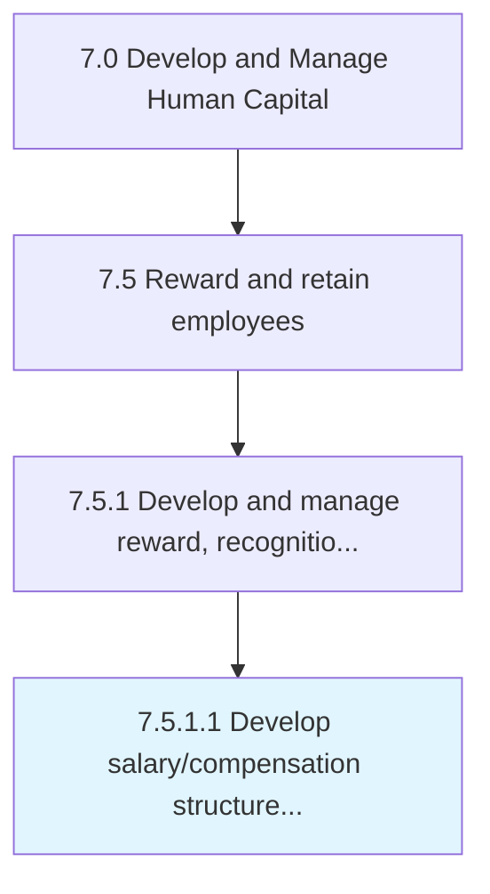

# Develop salary/compensation structure and plan

> Creating the framework for the provision of salary/compensation to employees.

## Overview

Activity 7.5.1.1 is an activity within the Develop and Manage Human Capital framework. 

Creating the framework for the provision of salary/compensation to employees. Break down the salary structure into different components such as fixed pay, variable pay, bonus, and allowances such medical allowance, and rent allowance, etc. Develop, adjust, and maintain a pay structure.

## Process Hierarchy



## Key Statistics

| Metric | Value |
|--------|-------|
| APQC Code | 10498 |
| Hierarchy ID | 7.5.1.1 |
| Level | Activity |
| Parent | [7.5.1](../) |
| Sub-Processes | 0 |


## GraphDL Semantic Structure

```
develop.SalarycompensationStructureAndPlan
```

| Component | Value | Description |
|-----------|-------|-------------|
| Verb | `develop` | Primary action |
| Object | `salary/compensation structure and plan` | Direct object |


## Related Concepts

- SalaryStructure
- CompensationStructure
- Plan


---

*Source: APQC PCF 10498 (7.5.1.1) - APQC*
