# Assess the external environment

> Assessing all forces, entities, and systems that are external to an organization but can affect its operation. Analyze far-reaching currents in the macroeconomic situation, assess the competition, evaluate technological changes, and identify societal as well as ecological issues of concern. Create a big-picture understanding of externalities, with sufficient depth across individual aspects.

## Overview

Assess the external environment (APQC 1.1.1) is a process within the "Define the business concept and long-term vision" process group. While primarily associated with Category 1.0 (Vision and Strategy), this process is also critical for managing external relationships as it provides the environmental intelligence necessary for effective stakeholder engagement.

This comprehensive assessment process examines all external factors that could impact organizational performance, including competitive dynamics, economic conditions, technological developments, regulatory changes, social trends, and environmental considerations. The output informs strategic planning, risk management, and external relationship strategies.

## Process Hierarchy

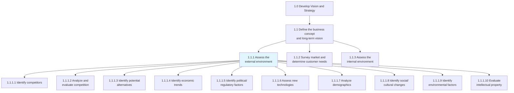

## Key Statistics

| Metric | Value |
|--------|-------|
| APQC Code | 10017 |
| Hierarchy ID | 1.1.1 |
| Level | Process |
| Category | [Develop Vision and Strategy](/processes/01-Strategy) |
| Parent Process | [Define business concept and long-term vision](/processes/01-Strategy/BusinessConcept.mdx) |
| Activities | 10 |

## Process Flow

```mermaid
flowchart LR
    subgraph Inputs["Inputs"]
        I1["Market Intelligence"]
        I2["Economic Data"]
        I3["Industry Reports"]
        I4["Regulatory Updates"]
        I5["Technology Trends"]
        I6["Social Research"]
        I7["Environmental Data"]
    end

    subgraph Process["Assess External Environment"]
        P1["Identify<br/>Competitors"]
        P2["Analyze<br/>Competition"]
        P3["Assess Economic<br/>Trends"]
        P4["Evaluate Regulatory<br/>Environment"]
        P5["Assess Technology<br/>Landscape"]
        P6["Analyze Social/<br/>Demographic Trends"]
        P7["Identify Environmental<br/>Factors"]
        P8["Synthesize<br/>Assessment"]

        P1 --> P2
        P3 --> P8
        P4 --> P8
        P5 --> P8
        P6 --> P8
        P7 --> P8
        P2 --> P8
    end

    subgraph Outputs["Outputs"]
        O1["Competitive Analysis"]
        O2["PESTEL Analysis"]
        O3["Industry Assessment"]
        O4["Technology Roadmap"]
        O5["Risk Assessment"]
        O6["Strategic Implications"]
    end

    Inputs --> Process --> Outputs
```

## GraphDL Semantic Structure

```
assess.ExternalEnvironment
```

| Component | Value | Description |
|-----------|-------|-------------|
| Verb | `assess` | Primary action of evaluating and analyzing |
| Object | `ExternalEnvironment` | All external forces affecting the organization |
| Preposition | - | Not applicable at this level |
| PrepObject | - | Not applicable at this level |

## Activities

### 1.1.1.1 - Identify competitors

Identifying your competitors, their services and/or products, and evaluating competitor strategies to determine their strengths and weaknesses.

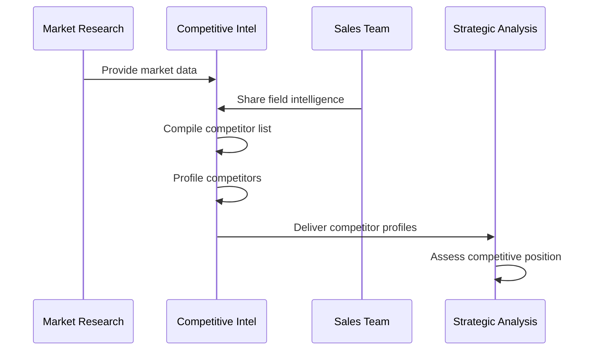

**Tasks:**
- `identify.Competitors` - Discover and catalog market competitors
- `profile.Competitors` - Create detailed competitor profiles
- `assess.CompetitiveStrengths` - Evaluate competitor advantages
- `assess.CompetitiveWeaknesses` - Identify competitor vulnerabilities

### 1.1.1.2 - Analyze and evaluate competition

Systematically analyzing competitive forces and market dynamics to understand the competitive landscape.

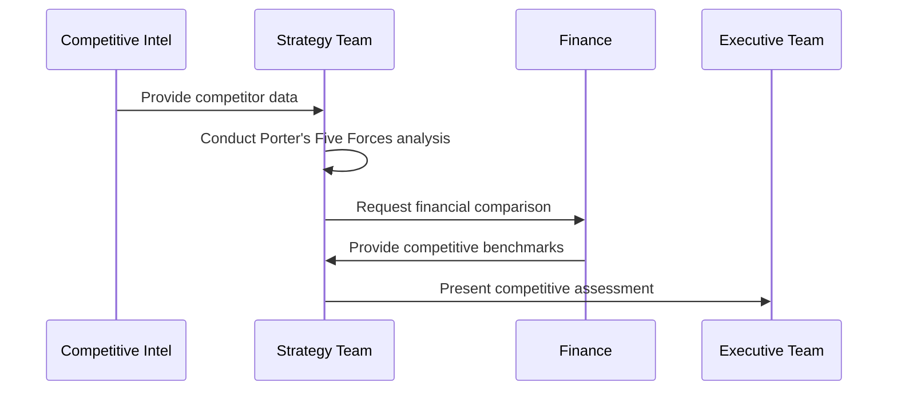

**Tasks:**
- `analyze.CompetitiveForces` - Apply competitive analysis frameworks
- `evaluate.MarketPosition` - Assess relative market standing
- `benchmark.Performance` - Compare against competitor metrics
- `forecast.CompetitiveMoves` - Anticipate competitor actions

### 1.1.1.4 - Identify economic trends

Determining macroeconomic shifts relevant to the organization and its industry.

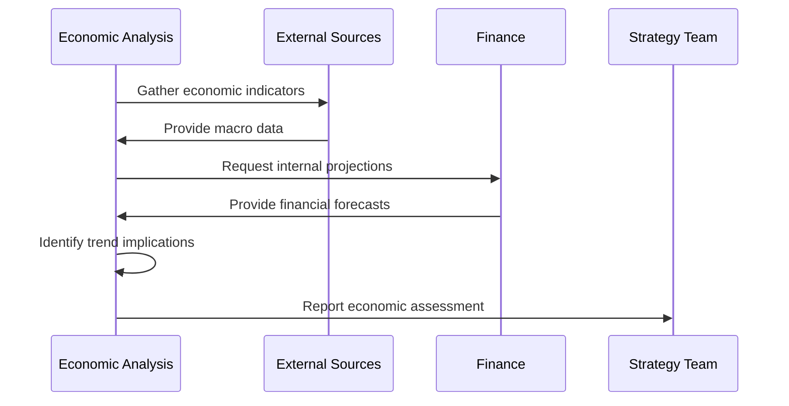

**Tasks:**
- `monitor.EconomicIndicators` - Track key economic metrics
- `analyze.EconomicTrends` - Identify relevant economic patterns
- `assess.EconomicImpact` - Evaluate effects on organization
- `forecast.EconomicConditions` - Project future economic environment

### 1.1.1.5 - Identify political and regulatory factors

Assessing the regulatory and policy environment that affects organizational operations.

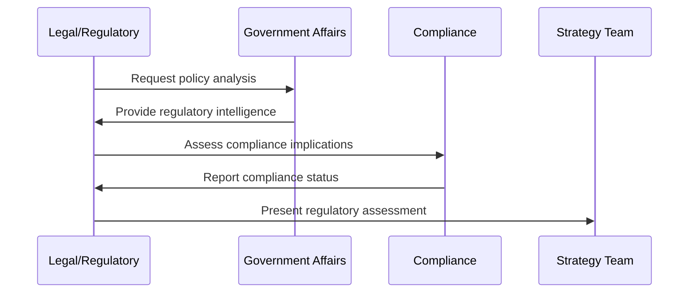

**Tasks:**
- `monitor.RegulatoryChanges` - Track regulatory developments
- `assess.PolicyImpact` - Evaluate policy effects on operations
- `identify.ComplianceRisks` - Determine regulatory risk exposure
- `forecast.RegulatoryTrends` - Anticipate future regulations

### 1.1.1.6 - Assess new technologies

Evaluating technological developments and disruptions that could affect the organization.

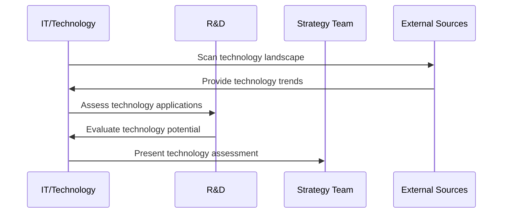

**Tasks:**
- `scan.TechnologyLandscape` - Monitor technology developments
- `evaluate.EmergingTechnologies` - Assess new technology relevance
- `assess.DisruptionRisk` - Identify technology disruption threats
- `identify.TechnologyOpportunities` - Find technology-enabled opportunities

### 1.1.1.7 - Analyze demographics

Examining population characteristics and trends that affect markets and operations.

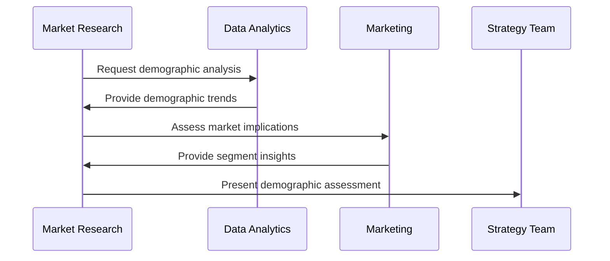

**Tasks:**
- `analyze.PopulationTrends` - Study population dynamics
- `assess.WorkforceDemographics` - Evaluate labor market trends
- `evaluate.CustomerDemographics` - Analyze customer population changes
- `forecast.DemographicShifts` - Project future demographic patterns

### 1.1.1.8 - Identify social and cultural changes

Distinguishing cultural and societal shifts that could impact the organization.

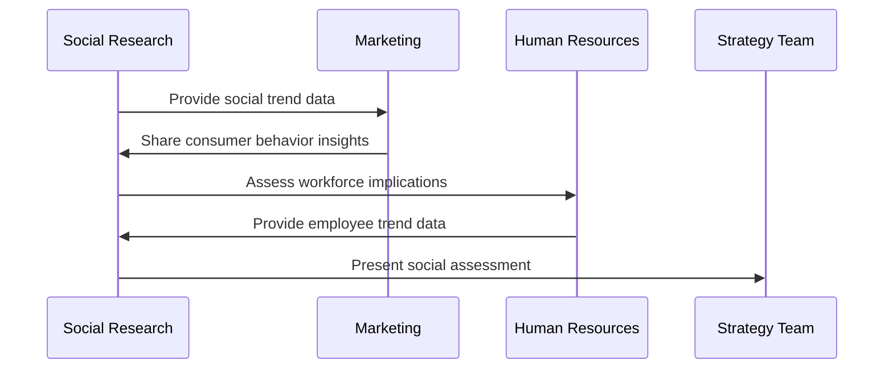

**Tasks:**
- `monitor.SocialTrends` - Track societal changes
- `analyze.CulturalShifts` - Assess cultural pattern changes
- `evaluate.ConsumerBehavior` - Study changing preferences
- `assess.SocialImpact` - Determine organizational implications

### 1.1.1.9 - Identify environmental factors

Assessing ecological and environmental considerations that affect operations.

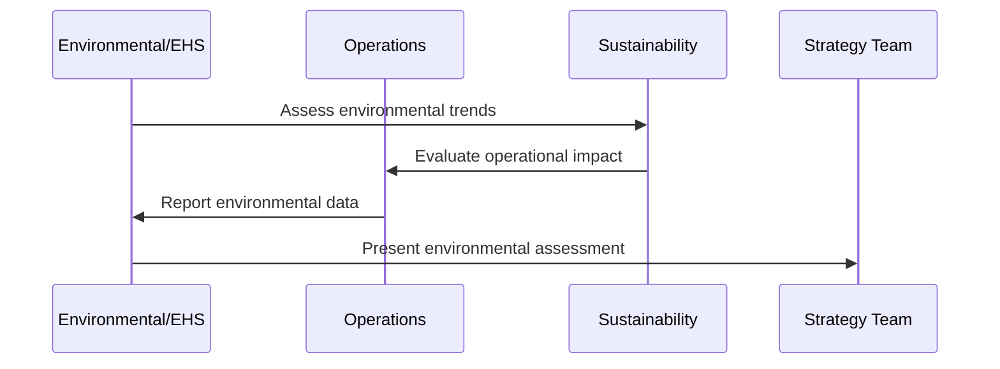

**Tasks:**
- `assess.EnvironmentalRegulations` - Evaluate environmental compliance
- `evaluate.ClimateRisks` - Analyze climate change implications
- `identify.SustainabilityOpportunities` - Find sustainability initiatives
- `monitor.EnvironmentalTrends` - Track ecological developments

## RACI Matrix

| Activity | Responsible | Accountable | Consulted | Informed |
|----------|-------------|-------------|-----------|----------|
| Identify competitors | Competitive Intelligence | Chief Strategy Officer | Marketing, Sales | Executive Team |
| Analyze competition | Strategy Team | CSO | Business Units | Board |
| Identify economic trends | Economic Analysis | CFO | Strategy | Executive Team |
| Identify regulatory factors | Legal/Regulatory | General Counsel | Compliance | All Departments |
| Assess technologies | IT/R&D | CTO | Strategy | Executive Team |
| Analyze demographics | Market Research | CMO | HR | Strategy Team |
| Identify social changes | Market Research | CMO | HR, Strategy | Executive Team |
| Identify environmental factors | Sustainability | COO | Operations, EHS | Executive Team |

## Related Departments

- [Strategy & Planning](/departments/Strategy/index) - Primary ownership of environmental assessment
- [Marketing](/departments/Marketing/index) - Market and customer intelligence
- [Legal](/departments/Legal/index) - Regulatory analysis
- [IT](/departments/Technology) - Technology assessment
- Sustainability - Environmental factors
- Government Affairs - Political analysis

## Related Occupations

- [Market Research Analysts](/occupations/MarketResearchAnalysts) - Market intelligence gathering
- [Management Analysts](/occupations/Business/Operations/ManagementAnalysts) - Strategic analysis
- [Economists](/occupations/Science/Economists) - Economic trend analysis
- [Compliance Officers](/occupations/Business/Operations/ComplianceOfficers) - Regulatory assessment
- [Environmental Scientists](/occupations/EnvironmentalScientists) - Environmental analysis

## Industry Variations

### Aerospace and Defense

Environmental assessment in aerospace emphasizes defense budget analysis, geopolitical factors, technology export controls, and long-term government procurement trends.

**Industry-Specific Activities:**
- Analyze defense budget allocations
- Assess geopolitical risks and opportunities
- Monitor export control regulations
- Evaluate technology readiness levels

### Banking

Banking institutions focus on regulatory environment changes, interest rate trends, fintech disruption, and changing customer expectations for digital services.

**Industry-Specific Activities:**
- Monitor central bank policy changes
- Assess fintech competitive threats
- Evaluate regulatory capital requirements
- Analyze digital banking trends

### Automotive

Automotive companies assess electrification trends, autonomous technology developments, emissions regulations, and changing mobility preferences.

**Industry-Specific Activities:**
- Assess electric vehicle adoption trends
- Monitor autonomous driving regulations
- Analyze emissions compliance requirements
- Evaluate mobility-as-a-service trends

### Healthcare Provider

Healthcare organizations evaluate healthcare policy changes, reimbursement trends, population health patterns, and technology adoption in care delivery.

**Industry-Specific Activities:**
- Monitor healthcare policy developments
- Assess payer landscape changes
- Evaluate telehealth adoption trends
- Analyze population health patterns

### Retail

Retailers assess consumer behavior shifts, e-commerce trends, supply chain disruptions, and sustainability expectations.

**Industry-Specific Activities:**
- Monitor omnichannel shopping trends
- Assess supply chain resilience
- Evaluate sustainability requirements
- Analyze consumer preference changes

### City Government

City governments assess demographic shifts, economic development competition, infrastructure needs, and regulatory mandates.

**Industry-Specific Activities:**
- Analyze regional demographic trends
- Assess economic development competition
- Monitor state and federal mandates
- Evaluate infrastructure requirements

## Sub-Processes

| Process | Code | Description |
|---------|------|-------------|
| [Identify competitors](./Competitors.mdx) | 1.1.1.1 | Discover and catalog market competitors |
| [Analyze and evaluate competition](./CompetitiveAnalysis.mdx) | 1.1.1.2 | Assess competitive landscape |
| [Identify potential alternatives](./Alternatives.mdx) | 1.1.1.3 | Find substitute products/services |
| Identify economic trends | 1.1.1.4 | Analyze macroeconomic conditions |
| Identify political/regulatory factors | 1.1.1.5 | Assess regulatory environment |
| Assess new technologies | 1.1.1.6 | Evaluate technology developments |
| Analyze demographics | 1.1.1.7 | Study population characteristics |
| Identify social/cultural changes | 1.1.1.8 | Assess societal trends |
| Identify environmental factors | 1.1.1.9 | Evaluate ecological considerations |
| Evaluate intellectual property | 1.1.1.10 | Assess IP landscape |

## Related Processes

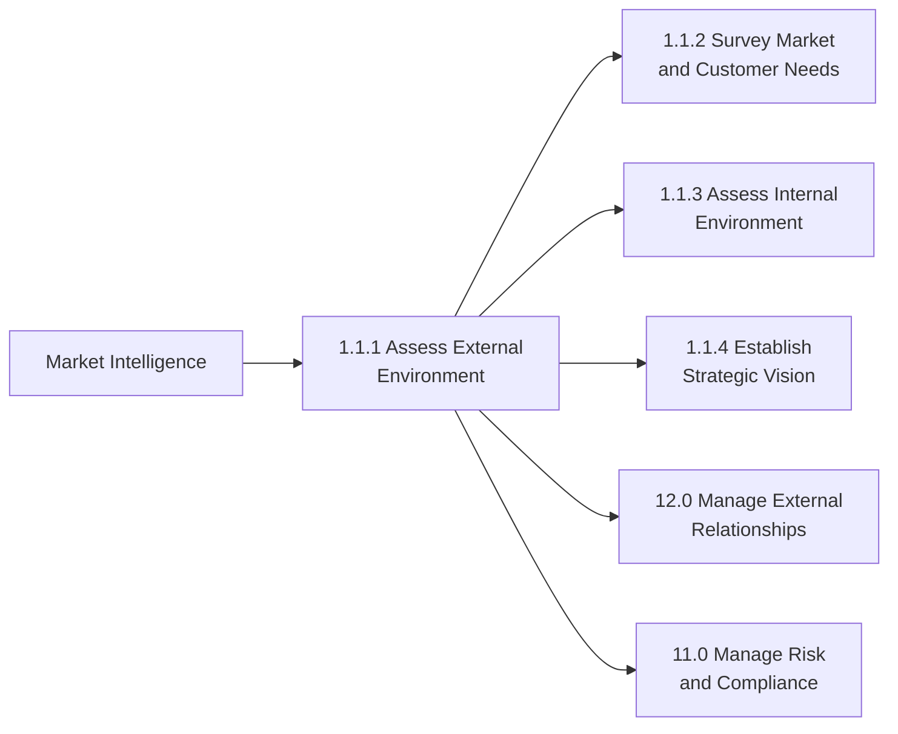

## Metrics & KPIs

| Metric | Description | Target |
|--------|-------------|--------|
| Environmental Coverage | Completeness of PESTEL analysis | >95% |
| Intelligence Currency | Freshness of environmental data | <30 days |
| Competitive Intelligence Accuracy | Accuracy of competitor assessments | >85% |
| Trend Identification Rate | Early identification of emerging trends | >80% |
| Assessment Utilization | Use of assessment in strategic decisions | >90% |
| Stakeholder Satisfaction | Satisfaction with environmental intelligence | >85% |

---

*Source: APQC PCF 10017 (1.1.1) - Cross-Industry*
