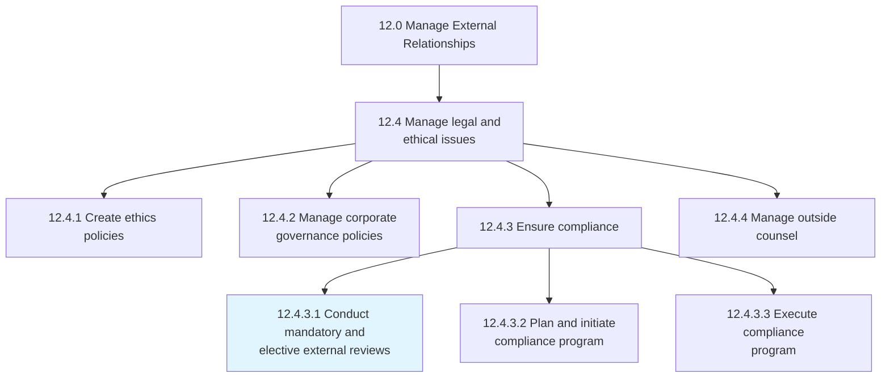
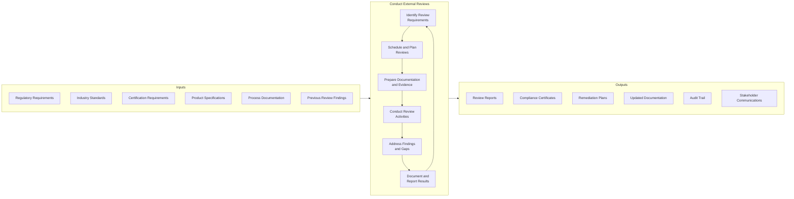
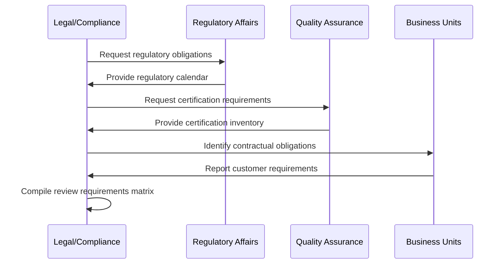
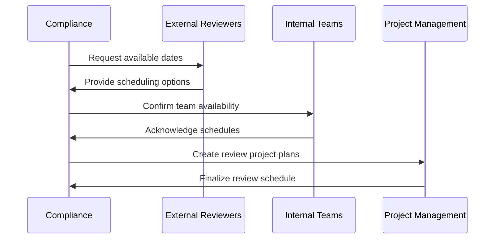
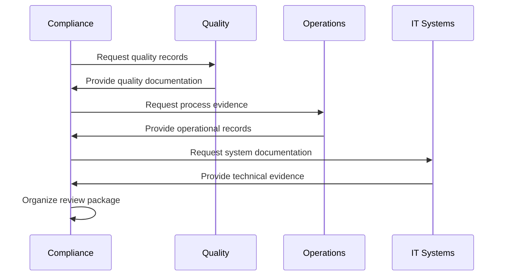
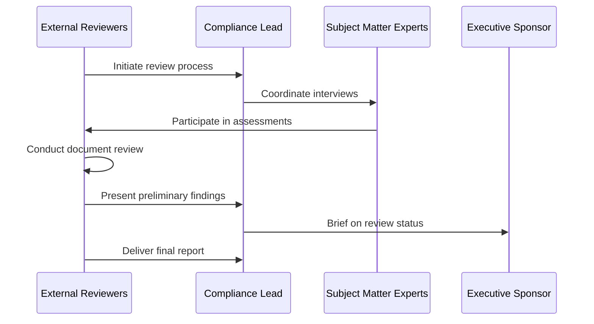
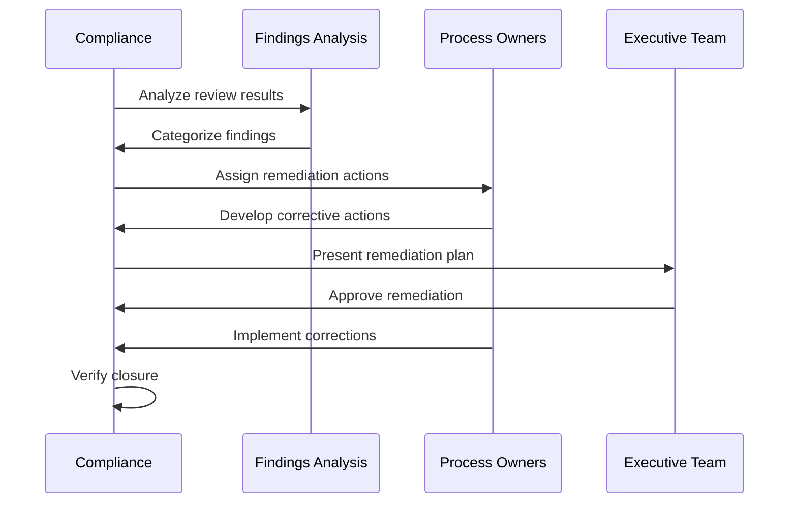
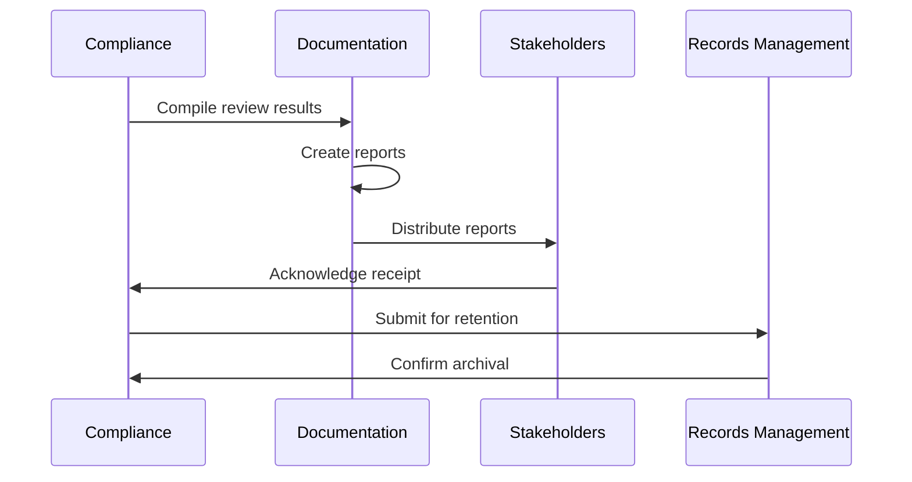
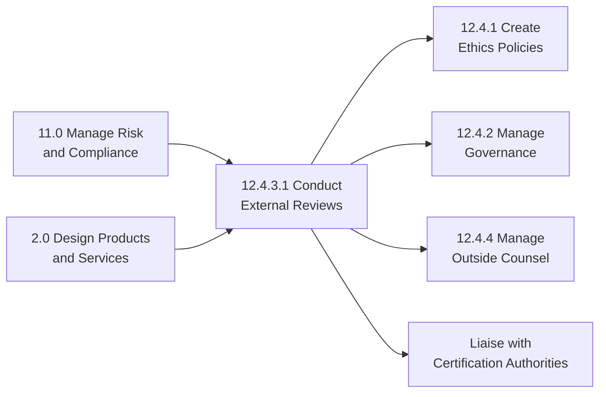

# Conduct mandatory and elective external reviews

> Conducting any mandatory and elective appraisals of the product/service design specifications in order to ensure compliance with external standards. Carry out external reviews of specifications created as part of designing products and services that are required by legal, regulatory, or industry bodies.

## Overview

Conduct mandatory and elective external reviews (APQC 12.4.3.1) is an activity within the "Ensure compliance" process. This process ensures that organizational products, services, and operations meet required external standards through systematic review and validation. It encompasses both legally mandated reviews (regulatory audits, safety certifications) and voluntary reviews (industry certifications, best practice assessments).

External reviews serve multiple purposes: ensuring regulatory compliance, validating quality standards, maintaining certifications, and demonstrating commitment to industry best practices. The process requires coordination with external auditors, regulatory bodies, certification agencies, and internal compliance teams.

## Process Hierarchy



## Key Statistics

| Metric | Value |
|--------|-------|
| APQC Code | 10087 |
| Hierarchy ID | 12.4.3.1 |
| Level | Activity |
| Category | [Manage External Relationships](/processes/12-External) |
| Parent Process | [Ensure compliance](./index.mdx) |

## Process Flow



## GraphDL Semantic Structure

```
conduct.ExternalReviews.for.Compliance
```

| Component | Value | Description |
|-----------|-------|-------------|
| Verb | `conduct` | Primary action of executing reviews |
| Object | `ExternalReviews` | Mandatory and elective assessments |
| Preposition | `for` | Purpose of the review |
| PrepObject | `Compliance` | Ensuring adherence to standards |

## Activities

### Identify review requirements

Determining which external reviews are mandatory based on regulations, contracts, and industry requirements, and which elective reviews provide strategic value.



**Tasks:**
- `identify.MandatoryReviews` - Catalog legally required reviews
- `identify.ElectiveReviews` - Determine strategic certification opportunities
- `assess.ReviewRequirements` - Document specific requirements for each review
- `prioritize.Reviews` - Rank reviews by criticality and timing

### Schedule and plan reviews

Creating a comprehensive review calendar and detailed plans for each review engagement.



**Tasks:**
- `create.ReviewCalendar` - Develop annual review schedule
- `coordinate.ExternalSchedules` - Align with reviewer availability
- `develop.ReviewPlans` - Create detailed execution plans
- `assign.Resources` - Allocate internal support resources

### Prepare documentation and evidence

Assembling all required documentation, evidence, and supporting materials for review activities.



**Tasks:**
- `gather.RequiredDocumentation` - Collect all necessary documents
- `prepare.EvidencePackages` - Organize supporting evidence
- `validate.Documentation` - Ensure completeness and accuracy
- `create.ReviewReadiness` - Prepare presentation materials

### Conduct review activities

Executing the review process including site visits, document reviews, interviews, and assessments.



**Tasks:**
- `facilitate.SiteVisits` - Manage on-site review activities
- `support.DocumentReviews` - Assist with documentation analysis
- `coordinate.Interviews` - Arrange subject matter expert sessions
- `track.ReviewProgress` - Monitor review completion status

### Address findings and gaps

Developing and implementing remediation plans for any identified deficiencies or non-conformances.



**Tasks:**
- `analyze.Findings` - Review and categorize identified issues
- `develop.RemediationPlans` - Create corrective action plans
- `implement.CorrectiveActions` - Execute remediation activities
- `verify.ClosureEffectiveness` - Confirm issues resolved

### Document and report results

Creating comprehensive documentation of review activities, results, and outcomes for stakeholders.



**Tasks:**
- `compile.ReviewResults` - Aggregate all review outcomes
- `create.StakeholderReports` - Prepare audience-specific summaries
- `communicate.Results` - Distribute to relevant parties
- `archive.Documentation` - Maintain records per retention policy

## RACI Matrix

| Activity | Responsible | Accountable | Consulted | Informed |
|----------|-------------|-------------|-----------|----------|
| Identify review requirements | Compliance Team | Chief Compliance Officer | Legal, Quality | Executive Team |
| Schedule and plan reviews | Compliance Coordinator | Compliance Director | External Reviewers | Business Units |
| Prepare documentation | Quality Team | Quality Director | Operations, IT | Compliance |
| Conduct review activities | Compliance Team | CCO | SMEs | Executive Team |
| Address findings | Process Owners | COO | Compliance, Quality | Board |
| Document and report | Compliance Analyst | CCO | Legal | All Stakeholders |

## Related Departments

- Compliance - Primary ownership of review coordination
- [Quality Assurance](/departments/Quality) - Quality standards and documentation
- [Legal](/departments/Legal/index) - Regulatory interpretation and obligations
- [Operations](/departments/Operations/index) - Process evidence and participation
- [Internal Audit](/departments/Finance) - Review preparation support

## Related Occupations

- [Compliance Officers](/occupations/Business/Operations/ComplianceOfficers) - Review coordination and oversight
- [Quality Assurance Managers](/occupations/QualityManagers) - Standards maintenance
- [Regulatory Affairs Specialists](/occupations/RegulatoryAffairs) - Regulatory review management
- [Internal Auditors](/occupations/InternalAuditors) - Pre-review assessments
- [Risk Managers](/occupations/RiskManagers) - Findings prioritization

## Industry Variations

### Aerospace and Defense

Aerospace companies undergo extensive external reviews including FAA/EASA certification, defense contract audits (DCAA/DCMA), and security clearance reviews requiring specialized compliance expertise.

**Industry-Specific Activities:**
- Conduct FAA design certification reviews
- Support DCAA contract audits
- Manage AS9100 quality system audits
- Execute ITAR compliance reviews

### Banking

Banking institutions face continuous regulatory examinations from multiple agencies (OCC, FDIC, Fed) requiring dedicated compliance infrastructure and ongoing audit readiness.

**Industry-Specific Activities:**
- Support OCC/FDIC safety and soundness exams
- Conduct BSA/AML compliance reviews
- Execute SOX control audits
- Manage stress test reviews

### Healthcare Provider

Healthcare organizations undergo multiple external reviews including CMS surveys, Joint Commission accreditation, and state licensing inspections requiring clinical and administrative coordination.

**Industry-Specific Activities:**
- Support Joint Commission accreditation surveys
- Conduct CMS Conditions of Participation reviews
- Execute HIPAA compliance audits
- Manage state licensing inspections

### Life Sciences

Pharmaceutical and medical device companies face rigorous FDA inspections and international regulatory audits requiring extensive documentation and controlled processes.

**Industry-Specific Activities:**
- Support FDA pre-approval inspections
- Conduct GMP compliance audits
- Execute clinical trial audits
- Manage international regulatory reviews

### Utilities

Utility companies undergo safety and reliability reviews from FERC, NERC, and state commissions requiring operational and infrastructure compliance.

**Industry-Specific Activities:**
- Support NERC reliability audits
- Conduct FERC compliance reviews
- Execute state PUC examinations
- Manage nuclear regulatory inspections

### Retail

Retailers face PCI-DSS audits, food safety inspections, and consumer protection reviews requiring store-level compliance coordination.

**Industry-Specific Activities:**
- Conduct PCI-DSS compliance assessments
- Support FDA food safety inspections
- Execute OSHA workplace safety reviews
- Manage consumer protection audits

## Sub-Processes

| Process | Code | Description |
|---------|------|-------------|
| Identify review requirements | - | Determine mandatory and elective reviews |
| Schedule and plan reviews | - | Create review calendar and plans |
| Prepare documentation | - | Assemble review evidence |
| Conduct review activities | - | Execute review engagements |
| Address findings | - | Remediate identified issues |
| Document and report | - | Create review documentation |

## Related Processes



## Metrics & KPIs

| Metric | Description | Target |
|--------|-------------|--------|
| Review Readiness Score | Preparation completeness before review | >95% |
| Finding Closure Rate | Percentage of findings remediated on time | >90% |
| Critical Finding Count | Number of major non-conformances | 0 |
| Certification Maintenance | Certifications maintained without lapse | 100% |
| Review Cycle Time | Average duration of review process | <30 days |
| Remediation Time | Average days to close findings | <60 days |

---

*Source: APQC PCF 10087 (12.4.3.1) - Cross-Industry*
