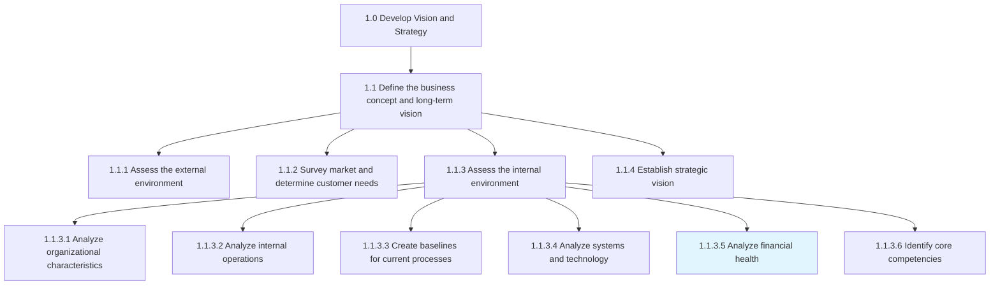
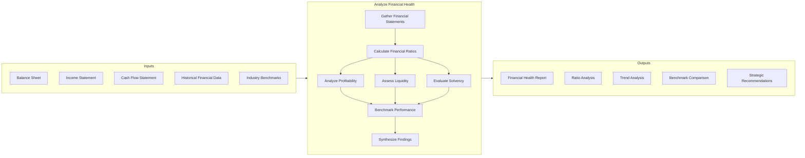
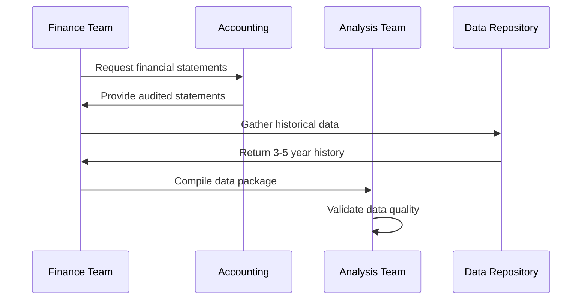
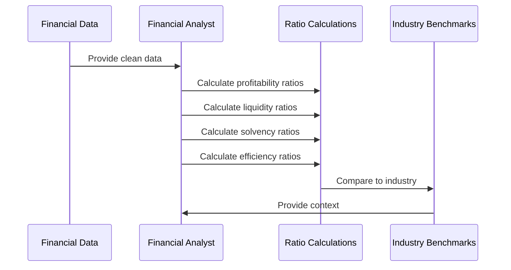
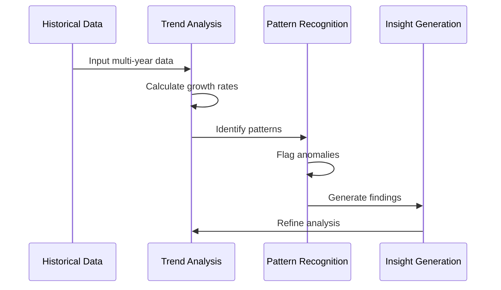
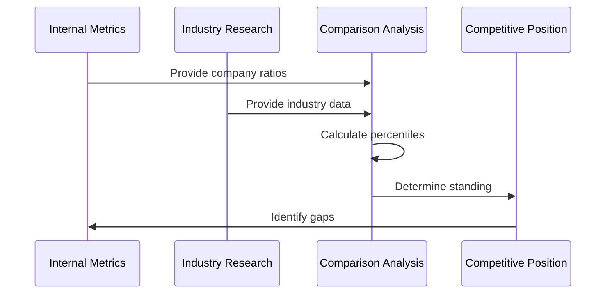
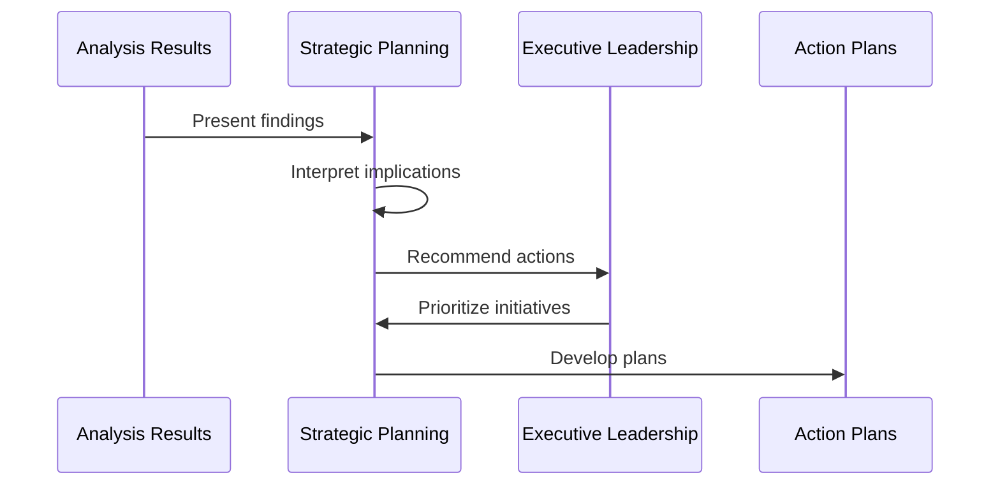
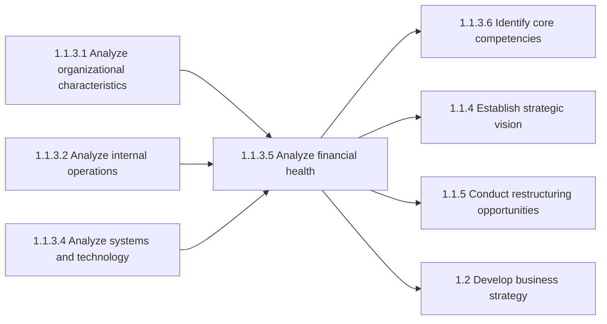

# Analyze financial health

> Appraising the financial state of the organization so that management can create resource allocation strategies. Scrutinize the organization's financials--including balance sheets, statements of income, cash-flows, equity holdings, and liquidity--with the objective of understanding the organization's financial health and capacities. This analysis directly feeds into Conduct organizational restructuring opportunities and Define a business concept and long-term vision.

## Overview

Analyze financial health is a critical activity within the Assess the Internal Environment process (1.1.3), which is part of defining the business concept and long-term vision. This process provides management with a comprehensive understanding of the organization's current financial position, enabling informed strategic decisions about resource allocation, investment priorities, and organizational restructuring.

Financial health analysis examines the organization across multiple dimensions: profitability, liquidity, solvency, and operational efficiency. The insights generated from this process are essential inputs to strategic planning, capital budgeting, and organizational design decisions.

## Process Hierarchy



## Key Statistics

| Metric | Value |
|--------|-------|
| APQC Code | 10033 |
| Hierarchy ID | 1.1.3.5 |
| Level | Activity |
| Parent Process | [Assess the internal environment](/processes/01-Strategy/AssessTheInternalEnvironment) |
| Category | [Develop Vision and Strategy](/processes/01-Strategy) |
| Related Categories | 9.0 Manage Financial Resources |

## Process Flow



## GraphDL Semantic Structure

```
analyze.FinancialHealth
```

| Component | Value | Description |
|-----------|-------|-------------|
| Verb | `analyze` | Primary action of examining and evaluating |
| Object | `FinancialHealth` | The financial state and position of the organization |
| Preposition | - | Not applicable for this activity |
| PrepObject | - | Not applicable for this activity |

## Activities

### Gather and Review Financial Statements

Collecting all relevant financial documents including audited financial statements, management reports, and supporting schedules for comprehensive analysis.



**Tasks:**
- `gather.FinancialStatements` - Collect balance sheet, income statement, cash flow
- `compile.HistoricalData` - Assemble multi-year financial history
- `validate.DataQuality` - Ensure accuracy and completeness
- `organize.AnalysisPackage` - Structure data for analysis

### Perform Ratio Analysis

Calculating key financial ratios across profitability, liquidity, solvency, and efficiency dimensions to quantify financial performance.



**Tasks:**
- `calculate.ProfitabilityRatios` - ROA, ROE, profit margins
- `calculate.LiquidityRatios` - Current ratio, quick ratio, cash ratio
- `calculate.SolvencyRatios` - Debt-to-equity, interest coverage
- `calculate.EfficiencyRatios` - Asset turnover, inventory turnover

### Analyze Trends and Patterns

Examining financial performance over time to identify trends, patterns, and areas of concern or opportunity.



**Tasks:**
- `analyze.RevenueTrends` - Track revenue growth patterns
- `analyze.CostTrends` - Monitor cost structure changes
- `analyze.MarginTrends` - Evaluate margin compression/expansion
- `identify.Anomalies` - Flag unusual patterns

### Benchmark Against Industry

Comparing the organization's financial performance against industry peers and best-in-class performers.



**Tasks:**
- `gather.IndustryBenchmarks` - Collect peer financial data
- `compare.Performance` - Match metrics against peers
- `identify.Gaps` - Find areas of underperformance
- `identify.Strengths` - Recognize competitive advantages

### Synthesize Strategic Recommendations

Translating financial analysis findings into actionable strategic recommendations for management.



**Tasks:**
- `synthesize.Findings` - Consolidate analysis results
- `develop.Recommendations` - Create strategic options
- `prioritize.Actions` - Rank by impact and feasibility
- `present.Analysis` - Communicate to stakeholders

## RACI Matrix

| Activity | Responsible | Accountable | Consulted | Informed |
|----------|-------------|-------------|-----------|----------|
| Gather financial statements | Accounting | Controller | Finance | Strategy team |
| Perform ratio analysis | Financial Analyst | CFO | Accounting | Executive team |
| Analyze trends | FP&A Team | CFO | Business units | Board |
| Benchmark against industry | Strategy Team | CFO | External advisors | Management |
| Synthesize recommendations | Strategy Team | CEO | CFO, COO | Board |

## Related Departments

- [Finance](/departments/Finance/index) - Primary ownership of financial analysis
- [Accounting](/departments/Accounting) - Source of financial data
- [Strategy](/departments/Strategy/index) - Consumer of strategic insights
- [Treasury](/departments/Treasury) - Liquidity and capital structure input
- [Executive Office](/departments/Executive/index) - Decision-making authority

## Related Occupations

- [Financial Analysts](/occupations/Business/Financial/FinancialAnalysts) - Primary analysis execution
- [Chief Financial Officers](/occupations/CFO) - Accountability for financial health
- [Management Analysts](/occupations/Business/Operations/ManagementAnalysts) - Strategic interpretation
- [Accountants](/occupations/Accountants) - Financial data preparation
- [Budget Analysts](/occupations/Business/Financial/BudgetAnalysts) - Budgetary implications

## Industry Variations

### Aerospace and Defense

Financial health analysis in aerospace focuses on long-term program profitability, backlog valuation, and government contract compliance. Working capital management is critical due to long production cycles.

**Industry-Specific Metrics:**
- Backlog-to-revenue ratio
- Program profitability by contract type
- R&D investment as percentage of revenue
- Government vs. commercial revenue mix

### Banking

Banking financial health analysis emphasizes regulatory capital adequacy, asset quality, and net interest margin. Stress testing and scenario analysis are regulatory requirements.

**Industry-Specific Metrics:**
- Capital adequacy ratios (CET1, Tier 1)
- Non-performing loan ratios
- Net interest margin
- Return on risk-weighted assets

### Healthcare Provider

Healthcare financial health analysis focuses on payer mix, revenue cycle metrics, and service line profitability. Days in accounts receivable is a critical metric.

**Industry-Specific Metrics:**
- Days in accounts receivable
- Payer mix analysis
- Cost per adjusted discharge
- Operating margin by service line

### Retail

Retail financial analysis emphasizes same-store sales growth, inventory turns, and gross margin return on inventory investment. Seasonal working capital patterns are important.

**Industry-Specific Metrics:**
- Same-store sales growth
- Inventory turnover
- Gross margin return on investment (GMROI)
- Sales per square foot

## Financial Health Metrics Framework

### Profitability Ratios

| Ratio | Formula | Healthy Range | Description |
|-------|---------|---------------|-------------|
| Gross Margin | (Revenue - COGS) / Revenue | >30% | Core profitability |
| Operating Margin | Operating Income / Revenue | >10% | Operational efficiency |
| Net Margin | Net Income / Revenue | >5% | Bottom line profitability |
| ROA | Net Income / Total Assets | >5% | Asset utilization |
| ROE | Net Income / Shareholders Equity | >12% | Shareholder returns |

### Liquidity Ratios

| Ratio | Formula | Healthy Range | Description |
|-------|---------|---------------|-------------|
| Current Ratio | Current Assets / Current Liabilities | 1.5-2.0 | Short-term solvency |
| Quick Ratio | (Current Assets - Inventory) / Current Liabilities | >1.0 | Immediate liquidity |
| Cash Ratio | Cash / Current Liabilities | >0.2 | Cash position strength |

### Solvency Ratios

| Ratio | Formula | Healthy Range | Description |
|-------|---------|---------------|-------------|
| Debt-to-Equity | Total Debt / Total Equity | <1.5 | Leverage level |
| Interest Coverage | EBIT / Interest Expense | >3.0 | Debt service capacity |
| Debt-to-EBITDA | Total Debt / EBITDA | <3.0 | Debt burden |

## Related Processes



## Sub-Activities

| Activity | Description |
|----------|-------------|
| Review balance sheet | Analyze assets, liabilities, and equity positions |
| Analyze income statement | Evaluate revenue streams and cost structures |
| Examine cash flows | Assess operating, investing, and financing cash flows |
| Calculate financial ratios | Compute profitability, liquidity, and solvency metrics |
| Perform trend analysis | Identify patterns over multiple periods |
| Benchmark performance | Compare to industry peers and best practices |
| Assess capital structure | Evaluate debt-equity mix and cost of capital |
| Evaluate working capital | Analyze receivables, inventory, and payables cycles |

## Metrics & KPIs

| Metric | Description | Target |
|--------|-------------|--------|
| Analysis Cycle Time | Time to complete financial health assessment | <2 weeks |
| Data Accuracy | Percentage of data points verified | 100% |
| Benchmark Coverage | Percentage of metrics benchmarked | >80% |
| Recommendation Adoption | Percentage of recommendations implemented | >60% |
| Forecast Accuracy | Variance of predictions to actual results | <10% |

---

*Source: APQC PCF 10033 (1.1.3.5) - Cross-Industry*
