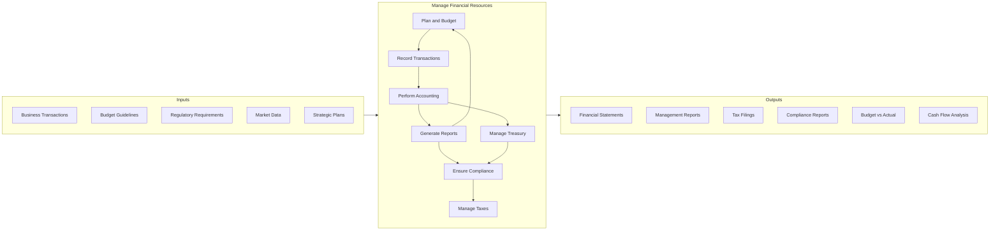
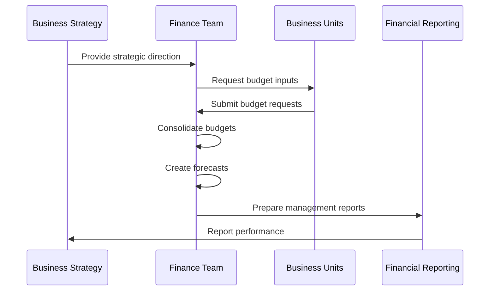
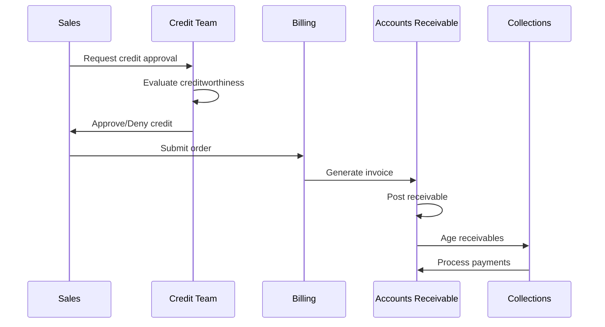
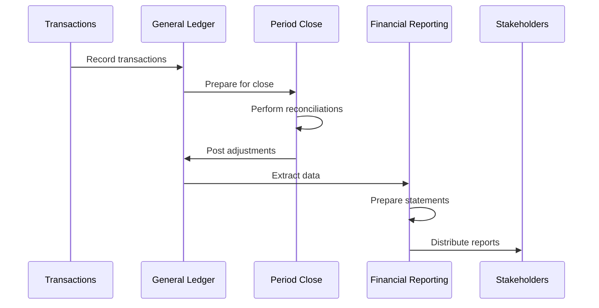
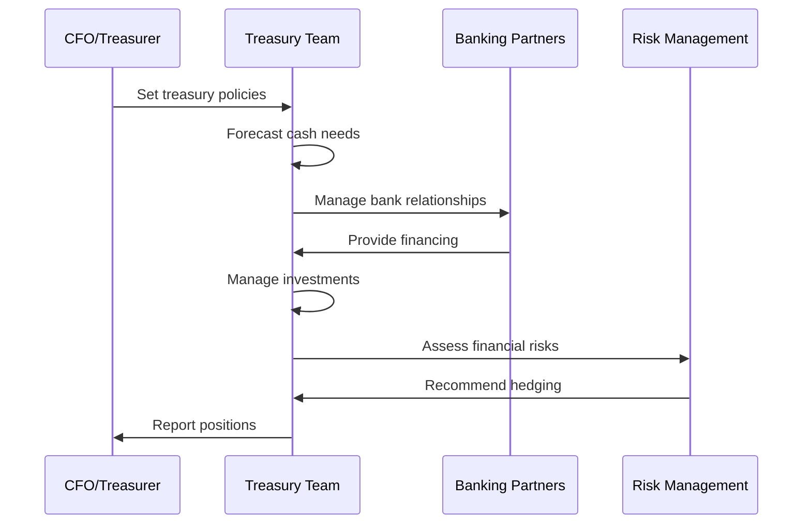
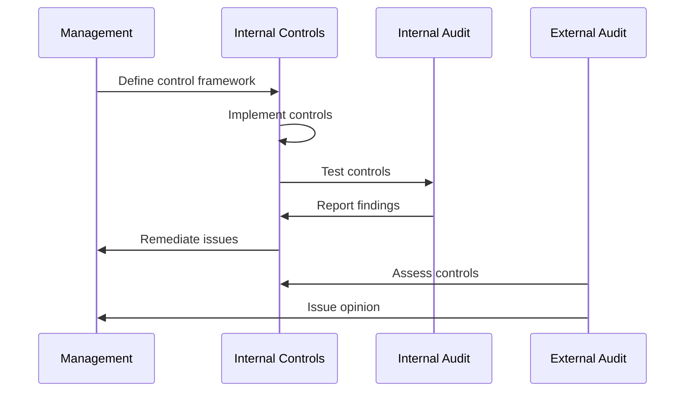
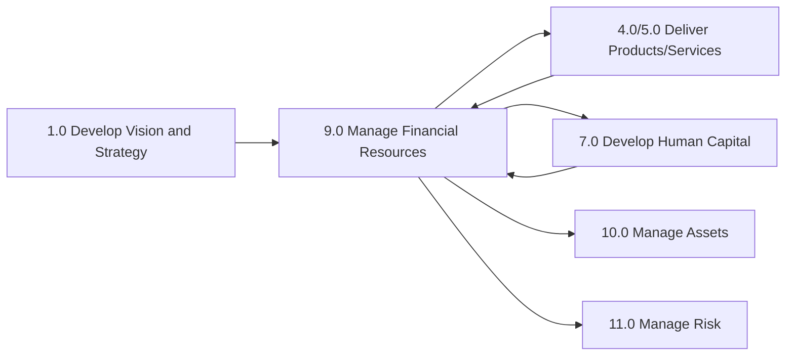

# Manage Financial Resources

> Overseeing key back-office processes for organizations. This category includes process groups related to planning and management accounting, revenue accounting, general accounting and reporting, fixed-asset project accounting, payroll, accounts payable and expense reimbursements, treasury operations, internal controls, tax management, international funds/consolidation, and global trade services.

## Overview

Manage Financial Resources is APQC Process Classification Framework category 9.0, encompassing all financial management and accounting activities within an organization. This category represents the essential back-office functions that ensure financial health, regulatory compliance, and informed decision-making.

Financial resource management has evolved from basic bookkeeping to a strategic function that provides insights for business decisions, manages risk, ensures compliance, and optimizes capital allocation. These processes support all other organizational functions by providing the financial infrastructure and intelligence necessary for operations.

## Process Hierarchy

```mermaid
graph TD
    C9["9.0 Manage Financial Resources"] --> G91["9.1 Perform planning and management accounting"]
    C9 --> G92["9.2 Perform revenue accounting"]
    C9 --> G93["9.3 Perform general accounting and reporting"]
    C9 --> G94["9.4 Manage fixed-asset project accounting"]
    C9 --> G95["9.5 Process payroll"]
    C9 --> G96["9.6 Process accounts payable and expense reimbursements"]
    C9 --> G97["9.7 Manage treasury operations"]
    C9 --> G98["9.8 Manage internal controls"]
    C9 --> G99["9.9 Manage taxes"]
    C9 --> G910["9.10 Manage international funds/consolidation"]

    G91 --> P911["9.1.1 Perform planning/budgeting/forecasting"]
    G91 --> P912["9.1.2 Perform cost accounting"]
    G91 --> P913["9.1.3 Perform cost management"]
    G91 --> P914["9.1.4 Evaluate and manage financial performance"]

    G92 --> P921["9.2.1 Process customer credit"]
    G92 --> P922["9.2.2 Invoice customer"]
    G92 --> P923["9.2.3 Process accounts receivable"]
    G92 --> P924["9.2.4 Manage and process collections"]
    G92 --> P925["9.2.5 Manage and process adjustments"]

    G93 --> P931["9.3.1 Manage policies and procedures"]
    G93 --> P932["9.3.2 Perform general accounting"]
    G93 --> P933["9.3.3 Perform fixed-asset accounting"]
    G93 --> P934["9.3.4 Perform financial reporting"]
```



## Key Statistics

| Metric | Value |
|--------|-------|
| APQC Code | 17058 |
| Hierarchy ID | 9.0 |
| Level | Category |
| Category | [Manage Financial Resources](/processes/09-Finance) |
| Process Groups | 10 |
| Total Sub-Processes | 200+ |

## Process Flow



## GraphDL Semantic Structure

```
manage.FinancialResources
```

| Component | Value | Description |
|-----------|-------|-------------|
| Verb | `manage` | Primary action of overseeing and controlling |
| Object | `FinancialResources` | Money, assets, and financial activities |
| Preposition | - | Not applicable at category level |
| PrepObject | - | Not applicable at category level |

## Activities

### 9.1 - Perform planning and management accounting

Conducting budgeting, forecasting, cost accounting, and financial performance management to support business decision-making.



**Tasks:**
- `develop.AnnualBudgets` - Create annual operating and capital budgets
- `prepare.FinancialForecasts` - Project financial performance
- `perform.VarianceAnalysis` - Compare actual to budgeted performance
- `perform.CostAccounting` - Track and allocate costs

### 9.2 - Perform revenue accounting

Managing the complete revenue cycle from customer credit to collections, including invoicing and accounts receivable management.



**Tasks:**
- `process.CustomerCredit` - Evaluate and approve customer credit
- `invoice.Customers` - Generate and send invoices
- `process.AccountsReceivable` - Manage receivables
- `manage.Collections` - Collect outstanding amounts

### 9.3 - Perform general accounting and reporting

Maintaining the general ledger, performing period-end close, and preparing financial statements and reports.



**Tasks:**
- `manage.GeneralLedger` - Maintain chart of accounts and ledger
- `perform.PeriodEndClose` - Execute monthly/quarterly/annual close
- `prepare.FinancialStatements` - Create GAAP/IFRS compliant statements
- `perform.Reconciliations` - Reconcile accounts

### 9.7 - Manage treasury operations

Managing cash, investments, debt, and financial risk to optimize the organization's financial position.



**Tasks:**
- `manage.CashPosition` - Monitor and optimize cash
- `manage.DebtPortfolio` - Administer borrowings
- `manage.Investments` - Oversee investment portfolio
- `manage.FinancialRisk` - Hedge currency and interest rate risk

### 9.8 - Manage internal controls

Establishing and maintaining financial controls to ensure accuracy, compliance, and fraud prevention.



**Tasks:**
- `establish.ControlFramework` - Define internal control policies
- `implement.Controls` - Deploy control procedures
- `test.Controls` - Evaluate control effectiveness
- `remediate.ControlDeficiencies` - Address control gaps

## RACI Matrix

| Activity | Responsible | Accountable | Consulted | Informed |
|----------|-------------|-------------|-----------|----------|
| Develop budgets | FP&A Team | CFO | Business units | Executive team |
| Perform accounting | Accounting Team | Controller | External auditors | Management |
| Manage treasury | Treasury Team | Treasurer | CFO | Board |
| Process payroll | Payroll Team | Controller | HR | Employees |
| Manage taxes | Tax Team | CFO | External advisors | Board |
| Manage controls | Internal Audit | CFO | External auditors | Audit committee |
| Perform revenue accounting | AR Team | Controller | Sales | CFO |
| Process accounts payable | AP Team | Controller | Procurement | Vendors |

## Related Departments

- [Finance](/departments/Finance/index) - Primary ownership of financial processes
- [Accounting](/departments/Accounting) - Transaction processing and reporting
- [Treasury](/departments/Treasury) - Cash and risk management
- [Tax](/departments/Tax) - Tax compliance and planning
- [Internal Audit](/departments/InternalAudit) - Control assessment

## Related Occupations

- [Chief Financial Officers](/occupations/CFO) - Overall financial leadership
- [Financial Managers](/occupations/Management/FinancialManagers) - Financial operations management
- [Accountants and Auditors](/occupations/Accountants) - Financial record keeping
- [Financial Analysts](/occupations/Business/Financial/FinancialAnalysts) - Financial analysis and planning
- [Tax Preparers](/occupations/Business/TaxPreparers) - Tax compliance

## Industry Variations

### Aerospace and Defense

Financial management in aerospace involves long-term contract accounting, government compliance (FAR/DFAR), and progress billing. Cost accounting must support detailed cost-plus and fixed-price contracts.

**Industry-Specific Activities:**
- Perform government contract accounting
- Manage progress billing
- Comply with FAR/DFAR requirements
- Track program profitability

### Banking

Banking finance focuses on regulatory capital, asset-liability management, and complex financial instrument accounting. Treasury operations are core to the business model.

**Industry-Specific Activities:**
- Manage regulatory capital ratios
- Perform loan loss provisioning
- Execute asset-liability management
- Comply with Basel requirements

### Healthcare Provider

Healthcare finance manages complex payer relationships, revenue cycle management, and regulatory compliance. Cost accounting must support service line profitability analysis.

**Industry-Specific Activities:**
- Manage payer contracts
- Process insurance claims
- Perform revenue cycle management
- Comply with healthcare billing regulations

### Retail

Retail finance emphasizes inventory management, sales and use tax compliance, and omnichannel revenue recognition. Cash management is critical for seasonal businesses.

**Industry-Specific Activities:**
- Manage inventory accounting
- Process multi-state sales tax
- Handle omnichannel revenue recognition
- Manage seasonal cash flows

## Sub-Processes

| Process | Code | Description |
|---------|------|-------------|
| [Perform planning and management accounting](./PerformPlanningAndManagementAccounting) | 9.1 | Budgeting, forecasting, and cost management |
| [Perform revenue accounting](./PerformRevenueAccounting) | 9.2 | Revenue cycle from credit to collections |
| [Perform general accounting and reporting](./PerformGeneralAccountingAndReporting) | 9.3 | Ledger maintenance and financial reporting |
| [Manage fixed-asset project accounting](./ManageFixedAssetProjectAccounting) | 9.4 | Capital asset accounting |
| [Process payroll](./ProcessPayroll) | 9.5 | Employee compensation processing |
| [Process accounts payable](./ProcessAccountsPayable) | 9.6 | Vendor payments and expense reimbursement |
| [Manage treasury operations](./ManageTreasuryOperations) | 9.7 | Cash, debt, and risk management |
| [Manage internal controls](./ManageInternalControls) | 9.8 | Financial controls and compliance |
| [Manage taxes](./ManageTaxes) | 9.9 | Tax compliance and planning |
| [Manage international funds](./ManageInternationalFunds) | 9.10 | Global consolidation and intercompany |

## Related Processes



## Metrics & KPIs

| Metric | Description | Target |
|--------|-------------|--------|
| Days Sales Outstanding | Average collection period | <45 days |
| Days Payable Outstanding | Average payment period | 45-60 days |
| Close Cycle Time | Days to close monthly books | <5 days |
| Budget Variance | Actual vs budget deviation | <5% |
| Cash Conversion Cycle | Days from inventory purchase to collection | <60 days |
| Working Capital Ratio | Current assets / current liabilities | >1.5 |
| Effective Tax Rate | Taxes paid / pre-tax income | Industry benchmark |
| Audit Findings | Number of material weaknesses | 0 |

---

*Source: APQC PCF 17058 (9.0) - Cross-Industry*
