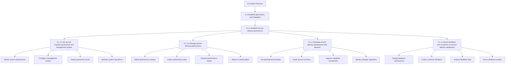
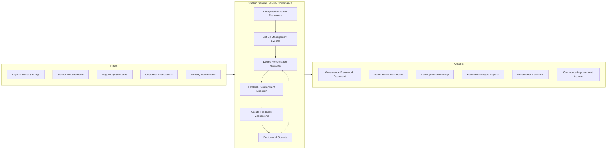
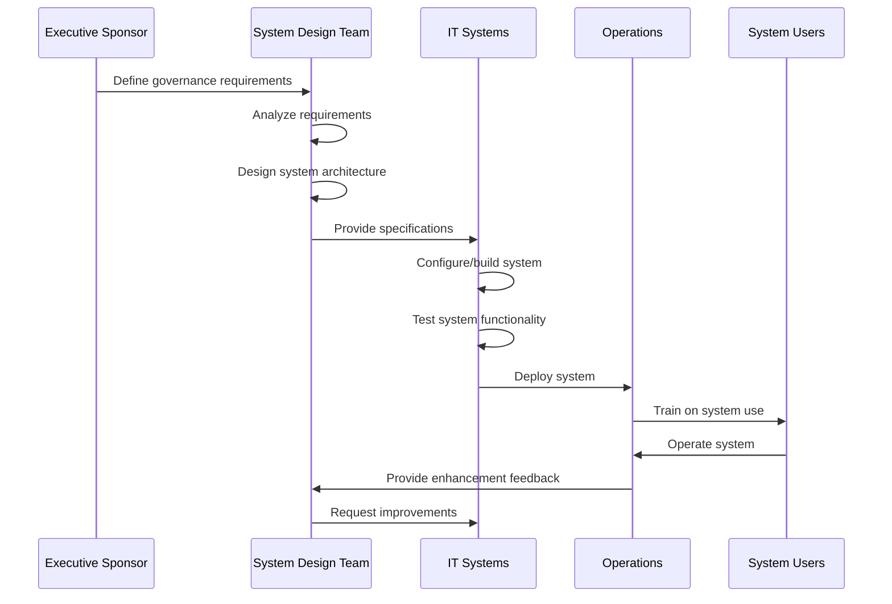
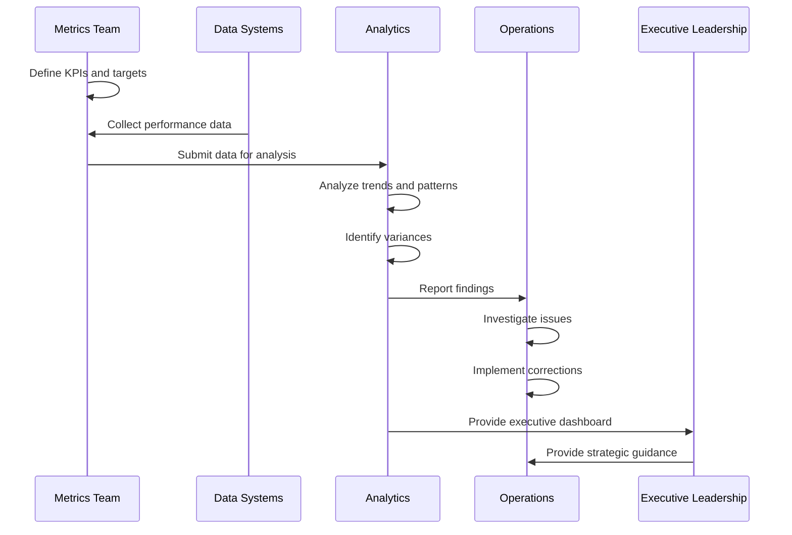
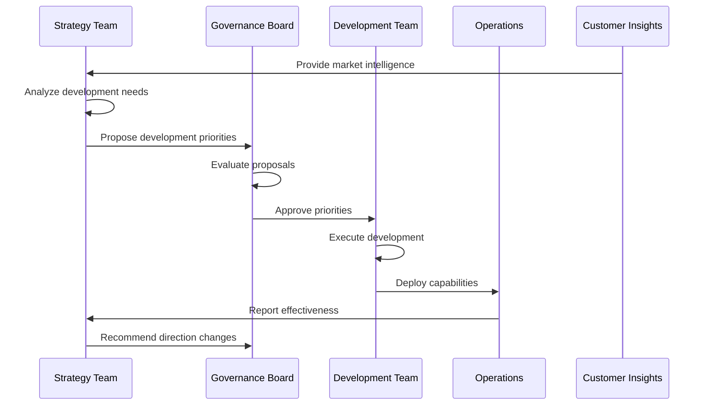
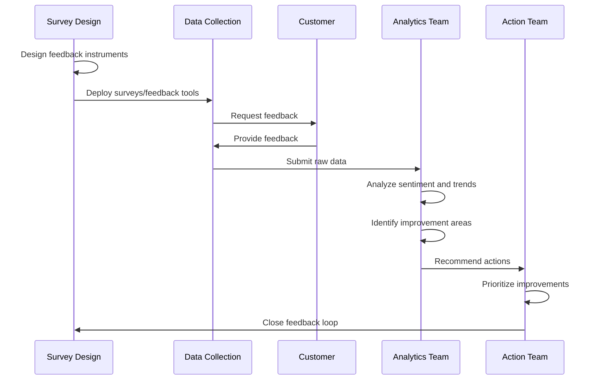
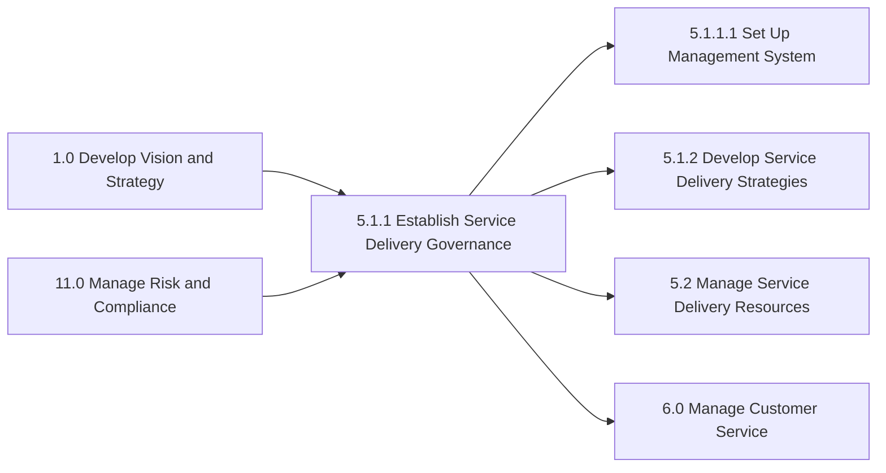

# Establish service delivery governance

> Establishing service delivery governance through a system that manages performance, development, and direction. Allow for customer feedback on delivery satisfaction.

## Overview

Establish service delivery governance (APQC 5.1.1) is the process of creating and maintaining the oversight framework that ensures service delivery meets organizational standards, customer expectations, and regulatory requirements. This process provides the structural foundation for consistent, high-quality service delivery across the organization.

The governance framework encompasses three interconnected elements: performance management (monitoring and measuring delivery effectiveness), development management (guiding the evolution and improvement of service capabilities), and directional management (steering service delivery toward strategic objectives). The framework also incorporates customer feedback mechanisms to ensure that governance decisions remain aligned with actual customer needs and satisfaction levels.

Effective governance enables organizations to maintain service quality at scale, respond appropriately to service failures, drive continuous improvement, and demonstrate accountability to stakeholders. Without robust governance, service delivery becomes inconsistent, quality degrades, and customer satisfaction suffers.

## Process Hierarchy



## Key Statistics

| Metric | Value |
|--------|-------|
| APQC Code | 20027 |
| Hierarchy ID | 5.1.1 |
| Level | Process |
| Category | [Deliver Services](/processes/05-Services) |
| Parent Process | [Establish governance and strategies](/processes/05-Services/GovernanceStrategies.mdx) |
| Activities | 4 |
| Tasks | 16+ |

## Process Flow



## GraphDL Semantic Structure

```
establish.ServiceDeliveryGovernance
```

| Component | Value | Description |
|-----------|-------|-------------|
| Verb | `establish` | Primary action of creating and institutionalizing |
| Object | `ServiceDeliveryGovernance` | Oversight and management framework |
| Preposition | - | Not applicable at this level |
| PrepObject | - | Not applicable at this level |

**Decomposed Semantic Structures:**
- `setUp.GovernanceManagementSystem` - Create management structure
- `manage.ServiceDeliveryPerformance` - Monitor and control performance
- `manage.ServiceDeliveryDevelopment.and.Direction` - Guide evolution
- `solicit.Feedback.from.Customer.on.ServiceDeliverySatisfaction` - Gather input

## Activities

### 5.1.1.1 - Set up and maintain service delivery governance and management system

Providing a system for which to manage customer needs and a structure for which to facilitate service delivery to fulfill those needs.



**Tasks:**
- `define.GovernanceSystemRequirements` - Document system needs and specifications
- `design.GovernanceArchitecture` - Create system structure and workflows
- `configure.ManagementSystem` - Set up technology and processes
- `deploy.GovernanceSystem` - Roll out to organization
- `train.SystemUsers` - Enable effective system use
- `maintain.SystemOperations` - Keep system current and effective

### 5.1.1.2 - Manage service delivery performance

Conducting and implementing performance measures to ensure successful delivery of service to the customer.



**Tasks:**
- `define.PerformanceMetrics` - Establish KPIs and measurement criteria
- `collect.PerformanceData` - Gather service delivery metrics
- `analyze.PerformanceTrends` - Evaluate patterns and variances
- `report.PerformanceResults` - Communicate findings to stakeholders
- `investigate.PerformanceIssues` - Examine root causes of variances
- `implement.PerformanceImprovements` - Execute corrective actions

### 5.1.1.3 - Manage service delivery development and direction

Providing guidance of resources to ensure that the development and direction of service delivery is in line with customer needs.



**Tasks:**
- `analyze.DevelopmentNeeds` - Assess capability gaps and opportunities
- `prioritize.DevelopmentInitiatives` - Rank improvement projects
- `approve.CapabilityInvestments` - Authorize development spending
- `monitor.DevelopmentProgress` - Track initiative execution
- `evaluate.DirectionalAlignment` - Ensure strategic fit
- `adjust.ServiceDirection` - Modify approach based on results

### 5.1.1.4 - Solicit feedback from customer on service delivery satisfaction

Engaging the customer post delivery to gauge the effectiveness of services rendered in order to improve on key delivery functions going forward.



**Tasks:**
- `design.FeedbackMechanisms` - Create feedback collection instruments
- `deploy.FeedbackChannels` - Implement collection methods
- `collect.CustomerFeedback` - Gather customer input
- `analyze.FeedbackData` - Extract insights from responses
- `identify.ImprovementAreas` - Determine enhancement priorities
- `act.OnFeedbackInsights` - Implement responsive improvements
- `close.FeedbackLoop` - Communicate actions to customers

## RACI Matrix

| Activity | Responsible | Accountable | Consulted | Informed |
|----------|-------------|-------------|-----------|----------|
| Design governance framework | Governance Team | COO | Legal, Compliance, IT | All managers |
| Set up management system | IT Team | CIO | Operations, Vendors | All staff |
| Define performance metrics | Analytics Team | Service Director | Operations, Finance | Executive team |
| Collect performance data | Operations Team | Operations Manager | IT, QA | Analytics |
| Analyze performance trends | Analytics Team | Service Director | Operations | Executive team |
| Report performance results | Analytics Team | Service Director | - | All stakeholders |
| Set development priorities | Strategy Team | VP Services | Operations, Finance | Development teams |
| Guide service evolution | Governance Board | COO | All departments | All staff |
| Approve capability investments | Governance Board | CFO | Finance, Operations | Development teams |
| Design feedback mechanisms | Customer Success | Service Director | Marketing, IT | Operations |
| Collect customer feedback | Customer Success | Service Director | Sales | All service staff |
| Analyze feedback data | Analytics Team | Service Director | Customer Success | Executive team |
| Act on feedback insights | Operations Team | Service Director | Customer Success | Customers |

## Related Departments

- [Operations](/departments/Operations/index) - Primary governance implementation
- [Information Technology](/departments/Technology) - Management system development
- [Quality Assurance](/departments/Quality) - Performance standards and monitoring
- Customer Success - Feedback collection and analysis
- [Strategy](/departments/Strategy/index) - Development direction
- [Finance](/departments/Finance/index) - Investment approval
- Compliance - Regulatory alignment

## Related Occupations

- [General and Operations Managers](/occupations/GeneralManagers) - Governance oversight
- [Management Analysts](/occupations/Business/Operations/ManagementAnalysts) - Performance analysis
- [Business Intelligence Analysts](/occupations/BusinessIntelligence) - Data analytics
- [Quality Control Analysts](/occupations/QualityAnalysts) - Quality monitoring
- [Customer Service Managers](/occupations/CustomerServiceManagers) - Feedback management
- [Computer Systems Analysts](/occupations/SystemsAnalysts) - Management system design
- [Training and Development Specialists](/occupations/TrainingSpecialists) - System training

## Industry Variations

### Healthcare Provider

Healthcare governance must integrate with clinical governance structures, patient safety organizations, and regulatory bodies. Performance metrics emphasize clinical outcomes, patient safety events, and quality measures required by CMS and Joint Commission.

**Industry-Specific Activities:**
- Integrate with medical staff governance
- Establish patient safety committee oversight
- Define clinical quality metrics (HEDIS, core measures)
- Create peer review governance
- Establish infection control governance
- Align with Magnet or other nursing excellence programs

### Banking

Banking governance requires integration with regulatory examination frameworks, enterprise risk management, and compliance programs. Performance management must address regulatory metrics, customer complaint tracking, and audit findings.

**Industry-Specific Activities:**
- Align with OCC/Fed examination requirements
- Integrate with enterprise risk framework
- Establish BSA/AML compliance governance
- Create customer complaint governance
- Define fair lending monitoring processes
- Establish cybersecurity governance

### Aerospace and Defense

Defense governance requires security clearance management, ITAR compliance tracking, and government audit readiness. Development direction must align with long-term government contracting strategies and technology roadmaps.

**Industry-Specific Activities:**
- Establish classified program governance
- Create ITAR compliance monitoring
- Define DCAA audit readiness processes
- Integrate with program management office
- Establish supplier performance governance
- Create technology readiness level tracking

### Professional Services

Professional services governance emphasizes engagement quality, professional standards compliance, and knowledge management. Performance metrics focus on client satisfaction, utilization, and methodology adherence.

**Industry-Specific Activities:**
- Establish engagement risk governance
- Create quality review processes
- Define independence monitoring
- Establish knowledge management governance
- Create continuing education tracking
- Define professional standards compliance

### Airline

Airline governance must integrate with Safety Management Systems (SMS) and regulatory compliance programs. Performance management addresses on-time performance, safety metrics, and customer satisfaction tracking required by DOT.

**Industry-Specific Activities:**
- Integrate with Safety Management System
- Establish FAA compliance governance
- Create operational control governance
- Define crew resource management
- Establish irregular operations governance
- Create customer experience governance

### Utilities

Utilities governance integrates with public utility commission requirements, safety programs, and reliability standards. Performance metrics address service reliability, safety incidents, and regulatory compliance.

**Industry-Specific Activities:**
- Align with PUC regulatory requirements
- Integrate with NERC reliability standards
- Establish outage management governance
- Create worker safety governance
- Define environmental compliance monitoring
- Establish emergency response governance

## Sub-Processes

| Process | Code | Description |
|---------|------|-------------|
| [Set up and maintain service delivery governance and management system](./ManagementSystem.mdx) | 5.1.1.1 | Provide system for managing customer needs |
| Manage service delivery performance | 5.1.1.2 | Implement and monitor performance measures |
| Manage service delivery development and direction | 5.1.1.3 | Guide service evolution and improvement |
| Solicit feedback from customer on service delivery satisfaction | 5.1.1.4 | Gather customer satisfaction input |

## Related Processes



## Metrics & KPIs

| Metric | Description | Target |
|--------|-------------|--------|
| Governance Policy Compliance | Adherence to governance policies | >95% |
| Performance Dashboard Accuracy | Data accuracy in reporting | >99% |
| KPI Target Achievement | Metrics meeting defined targets | >85% |
| Customer Feedback Response Rate | Feedback surveys completed | >40% |
| Feedback Action Rate | Feedback items resulting in action | >80% |
| Development Initiative On-Time | Development projects on schedule | >90% |
| Governance Meeting Effectiveness | Decisions made per meeting | >5 |
| System Availability | Management system uptime | >99.5% |
| Audit Finding Resolution | Findings resolved within SLA | >95% |
| Continuous Improvement Index | Improvements implemented per quarter | >10 |

---

*Source: APQC PCF 20027 (5.1.1) - Cross-Industry*
