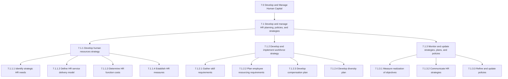
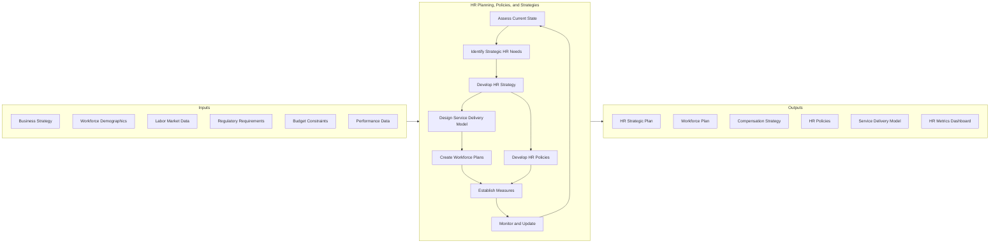
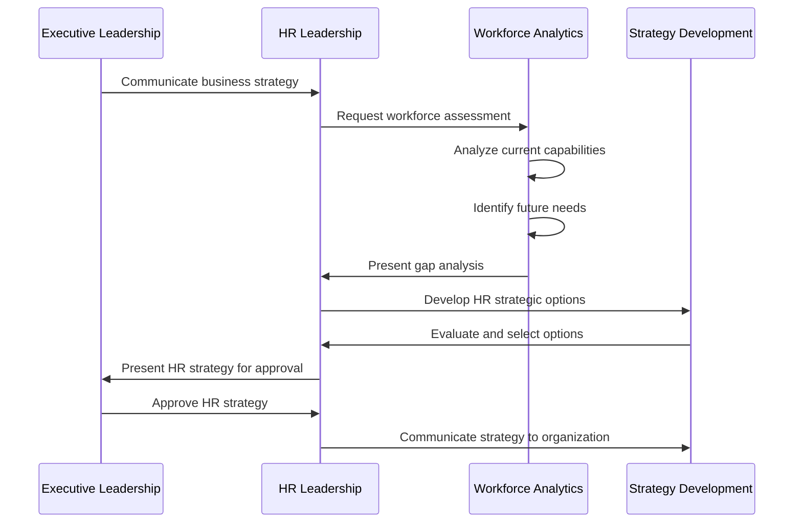
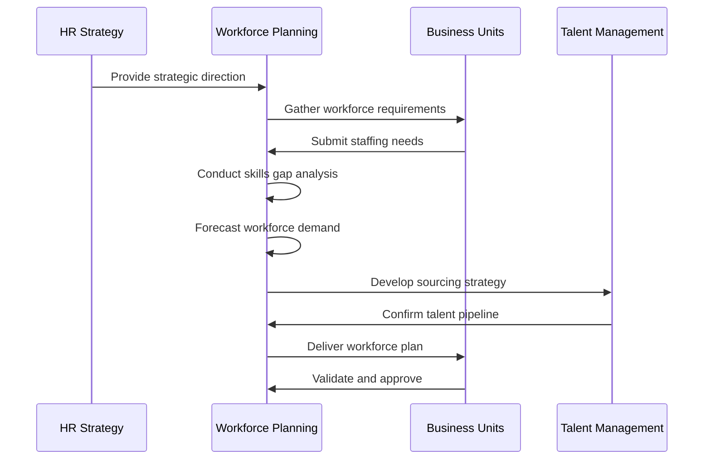
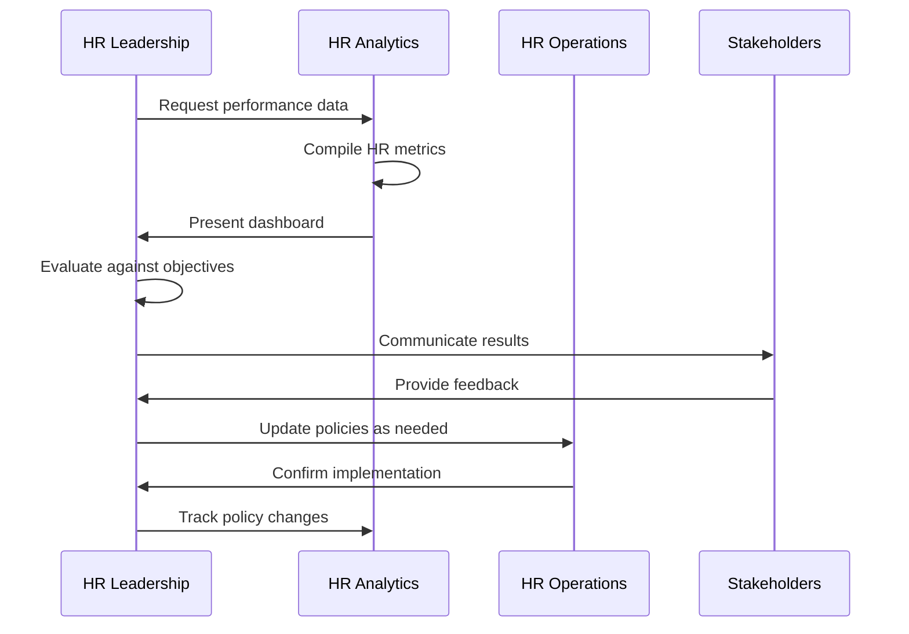
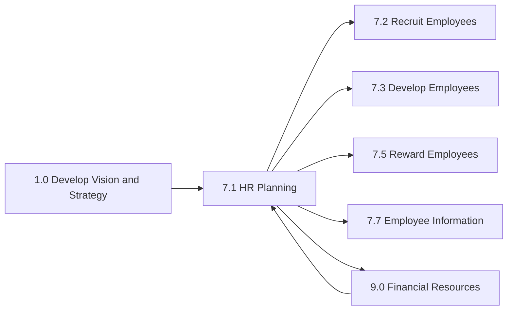

# Develop and manage human resources planning, policies, and strategies

> Creating strategies for the HR function. Create and implement strategies for managing the work force. Supervise and enhance the strategies, plans, and policies supporting the HR function. Developing models for managing competency levels of the HR of the organization.

## Overview

Develop and manage human resources planning, policies, and strategies (Process 7.1) is the foundational process group within Human Capital management. This process establishes the strategic framework that guides all other HR activities, ensuring workforce management aligns with organizational objectives.

This process group encompasses strategic HR planning, workforce planning, HR service delivery model design, policy development, and performance measurement. It transforms HR from an administrative function to a strategic business partner that actively contributes to organizational success.

Effective HR planning requires understanding both current workforce capabilities and future business needs, then developing strategies to bridge any gaps through recruitment, development, retention, and organizational design initiatives.

## Process Hierarchy



## Key Statistics

| Metric | Value |
|--------|-------|
| APQC Code | 17043 |
| Hierarchy ID | 7.1 |
| Level | Process Group |
| Category | [Develop and Manage Human Capital](/processes/07-HR) |
| Sub-Processes | 3 |
| Activities | 15+ |

## Process Flow



## GraphDL Semantic Structure

```
develop.AndManage.HumanResourcesPlanning.policies.AndStrategies
```

| Component | Value | Description |
|-----------|-------|-------------|
| Verb | `develop` | Primary action of creating and establishing |
| Object | `AndManage` | Combined creation and ongoing management |
| Preposition | `policies` | Focus area for planning |
| PrepObject | `AndStrategies` | Strategic elements including workforce plans |

## Activities

### 7.1.1 - Develop human resources strategy

Creating a long-term plan to associate human resource requirements with the strategic goals of the company to ensure that there is enough qualified staffing to achieve those goals, maintain competitive advantage, and reduce employee turnover.



**Tasks:**
- `identify.StrategicHRNeeds` - Define current and future HR requirements aligned with business strategy
- `define.HRServiceDeliveryModel` - Establish how HR services will be delivered across the organization
- `determine.HRFunctionCosts` - Calculate total cost of HR operations and investments
- `establish.HRMeasures` - Create KPIs to evaluate HR function performance

### 7.1.2 - Develop and implement workforce strategy

Evaluating the current and future skill requirements of the organization with regard to the overall corporate strategy and market conditions. Identifying and establishing the minimum skills needed for requisite HR needs.



**Tasks:**
- `gather.SkillRequirements` - Evaluate skills needed per corporate strategy and market conditions
- `plan.EmployeeResourcingRequirements` - Determine staffing needs per business unit
- `develop.CompensationPlan` - Design total rewards strategy and pay structures
- `develop.DiversityPlan` - Create workforce diversity and inclusion initiatives

### 7.1.3 - Monitor and update strategies, plans, and policies

Measuring the realization of the objectives of the HR policies. Communicating HR policies and strategies throughout the organization. Revising and improving strategies, plans, and policies based on feedback and results.



**Tasks:**
- `measure.ObjectiveRealization` - Assess achievement of HR strategic objectives
- `communicate.HRStrategies` - Share HR plans and policies with organization
- `refine.Policies` - Update and improve HR policies based on outcomes
- `align.WorkforceMetrics` - Ensure metrics support strategic goals

## RACI Matrix

| Activity | Responsible | Accountable | Consulted | Informed |
|----------|-------------|-------------|-----------|----------|
| Develop HR strategy | VP HR/CHRO | CEO | Executive team | All employees |
| Conduct workforce planning | HR Planning | CHRO | Business unit leaders | Finance |
| Design service delivery model | HR Operations | CHRO | IT, Finance | HR staff |
| Develop compensation strategy | Compensation | CHRO | Finance, Legal | Employees |
| Create HR policies | HR Policy Team | CHRO | Legal, Compliance | Managers |
| Establish HR metrics | HR Analytics | CHRO | Finance | Executive team |
| Monitor strategy execution | HR Leadership | CHRO | Business units | Board |
| Update policies | HR Operations | CHRO | Legal | All employees |

## Related Departments

- [Human Resources](/departments/HR/index) - Primary ownership and execution of HR strategy
- [Executive Office](/departments/Executive/index) - Strategic alignment and approval
- [Finance](/departments/Finance/index) - Budget allocation and cost management
- [Legal](/departments/Legal/index) - Policy compliance and employment law
- [Information Technology](/departments/Technology) - HR technology and HRIS support

## Related Occupations

- [Human Resources Managers](/occupations/HRManagers) - HR strategy development and execution
- [Compensation and Benefits Managers](/occupations/CompensationManagers) - Total rewards strategy
- [Training and Development Managers](/occupations/TrainingManagers) - Learning strategy alignment
- [Management Analysts](/occupations/Business/Operations/ManagementAnalysts) - Strategic planning support
- [Statisticians](/occupations/Technology/Statisticians) - Workforce analytics and forecasting

## Industry Variations

### Aerospace and Defense

HR planning in aerospace emphasizes long-term workforce planning (10-20 year horizons) due to extended development cycles. Security clearance planning, ITAR compliance training, and specialized engineering talent pipelines are critical.

**Industry-Specific Activities:**
- Plan security clearance requirements for positions
- Develop engineering talent pipeline strategies
- Create succession plans for critical technical roles
- Align workforce plans with defense budget cycles

### Banking

Banking HR strategy focuses heavily on regulatory compliance, particularly around compensation governance (Dodd-Frank, Basel requirements). Risk culture development and digital transformation skills are strategic priorities.

**Industry-Specific Activities:**
- Develop compensation plans within regulatory limits
- Plan for regulatory training requirements
- Build digital and fintech skill capabilities
- Create risk culture development programs

### Healthcare Provider

Healthcare HR planning addresses complex clinical credentialing, licensure management, and workforce burnout prevention. Shift scheduling optimization and union relations planning are often critical.

**Industry-Specific Activities:**
- Plan clinical credentialing and licensure tracking
- Develop burnout prevention programs
- Create flexible staffing models for 24/7 operations
- Design union negotiation strategies

### Retail

Retail HR strategy emphasizes high-volume seasonal hiring planning, part-time workforce optimization, and labor cost management. Turnover reduction in frontline roles is a key strategic focus.

**Industry-Specific Activities:**
- Develop seasonal hiring surge plans
- Create part-time workforce scheduling strategies
- Design turnover reduction programs
- Plan labor cost optimization initiatives

### Life Sciences

Life sciences HR planning focuses on highly specialized scientific talent acquisition, research team development, and compliance with GxP regulations. Global workforce mobility planning is often critical.

**Industry-Specific Activities:**
- Plan specialized scientific talent acquisition
- Develop R&D career path frameworks
- Create GxP compliance training strategies
- Design global mobility programs

## Sub-Processes

| Process | Code | Description |
|---------|------|-------------|
| [Develop human resources strategy](./DevelopHRStrategy) | 7.1.1 | Create long-term HR strategic plan |
| [Develop and implement workforce strategy](./DevelopWorkforceStrategy) | 7.1.2 | Plan workforce requirements and sourcing |
| [Monitor and update strategies, plans, and policies](./MonitorAndUpdate) | 7.1.3 | Measure performance and refine approaches |

## Related Processes



## Metrics & KPIs

| Metric | Description | Target |
|--------|-------------|--------|
| HR Strategy Alignment Score | Degree of HR-business strategy alignment | >85% |
| Workforce Plan Accuracy | Forecast vs actual staffing needs | >90% |
| HR Cost as % of Revenue | Total HR spend relative to revenue | <3% |
| HR Service Delivery Cost | Cost per HR transaction | Industry benchmark |
| Policy Compliance Rate | Adherence to HR policies | >98% |
| Employee Satisfaction with HR | Survey score for HR services | >4.0/5.0 |
| Time to Implement Policy | Days to roll out new policies | <30 days |
| Strategic Initiative Completion | HR projects completed on time | >80% |

---

*Source: APQC PCF 17043 (7.1) - Cross-Industry*
