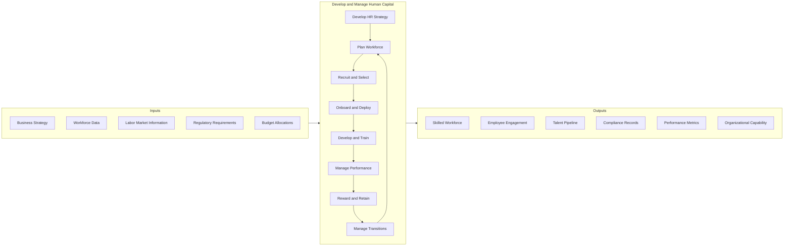
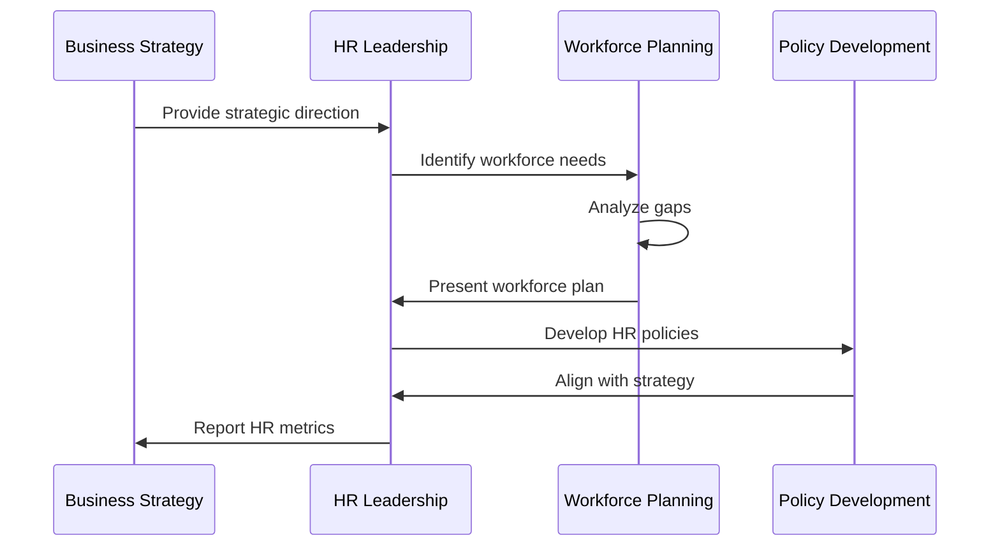
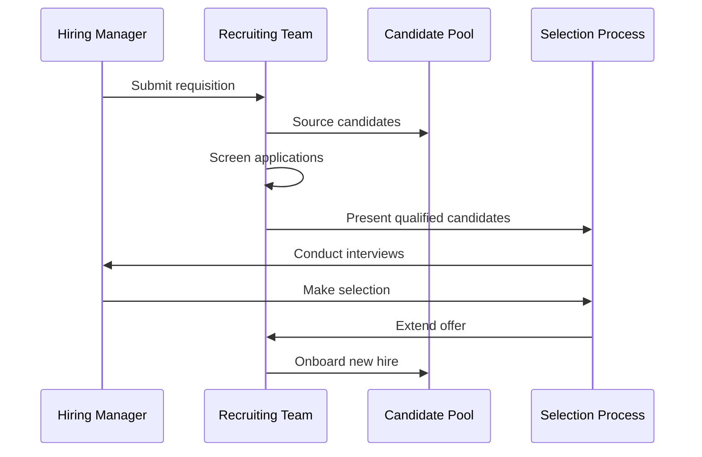
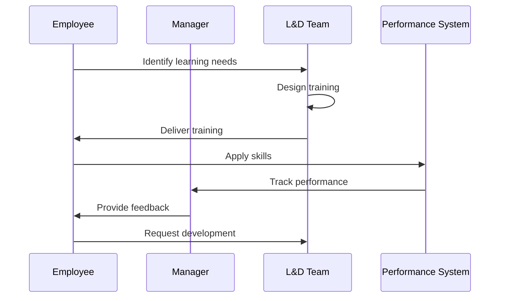
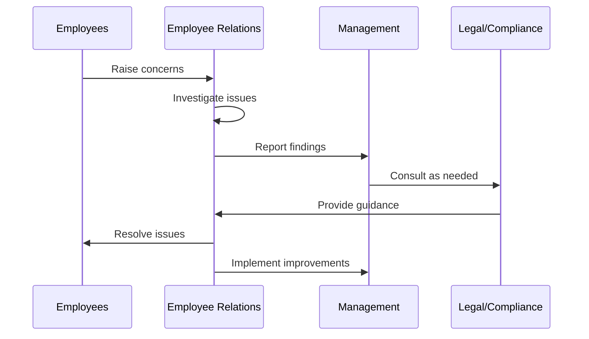
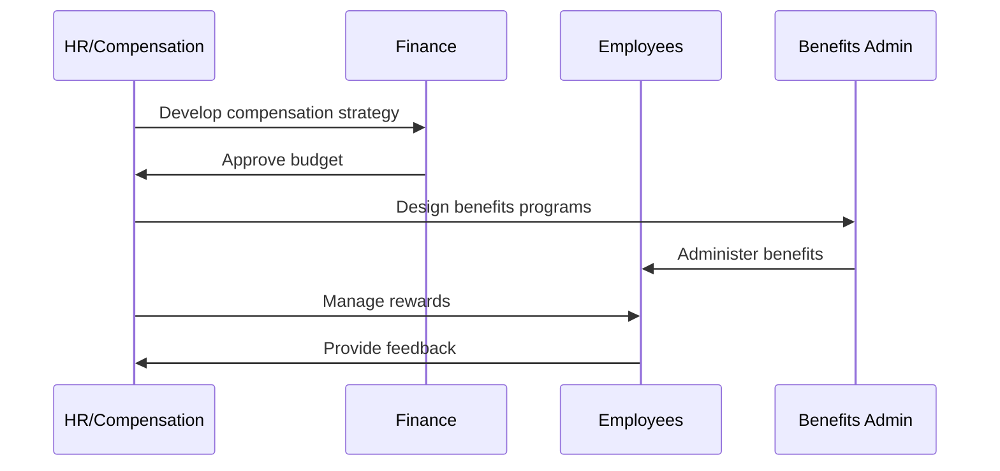
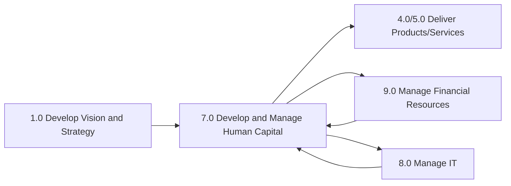

# Develop and Manage Human Capital

> Delivering processes traditionally defined as "human resources". Process groups include those related to developing and maintaining workforce strategy, recruiting employees, developing and counseling employees, managing employee relations, rewarding and retaining employees, redeploying and retiring employees, managing employee information, and managing employee communications.

## Overview

Develop and Manage Human Capital is APQC Process Classification Framework category 7.0, encompassing all activities related to the organization's workforce. This category represents the comprehensive set of processes that attract, develop, engage, and retain the human talent necessary to achieve organizational objectives.

In the modern business environment, human capital management has evolved from traditional personnel administration to a strategic function that directly impacts organizational performance. These processes ensure alignment between workforce capabilities and business strategy, create engaging employee experiences, and build organizational capabilities for current and future needs.

## Process Hierarchy

```mermaid
graph TD
    C7["7.0 Develop and Manage Human Capital"] --> G71["7.1 Develop and manage HR planning, policies, and strategies"]
    C7 --> G72["7.2 Recruit, source, and select employees"]
    C7 --> G73["7.3 Develop and counsel employees"]
    C7 --> G74["7.4 Manage employee relations"]
    C7 --> G75["7.5 Reward and retain employees"]
    C7 --> G76["7.6 Redeploy and retire employees"]
    C7 --> G77["7.7 Manage employee information and analytics"]
    C7 --> G78["7.8 Manage employee communication"]

    G71 --> P711["7.1.1 Develop HR strategy"]
    G71 --> P712["7.1.2 Develop and implement workforce strategy"]
    G71 --> P713["7.1.3 Monitor and update strategy"]

    G72 --> P721["7.2.1 Create and develop employee requisitions"]
    G72 --> P722["7.2.2 Recruit/Source candidates"]
    G72 --> P723["7.2.3 Screen and select candidates"]
    G72 --> P724["7.2.4 Manage new hire/re-hire"]
    G72 --> P725["7.2.5 Manage applicant information"]

    G73 --> P731["7.3.1 Manage employee orientation and deployment"]
    G73 --> P732["7.3.2 Manage employee performance"]
    G73 --> P733["7.3.3 Manage employee development"]
    G73 --> P734["7.3.4 Develop and train employees"]
```



## Key Statistics

| Metric | Value |
|--------|-------|
| APQC Code | 10007 |
| Hierarchy ID | 7.0 |
| Level | Category |
| Category | [Develop and Manage Human Capital](/processes/07-HR) |
| Process Groups | 8 |
| Total Sub-Processes | 150+ |

## Process Flow



## GraphDL Semantic Structure

```
develop.AndManage.HumanCapital
```

| Component | Value | Description |
|-----------|-------|-------------|
| Verb | `develop` | Primary action of building capabilities |
| Object | `AndManage` | Compound action including administration |
| Preposition | - | Not applicable at category level |
| PrepObject | `HumanCapital` | The workforce and its capabilities |

## Activities

### 7.1 - Develop and manage HR planning, policies, and strategies

Strategically defining the current and future needs for developing an efficient HR strategy. This includes identifying strategic HR needs, defining HR service delivery model, and establishing HR measures.



**Tasks:**
- `identify.StrategicHRNeeds` - Define current and future HR requirements
- `define.HRServiceDeliveryModel` - Establish how HR services are delivered
- `determine.HRCosts` - Ascertain costs and expenses of HR function
- `establish.HRMeasures` - Evaluate performance of HR function

### 7.2 - Recruit, source, and select employees

Creating and developing employee requisitions, recruiting and sourcing candidates, screening and selecting candidates, and managing new hire processes.



**Tasks:**
- `create.EmployeeRequisitions` - Develop job requirements and postings
- `recruit.Candidates` - Source potential employees
- `screen.Candidates` - Evaluate applicant qualifications
- `select.Candidates` - Choose and hire employees
- `manage.NewHire` - Onboard selected candidates

### 7.3 - Develop and counsel employees

Managing employee orientation, performance, and development. This includes designing and executing training programs, managing career development, and providing employee counseling.



**Tasks:**
- `manage.EmployeeOrientation` - Onboard and deploy employees
- `manage.EmployeePerformance` - Evaluate and guide performance
- `manage.EmployeeDevelopment` - Build employee capabilities
- `develop.TrainingPrograms` - Create learning opportunities

### 7.4 - Manage employee relations

Managing labor relations, collective bargaining, and employee grievances. Ensuring healthy workplace relationships and resolving conflicts.



**Tasks:**
- `manage.LaborRelations` - Handle union and collective bargaining matters
- `manage.CollectiveBargaining` - Negotiate labor agreements
- `manage.EmployeeGrievances` - Address and resolve complaints
- `manage.WorkplaceHealth` - Ensure safe work environment

### 7.5 - Reward and retain employees

Managing compensation, benefits, and recognition programs to attract, motivate, and retain employees.



**Tasks:**
- `develop.CompensationStrategy` - Design pay philosophy and structures
- `manage.Benefits` - Administer employee benefit programs
- `manage.Recognition` - Implement recognition programs
- `retain.Employees` - Execute retention strategies

## RACI Matrix

| Activity | Responsible | Accountable | Consulted | Informed |
|----------|-------------|-------------|-----------|----------|
| Develop HR strategy | HR Leadership | CHRO | Executive team | All employees |
| Plan workforce | HR Planning | CHRO | Business units | Finance |
| Recruit employees | Recruiting Team | HR Director | Hiring managers | Candidates |
| Onboard employees | HR Operations | HR Manager | IT, Facilities | New hires |
| Develop employees | L&D Team | CHRO | Managers | Employees |
| Manage performance | HR/Managers | CHRO | Employees | Executive team |
| Administer compensation | Compensation Team | CHRO | Finance | Employees |
| Manage employee relations | ER Team | CHRO | Legal | Management |

## Related Departments

- [Human Resources](/departments/HR/index) - Primary ownership of all HC processes
- [Finance](/departments/Finance/index) - Compensation and benefits budgeting
- [Legal](/departments/Legal/index) - Employment law compliance
- [Operations](/departments/Operations/index) - Workforce deployment
- [Information Technology](/departments/Technology) - HRIS and HR technology

## Related Occupations

- [Human Resources Managers](/occupations/HRManagers) - Overall HR leadership
- [Human Resources Specialists](/occupations/HRSpecialists) - HR process execution
- [Training and Development Managers](/occupations/TrainingManagers) - Learning programs
- [Compensation and Benefits Managers](/occupations/CompensationManagers) - Total rewards
- [Labor Relations Specialists](/occupations/Business/LaborRelationsSpecialists) - Union relations

## Industry Variations

### Aerospace and Defense

HR in aerospace emphasizes security clearance requirements, ITAR compliance, and specialized technical talent acquisition. Long development cycles require succession planning and knowledge management.

**Industry-Specific Activities:**
- Manage security clearance processes
- Develop engineering talent pipelines
- Plan for multi-decade projects
- Ensure ITAR and export control compliance

### Banking

Banking HR focuses on regulatory compliance, risk culture, and digital transformation skills. Compensation practices are heavily regulated.

**Industry-Specific Activities:**
- Ensure regulatory compliance training
- Manage compensation within regulatory limits
- Develop risk awareness culture
- Build digital and fintech capabilities

### Healthcare Provider

Healthcare HR addresses clinical licensure, credentialing, shift scheduling, and burnout prevention. Union relations are common in many healthcare settings.

**Industry-Specific Activities:**
- Manage clinical credentialing
- Address healthcare worker burnout
- Coordinate shift scheduling
- Ensure HIPAA training compliance

### Retail

Retail HR manages high-volume, seasonal hiring, part-time workforce, and high turnover. Employee scheduling and labor cost management are critical.

**Industry-Specific Activities:**
- Execute high-volume seasonal hiring
- Manage part-time workforce benefits
- Optimize labor scheduling
- Reduce turnover in frontline roles

## Sub-Processes

| Process | Code | Description |
|---------|------|-------------|
| [Develop and manage HR planning](./DevelopAndManageHRPlanning) | 7.1 | Strategic HR planning and policy development |
| [Recruit, source, and select employees](./RecruitSourceAndSelect) | 7.2 | Talent acquisition processes |
| [Develop and counsel employees](./DevelopAndCounselEmployees) | 7.3 | Employee development and performance |
| [Manage employee relations](./ManageEmployeeRelations) | 7.4 | Labor relations and workplace culture |
| [Reward and retain employees](./RewardAndRetainEmployees) | 7.5 | Compensation, benefits, and retention |
| [Redeploy and retire employees](./RedeployAndRetireEmployees) | 7.6 | Workforce transitions |
| [Manage employee information](./ManageEmployeeInformation) | 7.7 | HR data and analytics |
| [Manage employee communication](./ManageEmployeeCommunication) | 7.8 | Internal communications |

## Related Processes



## Metrics & KPIs

| Metric | Description | Target |
|--------|-------------|--------|
| Time to Fill | Average days to fill open positions | <45 days |
| Employee Turnover | Annual voluntary turnover rate | <15% |
| Employee Engagement | Annual engagement survey score | >75% |
| Training Hours | Average training hours per employee | >40 hours/year |
| HR Cost per Employee | Total HR cost divided by headcount | <$2,500 |
| Quality of Hire | New hire performance ratings after 1 year | >85% meet expectations |
| Internal Fill Rate | Percentage of positions filled internally | >25% |
| Diversity Index | Workforce diversity metrics | Industry benchmark |

---

*Source: APQC PCF 10007 (7.0) - Cross-Industry*
