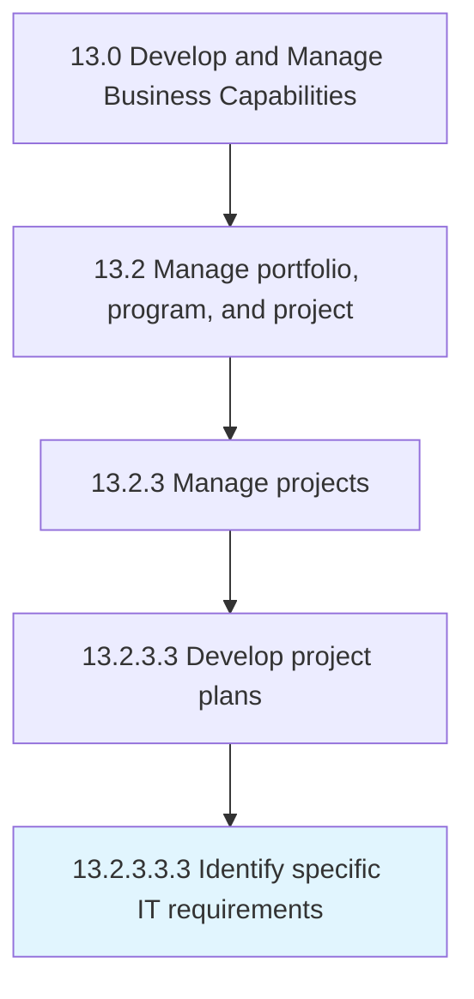

# Identify specific IT requirements

> Determining the IT requirements for specific business projects.

## Overview

Sub-Activity 13.2.3.3.3 is an activity within the Develop and Manage Business Capabilities framework. 

Determining the IT requirements for specific business projects. Identify the requirements of computers and telecommunications equipment to store, retrieve, transmit, and manipulate data related to the project. Consider factors such as functional requirements, design requirements, project phases, and project schedule.

## Process Hierarchy



## Key Statistics

| Metric | Value |
|--------|-------|
| APQC Code | 11124 |
| Hierarchy ID | 13.2.3.3.3 |
| Level | Sub-Activity |
| Parent | [13.2.3.3](../) |
| Sub-Processes | 0 |


## GraphDL Semantic Structure

```
identify.SpecificITRequirements
```

| Component | Value | Description |
|-----------|-------|-------------|
| Verb | `identify` | Primary action |
| Object | `specific IT requirements` | Direct object |


## Related Concepts

- SpecificITRequirements


---

*Source: APQC PCF 11124 (13.2.3.3.3) - APQC*
