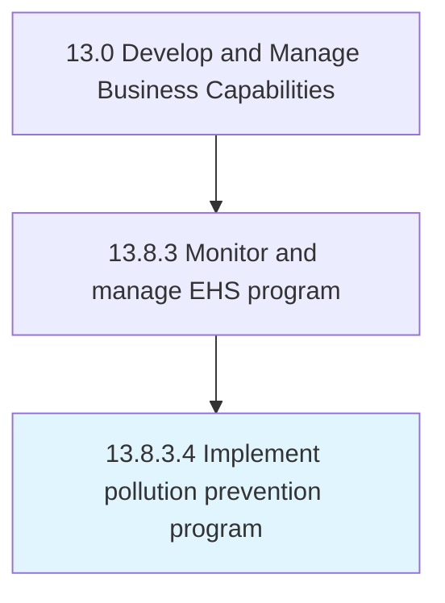

# Implement pollution prevention program

> Implementing a program that reduces or eliminates the creation of pollutants through increased efficiency in the use of raw materials, energy, water, or other resources.

## Overview

Activity 13.8.3.4 is an activity within the Develop and Manage Business Capabilities framework. 

Implementing a program that reduces or eliminates the creation of pollutants through increased efficiency in the use of raw materials, energy, water, or other resources. Implement a program to inspect facilities that store, manufacture, or use hazardous, toxic, or polluting materials.

## Process Hierarchy



## Key Statistics

| Metric | Value |
|--------|-------|
| APQC Code | 11197 |
| Hierarchy ID | 13.8.3.4 |
| Level | Activity |
| Parent | [13.8.3](../) |
| Sub-Processes | 0 |


## GraphDL Semantic Structure

```
implement.PollutionPreventionProgram
```

| Component | Value | Description |
|-----------|-------|-------------|
| Verb | `implement` | Primary action |
| Object | `pollution prevention program` | Direct object |


## Related Concepts

- PollutionPreventionProgram


---

*Source: APQC PCF 11197 (13.8.3.4) - APQC*

## Related Occupations

- [General and Operations Managers](/occupations/Management/GeneralAndOperationsManagers)
- [Management Analysts](/occupations/Business/ManagementAnalysts)
- [Chief Executives](/occupations/Management/ChiefExecutives)

## Related Departments

- [Executive](/departments/Executive)
- [Operations](/departments/Operations)
- [Finance](/departments/Finance)
