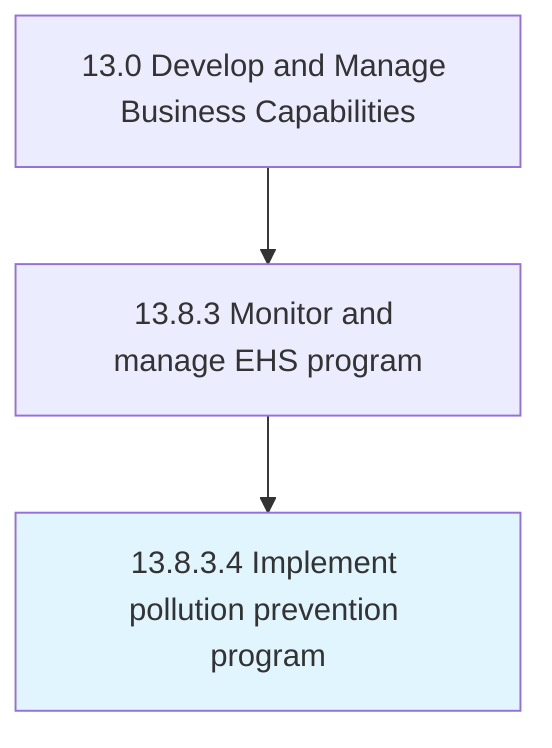

# Implement pollution prevention program

> Implementing a program that reduces or eliminates the creation of pollutants through increased efficiency in the use of raw materials, energy, water, or other resources.

## Overview

Activity 13.8.3.4 is an activity within the Develop and Manage Business Capabilities framework. 

Implementing a program that reduces or eliminates the creation of pollutants through increased efficiency in the use of raw materials, energy, water, or other resources. Implement a program to inspect facilities that store, manufacture, or use hazardous, toxic, or polluting materials.

## Process Hierarchy



## Key Statistics

| Metric | Value |
|--------|-------|
| APQC Code | 11197 |
| Hierarchy ID | 13.8.3.4 |
| Level | Activity |
| Parent | [13.8.3](../) |
| Sub-Processes | 0 |


## GraphDL Semantic Structure

```
implement.PollutionPreventionProgram
```

| Component | Value | Description |
|-----------|-------|-------------|
| Verb | `implement` | Primary action |
| Object | `pollution prevention program` | Direct object |


## Related Concepts

- PollutionPreventionProgram


---

*Source: APQC PCF 11197 (13.8.3.4) - APQC*

## Related Occupations

- [Environmental Scientists and Specialists](/occupations/LifeScience/EnvironmentalScientistsAndSpecialists)
- [Environmental Compliance Inspectors](/occupations/Business/EnvironmentalComplianceInspectors)
- [Health and Safety Engineers](/occupations/Engineering/HealthAndSafetyEngineers)
- [Sustainability Specialists](/occupations/Business/SustainabilitySpecialists)
- [Environmental Engineers](/occupations/Engineering/EnvironmentalEngineers)

## Related Departments

- [Environmental Health and Safety](/departments/EHS)
- [Sustainability](/departments/Sustainability)
- [Operations](/departments/Operations)
- [Facilities](/departments/Facilities)
- [Compliance](/departments/Compliance)

## Industry Variations

This process applies universally across all industries, with the following common best practices:

### Universal Applicability

Pollution prevention programs are essential for all organizations with environmental impact. Proactive prevention reduces regulatory risk, operating costs, and reputational exposure.

### Cross-Industry Best Practices

| Practice | Description |
|----------|-------------|
| Source Reduction | Prioritize eliminating pollution at the source over end-of-pipe treatment |
| Material Substitution | Replace hazardous materials with safer alternatives |
| Process Optimization | Improve efficiency to reduce waste generation |
| Employee Engagement | Train and empower staff to identify prevention opportunities |
| Regulatory Tracking | Stay current with environmental regulations and anticipate changes |

### Common Metrics

- Waste generation reduction rate
- Hazardous material usage reduction
- Energy and water consumption efficiency
- Environmental incident rate
- Regulatory compliance rate
- Cost savings from prevention initiatives
